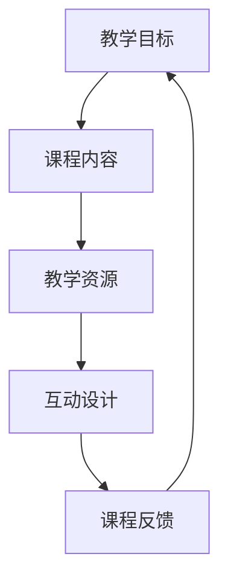

                 

关键词：在线教育、课程开发、程序员、视频制作、教学技巧

> 摘要：本文旨在为程序员提供一套系统的指导，帮助他们打造高质量的在线视频课程。通过深入探讨课程设计的原则、视频制作技巧、互动教学的方法以及后期优化和推广的策略，本文将帮助程序员将技术知识转化为吸引人的教学内容，提升在线课程的整体质量。

## 1. 背景介绍

随着互联网技术的发展，在线教育已经成为全球范围内学习的新趋势。程序员作为技术领域的专业人士，不仅拥有丰富的知识储备，还有独特的教学视角。然而，将专业知识转化为易于理解的教学内容，并非易事。程序员如何将自己的技术经验转化为高质量的在线视频课程，成为了当前的一个热点问题。

本文将围绕以下几个核心问题展开讨论：

- 如何设计一个引人入胜的课程大纲？
- 视频制作中应遵循哪些原则和技巧？
- 如何通过互动教学提升课程参与度？
- 课程完成后，如何进行优化和推广？

通过这些问题的探讨，我们将为程序员打造高质量的在线视频课程提供实用的指导。

## 2. 核心概念与联系

为了更好地理解课程开发的过程，我们首先需要明确几个核心概念：教学目标、课程内容、教学资源和互动设计。以下是这些概念之间的联系和流程，通过Mermaid流程图展示：



### 2.1 教学目标

教学目标是课程设计的核心。明确教学目标有助于确保课程内容的针对性和教学资源的有效利用。例如，如果您希望学员掌握某种编程语言的基本语法，那么教学目标就应该聚焦于此。

### 2.2 课程内容

课程内容是实现教学目标的手段。它包括理论讲解、实践操作、案例分析等多个方面。合理组织课程内容，有助于提高学员的学习效果。

### 2.3 教学资源

教学资源是课程内容的延伸，包括PPT、代码示例、视频资料等。丰富的教学资源能够提高学员的学习兴趣和参与度。

### 2.4 互动设计

互动设计是提升课程质量的关键。通过提问、讨论、作业等形式，可以增强学员的参与感和学习动力。

### 2.5 课程反馈

课程反馈是优化课程的重要依据。通过收集学员的反馈，可以及时调整课程内容和方法，提升课程质量。

## 3. 核心算法原理 & 具体操作步骤

### 3.1 算法原理概述

在课程开发中，算法原理是我们需要掌握的核心知识。算法原理包括算法设计、算法分析、算法优化等。下面我们以“排序算法”为例，介绍算法原理的具体操作步骤。

### 3.2 算法步骤详解

排序算法的目的是将一组无序数据按照某种规则重新排列，常见的排序算法有冒泡排序、选择排序、插入排序等。

#### 3.2.1 冒泡排序

冒泡排序的基本思想是比较相邻的两个元素，如果它们的顺序错误就把它们交换过来。遍历整个数组多次，直到没有需要交换的元素为止。

```python
def bubble_sort(arr):
    n = len(arr)
    for i in range(n):
        for j in range(0, n-i-1):
            if arr[j] > arr[j+1]:
                arr[j], arr[j+1] = arr[j+1], arr[j]
    return arr
```

#### 3.2.2 选择排序

选择排序的基本思想是在未排序序列中找到最小（大）元素，存放到排序序列的起始位置，然后，再从剩余未排序元素中继续寻找最小（大）元素，然后放到已排序序列的末尾。以此类推，直到所有元素均排序完毕。

```python
def selection_sort(arr):
    n = len(arr)
    for i in range(n):
        min_idx = i
        for j in range(i+1, n):
            if arr[j] < arr[min_idx]:
                min_idx = j
        arr[i], arr[min_idx] = arr[min_idx], arr[i]
    return arr
```

#### 3.2.3 插入排序

插入排序的基本思想是将一个记录插入到已经排好序的有序表中，从而得到一个新的、记录数增加1的有序表。插入算法提出一种折半查找方法，将关键字与有序表中的关键字进行比较，找到适当位置将其插入。

```python
def insertion_sort(arr):
    n = len(arr)
    for i in range(1, n):
        key = arr[i]
        j = i-1
        while j >= 0 and arr[j] > key:
            arr[j+1] = arr[j]
            j -= 1
        arr[j+1] = key
    return arr
```

### 3.3 算法优缺点

每种排序算法都有其优缺点。冒泡排序和选择排序的时间复杂度都是O(n^2)，但在数据量较小的情况下，它们的性能表现良好。插入排序的时间复杂度为O(n^2)，但在数据基本有序的情况下，性能会大大提升。

### 3.4 算法应用领域

排序算法在许多领域都有广泛的应用，如数据库索引、搜索引擎排序、数据处理等。程序员在开发这些应用时，需要根据具体场景选择合适的排序算法。

## 4. 数学模型和公式 & 详细讲解 & 举例说明

在课程开发中，数学模型和公式是解释复杂概念的有力工具。以下我们通过一个简单的数学模型——牛顿迭代法——来讲解数学公式的构建和推导过程。

### 4.1 数学模型构建

牛顿迭代法是一种求解非线性方程的数值方法。其基本思想是利用函数在某一点的切线逼近函数值，逐步逼近方程的解。

### 4.2 公式推导过程

假设我们有一个非线性方程：

$$ f(x) = 0 $$

牛顿迭代法的迭代公式为：

$$ x_{n+1} = x_n - \frac{f(x_n)}{f'(x_n)} $$

其中，$x_n$是第n次迭代的近似解，$f(x_n)$是函数在$x_n$处的函数值，$f'(x_n)$是函数在$x_n$处的导数值。

### 4.3 案例分析与讲解

以下是一个求解方程$f(x) = x^2 - 2 = 0$的案例：

1. **初始猜测**：我们可以先选择一个初始值$x_0 = 1$。
2. **第一次迭代**：计算$f(x_0) = 1^2 - 2 = -1$和$f'(x_0) = 2 \cdot 1 = 2$，代入迭代公式得：

$$ x_1 = x_0 - \frac{f(x_0)}{f'(x_0)} = 1 - \frac{-1}{2} = 1.5 $$

3. **第二次迭代**：计算$f(x_1) = 1.5^2 - 2 = -0.25$和$f'(x_1) = 2 \cdot 1.5 = 3$，代入迭代公式得：

$$ x_2 = x_1 - \frac{f(x_1)}{f'(x_1)} = 1.5 - \frac{-0.25}{3} = 1.375 $$

4. **第三次迭代**：重复以上步骤，直到满足收敛条件（例如，两次迭代的误差小于某个阈值）。

通过以上步骤，我们可以得到方程的近似解。牛顿迭代法在求解非线性方程时具有高效、收敛速度快的特点。

## 5. 项目实践：代码实例和详细解释说明

### 5.1 开发环境搭建

为了便于读者理解，我们将在Python环境中实现一个简单的在线课程管理系统。首先，我们需要安装Python和必要的库。

```bash
pip install flask
```

### 5.2 源代码详细实现

以下是一个简单的在线课程管理系统的代码示例：

```python
from flask import Flask, render_template, request, redirect, url_for

app = Flask(__name__)

# 课程列表
courses = [
    {'id': 1, 'title': 'Python基础教程'},
    {'id': 2, 'title': '数据结构与算法'},
    {'id': 3, 'title': 'Web开发入门'}
]

@app.route('/')
def index():
    return render_template('index.html', courses=courses)

@app.route('/course/<int:course_id>')
def course_detail(course_id):
    course = next((c for c in courses if c['id'] == course_id), None)
    if course:
        return render_template('course.html', course=course)
    else:
        return '课程不存在'

@app.route('/add_course', methods=['POST'])
def add_course():
    new_course = {
        'id': len(courses) + 1,
        'title': request.form['title']
    }
    courses.append(new_course)
    return redirect(url_for('index'))

if __name__ == '__main__':
    app.run(debug=True)
```

### 5.3 代码解读与分析

上述代码是一个简单的Flask应用程序，用于管理在线课程。我们首先定义了一个课程列表`courses`，然后通过Flask的`@app.route`装饰器定义了几个URL路由。

- `index()`函数：返回主页，展示所有课程。
- `course_detail()`函数：根据课程ID返回特定课程的详细信息。
- `add_course()`函数：接收POST请求，添加新的课程到课程列表。

### 5.4 运行结果展示

运行该应用程序后，我们可以访问`http://127.0.0.1:5000/`来查看主页，点击课程标题可以查看具体课程详情。通过在主页上提交表单，我们还可以添加新的课程。

```html
<!DOCTYPE html>
<html>
<head>
    <title>在线课程管理系统</title>
</head>
<body>
    <h1>在线课程管理系统</h1>
    <ul>
        
            <li><a href="{{ url_for('course_detail', course_id=course.id) }}">{{ course.title }}</a></li>
        
    </ul>
    <h2>添加课程</h2>
    <form method="post" action="{{ url_for('add_course') }}">
        <input type="text" name="title" placeholder="课程标题">
        <input type="submit" value="添加">
    </form>
</body>
</html>
```

```html
<!DOCTYPE html>
<html>
<head>
    <title>{{ course.title }}</title>
</head>
<body>
    <h1>{{ course.title }}</h1>
    <p>课程ID: {{ course.id }}</p>
</body>
</html>
```

## 6. 实际应用场景

在线视频课程的应用场景非常广泛，以下列举几个典型的应用场景：

- **技能培训**：程序员可以通过在线视频课程教授编程语言、数据库管理、Web开发等技能，帮助学员提升专业技能。
- **学术交流**：大学和科研机构可以通过在线视频课程分享学术研究成果，促进学术交流。
- **职业教育**：各类职业培训机构可以利用在线视频课程提供职业技能培训，如项目管理、市场营销等。
- **兴趣爱好**：程序员可以制作关于编程语言的趣味课程，吸引对编程感兴趣的学习者。

### 6.4 未来应用展望

随着人工智能和虚拟现实技术的发展，在线视频课程的应用将越来越广泛。以下是一些未来应用展望：

- **个性化学习**：通过大数据分析和人工智能技术，为学员提供个性化的学习路径和课程推荐。
- **沉浸式学习**：虚拟现实技术可以为学员提供沉浸式的学习体验，增强学习的趣味性和效果。
- **实时互动**：实时互动技术将使学员能够与讲师和其他学员进行实时交流，提高学习体验。

## 7. 工具和资源推荐

### 7.1 学习资源推荐

- 《Python编程：从入门到实践》
- 《深度学习》
- 《算法导论》

### 7.2 开发工具推荐

- **视频制作**：Camtasia、Filmora
- **直播工具**：Zoom、Microsoft Teams
- **在线教育平台**：Udemy、Coursera、EdX

### 7.3 相关论文推荐

- "在线教育平台的设计与实现"
- "深度学习在在线教育中的应用"
- "虚拟现实技术在教育领域的应用研究"

## 8. 总结：未来发展趋势与挑战

### 8.1 研究成果总结

在线教育作为新兴的教育模式，已经取得了显著的成果。通过在线视频课程，程序员可以将专业知识传授给全球的学习者，打破地域和时间的限制。

### 8.2 未来发展趋势

- **个性化学习**：通过大数据和人工智能技术，实现更精准的学习路径和课程推荐。
- **沉浸式学习**：虚拟现实技术将带来更加真实的在线学习体验。
- **实时互动**：实时互动技术将提升在线教育的互动性和参与度。

### 8.3 面临的挑战

- **内容质量**：如何确保课程内容的质量，满足学习者的需求。
- **技术支持**：如何提供稳定可靠的技术支持，保障课程运行。
- **版权问题**：如何处理知识产权问题，保护课程内容的版权。

### 8.4 研究展望

未来，在线教育将继续发展，成为教育领域的重要组成部分。程序员在打造高质量的在线视频课程过程中，需要不断创新和探索，以应对未来的挑战。

## 9. 附录：常见问题与解答

### 9.1 如何选择课程主题？

选择课程主题时，可以考虑以下几个方面：

- **自身专业领域**：选择自己擅长且感兴趣的领域。
- **市场需求**：研究市场需求，选择有潜力的主题。
- **内容深度**：根据学习者水平，选择适当的内容深度。

### 9.2 如何确保课程质量？

确保课程质量的关键在于：

- **内容审核**：课程内容应经过严格审核，确保准确性和完整性。
- **教学设计**：合理组织课程内容，采用合适的教学方法和互动设计。
- **反馈机制**：建立反馈机制，及时收集学员反馈，优化课程内容和方法。

### 9.3 如何推广课程？

推广课程的方法包括：

- **社交媒体**：利用社交媒体平台宣传课程。
- **合作伙伴**：与相关机构或媒体合作，扩大课程影响力。
- **广告投放**：通过在线广告渠道进行课程推广。

作者：禅与计算机程序设计艺术 / Zen and the Art of Computer Programming

