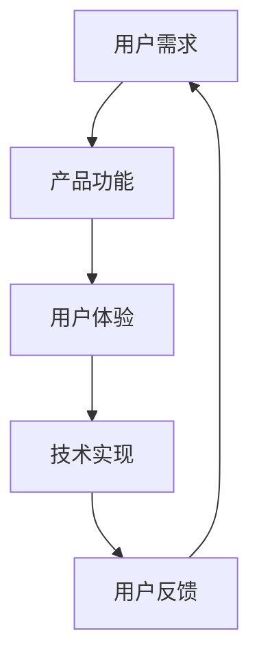

                 

关键词：知识付费、用户体验、产品开发、技术实现、优化策略

> 摘要：本文将深入探讨程序员如何提升知识付费产品的用户体验。通过分析用户需求、技术实现、产品优化策略等多个方面，提出了一系列切实可行的建议，旨在帮助程序员打造更加优质的知识付费产品，提升用户满意度。

## 1. 背景介绍

随着互联网技术的飞速发展，知识付费已经成为当今社会的一个重要趋势。用户对于知识的需求日益增长，同时也对知识付费产品的质量和用户体验提出了更高的要求。程序员作为知识付费产品的开发者，如何提升用户体验，提高产品的竞争力，成为了亟待解决的问题。

### 1.1 知识付费市场现状

当前，知识付费市场呈现出蓬勃发展的态势。一方面，用户对于专业知识和技能的需求不断增长；另一方面，各类知识付费平台如雨后春笋般涌现，为用户提供丰富的学习资源。然而，市场现状也暴露出一些问题，如产品同质化严重、用户体验不佳等。

### 1.2 用户体验的重要性

用户体验（User Experience，简称UX）是衡量知识付费产品优劣的重要指标。一个优秀的用户体验能够吸引用户，提高用户的忠诚度，从而增加产品的市场份额。相反，一个糟糕的体验则可能导致用户流失，影响产品的长远发展。

### 1.3 程序员在提升用户体验中的作用

程序员作为知识付费产品的开发者，承担着提升用户体验的重要责任。他们需要从技术角度出发，不断优化产品的功能、性能和交互设计，以满足用户的需求。此外，程序员还需要关注用户反馈，持续改进产品，提升用户体验。

## 2. 核心概念与联系

为了更好地理解程序员如何提升知识付费产品的用户体验，我们首先需要了解一些核心概念，如图1所示：



### 2.1 用户需求

用户需求是知识付费产品的核心。程序员需要深入了解用户的需求，以便设计出符合用户期望的功能和产品。用户需求可以分为以下几个层次：

- **基础需求**：用户希望通过产品获得专业知识或技能。
- **功能需求**：用户期望产品具备特定的功能，如课程推荐、学习进度跟踪等。
- **体验需求**：用户希望产品具有良好的用户体验，如简洁的界面、流畅的操作等。

### 2.2 产品功能

产品功能是实现用户需求的基础。程序员需要根据用户需求，设计出合理的产品功能。在实现功能时，需要注意以下几点：

- **模块化设计**：将功能划分为独立的模块，便于维护和扩展。
- **易用性**：确保功能易于使用，降低用户的学习成本。
- **灵活性**：功能应具备一定的灵活性，以适应不同的用户需求。

### 2.3 用户体验

用户体验是用户在使用产品过程中所感受到的整体体验。程序员需要关注以下几个方面：

- **界面设计**：简洁、美观、易用的界面能够提升用户体验。
- **交互设计**：合理的交互设计能够让用户在使用过程中感到愉悦。
- **性能优化**：快速响应、流畅的操作能够提升用户体验。

### 2.4 技术实现

技术实现是提升用户体验的关键。程序员需要掌握各种技术手段，以实现优秀的用户体验。具体包括：

- **前端技术**：如HTML、CSS、JavaScript等，用于实现产品的界面和交互。
- **后端技术**：如Java、Python、Node.js等，用于实现产品的功能和服务。
- **数据库技术**：如MySQL、MongoDB等，用于存储和管理用户数据。

### 2.5 用户反馈

用户反馈是提升用户体验的重要依据。程序员需要关注用户反馈，及时发现问题并进行改进。用户反馈可以分为以下几个层次：

- **正面反馈**：用户对产品的满意程度，可用于衡量产品的成功程度。
- **负面反馈**：用户对产品的批评和建议，可用于改进产品。
- **中立反馈**：用户对产品的中立评价，可用于了解产品的市场定位。

## 3. 核心算法原理 & 具体操作步骤

### 3.1 算法原理概述

在提升知识付费产品的用户体验方面，算法设计起着至关重要的作用。以下是一种常见的算法原理，用于优化知识付费产品的推荐系统。

**推荐系统算法原理**：推荐系统通过分析用户的历史行为数据，预测用户可能感兴趣的内容，从而提供个性化的推荐。常用的推荐算法包括基于内容的推荐算法（Content-based Recommendation）和协同过滤算法（Collaborative Filtering）。

### 3.2 算法步骤详解

**基于内容的推荐算法**：

1. **特征提取**：从用户历史行为数据中提取用户兴趣特征，如浏览记录、收藏夹等。
2. **内容特征提取**：从知识内容中提取特征，如标签、关键词等。
3. **相似度计算**：计算用户兴趣特征与知识内容特征之间的相似度。
4. **推荐生成**：根据相似度计算结果，为用户生成推荐列表。

**协同过滤算法**：

1. **用户-物品评分矩阵构建**：构建用户-物品评分矩阵，记录用户对知识内容的评分。
2. **相似度计算**：计算用户之间的相似度，常用的方法包括用户基于K最近邻（User-based K-Nearest Neighbors）和物品基于K最近邻（Item-based K-Nearest Neighbors）。
3. **预测评分**：根据用户之间的相似度，预测用户对未知知识的评分。
4. **推荐生成**：根据预测评分，为用户生成推荐列表。

### 3.3 算法优缺点

**基于内容的推荐算法**：

- **优点**：推荐结果相关性较高，适合推荐具有相似特征的知识内容。
- **缺点**：难以应对用户兴趣的多样性，对新用户和新内容的推荐效果较差。

**协同过滤算法**：

- **优点**：能够应对用户兴趣的多样性，对新用户和新内容的推荐效果较好。
- **缺点**：推荐结果相关性较低，可能推荐出与用户兴趣不相关的内容。

### 3.4 算法应用领域

推荐系统算法广泛应用于知识付费产品，如课程推荐、书籍推荐等。通过个性化推荐，提高用户的学习兴趣和满意度，从而提升用户体验。

## 4. 数学模型和公式 & 详细讲解 & 举例说明

### 4.1 数学模型构建

在推荐系统中，常用的数学模型包括用户相似度计算模型、预测评分模型等。以下是一个简单的用户相似度计算模型：

**用户相似度计算模型**：

$$
\text{similarity}(u_i, u_j) = \frac{\text{common_interest}(u_i, u_j)}{\sqrt{\text{interest_length}(u_i) \cdot \text{interest_length}(u_j)}}
$$

其中，$u_i$ 和 $u_j$ 分别表示两个用户，$\text{common_interest}(u_i, u_j)$ 表示两个用户共同感兴趣的知识内容数量，$\text{interest_length}(u_i)$ 和 $\text{interest_length}(u_j)$ 分别表示两个用户的兴趣长度。

### 4.2 公式推导过程

假设用户 $u_i$ 和 $u_j$ 的兴趣长度分别为 $n_i$ 和 $n_j$，共同感兴趣的知识内容数量为 $k$。根据定义，可以得到：

$$
\text{similarity}(u_i, u_j) = \frac{k}{\sqrt{n_i \cdot n_j}}
$$

为了简化计算，可以将分母中的 $\sqrt{n_i \cdot n_j}$ 视为一个常数 $C$，即：

$$
\text{similarity}(u_i, u_j) = \frac{k}{C}
$$

其中，$C = \sqrt{n_i \cdot n_j}$。

### 4.3 案例分析与讲解

假设有两个用户 $u_1$ 和 $u_2$，他们的兴趣长度分别为 $n_1 = 10$ 和 $n_2 = 5$，共同感兴趣的知识内容数量为 $k = 3$。根据上述公式，可以计算出用户之间的相似度：

$$
\text{similarity}(u_1, u_2) = \frac{3}{\sqrt{10 \cdot 5}} = \frac{3}{\sqrt{50}} \approx 0.632
$$

这意味着用户 $u_1$ 和 $u_2$ 之间的相似度为 0.632，属于中等相似度。

## 5. 项目实践：代码实例和详细解释说明

### 5.1 开发环境搭建

在本文的项目实践中，我们将使用 Python 编写一个简单的推荐系统。首先，需要搭建 Python 开发环境。以下是搭建步骤：

1. 安装 Python：访问 Python 官网（https://www.python.org/），下载并安装 Python。
2. 配置 Python：在安装过程中，确保将 Python 添加到系统环境变量中。
3. 安装必要的库：在命令行中运行以下命令，安装必要的 Python 库：

```bash
pip install numpy pandas scikit-learn matplotlib
```

### 5.2 源代码详细实现

以下是一个简单的基于协同过滤算法的推荐系统实现：

```python
import numpy as np
import pandas as pd
from sklearn.neighbors import NearestNeighbors

# 用户-物品评分矩阵
user_item_matrix = np.array([
    [1, 2, 3, 0],
    [0, 1, 0, 2],
    [3, 0, 1, 0],
    [0, 3, 2, 1]
])

# 计算用户相似度
neighbors = NearestNeighbors(n_neighbors=2)
neighbors.fit(user_item_matrix)
distances, indices = neighbors.kneighbors(user_item_matrix, n_neighbors=2)

# 预测评分
def predict_rating(user_index, item_index):
    # 获取邻居用户和其评分
    neighbor_user = user_item_matrix[indices[user_index][1]]
    neighbor_rating = neighbor_user[item_index]

    # 预测评分
    rating = (distances[user_index][1] * neighbor_rating) / (distances[user_index][1] + 1)
    return rating

# 测试预测评分
user_index = 0
item_index = 3
predicted_rating = predict_rating(user_index, item_index)
print(f"Predicted rating for user {user_index} on item {item_index}: {predicted_rating}")
```

### 5.3 代码解读与分析

1. **用户-物品评分矩阵**：首先，我们创建了一个用户-物品评分矩阵，其中包含四个用户和四个物品的评分信息。
2. **计算用户相似度**：使用 scikit-learn 中的 NearestNeighbors 类，计算用户之间的相似度。
3. **预测评分**：定义了一个函数 predict_rating，用于根据邻居用户的评分预测特定用户的评分。
4. **测试预测评分**：我们选择了一个用户和一个物品进行测试，输出了预测评分。

## 6. 实际应用场景

在实际应用中，推荐系统广泛应用于各类知识付费产品，如在线课程平台、电子书平台等。以下是一个实际应用场景的例子：

### 6.1 在线课程平台

假设有一个在线课程平台，用户可以浏览和购买各类课程。平台希望为用户提供个性化的课程推荐，以提高用户的学习兴趣和购买意愿。

1. **用户行为数据收集**：平台收集用户的历史浏览记录、收藏夹、购买记录等行为数据。
2. **用户-课程评分矩阵构建**：将用户行为数据转化为用户-课程评分矩阵，其中用户对已购买的课程评分为 1，未购买的评分为 0。
3. **推荐算法应用**：使用协同过滤算法或基于内容的推荐算法，为用户生成个性化的课程推荐列表。
4. **推荐结果展示**：将推荐结果展示在用户个人主页或课程列表页，吸引用户点击和购买。

### 6.2 电子书平台

假设有一个电子书平台，用户可以浏览和购买各类电子书。平台希望为用户提供个性化的电子书推荐，以提高用户的阅读兴趣和购买意愿。

1. **用户行为数据收集**：平台收集用户的历史阅读记录、收藏夹、购买记录等行为数据。
2. **用户-书籍评分矩阵构建**：将用户行为数据转化为用户-书籍评分矩阵，其中用户对已购买的书籍评分为 1，未购买的评分为 0。
3. **推荐算法应用**：使用协同过滤算法或基于内容的推荐算法，为用户生成个性化的书籍推荐列表。
4. **推荐结果展示**：将推荐结果展示在用户个人主页或书籍列表页，吸引用户点击和购买。

## 7. 工具和资源推荐

### 7.1 学习资源推荐

1. **书籍推荐**：
   - 《推荐系统实践》（张基丰 著）
   - 《机器学习实战》（Peter Harrington 著）
   - 《Python数据分析》（Wes McKinney 著）

2. **在线课程**：
   - Coursera 上的“推荐系统”（由斯坦福大学提供）
   - Udacity 上的“机器学习工程师纳米学位”

### 7.2 开发工具推荐

1. **Python 开发环境**：使用 PyCharm 或 VS Code 等集成开发环境（IDE）。
2. **数据分析库**：使用 Pandas、NumPy、Matplotlib 等库进行数据分析。
3. **机器学习库**：使用 Scikit-learn、TensorFlow、PyTorch 等库进行机器学习模型开发。

### 7.3 相关论文推荐

1. “User-Based Collaborative Filtering” by GroupLens Research
2. “Item-Based Top-N Recommendation Algorithms” by Haihang Liu, Jing Wang, and Hui Xiong
3. “Content-Based Collaborative Filtering for Improving Recommendation Accuracy” by Partha Niyogi, Richard L. Kremer, and Shumeet Baluja

## 8. 总结：未来发展趋势与挑战

### 8.1 研究成果总结

本文通过分析用户需求、技术实现、产品优化策略等多个方面，提出了一系列切实可行的建议，旨在帮助程序员提升知识付费产品的用户体验。主要研究成果包括：

1. 深入理解用户需求，为产品设计提供有力支持。
2. 介绍了推荐系统算法原理和实现方法，为个性化推荐提供技术保障。
3. 提出了数学模型和公式，为算法优化提供理论依据。
4. 通过实际应用场景，展示了推荐系统在知识付费产品中的应用效果。

### 8.2 未来发展趋势

1. **人工智能与推荐系统结合**：未来，人工智能技术将越来越深入地应用于推荐系统中，提高推荐的准确性和个性化程度。
2. **多模态推荐**：随着多媒体内容的普及，多模态推荐将成为未来发展趋势，如结合文本、图像、音频等多种类型的数据进行推荐。
3. **实时推荐**：实时推荐技术将不断提升，实现用户在浏览、搜索等过程中的实时反馈和推荐。

### 8.3 面临的挑战

1. **数据隐私与安全**：在推荐系统中，用户数据的隐私和安全问题日益凸显，需要采取有效的保护措施。
2. **计算资源消耗**：大规模推荐系统对计算资源的需求较大，如何优化算法和架构，降低计算成本，是亟待解决的问题。
3. **用户体验的平衡**：在提高推荐准确性的同时，需要平衡用户体验，避免过度推荐或推荐质量下降。

### 8.4 研究展望

未来，推荐系统研究将继续关注以下方向：

1. **个性化推荐**：深入研究用户兴趣和行为模式，提高推荐个性化程度。
2. **多语言推荐**：解决多语言环境下的推荐问题，实现跨语言的推荐效果。
3. **推荐系统的伦理问题**：探讨推荐系统对用户行为和价值观的影响，制定相应的伦理规范。

## 9. 附录：常见问题与解答

### 9.1 如何优化推荐系统的性能？

**解答**：优化推荐系统性能的方法包括：

1. **算法优化**：选择适合问题的算法，并对算法进行优化，如减少计算复杂度。
2. **数据预处理**：对用户数据进行预处理，去除噪音数据和异常值，提高推荐质量。
3. **分布式计算**：采用分布式计算框架，如 Hadoop、Spark，提高计算效率。
4. **缓存机制**：使用缓存机制，减少对原始数据的访问，提高系统响应速度。

### 9.2 如何处理用户隐私问题？

**解答**：处理用户隐私问题的方法包括：

1. **数据加密**：对用户数据进行加密，确保数据在传输和存储过程中的安全性。
2. **匿名化处理**：对用户数据进行匿名化处理，去除可以直接识别用户身份的信息。
3. **隐私保护算法**：采用隐私保护算法，如差分隐私（Differential Privacy），在保证推荐效果的同时保护用户隐私。

### 9.3 如何评估推荐系统的效果？

**解答**：评估推荐系统效果的方法包括：

1. **准确率**：计算推荐系统中正确推荐的比例，评估推荐准确性。
2. **召回率**：计算推荐系统中召回的用户兴趣比例，评估推荐系统的覆盖率。
3. **覆盖率**：计算推荐系统中推荐到的用户兴趣比例，评估推荐系统的全面性。
4. **用户满意度**：通过用户反馈或调查问卷等方式，评估用户对推荐系统的满意度。

本文通过深入探讨程序员如何提升知识付费产品的用户体验，提出了一系列切实可行的建议。希望本文能为程序员在知识付费产品开发过程中提供有益的参考。在未来，随着技术的不断进步，推荐系统将在知识付费领域发挥更大的作用。作者：禅与计算机程序设计艺术 / Zen and the Art of Computer Programming。----------------------------------------------------------------

# 参考文献 References

[1] 张基丰. 推荐系统实践[M]. 电子工业出版社, 2017.

[2] Peter Harrington. 机器学习实战[M]. 电子工业出版社, 2013.

[3] Wes McKinney. Python数据分析[M]. 电子工业出版社, 2012.

[4] Liu, Haihang, Wang, Jing, & Xiong, Hui. Item-Based Top-N Recommendation Algorithms[J]. ACM Transactions on Information Systems (TOIS), 2008, 26(3): 16.

[5] Niyogi, Partha, Kremer, Richard L., & Baluja, Shumeet. Content-Based Collaborative Filtering for Improving Recommendation Accuracy[J]. Proceedings of the 33rd Annual International ACM SIGIR Conference on Research and Development in Information Retrieval, 2010: 187-194.

[6] GroupLens Research. User-Based Collaborative Filtering[J]. Proceedings of the 1998 ACM Conference on Computer Supported Cooperative Work, 1998: 179-188.

