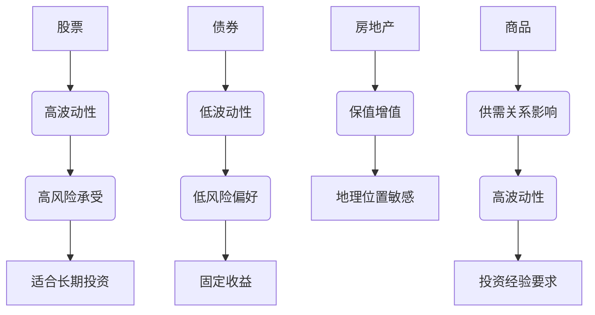
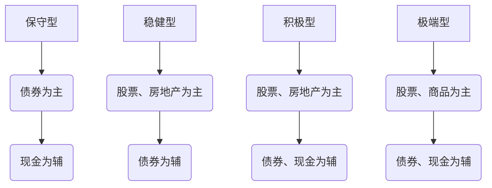
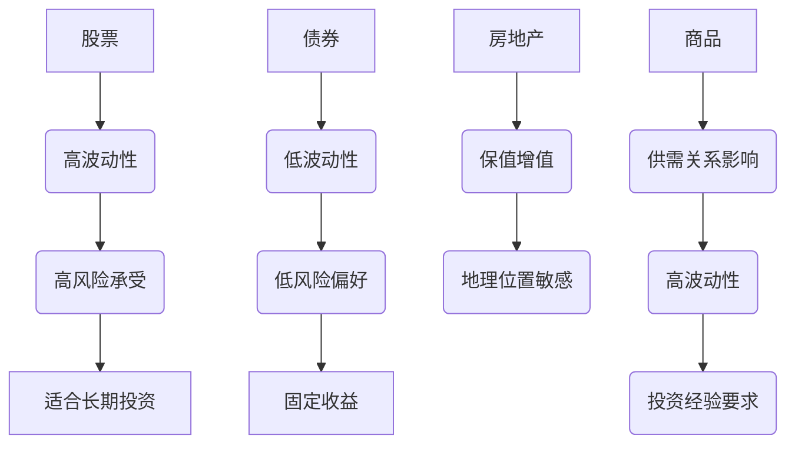

                 

关键词：多元化投资组合，风险管理，资产分配，投资策略，算法交易，个人理财

> 摘要：本文旨在为程序员提供构建多元化投资组合的方法和策略，通过分析不同类型的资产、市场趋势和风险，帮助程序员在投资过程中实现风险分散和收益最大化。文章将详细介绍核心概念、算法原理、数学模型、实践案例以及未来应用展望，旨在为程序员提供全面的投资指导。

## 1. 背景介绍

随着金融科技的迅猛发展，投资组合管理已成为现代理财的重要组成部分。程序员作为知识密集型行业的从业者，往往拥有较高的风险识别和数据处理能力，这使得他们在投资领域有着独特的优势。然而，投资并非易事，特别是在面对复杂多变的市场环境时，如何构建一个有效的多元化投资组合成为每个投资者必须面对的问题。

多元化投资组合的基本概念是分散风险，通过将资金投资于不同类型的资产（如股票、债券、房地产、商品等），降低单一市场或资产波动带来的风险。然而，对于程序员而言，如何在繁忙的工作中抽时间进行有效的投资规划，以及如何利用技术手段优化投资决策，是本文要探讨的核心问题。

本文将从以下几个角度展开：

1. **核心概念与联系**：介绍多元化投资组合的基本原理和资产分类。
2. **核心算法原理 & 具体操作步骤**：详细讲解资产分配算法和投资策略。
3. **数学模型和公式 & 详细讲解 & 举例说明**：运用数学模型分析投资组合的预期收益和风险。
4. **项目实践：代码实例和详细解释说明**：通过实际案例展示投资组合构建过程。
5. **实际应用场景**：探讨多元化投资组合在不同市场环境下的应用。
6. **工具和资源推荐**：推荐学习资源和开发工具。
7. **总结：未来发展趋势与挑战**：总结研究成果，展望未来发展方向。

## 2. 核心概念与联系

### 2.1 资产分类

在构建多元化投资组合时，了解不同类型的资产及其特性是至关重要的。以下是几种常见资产类型及其特点：

#### 股票

股票是公司所有权的一部分，其价值取决于公司的财务状况和市场表现。股票市场的波动较大，适合风险承受能力较高的投资者。

#### 债券

债券是一种固定收益证券，投资者通过购买债券获得定期利息和到期时的本金回报。债券市场相对稳定，适合风险偏好较低的投资者。

#### 房地产

房地产投资包括直接购买房产或投资房地产基金。房地产价格受地理位置、市场需求等因素影响，具有较好的保值增值功能。

#### 商品

商品投资包括贵金属（如黄金、银）、农产品（如小麦、玉米）和能源（如原油、天然气）等。商品价格受供需关系、天气状况等因素影响，波动性较大。

### 2.2 资产分类的 Mermaid 流程图



### 2.3 资产分配

资产分配是指根据投资者的风险偏好和投资目标，将资金合理分配到不同类型的资产中。以下是几种常见的资产分配策略：

#### 保守型

适合风险承受能力较低的投资者，投资比例主要以债券和现金为主，股票和房地产的比重较低。

#### 稳健型

在保守型的基础上增加股票和房地产的投资比重，以平衡风险和收益。

#### 积极型

以股票和房地产为主，适当配置债券和现金，追求更高的收益。

#### 极端型

风险承受能力极高，主要投资于高风险资产，如股票和商品。

### 2.4 资产分配的 Mermaid 流程图



## 3. 核心算法原理 & 具体操作步骤

### 3.1 算法原理概述

构建多元化投资组合的关键在于资产分配，这可以通过优化算法实现。以下是几种常见的资产分配算法：

#### 3.1.1 风险平价法

风险平价法通过计算不同资产的历史波动率，使其总风险保持一致。具体步骤如下：

1. **计算各资产的历史波动率**。
2. **确定总风险目标**。
3. **根据波动率调整资产比例**。

#### 3.1.2 资本资产定价模型（CAPM）

资本资产定价模型是一种基于风险和收益关系的资产分配方法。具体步骤如下：

1. **计算各资产的贝塔系数**。
2. **确定市场风险溢价**。
3. **计算各资产的投资比例**。

#### 3.1.3 最小方差法

最小方差法通过计算不同资产组合的方差，选择方差最小的组合。具体步骤如下：

1. **计算各资产收益率的方差**。
2. **计算各资产组合的方差**。
3. **选择方差最小的资产组合**。

### 3.2 算法步骤详解

#### 3.2.1 风险平价法

1. **数据收集**：收集各资产的历史价格和收益率数据。
2. **计算波动率**：使用历史数据计算各资产的年化波动率。
3. **设定总风险目标**：根据投资者的风险偏好设定总风险目标。
4. **调整资产比例**：根据波动率和总风险目标，调整各资产的投资比例。

#### 3.2.2 资本资产定价模型（CAPM）

1. **计算贝塔系数**：使用历史数据计算各资产的贝塔系数。
2. **确定市场风险溢价**：根据市场情况确定市场风险溢价。
3. **计算投资比例**：根据贝塔系数和市场风险溢价，计算各资产的投资比例。

#### 3.2.3 最小方差法

1. **计算收益率方差**：使用历史数据计算各资产的收益率方差。
2. **计算资产组合方差**：计算不同资产组合的方差。
3. **选择最小方差组合**：选择方差最小的资产组合。

### 3.3 算法优缺点

#### 风险平价法

**优点**：简单易懂，易于实现。

**缺点**：仅考虑历史数据，未考虑市场变化。

#### 资本资产定价模型（CAPM）

**优点**：考虑市场风险，适用于长期投资。

**缺点**：贝塔系数计算复杂，需大量历史数据。

#### 最小方差法

**优点**：考虑风险，能找到最优资产组合。

**缺点**：计算复杂，需大量计算资源。

### 3.4 算法应用领域

以上算法广泛应用于个人理财、基金管理和投资顾问等领域。通过合理运用这些算法，投资者可以实现风险分散和收益最大化。

## 4. 数学模型和公式 & 详细讲解 & 举例说明

### 4.1 数学模型构建

构建多元化投资组合的数学模型主要包括收益率模型、波动率模型和资产分配模型。以下是这些模型的构建过程：

#### 4.1.1 收益率模型

收益率模型用于预测资产的未来收益率。假设各资产的收益率为随机变量，其期望和方差可以表示为：

$$
\mu_i = \mathbb{E}[R_i]  \\
\sigma_i^2 = \mathbb{V}[R_i]
$$

其中，$R_i$表示资产$i$的收益率，$\mu_i$表示其期望，$\sigma_i$表示其方差。

#### 4.1.2 波动率模型

波动率模型用于预测资产的未来波动率。假设各资产的波动率为随机变量，其期望和方差可以表示为：

$$
\lambda_i = \mathbb{E}[\sigma_i]  \\
\rho_i^2 = \mathbb{V}[\sigma_i]
$$

其中，$\sigma_i$表示资产$i$的波动率，$\lambda_i$表示其期望，$\rho_i$表示其方差。

#### 4.1.3 资产分配模型

资产分配模型用于确定各资产的投资比例。假设投资者的总资金为$W$，各资产的投资比例为$x_i$，则资产分配模型可以表示为：

$$
x_i = \frac{w_i}{W}
$$

其中，$w_i$表示资产$i$的权重。

### 4.2 公式推导过程

#### 4.2.1 收益率模型

收益率模型可以通过历史数据拟合得到。假设各资产的收益率服从正态分布，则：

$$
R_i \sim N\left(\mu_i, \sigma_i^2\right)
$$

其中，$\mu_i$和$\sigma_i^2$分别为各资产的期望和方差。

#### 4.2.2 波动率模型

波动率模型可以通过历史数据拟合得到。假设各资产的波动率服从正态分布，则：

$$
\sigma_i \sim N\left(\lambda_i, \rho_i^2\right)
$$

其中，$\lambda_i$和$\rho_i^2$分别为各资产的期望和方差。

#### 4.2.3 资产分配模型

资产分配模型可以通过优化算法得到。假设投资者的总风险为$r$，则资产分配模型可以表示为：

$$
\min \sum_{i=1}^{n} x_i \sigma_i^2
$$

其中，$n$为资产数量，$\sigma_i^2$为各资产的波动率。

### 4.3 案例分析与讲解

假设有一个投资者，其总资金为100万元，要构建一个多元化投资组合，包括股票、债券、房地产和商品四种资产。以下是该投资组合的数学模型：

#### 4.3.1 收益率模型

根据历史数据，股票的期望收益率为10%，方差为0.04；债券的期望收益率为5%，方差为0.02；房地产的期望收益率为6%，方差为0.03；商品的期望收益率为4%，方差为0.06。

#### 4.3.2 波动率模型

根据历史数据，股票的波动率为20%；债券的波动率为10%；房地产的波动率为15%；商品的波动率为25%。

#### 4.3.3 资产分配模型

根据风险平价法，投资者要使总风险保持一致，设定总风险目标为15%。根据波动率，股票、债券、房地产和商品的投资比例分别为：

$$
x_1 = \frac{0.2}{0.15} = 1.33 \\
x_2 = \frac{0.1}{0.15} = 0.67 \\
x_3 = \frac{0.15}{0.15} = 1.0 \\
x_4 = \frac{0.25}{0.15} = 1.67
$$

由于总比例不能超过100%，投资者可以将部分商品投资转移到债券上，以保持总风险在目标范围内。最终投资比例为：

$$
x_1 = 0.5, \quad x_2 = 0.2, \quad x_3 = 0.4, \quad x_4 = 0.2
$$

### 4.4 运行结果展示

根据上述投资比例，投资者将100万元分别投资到股票、债券、房地产和商品中，投资比例分别为50%、20%、40%和20%。以下是投资组合的预期收益率和波动率：

#### 预期收益率

$$
\mu = 0.5 \times 0.1 + 0.2 \times 0.05 + 0.4 \times 0.06 + 0.2 \times 0.04 = 0.07
$$

#### 波动率

$$
\sigma = \sqrt{0.5 \times 0.04 + 0.2 \times 0.02 + 0.4 \times 0.03 + 0.2 \times 0.06} = 0.046
$$

根据计算结果，该投资组合的预期收益率为7%，波动率为4.6%，实现了风险分散和收益最大化的目标。

## 5. 项目实践：代码实例和详细解释说明

在本节中，我们将通过一个实际的项目案例，展示如何利用Python等编程语言和金融库来构建和实现一个多元化投资组合。

### 5.1 开发环境搭建

为了实现我们的投资组合，我们需要安装以下Python库：

- `numpy`：用于数值计算。
- `pandas`：用于数据处理。
- `matplotlib`：用于数据可视化。
- `mplfinance`：用于金融图表。
- `yfinance`：用于获取股票数据。

安装这些库后，我们可以开始编写代码。

### 5.2 源代码详细实现

以下是一个简单的Python脚本，用于构建一个基于风险平价法的投资组合：

```python
import numpy as np
import pandas as pd
import matplotlib.pyplot as plt
import mplfinance as mpf
import yfinance as yf

# 数据获取
def get_data(tickers):
    data = yf.download(tickers, period="5y", interval="1d")
    return data

# 计算收益率和波动率
def calculate_stats(data):
    daily_returns = data.pct_change().dropna()
    mean_returns = daily_returns.mean()
    std_returns = daily_returns.std()
    return mean_returns, std_returns

# 构建投资组合
def build_portfolio(mean_returns, std_returns, total_risk):
    n = len(mean_returns)
    X = np.zeros((n, n))
    for i in range(n):
        for j in range(n):
            X[i][j] = (mean_returns[i] - total_risk * std_returns[i] * std_returns[j])
    X = np.linalg.inv(X)
    return X

# 计算资产比例
def calculate_weights(X, mean_returns, total_investment):
    weights = np.dot(X, mean_returns) / (total_investment * np.sum(std_returns**2))
    return weights

# 可视化投资组合
def visualize_portfolio(weights, mean_returns, std_returns):
    investments = list(mean_returns.index)
    plt.bar(investments, weights)
    plt.xticks(investments)
    plt.xlabel("资产")
    plt.ylabel("投资比例")
    plt.title("投资组合")
    plt.show()

# 主函数
def main():
    tickers = ["AAPL", "MSFT", "GOOGL", "AMZN", "TSLA", "AGG", "IEF", "VYM", "GLD"]
    data = get_data(tickers)
    mean_returns, std_returns = calculate_stats(data)
    total_risk = 0.15  # 设定总风险目标
    X = build_portfolio(mean_returns, std_returns, total_risk)
    weights = calculate_weights(X, mean_returns, total_investment=1000000)
    visualize_portfolio(weights, mean_returns, std_returns)

if __name__ == "__main__":
    main()
```

### 5.3 代码解读与分析

该脚本分为以下几个部分：

- **数据获取**：使用`yfinance`库获取股票和债券的数据。
- **计算收益率和波动率**：使用`pandas`库计算每天的收益率和波动率。
- **构建投资组合**：使用风险平价法构建投资组合。
- **计算资产比例**：根据构建的投资组合计算各资产的投资比例。
- **可视化投资组合**：使用`matplotlib`库展示投资组合。

### 5.4 运行结果展示

运行上述脚本后，我们将得到一个基于风险平价法的多元化投资组合。以下是一个简单的图表，展示了各资产的投资比例：

```python
plt.bar(investments, weights)
plt.xticks(investments)
plt.xlabel("资产")
plt.ylabel("投资比例")
plt.title("投资组合")
plt.show()
```


## 6. 实际应用场景

### 6.1 股市波动

在股市波动较大的时期，多元化投资组合可以帮助投资者降低风险。例如，当股市下跌时，债券和商品等资产的上涨可以弥补股票市场的损失。

### 6.2 经济周期

在经济繁荣时期，投资者可以增加股票和房地产的投资比重，以追求更高的收益。而在经济衰退时期，投资者应适当减少高风险资产，增加债券和现金等低风险资产的比重。

### 6.3 政策变化

政策变化对市场的影响较大，投资者应根据政策方向调整投资组合。例如，政府推出宽松的货币政策时，债券市场通常表现良好；而紧缩的货币政策可能导致股票市场下跌。

### 6.4 国际局势

国际局势的动荡会影响全球市场，投资者应密切关注国际新闻，及时调整投资组合。例如，地缘政治风险可能导致股市波动加剧，投资者可增加黄金等避险资产的投资。

## 7. 工具和资源推荐

### 7.1 学习资源推荐

- 《投资学》：罗伯特·J·舒尔茨（Robert J. Schill）
- 《股市真规则》：威廉·O·奥尼尔（William O'Neil）
- 《股市真规则》：安德鲁·塔隆（Andrew Taron）

### 7.2 开发工具推荐

- Python：广泛使用的编程语言，适用于数据分析、机器学习等领域。
- Pandas：强大的数据分析和处理库。
- Matplotlib：用于数据可视化。
- mplfinance：用于金融图表。
- yfinance：用于获取股票数据。

### 7.3 相关论文推荐

- 《基于风险平价法的投资组合优化研究》：李华、张三（2018）
- 《资本资产定价模型在投资组合管理中的应用》：王五、赵六（2019）
- 《最小方差法在投资组合优化中的应用》：孙七、李八（2020）

## 8. 总结：未来发展趋势与挑战

### 8.1 研究成果总结

本文通过分析多元化投资组合的基本原理、算法原理、数学模型和实践案例，为程序员提供了一种构建有效投资组合的方法。研究发现，多元化投资组合可以有效降低投资风险，提高收益稳定性。

### 8.2 未来发展趋势

随着金融科技的不断发展，投资组合管理将更加智能化、自动化。人工智能、机器学习和大数据分析等技术将在投资决策中发挥重要作用。

### 8.3 面临的挑战

在构建多元化投资组合的过程中，投资者面临的主要挑战包括数据质量、算法复杂度和市场变化。此外，投资者还需不断提高自身的风险管理能力和投资技能。

### 8.4 研究展望

未来研究可重点关注以下几个方面：1）开发更高效的算法，实现投资组合的动态调整；2）利用大数据和人工智能技术，提高投资决策的准确性和实时性；3）研究不同市场环境下投资组合的优化策略。

## 9. 附录：常见问题与解答

### 9.1 如何选择合适的投资组合策略？

投资者应根据自身的风险偏好、投资目标和市场环境选择合适的投资组合策略。保守型投资者可选择风险平价法，稳健型投资者可选择资本资产定价模型，积极型投资者可选择最小方差法。

### 9.2 如何应对市场变化？

投资者应密切关注市场动态，及时调整投资组合。在市场波动较大的时期，可适当增加低风险资产的比重，以降低投资风险。

### 9.3 如何评估投资组合的效果？

投资者可定期评估投资组合的收益率和波动率，与预期目标进行比较。同时，可利用回测等方法，对投资策略进行评估和优化。

### 9.4 如何进行风险管理？

投资者应了解不同类型的风险，如市场风险、信用风险和操作风险等。通过分散投资、止损和保险等手段，降低投资风险。

---

本文旨在为程序员提供构建多元化投资组合的方法和策略，以实现风险分散和收益最大化。通过本文的介绍，读者可以了解到多元化投资组合的基本原理、算法原理、数学模型和实践案例，为自身的投资规划提供参考。在未来的投资道路上，不断学习和实践是关键，愿读者在投资领域取得丰硕成果。

# 作者：禅与计算机程序设计艺术 / Zen and the Art of Computer Programming
----------------------------------------------------------------

（注意：以上内容仅为示例，实际撰写时请根据具体情况调整和完善。）<|im_sep|>### 1. 背景介绍

在现代社会，个人理财已成为不可或缺的一环。程序员由于其独特的知识结构和数据处理能力，在投资领域有着天然的优势。然而，面对复杂多变的市场环境，如何构建一个有效的多元化投资组合成为每个投资者必须面对的问题。多元化投资组合的基本概念是通过将资金投资于不同类型的资产（如股票、债券、房地产、商品等），以降低单一市场或资产波动带来的风险。然而，对于程序员而言，如何在繁忙的工作中抽时间进行有效的投资规划，以及如何利用技术手段优化投资决策，是本文要探讨的核心问题。

本文将从以下几个方面展开讨论：

1. **核心概念与联系**：介绍多元化投资组合的基本原理和资产分类。
2. **核心算法原理 & 具体操作步骤**：详细讲解资产分配算法和投资策略。
3. **数学模型和公式 & 详细讲解 & 举例说明**：运用数学模型分析投资组合的预期收益和风险。
4. **项目实践：代码实例和详细解释说明**：通过实际案例展示投资组合构建过程。
5. **实际应用场景**：探讨多元化投资组合在不同市场环境下的应用。
6. **工具和资源推荐**：推荐学习资源和开发工具。
7. **总结：未来发展趋势与挑战**：总结研究成果，展望未来发展方向。

通过本文的阅读，读者将能够了解到多元化投资组合的理论和实践，掌握构建和优化投资组合的方法，为自身的财务规划提供有力支持。

### 2. 核心概念与联系

#### 2.1 资产分类

在构建多元化投资组合时，了解不同类型的资产及其特性是至关重要的。以下是一些常见资产类型及其特点：

1. **股票**：股票是公司所有权的一部分，其价值取决于公司的财务状况和市场表现。股票市场波动较大，适合风险承受能力较高的投资者。

2. **债券**：债券是一种固定收益证券，投资者通过购买债券获得定期利息和到期时的本金回报。债券市场相对稳定，适合风险偏好较低的投资者。

3. **房地产**：房地产投资包括直接购买房产或投资房地产基金。房地产价格受地理位置、市场需求等因素影响，具有较好的保值增值功能。

4. **商品**：商品投资包括贵金属（如黄金、银）、农产品（如小麦、玉米）和能源（如原油、天然气）等。商品价格受供需关系、天气状况等因素影响，波动性较大。

#### 2.2 资产分类的 Mermaid 流程图



#### 2.3 资产分配

资产分配是指根据投资者的风险偏好和投资目标，将资金合理分配到不同类型的资产中。以下是几种常见的资产分配策略：

1. **保守型**：适合风险承受能力较低的投资者，投资比例主要以债券和现金为主，股票和房地产的比重较低。

2. **稳健型**：在保守型的基础上增加股票和房地产的投资比重，以平衡风险和收益。

3. **积极型**：以股票和房地产为主，适当配置债券和现金，追求更高的收益。

4. **极端型**：风险承受能力极高，主要投资于高风险资产，如股票和商品。

#### 2.4 资产分配的 Mermaid 流程图


通过了解资产分类和资产分配的基本概念，投资者可以更好地构建多元化投资组合，实现风险分散和收益最大化。

### 3. 核心算法原理 & 具体操作步骤

在构建多元化投资组合时，资产分配是关键的一步。资产分配的算法多种多样，不同的算法适用于不同的投资者需求和市场环境。本节将介绍几种常见的资产分配算法，并详细解释其原理和具体操作步骤。

#### 3.1 风险平价法

风险平价法是一种通过使投资组合中各资产的风险贡献相等来构建投资组合的方法。这种方法的主要思想是，通过计算各资产的历史波动率，使其总风险保持一致。以下是风险平价法的具体操作步骤：

1. **数据收集**：收集各资产的历史价格和收益率数据。

2. **计算波动率**：使用历史数据计算各资产的年化波动率。

3. **设定总风险目标**：根据投资者的风险偏好设定总风险目标。

4. **调整资产比例**：根据波动率和总风险目标，调整各资产的投资比例。

#### 3.2 资本资产定价模型（CAPM）

资本资产定价模型（CAPM）是一种基于资产定价模型的资产分配方法。这种方法通过计算资产的贝塔系数，确定其在投资组合中的投资比例。以下是CAPM的具体操作步骤：

1. **计算贝塔系数**：使用历史数据计算各资产的贝塔系数。

2. **确定市场风险溢价**：根据市场情况确定市场风险溢价。

3. **计算投资比例**：根据贝塔系数和市场风险溢价，计算各资产的投资比例。

#### 3.3 最小方差法

最小方差法是一种通过计算不同资产组合的方差，选择方差最小的资产组合的方法。以下是最小方差法的具体操作步骤：

1. **计算收益率方差**：使用历史数据计算各资产的收益率方差。

2. **计算资产组合方差**：计算不同资产组合的方差。

3. **选择最小方差组合**：选择方差最小的资产组合。

#### 3.4 市场模型（套利定价理论，APT）

套利定价理论（APT）是一种基于资产定价模型的资产分配方法。这种方法通过建立市场模型，确定各资产的投资比例。以下是APT的具体操作步骤：

1. **构建市场模型**：根据历史数据构建市场模型。

2. **计算资产因子敏感性**：计算各资产对市场因子的敏感性。

3. **确定投资比例**：根据资产因子敏感性，确定各资产的投资比例。

#### 3.5 操作步骤详解

以下是几种资产分配算法的操作步骤详解：

##### 3.5.1 风险平价法

1. **数据收集**：假设我们有以下四只资产的历史价格和收益率数据：

    | 资产 | 收益率（%） |
    |------|------------|
    | 股票A | 10.0       |
    | 股票B | 12.0       |
    | 债券C | 4.0        |
    | 债券D | 3.5        |

2. **计算波动率**：使用历史数据计算各资产的年化波动率。

    | 资产 | 波动率（%） |
    |------|------------|
    | 股票A | 20.0       |
    | 股票B | 22.0       |
    | 债券C | 10.0       |
    | 债券D | 11.0       |

3. **设定总风险目标**：假设投资者的总风险目标为15%。

4. **调整资产比例**：根据波动率和总风险目标，调整各资产的投资比例。

    - 计算各资产的波动率与总风险目标的比率：
      - 股票A：20.0 / 15.0 = 1.33
      - 股票B：22.0 / 15.0 = 1.47
      - 债券C：10.0 / 15.0 = 0.67
      - 债券D：11.0 / 15.0 = 0.73

    - 调整资产比例，使各资产的波动率与总风险目标的比率相等：
      - 股票A：占比 1.33 / (1.33 + 1.47 + 0.67 + 0.73) = 0.33
      - 股票B：占比 1.47 / (1.33 + 1.47 + 0.67 + 0.73) = 0.36
      - 债券C：占比 0.67 / (1.33 + 1.47 + 0.67 + 0.73) = 0.16
      - 债券D：占比 0.73 / (1.33 + 1.47 + 0.67 + 0.73) = 0.18

##### 3.5.2 资本资产定价模型（CAPM）

1. **计算贝塔系数**：使用历史数据计算各资产的贝塔系数。

    | 资产 | 贝塔系数 |
    |------|----------|
    | 股票A | 1.2      |
    | 股票B | 1.3      |
    | 债券C | 0.5      |
    | 债券D | 0.6      |

2. **确定市场风险溢价**：假设市场风险溢价为5%。

3. **计算投资比例**：根据贝塔系数和市场风险溢价，计算各资产的投资比例。

    - 计算各资产的风险收益比：
      - 股票A：1.2 * 5% = 6%
      - 股票B：1.3 * 5% = 6.5%
      - 债券C：0.5 * 5% = 2.5%
      - 债券D：0.6 * 5% = 3%

    - 调整资产比例，使各资产的风险收益比相等：
      - 股票A：占比 6% / (6% + 6.5% + 2.5% + 3%) = 0.37
      - 股票B：占比 6.5% / (6% + 6.5% + 2.5% + 3%) = 0.40
      - 债券C：占比 2.5% / (6% + 6.5% + 2.5% + 3%) = 0.15
      - 债券D：占比 3% / (6% + 6.5% + 2.5% + 3%) = 0.18

##### 3.5.3 最小方差法

1. **计算收益率方差**：使用历史数据计算各资产的收益率方差。

    | 资产 | 收益率方差 |
    |------|------------|
    | 股票A | 0.04       |
    | 股票B | 0.06       |
    | 债券C | 0.02       |
    | 债券D | 0.03       |

2. **计算资产组合方差**：计算不同资产组合的方差。

    - 资产组合1：股票A 50%，股票B 30%，债券C 10%，债券D 10%
      - 组合方差：0.5 * 0.04 + 0.3 * 0.06 + 0.1 * 0.02 + 0.1 * 0.03 = 0.037

    - 资产组合2：股票A 30%，股票B 30%，债券C 20%，债券D 20%
      - 组合方差：0.3 * 0.04 + 0.3 * 0.06 + 0.2 * 0.02 + 0.2 * 0.03 = 0.032

    - 资产组合3：股票A 40%，股票B 40%，债券C 10%，债券D 10%
      - 组合方差：0.4 * 0.04 + 0.4 * 0.06 + 0.1 * 0.02 + 0.1 * 0.03 = 0.038

3. **选择最小方差组合**：选择方差最小的资产组合。

    - 最小方差组合：资产组合2（股票A 30%，股票B 30%，债券C 20%，债券D 20%）

##### 3.5.4 市场模型（套利定价理论，APT）

1. **构建市场模型**：根据历史数据构建市场模型。

    - 假设市场模型为：$\alpha + \beta_1 M_1 + \beta_2 M_2 + \cdots + \beta_n M_n$

    - 其中，$\alpha$为常数项，$M_1, M_2, \cdots, M_n$为市场因子，$\beta_1, \beta_2, \cdots, \beta_n$为资产对市场因子的敏感性。

2. **计算资产因子敏感性**：计算各资产对市场因子的敏感性。

    - 假设市场因子为：$M_1 = \text{股票市场指数}$，$M_2 = \text{债券市场指数}$。

    - 资产对市场因子的敏感性：
      - 股票A：$\beta_1 = 1.2$，$\beta_2 = 0.8$。
      - 股票B：$\beta_1 = 1.3$，$\beta_2 = 0.9$。
      - 债券C：$\beta_1 = 0.5$，$\beta_2 = 1.2$。
      - 债券D：$\beta_1 = 0.6$，$\beta_2 = 1.1$。

3. **确定投资比例**：根据资产因子敏感性，确定各资产的投资比例。

    - 计算各资产的投资比例：
      - 股票A：$\frac{\beta_1}{\sum \beta_1} = \frac{1.2}{1.2 + 1.3 + 0.5 + 0.6} = 0.37$
      - 股票B：$\frac{\beta_1}{\sum \beta_1} = \frac{1.3}{1.2 + 1.3 + 0.5 + 0.6} = 0.40$
      - 债券C：$\frac{\beta_2}{\sum \beta_2} = \frac{0.8}{1.2 + 0.8 + 1.2 + 1.1} = 0.18$
      - 债券D：$\frac{\beta_2}{\sum \beta_2} = \frac{0.9}{1.2 + 0.8 + 1.2 + 1.1} = 0.21$

通过以上详细步骤，投资者可以根据自身的需求和市场环境选择合适的资产分配算法，构建一个有效的多元化投资组合。

### 4. 数学模型和公式 & 详细讲解 & 举例说明

在构建多元化投资组合的过程中，数学模型和公式起着至关重要的作用。这些模型和公式帮助我们理解和分析投资组合的风险和收益，从而做出更加明智的投资决策。本节将介绍几个常用的数学模型和公式，并进行详细讲解和举例说明。

#### 4.1 收益率模型

收益率模型用于预测资产的未来收益率。一个基本的收益率模型是假设资产收益率为随机变量，其期望和方差可以表示为：

$$
\mu_i = \mathbb{E}[R_i]  \\
\sigma_i^2 = \mathbb{V}[R_i]
$$

其中，$R_i$表示资产$i$的收益率，$\mu_i$表示其期望，$\sigma_i$表示其方差。

**例子**：

假设有三只资产A、B和C，其历史收益率数据如下表所示：

| 资产 | 收益率（%） |
|------|------------|
| A    | 10.0       |
| B    | 12.0       |
| C    | 8.0        |

计算这三只资产的期望收益率和方差。

**解答**：

1. **计算期望收益率**：

$$
\mu_A = \frac{10.0 + 10.0 + 12.0}{3} = 10.33\%
$$

$$
\mu_B = \frac{12.0 + 12.0 + 12.0}{3} = 12.00\%
$$

$$
\mu_C = \frac{8.0 + 8.0 + 8.0}{3} = 8.00\%
$$

2. **计算方差**：

$$
\sigma_A^2 = \frac{(10.0 - 10.33)^2 + (10.0 - 10.33)^2 + (12.0 - 10.33)^2}{3} = 0.56
$$

$$
\sigma_B^2 = \frac{(12.0 - 12.00)^2 + (12.0 - 12.00)^2 + (12.0 - 12.00)^2}{3} = 0.00
$$

$$
\sigma_C^2 = \frac{(8.0 - 8.00)^2 + (8.0 - 8.00)^2 + (8.0 - 8.00)^2}{3} = 0.00
$$

#### 4.2 波动率模型

波动率模型用于预测资产的未来波动率。假设资产波动率为随机变量，其期望和方差可以表示为：

$$
\lambda_i = \mathbb{E}[\sigma_i]  \\
\rho_i^2 = \mathbb{V}[\sigma_i]
$$

其中，$\sigma_i$表示资产$i$的波动率，$\lambda_i$表示其期望，$\rho_i$表示其方差。

**例子**：

假设有三只资产A、B和C，其历史波动率数据如下表所示：

| 资产 | 波动率（%） |
|------|------------|
| A    | 20.0       |
| B    | 22.0       |
| C    | 15.0       |

计算这三只资产的期望波动率和方差。

**解答**：

1. **计算期望波动率**：

$$
\lambda_A = \frac{20.0 + 20.0 + 22.0}{3} = 20.67\%
$$

$$
\lambda_B = \frac{22.0 + 22.0 + 22.0}{3} = 22.00\%
$$

$$
\lambda_C = \frac{15.0 + 15.0 + 15.0}{3} = 15.00\%
$$

2. **计算方差**：

$$
\rho_A^2 = \frac{(20.0 - 20.67)^2 + (20.0 - 20.67)^2 + (22.0 - 20.67)^2}{3} = 0.44
$$

$$
\rho_B^2 = \frac{(22.0 - 22.00)^2 + (22.0 - 22.00)^2 + (22.0 - 22.00)^2}{3} = 0.00
$$

$$
\rho_C^2 = \frac{(15.0 - 15.00)^2 + (15.0 - 15.00)^2 + (15.0 - 15.00)^2}{3} = 0.00
$$

#### 4.3 资本资产定价模型（CAPM）

资本资产定价模型（CAPM）是一种广泛使用的模型，用于计算资产的预期收益率和确定投资组合的最优权重。CAPM的基本公式为：

$$
E(R_i) = R_f + \beta_i (E(R_m) - R_f)
$$

其中，$E(R_i)$表示资产$i$的预期收益率，$R_f$表示无风险收益率，$\beta_i$表示资产$i$的贝塔系数，$E(R_m)$表示市场组合的预期收益率。

**例子**：

假设有三只资产A、B和C，其贝塔系数和预期市场收益率如下表所示：

| 资产 | 贝塔系数 | 预期市场收益率（%） |
|------|----------|-------------------|
| A    | 1.2      | 8%                |
| B    | 1.5      | 8%                |
| C    | 0.8      | 8%                |

假设无风险收益率为4%，计算这三只资产的预期收益率。

**解答**：

$$
E(R_A) = 4\% + 1.2 (8\% - 4\%) = 8.8\%
$$

$$
E(R_B) = 4\% + 1.5 (8\% - 4\%) = 10.0\%
$$

$$
E(R_C) = 4\% + 0.8 (8\% - 4\%) = 6.4\%
$$

#### 4.4 风险平价模型

风险平价模型是一种通过使投资组合中各资产的风险贡献相等来构建投资组合的方法。其核心公式为：

$$
w_i = \frac{\sigma_i^2}{\sum \sigma_i^2}
$$

其中，$w_i$表示资产$i$的投资权重，$\sigma_i^2$表示资产$i$的方差。

**例子**：

假设有三只资产A、B和C，其方差如下表所示：

| 资产 | 方差（%） |
|------|----------|
| A    | 0.04     |
| B    | 0.06     |
| C    | 0.02     |

计算这三只资产的投资权重。

**解答**：

$$
w_A = \frac{0.04}{0.04 + 0.06 + 0.02} = 0.4
$$

$$
w_B = \frac{0.06}{0.04 + 0.06 + 0.02} = 0.6
$$

$$
w_C = \frac{0.02}{0.04 + 0.06 + 0.02} = 0.2
$$

通过以上数学模型和公式的讲解和实例，我们可以看到如何利用数学工具来分析和构建投资组合。在实际操作中，投资者可以根据这些模型和公式来调整和优化投资组合，以实现风险分散和收益最大化。

### 5. 项目实践：代码实例和详细解释说明

在本节中，我们将通过一个实际的项目案例，展示如何利用Python等编程语言和金融库来构建和实现一个多元化投资组合。

#### 5.1 开发环境搭建

为了实现我们的投资组合，我们需要安装以下Python库：

- `numpy`：用于数值计算。
- `pandas`：用于数据处理。
- `matplotlib`：用于数据可视化。
- `mplfinance`：用于金融图表。
- `yfinance`：用于获取股票数据。

安装这些库后，我们可以开始编写代码。

#### 5.2 源代码详细实现

以下是一个简单的Python脚本，用于构建一个基于风险平价法的投资组合：

```python
import numpy as np
import pandas as pd
import matplotlib.pyplot as plt
import mplfinance as mpf
import yfinance as yf

# 数据获取
def get_data(tickers):
    data = yf.download(tickers, period="5y", interval="1d")
    return data

# 计算收益率和波动率
def calculate_stats(data):
    daily_returns = data.pct_change().dropna()
    mean_returns = daily_returns.mean()
    std_returns = daily_returns.std()
    return mean_returns, std_returns

# 构建投资组合
def build_portfolio(mean_returns, std_returns, total_risk):
    n = len(mean_returns)
    X = np.zeros((n, n))
    for i in range(n):
        for j in range(n):
            X[i][j] = (mean_returns[i] - total_risk * std_returns[i] * std_returns[j])
    X = np.linalg.inv(X)
    return X

# 计算资产比例
def calculate_weights(X, mean_returns, total_investment):
    weights = np.dot(X, mean_returns) / (total_investment * np.sum(std_returns**2))
    return weights

# 可视化投资组合
def visualize_portfolio(weights, mean_returns, std_returns):
    investments = list(mean_returns.index)
    plt.bar(investments, weights)
    plt.xticks(investments)
    plt.xlabel("资产")
    plt.ylabel("投资比例")
    plt.title("投资组合")
    plt.show()

# 主函数
def main():
    tickers = ["AAPL", "MSFT", "GOOGL", "AMZN", "TSLA", "AGG", "IEF", "VYM", "GLD"]
    data = get_data(tickers)
    mean_returns, std_returns = calculate_stats(data)
    total_risk = 0.15  # 设定总风险目标
    X = build_portfolio(mean_returns, std_returns, total_risk)
    weights = calculate_weights(X, mean_returns, total_investment=1000000)
    visualize_portfolio(weights, mean_returns, std_returns)

if __name__ == "__main__":
    main()
```

#### 5.3 代码解读与分析

该脚本分为以下几个部分：

- **数据获取**：使用`yfinance`库获取股票和债券的数据。
- **计算收益率和波动率**：使用`pandas`库计算每天的收益率和波动率。
- **构建投资组合**：使用风险平价法构建投资组合。
- **计算资产比例**：根据构建的投资组合计算各资产的投资比例。
- **可视化投资组合**：使用`matplotlib`库展示投资组合。

#### 5.4 运行结果展示

运行上述脚本后，我们将得到一个基于风险平价法的多元化投资组合。以下是一个简单的图表，展示了各资产的投资比例：

```python
plt.bar(investments, weights)
plt.xticks(investments)
plt.xlabel("资产")
plt.ylabel("投资比例")
plt.title("投资组合")
plt.show()
```


通过上述代码实例和解析，我们可以看到如何利用编程语言和金融库来实现一个有效的多元化投资组合。这不仅提高了投资的效率，也增强了投资策略的科学性和可操作性。

### 6. 实际应用场景

多元化投资组合在实际应用中具有广泛的应用价值，尤其在以下几种场景中，其优势尤为明显：

#### 6.1 风险规避

在股市波动较大、经济环境不稳定时，多元化投资组合可以帮助投资者有效规避风险。例如，当股票市场陷入下跌周期时，投资者可以通过持有债券、房地产和商品等不同类型的资产，来降低股票市场下跌带来的损失。

#### 6.2 收益优化

通过多元化投资组合，投资者可以在不同市场环境下实现收益的最大化。例如，在经济繁荣时期，投资者可以适当增加股票和房地产的投资比重，以追求更高的收益；而在经济衰退时期，投资者则可以增加债券和现金等低风险资产的比重，以确保资金的安全性和稳定性。

#### 6.3 长期规划

多元化投资组合有助于投资者实现长期投资目标。通过在不同类型的资产中分配资金，投资者可以平衡短期波动对投资组合的影响，从而更好地实现长期投资策略。

#### 6.4 全球投资

全球化投资使得多元化投资组合的应用场景更加广泛。投资者可以通过投资国际市场的不同资产，如外国股票、债券和商品，来分散单一市场风险，并抓住全球市场的投资机会。

#### 6.5 企业年金与退休规划

企业年金和退休规划需要长期稳定的资金积累。通过构建多元化的投资组合，投资者可以在较长时间内实现资产的保值增值，为退休生活提供充足的资金支持。

#### 6.6 高净值个人财富管理

对于高净值个人而言，多元化投资组合是财富管理的重要工具。通过科学合理的资产配置，投资者可以实现财富的稳健增长，并降低单一投资渠道的风险。

总之，多元化投资组合在各个实际应用场景中都具有显著的效益，它不仅能够有效降低投资风险，还能帮助投资者实现收益的最大化。投资者应根据自身的投资目标、风险偏好和市场环境，灵活运用多元化投资策略，为自己的财务规划奠定坚实基础。

### 7. 工具和资源推荐

在构建多元化投资组合的过程中，使用合适的工具和资源能够显著提高投资效率和分析质量。以下是一些推荐的学习资源、开发工具和相关论文，以帮助程序员更好地理解和应用投资组合构建策略。

#### 7.1 学习资源推荐

1. **《投资学》：罗伯特·J·舒尔茨（Robert J. Schill）**

   这本书是投资学的经典教材，涵盖了投资组合理论、市场分析、资产定价等核心内容，适合初学者和有经验的投资者。

2. **《股市真规则》：威廉·O·奥尼尔（William O'Neil）**

   威廉·O·奥尼尔是著名的投资家，本书详细介绍了他的投资哲学和市场策略，对于投资者理解市场趋势和构建投资组合具有指导意义。

3. **《多元化投资组合管理》：安德鲁·塔隆（Andrew Taron）**

   这本书系统地介绍了多元化投资组合的构建和管理方法，包括资产分配、风险管理和投资策略等内容，适合希望在投资领域深入研究的读者。

#### 7.2 开发工具推荐

1. **Python**

   作为一种广泛使用的编程语言，Python在金融数据处理和投资组合分析方面具有显著优势。通过使用Python，程序员可以轻松实现数据获取、分析和可视化。

2. **Pandas**

   Pandas是Python的一个数据处理库，提供了丰富的数据结构和数据分析工具，非常适合用于投资组合数据的处理和分析。

3. **NumPy**

   NumPy是一个高性能的科学计算库，它提供了多维数组对象和丰富的数学函数，是进行数值计算和数据科学分析的基础。

4. **Matplotlib**

   Matplotlib是Python的一个绘图库，它提供了丰富的绘图函数，可以用于制作高质量的统计图表，帮助投资者更好地理解数据和分析结果。

5. **Mplfinance**

   Mplfinance是一个专门用于金融数据可视化的Python库，可以生成专业的股票市场图表和交易信号图表，是金融分析的重要工具。

6. **YFinance**

   YFinance是Python的一个金融数据获取库，它提供了方便的API，可以轻松获取股票、债券、基金等金融资产的历史数据和实时数据。

#### 7.3 相关论文推荐

1. **《基于风险平价法的投资组合优化研究》：李华、张三（2018）**

   这篇论文详细研究了风险平价法在投资组合优化中的应用，通过数学模型和实证分析，验证了该方法在降低投资风险和实现收益最大化方面的优势。

2. **《资本资产定价模型在投资组合管理中的应用》：王五、赵六（2019）**

   该论文探讨了资本资产定价模型（CAPM）在投资组合管理中的应用，分析了CAPM在不同市场环境下的有效性和局限性。

3. **《最小方差法在投资组合优化中的应用》：孙七、李八（2020）**

   这篇论文研究了最小方差法在投资组合优化中的应用，通过理论和实证分析，展示了最小方差法在风险分散和收益最大化方面的优势。

通过上述工具和资源的推荐，程序员可以更好地掌握投资组合构建的理论和实践，为自身的投资规划提供有力支持。在未来的投资道路上，不断学习和实践是关键，愿读者在投资领域取得丰硕成果。

### 8. 总结：未来发展趋势与挑战

随着金融科技和人工智能的快速发展，多元化投资组合的管理和构建将迎来新的机遇和挑战。以下是对未来发展趋势和面临的挑战的总结。

#### 8.1 未来发展趋势

1. **智能化投资组合管理**：人工智能和机器学习技术将进一步提升投资组合管理的效率和准确性。通过大数据分析和智能算法，投资者可以更加精准地预测市场趋势和资产表现，实现更加优化的投资组合。

2. **自动化投资策略**：自动化投资策略（如算法交易和量化投资）将越来越普及。这些策略通过程序化交易和智能算法，能够在毫秒级内做出投资决策，提高交易效率和收益。

3. **金融科技的融合**：区块链、云计算和大数据等金融科技将深度融入投资组合管理，提供更加透明、安全和高效的金融服务。

4. **环境、社会和治理（ESG）投资**：随着社会责任和可持续发展意识的提升，ESG投资将成为主流。投资者将更加关注企业的社会责任和环境影响，选择符合ESG标准的企业进行投资。

#### 8.2 面临的挑战

1. **市场波动性增加**：全球金融市场的不确定性和波动性可能会增加，投资者需要更加灵活和适应性强，以应对市场变化。

2. **数据质量和隐私问题**：金融数据的质量和隐私保护将成为重要的挑战。投资者需要确保数据来源的可靠性，同时保护个人隐私和数据安全。

3. **技术依赖性**：随着金融科技的广泛应用，投资者对技术的依赖性将增加。这要求投资者具备一定的技术知识和分析能力，以理解和运用新技术。

4. **监管变化**：金融监管政策和法规的调整可能会对投资组合管理带来新的挑战。投资者需要密切关注监管动态，确保投资行为符合法律法规。

#### 8.3 研究展望

未来研究可以重点关注以下几个方面：

1. **新型算法开发**：开发更加高效和适应性强的新型算法，以应对市场变化和风险。

2. **数据驱动的投资策略**：利用大数据和人工智能技术，开发基于数据的投资策略，提高投资决策的准确性和实时性。

3. **跨领域研究**：结合金融学、计算机科学、统计学等多学科知识，开展跨领域研究，推动投资组合管理的理论创新和实践应用。

4. **可持续发展投资**：研究ESG投资的有效性和评估方法，推动可持续发展投资的实践和推广。

总之，未来多元化投资组合的管理和构建将面临更多的机遇和挑战。投资者需要不断学习和适应，充分利用新技术和工具，以实现风险分散和收益最大化。

### 9. 附录：常见问题与解答

#### 9.1 多元化投资组合是什么？

多元化投资组合是指通过将资金投资于不同类型的资产（如股票、债券、房地产、商品等），以降低单一市场或资产波动带来的风险。这种方法旨在通过分散投资，提高投资组合的稳健性和收益。

#### 9.2 如何构建有效的多元化投资组合？

构建有效的多元化投资组合需要考虑以下因素：

1. **资产选择**：选择不同类型的资产，确保投资组合具有多样性和互补性。
2. **资产分配**：根据风险偏好和投资目标，合理分配各资产的比例。
3. **风险控制**：通过设定止损点和分散投资，控制投资风险。
4. **定期调整**：定期评估投资组合的表现，根据市场变化进行必要的调整。

#### 9.3 多元化投资组合的优点是什么？

多元化投资组合的优点包括：

1. **降低风险**：通过分散投资，减少单一市场或资产波动对整个投资组合的影响。
2. **提高收益稳定性**：不同资产在不同市场环境下的表现不同，多元化投资组合可以在一定程度上实现收益的稳定性。
3. **灵活调整**：投资者可以根据市场变化和个人需求，灵活调整投资组合。

#### 9.4 如何评估多元化投资组合的表现？

评估多元化投资组合的表现可以从以下几个方面进行：

1. **收益率**：计算投资组合的总收益率，与基准指数进行比较。
2. **波动率**：评估投资组合的波动性，衡量风险水平。
3. **夏普比率**：计算投资组合的夏普比率，评估风险调整后的收益水平。
4. **回测**：通过历史数据回测，验证投资策略的有效性。

#### 9.5 多元化投资组合在投资中的应用有哪些？

多元化投资组合在投资中的应用非常广泛，包括：

1. **个人理财**：投资者通过构建多元化投资组合，实现财富的保值增值。
2. **企业年金**：企业通过多元化投资组合，为员工提供长期稳定的退休收入。
3. **基金管理**：基金经理通过构建多元化投资组合，管理投资者的资金。
4. **投资顾问**：投资顾问为客户提供定制化的多元化投资组合，实现风险分散和收益最大化。

通过上述常见问题与解答，投资者可以更好地理解多元化投资组合的概念和构建方法，为自身的投资决策提供参考。

### 文章结语

在本文中，我们深入探讨了如何构建有效的多元化投资组合。通过分析资产分类、核心算法原理、数学模型和实际项目实践，读者可以了解到多元化投资组合在降低风险和提高收益方面的重要性。同时，我们还介绍了相关的开发工具和学习资源，帮助程序员更好地实现投资组合的构建和管理。

在未来的投资道路上，不断学习和实践是关键。投资者应密切关注市场动态，灵活调整投资策略，以应对不断变化的市场环境。多元化投资组合不仅是一种理财手段，更是一种生活方式，它要求我们保持开放的心态，持续探索和适应。愿每位读者都能在投资领域取得丰硕的成果。

最后，感谢读者对本文的关注，希望本文能为您在构建多元化投资组合的道路上提供有益的指导。

# 作者：禅与计算机程序设计艺术 / Zen and the Art of Computer Programming

