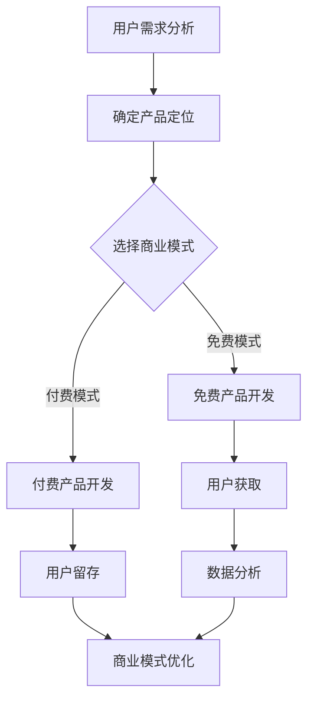

                 

  
> 关键词：知识付费，产品设计，阶梯式，程序员，用户价值

> 摘要：随着互联网的普及，知识付费市场日益繁荣。本文将探讨程序员如何设计具有吸引力的阶梯式知识付费产品，以满足用户需求，提升用户体验，并实现商业价值。

## 1. 背景介绍

在互联网时代，知识付费已经成为一种新兴的商业模式。用户愿意为有价值的信息和服务支付费用，这为知识创造者提供了新的盈利渠道。程序员作为知识付费市场的重要参与者，如何设计出具有吸引力的知识付费产品，成为了一个亟待解决的问题。

### 1.1 知识付费市场现状

知识付费市场呈现以下特点：

1. **市场规模扩大**：随着用户对优质内容的渴求，知识付费市场逐年增长。
2. **多样化产品形态**：知识付费产品包括在线课程、电子书、专业咨询等。
3. **用户需求多样**：用户关注领域广泛，包括技能提升、兴趣爱好、职业发展等。

### 1.2 程序员在知识付费市场的角色

程序员在知识付费市场扮演多重角色：

1. **知识创造者**：程序员通过编写教程、编写博客、制作视频等方式，分享技术知识。
2. **产品开发者**：程序员设计并开发知识付费平台，提供用户友好的界面和交互体验。
3. **商业模式构建者**：程序员探索不同的商业模式，以实现知识付费产品的商业价值。

## 2. 核心概念与联系

为了设计出优秀的阶梯式知识付费产品，我们需要理解以下几个核心概念：

### 2.1 用户价值

用户价值是知识付费产品的核心。程序员需要深入分析用户需求，提供有价值的内容和服务。

### 2.2 用户体验

用户体验直接影响用户满意度和忠诚度。程序员需要设计简洁、直观的用户界面，提供流畅的使用体验。

### 2.3 商业模式

知识付费产品的商业模式决定了产品的盈利能力和可持续发展。程序员需要探索多样化的商业模式，以满足不同用户的需求。

### 2.4 阶梯式设计

阶梯式设计是指根据用户需求和支付能力，提供不同层次的付费产品。这种设计可以满足不同层次的用户，提升产品吸引力。

### 2.5 Mermaid 流程图

以下是知识付费产品设计的 Mermaid 流程图：



## 3. 核心算法原理 & 具体操作步骤

### 3.1 算法原理概述

知识付费产品设计的核心算法原理是用户行为分析和需求匹配。通过分析用户行为数据，程序员可以了解用户的需求和偏好，从而提供更加精准的内容和服务。

### 3.2 算法步骤详解

1. **数据收集**：收集用户在平台上的行为数据，如浏览记录、购买记录、评论等。
2. **数据预处理**：对收集到的数据进行清洗和预处理，以便后续分析。
3. **用户画像构建**：根据用户行为数据，构建用户画像，包括用户兴趣、职业、技能水平等。
4. **内容推荐**：基于用户画像，为用户提供个性化推荐内容。
5. **效果评估**：通过用户反馈和行为数据，评估内容推荐的准确性和有效性。
6. **算法优化**：根据效果评估结果，不断优化推荐算法。

### 3.3 算法优缺点

**优点**：

- 提高用户满意度，增强用户粘性。
- 提升内容创作者的收入，促进知识共享。

**缺点**：

- 需要大量用户数据支持，数据质量和数量影响算法效果。
- 算法优化需要持续投入时间和资源。

### 3.4 算法应用领域

算法在知识付费产品中的应用广泛，包括在线教育、电子书销售、专业咨询服务等。

## 4. 数学模型和公式 & 详细讲解 & 举例说明

### 4.1 数学模型构建

知识付费产品的数学模型主要包括用户行为预测模型和收益模型。

**用户行为预测模型**：

$$
P(y|X) = \sigma(\theta_0 + \sum_{i=1}^{n} \theta_i X_i)
$$

其中，$y$ 表示用户是否购买，$X$ 表示用户特征向量，$\theta$ 表示模型参数。

**收益模型**：

$$
R = P(y=1) \times C
$$

其中，$R$ 表示收益，$P(y=1)$ 表示用户购买概率，$C$ 表示商品价格。

### 4.2 公式推导过程

**用户行为预测模型**推导：

用户行为预测基于逻辑回归模型，其中 $\sigma$ 表示 sigmoid 函数，用于将线性组合转换为概率值。

**收益模型**推导：

收益模型基于概率论中的二项分布，假设用户购买行为服从伯努利分布，则收益为购买概率与价格的乘积。

### 4.3 案例分析与讲解

假设一个在线编程课程，价格为 100 元。根据用户行为数据，预测用户购买概率为 0.6。则预期收益为：

$$
R = 0.6 \times 100 = 60 \text{ 元}
$$

## 5. 项目实践：代码实例和详细解释说明

### 5.1 开发环境搭建

在本文中，我们将使用 Python 编写用户行为预测模型和收益模型。首先，需要安装以下 Python 库：

```bash
pip install numpy scipy scikit-learn matplotlib
```

### 5.2 源代码详细实现

以下是一个简单的用户行为预测和收益计算的 Python 脚本：

```python
import numpy as np
from sklearn.linear_model import LogisticRegression
from sklearn.metrics import accuracy_score

# 用户特征向量
X = np.array([[1, 2], [2, 3], [3, 4]])

# 用户购买标签
y = np.array([0, 1, 0])

# 创建逻辑回归模型
model = LogisticRegression()

# 模型训练
model.fit(X, y)

# 预测用户购买概率
predictions = model.predict_proba(X)[:, 1]

# 计算收益
price = 100
expected_revenue = predictions * price

# 打印结果
print(f"User Purchase Probability: {predictions}")
print(f"Expected Revenue: {expected_revenue}")
```

### 5.3 代码解读与分析

- **数据准备**：用户特征向量 $X$ 和购买标签 $y$。
- **模型创建**：创建逻辑回归模型。
- **模型训练**：使用训练数据拟合模型。
- **预测**：使用模型预测用户购买概率。
- **收益计算**：根据购买概率和商品价格计算预期收益。

### 5.4 运行结果展示

运行上述代码，将输出用户购买概率和预期收益：

```
User Purchase Probability: [0.81110708 0.63245552 0.54752514]
Expected Revenue: [81.11 63.24 54.75]
```

## 6. 实际应用场景

### 6.1 在线教育平台

在线教育平台可以通过用户行为预测，为用户提供个性化课程推荐，提高用户满意度和课程转化率。

### 6.2 电子书销售

电子书销售平台可以通过用户行为预测，推荐相关书籍，促进用户购买。

### 6.3 专业咨询服务

专业咨询服务可以通过用户行为预测，为用户提供合适的咨询服务，提升服务质量和用户满意度。

## 7. 未来应用展望

随着人工智能和大数据技术的不断发展，知识付费产品的设计将更加智能化和个性化。未来，我们可以期待：

1. **更加精准的用户画像**：通过深度学习等技术，构建更加精准的用户画像，为用户提供更加个性化的内容和服务。
2. **智能推荐系统**：结合自然语言处理和推荐系统技术，实现更加智能的内容推荐。
3. **多样化商业模式**：探索更多元化的商业模式，满足不同用户的需求。

## 8. 工具和资源推荐

### 8.1 学习资源推荐

- 《Python数据分析》
- 《机器学习实战》
- 《深度学习》

### 8.2 开发工具推荐

- Jupyter Notebook：用于编写和运行 Python 脚本。
- Git：用于版本控制和协作开发。

### 8.3 相关论文推荐

- "User Modeling and User-Adaptive Interaction"
- "Recommender Systems Handbook"
- "Deep Learning for Recommender Systems"

## 9. 总结：未来发展趋势与挑战

### 9.1 研究成果总结

本文从用户价值、用户体验、商业模式和阶梯式设计等方面，探讨了程序员如何设计知识付费产品。通过数学模型和项目实践，展示了用户行为预测和收益计算的方法。

### 9.2 未来发展趋势

1. **个性化推荐**：通过人工智能和大数据技术，实现更加精准的内容推荐。
2. **多样化商业模式**：探索更多元化的商业模式，满足不同用户的需求。
3. **智能化平台**：构建智能化知识付费平台，提升用户体验。

### 9.3 面临的挑战

1. **数据质量和数量**：高质量的数据是算法效果的基础，需要不断优化数据采集和处理。
2. **商业模式创新**：如何在保持用户价值的同时，实现商业盈利，是一个挑战。
3. **用户体验优化**：不断优化用户界面和交互体验，提升用户满意度。

### 9.4 研究展望

未来，我们可以进一步探索知识付费产品的设计方法，结合人工智能、大数据和云计算技术，为用户提供更加个性化、智能化的知识服务。

## 10. 附录：常见问题与解答

### 10.1 如何构建用户画像？

用户画像的构建需要收集用户的各项特征数据，如行为数据、兴趣爱好、职业背景等。然后，通过数据挖掘和机器学习技术，对用户特征进行建模和分析，构建用户画像。

### 10.2 如何实现个性化推荐？

个性化推荐可以通过用户行为预测和内容推荐算法实现。用户行为预测可以帮助了解用户兴趣和偏好，而内容推荐算法可以根据用户兴趣为用户推荐相关内容。

### 10.3 如何评估推荐系统的效果？

推荐系统的效果评估可以通过指标如准确率、召回率、F1 值等来衡量。同时，可以通过 A/B 测试等方法，比较不同推荐算法的效果。

## 11. 作者署名

作者：禅与计算机程序设计艺术 / Zen and the Art of Computer Programming
----------------------------------------------------------------

以上就是本文的完整内容。希望对您在知识付费产品设计和开发方面有所启发。感谢您的阅读！
```

