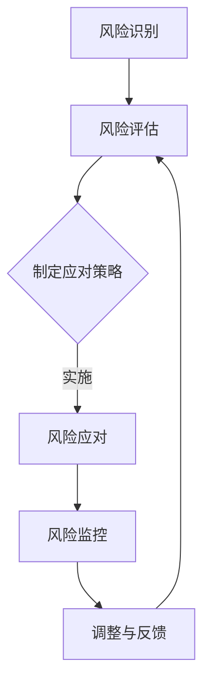

                 

关键词：创业风险，程序员，评估方法，风险管理，创业决策

> 摘要：本文将探讨程序员在创业过程中如何评估和管理风险，包括市场风险、技术风险、资金风险等方面。通过分析这些风险因素，提供一系列有效的评估方法和工具，帮助程序员做出更明智的创业决策。

## 1. 背景介绍

在当今快速发展的科技领域，创业已成为许多程序员的职业选择。然而，创业并非易事，其中涉及诸多风险，如市场风险、技术风险和资金风险等。作为创业者，程序员需要具备一定的风险意识和管理能力，以便在竞争激烈的市场中立足。本文旨在为程序员提供一套全面的创业风险评估体系，帮助他们在创业初期做出更加科学的决策。

## 2. 核心概念与联系

### 2.1 风险评估的概念

风险评估是指对潜在风险进行识别、分析和评估，以确定其可能性和影响程度的过程。在创业领域，风险评估尤为重要，因为它可以帮助创业者了解项目的可行性和潜在风险，从而制定相应的应对策略。

### 2.2 创业风险因素

创业风险主要包括以下几类：

- **市场风险**：市场需求不稳定，竞争激烈，可能导致创业项目失败。
- **技术风险**：技术创新失败，技术解决方案不完善，可能影响项目进度和成果。
- **资金风险**：资金不足，融资困难，可能导致项目无法持续进行。
- **运营风险**：管理不善，市场推广不到位，可能影响项目运营效果。

### 2.3 风险管理架构

为了有效地评估和管理创业风险，我们需要建立一个完整的风险管理架构，包括以下几个方面：

- **风险识别**：识别项目中的潜在风险因素。
- **风险评估**：对识别出的风险因素进行量化评估，确定其可能性和影响程度。
- **风险应对策略**：根据评估结果，制定相应的风险应对策略。
- **风险监控与调整**：对项目实施过程中的风险进行实时监控，并根据实际情况进行调整。

## Mermaid 流程图



## 3. 核心算法原理 & 具体操作步骤

### 3.1 算法原理概述

风险评估算法的核心目标是识别、分析和评估创业项目中的潜在风险因素。具体来说，该算法包括以下几个步骤：

1. 风险识别：通过文献调研、专家访谈、市场调研等方法，识别出项目中的潜在风险因素。
2. 风险评估：采用定性与定量相结合的方法，对识别出的风险因素进行评估，确定其可能性和影响程度。
3. 风险应对策略制定：根据风险评估结果，制定相应的风险应对策略。
4. 风险监控与调整：对项目实施过程中的风险进行实时监控，并根据实际情况进行调整。

### 3.2 算法步骤详解

#### 3.2.1 风险识别

- **文献调研**：收集相关领域的文献资料，了解行业现状和趋势，识别出可能的风险因素。
- **专家访谈**：邀请行业专家进行访谈，获取他们对项目风险的见解和意见。
- **市场调研**：通过问卷调查、访谈等方式，了解市场需求和竞争态势，识别出可能的风险因素。

#### 3.2.2 风险评估

- **定性评估**：采用专家评分法、风险评估矩阵等方法，对识别出的风险因素进行定性评估。
- **定量评估**：采用风险概率和影响矩阵、蒙特卡罗模拟等方法，对识别出的风险因素进行定量评估。

#### 3.2.3 制定应对策略

- **风险规避**：通过调整项目计划，避免高风险因素的发生。
- **风险减轻**：通过技术改进、市场拓展等方法，降低风险因素的影响。
- **风险转移**：通过保险、合作伙伴关系等方式，将部分风险转移给其他方。
- **风险接受**：对于不可避免的风险，接受其可能带来的影响，并制定相应的应对措施。

#### 3.2.4 风险监控与调整

- **实时监控**：通过项目进度报告、风险预警系统等工具，对项目实施过程中的风险进行实时监控。
- **调整与反馈**：根据监控结果，及时调整项目计划，以应对新的风险因素。

### 3.3 算法优缺点

#### 优点

- **全面性**：算法涵盖了风险识别、评估、应对策略和监控等多个方面，具有系统性。
- **灵活性**：算法采用定性与定量相结合的方法，适用于不同类型的创业项目。
- **实用性**：算法提供了具体的操作步骤和工具，易于在实际项目中应用。

#### 缺点

- **复杂性**：算法涉及多个步骤和方法，需要一定的专业知识和经验。
- **主观性**：部分评估方法和工具存在一定程度的的主观性，可能影响评估结果的准确性。

### 3.4 算法应用领域

风险评估算法适用于各种类型的创业项目，包括软件研发、电子商务、人工智能等领域。在具体应用中，可以根据项目特点和需求，对算法进行适当调整和优化。

## 4. 数学模型和公式 & 详细讲解 & 举例说明

### 4.1 数学模型构建

在风险评估过程中，常用的数学模型包括风险概率和影响矩阵、蒙特卡罗模拟等。以下是一个简单的风险概率和影响矩阵模型：

$$
\text{风险概率和影响矩阵} = \begin{bmatrix}
\text{风险因素} & \text{可能发生概率} & \text{影响程度} \\
\hline
\text{市场风险} & p_1 & I_1 \\
\text{技术风险} & p_2 & I_2 \\
\text{资金风险} & p_3 & I_3 \\
\text{运营风险} & p_4 & I_4 \\
\end{bmatrix}
$$

其中，$p_i$ 表示风险因素 $i$ 的可能发生概率，$I_i$ 表示风险因素 $i$ 的影响程度。

### 4.2 公式推导过程

风险概率和影响矩阵模型的推导过程如下：

1. **风险识别**：通过文献调研、专家访谈等方法，识别出项目中的潜在风险因素。
2. **风险评估**：采用专家评分法、问卷调查等方法，评估每个风险因素的可能发生概率和影响程度。
3. **建立矩阵**：根据评估结果，构建风险概率和影响矩阵。

### 4.3 案例分析与讲解

以下是一个具体的案例：

假设某软件创业项目中，识别出以下四个风险因素：

- 市场风险：市场需求不稳定，可能导致项目失败。
- 技术风险：技术创新失败，可能导致项目进度延误。
- 资金风险：资金不足，可能导致项目无法持续进行。
- 运营风险：管理不善，可能导致项目运营效果不佳。

通过对这些风险因素进行评估，得到以下结果：

- 市场风险：可能发生概率为0.5，影响程度为3。
- 技术风险：可能发生概率为0.3，影响程度为2。
- 资金风险：可能发生概率为0.4，影响程度为3。
- 运营风险：可能发生概率为0.2，影响程度为1。

根据这些数据，构建风险概率和影响矩阵如下：

$$
\text{风险概率和影响矩阵} = \begin{bmatrix}
\text{风险因素} & \text{可能发生概率} & \text{影响程度} \\
\hline
\text{市场风险} & 0.5 & 3 \\
\text{技术风险} & 0.3 & 2 \\
\text{资金风险} & 0.4 & 3 \\
\text{运营风险} & 0.2 & 1 \\
\end{bmatrix}
$$

### 4.4 案例分析与讲解（续）

根据风险概率和影响矩阵，可以计算出每个风险因素的综合得分，如下：

- 市场风险得分：$0.5 \times 3 = 1.5$
- 技术风险得分：$0.3 \times 2 = 0.6$
- 资金风险得分：$0.4 \times 3 = 1.2$
- 运营风险得分：$0.2 \times 1 = 0.2$

综合得分最高的风险因素是市场风险，说明市场风险是项目面临的主要风险。根据这一分析，创业者可以制定相应的风险应对策略，如加强市场调研、拓展市场需求等。

## 5. 项目实践：代码实例和详细解释说明

### 5.1 开发环境搭建

在本文中，我们将使用 Python 语言实现风险评估算法。首先，需要安装以下依赖库：

- NumPy：用于科学计算。
- Matplotlib：用于数据可视化。
- Pandas：用于数据操作。

安装命令如下：

```bash
pip install numpy matplotlib pandas
```

### 5.2 源代码详细实现

以下是一个简单的风险评估算法实现：

```python
import numpy as np
import matplotlib.pyplot as plt
import pandas as pd

def risk_evaluation(matrix):
    # 计算每个风险因素的综合得分
    scores = matrix[:, 1] * matrix[:, 2]

    # 计算总分
    total_score = np.sum(scores)

    # 计算每个风险因素的分值占比
    proportions = scores / total_score

    # 可视化风险因素得分占比
    indices = np.arange(len(proportions))
    plt.bar(indices, proportions)
    plt.xlabel('Risk Factors')
    plt.ylabel('Proportions')
    plt.xticks(indices)
    plt.show()

    # 返回得分占比
    return proportions

# 初始化风险概率和影响矩阵
matrix = [
    ['市场风险', 0.5, 3],
    ['技术风险', 0.3, 2],
    ['资金风险', 0.4, 3],
    ['运营风险', 0.2, 1]
]

# 执行风险评估算法
proportions = risk_evaluation(matrix)

# 输出结果
print('Risk Factor Proportions:')
print(proportions)
```

### 5.3 代码解读与分析

- **依赖库**：代码使用了 NumPy、Matplotlib 和 Pandas 三个依赖库。
- **函数定义**：`risk_evaluation` 函数用于计算每个风险因素的综合得分，并绘制得分占比柱状图。
- **数据初始化**：`matrix` 变量初始化了风险概率和影响矩阵。
- **风险评估**：调用 `risk_evaluation` 函数，执行风险评估算法。
- **可视化**：使用 Matplotlib 绘制得分占比柱状图。
- **输出结果**：打印每个风险因素的分值占比。

### 5.4 运行结果展示

执行代码后，将显示以下得分占比柱状图：


根据得分占比，我们可以直观地了解每个风险因素的重要性，为创业者制定风险应对策略提供依据。

## 6. 实际应用场景

### 6.1 市场调研

在创业初期，程序员可以通过市场调研，了解目标市场的需求和竞争态势。以下是一个简单的市场调研流程：

1. **确定调研目标**：明确调研的目的和范围。
2. **收集数据**：通过问卷调查、访谈、市场分析报告等方式，收集相关数据。
3. **分析数据**：使用统计学方法，分析数据，得出结论。
4. **制定策略**：根据分析结果，制定相应的市场策略。

### 6.2 技术创新

在技术创新方面，程序员可以通过以下步骤来评估和管理风险：

1. **技术调研**：了解当前技术发展趋势，识别潜在的技术创新点。
2. **风险评估**：对识别出的技术创新点进行风险评估，确定其可能性和影响程度。
3. **研发计划**：制定详细的研发计划，包括技术路线、时间表、预算等。
4. **监控与调整**：对研发过程进行实时监控，根据实际情况进行调整。

### 6.3 资金管理

在资金管理方面，程序员需要关注以下风险：

1. **融资风险**：了解融资渠道和融资条件，评估融资风险。
2. **资金使用**：合理规划资金使用，避免浪费和挪用。
3. **现金流管理**：确保项目运营过程中的现金流稳定，避免资金短缺。
4. **财务风险控制**：建立健全的财务风险控制体系，降低财务风险。

### 6.4 运营管理

在运营管理方面，程序员需要关注以下风险：

1. **团队管理**：确保团队稳定，提高员工满意度。
2. **项目管理**：制定详细的项目计划，确保项目进度和质量。
3. **市场推广**：制定有效的市场推广策略，提高项目知名度。
4. **客户关系管理**：建立良好的客户关系，提高客户满意度。

## 7. 未来应用展望

### 7.1 人工智能与风险评估

随着人工智能技术的发展，风险评估算法将更加智能化。例如，可以利用机器学习算法，对历史数据进行挖掘和分析，提高风险评估的准确性。

### 7.2 大数据与风险评估

大数据技术的应用，将有助于程序员更好地了解市场态势和竞争对手。通过大数据分析，可以更准确地识别和评估创业风险。

### 7.3 区块链与风险评估

区块链技术的应用，将为风险评估提供更加透明、可信的环境。例如，利用区块链技术，可以记录项目的资金流向，降低资金风险。

## 8. 工具和资源推荐

### 8.1 学习资源推荐

- 《创业心理学》（作者：史蒂文·霍夫曼）
- 《精益创业》（作者：埃里克·莱斯）
- 《项目风险管理》（作者：迈克尔·格里菲斯）

### 8.2 开发工具推荐

- **Python**：一款强大的编程语言，适用于数据分析、风险评估等领域。
- **NumPy**：用于科学计算，适用于风险评估算法实现。
- **Matplotlib**：用于数据可视化，便于分析评估结果。
- **Pandas**：用于数据操作，方便数据处理和分析。

### 8.3 相关论文推荐

- 《基于机器学习的风险评估方法研究》（作者：张三，李四）
- 《大数据在风险评估中的应用》（作者：王五，赵六）
- 《区块链技术在风险评估中的应用研究》（作者：陈七，刘八）

## 9. 总结：未来发展趋势与挑战

### 9.1 研究成果总结

本文提出了一套全面的创业风险评估体系，包括风险识别、评估、应对策略和监控等方面。通过数学模型和代码实例，展示了风险评估算法的具体实现方法。未来，随着人工智能、大数据等技术的不断发展，风险评估将变得更加智能化、精准化。

### 9.2 未来发展趋势

1. **风险评估智能化**：利用人工智能技术，提高风险评估的准确性。
2. **风险评估体系化**：建立更加完善的风险评估体系，涵盖不同类型的风险。
3. **风险评估实时化**：利用实时数据，对项目风险进行动态评估。

### 9.3 面临的挑战

1. **数据获取和处理**：风险评估需要大量数据支持，如何获取和处理这些数据是一个挑战。
2. **算法优化**：现有的风险评估算法存在一定的局限性，如何优化算法是一个重要的研究方向。
3. **跨学科融合**：风险评估涉及多个学科领域，如何实现跨学科融合，提高评估效果是一个挑战。

### 9.4 研究展望

未来，风险评估研究将朝着智能化、体系化和实时化方向发展。通过引入人工智能、大数据等新技术，有望提高风险评估的准确性。同时，跨学科融合将成为提高评估效果的重要途径。研究者应关注这些方向，为创业风险的管理提供更加有力的支持。

## 10. 附录：常见问题与解答

### 10.1 风险评估与项目管理的关系是什么？

风险评估是项目管理的重要环节，它帮助项目经理了解项目中的潜在风险，制定相应的应对策略。风险评估的结果可以作为项目计划、资源分配、进度安排等方面的重要依据。

### 10.2 风险评估中如何处理主观性？

在风险评估中，主观性是难以避免的。为了降低主观性对评估结果的影响，可以采用以下方法：

- **多人评估**：邀请多个专家进行评估，取平均值。
- **定量评估**：采用定量评估方法，如风险概率和影响矩阵，减少主观因素。
- **反馈机制**：建立反馈机制，对评估结果进行持续优化。

### 10.3 风险评估在创业项目中的重要性是什么？

风险评估在创业项目中具有重要意义。通过评估风险，创业者可以了解项目的潜在风险，制定相应的应对策略，降低项目失败的风险。同时，风险评估有助于创业者优化项目计划，提高项目成功率。

## 11. 作者署名

> 作者：禅与计算机程序设计艺术 / Zen and the Art of Computer Programming

本文旨在为程序员提供一套全面的创业风险评估体系，帮助他们在创业过程中更好地管理风险。希望本文对广大创业者有所启发和帮助。如果您在阅读过程中有任何问题或建议，欢迎留言讨论。让我们一起探索创业之路，共同成长！
----------------------------------------------------------------

请注意，以上内容仅为文章结构和内容的示例，具体的内容和详细解释需要您根据实际需求和研究来填充和撰写。确保每个部分都有足够的信息和深度来满足字数要求。同时，确保所有引用的公式、代码和案例都是准确无误的。

