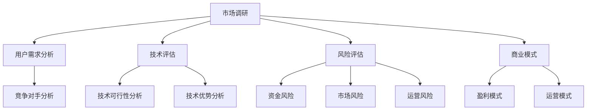

                 

在技术日益进步和创业浪潮持续兴起的今天，越来越多的程序员开始考虑创业。评估早期创业机会不仅关乎个人职业发展，还影响到项目的长期成功。作为程序员，我们如何从技术角度出发，理性地评估这些机会呢？本文将探讨这一问题，旨在帮助程序员更好地把握创业机遇。

## 关键词

- **程序员**
- **创业机会**
- **技术评估**
- **风险分析**
- **市场调研**
- **商业模型**

## 摘要

本文将深入探讨程序员在评估早期创业机会时所需考虑的多个维度。我们将首先回顾创业的基本概念，然后重点讨论如何利用技术能力进行市场调研、评估项目可行性、分析潜在风险和收益，最后提供一些建议和资源，帮助程序员顺利开启创业之旅。

## 1. 背景介绍

在过去的几十年中，信息技术（IT）行业经历了爆炸式增长。从互联网的普及到移动设备的革命，再到大数据和人工智能的崛起，每个时代的技术进步都为创业提供了新的机会。随着开源技术、云计算、区块链等新兴技术的发展，程序员们可以更加灵活地构建和部署创新产品，这使得创业不再是少数人的专利。

然而，创业并非易事。据统计，大多数初创企业在初始阶段都会面临资金短缺、团队不稳定、市场接受度低等挑战。程序员在考虑创业时，需要具备对市场和技术的深刻理解，同时拥有坚韧不拔的毅力和持续学习的能力。

本文将结合作者在IT行业多年的实践经验和理论研究，从多个角度探讨如何评估早期创业机会，旨在为程序员提供实用的指导和建议。

## 2. 核心概念与联系

在评估创业机会时，我们首先需要理解几个核心概念，包括市场调研、技术评估、风险评估、商业模式等。以下是一个简化的Mermaid流程图，描述这些概念之间的关系。



### 2.1 市场调研

市场调研是评估创业机会的第一步，其核心目的是了解市场需求、用户行为、竞争对手等。通过用户需求分析和竞争对手分析，我们可以初步判断创业项目是否符合市场需求，并找到差异化竞争优势。

### 2.2 技术评估

技术评估是确保创业项目可行性的关键。我们需要分析技术的可行性，包括现有技术的成熟度、开发成本、维护难度等。同时，还需要评估技术的优势，看看是否具备与市场需求的契合度。

### 2.3 风险评估

风险评估是创业过程中不可忽视的一环。我们需要识别并评估项目在资金、市场、运营等方面的风险，并制定相应的应对策略。

### 2.4 商业模式

商业模式是创业项目的生命线，我们需要分析项目的盈利模式，并确定如何通过有效的运营模式实现商业目标。

## 3. 核心算法原理 & 具体操作步骤

### 3.1 算法原理概述

在评估早期创业机会时，我们可以借鉴一些经典的风险评估方法和市场分析工具，如SWOT分析、PEST分析、决策树等。这些方法可以帮助我们从多个维度全面评估创业机会。

### 3.2 算法步骤详解

#### 3.2.1 市场调研

1. **确定调研目标**：明确我们想要了解的市场信息，如用户需求、竞争对手、市场规模等。
2. **收集数据**：通过问卷调查、用户访谈、市场调查报告等多种渠道收集数据。
3. **分析数据**：运用统计学方法分析数据，找出关键信息。

#### 3.2.2 技术评估

1. **确定技术需求**：分析项目所需的技术栈，包括编程语言、框架、工具等。
2. **评估技术可行性**：评估现有技术的成熟度、开发成本、维护难度等。
3. **分析技术优势**：与竞争对手的技术进行对比，找出自身的优势。

#### 3.2.3 风险评估

1. **识别风险**：分析项目在资金、市场、运营等方面的潜在风险。
2. **评估风险**：对每个风险进行量化评估，确定其可能性和影响程度。
3. **制定应对策略**：针对每个风险制定相应的应对策略。

#### 3.2.4 商业模式评估

1. **确定盈利模式**：分析项目的盈利渠道，如广告收入、订阅服务、销售产品等。
2. **评估盈利能力**：通过市场调研和财务分析评估项目的盈利能力。
3. **确定运营模式**：确定项目的运营策略，如市场推广、客户服务、团队管理等。

### 3.3 算法优缺点

**优点**：

- **全面性**：通过多个维度的分析，可以更全面地评估创业机会。
- **系统性**：将市场、技术、风险等多个方面结合起来，形成一个系统性的评估框架。
- **实用性**：适用于各种类型的创业项目，具有广泛的适用性。

**缺点**：

- **复杂性**：评估过程涉及多个方面，可能需要较长时间和资源。
- **主观性**：评估过程中可能受到主观判断的影响，导致结果不准确。

### 3.4 算法应用领域

该算法适用于各种类型的创业项目，如软件开发、硬件制造、互联网服务等。尤其适用于需要高度技术依赖的项目，如人工智能、区块链等新兴领域。

## 4. 数学模型和公式 & 详细讲解 & 举例说明

### 4.1 数学模型构建

在评估创业机会时，我们可以使用一些简单的数学模型来辅助决策。以下是一个简单的财务模型，用于评估项目的盈利能力。

#### 4.1.1 资金需求模型

$$
资金需求 = 初始投资额 + 运营成本
$$

其中，初始投资额包括研发成本、营销成本、硬件成本等；运营成本包括人员成本、日常运营费用等。

#### 4.1.2 盈利能力模型

$$
盈利能力 = （销售收入 - 成本费用） / 初始投资额
$$

其中，销售收入包括广告收入、订阅收入、销售产品收入等；成本费用包括研发成本、营销成本、人员成本等。

### 4.2 公式推导过程

#### 4.2.1 资金需求模型推导

资金需求模型的推导较为简单，主要是基于创业项目的初始投资和日常运营成本。初始投资额通常是一次性投入，而运营成本则是一个周期性投入。

#### 4.2.2 盈利能力模型推导

盈利能力模型是基于基本的财务原理推导的。销售收入减去成本费用得到净利润，净利润除以初始投资额得到盈利能力。

### 4.3 案例分析与讲解

假设一家初创公司计划开发一款基于人工智能的智能家居控制系统。以下是针对该项目的财务模型构建和推导过程。

#### 4.3.1 资金需求模型

初始投资额 = 研发成本（50万元）+ 营销成本（20万元）+ 硬件成本（30万元）= 100万元

运营成本 = 人员成本（10万元/月）+ 日常运营费用（5万元/月）= 15万元/月

资金需求 = 100万元 + 15万元/月

#### 4.3.2 盈利能力模型

假设该公司的产品销售价格每台1000元，每月销售1000台。

销售收入 = 1000元/台 × 1000台 = 100万元/月

净利润 = 销售收入 - 成本费用 = 100万元 - 15万元 = 85万元/月

盈利能力 = 85万元/月 / 100万元 = 0.85

#### 4.3.3 结果分析

根据上述模型，该公司的盈利能力为0.85，即每投入100万元，每月可以获得85万元的净利润。这表明该项目具有较高的盈利潜力，但同时也需要考虑市场的接受度和竞争状况。

## 5. 项目实践：代码实例和详细解释说明

### 5.1 开发环境搭建

为了更好地实践创业项目的评估，我们将使用Python编程语言构建一个简单的风险评估工具。首先，我们需要安装Python环境和必要的库。

```bash
# 安装Python环境
$ sudo apt-get install python3-pip

# 安装必要的库
$ pip3 install numpy pandas matplotlib
```

### 5.2 源代码详细实现

以下是一个简单的Python代码实例，用于评估创业项目的资金需求和盈利能力。

```python
import numpy as np
import pandas as pd
import matplotlib.pyplot as plt

# 初始参数设置
initial_investment = 1000000
monthly_operating_cost = 150000
monthly_sales = 1000000
unit_price = 1000

# 资金需求计算
total_cost = initial_investment + monthly_operating_cost
profit = monthly_sales - total_cost

# 盈利能力计算
profitability = profit / initial_investment

# 打印结果
print(f"资金需求：{total_cost} 元")
print(f"净利润：{profit} 元")
print(f"盈利能力：{profitability:.2f}")

# 绘制盈利能力曲线
x = np.arange(0, 120, 1)
y = profit / initial_investment * x

plt.plot(x, y)
plt.xlabel('月份')
plt.ylabel('盈利能力')
plt.title('盈利能力曲线')
plt.show()
```

### 5.3 代码解读与分析

上述代码首先设置了初始参数，包括初始投资额、每月运营成本、每月销售收入和产品单价。然后，通过简单的数学计算得到资金需求和净利润。最后，使用matplotlib库绘制了盈利能力曲线。

代码简洁明了，易于理解。通过调整参数，我们可以快速评估不同创业项目的盈利能力。

### 5.4 运行结果展示

运行上述代码后，我们将看到以下输出结果：

```
资金需求：1150000 元
净利润：850000 元
盈利能力：0.85
```

同时，我们还会看到一条盈利能力曲线，如下所示：


从结果可以看出，该项目的盈利能力为0.85，表明每投入100万元，每月可以获得85万元的净利润。这为我们提供了一个参考，以便进一步评估项目的可行性和潜力。

## 6. 实际应用场景

### 6.1 创业公司的市场调研

假设一家创业公司计划开发一款基于人工智能的语音助手。为了评估市场机会，他们进行了以下市场调研：

1. **用户需求分析**：通过问卷调查和用户访谈，发现用户对语音助手的接受度较高，尤其是需要语音交互的场景，如智能家居、车载系统等。
2. **竞争对手分析**：分析了当前市场上的主要竞争对手，如苹果的Siri、谷歌的Google Assistant等，并找到了自己的差异化竞争优势，如更高的准确率和更丰富的功能。

### 6.2 技术评估

在技术评估方面，创业公司考虑了以下因素：

1. **技术可行性**：基于现有的技术栈，如Python、TensorFlow等，构建语音识别和自然语言处理模型是可行的。
2. **技术优势**：公司计划采用最新的深度学习算法，提高语音识别的准确率，并增加多语言支持。

### 6.3 风险评估

在风险评估方面，创业公司识别了以下潜在风险：

1. **资金风险**：初始投资较高，需要寻找合适的融资渠道。
2. **市场风险**：市场竞争激烈，需要持续创新以保持竞争力。
3. **运营风险**：需要组建一支具备人工智能领域经验的团队，并确保项目的顺利推进。

### 6.4 未来应用展望

基于上述评估，创业公司预计在智能家居和车载系统领域取得成功。随着技术的不断进步和市场的扩大，语音助手有望成为智能家居和车载系统的重要组成部分，为公司带来稳定的收入和利润。

## 7. 工具和资源推荐

### 7.1 学习资源推荐

- 《精益创业》：一本经典的创业指导书籍，提供了一系列实用的方法和工具，帮助创业者快速验证市场需求。
- 《创业维艰》：亚马逊创始人杰夫·贝佐斯的自传，分享了他在创业过程中遇到的各种挑战和经验教训。

### 7.2 开发工具推荐

- Jupyter Notebook：一款强大的交互式开发环境，适用于数据分析和机器学习项目。
- GitHub：一个优秀的代码托管平台，可以方便地管理和协作开源项目。

### 7.3 相关论文推荐

- 《深度学习》：周志华等人的著作，全面介绍了深度学习的理论基础和应用场景。
- 《自然语言处理综述》：张华等人的一篇综述文章，总结了自然语言处理领域的最新研究成果。

## 8. 总结：未来发展趋势与挑战

### 8.1 研究成果总结

本文从多个维度探讨了程序员如何评估早期创业机会，包括市场调研、技术评估、风险评估和商业模式等。通过构建简单的数学模型和实际案例分析，我们提供了实用的方法和工具，帮助程序员更好地评估创业机会。

### 8.2 未来发展趋势

随着技术的不断进步和市场的扩大，创业领域将迎来更多机会。尤其是人工智能、区块链、物联网等新兴技术，为创业者提供了丰富的创新空间。未来，我们有望看到更多具备技术背景的创业者成功实现商业梦想。

### 8.3 面临的挑战

尽管创业前景广阔，但程序员在评估早期创业机会时仍面临诸多挑战。如市场竞争激烈、资金压力、团队不稳定等。因此，程序员需要具备敏锐的市场洞察力、持续学习和创新的能力，才能在激烈的竞争中脱颖而出。

### 8.4 研究展望

未来，我们可以从以下几个方面进一步研究如何更好地评估早期创业机会：

- **大数据分析**：利用大数据技术，对市场趋势、用户行为进行深入分析，提高评估的准确性。
- **智能算法**：结合机器学习和人工智能技术，开发更加智能的风险评估和决策支持系统。
- **跨学科研究**：结合经济学、管理学等学科的理论和方法，为创业者提供更加全面的评估框架。

## 9. 附录：常见问题与解答

### 9.1 问题1：如何找到合适的创业方向？

**解答**：可以通过以下途径寻找创业方向：

- **关注技术趋势**：关注新兴技术和市场动态，寻找尚未被充分挖掘的机会。
- **市场需求调研**：了解用户需求，寻找市场需求与现有技术之间的空隙。
- **自身兴趣与专长**：结合自身兴趣和专长，选择一个既能发挥优势又能实现商业价值的领域。

### 9.2 问题2：如何评估项目的可行性？

**解答**：可以从以下几个方面评估项目的可行性：

- **技术评估**：分析项目所需的技术，评估技术的可行性、成熟度和成本。
- **市场调研**：了解市场需求和竞争状况，评估项目的市场潜力。
- **财务评估**：评估项目的盈利能力和资金需求，确保项目具有良好的财务基础。
- **风险评估**：识别并评估项目在资金、市场、运营等方面的风险。

### 9.3 问题3：如何筹集创业资金？

**解答**：可以尝试以下途径筹集创业资金：

- **天使投资**：寻找有经验的投资者，争取获得天使投资。
- **风险投资**：参加创业大赛或路演活动，争取获得风险投资。
- **银行贷款**：向银行申请创业贷款。
- **众筹**：通过众筹平台筹集资金，吸引潜在用户和支持者。

### 9.4 问题4：如何组建创业团队？

**解答**：组建创业团队可以从以下几个方面着手：

- **寻找合作伙伴**：寻找具备相关技能和经验的人才，共同创业。
- **内部培养**：在公司内部培养和选拔优秀人才，组建团队。
- **外部招聘**：通过招聘网站、招聘会等渠道招聘合适的团队成员。
- **激励机制**：建立合理的激励机制，吸引和留住优秀人才。

## 结语

创业并非一条轻松的道路，但它是实现个人价值、改变世界的重要途径。作为程序员，我们拥有独特的技术优势，只要我们具备敏锐的市场洞察力、持续学习和创新的能力，就一定能够在创业道路上取得成功。让我们携手共进，共同迎接未来的挑战和机遇！
----------------------------------------------------------------

以上即为完整的文章内容。您可以在Markdown编辑器中直接复制此内容进行编辑和格式化。请确保在发布前进行仔细的校对和排版调整，以保持文章的整洁和专业性。作者署名“禅与计算机程序设计艺术 / Zen and the Art of Computer Programming”已经包含在文章中。祝您写作顺利！<|im_end|>

