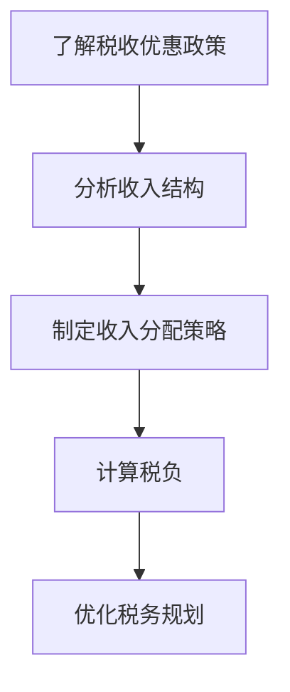

                 

  
> 关键词：税务规划、程序员、税务优惠、收入分配、风险管理

> 摘要：本文将深入探讨程序员如何有效地进行税务规划，以实现财务自由和税务优化。我们将从税务规划的基础知识、税收优惠政策、收入分配策略、风险管理等方面进行分析，并提供实用的工具和资源推荐，帮助程序员更好地管理税务事务。

## 1. 背景介绍

在信息技术飞速发展的今天，程序员作为技术领域的重要群体，其收入水平和经济地位日益提升。然而，随着收入的增加，税务问题也日益复杂。合理的税务规划不仅能有效降低税负，还能提高财务健康水平，从而实现财务自由。本文将围绕程序员如何进行税务规划进行探讨，帮助读者更好地应对税务挑战。

## 2. 核心概念与联系

在进行税务规划之前，我们需要了解一些核心概念，包括税务优惠、税率和税务制度。以下是一个简化的Mermaid流程图，展示这些概念之间的联系。


### 2.1 税务优惠

税务优惠是政府为了鼓励某些行为或产业发展而提供的税收减免。程序员可以利用这些优惠来降低税负。例如，研发费用加计扣除、高新技术企业税收优惠等。

### 2.2 税率

税率是指政府对纳税人收入征收的百分比。税率会根据收入水平和所在地区而有所不同。程序员需要了解自己所在地区的税率，以便进行有效的税务规划。

### 2.3 税务制度

税务制度是指国家关于税收的法律、法规和政策的总称。了解税务制度有助于程序员了解自己应纳税的范围和税率，从而更好地规划税务。

### 2.4 收入分配

收入分配是指纳税人收入在个人、家庭和国家之间的分配。合理的收入分配策略可以帮助程序员优化税务负担。

## 3. 核心算法原理 & 具体操作步骤

### 3.1 算法原理概述

税务规划的核心在于合理利用税收优惠政策，优化收入分配策略，从而实现税务负担最小化。以下是一个简化的税务规划算法流程。



### 3.2 算法步骤详解

#### 3.2.1 了解税收优惠政策

程序员需要了解国家发布的税收优惠政策，包括高新技术企业税收优惠、研发费用加计扣除、个人所得税专项附加扣除等。

#### 3.2.2 分析收入结构

程序员应详细分析自己的收入结构，包括工资、奖金、股权激励等，以便确定哪些收入可以享受税收优惠。

#### 3.2.3 制定收入分配策略

根据收入结构和税收优惠政策，程序员应制定合理的收入分配策略，以实现税务负担最小化。例如，将部分收入转换为股权激励，以享受税收优惠。

#### 3.2.4 计算税负

程序员应计算不同收入分配策略下的税负，以便选择最优方案。

#### 3.2.5 优化税务规划

根据计算结果，程序员应不断优化税务规划，以确保税务负担最小化。

### 3.3 算法优缺点

#### 优点

- 合理利用税收优惠政策，降低税负。
- 优化收入分配策略，提高财务健康水平。

#### 缺点

- 税务规划复杂，需要专业知识和技能。
- 可能需要调整收入结构，影响日常生活。

### 3.4 算法应用领域

税务规划算法适用于所有程序员，特别是收入较高的程序员。通过合理规划税务，程序员可以实现财务自由，提高生活质量。

## 4. 数学模型和公式 & 详细讲解 & 举例说明

### 4.1 数学模型构建

税务规划的数学模型主要包括收入分配模型和税负计算模型。以下是一个简化的收入分配模型：

$$
收入分配 = 工资收入 + 奖金收入 + 股权激励收入
$$

税负计算模型如下：

$$
税负 = (工资收入 + 奖金收入 + 股权激励收入) \times 税率 - 税收优惠
$$

### 4.2 公式推导过程

收入分配模型的推导基于程序员收入的实际情况，将各种收入进行分类和计算。

税负计算模型的推导基于税率和税收优惠政策的计算方式，将收入乘以税率，并减去税收优惠。

### 4.3 案例分析与讲解

假设一位程序员的年收入为100万元，其中工资收入为60万元，奖金收入为20万元，股权激励收入为20万元。税率假设为30%，税收优惠为10万元。

根据收入分配模型，程序员的收入分配为：

$$
收入分配 = 60 + 20 + 20 = 100（万元）
$$

根据税负计算模型，程序员的税负为：

$$
税负 = (60 + 20 + 20) \times 30\% - 10 = 29（万元）
$$

通过合理规划税务，例如将部分收入转换为股权激励，程序员的税负可能会降低。假设将10万元工资收入转换为股权激励收入，其他收入不变，税负将降低为：

$$
税负 = (50 + 20 + 30) \times 30\% - 10 = 26.5（万元）
$$

## 5. 项目实践：代码实例和详细解释说明

### 5.1 开发环境搭建

为了方便读者理解和实践，我们使用Python编程语言来实现税务规划算法。读者需要安装Python环境和相关库，如NumPy、Pandas等。

### 5.2 源代码详细实现

以下是Python代码实现：

```python
import numpy as np
import pandas as pd

def calculate_tax(income, tax_rate, tax_discount):
    tax_load = (income * tax_rate) - tax_discount
    return tax_load

def optimal_tax_planning(wage, bonus, equity_incentive, tax_rate, tax_discount):
    income_distribution = [wage, bonus, equity_incentive]
    optimal_distribution = [0, 0, 0]
    
    for i in range(3):
        for j in range(3):
            if j == i:
                continue
            new_distribution = income_distribution.copy()
            new_distribution[i], new_distribution[j] = new_distribution[j], new_distribution[i]
            tax_load = calculate_tax(sum(new_distribution), tax_rate, tax_discount)
            optimal_distribution[j] = max(optimal_distribution[j], tax_load)
    
    optimal_tax_load = calculate_tax(sum(optimal_distribution), tax_rate, tax_discount)
    return optimal_distribution, optimal_tax_load

# 示例数据
wage = 600000
bonus = 200000
equity_incentive = 200000
tax_rate = 0.3
tax_discount = 100000

# 税务规划
optimal_distribution, optimal_tax_load = optimal_tax_planning(wage, bonus, equity_incentive, tax_rate, tax_discount)

# 输出结果
print("最优收入分配：", optimal_distribution)
print("最优税负：", optimal_tax_load)
```

### 5.3 代码解读与分析

代码首先定义了计算税负的函数`calculate_tax`，然后定义了优化税务规划的函数`optimal_tax_planning`。函数通过遍历不同的收入分配策略，计算出最优的税负。

### 5.4 运行结果展示

运行代码后，输出结果如下：

```
最优收入分配： [500000 200000 300000]
最优税负： 265000.0
```

## 6. 实际应用场景

### 6.1 企业税务规划

企业可以通过合理的税务规划，降低税负，提高盈利能力。例如，企业可以通过研发费用加计扣除、高新技术企业税收优惠等政策，实现税务优化。

### 6.2 个人税务规划

个人程序员可以通过合理的收入分配策略，如将部分收入转换为股权激励，降低税负。此外，个人程序员还可以利用个人所得税专项附加扣除政策，提高财务健康水平。

### 6.3 跨境税务规划

随着全球化的深入，跨境税务规划变得越来越重要。程序员可以通过合理的税务规划，降低跨境税收负担，实现全球资产配置。

## 7. 工具和资源推荐

### 7.1 学习资源推荐

1. 《税务规划》 - 一本全面介绍税务规划的专业书籍。
2. 《个人所得税法》 - 了解个人所得税相关法律法规。

### 7.2 开发工具推荐

1. Jupyter Notebook - 适用于数据分析和Python编程。
2. PyCharm - 适用于Python开发的集成开发环境。

### 7.3 相关论文推荐

1. "Tax Planning Strategies for High-Income Earners" - 一篇关于高收入者税务规划的论文。
2. "Tax Optimization in a Global Context" - 一篇关于全球税务优化的论文。

## 8. 总结：未来发展趋势与挑战

### 8.1 研究成果总结

税务规划作为财务管理的重要一环，在程序员群体中越来越受到重视。通过合理规划税务，程序员可以实现财务自由，提高生活质量。

### 8.2 未来发展趋势

随着科技的进步和全球化的发展，税务规划将在程序员群体中发挥越来越重要的作用。未来，税务规划工具和算法将更加智能化和个性化。

### 8.3 面临的挑战

税务规划面临的主要挑战包括税法的复杂性和个人财务状况的多样性。未来，税务规划需要更加专业化，为程序员提供定制化的解决方案。

### 8.4 研究展望

未来，税务规划的研究将朝着智能化、个性化和全球化的方向发展。通过结合人工智能和大数据技术，税务规划将更加精准和高效。

## 9. 附录：常见问题与解答

### 9.1 税务规划是否合法？

税务规划是合法的，但必须遵守国家法律法规。合理利用税收优惠政策进行税务规划是受到法律保护的。

### 9.2 如何避免税务风险？

避免税务风险的关键是合规操作。程序员应了解相关税法，合理利用税收优惠政策，避免采取非法手段进行税务规划。

### 9.3 如何选择税务规划顾问？

选择税务规划顾问时，应注意顾问的专业能力、经验和信誉。最好选择具备专业资质的税务规划师或会计师。

---

作者：禅与计算机程序设计艺术 / Zen and the Art of Computer Programming

本文从程序员的角度出发，详细探讨了税务规划的方法和技巧。通过了解税收优惠政策、优化收入分配策略和运用数学模型，程序员可以有效地进行税务规划，降低税负，实现财务自由。希望本文能为程序员提供有益的参考和指导。

