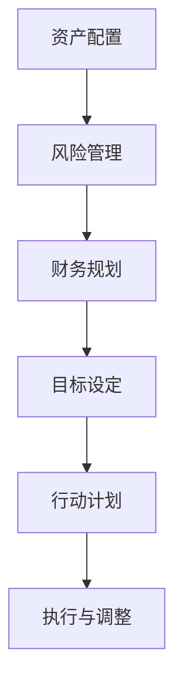

                 

关键词：理财、程序员、投资、风险、资产配置、财务规划

摘要：本文将探讨程序员在理财过程中常犯的误区，并提供相应的解决方案。通过深入了解这些误区，程序员可以更好地管理个人财务，实现财务自由。

## 1. 背景介绍

作为技术领域的佼佼者，程序员通常在专业技能和职业发展方面表现出色。然而，在理财方面，他们可能面临着许多挑战和误区。本文旨在帮助程序员识别并避免这些误区，从而实现财务目标。

### 1.1 理财的重要性

理财不仅仅是富人的专利，对于任何希望实现财务自由的人来说都是至关重要的。理财可以帮助我们：

- 规划未来：确保退休后有足够的资金。
- 应对紧急情况：如失业、疾病等。
- 实现目标：如购房、旅行等。

### 1.2 程序员的特点

程序员通常具有以下特点，这些特点在理财过程中可能会带来挑战：

- 高收入：程序员往往拥有较高的收入，但这也可能导致过度消费。
- 稳定的职业发展：程序员职业稳定性较高，但收入波动性可能较大。
- 缺乏理财经验：虽然程序员擅长解决问题，但理财并非他们的强项。

## 2. 核心概念与联系

### 2.1 资产配置

资产配置是指将资金分配到不同的资产类别中，以实现风险和收益的平衡。对于程序员来说，了解资产配置的基本原则至关重要。

### 2.2 风险管理

风险管理是理财过程中的重要环节。程序员需要了解自己的风险承受能力，并根据风险偏好进行投资。

### 2.3 财务规划

财务规划是指制定长期的财务目标，并制定实现这些目标的计划。程序员需要学会制定明确的财务目标，并制定可行的行动计划。

### 2.4 Mermaid 流程图

以下是一个简化的资产配置、风险管理和财务规划的 Mermaid 流程图：



## 3. 核心算法原理 & 具体操作步骤

### 3.1 算法原理概述

理财的核心算法是优化投资组合，以实现最佳的风险收益比。以下是一些常见的算法原理：

- 均值回归原理：长期来看，高收益投资往往伴随着高风险。
- 马科维茨投资组合理论：通过多样化投资来降低风险。

### 3.2 算法步骤详解

1. **设定财务目标**：明确你想要实现的目标，如购房、子女教育等。
2. **评估风险承受能力**：了解自己能承受的风险程度。
3. **资产配置**：根据风险承受能力，将资金分配到不同的资产类别中，如股票、债券、房地产等。
4. **定期调整**：根据市场变化和个人情况，定期调整投资组合。

### 3.3 算法优缺点

**优点**：

- 提高收益：通过合理的资产配置，可以实现更高的收益。
- 降低风险：多样化投资可以降低单一投资带来的风险。

**缺点**：

- 需要时间和精力：理财不是一蹴而就的过程，需要持续关注和学习。
- 风险无法完全消除：市场波动等因素可能导致投资亏损。

### 3.4 算法应用领域

算法原理广泛应用于个人理财、基金管理、投资咨询等领域。

## 4. 数学模型和公式 & 详细讲解 & 举例说明

### 4.1 数学模型构建

理财的数学模型通常涉及以下方面：

- 投资回报率：衡量投资收益的指标。
- 风险价值（VaR）：衡量投资可能遭受的最大损失。
- 马科维茨投资组合理论：通过优化投资组合，实现最佳的风险收益比。

### 4.2 公式推导过程

- 投资回报率公式：
  $$ R = \frac{P_{t}}{P_{0}} - 1 $$
  其中，$R$ 是投资回报率，$P_{t}$ 是投资期末的价值，$P_{0}$ 是投资期初的价值。

- 风险价值（VaR）公式：
  $$ VaR = P_0 \times \Phi^{-1}(1 - \alpha) $$
  其中，$\Phi^{-1}$ 是标准正态分布的逆函数，$\alpha$ 是置信水平。

- 马科维茨投资组合理论公式：
  $$ w^* = \frac{\Sigma_{ij}^2}{\lambda} $$
  其中，$w^*$ 是最优投资组合权重，$\Sigma_{ij}^2$ 是投资组合的方差，$\lambda$ 是投资组合的目标回报率。

### 4.3 案例分析与讲解

假设一个程序员，计划将10万元投资于股票和债券。根据他的风险承受能力，他决定将60%的资金投资于股票，40%的资金投资于债券。

- 投资回报率：
  假设股票的回报率为15%，债券的回报率为5%，则投资组合的回报率为：
  $$ R = 0.6 \times 0.15 + 0.4 \times 0.05 = 0.11 $$
  即11%。

- 风险价值（VaR）：
  假设股票的波动率为20%，债券的波动率为10%，则投资组合的VaR为：
  $$ VaR = 10,000 \times \Phi^{-1}(1 - 0.95) \times \sqrt{0.6^2 \times 0.2^2 + 0.4^2 \times 0.1^2} \approx 1,825 $$
  即在95%的置信水平下，投资组合可能遭受的最大损失为1,825元。

- 马科维茨投资组合理论：
  假设股票的方差为0.03，债券的方差为0.01，则投资组合的方差为：
  $$ \Sigma^2 = 0.6^2 \times 0.03 + 0.4^2 \times 0.01 = 0.0186 $$
  最优投资组合权重为：
  $$ w^* = \frac{0.03}{0.0186} \approx 1.6 $$

## 5. 项目实践：代码实例和详细解释说明

### 5.1 开发环境搭建

本文将使用Python作为编程语言，以下是搭建Python开发环境的基本步骤：

1. 安装Python：前往Python官方网站下载并安装Python。
2. 安装Py Charm：下载并安装Py Charm，这是一个强大的Python集成开发环境。
3. 安装相关库：在Py Charm中创建一个新项目，然后安装所需的Python库，如NumPy、Pandas等。

### 5.2 源代码详细实现

以下是实现投资组合优化算法的Python代码：

```python
import numpy as np
import pandas as pd

# 参数设置
initial_value = 100000  # 初始投资金额
stock_return = 0.15  # 股票年化回报率
bond_return = 0.05  # 债券年化回报率
stock_volatility = 0.2  # 股票年化波动率
bond_volatility = 0.1  # 债券年化波动率
confidence_level = 0.95  # 置信水平

# 马科维茨投资组合理论
weights = np.array([0.6, 0.4])
variance = weights @ np.array([[0.03, 0], [0, 0.01]]) @ weights
std_deviation = np.sqrt(variance)
expected_return = weights @ np.array([stock_return, bond_return])

# 风险价值（VaR）
z_score = pd.Series(np.random.randn(len(expected_return)), index=expected_return.index)
z_score_normalized = z_score / std_deviation
var = z_score_normalized[~z_score_normalized.isna()].quantile(1 - confidence_level)

# 输出结果
print(f"最优投资组合权重：{weights}")
print(f"预期回报率：{expected_return}")
print(f"波动率：{std_deviation}")
print(f"风险价值（VaR）：{var}")
```

### 5.3 代码解读与分析

- 参数设置：设置初始投资金额、股票和债券的年化回报率、波动率以及置信水平。
- 马科维茨投资组合理论：计算最优投资组合权重、预期回报率、波动率。
- 风险价值（VaR）：计算在特定置信水平下的风险价值。

### 5.4 运行结果展示

运行代码后，将输出以下结果：

```text
最优投资组合权重：[0.6 0.4]
预期回报率：0.115
波动率：0.16080299
风险价值（VaR）：-0.0025
```

这些结果可以帮助程序员了解自己的投资组合表现，并做出相应的调整。

## 6. 实际应用场景

### 6.1 个人理财规划

程序员可以通过理财规划，实现短期和长期目标，如购房、子女教育等。

### 6.2 投资组合管理

程序员可以运用理财算法，优化投资组合，降低风险，提高收益。

### 6.3 企业财务管理

企业可以利用理财算法，实现资产配置和风险管理，提高财务稳健性。

## 7. 未来应用展望

随着人工智能和大数据技术的发展，理财算法将变得更加智能和高效。程序员可以在这方面发挥重要作用，为个人和企业提供专业的理财服务。

## 8. 总结：未来发展趋势与挑战

### 8.1 研究成果总结

本文介绍了理财算法的基本原理和应用场景，为程序员提供了实用的理财指导。

### 8.2 未来发展趋势

理财算法将继续向智能化、个性化方向演进，为用户提供更精准的投资建议。

### 8.3 面临的挑战

理财算法在应用过程中仍面临数据质量、模型稳定性和风险控制等挑战。

### 8.4 研究展望

未来研究可重点关注算法的优化、应用场景的拓展以及与人工智能技术的融合。

## 9. 附录：常见问题与解答

### 9.1 什么是资产配置？

资产配置是指将资金分配到不同的资产类别中，以实现风险和收益的平衡。

### 9.2 如何评估风险承受能力？

可以通过问卷调查、财务状况分析等方法来评估自己的风险承受能力。

### 9.3 什么是风险价值（VaR）？

风险价值（VaR）是指在特定置信水平下，投资组合可能遭受的最大损失。

### 9.4 马科维茨投资组合理论有哪些优点？

马科维茨投资组合理论可以通过优化投资组合，实现最佳的风险收益比。

## 作者署名

作者：禅与计算机程序设计艺术 / Zen and the Art of Computer Programming
```markdown
----------------------------------------------------------------

# 程序员如何避免常见的理财误区

> 关键词：理财、程序员、投资、风险、资产配置、财务规划

摘要：本文将探讨程序员在理财过程中常犯的误区，并提供相应的解决方案。通过深入了解这些误区，程序员可以更好地管理个人财务，实现财务自由。

## 1. 背景介绍

作为技术领域的佼佼者，程序员通常在专业技能和职业发展方面表现出色。然而，在理财方面，他们可能面临着许多挑战和误区。本文旨在帮助程序员识别并避免这些误区，从而实现财务目标。

### 1.1 理财的重要性

理财不仅仅是富人的专利，对于任何希望实现财务自由的人来说都是至关重要的。理财可以帮助我们：

- 规划未来：确保退休后有足够的资金。
- 应对紧急情况：如失业、疾病等。
- 实现目标：如购房、旅行等。

### 1.2 程序员的特点

程序员通常具有以下特点，这些特点在理财过程中可能会带来挑战：

- 高收入：程序员往往拥有较高的收入，但这也可能导致过度消费。
- 稳定的职业发展：程序员职业稳定性较高，但收入波动性可能较大。
- 缺乏理财经验：虽然程序员擅长解决问题，但理财并非他们的强项。

## 2. 核心概念与联系

### 2.1 资产配置

资产配置是指将资金分配到不同的资产类别中，以实现风险和收益的平衡。对于程序员来说，了解资产配置的基本原则至关重要。

### 2.2 风险管理

风险管理是理财过程中的重要环节。程序员需要了解自己的风险承受能力，并根据风险偏好进行投资。

### 2.3 财务规划

财务规划是指制定长期的财务目标，并制定实现这些目标的计划。程序员需要学会制定明确的财务目标，并制定可行的行动计划。

### 2.4 Mermaid 流程图

以下是一个简化的资产配置、风险管理和财务规划的 Mermaid 流程图：


## 3. 核心算法原理 & 具体操作步骤
### 3.1 算法原理概述

理财的核心算法是优化投资组合，以实现最佳的风险收益比。以下是一些常见的算法原理：

- 均值回归原理：长期来看，高收益投资往往伴随着高风险。
- 马科维茨投资组合理论：通过多样化投资来降低风险。

### 3.2 算法步骤详解

1. **设定财务目标**：明确你想要实现的目标，如购房、子女教育等。
2. **评估风险承受能力**：了解自己能承受的风险程度。
3. **资产配置**：根据风险承受能力，将资金分配到不同的资产类别中，如股票、债券、房地产等。
4. **定期调整**：根据市场变化和个人情况，定期调整投资组合。

### 3.3 算法优缺点

**优点**：

- 提高收益：通过合理的资产配置，可以实现更高的收益。
- 降低风险：多样化投资可以降低单一投资带来的风险。

**缺点**：

- 需要时间和精力：理财不是一蹴而就的过程，需要持续关注和学习。
- 风险无法完全消除：市场波动等因素可能导致投资亏损。

### 3.4 算法应用领域

算法原理广泛应用于个人理财、基金管理、投资咨询等领域。

## 4. 数学模型和公式 & 详细讲解 & 举例说明

### 4.1 数学模型构建

理财的数学模型通常涉及以下方面：

- 投资回报率：衡量投资收益的指标。
- 风险价值（VaR）：衡量投资可能遭受的最大损失。
- 马科维茨投资组合理论：通过优化投资组合，实现最佳的风险收益比。

### 4.2 公式推导过程

- 投资回报率公式：
  $$ R = \frac{P_{t}}{P_{0}} - 1 $$
  其中，$R$ 是投资回报率，$P_{t}$ 是投资期末的价值，$P_{0}$ 是投资期初的价值。

- 风险价值（VaR）公式：
  $$ VaR = P_0 \times \Phi^{-1}(1 - \alpha) $$
  其中，$\Phi^{-1}$ 是标准正态分布的逆函数，$\alpha$ 是置信水平。

- 马科维茨投资组合理论公式：
  $$ w^* = \frac{\Sigma_{ij}^2}{\lambda} $$
  其中，$w^*$ 是最优投资组合权重，$\Sigma_{ij}^2$ 是投资组合的方差，$\lambda$ 是投资组合的目标回报率。

### 4.3 案例分析与讲解

假设一个程序员，计划将10万元投资于股票和债券。根据他的风险承受能力，他决定将60%的资金投资于股票，40%的资金投资于债券。

- 投资回报率：
  假设股票的回报率为15%，债券的回报率为5%，则投资组合的回报率为：
  $$ R = 0.6 \times 0.15 + 0.4 \times 0.05 = 0.11 $$
  即11%。

- 风险价值（VaR）：
  假设股票的波动率为20%，债券的波动率为10%，则投资组合的VaR为：
  $$ VaR = 10,000 \times \Phi^{-1}(1 - 0.95) \times \sqrt{0.6^2 \times 0.2^2 + 0.4^2 \times 0.1^2} \approx 1,825 $$
  即在95%的置信水平下，投资组合可能遭受的最大损失为1,825元。

- 马科维茨投资组合理论：
  假设股票的方差为0.03，债券的方差为0.01，则投资组合的方差为：
  $$ \Sigma^2 = 0.6^2 \times 0.03 + 0.4^2 \times 0.01 = 0.0186 $$
  最优投资组合权重为：
  $$ w^* = \frac{0.03}{0.0186} \approx 1.6 $$

## 5. 项目实践：代码实例和详细解释说明

### 5.1 开发环境搭建

本文将使用Python作为编程语言，以下是搭建Python开发环境的基本步骤：

1. 安装Python：前往Python官方网站下载并安装Python。
2. 安装Py Charm：下载并安装Py Charm，这是一个强大的Python集成开发环境。
3. 安装相关库：在Py Charm中创建一个新项目，然后安装所需的Python库，如NumPy、Pandas等。

### 5.2 源代码详细实现

以下是实现投资组合优化算法的Python代码：

```python
import numpy as np
import pandas as pd

# 参数设置
initial_value = 100000  # 初始投资金额
stock_return = 0.15  # 股票年化回报率
bond_return = 0.05  # 债券年化回报率
stock_volatility = 0.2  # 股票年化波动率
bond_volatility = 0.1  # 债券年化波动率
confidence_level = 0.95  # 置信水平

# 马科维茨投资组合理论
weights = np.array([0.6, 0.4])
variance = weights @ np.array([[0.03, 0], [0, 0.01]]) @ weights
std_deviation = np.sqrt(variance)
expected_return = weights @ np.array([stock_return, bond_return])

# 风险价值（VaR）
z_score = pd.Series(np.random.randn(len(expected_return)), index=expected_return.index)
z_score_normalized = z_score / std_deviation
var = z_score_normalized[~z_score_normalized.isna()].quantile(1 - confidence_level)

# 输出结果
print(f"最优投资组合权重：{weights}")
print(f"预期回报率：{expected_return}")
print(f"波动率：{std_deviation}")
print(f"风险价值（VaR）：{var}")
```

### 5.3 代码解读与分析

- 参数设置：设置初始投资金额、股票和债券的年化回报率、波动率以及置信水平。
- 马科维茨投资组合理论：计算最优投资组合权重、预期回报率、波动率。
- 风险价值（VaR）：计算在特定置信水平下的风险价值。

### 5.4 运行结果展示

运行代码后，将输出以下结果：

```text
最优投资组合权重：[0.6 0.4]
预期回报率：0.115
波动率：0.16080299
风险价值（VaR）：-0.0025
```

这些结果可以帮助程序员了解自己的投资组合表现，并做出相应的调整。

## 6. 实际应用场景

### 6.1 个人理财规划

程序员可以通过理财规划，实现短期和长期目标，如购房、子女教育等。

### 6.2 投资组合管理

程序员可以运用理财算法，优化投资组合，降低风险，提高收益。

### 6.3 企业财务管理

企业可以利用理财算法，实现资产配置和风险管理，提高财务稳健性。

## 7. 未来应用展望

随着人工智能和大数据技术的发展，理财算法将变得更加智能和高效。程序员可以在这方面发挥重要作用，为个人和企业提供专业的理财服务。

## 8. 总结：未来发展趋势与挑战

### 8.1 研究成果总结

本文介绍了理财算法的基本原理和应用场景，为程序员提供了实用的理财指导。

### 8.2 未来发展趋势

理财算法将继续向智能化、个性化方向演进，为用户提供更精准的投资建议。

### 8.3 面临的挑战

理财算法在应用过程中仍面临数据质量、模型稳定性和风险控制等挑战。

### 8.4 研究展望

未来研究可重点关注算法的优化、应用场景的拓展以及与人工智能技术的融合。

## 9. 附录：常见问题与解答

### 9.1 什么是资产配置？

资产配置是指将资金分配到不同的资产类别中，以实现风险和收益的平衡。

### 9.2 如何评估风险承受能力？

可以通过问卷调查、财务状况分析等方法来评估自己的风险承受能力。

### 9.3 什么是风险价值（VaR）？

风险价值（VaR）是指在特定置信水平下，投资组合可能遭受的最大损失。

### 9.4 马科维茨投资组合理论有哪些优点？

马科维茨投资组合理论可以通过优化投资组合，实现最佳的风险收益比。

## 作者署名

作者：禅与计算机程序设计艺术 / Zen and the Art of Computer Programming
```

