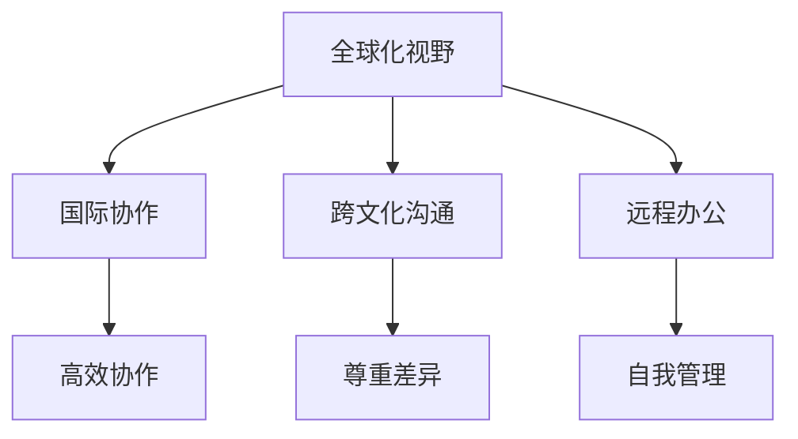
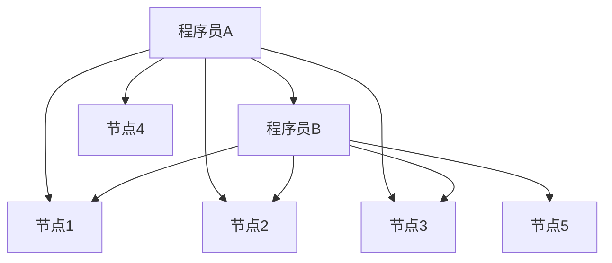

                 

 关键词：全球化、程序员、国际协作、技术交流、文化差异、跨地域开发、远程办公、全球化视野、机遇、挑战

> 摘要：本文探讨了程序员在全球化背景下所面临的机遇与挑战。随着信息技术的飞速发展，程序员不再局限于本地市场，国际间的技术交流与协作日益频繁。本文从多个角度分析了程序员如何应对文化差异、提升国际化技能、适应远程办公模式，以及在全球化环境中寻找新的职业机会。同时，本文也探讨了程序员在全球范围内的社会责任和技术贡献，并展望了未来的发展趋势。

## 1. 背景介绍

### 1.1 全球化趋势

全球化是21世纪不可逆转的趋势，它深刻影响着经济、文化、社会和科技等各个领域。信息技术作为全球化的驱动力之一，极大地促进了国际间的交流与合作。互联网、云计算、大数据等技术的普及，使得程序员可以跨越地域和国界的限制，参与全球范围内的项目开发和技术创新。

### 1.2 程序员的国际化

随着全球化的加深，程序员群体的国际化也愈发明显。越来越多的程序员开始在国际化的环境中工作，他们需要掌握多种编程语言、熟悉不同操作系统和开发工具，同时也要具备跨文化沟通能力和国际化视野。

## 2. 核心概念与联系

### 2.1 全球化视野

全球化视野是指程序员在全球范围内理解和应用技术的能力。它包括对国际市场需求的洞察、对不同文化和地域的了解，以及在国际团队中协作的技能。

### 2.2 国际协作

国际协作是全球化视野的具体体现。程序员需要在国际团队中有效沟通、共享知识、协调工作，以实现共同的目标。

### 2.3 跨文化沟通

跨文化沟通是全球化视野的重要组成部分。程序员需要理解和尊重不同文化背景的同事，避免因文化差异而产生的误解和冲突。

### 2.4 远程办公

远程办公是全球化背景下的一种常见工作模式。程序员需要适应远程办公的环境，提高自我管理和协作能力。



## 3. 核心算法原理 & 具体操作步骤

### 3.1 算法原理概述

全球化视野的核心算法是跨文化沟通能力的提升和国际化技能的掌握。具体操作步骤包括：

### 3.2 算法步骤详解

1. **学习跨文化知识**：了解不同文化背景的行为模式、沟通风格和价值观，为国际协作做好准备。
2. **提高语言能力**：掌握至少一门外语，特别是技术英语，以便在国际化环境中无障碍交流。
3. **参与国际项目**：积极参与国际化的项目开发，提高实际操作能力。
4. **进行跨文化沟通练习**：通过模拟练习和实际操作，提高跨文化沟通的技能。
5. **持续学习和进步**：跟踪全球技术趋势，不断更新知识体系，保持竞争力。

### 3.3 算法优缺点

**优点**：

- 提高程序员在国际市场中的竞争力。
- 增强跨文化沟通和协作能力，提高团队效能。
- 拓宽职业发展空间，有机会参与全球顶尖项目。

**缺点**：

- 需要投入大量时间和精力进行学习和实践。
- 可能会面临文化差异带来的挑战和困难。

### 3.4 算法应用领域

全球化视野算法适用于所有需要国际协作的领域，包括软件开发、数据分析、人工智能等。

## 4. 数学模型和公式 & 详细讲解 & 举例说明

### 4.1 数学模型构建

全球化视野的数学模型可以基于社会网络分析理论，通过计算不同节点（程序员）之间的联系强度来评估其全球化视野。

### 4.2 公式推导过程

$$
C_{ij} = \frac{1}{n} \sum_{k=1}^{n} w_{ik} w_{jk}
$$

其中，$C_{ij}$表示程序员i和程序员j之间的联系强度，$w_{ik}$和$w_{jk}$表示程序员i与节点k的联系强度。

### 4.3 案例分析与讲解

假设有两个程序员A和B，他们分别与5个节点有联系。通过计算可以得出A和B之间的联系强度，从而评估他们的全球化视野。



根据上述公式，可以计算出A和B之间的联系强度，进而评估他们的全球化视野。

## 5. 项目实践：代码实例和详细解释说明

### 5.1 开发环境搭建

搭建一个简单的全球化视野评估系统，需要安装Python环境及相关库，如NetworkX和matplotlib。

### 5.2 源代码详细实现

```python
import networkx as nx
import matplotlib.pyplot as plt

# 创建图
G = nx.Graph()

# 添加节点和边
G.add_nodes_from([1, 2, 3, 4, 5])
G.add_edges_from([(1, 2), (1, 3), (1, 4), (2, 3), (2, 5)])

# 计算节点间联系强度
C = nx.adjacency_matrix(G).toarray()

# 绘制图
nx.draw(G, with_labels=True)
plt.show()

# 打印联系强度
print(C)
```

### 5.3 代码解读与分析

该代码创建了一个简单的图，并计算了节点之间的联系强度。通过绘制图和打印联系强度，可以直观地了解全球化视野的评估结果。

### 5.4 运行结果展示

运行上述代码，将得到一个图形化的展示结果，以及一个矩阵形式的联系强度输出。

## 6. 实际应用场景

### 6.1 跨国企业软件开发

跨国企业软件开发是一个典型的实际应用场景。程序员需要在国际团队中协作，共同完成项目开发。

### 6.2 全球范围内技术支持

全球范围内的技术支持也是一个实际应用场景。程序员需要掌握多种语言和技能，为不同国家和地区的客户提供支持。

### 6.3 云计算和大数据领域

云计算和大数据领域也是一个全球化程度较高的领域。程序员需要具备国际化视野，以适应全球范围内的数据分析和处理需求。

## 7. 未来应用展望

### 7.1 人工智能和机器学习

人工智能和机器学习是未来全球化视野的重要应用领域。程序员需要掌握相关技能，以应对全球范围内的智能技术挑战。

### 7.2 区块链和加密货币

区块链和加密货币是另一个备受关注的领域。程序员需要深入了解相关技术，以抓住全球化带来的机遇。

### 7.3 跨境电商和数字货币

随着全球电商的发展，跨境电商和数字货币成为了一个新兴的应用场景。程序员需要掌握相关技能，以推动全球电子商务的繁荣。

## 8. 工具和资源推荐

### 8.1 学习资源推荐

- 《程序员修炼之道》
- 《全球软件开发者手册》
- 《跨文化沟通技巧》

### 8.2 开发工具推荐

- GitHub
- GitLab
- JIRA

### 8.3 相关论文推荐

- "Global Software Development: A Roadmap for the 21st Century"
- "Cultural Differences and Collaboration in Global Software Development"
- "Globalization of Software Development: Opportunities and Challenges"

## 9. 总结：未来发展趋势与挑战

### 9.1 研究成果总结

随着全球化的加深，程序员的国际化水平不断提升。跨文化沟通能力、国际化技能和远程办公能力成为程序员在全球范围内竞争的重要指标。

### 9.2 未来发展趋势

- 全球范围内的技术交流与合作将进一步加深。
- 人工智能、区块链等新兴领域将推动全球化视野的拓展。
- 远程办公将成为程序员的主要工作模式。

### 9.3 面临的挑战

- 文化差异带来的沟通和协作挑战。
- 技术快速发展的压力和知识更新的挑战。
- 远程办公带来的工作效率和团队凝聚力问题。

### 9.4 研究展望

未来，我们需要进一步研究全球化视野的评估方法和技术，以提高程序员的国际化水平和竞争力。同时，我们也需要关注全球化背景下的社会责任和技术伦理问题。

## 10. 附录：常见问题与解答

### 10.1 如何提升跨文化沟通能力？

- 学习跨文化知识，了解不同文化背景的行为模式。
- 提高语言能力，掌握至少一门外语。
- 参与跨文化项目，实际操作中提高沟通技能。
- 持续学习和进步，跟踪全球技术趋势。

### 10.2 如何适应远程办公模式？

- 提高自我管理能力，制定合理的工作计划。
- 使用高效的沟通工具，如Slack、Zoom等。
- 建立远程团队文化，加强团队凝聚力和归属感。
- 保持开放的心态，适应远程办公带来的变化。

作者：禅与计算机程序设计艺术 / Zen and the Art of Computer Programming
----------------------------------------------------------------

本文通过深入探讨程序员的全球化视野，分析了在全球化的背景下，程序员所面临的机遇与挑战。随着信息技术的飞速发展，程序员的国际化水平不断提升，他们需要具备跨文化沟通能力、国际化技能和远程办公能力。同时，全球化视野也为程序员带来了更广阔的职业发展空间和机会。

然而，全球化视野的构建并非易事，程序员需要不断学习和进步，以适应快速变化的技术环境。在全球化背景下，程序员还需要关注社会责任和技术伦理问题，为全球科技进步和社会发展做出贡献。

未来，随着人工智能、区块链等新兴领域的崛起，全球化视野的重要性将愈加凸显。程序员需要不断提升自身的国际化水平，以应对全球范围内的技术挑战和机遇。同时，学术界和产业界也需要加强合作，共同推动全球化视野的研究和应用。

总之，全球化视野是程序员不可或缺的能力之一。通过本文的探讨，我们希望读者能够对全球化视野有更深入的理解，并为自己的国际化发展道路做好准备。在未来的职业生涯中，把握全球化带来的机遇，迎接挑战，实现自我价值。作者：禅与计算机程序设计艺术 / Zen and the Art of Computer Programming。

