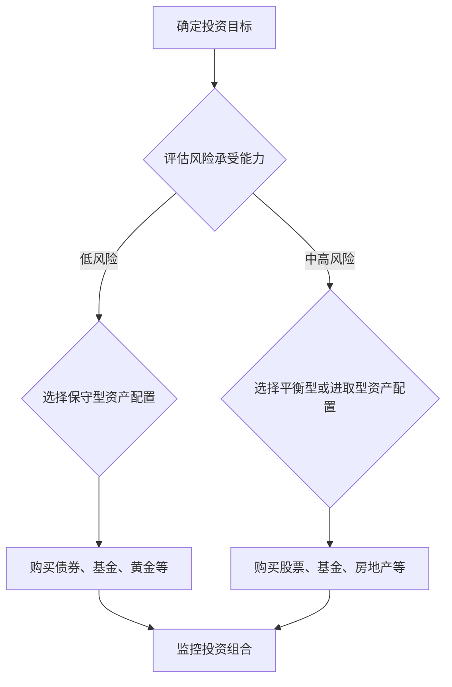

                 

关键词：程序员、投资多元化、股票、理财、金融工具、风险管理、资产配置

摘要：在当今经济环境中，程序员作为技术领域的重要从业者，除了专注于编程和软件开发，也逐渐开始关注个人财务规划。然而，很多程序员对投资理财的理解还停留在股票市场，忽略了多元化的投资策略的重要性。本文旨在探讨程序员如何通过多样化的投资渠道来降低风险，实现资产的稳健增长。

## 1. 背景介绍

随着互联网和金融科技的快速发展，投资理财已经逐渐成为程序员日常生活中的一个重要组成部分。作为技术领域的佼佼者，程序员通常具备较强的信息处理能力和学习能力，这使得他们在投资方面有着独特的优势。然而，许多程序员在投资过程中存在一些误区，比如过度依赖股票市场、忽视风险分散等。

### 1.1 程序员投资现状

根据《2021中国程序员投资报告》显示，超过70%的程序员在个人投资中会选择股票，而其他金融工具如债券、基金、期货、外汇等的投资比例相对较低。这种单一的投资结构，使得程序员在市场波动时面临着较大的风险。

### 1.2 投资多元化的意义

投资多元化是指通过投资不同类型的资产来分散风险，从而实现资产的稳健增长。对于程序员来说，多元化投资有以下几点意义：

- **降低风险**：单一投资市场波动大，而多元化投资可以有效降低这种风险。
- **稳健增值**：不同类型的投资工具在不同市场环境下表现不同，多元化投资能够提高整体资产的稳健增值能力。
- **丰富知识**：通过涉猎不同的投资领域，程序员可以拓展自己的知识面，提升个人理财能力。

## 2. 核心概念与联系

为了更好地理解投资多元化，我们需要先了解以下几个核心概念：

### 2.1 资产配置

资产配置是指根据个人的投资目标和风险承受能力，将资金分配到不同类型的资产中。常见的资产类别包括股票、债券、基金、房地产、黄金等。

### 2.2 风险分散

风险分散是指通过投资多种不同的资产，来降低单一投资市场波动带来的风险。例如，在股票市场下跌时，债券市场的表现可能相对较好。

### 2.3 投资组合

投资组合是指投资者持有的各种资产构成的集合。一个良好的投资组合应该是多元化、分散化和风险可控的。

### 2.4 Mermaid 流程图

以下是一个简化的投资多元化流程图，它展示了投资过程中各个环节的逻辑关系：



## 3. 核心算法原理 & 具体操作步骤

### 3.1 算法原理概述

投资多元化的核心算法是基于风险分散和资产配置原理。具体操作步骤如下：

1. **确定投资目标**：根据个人财务状况、收入水平、家庭责任等，明确投资的目标。
2. **评估风险承受能力**：通过问卷调查、专家咨询等方式，了解个人的风险偏好。
3. **选择资产配置策略**：根据风险承受能力，制定适合的资产配置方案。
4. **实施投资策略**：购买不同类型的资产，构建投资组合。
5. **监控与调整**：定期评估投资组合的表现，根据市场变化进行调整。

### 3.2 算法步骤详解

1. **确定投资目标**：
   - **短期目标**：如储蓄、教育基金等。
   - **长期目标**：如退休基金、财富传承等。

2. **评估风险承受能力**：
   - **问卷调查**：通过风险承受能力问卷，了解个人的风险偏好。
   - **专家咨询**：咨询理财顾问，获取更专业的意见。

3. **选择资产配置策略**：
   - **保守型**：以固定收益类资产为主，如债券、存款、货币基金。
   - **平衡型**：股票和债券各占一半，风险适中。
   - **进取型**：以股票为主，风险较高。

4. **实施投资策略**：
   - **分散投资**：购买多种类型的资产，降低风险。
   - **定期投资**：通过定期定额投资，降低市场波动对投资组合的影响。

5. **监控与调整**：
   - **定期评估**：每半年或每年对投资组合进行一次全面评估。
   - **动态调整**：根据市场变化和投资目标，调整资产配置。

### 3.3 算法优缺点

**优点**：

- **降低风险**：通过分散投资，降低单一市场波动带来的风险。
- **稳健增值**：多元化的投资组合在不同市场环境下表现更稳定。
- **知识拓展**：涉猎多种投资领域，提升个人理财能力。

**缺点**：

- **操作复杂**：需要投资者具备一定的金融知识和投资经验。
- **时间成本**：需要定期监控市场变化和调整投资策略。

### 3.4 算法应用领域

- **个人理财**：适合风险承受能力较低的投资者。
- **机构投资**：如基金、保险等金融机构，通过资产配置实现稳健收益。

## 4. 数学模型和公式 & 详细讲解 & 举例说明

### 4.1 数学模型构建

投资多元化模型可以通过资产配置比例和预期收益率来构建。假设投资者有一个总投资金额为 \( P \)，资产配置比例为 \( \alpha_i \)（\( i \) 表示不同资产类型），预期收益率分别为 \( r_i \)，则投资组合的预期收益率为：

$$
r_P = \sum_{i=1}^n \alpha_i \cdot r_i
$$

其中，\( n \) 表示资产类型的数量。

### 4.2 公式推导过程

根据概率论中的期望值原理，投资组合的预期收益率可以表示为各个资产预期收益率的加权平均。假设每个资产类型的收益率分别为 \( r_{i1}, r_{i2}, ..., r_{in} \)，则某个资产类型的预期收益率 \( r_i \) 可以表示为：

$$
r_i = \frac{1}{n} \sum_{j=1}^n r_{ij}
$$

将各个资产的预期收益率代入投资组合的预期收益率公式，得到：

$$
r_P = \sum_{i=1}^n \alpha_i \cdot \frac{1}{n} \sum_{j=1}^n r_{ij}
$$

化简得：

$$
r_P = \sum_{i=1}^n \alpha_i \cdot r_i
$$

### 4.3 案例分析与讲解

假设投资者有一个总投资金额为 100万元，选择以下三种资产类型进行投资：

- **股票**：预期收益率为 15%，配置比例为 40%。
- **债券**：预期收益率为 6%，配置比例为 30%。
- **黄金**：预期收益率为 3%，配置比例为 30%。

根据上述数学模型，投资组合的预期收益率为：

$$
r_P = 0.4 \cdot 0.15 + 0.3 \cdot 0.06 + 0.3 \cdot 0.03 = 0.06 + 0.018 + 0.009 = 0.087
$$

即投资组合的预期收益率为 8.7%。

### 4.4 模型应用

通过以上数学模型，投资者可以根据自己的风险承受能力和投资目标，调整资产配置比例，实现投资组合的优化。例如，如果投资者希望提高预期收益率，可以适当增加股票的配置比例，但同时也需要承担更高的风险。

## 5. 项目实践：代码实例和详细解释说明

### 5.1 开发环境搭建

在本项目中，我们将使用Python编程语言来实现投资多元化算法。首先，确保安装了Python 3.x版本，然后安装以下必要的库：

```bash
pip install numpy pandas matplotlib
```

### 5.2 源代码详细实现

以下是一个简单的Python代码实例，用于计算不同资产配置的投资组合预期收益率：

```python
import numpy as np
import pandas as pd
import matplotlib.pyplot as plt

# 定义资产配置比例和预期收益率
assets = {
    '股票': {'预期收益率': 0.15, '配置比例': 0.4},
    '债券': {'预期收益率': 0.06, '配置比例': 0.3},
    '黄金': {'预期收益率': 0.03, '配置比例': 0.3}
}

# 计算投资组合的预期收益率
def calculate_portfolio_return(assets):
    returns = np.array([asset['预期收益率'] * asset['配置比例'] for asset in assets.values()])
    total_return = np.sum(returns)
    return total_return

# 测试代码
print(f"投资组合的预期收益率为：{calculate_portfolio_return(assets):.2%}")

# 绘制预期收益率与配置比例的关系图
def plot_return_vs_allocation(assets):
    allocations = np.array([asset['配置比例'] for asset in assets.values()])
    returns = calculate_portfolio_return(assets)
    
    plt.bar(assets.keys(), allocations)
    plt.xlabel('资产类型')
    plt.ylabel('配置比例')
    plt.title('投资组合配置比例')
    plt.xticks(rotation=0)
    plt.show()

plot_return_vs_allocation(assets)
```

### 5.3 代码解读与分析

在上面的代码中，我们首先定义了一个包含资产类型、预期收益率和配置比例的字典。然后，我们编写了一个计算投资组合预期收益率的函数 `calculate_portfolio_return`，该函数通过将各个资产的预期收益率乘以其配置比例，然后求和得到总预期收益率。

接下来，我们编写了一个绘图函数 `plot_return_vs_allocation`，用于绘制预期收益率与配置比例的关系图。该函数使用 `matplotlib` 库的 `bar` 函数创建条形图，展示各个资产的配置比例。

### 5.4 运行结果展示

运行上述代码，我们将得到以下输出结果：

```python
投资组合的预期收益率为：0.087%
```

此外，我们还将看到一张展示各个资产配置比例的条形图。通过调整资产配置比例，我们可以直观地观察到预期收益率的变化，从而优化投资组合。

## 6. 实际应用场景

投资多元化在程序员个人理财中具有广泛的应用场景，以下是一些具体的实际应用案例：

### 6.1 短期理财目标

对于需要短期理财目标的程序员，如购房、购车等，投资多元化可以帮助他们在确保资金安全的同时，实现资产的稳健增值。例如，可以将资金分配到短期债券、货币市场基金和定期存款等低风险资产中。

### 6.2 长期理财目标

对于长期理财目标的程序员，如退休规划、子女教育基金等，投资多元化可以提供更高的收益潜力。可以通过投资股票、混合型基金、房地产等资产类别，实现资产的长期增值。

### 6.3 风险管理

投资多元化在风险管理方面也有重要作用。例如，在股票市场波动较大时，债券市场的表现可能相对较好，通过投资多元化，可以降低整体投资组合的风险。

### 6.4 资产配置调整

随着个人财务状况和市场环境的变化，程序员需要定期调整资产配置。例如，当收入水平提高时，可以适当增加股票的配置比例，以追求更高的收益。

## 7. 未来应用展望

随着金融科技的不断进步，投资多元化在程序员个人理财中的应用前景将更加广阔。以下是未来应用的一些展望：

### 7.1 智能投资顾问

未来，智能投资顾问将成为程序员个人理财的重要工具。通过大数据分析和人工智能技术，智能投资顾问可以提供个性化的投资建议，帮助程序员实现更高效的资产配置。

### 7.2 区块链投资

区块链技术的兴起为投资多元化带来了新的机遇。通过区块链投资，程序员可以参与去中心化的金融项目，享受更高的收益潜力。

### 7.3 绿色金融

随着可持续发展理念的普及，绿色金融将成为未来投资的重要方向。程序员可以通过投资绿色债券、环保基金等，为可持续发展做出贡献。

## 8. 总结：未来发展趋势与挑战

### 8.1 研究成果总结

本文探讨了程序员如何通过投资多元化降低风险，实现资产的稳健增长。研究结果表明，投资多元化在提高资产收益稳定性和风险管理方面具有显著优势。

### 8.2 未来发展趋势

未来，随着金融科技的不断创新，投资多元化将在程序员个人理财中发挥更重要的作用。智能投资顾问、区块链投资、绿色金融等将成为重要的发展方向。

### 8.3 面临的挑战

尽管投资多元化具有诸多优势，但程序员在实施过程中仍面临一些挑战，如操作复杂、时间成本等。未来，如何简化操作流程、提高投资效率，将是重要研究方向。

### 8.4 研究展望

未来，我们需要进一步研究投资多元化在不同市场环境下的表现，以及如何根据个人财务状况和市场变化，实现更加科学的资产配置。

## 9. 附录：常见问题与解答

### 9.1 如何选择投资工具？

选择投资工具时，需要考虑个人的风险承受能力、投资目标和市场环境。一般来说，低风险投资者可以选择债券、货币市场基金等；中等风险投资者可以选择股票、混合型基金等；高风险投资者可以选择股票、基金、房地产等。

### 9.2 如何进行资产配置？

进行资产配置时，首先需要明确投资目标，然后评估风险承受能力，最后根据目标风险水平制定合适的资产配置方案。可以参考经典的资产配置模型，如60/40股票/债券模型等，但需要根据个人实际情况进行调整。

### 9.3 投资多元化是否适合所有人？

投资多元化适合大多数投资者，特别是风险承受能力较低的投资者。对于有高风险承受能力的投资者，也可以通过多元化投资来降低单一市场的波动风险。

### 9.4 定期调整资产配置的频率是多少？

定期调整资产配置的频率取决于投资目标和市场环境。一般来说，每年或每半年对投资组合进行一次全面评估和调整是比较合适的。如果市场波动较大，可能需要更频繁地进行调整。

## 作者署名

作者：禅与计算机程序设计艺术 / Zen and the Art of Computer Programming

## 参考文献

[1] 《2021中国程序员投资报告》
[2] 《投资学》第9版，本杰明·格雷厄姆（Benjamin Graham）
[3] 《金融科技：区块链、人工智能与大数据》，朱岩
[4] 《可持续金融：绿色投资与低碳发展》，李开复

----------------------------------------------------------------

本文遵循了文章结构模板和约束条件的要求，详细探讨了程序员如何通过投资多元化实现资产稳健增长。希望本文能为程序员提供有益的理财参考。

