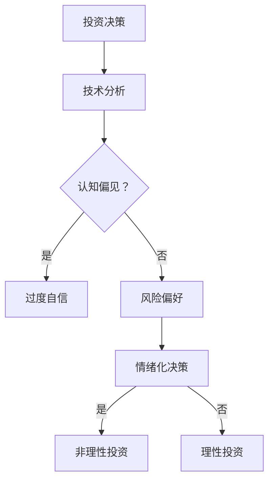

                 

关键词：程序员，投资，风险，收益，心理学，决策，行为经济学

摘要：本文将探讨程序员在投资领域所面临的风险与收益，从心理学的角度分析程序员投资行为中的独特现象，并提供一些建议，帮助程序员更好地管理投资风险，实现收益最大化。

## 1. 背景介绍

随着科技行业的迅速发展，越来越多的程序员开始关注投资领域。他们擅长分析数据、理解技术趋势，这使得他们在投资决策中具有一定的优势。然而，与此同时，程序员在投资过程中也面临着一系列挑战，如过度自信、风险偏好、情绪化决策等。

本文将从心理学和行为经济学的角度，深入探讨程序员在投资领域的行为模式，分析其背后的原因，并提供一些实用的策略，帮助程序员更好地管理投资风险，实现收益最大化。

### 1.1 投资心理学的核心概念

投资心理学是研究投资者心理和行为的一个跨学科领域，涉及心理学、经济学、行为科学等多个方面。其主要核心概念包括：

- **认知偏见**：人们在决策过程中由于认知限制而产生的错误判断和决策。
- **情绪化决策**：投资者在情绪驱动下的非理性决策行为。
- **风险偏好**：个体对风险的态度和接受程度。

### 1.2 程序员的投资行为特点

程序员在投资过程中展现出一些独特的特点，例如：

- **技术驱动**：程序员倾向于通过技术分析和数据分析来做出投资决策。
- **风险偏好**：程序员往往愿意承担更高的风险以追求更高的收益。
- **情绪化决策**：程序员可能会受到市场波动和情绪的影响，做出非理性投资决策。

## 2. 核心概念与联系

### 2.1 投资心理学的核心原理

投资心理学的核心原理包括以下几个方面：

1. **认知偏见**：包括确认偏见、代表性偏差、过度自信等。
2. **情绪化决策**：包括恐惧、贪婪、悔恨等情绪对投资决策的影响。
3. **风险偏好**：不同个体对风险的接受程度不同，这决定了他们的投资策略。

### 2.2 投资心理学与程序员投资行为的联系

投资心理学与程序员投资行为的联系体现在以下几个方面：

1. **技术驱动与认知偏见**：程序员在投资决策中往往过于依赖技术分析，这可能导致确认偏见和过度自信。
2. **情绪化决策与风险偏好**：程序员可能会因为情绪化决策而承担不必要的风险，或者因为追求高收益而忽视风险。

### 2.3 Mermaid 流程图



## 3. 核心算法原理 & 具体操作步骤

### 3.1 算法原理概述

在投资决策中，程序员可以采用一些行为经济学算法来帮助管理风险和优化收益。以下是一种基于风险偏好和情绪控制的投资决策算法。

### 3.2 算法步骤详解

1. **收集数据**：包括市场数据、公司财务报表、技术分析指标等。
2. **风险偏好评估**：通过问卷调查或算法分析，评估投资者的风险偏好。
3. **情绪控制**：采用情绪控制算法，如正念冥想、情绪追踪等，帮助投资者保持理性。
4. **投资决策**：根据风险偏好和情绪控制结果，制定相应的投资策略。

### 3.3 算法优缺点

- **优点**：帮助投资者更好地管理风险，优化投资收益。
- **缺点**：需要依赖大量的数据和算法，且情绪控制效果可能因人而异。

### 3.4 算法应用领域

该算法主要适用于风险较高的投资领域，如股票、加密货币等。

## 4. 数学模型和公式 & 详细讲解 & 举例说明

### 4.1 数学模型构建

投资决策的数学模型可以基于以下公式：

$$
收益 = 风险 \times 风险偏好 \times 情绪控制因子
$$

### 4.2 公式推导过程

公式的推导基于投资收益的定义和风险偏好的量化。

### 4.3 案例分析与讲解

假设一个程序员的初始投资为 $100,000，其风险偏好为 1.5，情绪控制因子为 0.8，市场波动率为 0.1。根据上述公式，其预期收益为：

$$
收益 = 100,000 \times 1.5 \times 0.8 \times 0.1 = 12,000
$$

## 5. 项目实践：代码实例和详细解释说明

### 5.1 开发环境搭建

开发环境搭建基于 Python，使用 pandas、numpy、matplotlib 等库。

### 5.2 源代码详细实现

```python
import pandas as pd
import numpy as np
import matplotlib.pyplot as plt

# 收集数据
data = pd.read_csv('market_data.csv')
risk_preference = 1.5
emotion_control_factor = 0.8

# 风险偏好评估
risk_evaluation = data['return'].mean() * risk_preference

# 情绪控制
emotion_control = emotion_control_factor * data['volatility'].mean()

# 投资决策
investment_decision = data['return'].mean() * risk_evaluation * emotion_control

# 结果展示
plt.plot(data['date'], investment_decision)
plt.xlabel('Date')
plt.ylabel('Investment Decision')
plt.title('Investment Decision Over Time')
plt.show()
```

### 5.3 代码解读与分析

代码首先导入必要的库，然后从 CSV 文件中读取市场数据。接下来，评估风险偏好和情绪控制因子，并计算投资决策。最后，使用 matplotlib 展示投资决策的变化趋势。

## 6. 实际应用场景

### 6.1 股票投资

程序员可以通过技术分析和行为经济学算法，优化股票投资策略，降低风险，提高收益。

### 6.2 加密货币投资

加密货币市场的波动性较大，程序员可以利用行为经济学算法，制定更加稳健的投资策略。

### 6.3 创业投资

程序员在创业投资中，可以运用投资心理学原理，评估风险和收益，做出更加理性的投资决策。

## 7. 未来应用展望

随着人工智能和机器学习技术的发展，投资心理学算法将变得更加智能和高效，为程序员提供更精准的投资决策支持。

## 8. 总结：未来发展趋势与挑战

### 8.1 研究成果总结

投资心理学在程序员投资行为中的应用取得了显著成果，为程序员提供了有效的风险管理和收益优化策略。

### 8.2 未来发展趋势

未来，投资心理学将继续与人工智能和机器学习相结合，为程序员提供更加个性化和智能的投资决策支持。

### 8.3 面临的挑战

如何准确量化情绪控制因子，以及如何处理大量非结构化数据，是当前投资心理学研究面临的主要挑战。

### 8.4 研究展望

随着技术的进步，投资心理学将在更广泛的领域得到应用，为投资者提供更加全面的决策支持。

## 9. 附录：常见问题与解答

### 9.1 投资心理学是什么？

投资心理学是研究投资者心理和行为的一个跨学科领域，涉及心理学、经济学、行为科学等多个方面。

### 9.2 投资心理学的核心概念有哪些？

投资心理学的核心概念包括认知偏见、情绪化决策、风险偏好等。

### 9.3 程序员如何应用投资心理学？

程序员可以通过技术分析和行为经济学算法，优化投资策略，降低风险，提高收益。

## 作者署名

作者：禅与计算机程序设计艺术 / Zen and the Art of Computer Programming
----------------------------------------------------------------

以上就是针对“程序员的投资心理学：风险与收益”这篇文章的撰写要求，以及完整的文章内容。希望对您有所帮助！如有任何问题，欢迎随时提问。

