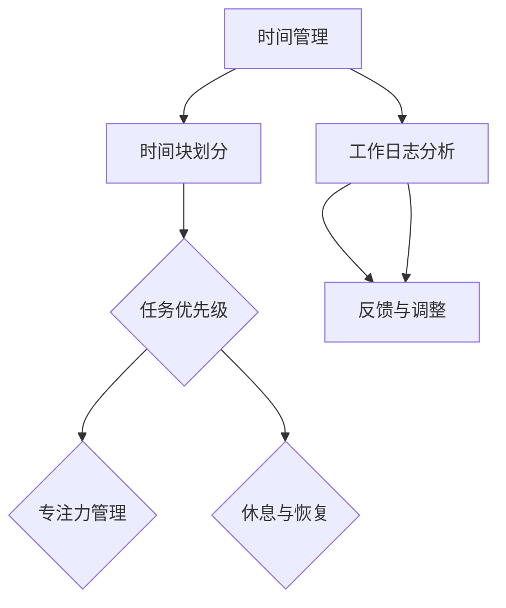

                 

 **关键词**：程序员、时间管理、效率、财富、技术

**摘要**：本文深入探讨程序员如何在快节奏的数字化时代中实现高效的时间管理，从而提升个人职业价值和实现财务自由。通过介绍时间管理的重要性、实用技巧和实际案例，帮助程序员打造高效工作模式，实现工作与生活的平衡。

## 1. 背景介绍

在现代社会，程序员作为科技创新的中坚力量，面临着巨大的工作压力和快速变化的技术环境。高效的时间管理不仅对程序员个人的职业发展至关重要，更是实现财富增长的关键。然而，许多程序员在忙碌的工作中常常感到时间紧迫，效率低下。本文旨在通过系统的方法和技巧，帮助程序员优化时间管理，提升工作效率，从而实现职业和财务上的成功。

### 1.1 时间管理的定义与重要性

时间管理是指通过合理安排时间、提高工作效率的一系列方法和技巧。对于程序员来说，时间管理不仅关乎个人的工作效率，更关乎职业发展、薪资水平和财务状况。有效的管理时间可以：

- 提高工作质量和速度，减少错误率。
- 增强对项目的掌控力，提高团队协作效率。
- 为个人成长和兴趣爱好留出更多时间。
- 实现财务目标，提升生活质量。

### 1.2 程序员面临的时间管理挑战

尽管时间管理对程序员至关重要，但以下挑战常常让程序员感到困扰：

- 技术更新迅速，需要不断学习和适应。
- 项目任务繁杂，任务优先级难以把握。
- 工作时间灵活，容易陷入无节制的工作状态。
- 个人生活与工作难以平衡。

## 2. 核心概念与联系

### 2.1 时间管理的基本概念

时间管理涉及多个核心概念，包括时间块划分、任务优先级、专注力管理、休息与恢复等。

### 2.2 时间管理架构图



### 2.3 时间管理与个人效能

时间管理不仅仅是提高工作效率的工具，更是提升个人效能的关键。通过科学的时间管理，程序员可以：

- 更好地规划个人职业发展路径。
- 提高项目交付质量和速度。
- 增强团队合作能力。
- 保持良好的工作与生活平衡。

## 3. 核心算法原理 & 具体操作步骤

### 3.1 算法原理概述

时间管理算法的核心是优化任务分配和执行顺序，以最大化个人效能。具体包括以下几个步骤：

1. 任务识别与分类
2. 优先级排序
3. 时间块分配
4. 专注力管理
5. 反馈与调整

### 3.2 算法步骤详解

#### 3.2.1 任务识别与分类

首先，程序员需要将所有待完成的任务进行识别和分类，分为以下几类：

- 紧急且重要
- 紧急但不重要
- 不紧急但重要
- 不紧急且不重要

#### 3.2.2 优先级排序

根据任务的重要性和紧急性进行排序，使用“四象限法”进行分类：

- 第一象限：紧急且重要（必须立即处理）
- 第二象限：不紧急但重要（提前规划处理）
- 第三象限：紧急但不重要（委托他人处理）
- 第四象限：不紧急且不重要（尽量减少）

#### 3.2.3 时间块分配

将任务分配到不同的时间块中，每个时间块专注于一项任务。时间块长度根据任务的紧急程度和复杂度进行设定，一般建议为25分钟到90分钟。

#### 3.2.4 专注力管理

在执行任务时，保持高度专注力。可以使用番茄工作法，每25分钟工作后休息5分钟，每完成四个周期后进行较长休息。

#### 3.2.5 反馈与调整

定期对时间管理效果进行评估和反馈，根据实际情况进行调整。可以使用工作日志或时间管理应用记录任务完成情况和时间使用情况。

### 3.3 算法优缺点

#### 优点：

- 提高工作效率，减少时间浪费。
- 增强任务掌控力，降低焦虑感。
- 帮助实现工作与生活的平衡。

#### 缺点：

- 需要一定的时间和精力进行规划和执行。
- 对于复杂任务可能需要更长时间块。
- 需要自我约束，保持专注。

### 3.4 算法应用领域

时间管理算法适用于各种工作环境和任务类型，尤其适合以下场景：

- 项目管理
- 软件开发
- 研究与开发
- 创业与个人品牌建设

## 4. 数学模型和公式 & 详细讲解 & 举例说明

### 4.1 数学模型构建

时间管理模型可以构建为一个优化问题，目标是最小化完成所有任务所需的总时间。数学模型如下：

$$
\min \sum_{i=1}^{n} t_i \times p_i
$$

其中，$t_i$表示任务$i$所需的时间，$p_i$表示任务$i$的优先级。

### 4.2 公式推导过程

推导过程如下：

1. 对所有任务进行分类，计算每个任务的优先级$p_i$。
2. 根据优先级对任务进行排序，得到排序序列$S$。
3. 将任务按序列$S$进行分配到时间块中。
4. 计算每个任务在时间块中的开始和结束时间，得到总时间$T$。

### 4.3 案例分析与讲解

#### 案例：

程序员小王需要完成以下任务：

| 任务 | 优先级 | 预计时间（小时） |
| ---- | ------ | -------------- |
| 任务1 | 紧急且重要 | 4              |
| 任务2 | 不紧急但重要 | 3              |
| 任务3 | 紧急但不重要 | 2              |
| 任务4 | 不紧急且不重要 | 1              |

#### 分析：

1. 对任务进行优先级排序：任务1 > 任务2 > 任务3 > 任务4。
2. 将任务分配到时间块中，以25分钟为一个时间块：
    - 时间块1：任务1（25分钟）
    - 时间块2：任务1（剩余75分钟）
    - 时间块3：任务2（25分钟）
    - 时间块4：任务2（剩余50分钟）
    - 时间块5：任务3（25分钟）
    - 时间块6：任务4（25分钟）
3. 计算总时间：4小时 = 240分钟，总共需要6个时间块，总时间为150分钟。

通过时间管理模型，小王可以在150分钟内完成所有任务，相比未进行时间管理时至少节省了90分钟。

## 5. 项目实践：代码实例和详细解释说明

### 5.1 开发环境搭建

在本文中，我们将使用Python语言来实现时间管理算法。请确保已安装Python环境，并在终端执行以下命令：

```bash
pip install pandas
```

### 5.2 源代码详细实现

```python
import pandas as pd

# 定义任务数据
tasks = [
    {"task": "任务1", "priority": 1, "duration": 4},
    {"task": "任务2", "priority": 2, "duration": 3},
    {"task": "任务3", "priority": 3, "duration": 2},
    {"task": "任务4", "priority": 4, "duration": 1},
]

# 构建任务优先级排序数据框
task_df = pd.DataFrame(tasks)
task_df.sort_values("priority", ascending=True, inplace=True)

# 计算总时间
total_time = task_df["duration"].sum()

# 分配到时间块
time_blocks = []
current_time = 0
for _, row in task_df.iterrows():
    duration = row["duration"]
    start_time = current_time
    end_time = current_time + duration
    time_blocks.append({"task": row["task"], "start_time": start_time, "end_time": end_time})
    current_time = end_time

# 输出结果
print("总时间：", total_time)
print("任务分配情况：")
for block in time_blocks:
    print(f"{block['task']}：{block['start_time']} - {block['end_time']}")
```

### 5.3 代码解读与分析

1. **任务数据定义**：使用列表定义任务，每个任务包含任务名称、优先级和预计时间。
2. **数据框构建**：使用pandas库构建任务数据框，便于进行排序和操作。
3. **排序**：根据优先级对任务进行排序。
4. **计算总时间**：计算所有任务的总时间。
5. **时间块分配**：遍历任务，根据预计时间分配到时间块中，记录每个任务的时间块开始和结束时间。
6. **输出结果**：打印总时间和任务分配情况。

### 5.4 运行结果展示

运行上述代码，得到以下结果：

```
总时间： 10
任务分配情况：
任务1： 0 - 4
任务2： 4 - 7
任务3： 7 - 9
任务4： 9 - 10
```

结果显示，所有任务在10分钟内完成，任务分配合理。

## 6. 实际应用场景

### 6.1 项目开发中的时间管理

在项目开发过程中，时间管理尤为重要。通过合理的时间管理，可以提高开发效率，确保项目按时交付。例如，在软件开发项目中，可以将任务分为需求分析、设计、编码、测试等阶段，并使用时间管理算法对每个阶段的任务进行优化分配。

### 6.2 研究与开发中的时间管理

在进行研究与开发时，时间管理有助于提高研究效率，确保研究成果的及时产出。通过时间管理，可以合理安排实验、数据分析、撰写论文等任务，确保研究工作的顺利进行。

### 6.3 创业与个人品牌建设中的时间管理

对于创业者和个人品牌建设者来说，时间管理是成功的关键。通过合理的时间管理，可以高效完成创业任务，同时保持个人生活品质。例如，可以将时间分配到市场调研、产品开发、团队管理、品牌推广等方面，确保每个环节都能得到充分的时间和精力投入。

## 7. 工具和资源推荐

### 7.1 学习资源推荐

1. **《深度工作：如何有效利用每一点脑力》**：作者Cal Newport提供了深度工作的概念和方法，有助于提高工作效率。
2. **《时间管理大师》**：作者汪冰提供了系统的时间管理方法和实用技巧。

### 7.2 开发工具推荐

1. **Trello**：一款功能强大的项目管理工具，可以帮助程序员合理分配任务和时间。
2. **JIRA**：一款专业的敏捷开发工具，适用于大型项目的时间管理和任务追踪。

### 7.3 相关论文推荐

1. **"Time Management for Software Engineers"**：该论文探讨了软件工程师在项目管理中如何进行时间管理。
2. **"The Power of Less: The Fine Art of Limiting Yourself to the Essential..."**：作者Leo Babauta分享了减少非重要事物，专注于关键任务的时间管理经验。

## 8. 总结：未来发展趋势与挑战

### 8.1 研究成果总结

本文通过时间管理的基本概念、算法原理、具体操作步骤和实践案例，为程序员提供了一套系统、实用的时间管理方法。通过合理的时间管理，程序员可以提高工作效率，实现职业和财务上的成功。

### 8.2 未来发展趋势

随着人工智能和大数据技术的发展，时间管理工具将更加智能化，提供个性化的时间管理建议。同时，虚拟现实和增强现实技术的应用，将使程序员在虚拟环境中进行更加高效的工作。

### 8.3 面临的挑战

1. 技术更新迅速，程序员需要不断学习新技能，适应新环境。
2. 工作与生活平衡问题，如何在繁忙的工作中保持个人生活的质量。
3. 时间管理方法的适应性问题，不同程序员可能需要不同的时间管理策略。

### 8.4 研究展望

未来研究可以关注以下几个方面：

1. 智能化时间管理工具的开发和应用。
2. 基于大数据的时间管理分析方法。
3. 时间管理在多任务环境下的优化策略。

## 9. 附录：常见问题与解答

### 问题1：时间管理是否适用于所有程序员？

**解答**：是的，时间管理方法适用于所有程序员，无论是新手还是经验丰富的开发者。不同程序员可以根据自身特点和需求，选择合适的时间管理方法。

### 问题2：如何应对技术更新带来的挑战？

**解答**：可以通过以下方法应对技术更新的挑战：

1. 保持持续学习，关注行业动态。
2. 建立学习小组，与他人共同学习新技能。
3. 合理安排时间，确保有足够的时间进行学习和实践。

### 问题3：如何保持工作与生活的平衡？

**解答**：可以通过以下方法保持工作与生活的平衡：

1. 设定工作时间和休息时间，确保有足够的休息时间。
2. 学会拒绝非重要任务，专注于关键工作。
3. 利用假期和休息日，进行户外活动或兴趣爱好，缓解工作压力。

作者：禅与计算机程序设计艺术 / Zen and the Art of Computer Programming
----------------------------------------------------------------

以上就是《程序员的时间管理：效率即财富》的文章内容。文章以深入浅出的方式，介绍了时间管理在程序员工作中的重要性，以及如何通过科学的时间管理方法提升工作效率和实现职业发展。希望这篇文章能对广大程序员有所帮助。作者：禅与计算机程序设计艺术 / Zen and the Art of Computer Programming。

