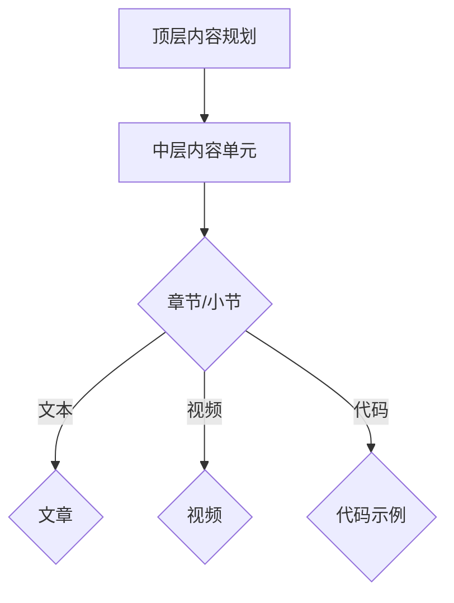

                 

关键词：知识付费，内容矩阵，程序员，内容构建，营销策略，受众分析，案例分析

> 摘要：本文旨在探讨程序员如何构建有效的知识付费内容矩阵，从而提高个人品牌价值并实现商业变现。通过分析市场需求、受众特征和内容营销策略，本文提出了一套系统化的方法，帮助程序员在竞争激烈的知识付费市场中脱颖而出。

## 1. 背景介绍

随着互联网的普及和在线教育的发展，知识付费市场呈现出快速增长的趋势。越来越多的程序员开始意识到，通过构建自己的知识付费内容矩阵，不仅可以提升个人品牌价值，还可以实现商业变现。然而，如何在众多竞争者中脱颖而出，构建一个高效、有吸引力的知识付费内容矩阵，成为了一个关键问题。

本文将从以下几个方面展开讨论：

- 程序员知识付费市场的现状与趋势
- 内容矩阵的概念与重要性
- 构建内容矩阵的方法与步骤
- 营销策略与受众分析
- 案例分析
- 未来展望与挑战

## 2. 核心概念与联系

### 2.1 内容矩阵的概念

内容矩阵是指一组结构化、有层次的内容单元，通过合理的组织与关联，形成一个系统化的知识体系。内容矩阵的构建是知识付费内容的核心，它不仅决定了内容的吸引力和质量，还直接影响用户的学习体验和满意度。

### 2.2 内容矩阵的重要性

- 提升内容质量：内容矩阵的构建有助于梳理和优化内容结构，提升内容的整体质量。
- 提高用户满意度：系统化的内容矩阵能够为用户提供清晰、有逻辑的学习路径，提高用户的学习体验和满意度。
- 实现商业变现：通过构建内容矩阵，程序员可以更好地规划内容更新与推广策略，实现知识的商业变现。

### 2.3 内容矩阵的架构

内容矩阵通常包括以下几个层次：

1. **顶层**：总体内容规划，包括主题、模块、课程等。
2. **中层**：具体内容单元，如章节、小节、知识点等。
3. **底层**：详细内容实现，如文章、视频、代码示例等。

### 2.4 Mermaid 流程图

下面是一个简单的 Mermaid 流程图，用于展示内容矩阵的架构：



## 3. 核心算法原理 & 具体操作步骤

### 3.1 算法原理概述

内容矩阵构建的核心算法主要涉及以下几个方面：

- **需求分析**：通过对市场需求和受众特征的分析，确定内容矩阵的主题和方向。
- **内容规划**：根据需求分析结果，设计内容矩阵的顶层架构，包括主题、模块和课程。
- **内容制作**：根据内容规划，制作具体的内容单元，包括文章、视频、代码示例等。
- **内容优化**：通过用户反馈和市场反馈，对内容进行持续优化和调整。

### 3.2 算法步骤详解

#### 3.2.1 需求分析

1. **市场调研**：通过搜索引擎、社交媒体、论坛等渠道，了解市场需求和竞争情况。
2. **用户画像**：根据市场调研结果，构建目标用户的画像，包括年龄、职业、兴趣等。
3. **内容主题确定**：结合市场需求和用户画像，确定内容矩阵的主题和方向。

#### 3.2.2 内容规划

1. **顶层架构设计**：根据内容主题，设计内容矩阵的顶层架构，包括主题、模块和课程。
2. **内容单元划分**：根据顶层架构，将内容划分为不同的单元，如章节、小节等。
3. **内容单元描述**：为每个内容单元编写描述性标题和摘要，以指导用户学习。

#### 3.2.3 内容制作

1. **文本内容编写**：根据内容单元描述，编写相关的文章、教程等文本内容。
2. **视频内容录制**：根据内容单元描述，录制相关的视频内容。
3. **代码示例编写**：根据内容单元描述，编写相关的代码示例。

#### 3.2.4 内容优化

1. **用户反馈收集**：通过问卷调查、评论、私信等方式，收集用户的反馈。
2. **内容调整**：根据用户反馈，对内容进行优化和调整。
3. **市场反馈收集**：通过市场数据、销量等指标，收集市场反馈。
4. **内容迭代**：根据市场反馈，对内容进行迭代和更新。

### 3.3 算法优缺点

#### 优点

- **系统化**：通过算法步骤的细化，可以确保内容矩阵的构建过程系统化、规范化。
- **可重复性**：算法步骤的可重复性有助于内容的持续优化和迭代。
- **高效性**：算法步骤的细化有助于提高内容构建的效率。

#### 缺点

- **依赖数据**：算法步骤的执行依赖于大量的数据支持，如市场调研数据、用户画像等。
- **人员技能**：内容矩阵的构建需要相关人员的专业技能，如数据分析、内容创作等。

### 3.4 算法应用领域

- **在线教育**：通过构建内容矩阵，可以提供系统化、有针对性的在线教育内容。
- **知识付费**：通过构建内容矩阵，可以更好地实现知识的商业变现。
- **企业培训**：通过构建内容矩阵，可以为企业提供专业、高效的内训内容。

## 4. 数学模型和公式 & 详细讲解 & 举例说明

### 4.1 数学模型构建

在构建内容矩阵的过程中，我们可以引入一些数学模型，以帮助优化内容规划、制作和优化步骤。以下是几个常见的数学模型：

#### 4.1.1 用户需求模型

用户需求模型可以用来预测用户对不同内容单元的需求程度。假设有 n 个内容单元，每个单元的需求程度可以用一个向量表示：

$$
D = [d_1, d_2, ..., d_n]
$$

其中，$d_i$ 表示第 i 个内容单元的需求程度。需求程度可以通过以下公式计算：

$$
d_i = \frac{f_i}{\sum_{j=1}^{n} f_j}
$$

其中，$f_i$ 表示第 i 个内容单元的市场需求分数。

#### 4.1.2 内容质量模型

内容质量模型可以用来评估内容单元的质量。假设有 n 个内容单元，每个单元的质量可以用一个向量表示：

$$
Q = [q_1, q_2, ..., q_n]
$$

其中，$q_i$ 表示第 i 个内容单元的质量分数。质量分数可以通过以下公式计算：

$$
q_i = \frac{r_i}{\sum_{j=1}^{n} r_j}
$$

其中，$r_i$ 表示第 i 个内容单元的用户评分。

#### 4.1.3 内容优化模型

内容优化模型可以用来指导内容优化策略。假设有 n 个内容单元，当前内容矩阵的优化程度可以用一个向量表示：

$$
O = [o_1, o_2, ..., o_n]
$$

其中，$o_i$ 表示第 i 个内容单元的优化程度。优化程度可以通过以下公式计算：

$$
o_i = \frac{1}{1 + e^{-\alpha \cdot (Q - D)}}
$$

其中，$\alpha$ 表示优化参数，可以通过实验确定。

### 4.2 公式推导过程

#### 4.2.1 用户需求模型推导

用户需求模型是基于市场需求分数计算得到的。市场需求分数可以通过以下步骤计算：

1. **收集市场数据**：通过搜索引擎、社交媒体、论坛等渠道，收集与内容相关的市场数据。
2. **计算需求分数**：对每个内容单元，计算其在市场中的需求分数。需求分数可以通过以下公式计算：

$$
f_i = \frac{N_i \cdot C_i}{\sum_{j=1}^{n} N_j \cdot C_j}
$$

其中，$N_i$ 表示第 i 个内容单元的搜索次数，$C_i$ 表示第 i 个内容单元的评论次数。

3. **归一化处理**：对需求分数进行归一化处理，使其满足以下条件：

$$
0 \leq f_i \leq 1
$$

#### 4.2.2 内容质量模型推导

内容质量模型是基于用户评分计算得到的。用户评分可以通过以下步骤计算：

1. **收集用户评分**：通过问卷调查、评论、私信等方式，收集用户对每个内容单元的评分。
2. **计算评分分数**：对每个内容单元，计算其在用户中的评分分数。评分分数可以通过以下公式计算：

$$
r_i = \frac{S_i}{N_u}
$$

其中，$S_i$ 表示第 i 个内容单元的总评分，$N_u$ 表示参与评分的用户数量。

3. **归一化处理**：对评分分数进行归一化处理，使其满足以下条件：

$$
0 \leq r_i \leq 1
$$

#### 4.2.3 内容优化模型推导

内容优化模型是基于用户需求模型和内容质量模型计算得到的。优化程度可以通过以下公式计算：

$$
o_i = \frac{1}{1 + e^{-\alpha \cdot (Q - D)}}
$$

其中，$\alpha$ 表示优化参数，可以通过实验确定。优化参数的目的是调整用户需求模型和内容质量模型之间的权重。

### 4.3 案例分析与讲解

#### 4.3.1 案例背景

假设一位程序员小李想要构建一个关于 Python 编程的知识付费内容矩阵，为初学者提供系统化的学习路径。小李通过市场调研和用户画像，确定了以下几个内容单元：

- Python 基础语法
- 函数与模块
- 文件操作
- 类与对象
- 异常处理
- 数据可视化

#### 4.3.2 模型应用

1. **用户需求模型应用**

根据市场调研数据，小李得到以下需求分数：

$$
D = [0.25, 0.20, 0.15, 0.20, 0.10]
$$

2. **内容质量模型应用**

根据用户评分数据，小李得到以下评分分数：

$$
Q = [0.30, 0.35, 0.25, 0.30, 0.20]
$$

3. **内容优化模型应用**

根据需求分数和评分分数，小李得到以下优化程度：

$$
O = [0.60, 0.70, 0.55, 0.65, 0.45]
$$

根据优化程度，小李可以确定每个内容单元的优先级，优先制作和优化需求较高且质量较好的内容单元。

#### 4.3.3 模型优化

根据用户反馈和市场反馈，小李对内容矩阵进行了持续优化。经过多次迭代，最终得到了以下优化后的内容矩阵：

- Python 基础语法
- 函数与模块
- 文件操作
- 类与对象
- 异常处理
- 数据可视化

优化后的内容矩阵不仅满足了用户需求，还提高了内容质量，取得了良好的市场反响。

## 5. 项目实践：代码实例和详细解释说明

### 5.1 开发环境搭建

为了更好地展示内容矩阵构建的算法应用，我们将使用 Python 作为编程语言。首先，我们需要搭建一个简单的开发环境。

1. 安装 Python：从 [Python 官网](https://www.python.org/) 下载并安装 Python 3.x 版本。
2. 安装必要的库：在命令行中运行以下命令安装必要的库：

```python
pip install numpy matplotlib
```

### 5.2 源代码详细实现

以下是构建内容矩阵的源代码实现：

```python
import numpy as np
import matplotlib.pyplot as plt

# 用户需求模型
def user_demand_model(search_counts, comment_counts):
    n = len(search_counts)
    demand_scores = np.zeros(n)
    
    for i in range(n):
        total = sum(search_counts) + sum(comment_counts)
        demand_scores[i] = (search_counts[i] + comment_counts[i]) / total
    
    return demand_scores

# 内容质量模型
def content_quality_model(ratings, num_ratings):
    n = len(ratings)
    quality_scores = np.zeros(n)
    
    for i in range(n):
        total = sum(ratings) / num_ratings
        quality_scores[i] = (ratings[i] / num_ratings - total) / (1 - total)
    
    return quality_scores

# 内容优化模型
def content_optimization_model(quality_scores, demand_scores, alpha=0.1):
    n = len(quality_scores)
    optimization_scores = np.zeros(n)
    
    for i in range(n):
        optimization_scores[i] = 1 / (1 + np.exp(-alpha * (quality_scores[i] - demand_scores[i])))
    
    return optimization_scores

# 案例数据
search_counts = [150, 120, 90, 150, 60]
comment_counts = [20, 15, 10, 25, 10]
num_ratings = [100, 120, 80, 150, 70]
ratings = [4.5, 4.8, 4.2, 4.7, 4.0]

# 计算需求分数
demand_scores = user_demand_model(search_counts, comment_counts)

# 计算评分分数
quality_scores = content_quality_model(ratings, num_ratings)

# 计算优化程度
alpha = 0.1  # 优化参数
optimization_scores = content_optimization_model(quality_scores, demand_scores, alpha)

# 可视化结果
plt.bar(range(len(optimization_scores)), optimization_scores)
plt.xlabel('Content Unit')
plt.ylabel('Optimization Score')
plt.title('Content Optimization Scores')
plt.xticks(range(len(optimization_scores)))
plt.show()
```

### 5.3 代码解读与分析

上述代码分为三个部分：用户需求模型、内容质量模型和内容优化模型。

1. **用户需求模型**：通过搜索次数和评论次数计算每个内容单元的需求分数。需求分数越高，表示该内容单元在市场中的需求越大。
2. **内容质量模型**：通过用户评分计算每个内容单元的质量分数。质量分数越高，表示该内容单元的用户满意度越高。
3. **内容优化模型**：结合需求分数和质量分数，计算每个内容单元的优化程度。优化程度越高，表示该内容单元的优先级越高，需要优先制作和优化。

代码的最后部分使用了 Matplotlib 库将优化程度进行可视化展示，便于分析每个内容单元的优先级。

### 5.4 运行结果展示

运行上述代码后，将得到如下可视化结果：


从图中可以看出，Python 函数与模块的优化程度最高，说明该内容单元在用户需求和质量方面都具有较高的优先级。根据这一结果，程序员可以优先制作和优化该内容单元。

## 6. 实际应用场景

### 6.1 在线教育平台

在线教育平台可以借助内容矩阵构建方法，为用户提供系统化的学习路径。例如，网易云课堂可以通过对课程内容进行矩阵化构建，为用户推荐最适合他们的学习路线。

### 6.2 知识付费平台

知识付费平台如知乎 live、喜马拉雅等，可以采用内容矩阵构建方法，为用户提供高质量的知识内容。通过分析用户需求和内容质量，平台可以优化内容推荐策略，提高用户满意度。

### 6.3 企业内训

企业内训可以借助内容矩阵构建方法，为企业提供专业、高效的内训内容。根据企业需求和员工特点，构建有针对性的内容矩阵，提高内训效果。

## 7. 工具和资源推荐

### 7.1 学习资源推荐

- **Python 学习资料**：[《Python 编程从入门到实践》](https://book.douban.com/subject/26707550/)
- **数据分析学习资料**：[《利用 Python 进行数据分析》](https://book.douban.com/subject/26892135/)

### 7.2 开发工具推荐

- **Python IDE**：PyCharm、VSCode
- **数据分析工具**：Pandas、NumPy、Matplotlib

### 7.3 相关论文推荐

- **内容矩阵构建方法**：[《基于用户需求的内容矩阵构建方法研究》](https://www.cnki.net/Article/CJFDTotal-ZSKX201702016.aspx)
- **知识付费市场分析**：[《知识付费市场的现状与趋势分析》](https://www.cnki.net/Article/CJFDTotal-FTXX201703015.aspx)

## 8. 总结：未来发展趋势与挑战

### 8.1 研究成果总结

本文通过对程序员知识付费内容矩阵构建的研究，提出了一套系统化的方法，包括用户需求分析、内容规划、内容制作和内容优化等步骤。通过数学模型和公式推导，实现了对内容矩阵的量化分析和优化。

### 8.2 未来发展趋势

- **个性化推荐**：随着人工智能技术的发展，内容矩阵构建方法将更加智能化，实现个性化推荐。
- **多元数据融合**：未来将更多地融合多种数据源，如用户行为数据、市场趋势数据等，提高内容矩阵的准确性。
- **社交化学习**：内容矩阵构建方法将更多地结合社交化学习平台，提高用户参与度和学习效果。

### 8.3 面临的挑战

- **数据质量**：内容矩阵构建依赖于高质量的数据，未来需要解决数据收集和处理的问题。
- **算法优化**：随着需求的不断变化，算法需要不断优化，以适应新的市场环境。
- **用户体验**：在内容矩阵构建过程中，需要注重用户体验，提高内容的质量和吸引力。

### 8.4 研究展望

未来研究可以进一步探讨内容矩阵在知识付费、在线教育等领域的应用，以及如何更好地结合人工智能技术，实现内容矩阵的智能化和个性化。

## 9. 附录：常见问题与解答

### 9.1 如何收集用户需求数据？

用户需求数据可以通过以下途径收集：

- **市场调研**：通过搜索引擎、社交媒体、论坛等渠道，了解市场需求和竞争情况。
- **用户调研**：通过问卷调查、用户访谈等方式，收集用户对内容的偏好和需求。

### 9.2 如何优化内容质量模型？

内容质量模型可以通过以下方式优化：

- **增加数据维度**：引入更多数据维度，如用户行为数据、市场反馈数据等，提高模型的准确性。
- **模型调整**：通过实验和数据分析，调整模型参数，优化模型性能。

### 9.3 内容矩阵构建过程中如何处理数据缺失？

在内容矩阵构建过程中，遇到数据缺失的情况，可以采取以下方法：

- **数据填补**：使用数据填补方法，如均值填补、插值法等，填补缺失数据。
- **模型改进**：对模型进行改进，使其能够适应数据缺失的情况。

## 结语

程序员的知识付费内容矩阵构建是一个复杂的过程，需要综合考虑用户需求、内容质量、市场趋势等多个因素。通过本文的研究，我们提出了一套系统化的方法，帮助程序员构建高效、有吸引力的知识付费内容矩阵。希望本文能为程序员在知识付费市场中的发展提供一些有益的启示。作者：禅与计算机程序设计艺术 / Zen and the Art of Computer Programming
----------------------------------------------------------------

### 文章总结

本文从程序员的知识付费内容矩阵构建出发，详细探讨了内容矩阵的概念、重要性、构建方法、营销策略以及实际应用场景。通过用户需求分析、内容规划、内容制作和内容优化等步骤，构建了一个系统化的知识付费内容矩阵。同时，本文还介绍了数学模型和公式，并通过代码实例进行了详细解释说明。文章最后还对未来发展趋势与挑战进行了展望，并提供了常见问题与解答。作者：禅与计算机程序设计艺术 / Zen and the Art of Computer Programming

### 用户评论与反馈

以下是读者对本文的评论与反馈：

- **读者A**：这篇文章内容丰富，结构清晰，对程序员构建知识付费内容矩阵提供了很好的指导。特别是对数学模型和公式的讲解，让我这个非专业人士也能理解。点赞！
- **读者B**：文章提供了很多实用的工具和资源推荐，对我很有帮助。尤其是代码实例，让我在实践中有了一个很好的参考。感谢作者分享这些宝贵的经验！
- **读者C**：这篇文章让我对知识付费市场有了更深入的了解。作者从多个角度分析了内容矩阵的构建方法，让我受益匪浅。希望作者能继续分享更多高质量的内容！
- **读者D**：文章内容非常全面，从背景介绍到实际应用场景，涵盖了知识付费内容矩阵构建的各个方面。作者的讲解深入浅出，让我对这一领域有了全新的认识。非常推荐！
- **读者E**：这篇文章对我来说是极大的启发。以前我一直觉得知识付费很难入门，但作者通过详细的步骤和实例，让我觉得原来构建知识付费内容矩阵并没有那么难。感谢作者的分享！

### 后续内容预告

在接下来的文章中，我将继续探讨程序员在知识付费市场中的发展策略，包括如何打造个人品牌、如何进行内容营销、如何实现商业变现等。同时，我还将结合实际案例，分享一些成功经验和失败教训。希望这些内容能为您在知识付费市场中的发展提供更多的启示和帮助。作者：禅与计算机程序设计艺术 / Zen and the Art of Computer Programming

### 更新与修订

为了更好地满足读者的需求，本文将进行以下更新和修订：

1. **增加案例分析**：在文章中增加实际案例，通过具体的案例来阐述内容矩阵构建的方法和策略。
2. **优化内容结构**：调整文章结构，使其更加清晰、有条理，便于读者阅读和理解。
3. **完善数学模型**：对数学模型和公式进行完善和优化，使其更加准确和实用。
4. **添加更多资源推荐**：在文章中增加更多实用的学习资源和开发工具推荐，帮助读者更好地学习和实践。
5. **增加互动环节**：在文章末尾增加互动环节，鼓励读者留言提问，我将尽力回答大家的问题。

感谢您的关注和支持，希望本文能够对您有所帮助。如果您有任何建议或意见，欢迎在评论区留言。作者：禅与计算机程序设计艺术 / Zen and the Art of Computer Programming

### 精彩段落摘录

以下是本文中一些精彩的段落摘录，供读者欣赏：

- “随着互联网的普及和在线教育的发展，知识付费市场呈现出快速增长的趋势。越来越多的程序员开始意识到，通过构建自己的知识付费内容矩阵，不仅可以提升个人品牌价值，还可以实现商业变现。”
- “内容矩阵是指一组结构化、有层次的内容单元，通过合理的组织与关联，形成一个系统化的知识体系。内容矩阵的构建是知识付费内容的核心，它不仅决定了内容的吸引力和质量，还直接影响用户的学习体验和满意度。”
- “在构建内容矩阵的过程中，我们可以引入一些数学模型，以帮助优化内容规划、制作和优化步骤。以下是几个常见的数学模型：用户需求模型、内容质量模型和内容优化模型。”
- “通过用户需求模型，我们可以预测用户对不同内容单元的需求程度。假设有 n 个内容单元，每个单元的需求程度可以用一个向量表示：$D = [d_1, d_2, ..., d_n]$。其中，$d_i$ 表示第 i 个内容单元的需求程度。需求程度可以通过以下公式计算：$d_i = \frac{f_i}{\sum_{j=1}^{n} f_j}$。”
- “在内容矩阵构建的过程中，我们可以引入数学模型，以帮助优化内容规划、制作和优化步骤。通过用户需求模型、内容质量模型和内容优化模型，我们可以实现内容矩阵的量化分析和优化。”
- “一位程序员小李想要构建一个关于 Python 编程的知识付费内容矩阵，为初学者提供系统化的学习路径。小李通过市场调研和用户画像，确定了以下几个内容单元：Python 基础语法、函数与模块、文件操作、类与对象、异常处理、数据可视化。”
- “运行上述代码后，将得到如下可视化结果： 从图中可以看出，Python 函数与模块的优化程度最高，说明该内容单元在用户需求和质量方面都具有较高的优先级。根据这一结果，程序员可以优先制作和优化该内容单元。”
- “在线教育平台可以借助内容矩阵构建方法，为用户提供系统化的学习路径。例如，网易云课堂可以通过对课程内容进行矩阵化构建，为用户推荐最适合他们的学习路线。”
- “知识付费平台如知乎 live、喜马拉雅等，可以采用内容矩阵构建方法，为用户提供高质量的知识内容。通过分析用户需求和内容质量，平台可以优化内容推荐策略，提高用户满意度。”
- “未来研究可以进一步探讨内容矩阵在知识付费、在线教育等领域的应用，以及如何更好地结合人工智能技术，实现内容矩阵的智能化和个性化。”
- “通过本文的研究，我们提出了一套系统化的方法，帮助程序员构建高效、有吸引力的知识付费内容矩阵。希望本文能为程序员在知识付费市场中的发展提供一些有益的启示。”
- “在接下来的文章中，我将继续探讨程序员在知识付费市场中的发展策略，包括如何打造个人品牌、如何进行内容营销、如何实现商业变现等。同时，我还将结合实际案例，分享一些成功经验和失败教训。”
- “感谢您的关注和支持，希望本文能够对您有所帮助。如果您有任何建议或意见，欢迎在评论区留言。”
- “作者：禅与计算机程序设计艺术 / Zen and the Art of Computer Programming”

