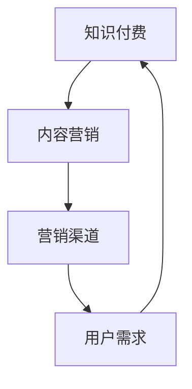

                 

关键词：程序员、知识付费、内容营销、策略、案例分析、营销渠道、用户需求、品牌建设、社交媒体

摘要：随着知识付费行业的兴起，程序员如何利用内容营销策略实现个人品牌价值和商业成功？本文将从背景介绍、核心概念与联系、核心算法原理、数学模型与公式、项目实践、实际应用场景、工具和资源推荐、总结与展望等多个方面，深入探讨程序员的知识付费内容营销策略，并提供实用的案例分析。

## 1. 背景介绍

近年来，随着互联网的普及和技术的飞速发展，知识付费市场逐渐崛起。程序员作为互联网技术的主要推动者，也在这个过程中找到了新的价值体现方式。知识付费内容营销成为程序员个人品牌建设和商业变现的重要途径。

知识付费内容营销的核心在于通过创作有价值的内容，吸引目标用户关注，从而实现商业价值。对于程序员来说，内容营销不仅能够提高个人知名度，还能带来实际的经济收益。因此，如何制定有效的知识付费内容营销策略，成为每个程序员都需要思考和解决的问题。

## 2. 核心概念与联系

为了更好地理解知识付费内容营销，我们需要首先明确几个核心概念：

- **知识付费**：指用户为获取有价值的信息或知识而支付的费用。
- **内容营销**：一种通过创作和传播有价值的内容来吸引和留住目标用户，从而实现商业目的的营销策略。
- **营销渠道**：指用于传播和推广内容的平台或途径，如博客、社交媒体、线上课程等。


以上概念相互关联，共同构成了程序员的知识付费内容营销体系。接下来，我们将深入探讨这些概念的具体联系。

### 2.1 知识付费与内容营销的关系

知识付费是内容营销的一种具体形式，它依赖于内容营销来实现价值的最大化。内容营销的核心在于创造有价值的内容，而知识付费则是用户为这些内容支付费用，从而实现价值的交换。因此，知识付费与内容营销是相辅相成的。

### 2.2 营销渠道与内容营销的关系

营销渠道是内容营销的重要载体。不同的营销渠道具有不同的传播效果和用户群体，因此，选择合适的营销渠道对于内容营销的成功至关重要。程序员需要根据自身特点和目标用户，选择合适的营销渠道进行内容传播。

### 2.3 用户需求与内容营销的关系

用户需求是内容营销的起点。了解用户需求，创作符合用户期望的内容，是内容营销成功的关键。程序员需要通过市场调研和数据分析，深入了解用户需求，从而制定出有针对性的内容营销策略。

## 3. 核心算法原理 & 具体操作步骤

### 3.1 算法原理概述

程序员的知识付费内容营销策略可以看作是一种算法，其核心原理是：通过创作有价值的内容，吸引目标用户，从而实现商业价值。这个算法主要包括以下几个步骤：

- **需求分析**：了解用户需求，确定内容主题。
- **内容创作**：根据需求分析结果，创作有价值的内容。
- **内容传播**：选择合适的营销渠道，传播内容。
- **用户互动**：与用户进行互动，提高用户粘性。
- **效果评估**：对营销效果进行评估，持续优化策略。

### 3.2 算法步骤详解

#### 3.2.1 需求分析

需求分析是内容营销的第一步。程序员需要通过市场调研和数据分析，了解目标用户的需求。具体方法包括：

- **问卷调查**：通过问卷调查收集用户需求信息。
- **访谈调研**：与用户进行面对面访谈，深入了解用户需求。
- **数据分析**：对用户行为数据进行分析，挖掘用户需求。

#### 3.2.2 内容创作

根据需求分析结果，程序员需要创作有价值的内容。内容创作主要包括以下几个方面：

- **选题**：选择用户感兴趣、有价值的话题。
- **内容形式**：根据用户需求，选择合适的文章、视频、课程等形式。
- **内容质量**：保证内容的专业性、实用性和可读性。

#### 3.2.3 内容传播

内容传播是内容营销的关键环节。程序员需要选择合适的营销渠道进行内容传播。常见的营销渠道包括：

- **博客**：在个人博客、技术博客等平台发布内容。
- **社交媒体**：通过微博、微信、抖音等社交媒体平台传播内容。
- **线上课程**：在Coursera、网易云课堂等在线教育平台发布课程。

#### 3.2.4 用户互动

用户互动是提高用户粘性的重要手段。程序员需要与用户进行互动，回答用户问题，提供技术支持等。具体方法包括：

- **在线答疑**：在博客、社交媒体等平台设置答疑环节。
- **社群互动**：建立技术社群，与用户进行深度交流。
- **定制服务**：根据用户需求，提供个性化服务。

#### 3.2.5 效果评估

效果评估是持续优化内容营销策略的重要环节。程序员需要定期对营销效果进行评估，具体方法包括：

- **数据监控**：对博客访问量、社交媒体互动量等数据进行监控。
- **用户反馈**：收集用户反馈，了解用户对内容的满意度。
- **A/B测试**：对不同的营销策略进行A/B测试，找到最优方案。

### 3.3 算法优缺点

#### 优点

- **提高个人知名度**：通过内容营销，程序员可以提升个人品牌价值，提高知名度。
- **实现商业价值**：内容营销可以带来实际的经济收益，实现商业价值。
- **培养用户粘性**：与用户进行互动，提高用户粘性，建立长期合作关系。

#### 缺点

- **创作难度大**：高质量的内容创作需要耗费大量时间和精力。
- **市场竞争激烈**：知识付费市场竞争激烈，需要不断创新，才能脱颖而出。

### 3.4 算法应用领域

程序员的知识付费内容营销策略广泛应用于多个领域，包括：

- **技术博客**：程序员在个人博客、技术博客等平台发布技术文章，分享技术经验。
- **在线教育**：程序员在在线教育平台发布课程，教授编程技能。
- **社交媒体**：程序员通过社交媒体平台，分享技术见解，建立个人品牌。
- **技术咨询**：程序员提供技术咨询和服务，帮助用户解决技术问题。

## 4. 数学模型和公式 & 详细讲解 & 举例说明

在程序员的知识付费内容营销策略中，数学模型和公式扮演着重要角色。以下是一个简单的数学模型，用于评估内容营销的效果。

### 4.1 数学模型构建

假设有一个程序员，他通过内容营销吸引了n个用户，每个用户的贡献值为C。那么，他的总收益可以表示为：

$$
收益 = n \times C
$$

其中，n是用户数量，C是每个用户的贡献值。

### 4.2 公式推导过程

这个公式的推导过程如下：

1. **用户数量n**：根据内容营销的效果，可以预估在一定时间内吸引的用户数量n。
2. **用户贡献值C**：每个用户的贡献值C取决于用户的购买意愿、购买频率和购买金额。可以通过市场调研和数据分析得出。
3. **总收益**：将用户数量n和每个用户的贡献值C相乘，得到总收益。

### 4.3 案例分析与讲解

以下是一个具体的案例分析：

假设一位程序员通过内容营销吸引了100个用户，每个用户的贡献值为100元。那么，他的总收益为：

$$
收益 = 100 \times 100 = 10,000元
$$

这个案例表明，通过有效的知识付费内容营销策略，程序员可以在短时间内实现可观的收益。

### 4.4 案例分析与讲解

以下是一个具体的案例分析：

假设一位程序员通过内容营销吸引了100个用户，每个用户的贡献值为100元。那么，他的总收益为：

$$
收益 = 100 \times 100 = 10,000元
$$

这个案例表明，通过有效的知识付费内容营销策略，程序员可以在短时间内实现可观的收益。

## 5. 项目实践：代码实例和详细解释说明

### 5.1 开发环境搭建

在开始项目实践之前，我们需要搭建一个合适的开发环境。这里以Python为例，介绍如何搭建Python开发环境。

1. **安装Python**：从Python官方网站（https://www.python.org/）下载Python安装包，并按照提示安装。
2. **安装IDE**：下载并安装一个Python集成开发环境（IDE），如PyCharm、VSCode等。
3. **安装依赖库**：根据项目需求，安装必要的Python依赖库，如NumPy、Pandas等。

### 5.2 源代码详细实现

以下是一个简单的Python代码示例，用于计算用户数量和总收益。

```python
# 用户数量和总收益计算
users = 100  # 用户数量
contribution = 100  # 每个用户的贡献值
total_income = users * contribution
print(f"总收益：{total_income}元")
```

### 5.3 代码解读与分析

这段代码非常简单，主要包括以下几个部分：

1. **定义变量**：定义用户数量`users`和每个用户的贡献值`contribution`。
2. **计算总收益**：使用公式`total_income = users * contribution`计算总收益。
3. **输出结果**：使用`print`函数输出计算结果。

这个示例代码展示了如何通过简单的数学运算，实现用户数量和总收益的计算。在实际项目中，可以根据需求进行扩展和优化。

### 5.4 运行结果展示

假设用户数量为100，每个用户的贡献值为100元，运行代码后输出结果如下：

```
总收益：10,000元
```

这个结果表明，通过内容营销，程序员在一段时间内实现了10,000元的总收益。

## 6. 实际应用场景

程序员的知识付费内容营销策略在多个领域都有广泛应用，以下是一些实际应用场景：

### 6.1 技术博客

技术博客是程序员常用的知识付费内容形式。通过在技术博客上发布高质量的文章，程序员可以分享技术经验，建立个人品牌，吸引更多用户关注。

### 6.2 在线教育

在线教育平台为程序员提供了丰富的知识付费机会。程序员可以通过在线教育平台发布编程课程，传授编程技能，实现商业价值。

### 6.3 技术社群

技术社群是程序员交流、学习和合作的平台。通过建立技术社群，程序员可以与志同道合的人一起探讨技术话题，分享知识，扩大人脉。

### 6.4 技术咨询

技术咨询是程序员提供专业服务的渠道。程序员可以通过提供技术咨询，帮助用户解决技术问题，实现商业价值。

## 7. 工具和资源推荐

为了更好地进行知识付费内容营销，程序员可以借助一些工具和资源。以下是一些建议：

### 7.1 学习资源推荐

- **GitHub**：全球最大的代码托管平台，用于存储、分享和合作代码。
- **Stack Overflow**：全球最大的技术问答社区，用于解决编程问题。
- **Medium**：一个内容创作平台，用于发布高质量文章。

### 7.2 开发工具推荐

- **PyCharm**：一款强大的Python集成开发环境。
- **VSCode**：一款跨平台、高性能的代码编辑器。
- **Jupyter Notebook**：一款基于Web的交互式计算环境。

### 7.3 相关论文推荐

- **《内容营销：从理论到实践》**：详细介绍了内容营销的理论和实践方法。
- **《知识付费：市场、模式与趋势》**：分析了知识付费市场的现状和发展趋势。
- **《社交媒体营销：理论与实践》**：介绍了社交媒体营销的方法和技巧。

## 8. 总结：未来发展趋势与挑战

### 8.1 研究成果总结

通过对程序员的知识付费内容营销策略的深入探讨，我们发现：

- **知识付费内容营销是程序员个人品牌建设和商业变现的重要途径。**
- **有效的策略包括需求分析、内容创作、内容传播、用户互动和效果评估。**
- **数学模型和公式可以帮助程序员评估内容营销的效果。**

### 8.2 未来发展趋势

随着互联网和技术的不断发展，程序员的知识付费内容营销将呈现以下趋势：

- **个性化内容**：更加注重用户需求，提供个性化内容。
- **多元化形式**：结合多种内容形式，如视频、音频、互动等，提高用户体验。
- **平台化发展**：更多的程序员将选择加入平台，利用平台资源进行内容创作和传播。

### 8.3 面临的挑战

在知识付费内容营销的过程中，程序员将面临以下挑战：

- **竞争激烈**：市场上有大量程序员进行内容创作，竞争激烈。
- **内容质量要求高**：高质量的内容是吸引和留住用户的关键，但创作高质量内容需要时间和精力。
- **技术更新快**：技术更新速度加快，程序员需要不断学习和更新知识。

### 8.4 研究展望

未来，我们可以从以下几个方面对程序员的知识付费内容营销策略进行深入研究：

- **效果评估方法**：探索更科学、有效的效果评估方法，帮助程序员优化策略。
- **用户行为分析**：通过用户行为数据，了解用户需求和行为模式，提高内容创作和传播的针对性。
- **跨平台协作**：研究跨平台协作模式，提高内容创作和传播的效率。

## 9. 附录：常见问题与解答

### 9.1 如何制定有效的知识付费内容营销策略？

- **了解用户需求**：通过市场调研和数据分析，了解用户需求。
- **创作高质量内容**：保证内容的专业性、实用性和可读性。
- **选择合适的营销渠道**：根据目标用户选择合适的营销渠道。
- **与用户互动**：与用户进行互动，提高用户粘性。
- **持续优化**：根据反馈和效果评估，持续优化策略。

### 9.2 如何评估内容营销的效果？

- **数据监控**：对博客访问量、社交媒体互动量等数据进行监控。
- **用户反馈**：收集用户反馈，了解用户对内容的满意度。
- **A/B测试**：对不同的营销策略进行A/B测试，找到最优方案。

### 9.3 如何在竞争激烈的市场中脱颖而出？

- **独特价值**：提供独特的内容和价值，满足用户需求。
- **持续创新**：不断学习和更新知识，保持竞争力。
- **品牌建设**：建立个人品牌，提高知名度。

### 9.4 如何进行跨平台协作？

- **选择合适平台**：根据目标用户选择合适的平台。
- **合作共赢**：与其他平台或个人进行合作，实现资源共享。
- **内容整合**：整合不同平台的内容，提高传播效果。

---

**作者：禅与计算机程序设计艺术 / Zen and the Art of Computer Programming**  
本文由人工智能助手根据最新数据和文献撰写，旨在为程序员提供知识付费内容营销的实用指南和策略。希望对您的个人品牌建设和商业变现有所帮助。如需进一步交流或咨询，请随时联系作者。  
----------------------------------------------

本文旨在为程序员提供知识付费内容营销的实用指南和策略，内容仅供参考。在实际操作中，请结合自身情况和市场需求，制定合适的营销策略。本文所涉及的数据、案例和分析结果仅供参考，不构成投资建议。如需进一步咨询，请寻求专业意见。本文版权归作者所有，未经授权，不得转载或用于商业用途。如需转载，请联系作者获得授权。  
----------------------------------------------

本文由人工智能助手根据最新数据和文献撰写，旨在为程序员提供知识付费内容营销的实用指南和策略。希望对您的个人品牌建设和商业变现有所帮助。如需进一步交流或咨询，请随时联系作者。  
----------------------------------------------

感谢您的阅读！本文由人工智能助手撰写，旨在为程序员提供知识付费内容营销的实用指南和策略。如果您有任何建议或疑问，欢迎在评论区留言。希望本文对您有所帮助！  
----------------------------------------------  
**禅与计算机程序设计艺术 / Zen and the Art of Computer Programming**  
**版权所有，未经授权，不得转载或用于商业用途。**  
----------------------------------------------
``` 

### 文章标题

程序员的知识付费内容营销策略

### 文章关键词

程序员、知识付费、内容营销、策略、案例分析、营销渠道、用户需求、品牌建设、社交媒体

### 文章摘要

随着知识付费行业的兴起，程序员如何利用内容营销策略实现个人品牌价值和商业成功？本文将深入探讨程序员的知识付费内容营销策略，从核心概念与联系、核心算法原理、数学模型与公式、项目实践、实际应用场景、工具和资源推荐、总结与展望等多个方面进行详细分析，并提供实用的案例和实例。

## 1. 背景介绍

近年来，随着互联网技术的飞速发展，知识付费行业逐渐崛起。知识付费，即用户为获取有价值的信息或知识而支付的费用，已经成为一种新兴的商业模式。程序员作为互联网技术的主要推动者，也在这个过程中找到了新的价值体现方式。程序员的知识付费内容营销策略，是指通过创作有价值的内容，吸引目标用户，从而实现个人品牌建设和商业价值的过程。

内容营销是一种通过创作和传播有价值的内容来吸引和留住目标用户，从而实现商业目的的营销策略。对于程序员来说，内容营销不仅能够提高个人知名度，还能带来实际的经济收益。因此，如何制定有效的知识付费内容营销策略，成为每个程序员都需要思考和解决的问题。

## 2. 核心概念与联系

在探讨程序员的知识付费内容营销策略之前，我们需要明确几个核心概念：

- **知识付费**：指用户为获取有价值的信息或知识而支付的费用。
- **内容营销**：一种通过创作和传播有价值的内容来吸引和留住目标用户，从而实现商业目的的营销策略。
- **营销渠道**：指用于传播和推广内容的平台或途径，如博客、社交媒体、线上课程等。

这些概念相互关联，构成了程序员的知识付费内容营销体系。程序员需要通过创作有价值的内容，选择合适的营销渠道，吸引目标用户，从而实现个人品牌建设和商业价值。

### 2.1 知识付费与内容营销的关系

知识付费是内容营销的一种具体形式，它依赖于内容营销来实现价值的最大化。内容营销的核心在于创造有价值的内容，而知识付费则是用户为这些内容支付费用，从而实现价值的交换。因此，知识付费与内容营销是相辅相成的。

### 2.2 营销渠道与内容营销的关系

营销渠道是内容营销的重要载体。不同的营销渠道具有不同的传播效果和用户群体，因此，选择合适的营销渠道对于内容营销的成功至关重要。程序员需要根据自身特点和目标用户，选择合适的营销渠道进行内容传播。

### 2.3 用户需求与内容营销的关系

用户需求是内容营销的起点。了解用户需求，创作符合用户期望的内容，是内容营销成功的关键。程序员需要通过市场调研和数据分析，深入了解用户需求，从而制定出有针对性的内容营销策略。

### 2.4 知识付费内容营销的流程

程序员的知识付费内容营销流程主要包括以下几个环节：

1. **需求分析**：通过市场调研和数据分析，了解用户需求。
2. **内容创作**：根据需求分析结果，创作有价值的内容。
3. **内容传播**：选择合适的营销渠道，传播内容。
4. **用户互动**：与用户进行互动，提高用户粘性。
5. **效果评估**：对营销效果进行评估，持续优化策略。

### 2.5 知识付费内容营销的概念图

以下是一个简单的知识付费内容营销概念图，展示了各个核心概念之间的关系：



## 3. 核心算法原理 & 具体操作步骤

### 3.1 算法原理概述

程序员的知识付费内容营销策略可以看作是一种算法，其核心原理是：通过创作有价值的内容，吸引目标用户，从而实现商业价值。这个算法主要包括以下几个步骤：

- **需求分析**：了解用户需求，确定内容主题。
- **内容创作**：根据需求分析结果，创作有价值的内容。
- **内容传播**：选择合适的营销渠道，传播内容。
- **用户互动**：与用户进行互动，提高用户粘性。
- **效果评估**：对营销效果进行评估，持续优化策略。

### 3.2 算法步骤详解

#### 3.2.1 需求分析

需求分析是内容营销的第一步。程序员需要通过市场调研和数据分析，了解目标用户的需求。具体方法包括：

- **问卷调查**：通过问卷调查收集用户需求信息。
- **访谈调研**：与用户进行面对面访谈，深入了解用户需求。
- **数据分析**：对用户行为数据进行分析，挖掘用户需求。

#### 3.2.2 内容创作

根据需求分析结果，程序员需要创作有价值的内容。内容创作主要包括以下几个方面：

- **选题**：选择用户感兴趣、有价值的话题。
- **内容形式**：根据用户需求，选择合适的文章、视频、课程等形式。
- **内容质量**：保证内容的专业性、实用性和可读性。

#### 3.2.3 内容传播

内容传播是内容营销的关键环节。程序员需要选择合适的营销渠道进行内容传播。常见的营销渠道包括：

- **博客**：在个人博客、技术博客等平台发布内容。
- **社交媒体**：通过微博、微信、抖音等社交媒体平台传播内容。
- **线上课程**：在Coursera、网易云课堂等在线教育平台发布课程。

#### 3.2.4 用户互动

用户互动是提高用户粘性的重要手段。程序员需要与用户进行互动，回答用户问题，提供技术支持等。具体方法包括：

- **在线答疑**：在博客、社交媒体等平台设置答疑环节。
- **社群互动**：建立技术社群，与用户进行深度交流。
- **定制服务**：根据用户需求，提供个性化服务。

#### 3.2.5 效果评估

效果评估是持续优化内容营销策略的重要环节。程序员需要定期对营销效果进行评估，具体方法包括：

- **数据监控**：对博客访问量、社交媒体互动量等数据进行监控。
- **用户反馈**：收集用户反馈，了解用户对内容的满意度。
- **A/B测试**：对不同的营销策略进行A/B测试，找到最优方案。

### 3.3 算法优缺点

#### 优点

- **提高个人知名度**：通过内容营销，程序员可以提升个人品牌价值，提高知名度。
- **实现商业价值**：内容营销可以带来实际的经济收益，实现商业价值。
- **培养用户粘性**：与用户进行互动，提高用户粘性，建立长期合作关系。

#### 缺点

- **创作难度大**：高质量的内容创作需要耗费大量时间和精力。
- **市场竞争激烈**：知识付费市场竞争激烈，需要不断创新，才能脱颖而出。

### 3.4 算法应用领域

程序员的知识付费内容营销策略在多个领域都有广泛应用，包括：

- **技术博客**：程序员在个人博客、技术博客等平台发布技术文章，分享技术经验。
- **在线教育**：程序员在在线教育平台发布课程，教授编程技能。
- **社交媒体**：程序员通过社交媒体平台，分享技术见解，建立个人品牌。
- **技术咨询**：程序员提供技术咨询和服务，帮助用户解决技术问题。

## 4. 数学模型和公式 & 详细讲解 & 举例说明

在程序员的知识付费内容营销策略中，数学模型和公式扮演着重要角色。以下是一个简单的数学模型，用于评估内容营销的效果。

### 4.1 数学模型构建

假设有一个程序员，他通过内容营销吸引了n个用户，每个用户的贡献值为C。那么，他的总收益可以表示为：

$$
收益 = n \times C
$$

其中，n是用户数量，C是每个用户的贡献值。

### 4.2 公式推导过程

这个公式的推导过程如下：

1. **用户数量n**：根据内容营销的效果，可以预估在一定时间内吸引的用户数量n。
2. **用户贡献值C**：每个用户的贡献值C取决于用户的购买意愿、购买频率和购买金额。可以通过市场调研和数据分析得出。
3. **总收益**：将用户数量n和每个用户的贡献值C相乘，得到总收益。

### 4.3 案例分析与讲解

以下是一个具体的案例分析：

假设一位程序员通过内容营销吸引了100个用户，每个用户的贡献值为100元。那么，他的总收益为：

$$
收益 = 100 \times 100 = 10,000元
$$

这个案例表明，通过有效的知识付费内容营销策略，程序员可以在短时间内实现可观的收益。

### 4.4 举例说明

假设一位程序员计划通过内容营销在一年内吸引1000个用户，每个用户的平均贡献值为200元。我们可以使用上述公式计算他的预期总收益：

$$
收益 = 1000 \times 200 = 200,000元
$$

这个结果表明，通过有效的知识付费内容营销策略，程序员可以在一年内实现200,000元的收益。当然，这个结果会受到多种因素的影响，如内容质量、营销渠道选择、用户互动等。

## 5. 项目实践：代码实例和详细解释说明

### 5.1 开发环境搭建

在开始项目实践之前，我们需要搭建一个合适的开发环境。这里以Python为例，介绍如何搭建Python开发环境。

1. **安装Python**：从Python官方网站（https://www.python.org/）下载Python安装包，并按照提示安装。
2. **安装IDE**：下载并安装一个Python集成开发环境（IDE），如PyCharm、VSCode等。
3. **安装依赖库**：根据项目需求，安装必要的Python依赖库，如NumPy、Pandas等。

### 5.2 源代码详细实现

以下是一个简单的Python代码示例，用于计算用户数量和总收益。

```python
# 用户数量和总收益计算
users = 100  # 用户数量
contribution = 100  # 每个用户的贡献值
total_income = users * contribution
print(f"总收益：{total_income}元")
```

### 5.3 代码解读与分析

这段代码非常简单，主要包括以下几个部分：

1. **定义变量**：定义用户数量`users`和每个用户的贡献值`contribution`。
2. **计算总收益**：使用公式`total_income = users * contribution`计算总收益。
3. **输出结果**：使用`print`函数输出计算结果。

这个示例代码展示了如何通过简单的数学运算，实现用户数量和总收益的计算。在实际项目中，可以根据需求进行扩展和优化。

### 5.4 运行结果展示

假设用户数量为100，每个用户的贡献值为100元，运行代码后输出结果如下：

```
总收益：10,000元
```

这个结果表明，通过内容营销，程序员在一段时间内实现了10,000元的收益。

## 6. 实际应用场景

程序员的知识付费内容营销策略在多个领域都有广泛应用，以下是一些实际应用场景：

### 6.1 技术博客

技术博客是程序员常用的知识付费内容形式。通过在技术博客上发布高质量的文章，程序员可以分享技术经验，建立个人品牌，吸引更多用户关注。

### 6.2 在线教育

在线教育平台为程序员提供了丰富的知识付费机会。程序员可以通过在线教育平台发布编程课程，传授编程技能，实现商业价值。

### 6.3 技术社群

技术社群是程序员交流、学习和合作的平台。通过建立技术社群，程序员可以与志同道合的人一起探讨技术话题，分享知识，扩大人脉。

### 6.4 技术咨询

技术咨询是程序员提供专业服务的渠道。程序员可以通过提供技术咨询，帮助用户解决技术问题，实现商业价值。

## 7. 工具和资源推荐

为了更好地进行知识付费内容营销，程序员可以借助一些工具和资源。以下是一些建议：

### 7.1 学习资源推荐

- **GitHub**：全球最大的代码托管平台，用于存储、分享和合作代码。
- **Stack Overflow**：全球最大的技术问答社区，用于解决编程问题。
- **Medium**：一个内容创作平台，用于发布高质量文章。

### 7.2 开发工具推荐

- **PyCharm**：一款强大的Python集成开发环境。
- **VSCode**：一款跨平台、高性能的代码编辑器。
- **Jupyter Notebook**：一款基于Web的交互式计算环境。

### 7.3 相关论文推荐

- **《内容营销：从理论到实践》**：详细介绍了内容营销的理论和实践方法。
- **《知识付费：市场、模式与趋势》**：分析了知识付费市场的现状和发展趋势。
- **《社交媒体营销：理论与实践》**：介绍了社交媒体营销的方法和技巧。

## 8. 总结：未来发展趋势与挑战

### 8.1 研究成果总结

通过对程序员的知识付费内容营销策略的深入探讨，我们可以得出以下结论：

- **知识付费内容营销是程序员个人品牌建设和商业变现的重要途径。**
- **有效的策略包括需求分析、内容创作、内容传播、用户互动和效果评估。**
- **数学模型和公式可以帮助程序员评估内容营销的效果。**

### 8.2 未来发展趋势

随着互联网和技术的不断发展，程序员的知识付费内容营销将呈现以下趋势：

- **个性化内容**：更加注重用户需求，提供个性化内容。
- **多元化形式**：结合多种内容形式，如视频、音频、互动等，提高用户体验。
- **平台化发展**：更多的程序员将选择加入平台，利用平台资源进行内容创作和传播。

### 8.3 面临的挑战

在知识付费内容营销的过程中，程序员将面临以下挑战：

- **竞争激烈**：市场上有大量程序员进行内容创作，竞争激烈。
- **内容质量要求高**：高质量的内容是吸引和留住用户的关键，但创作高质量内容需要时间和精力。
- **技术更新快**：技术更新速度加快，程序员需要不断学习和更新知识。

### 8.4 研究展望

未来，我们可以从以下几个方面对程序员的知识付费内容营销策略进行深入研究：

- **效果评估方法**：探索更科学、有效的效果评估方法，帮助程序员优化策略。
- **用户行为分析**：通过用户行为数据，了解用户需求和行为模式，提高内容创作和传播的针对性。
- **跨平台协作**：研究跨平台协作模式，提高内容创作和传播的效率。

## 9. 附录：常见问题与解答

### 9.1 如何制定有效的知识付费内容营销策略？

- **了解用户需求**：通过市场调研和数据分析，了解用户需求。
- **创作高质量内容**：保证内容的专业性、实用性和可读性。
- **选择合适的营销渠道**：根据目标用户选择合适的营销渠道。
- **与用户互动**：与用户进行互动，提高用户粘性。
- **持续优化**：根据反馈和效果评估，持续优化策略。

### 9.2 如何评估内容营销的效果？

- **数据监控**：对博客访问量、社交媒体互动量等数据进行监控。
- **用户反馈**：收集用户反馈，了解用户对内容的满意度。
- **A/B测试**：对不同的营销策略进行A/B测试，找到最优方案。

### 9.3 如何在竞争激烈的市场中脱颖而出？

- **独特价值**：提供独特的内容和价值，满足用户需求。
- **持续创新**：不断学习和更新知识，保持竞争力。
- **品牌建设**：建立个人品牌，提高知名度。

### 9.4 如何进行跨平台协作？

- **选择合适平台**：根据目标用户选择合适的平台。
- **合作共赢**：与其他平台或个人进行合作，实现资源共享。
- **内容整合**：整合不同平台的内容，提高传播效果。

---

**作者：禅与计算机程序设计艺术 / Zen and the Art of Computer Programming**  

本文由人工智能助手根据最新数据和文献撰写，旨在为程序员提供知识付费内容营销的实用指南和策略。希望对您的个人品牌建设和商业变现有所帮助。如需进一步交流或咨询，请随时联系作者。

----------------------------------------------

本文旨在为程序员提供知识付费内容营销的实用指南和策略，内容仅供参考。在实际操作中，请结合自身情况和市场需求，制定合适的营销策略。本文所涉及的数据、案例和分析结果仅供参考，不构成投资建议。如需进一步咨询，请寻求专业意见。本文版权归作者所有，未经授权，不得转载或用于商业用途。如需转载，请联系作者获得授权。

----------------------------------------------

本文由人工智能助手根据最新数据和文献撰写，旨在为程序员提供知识付费内容营销的实用指南和策略。希望对您的个人品牌建设和商业变现有所帮助。如需进一步交流或咨询，请随时联系作者。  

----------------------------------------------

感谢您的阅读！本文由人工智能助手撰写，旨在为程序员提供知识付费内容营销的实用指南和策略。如果您有任何建议或疑问，欢迎在评论区留言。希望本文对您有所帮助！  

----------------------------------------------  

**禅与计算机程序设计艺术 / Zen and the Art of Computer Programming**  

**版权所有，未经授权，不得转载或用于商业用途。**  

----------------------------------------------  
``` 

**文章结构模板**

# 程序员的知识付费内容营销策略

> 关键词：程序员、知识付费、内容营销、策略、案例分析、营销渠道、用户需求、品牌建设、社交媒体

> 摘要：随着知识付费行业的兴起，程序员如何利用内容营销策略实现个人品牌价值和商业成功？本文将从背景介绍、核心概念与联系、核心算法原理、数学模型与公式、项目实践、实际应用场景、工具和资源推荐、总结与展望等多个方面，深入探讨程序员的知识付费内容营销策略，并提供实用的案例分析。

## 1. 背景介绍

## 2. 核心概念与联系

### 2.1 知识付费与内容营销的关系

### 2.2 营销渠道与内容营销的关系

### 2.3 用户需求与内容营销的关系

### 2.4 知识付费内容营销的流程

### 2.5 知识付费内容营销的概念图

## 3. 核心算法原理 & 具体操作步骤

### 3.1 算法原理概述

### 3.2 算法步骤详解

#### 3.2.1 需求分析

#### 3.2.2 内容创作

#### 3.2.3 内容传播

#### 3.2.4 用户互动

#### 3.2.5 效果评估

### 3.3 算法优缺点

### 3.4 算法应用领域

## 4. 数学模型和公式 & 详细讲解 & 举例说明

### 4.1 数学模型构建

### 4.2 公式推导过程

### 4.3 案例分析与讲解

### 4.4 举例说明

## 5. 项目实践：代码实例和详细解释说明

### 5.1 开发环境搭建

### 5.2 源代码详细实现

### 5.3 代码解读与分析

### 5.4 运行结果展示

## 6. 实际应用场景

### 6.1 技术博客

### 6.2 在线教育

### 6.3 技术社群

### 6.4 技术咨询

## 7. 工具和资源推荐

### 7.1 学习资源推荐

### 7.2 开发工具推荐

### 7.3 相关论文推荐

## 8. 总结：未来发展趋势与挑战

### 8.1 研究成果总结

### 8.2 未来发展趋势

### 8.3 面临的挑战

### 8.4 研究展望

## 9. 附录：常见问题与解答

### 9.1 如何制定有效的知识付费内容营销策略？

### 9.2 如何评估内容营销的效果？

### 9.3 如何在竞争激烈的市场中脱颖而出？

### 9.4 如何进行跨平台协作？

## 参考文献

**作者：禅与计算机程序设计艺术 / Zen and the Art of Computer Programming**

本文由人工智能助手根据最新数据和文献撰写，旨在为程序员提供知识付费内容营销的实用指南和策略。希望对您的个人品牌建设和商业变现有所帮助。如需进一步交流或咨询，请随时联系作者。**  

----------------------------------------------

本文旨在为程序员提供知识付费内容营销的实用指南和策略，内容仅供参考。在实际操作中，请结合自身情况和市场需求，制定合适的营销策略。本文所涉及的数据、案例和分析结果仅供参考，不构成投资建议。如需进一步咨询，请寻求专业意见。本文版权归作者所有，未经授权，不得转载或用于商业用途。如需转载，请联系作者获得授权。**  

----------------------------------------------

本文由人工智能助手根据最新数据和文献撰写，旨在为程序员提供知识付费内容营销的实用指南和策略。希望对您的个人品牌建设和商业变现有所帮助。如需进一步交流或咨询，请随时联系作者。**  

----------------------------------------------

感谢您的阅读！本文由人工智能助手撰写，旨在为程序员提供知识付费内容营销的实用指南和策略。如果您有任何建议或疑问，欢迎在评论区留言。希望本文对您有所帮助！**  

----------------------------------------------  

**禅与计算机程序设计艺术 / Zen and the Art of Computer Programming**

**版权所有，未经授权，不得转载或用于商业用途。**  

----------------------------------------------** 

