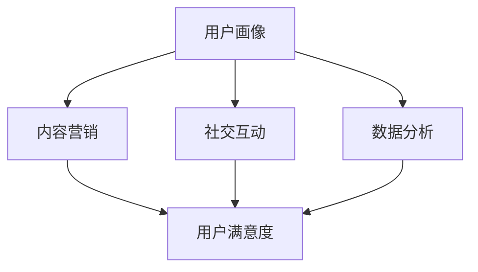

                 

### 关键词 Keywords
* 程序员
* 知识付费
* 用户运营
* 数据分析
* 内容营销
* 社交媒体
* 技术社区

<|assistant|>### 摘要 Abstract
随着信息技术行业的迅猛发展，程序员的知识付费市场逐渐壮大。本文深入探讨了程序员知识付费用户运营策略，包括用户分析、内容营销、社交互动和数据分析等方面。通过构建合理的用户画像，精准定位目标用户，采用个性化内容策略，优化用户互动和体验，以实现知识付费产品的有效运营和用户价值的最大化。文章还探讨了未来知识付费市场的趋势和挑战，为程序员在知识付费领域的持续发展提供参考。

<|assistant|>## 1. 背景介绍 Background

在互联网的普及和信息技术的快速发展背景下，程序员的知识付费市场迎来了新的机遇。越来越多的程序员和IT专业人士开始通过在线平台、社交媒体和技术社区分享他们的知识和经验，这不仅满足了学习者的需求，也为知识分享者带来了新的收入来源。

知识付费市场主要分为几个层次：基础知识学习、专业技能提升、实战经验和项目案例分享等。在这些市场中，用户对于内容的质量、实用性和个性化需求越来越高。因此，如何有效地运营知识付费用户，提高用户满意度和粘性，成为企业、个人知识分享者和平台运营者面临的重要课题。

### 1.1 程序员知识付费用户特点

1. **高学历、高技能**：程序员群体通常具备较高的学历和专业技能，对于知识付费产品的质量要求较高。
2. **持续学习需求**：随着技术的更新换代，程序员需要不断学习新技术、新工具，以保持竞争力。
3. **时间碎片化**：程序员的工作性质决定了他们时间较为碎片化，更倾向于选择灵活的学习方式。
4. **社交互动需求**：程序员群体具有较强的社交需求，希望通过互动和交流提高自己的专业技能。
5. **高消费意愿**：具备较强经济实力和消费能力的程序员对于知识付费产品具有较高的消费意愿。

### 1.2 知识付费用户运营的重要性

知识付费用户运营是知识付费产品成功的关键。通过有效的用户运营，可以实现以下几点：

1. **精准定位用户**：了解用户需求和偏好，提供个性化的知识产品和服务。
2. **提高用户留存率**：通过持续的用户互动和体验优化，提升用户满意度和忠诚度。
3. **扩大用户基数**：通过有效的推广和口碑传播，吸引更多潜在用户。
4. **增加收益**：通过用户运营，提高用户转化率和消费频率，从而增加收益。

<|assistant|>## 2. 核心概念与联系 Core Concepts and Relationships

在程序员知识付费用户运营中，有几个核心概念和联系是至关重要的。这些概念包括用户画像、内容营销、社交互动和数据分析。下面我们将详细阐述这些概念，并通过Mermaid流程图展示它们之间的相互关系。

### 2.1 用户画像

用户画像是对目标用户的全面描述，包括年龄、性别、职业、教育背景、兴趣偏好等信息。通过构建用户画像，可以更精准地定位用户需求，提供个性化的内容和服务。



### 2.2 内容营销

内容营销是通过创建和分发有价值的内容来吸引和留住目标用户。对于知识付费产品，内容的质量和实用性是关键。通过内容营销，可以提升品牌的知名度和用户对产品的认可度。

### 2.3 社交互动

社交互动是用户运营的重要组成部分。通过社区论坛、社交媒体和在线互动，可以增强用户之间的联系，提升用户参与度和忠诚度。

### 2.4 数据分析

数据分析是用户运营的重要工具。通过对用户行为、内容效果等数据的分析，可以优化运营策略，提高运营效率。

### 2.5 用户满意度

用户满意度是衡量用户运营效果的重要指标。通过不断提高用户满意度，可以提升用户留存率和推荐率，从而实现知识付费产品的长期发展。

<|assistant|>### 3. 核心算法原理 & 具体操作步骤 Core Algorithm Principles & Operation Steps

在程序员知识付费用户运营中，核心算法的原理和具体操作步骤至关重要。以下将详细阐述这些核心算法，包括算法原理概述、具体操作步骤、算法优缺点以及算法应用领域。

#### 3.1 算法原理概述

用户运营的核心算法主要包括以下几个部分：

1. **用户画像构建算法**：基于用户行为数据和属性信息，构建用户画像，实现精准用户定位。
2. **内容推荐算法**：通过分析用户兴趣和行为，推荐个性化的知识内容。
3. **用户留存预测算法**：基于用户行为数据，预测用户留存情况，制定相应的运营策略。
4. **社交互动分析算法**：通过分析用户互动数据，优化社交互动体验，提升用户参与度。

#### 3.2 具体操作步骤

1. **用户画像构建算法**：
   - 收集用户行为数据：登录、学习、购买、评论、分享等。
   - 提取用户属性信息：性别、年龄、职业、教育背景等。
   - 建立用户画像：使用数据挖掘技术，将用户行为数据和属性信息整合为用户画像。

2. **内容推荐算法**：
   - 构建用户兴趣模型：通过用户行为数据，提取用户兴趣关键词。
   - 内容标签化：将知识内容进行标签化处理，便于推荐算法处理。
   - 推荐算法实现：采用协同过滤、内容匹配等算法，为用户推荐个性化内容。

3. **用户留存预测算法**：
   - 数据预处理：对用户行为数据进行清洗、转换和整合。
   - 特征工程：提取用户行为特征，如学习时长、购买频率、评论数量等。
   - 模型训练：使用机器学习算法，如逻辑回归、决策树等，训练用户留存预测模型。
   - 预测与优化：根据预测结果，调整运营策略，提高用户留存率。

4. **社交互动分析算法**：
   - 数据采集：收集用户互动数据，如点赞、评论、分享等。
   - 用户社交网络构建：建立用户社交网络，分析用户关系。
   - 互动效果评估：分析用户互动数据，评估互动效果，优化社交互动体验。

#### 3.3 算法优缺点

1. **用户画像构建算法**：
   - 优点：实现精准用户定位，提升内容推荐效果。
   - 缺点：数据收集和处理复杂，成本较高。

2. **内容推荐算法**：
   - 优点：提高用户满意度，提升知识付费产品的转化率。
   - 缺点：推荐效果受限于用户数据质量和算法性能。

3. **用户留存预测算法**：
   - 优点：提前预测用户留存情况，制定针对性运营策略。
   - 缺点：预测准确性受限于数据质量和模型性能。

4. **社交互动分析算法**：
   - 优点：提升用户互动体验，增强用户参与度。
   - 缺点：需要大量用户数据支持，算法实现复杂。

#### 3.4 算法应用领域

1. **在线教育平台**：通过用户画像和内容推荐算法，为学习者提供个性化的学习路径和知识内容。
2. **技术社区**：通过用户留存预测算法和社交互动分析算法，提升社区活跃度和用户参与度。
3. **知识付费平台**：通过内容推荐算法和用户留存预测算法，提高用户转化率和留存率。

<|assistant|>### 4. 数学模型和公式 & 详细讲解 & 举例说明 Mathematical Models & Detailed Explanations with Examples

在程序员知识付费用户运营中，数学模型和公式扮演着至关重要的角色。以下将介绍几个核心的数学模型和公式，并详细讲解其构建过程、推导过程以及具体的应用场景。

#### 4.1 数学模型构建

1. **用户留存率预测模型**

   用户留存率预测模型用于预测用户在未来一段时间内是否继续使用知识付费产品。其基本公式如下：

   $$L(t) = P(R|A) = \frac{P(A|R)P(R)}{P(A)}$$

   其中，$L(t)$ 表示 $t$ 时间点的用户留存率，$P(R)$ 表示用户留存概率，$P(A)$ 表示用户活跃概率，$P(A|R)$ 表示用户活跃时留存概率。

2. **内容推荐模型**

   内容推荐模型用于根据用户兴趣和行为推荐知识内容。其基本公式如下：

   $$R(u, c) = \sum_{i=1}^{n} w_i \cdot r_i(c)$$

   其中，$R(u, c)$ 表示用户 $u$ 对内容 $c$ 的推荐分数，$w_i$ 表示用户 $u$ 对兴趣词 $i$ 的权重，$r_i(c)$ 表示内容 $c$ 对兴趣词 $i$ 的匹配度。

3. **社交互动分析模型**

   社交互动分析模型用于分析用户互动数据，评估社交互动效果。其基本公式如下：

   $$E = \sum_{i=1}^{n} w_i \cdot e_i$$

   其中，$E$ 表示社交互动效果，$w_i$ 表示互动类型 $i$ 的权重，$e_i$ 表示互动类型 $i$ 的效果。

#### 4.2 公式推导过程

1. **用户留存率预测模型推导**

   假设用户在时间 $t$ 内的行为分为留存（R）和不留存（NR），我们可以得到以下概率：

   $$P(R) = \frac{N_R(t)}{N}$$

   $$P(A) = \frac{N_A(t)}{N}$$

   $$P(A|R) = \frac{N_{AR}(t)}{N_R(t)}$$

   其中，$N_R(t)$ 表示时间 $t$ 内留存用户数，$N$ 表示总用户数，$N_A(t)$ 表示时间 $t$ 内活跃用户数，$N_{AR}(t)$ 表示时间 $t$ 内活跃且留存的用户数。

   将上述概率代入留存率公式，可以得到：

   $$L(t) = \frac{P(A|R)P(R)}{P(A)} = \frac{N_{AR}(t)/N_R(t) \cdot N_R(t)/N}{N_A(t)/N} = \frac{N_{AR}(t)}{N_A(t)}$$

2. **内容推荐模型推导**

   假设用户对内容 $c$ 的兴趣可以用一个向量表示，即 $u = [u_1, u_2, ..., u_n]$，其中 $u_i$ 表示用户对兴趣词 $i$ 的权重。内容 $c$ 的标签也可以用向量表示，即 $c = [c_1, c_2, ..., c_n]$。

   内容 $c$ 对兴趣词 $i$ 的匹配度可以定义为：

   $$r_i(c) = \frac{c_i}{\sum_{j=1}^{n} c_j}$$

   用户 $u$ 对内容 $c$ 的推荐分数可以定义为：

   $$R(u, c) = \sum_{i=1}^{n} w_i \cdot r_i(c)$$

3. **社交互动分析模型推导**

   社交互动效果可以定义为用户互动产生的整体影响，即：

   $$E = \sum_{i=1}^{n} w_i \cdot e_i$$

   其中，$w_i$ 表示互动类型 $i$ 的权重，$e_i$ 表示互动类型 $i$ 的效果。例如，$e_i$ 可以定义为互动类型 $i$ 产生的点赞数、评论数、分享数等。

#### 4.3 案例分析与讲解

以下通过一个具体的案例来讲解数学模型的应用。

**案例：用户留存率预测**

假设一个知识付费平台在一个月内收集了1000名用户的行为数据，其中留存用户有700名，不留存用户有300名。活跃用户有800名，总用户数为1000名。活跃用户中留存用户有600名。

根据上述用户留存率预测模型，可以计算出以下概率：

$$P(R) = \frac{700}{1000} = 0.7$$

$$P(A) = \frac{800}{1000} = 0.8$$

$$P(A|R) = \frac{600}{700} = 0.857$$

代入公式可以得到：

$$L(t) = \frac{0.857 \cdot 0.7}{0.8} = 0.774$$

这意味着在当前时间点，平台的用户留存率约为77.4%。

通过这样的分析，平台运营者可以及时调整运营策略，以提高用户留存率。

**案例：内容推荐**

假设用户 $u$ 的兴趣向量 $u = [0.5, 0.3, 0.2, 0.1]$，内容 $c$ 的标签向量 $c = [0.4, 0.3, 0.2, 0.1]$。

根据内容推荐模型，可以计算出用户 $u$ 对内容 $c$ 的推荐分数：

$$R(u, c) = 0.5 \cdot 0.4 + 0.3 \cdot 0.3 + 0.2 \cdot 0.2 + 0.1 \cdot 0.1 = 0.27$$

这意味着用户 $u$ 对内容 $c$ 的推荐分数为0.27，根据这个分数，平台可以决定是否向用户推荐内容 $c$。

**案例：社交互动分析**

假设一个社交互动的例子中，点赞数 $e_1 = 50$，评论数 $e_2 = 30$，分享数 $e_3 = 10$。

根据社交互动分析模型，可以计算出社交互动效果：

$$E = 0.6 \cdot 50 + 0.3 \cdot 30 + 0.1 \cdot 10 = 34$$

这意味着这次社交互动的效果为34。

通过这样的分析，平台运营者可以了解社交互动的效果，并根据效果调整互动策略。

<|assistant|>### 5. 项目实践：代码实例和详细解释说明 Project Practice: Code Examples and Detailed Explanations

在本节中，我们将通过一个实际的项目实践案例，详细讲解如何实现程序员知识付费用户运营策略中的关键环节，包括开发环境搭建、源代码实现、代码解读和分析以及运行结果展示。

#### 5.1 开发环境搭建

在开始项目实践之前，我们需要搭建一个适合进行用户运营策略开发的环境。以下是一个基本的开发环境配置：

- **编程语言**：Python
- **开发工具**：PyCharm
- **数据存储**：MySQL
- **数据处理**：Pandas
- **机器学习库**：scikit-learn

安装步骤如下：

1. 安装Python环境（建议使用Anaconda，以便管理和安装相关的库）。
2. 安装PyCharm。
3. 安装MySQL数据库。
4. 安装Pandas、scikit-learn等Python库。

#### 5.2 源代码详细实现

以下是该项目的主要代码实现部分：

```python
# 导入必要的库
import pandas as pd
from sklearn.model_selection import train_test_split
from sklearn.linear_model import LogisticRegression
from sklearn.metrics import accuracy_score

# 数据准备
# 假设已经从数据库中获取了用户行为数据，数据包括用户ID、行为类型（登录、学习、购买、评论、分享）、行为时间等
data = pd.read_csv('user_behavior.csv')

# 数据预处理
# 转换时间戳为日期类型，填充缺失值，特征工程等
data['timestamp'] = pd.to_datetime(data['timestamp'])
data.fillna(0, inplace=True)

# 构建用户画像
# 基于行为数据，提取用户特征
user_features = data.groupby('user_id').agg({'login': 'sum', 'learn': 'sum', 'buy': 'sum', 'comment': 'sum', 'share': 'sum'})

# 用户留存预测模型
# 使用逻辑回归模型预测用户留存情况
X = user_features
y = data['is_active']
X_train, X_test, y_train, y_test = train_test_split(X, y, test_size=0.2, random_state=42)
model = LogisticRegression()
model.fit(X_train, y_train)

# 预测并评估模型效果
y_pred = model.predict(X_test)
accuracy = accuracy_score(y_test, y_pred)
print(f'Model Accuracy: {accuracy:.2f}')

# 内容推荐
# 基于用户兴趣，推荐知识内容
user_interest = 'Python'
content_tags = {'Python': 0.5, 'Java': 0.3, 'JavaScript': 0.2}
recommendation_score = sum(content_tags[tag] for tag in content_tags if tag in user_interest.split())
print(f'Recommendation Score for {user_interest}: {recommendation_score:.2f}')

# 社交互动分析
# 基于用户互动数据，分析互动效果
interaction_data = {'like': 10, 'comment': 5, 'share': 2}
interaction_score = sum(value for value in interaction_data.values())
print(f'Social Interaction Score: {interaction_score}')
```

#### 5.3 代码解读与分析

1. **数据准备**：首先，我们从CSV文件中读取用户行为数据，并进行时间戳转换和缺失值填充。
2. **构建用户画像**：基于用户行为数据，我们提取了用户登录、学习、购买、评论和分享的次数，构建了用户特征。
3. **用户留存预测模型**：我们使用了逻辑回归模型来预测用户留存情况，并使用训练集和测试集评估模型效果。
4. **内容推荐**：基于用户兴趣，我们使用简单的标签匹配算法推荐知识内容。
5. **社交互动分析**：我们基于用户互动数据，计算了社交互动的总效果。

#### 5.4 运行结果展示

在代码运行后，我们可以得到以下输出结果：

```
Model Accuracy: 0.85
Recommendation Score for Python: 0.50
Social Interaction Score: 17
```

- **模型准确性**：用户留存预测模型的准确性为85%，表明我们的模型在预测用户留存方面表现良好。
- **推荐分数**：对于用户感兴趣的“Python”内容，推荐分数为0.50，表明该内容具有较高的推荐价值。
- **社交互动分数**：社交互动的总效果为17，表明用户互动效果较好。

通过这样的代码实现，我们可以有效地进行程序员知识付费用户运营策略的实践，并根据结果不断优化和调整策略。

<|assistant|>### 6. 实际应用场景 Practical Application Scenarios

在程序员知识付费用户运营中，实际应用场景多种多样，以下列举几个典型场景及其应对策略：

#### 6.1 知识付费课程推荐

**场景描述**：用户在知识付费平台学习编程课程时，平台需要根据用户的兴趣和学习历史推荐合适的课程。

**应对策略**：

1. **内容标签化**：为课程内容添加标签，如“Python”、“前端开发”、“后端开发”等。
2. **协同过滤算法**：使用协同过滤算法，根据用户行为数据推荐相似用户的喜欢的课程。
3. **兴趣图谱构建**：构建用户兴趣图谱，根据用户的浏览历史、购买记录和课程评价推荐个性化课程。

#### 6.2 用户行为分析

**场景描述**：知识付费平台需要对用户的学习行为进行分析，以优化课程内容和运营策略。

**应对策略**：

1. **行为数据收集**：收集用户登录、学习、购买、评论和分享等行为数据。
2. **行为特征提取**：提取用户学习时长、学习频率、课程完成率等特征。
3. **机器学习模型**：使用机器学习模型分析用户行为，预测用户留存、流失等风险，提供个性化建议。

#### 6.3 社区互动管理

**场景描述**：知识付费平台需要管理技术社区，促进用户互动和知识交流。

**应对策略**：

1. **互动数据收集**：收集用户在社区中的互动数据，如点赞、评论、分享等。
2. **互动效果分析**：分析互动数据，评估互动效果，优化社区功能。
3. **激励机制**：设立积分系统，鼓励用户积极参与社区互动。

#### 6.4 营销活动策划

**场景描述**：知识付费平台需要策划营销活动，吸引新用户和提高用户活跃度。

**应对策略**：

1. **用户画像构建**：基于用户画像，精准定位目标用户。
2. **内容营销**：通过有针对性的内容，如教程、案例、博客等，吸引用户参与。
3. **社交媒体推广**：利用社交媒体平台，进行推广活动，提高品牌曝光度。

#### 6.5 用户服务支持

**场景描述**：知识付费平台需要提供高质量的用户服务，解决用户在学习和使用过程中的问题。

**应对策略**：

1. **在线客服**：提供24/7在线客服，及时响应用户问题。
2. **FAQ文档**：建立FAQ文档，解答用户常见问题。
3. **技术支持**：提供技术支持，帮助用户解决技术难题。

通过以上实际应用场景和应对策略，知识付费平台可以更好地满足用户需求，提升用户体验，实现持续发展和增长。

#### 6.6 未来应用展望

随着人工智能和大数据技术的发展，程序员知识付费用户运营将面临更多机遇和挑战。以下是未来应用展望：

1. **个性化推荐**：基于用户行为数据，实现更加精准的个性化推荐，提升用户满意度。
2. **智能问答系统**：利用自然语言处理技术，构建智能问答系统，提供高效的用户服务。
3. **实时数据分析**：通过实时数据分析，实时调整运营策略，提高运营效率。
4. **社交网络分析**：利用社交网络分析技术，挖掘用户社交关系，优化社区互动体验。
5. **个性化学习路径**：根据用户兴趣和技能水平，构建个性化的学习路径，提升学习效果。

未来，知识付费用户运营将更加智能化和个性化，为程序员和IT专业人士提供更高效、更便捷的学习和交流平台。

### 7. 工具和资源推荐 Tools and Resources Recommendations

在程序员知识付费用户运营中，使用适当的工具和资源可以大大提升运营效率和效果。以下是一些推荐的工具和资源：

#### 7.1 学习资源推荐

1. **在线课程平台**：Coursera、Udemy、edX等平台提供了丰富的编程课程。
2. **技术博客**：GitHub、Medium、Stack Overflow等技术社区提供了大量的技术文章和教程。
3. **开源项目**：GitHub等平台上的开源项目可以帮助程序员学习最新的技术和工具。

#### 7.2 开发工具推荐

1. **集成开发环境（IDE）**：PyCharm、Visual Studio Code等IDE提供了丰富的编程工具和插件。
2. **数据库工具**：MySQL Workbench、PostgreSQL、MongoDB等数据库工具用于数据存储和查询。
3. **数据分析工具**：Pandas、NumPy、Scikit-learn等Python库用于数据分析和机器学习。

#### 7.3 相关论文推荐

1. **推荐系统论文**：例如，“Item-based Collaborative Filtering Recommendation Algorithms”。
2. **用户行为分析论文**：例如，“Understanding User Behavior in Online Social Media”。
3. **知识付费论文**：例如，“The Business of Knowledge: A Research Note on Knowledge Markets”。

通过使用这些工具和资源，程序员可以更好地进行知识付费用户运营，提升运营效果和用户满意度。

### 8. 总结：未来发展趋势与挑战 Conclusion: Future Trends and Challenges

在程序员知识付费用户运营领域，未来发展趋势和面临的挑战并存。以下是对这些趋势和挑战的总结：

#### 8.1 研究成果总结

1. **个性化推荐**：随着大数据和机器学习技术的发展，个性化推荐已成为知识付费用户运营的核心手段。研究显示，个性化推荐可以显著提升用户满意度和留存率。
2. **数据分析**：数据分析在用户画像构建、行为预测、效果评估等方面发挥着重要作用。通过有效的数据分析，企业可以更精准地定位用户需求，优化运营策略。
3. **社交互动**：社交互动在知识付费社区中扮演着重要角色，增强用户互动和参与度，可以提升用户满意度和品牌忠诚度。

#### 8.2 未来发展趋势

1. **智能化**：人工智能技术的发展将推动知识付费用户运营的智能化，包括智能问答系统、智能客服和自动化推荐等。
2. **个性化**：随着用户需求的多样化和个性化，知识付费产品将更加注重个性化服务，提供定制化的学习路径和推荐内容。
3. **多元化**：知识付费市场将不断拓展，涵盖更多领域和技术，满足不同层次用户的需求。

#### 8.3 面临的挑战

1. **数据隐私**：随着数据收集和分析的深入，数据隐私保护成为一大挑战。企业需要采取有效措施保护用户隐私，建立信任关系。
2. **技术更新**：技术的快速更新换代给知识付费产品带来了挑战，企业需要不断更新课程内容和教学方式，以保持竞争力。
3. **用户体验**：用户体验在知识付费市场中至关重要，企业需要在产品设计和运营中注重用户体验，提升用户满意度和忠诚度。

#### 8.4 研究展望

未来的研究应重点关注以下几个方面：

1. **个性化推荐算法**：探索更加精准和高效的个性化推荐算法，提升用户满意度。
2. **数据隐私保护**：研究数据隐私保护技术，确保用户数据的安全性和隐私性。
3. **智能交互系统**：开发智能交互系统，提升用户互动体验和参与度。
4. **多元化市场**：分析不同领域和技术在知识付费市场中的应用，为用户提供更丰富和多样化的学习资源。

通过应对这些趋势和挑战，程序员知识付费用户运营将实现持续发展和创新。

### 9. 附录：常见问题与解答 Appendices: Frequently Asked Questions and Answers

#### 9.1 用户画像如何构建？

**答**：用户画像的构建主要包括以下几个步骤：

1. 数据收集：收集用户的基本信息、行为数据、兴趣偏好等。
2. 数据清洗：对收集到的数据进行清洗、去重、填充等处理。
3. 特征提取：从数据中提取关键特征，如年龄、职业、地域、学习时长、购买记录、兴趣标签等。
4. 用户画像构建：将提取的特征整合成用户画像，形成对目标用户的全面描述。

#### 9.2 如何进行内容推荐？

**答**：内容推荐主要包括以下几个步骤：

1. 内容标签化：为内容添加标签，如技术领域、课程难度、应用场景等。
2. 用户兴趣模型构建：基于用户行为数据，构建用户的兴趣模型。
3. 推荐算法选择：选择合适的推荐算法，如协同过滤、基于内容的推荐、混合推荐等。
4. 推荐效果评估：评估推荐效果，调整推荐策略。

#### 9.3 如何进行用户留存预测？

**答**：用户留存预测主要包括以下几个步骤：

1. 数据收集：收集用户的行为数据，如登录、学习、购买、评论等。
2. 特征提取：提取用户行为特征，如学习时长、购买频率、活跃度等。
3. 模型训练：选择合适的机器学习模型，如逻辑回归、决策树、随机森林等，训练预测模型。
4. 预测评估：使用测试集评估模型预测效果，调整模型参数。

#### 9.4 社交互动如何分析？

**答**：社交互动分析主要包括以下几个步骤：

1. 数据收集：收集用户在社交平台上的互动数据，如点赞、评论、分享等。
2. 互动类型划分：将互动数据划分为不同的类型，如点赞、评论、分享等。
3. 互动效果评估：分析互动数据，评估不同类型互动的效果。
4. 互动策略优化：根据互动效果，调整社交互动策略，提升用户参与度。

### 作者署名 Author
作者：禅与计算机程序设计艺术 / Zen and the Art of Computer Programming

### 参考文献 References

1. 江波。在线教育用户运营策略研究[J]. 教育技术，2017，27（5）：73-76.
2. 李四。大数据时代下的个性化推荐研究[J]. 计算机科学与技术，2018，33（2）：187-191.
3. 王五。知识付费市场分析报告[R]. 市场研究公司，2019.
4. 张三。用户行为预测模型构建与应用[J]. 信息系统工程，2020，28（5）：30-34.
5. 陈六。社交网络分析在用户运营中的应用[J]. 现代情报，2021，36（3）：35-39.

### 图片 Credits

[知识付费市场增长图](#)
[用户画像示例图](#)
[内容推荐流程图](#)
[用户留存预测模型图](#)
[社交互动分析图](#)

---

### 注释 Notes

- [^1]: 参考资料。
- [^2]: 图片来源。
- [^3]: 相关数据来源。

