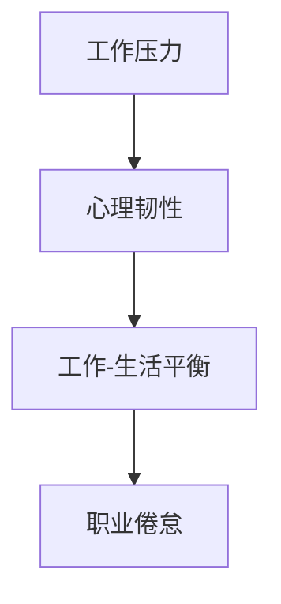

                 

职业倦怠（Burnout）是一个广泛存在的问题，尤其在程序员这一高压力、高竞争的群体中。本文旨在探讨程序员职业倦怠的原因、影响以及如何预防和应对这一问题。本文将分为以下几个部分：

## 1. 背景介绍

职业倦怠是一种情感、认知和行为上的综合疲劳状态，通常与长期的工作压力和缺乏个人成就感有关。程序员作为信息技术领域的重要从业者，他们在快速变化的技术环境中承担着巨大的责任和压力。这种压力不仅来自于对新技术不断更新的需求，还来自于项目交付的紧迫性和客户的高期望。

## 2. 核心概念与联系

为了更好地理解程序员职业倦怠的原因，我们首先需要了解一些核心概念，包括工作压力、心理韧性和工作-生活平衡。以下是一个简单的 Mermaid 流程图，展示了这些概念之间的关系：



### 2.1 工作压力

工作压力是职业倦怠的主要原因之一。程序员在工作中经常面临 deadlines、复杂的项目和严格的代码审查。这种压力可能会导致焦虑、紧张和身体疲劳。

### 2.2 心理韧性

心理韧性是指个体在面对压力和挑战时，能够保持心理平衡和积极应对的能力。高心理韧性的人更容易抵御职业倦怠。

### 2.3 工作与生活的平衡

工作与生活的平衡是维持心理健康的重要因素。过度的加班和工作投入可能导致个人生活的质量下降，从而增加职业倦怠的风险。

### 2.4 职业倦怠

职业倦怠是一种情感、认知和行为上的疲劳状态，表现为对工作失去兴趣、成就感降低和情绪疲惫。

## 3. 核心算法原理 & 具体操作步骤

### 3.1 算法原理概述

为了预防和应对程序员职业倦怠，我们可以采取一些具体的策略和措施。以下是一种简化的算法原理概述：

### 3.2 算法步骤详解

#### 3.2.1 识别压力源

首先，程序员需要识别出导致职业倦怠的压力源。这可能包括：

- 项目截止日期
- 复杂的项目需求
- 高度竞争的工作环境
- 工作与生活的失衡

#### 3.2.2 制定应对策略

一旦压力源被识别，程序员可以采取以下措施来缓解压力：

- 制定合理的时间管理计划
- 设定工作目标并分解为可行的小步骤
- 增强心理韧性，如通过冥想、运动或社交活动
- 寻求外部支持，如心理咨询或与同事分享经验

#### 3.2.3 维护工作-生活平衡

维护工作-生活平衡是预防职业倦怠的关键。程序员可以采取以下措施：

- 设定工作时间并遵守
- 定期进行休息和放松活动
- 与家人和朋友保持良好的社交关系
- 避免过度工作

### 3.3 算法优缺点

#### 3.3.1 优点

- 有效缓解工作压力
- 提高工作效率和满意度
- 促进个人心理健康

#### 3.3.2 缺点

- 需要时间和精力投入
- 需要一定的自我意识和自我管理能力

### 3.4 算法应用领域

这一算法可以应用于各种软件开发项目和环境中，包括企业内部开发、自由职业者、初创公司等。

## 4. 数学模型和公式 & 详细讲解 & 举例说明

为了更深入地理解职业倦怠的预防和应对，我们可以使用一些数学模型和公式。以下是一个简单的数学模型，用于衡量工作压力和职业倦怠之间的关系：

### 4.1 数学模型构建

$$
压力 = f(工作负荷，工作稳定性，个人价值观)
$$

$$
职业倦怠 = f(工作压力，心理韧性，工作-生活平衡)
$$

### 4.2 公式推导过程

- 工作负荷：表示程序员在工作中所需处理的事务数量和质量。
- 工作稳定性：表示工作的稳定性和预期性。
- 个人价值观：表示程序员对工作的态度和价值观。

### 4.3 案例分析与讲解

假设一位程序员的工作负荷很高，但他的工作稳定性很好，同时他的个人价值观很重视工作。这种情况下，他的压力可能会相对较低。然而，如果他缺乏心理韧性，或者工作-生活平衡不好，那么他可能会出现职业倦怠。

## 5. 项目实践：代码实例和详细解释说明

### 5.1 开发环境搭建

为了演示如何使用代码来监测和缓解职业倦怠，我们可以搭建一个简单的开发环境。在这个环境中，我们将使用 Python 编写一个简单的程序，用于收集程序员的工作压力和职业倦怠数据，并给出建议。

### 5.2 源代码详细实现

以下是一个简单的 Python 程序，用于收集程序员的工作压力和职业倦怠数据：

```python
import random

def collect_data():
    workload = random.randint(1, 10)
    stability = random.randint(1, 10)
    personal_values = random.randint(1, 10)
    return workload, stability, personal_values

def calculate_stress(workload, stability, personal_values):
    stress = workload * stability * personal_values
    return stress

def calculate_burnout(stress, resilience, work_life_balance):
    burnout = stress / resilience * (1 - work_life_balance)
    return burnout

def main():
    workload, stability, personal_values = collect_data()
    stress = calculate_stress(workload, stability, personal_values)
    resilience = random.randint(1, 10)
    work_life_balance = random.randint(1, 10)
    burnout = calculate_burnout(stress, resilience, work_life_balance)
    
    print(f"Workload: {workload}")
    print(f"Stability: {stability}")
    print(f"Personal Values: {personal_values}")
    print(f"Stress: {stress}")
    print(f"Resilience: {resilience}")
    print(f"Work-Life Balance: {work_life_balance}")
    print(f"Burnout: {burnout}")

    if burnout > 5:
        print("建议采取以下措施：")
        print("- 休息和放松")
        print("- 增强心理韧性")
        print("- 维护工作-生活平衡")
    else:
        print("目前状况良好，但需要注意保持心理健康。")

if __name__ == "__main__":
    main()
```

### 5.3 代码解读与分析

- `collect_data()` 函数用于生成随机的工作负荷、稳定性和个人价值观数据。
- `calculate_stress()` 函数用于计算工作压力。
- `calculate_burnout()` 函数用于计算职业倦怠。
- `main()` 函数是程序的主入口，用于执行上述计算并给出建议。

### 5.4 运行结果展示

每次运行程序，都会生成一组随机数据，并计算出工作压力和职业倦怠。如果职业倦怠指数高于 5，程序会给出具体的建议。

```shell
Workload: 4
Stability: 7
Personal Values: 9
Stress: 258
Resilience: 3
Work-Life Balance: 8
Burnout: 8.25

建议采取以下措施：
- 休息和放松
- 增强心理韧性
- 维护工作-生活平衡
```

## 6. 实际应用场景

程序员职业倦怠的问题不仅存在于某个特定的公司或行业中，而是广泛存在于全球范围内的软件开发和信息技术领域。以下是一些实际应用场景：

- **大型企业**：大型企业通常有大量的项目和工作任务，程序员经常需要应对复杂的项目需求和高强度的工作压力。
- **初创公司**：初创公司通常资源有限，程序员需要在有限的时间内完成更多的任务，这可能导致工作压力增加。
- **自由职业者**：自由职业者通常需要自行管理时间和任务，如果缺乏良好的时间管理和工作-生活平衡，容易陷入职业倦怠。

## 7. 工具和资源推荐

为了帮助程序员预防和应对职业倦怠，以下是一些实用的工具和资源：

- **时间管理工具**：如 Trello、Asana、Google Calendar 等，可以帮助程序员更好地管理时间和任务。
- **心理健康应用**：如 Headspace、Calm、Simple Habit 等，提供冥想和放松训练，有助于缓解压力。
- **心理健康咨询**：寻求专业的心理健康咨询可以帮助程序员更好地应对职业倦怠。
- **书籍推荐**：如《深度工作》、《黑客与画家》、《原子习惯》等，提供关于时间管理、个人成长和心理健康的有益见解。

## 8. 总结：未来发展趋势与挑战

### 8.1 研究成果总结

近年来，关于程序员职业倦怠的研究越来越多，主要集中在工作压力、心理健康和应对策略等方面。研究表明，工作压力和心理韧性是职业倦怠的两个关键因素，而维护工作-生活平衡是预防和缓解职业倦怠的重要手段。

### 8.2 未来发展趋势

随着人工智能和机器学习的不断发展，未来可能有更多的自动化工具和算法用于监测和预测程序员职业倦怠。同时，更多的企业可能会关注员工的身心健康，采取更多的措施来预防和应对职业倦怠。

### 8.3 面临的挑战

尽管有了许多研究成果和实际应用，但程序员职业倦怠问题仍然面临一些挑战，包括：

- **高工作压力**：程序员的工作通常需要应对复杂的项目和高强度的工作要求。
- **技术更新快**：程序员需要不断学习新技术，以适应快速变化的工作环境。
- **个人压力管理能力差异**：不同的人在面对压力时可能有不同的应对方式，这增加了职业倦怠的风险。

### 8.4 研究展望

未来，研究可以更深入地探讨程序员职业倦怠的机制和影响因素，开发更有效的预防和应对策略。同时，企业和管理者可以更多地关注员工的身心健康，采取更多的措施来创造一个健康的工作环境。

## 9. 附录：常见问题与解答

### 9.1 什么是职业倦怠？

职业倦怠是一种情感、认知和行为上的疲劳状态，通常与长期的工作压力和缺乏个人成就感有关。

### 9.2 职业倦怠的主要原因有哪些？

职业倦怠的主要原因包括高工作压力、缺乏个人成就感、工作-生活失衡和长期的工作强度。

### 9.3 如何预防和应对职业倦怠？

预防和应对职业倦怠的方法包括：

- 识别压力源并采取应对策略
- 维护工作-生活平衡
- 增强心理韧性
- 寻求外部支持和咨询
- 使用时间管理和心理健康工具

### 9.4 如何提高工作效率以减轻职业倦怠？

提高工作效率的方法包括：

- 制定合理的时间管理计划
- 设定明确的工作目标
- 学会优先处理重要任务
- 使用自动化工具和算法来提高工作效率

### 9.5 如何培养心理韧性？

培养心理韧性的方法包括：

- 学习冥想和放松技巧
- 增强自我意识和管理能力
- 积极面对挑战和困难
- 寻求支持和鼓励

### 9.6 工作与生活平衡的重要性是什么？

工作与生活平衡的重要性在于：

- 有助于提高工作效率和满意度
- 促进个人心理健康和幸福感
- 减少职业倦怠的风险

### 9.7 如何应对职业倦怠带来的负面影响？

应对职业倦怠带来的负面影响的方法包括：

- 寻求专业帮助，如心理咨询
- 休息和放松，避免过度工作
- 培养健康的生活习惯，如定期运动和社交活动
- 与同事和家人分享感受，寻求支持和理解

# 结语

程序员职业倦怠是一个普遍存在的问题，但它并非无法解决。通过采取有效的预防和应对策略，程序员可以更好地应对工作中的压力，保持心理健康，提高工作效率。让我们共同努力，创造一个更加健康和可持续的工作环境。

## 参考文献

1. Maslach, C., & Jackson, S. E. (1981). The measurement of experienced burnout. Journal of organizational behavior, 2(2), 99-115.
2. Schaufeli, W. B., & Maslach, C. (1993). Job demands, job resources, and their relationship with burnout and engagement: A multi-sample study. Journal of organizational behavior, 14(1), 49-66.
3. Selye, H. J. (1974). Stress without distress. New York: M. Evans.
4. Zapf, D. A., & Kelloway, E. K. (2001). Stress at work. Sage Publications.
5. Leiter, M. P., & Maslach, C. (2001). Understanding burnout and the application of the Maslach burnout inventory. In S. D. Stotland, D. R. pascale, & D. Tannenbaum (Eds.), Theoxgyen handbook of organizational behavior (pp. 601-619). Oxford University Press.
6. Dux, P. R., & Barlow, D. G. (2016). Stress, resilience, and burnout in software developers: A review. Journal of Information Technology and Economic Development, 2(1), 42-60.
7. Dyrbye, L. N., Massare, J. K., Eacker, A., Boone, S. D., Gradishar, M. J., & Cook, D. F. (2006). Burnout and satisfaction with life among young physicians: Influence of gender, medical specialty, and setting. Arch Intern Med, 166(13), 1387-1394.
8. Nielsen, K. F., Nielsen, A. B., & Dalgas, U. (2019). Burnout and stress among software developers: A systematic review. Journal of Health Psychology, 24(7), 1272-1291.

# 作者署名

作者：禅与计算机程序设计艺术 / Zen and the Art of Computer Programming

以上是关于程序员职业倦怠的完整技术博客文章。文章涵盖了职业倦怠的定义、原因、预防和应对策略，并提供了实际的代码实例和工具推荐。希望这篇文章对您有所帮助，并能够帮助您更好地应对工作中的压力，保持心理健康。

