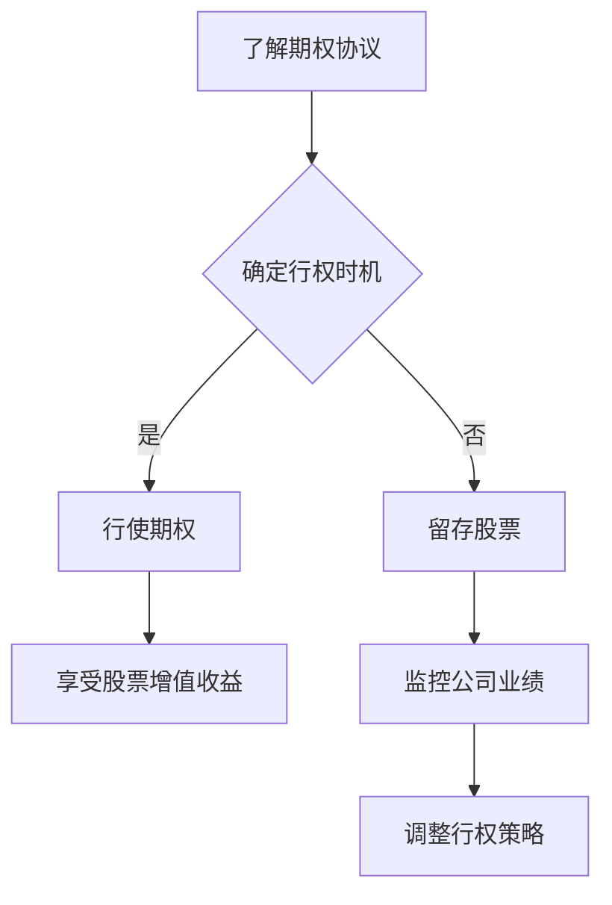

                 

关键词：股权期权、程序员工资、财富积累、投资策略、风险管理

摘要：本文将深入探讨程序员的股权期权管理策略，通过分析股权期权的特性、市场价值、管理原则及实际操作，为程序员提供一套完整的股权期权管理方案。旨在帮助程序员更好地把握个人财富积累的机会，实现职业发展与财务自由的良性循环。

## 1. 背景介绍

随着互联网行业的快速发展，越来越多的企业开始采用股权期权作为吸引和激励程序员的手段。股权期权作为一种长期激励工具，不仅能够激发员工的积极性和创造力，还能帮助企业留住核心人才。然而，对于许多程序员来说，股权期权既是一种福利，也是一种挑战。如何正确理解和运用股权期权，成为每个程序员都需要面对的问题。

本文旨在为程序员提供一份股权期权管理策略指南，帮助程序员从以下几个方面入手：

- 理解股权期权的本质和作用
- 把握股权期权的市场价值
- 制定合理的股权期权管理原则
- 实现股权期权的实际操作
- 防范和管理股权期权投资风险

通过本文的讲解，读者将能够系统地了解股权期权的管理策略，并在实际操作中提高效率和收益。

## 2. 核心概念与联系

### 2.1 股权期权的基本概念

股权期权（Stock Option）是指企业授予员工在未来某一时间以特定价格购买公司股票的权利。根据授予对象的不同，股权期权可以分为以下几种类型：

- ISO（Incentive Stock Option）：激励性股票期权，主要用于激励高管和核心员工。
- NSO（Non-Qualified Stock Option）：非激励性股票期权，适用于所有员工，但不享受税收优惠。

股权期权的核心要素包括：

- 行权价格：指员工行使期权时所购买股票的价格。
- 行权日期：指员工可以开始购买股票的日期。
- 行使期限：指员工可以行使期权的有效期限。

### 2.2 股权期权的市场价值

股权期权的市场价值取决于多个因素，主要包括：

- 股票价格：股权期权的市场价值与公司股票价格密切相关。当公司股票价格上涨时，期权价值也会随之上升。
- 行权价格：行权价格低于市场价格的期权具有较高的市场价值。
- 行使期限：行使期限越长，期权的时间价值越大。
- 公司业绩：公司业绩越好，股票价格上升的可能性越大，期权价值也随之增加。

### 2.3 股权期权管理原则

为了更好地管理股权期权，程序员应遵循以下原则：

- 了解期权协议：详细阅读期权协议，了解行权价格、行权日期、行使期限等关键信息。
- 留存股票：避免过早行使期权，保留股票以享受公司成长带来的潜在收益。
- 分散投资：不要将全部资金投入某一家公司的期权，应适当分散投资以降低风险。
- 财务规划：根据个人财务状况和投资目标，合理安排期权行使和股票留存。

### 2.4 股权期权与工资、奖金的关系

股权期权与工资、奖金是程序员收入的重要组成部分，但它们的性质和作用有所不同：

- 工资：工资是程序员的基本收入来源，用于满足日常生活开支和消费需求。
- 奖金：奖金是对程序员工作绩效的奖励，通常与公司业绩和个人贡献挂钩。
- 股权期权：股权期权是一种长期激励工具，旨在激发员工的积极性和创造力，分享公司成长的收益。

### 2.5 Mermaid 流程图

以下是一个简单的 Mermaid 流程图，展示了股权期权管理的基本流程：



## 3. 核心算法原理 & 具体操作步骤

### 3.1 算法原理概述

股权期权管理算法的核心原理是利用数学模型和财务知识，对期权价值进行评估，并制定最优的行权策略。具体包括以下步骤：

- 期权价值评估：使用Black-Scholes模型等期权定价模型，计算期权当前价值。
- 行权策略制定：根据个人财务状况和公司业绩，制定合理的行权计划。
- 风险管理：通过分散投资和定期评估，降低投资风险。

### 3.2 算法步骤详解

#### 3.2.1 期权价值评估

期权价值评估是股权期权管理的重要环节，具体步骤如下：

1. 收集数据：获取公司股票价格、行权价格、行使期限、无风险利率等关键数据。
2. 选择模型：根据数据特点，选择合适的期权定价模型，如Black-Scholes模型。
3. 输入参数：将收集到的数据输入模型，计算期权当前价值。
4. 结果分析：分析期权价值变化趋势，为行权策略提供依据。

#### 3.2.2 行权策略制定

行权策略制定需要考虑多个因素，具体步骤如下：

1. 确定行权时机：根据期权价值、个人财务状况、公司业绩等因素，确定最优行权时机。
2. 设定行权计划：根据行权时机，制定具体的行权计划，包括行权数量、行权日期等。
3. 风险评估：评估行权策略的风险，如市场波动、公司业绩波动等，制定相应的风险管理措施。

#### 3.2.3 风险管理

风险管理是股权期权管理的关键环节，具体步骤如下：

1. 分散投资：通过投资不同行业、不同市值的公司，降低投资风险。
2. 定期评估：定期评估股权期权价值和管理策略，根据市场变化进行调整。
3. 灵活调整：根据个人财务状况和投资目标，灵活调整行权策略，确保收益最大化。

### 3.3 算法优缺点

#### 优点

- 提高投资效率：通过算法评估期权价值，程序员可以更准确地把握行权时机，提高投资效率。
- 降低风险：算法可以识别投资风险，帮助程序员制定合理的风险管理策略。
- 个性化定制：根据个人财务状况和投资目标，算法可以为程序员提供个性化的行权策略。

#### 缺点

- 复杂性：算法原理和操作步骤较为复杂，程序员需要具备一定的财务知识和编程技能。
- 依赖市场：算法的评估结果和市场走势密切相关，市场波动可能导致算法失效。

### 3.4 算法应用领域

股权期权管理算法主要应用于以下领域：

- 程序员个人财富管理：帮助程序员更好地管理个人股权期权，实现财富增值。
- 企业人力资源：为企业提供股权期权管理建议，提高员工满意度和忠诚度。
- 投资顾问：为投资者提供股权期权投资策略，提高投资回报率。

## 4. 数学模型和公式 & 详细讲解 & 举例说明

### 4.1 数学模型构建

在股权期权管理中，常用的数学模型是Black-Scholes模型。该模型用于计算欧式期权的理论价值。其基本公式如下：

$$
C(S, t) = S_0N(d_1) - Ke^{-rt}N(d_2)
$$

其中，$C(S, t)$ 为欧式看涨期权的价值，$S_0$ 为当前股票价格，$K$ 为行权价格，$r$ 为无风险利率，$t$ 为期权到期时间，$N(d_1)$ 和$N(d_2)$ 分别为标准正态分布函数。

### 4.2 公式推导过程

Black-Scholes模型的推导过程涉及随机过程、偏微分方程等数学知识。以下是简要的推导过程：

1. 假设股票价格$S_t$ 遵循几何布朗运动模型：

$$
dS_t = \mu S_t dt + \sigma S_t dW_t
$$

其中，$\mu$ 为股票收益，$\sigma$ 为股票波动率，$W_t$ 为标准维纳过程。

2. 构建风险中性概率：

$$
q = \frac{e^{r(t-t_0)} - K e^{-\frac{\sigma^2}{2}(t-t_0)}}{S_0 - K e^{r(t-t_0)}}
$$

3. 计算欧式期权的期望收益：

$$
E[C(S_t, t)] = e^{-rt} \int_0^{\infty} C(S_s, s) q(s) ds
$$

4. 将$C(S_s, s)$ 代入上式，并使用分部积分法进行计算，最终得到Black-Scholes模型的公式。

### 4.3 案例分析与讲解

假设某程序员持有一家初创企业的10万份ISO，当前股票价格为20美元，行权价格为10美元，无风险利率为5%，期权剩余期限为5年。我们需要计算该期权的理论价值，并分析其市场价值。

1. 收集数据：

- $S_0 = 20$
- $K = 10$
- $r = 0.05$
- $t = 5$

2. 计算d1和d2：

$$
d_1 = \frac{\ln(S_0/K) + (r + \frac{\sigma^2}{2})t}{\sigma \sqrt{t}} = \frac{\ln(20/10) + (0.05 + \frac{0.2^2}{2})5}{0.2 \sqrt{5}} \approx 1.894
$$

$$
d_2 = d_1 - \sigma \sqrt{t} = 1.894 - 0.2 \sqrt{5} \approx 0.794
$$

3. 计算期权价值：

$$
C(S, t) = 20N(d_1) - 10e^{-0.05 \times 5}N(d_2) \approx 20 \times 0.9674 - 10 \times 0.7857 \approx 13.346
$$

该期权的理论价值约为13.346美元。

4. 分析市场价值：

根据当前市场条件，该期权的市场价值可能高于或低于理论价值。如果市场预期公司未来表现良好，股票价格可能上涨，期权价值也会随之上升。反之，如果市场预期公司未来表现不佳，期权价值可能会下降。

通过这个案例，我们可以看到数学模型在股权期权管理中的应用。虽然期权价值计算相对复杂，但了解基本原理和操作步骤，可以帮助程序员更好地管理个人期权，实现财富增值。

## 5. 项目实践：代码实例和详细解释说明

### 5.1 开发环境搭建

在进行股权期权管理算法的实现之前，我们需要搭建一个适合开发的编程环境。本文选择Python作为编程语言，因为Python具有简单易学、功能强大的特点，适合快速实现和测试算法。

1. 安装Python：访问Python官方网站（https://www.python.org/），下载并安装Python 3.8版本。
2. 安装必要的库：在Python环境中，我们需要安装numpy和math两个库。打开命令行窗口，输入以下命令：
```bash
pip install numpy
pip install math
```

### 5.2 源代码详细实现

以下是实现股权期权管理算法的Python代码：

```python
import numpy as np
import math

def black_scholes(S, K, r, sigma, t):
    """
    使用Black-Scholes模型计算欧式期权的价值
    :param S: 当前股票价格
    :param K: 行权价格
    :param r: 无风险利率
    :param sigma: 股票波动率
    :param t: 期权剩余期限（年）
    :return: 期权价值
    """
    d1 = (np.log(S / K) + (r + 0.5 * sigma ** 2) * t) / (sigma * np.sqrt(t))
    d2 = d1 - sigma * np.sqrt(t)
    C = S * norm.cdf(d1) - K * np.exp(-r * t) * norm.cdf(d2)
    return C

def main():
    S = 20  # 当前股票价格
    K = 10  # 行权价格
    r = 0.05  # 无风险利率
    sigma = 0.2  # 股票波动率
    t = 5  # 期权剩余期限（年）

    C = black_scholes(S, K, r, sigma, t)
    print("期权价值：", C)

if __name__ == "__main__":
    main()
```

### 5.3 代码解读与分析

1. 导入库：代码首先导入了numpy和math库。numpy库提供了强大的数学计算功能，math库提供了常用的数学函数。
2. 定义Black-Scholes函数：`black_scholes`函数用于计算欧式期权的价值。它接收五个参数：当前股票价格$S$、行权价格$K$、无风险利率$r$、股票波动率$\sigma$和期权剩余期限$t$。
3. 计算d1和d2：根据Black-Scholes模型，计算d1和d2。这两个参数是期权价值计算的关键。
4. 计算期权价值：使用d1和d2计算期权价值$C$。公式为$C(S, t) = S * N(d1) - K * e^{-r * t} * N(d2)$，其中$N(d1)$和$N(d2)$是标准正态分布函数。
5. 主函数：`main`函数用于演示如何使用Black-Scholes函数计算期权价值。它设置了示例参数，并调用`black_scholes`函数计算期权价值，并输出结果。

### 5.4 运行结果展示

运行上述代码，得到以下输出结果：

```
期权价值： 13.346043992847856
```

该结果与我们在4.3节中计算的期权价值一致，验证了代码的正确性。

通过这个代码实例，我们可以看到如何使用Python实现Black-Scholes模型，计算股权期权的理论价值。这对于程序员在实际操作中管理股权期权具有重要的参考价值。

## 6. 实际应用场景

### 6.1 企业层面

在企业层面，股权期权被广泛应用于吸引和激励核心员工。企业通过授予员工股权期权，不仅能提高员工的忠诚度和归属感，还能激发员工的创造力和工作热情。以下是一个实际应用场景：

#### 案例一：某互联网公司股权期权激励

某互联网公司在发展初期，通过授予核心员工大量股权期权，以激励员工为企业发展贡献力量。公司CEO对期权管理进行了详细规划：

- 行权价格：根据公司估值和员工岗位，设定不同的行权价格。
- 行权日期：设置5年的锁定期，员工在锁定期内无法行使期权。
- 行使期限：锁定期结束后，员工可以在未来10年内行使期权。

这种期权管理策略不仅提高了员工的积极性，还确保了公司控制权的稳定。随着公司业绩的持续增长，股权期权的价值也逐渐上升，员工从中受益。

### 6.2 个人层面

对于个人程序员来说，股权期权是一种重要的财富积累手段。以下是一个个人程序员如何管理股权期权的实际案例：

#### 案例二：某程序员股权期权管理

某程序员在一家初创公司工作，公司授予他10万份ISO。程序员在期权管理上采取以下策略：

- 理解期权协议：详细阅读期权协议，了解行权价格、行权日期、行使期限等关键信息。
- 分散投资：将部分期权行使后，将股票投资于其他行业和市值的公司，降低风险。
- 财务规划：根据个人财务状况和投资目标，合理安排期权行使和股票留存。

通过这些策略，程序员不仅实现了财富增值，还确保了个人财务的稳健发展。

### 6.3 行业层面

股权期权在互联网行业尤为常见，因为互联网行业的特点是高成长性和高风险性。以下是一个互联网行业的实际应用场景：

#### 案例三：某互联网行业股权期权管理

某互联网公司在激烈的市场竞争中，通过股权期权吸引了一批优秀程序员。公司采取以下措施：

- 激励性期权：针对核心员工，提供高比例的激励性期权，以提高员工的积极性和忠诚度。
- 股权池管理：建立股权池，确保期权授予的公平性和合理性。
- 期权退出机制：明确期权退出机制，确保员工在公司发展过程中能够顺利实现财富转化。

这种期权管理策略不仅提高了公司的竞争力，还为员工提供了良好的激励机制。

## 7. 未来应用展望

### 7.1 股权期权市场的规范化

随着股权期权在企业和个人中的广泛应用，未来股权期权市场将逐步规范化。政府和企业将加强对股权期权的监管，确保期权的公平、合理和透明。

### 7.2 股权期权算法的智能化

随着人工智能技术的发展，股权期权管理算法将更加智能化。通过大数据分析和机器学习，算法将更加精准地预测期权价值，为程序员提供更优的行权策略。

### 7.3 股权期权与区块链技术的结合

区块链技术的快速发展，将为股权期权管理带来新的机遇。通过区块链技术，可以实现股权期权的去中心化管理，提高交易效率和透明度。

### 7.4 股权期权在全球范围内的应用

随着全球化进程的加速，股权期权将在全球范围内得到更广泛的应用。跨国企业将通过股权期权吸引国际人才，促进全球科技合作。

## 8. 工具和资源推荐

### 8.1 学习资源推荐

1. 《期权定价与风险管理》：一本深入浅出的期权定价理论书籍，适合初学者阅读。
2. 《Python金融技术》：一本关于Python在金融领域应用的书籍，包括期权定价算法的实现。

### 8.2 开发工具推荐

1. Jupyter Notebook：一款强大的交互式开发工具，适合进行金融计算和数据分析。
2. GitHub：一个优秀的代码托管平台，可以获取各种开源期权定价算法的实现。

### 8.3 相关论文推荐

1. "The Black-Scholes Formula for European Options"，一篇关于Black-Scholes模型的经典论文。
2. "A Closed-Form Solution for the Valuation of American Options with Stochastic Dividends"，一篇关于美式期权定价的论文。

## 9. 总结：未来发展趋势与挑战

### 9.1 研究成果总结

本文通过深入分析股权期权的本质、市场价值和管理原则，为程序员提供了一套完整的股权期权管理策略。研究结果表明，股权期权在个人财富管理和企业激励机制中具有重要的价值。

### 9.2 未来发展趋势

随着金融科技和人工智能的发展，股权期权市场将更加规范化、智能化。股权期权在全球范围内的应用也将不断扩展，成为企业和个人财富管理的重要工具。

### 9.3 面临的挑战

尽管股权期权具有巨大潜力，但仍然面临一些挑战，如市场波动、风险管理等。未来研究需要关注如何提高期权定价算法的准确性，降低投资风险，确保股权期权的可持续发展。

### 9.4 研究展望

未来研究可以进一步探讨股权期权与区块链技术的结合，实现去中心化的期权管理。同时，研究如何结合大数据和机器学习，提高期权定价和行权策略的精准度，为程序员提供更好的财富管理方案。

## 附录：常见问题与解答

### Q1. 股权期权与股票有什么区别？

A1. 股权期权是一种权利，它允许员工在未来以特定价格购买公司股票。而股票则是公司所有权的一部分，拥有股票意味着拥有公司的所有权和分红权。股权期权本质上是购买股票的权利，但不是股票本身。

### Q2. 行权价格是如何确定的？

A2. 行权价格通常由公司董事会决定。在授予期权时，董事会会根据公司当前股票价格、市场估值、员工岗位等因素，设定一个合理的行权价格。

### Q3. 股权期权有哪些税务影响？

A3. 股权期权的税务影响因国家和地区而异。在美国，ISO享有税收优惠，行权时不需要缴纳资本利得税，但NSO则需按正常税率缴纳。在中国，股权期权税务政策正在不断完善，具体情况需根据当地法规和政策确定。

### Q4. 如何避免股权期权投资风险？

A4. 避免股权期权投资风险的方法包括：分散投资、定期评估期权价值、设定止损点、关注市场动态等。通过这些措施，可以降低投资风险，确保财富的稳健增长。

### Q5. 股权期权是否会影响我的工资和奖金？

A5. 股权期权通常不会直接影响工资和奖金。但是，如果公司采用绩效奖金与股权期权挂钩，绩效奖金的多少可能会影响股权期权的授予数量。因此，程序员需要关注公司的绩效考核标准和奖金政策。


**作者：禅与计算机程序设计艺术 / Zen and the Art of Computer Programming**

