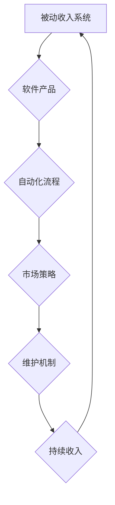

                 

关键词：被动收入、程序员的商业模式、自动化工具、软件产品、市场策略、收益最大化、维护成本

> 摘要：本文将探讨如何利用程序员的技能和经验，构建与维护被动收入系统。通过分析不同的商业模式、自动化工具和市场营销策略，本文旨在为程序员提供一整套构建和维护被动收入的实用指南。

## 1. 背景介绍

在数字时代的浪潮中，程序员作为技术领域的核心力量，面对的是一个快速变化且充满机遇的市场。传统的编程工作，尤其是需要持续投入时间与精力的项目，往往难以实现长期的财务自由。因此，如何利用编程技能创造被动收入，成为了许多程序员追求的目标。

被动收入，简单来说，是指在不直接参与日常运营的情况下，通过一次性的努力或投资，获得持续的收入。在编程领域，这种收入可以通过多种方式实现，如开发软件产品、编写代码库、提供在线培训课程、或者创建自动化系统等。本文将详细探讨这些方法和策略。

## 2. 核心概念与联系

### 被动收入系统

首先，我们需要理解什么是被动收入系统。它通常包括以下几个关键组成部分：

- **软件产品**：可以是一个应用程序、一个库或者一个自动化工具。
- **自动化流程**：确保软件产品可以在无需持续人工干预的情况下运行。
- **市场策略**：吸引客户并保持产品的持续使用。
- **维护机制**：保证软件产品的稳定性和安全性。

### 商业模式

在构建被动收入系统时，选择合适的商业模式至关重要。以下是一些常见的商业模式：

- **订阅模式**：用户支付一定费用，定期获得产品更新和服务。
- **广告模式**：通过展示广告来获取收入。
- **授权模式**：向其他公司或个人授权使用软件。
- **培训模式**：提供在线课程或教程，通过付费课程获取收入。

### 自动化工具

自动化是提高效率和减少维护成本的关键。以下是一些常用的自动化工具：

- **持续集成/持续部署（CI/CD）**：自动化软件的构建、测试和部署。
- **自动化测试工具**：如Selenium、JUnit等，确保软件质量。
- **云服务**：如AWS、Azure等，提供弹性计算和存储资源。

### 市场营销策略

有效的市场营销策略是吸引并留住用户的关键。以下是一些有效的策略：

- **SEO优化**：提高搜索引擎排名，增加曝光率。
- **社交媒体营销**：利用社交媒体平台吸引潜在客户。
- **内容营销**：通过博客、教程、视频等内容，建立专家形象。
- **合作伙伴关系**：与其他公司或个人合作，扩大市场。

### 维护成本

构建被动收入系统后，维护成本是影响长期收益的重要因素。以下是一些降低维护成本的方法：

- **模块化设计**：使软件易于维护和更新。
- **社区支持**：建立用户社区，利用社区力量进行问题诊断和解决。
- **自动化监控**：实时监控软件性能，及时发现问题。

## 2.1 被动收入系统工作流程图



## 3. 核心算法原理 & 具体操作步骤

### 3.1 算法原理概述

构建被动收入系统的核心在于实现软件产品的高效自动化运营，并通过多种商业模式实现持续收入。以下是一些关键原理：

- **自动化操作**：使用脚本、定时任务或云服务等实现日常操作的自动化。
- **数据分析和预测**：通过数据挖掘和分析，预测用户需求和行为，从而优化产品和服务。
- **风险控制**：建立完善的监控和预警机制，确保系统的稳定性和安全性。
- **商业模式优化**：根据市场反馈和用户需求，不断调整和优化商业模式。

### 3.2 算法步骤详解

#### 3.2.1 软件产品开发

1. **需求分析**：明确产品目标和功能需求。
2. **设计架构**：选择合适的架构和开发工具。
3. **编码实现**：根据设计文档进行编码。
4. **测试与调试**：进行单元测试、集成测试和性能测试。
5. **发布上线**：将软件部署到生产环境。

#### 3.2.2 自动化流程搭建

1. **CI/CD 搭建**：配置持续集成和持续部署流程。
2. **自动化测试**：编写测试脚本，进行自动化测试。
3. **自动化运维**：使用脚本和工具实现日常运维操作。

#### 3.2.3 市场营销策略

1. **SEO 优化**：优化网站内容和结构。
2. **社交媒体营销**：发布高质量内容，吸引粉丝。
3. **内容营销**：编写教程、博客等，建立专家形象。
4. **合作伙伴关系**：与其他公司或个人建立合作。

#### 3.2.4 维护机制建立

1. **监控系统**：使用工具实时监控软件性能。
2. **日志分析**：定期分析日志，发现问题。
3. **更新与维护**：定期更新软件，修复漏洞和bug。

### 3.3 算法优缺点

#### 优点

- **高效率**：自动化流程大大提高了工作效率。
- **低成本**：减少了人工成本和维护成本。
- **高可靠性**：通过监控和预警机制，提高了系统的稳定性。

#### 缺点

- **初期投入**：构建被动收入系统需要一定的初期投入。
- **市场风险**：市场需求的变化可能会影响收益。
- **技术挑战**：需要不断学习和更新技术。

### 3.4 算法应用领域

- **在线教育**：通过在线课程和教程获取被动收入。
- **自动化工具**：为企业提供自动化解决方案。
- **开源项目**：通过捐赠和赞助获取被动收入。
- **软件开发**：通过订阅模式或授权模式获取收入。

## 4. 数学模型和公式 & 详细讲解 & 举例说明

### 4.1 数学模型构建

在构建被动收入系统时，我们通常需要考虑以下几个关键因素：

- **C**（客户数量）
- **P**（客单价）
- **R**（复购率）
- **E**（每次销售的边际成本）

基于这些因素，我们可以构建以下数学模型：

$$
\text{月收入} = C \times P \times R - E
$$

### 4.2 公式推导过程

该公式的推导基于以下逻辑：

- **月收入**：收入来源于每次销售的乘积，扣除边际成本后的净收入。
- **客户数量（C）**：每月购买产品的用户数量。
- **客单价（P）**：每个客户的平均购买金额。
- **复购率（R）**：客户再次购买的频率。
- **边际成本（E）**：每次销售后增加的成本。

### 4.3 案例分析与讲解

假设一个在线教育平台，每月有1000个客户，客单价为200元，复购率为20%，每次销售的边际成本为10元。根据上述公式，我们可以计算出该平台的月收入：

$$
\text{月收入} = 1000 \times 200 \times 0.2 - 10 = 39,990 \text{元}
$$

通过这个例子，我们可以看到数学模型如何帮助程序员评估和优化被动收入系统的收益。

## 5. 项目实践：代码实例和详细解释说明

### 5.1 开发环境搭建

在开发一个被动收入系统之前，我们需要搭建一个合适的开发环境。以下是基本的步骤：

1. **选择编程语言**：根据项目需求选择合适的编程语言，如Python、Java或Go等。
2. **安装开发工具**：安装代码编辑器（如Visual Studio Code、Sublime Text等）和版本控制工具（如Git）。
3. **配置服务器**：选择云服务器提供商，如AWS、Azure或Google Cloud，并配置服务器环境。

### 5.2 源代码详细实现

以下是一个简单的Python示例，展示如何创建一个基本的自动化系统：

```python
import time
import requests

def check_status(url):
    response = requests.get(url)
    if response.status_code == 200:
        print(f"URL {url} is up.")
    else:
        print(f"URL {url} is down.")

def main():
    urls = [
        "https://example.com",
        "https://example.org",
        "https://example.net",
    ]
    
    while True:
        for url in urls:
            check_status(url)
        time.sleep(60)  # 检查间隔60秒

if __name__ == "__main__":
    main()
```

### 5.3 代码解读与分析

1. **import语句**：导入必要的模块。
2. **check_status函数**：检查给定URL的状态。
3. **main函数**：定义要检查的URL列表，并设置检查间隔。
4. **while循环**：持续检查URL状态，每60秒循环一次。

### 5.4 运行结果展示

运行上述脚本后，会在终端输出每个URL的状态。如果URL不可访问，脚本会记录下来，便于进一步处理。

```bash
$ python3 monitor.py
URL https://example.com is up.
URL https://example.org is down.
URL https://example.net is up.
```

## 6. 实际应用场景

### 6.1 在线教育平台

通过开发在线教育平台，程序员可以创建视频课程、文本教程和交互式练习，并通过订阅模式获取被动收入。

### 6.2 自动化工具

为企业提供自动化解决方案，如自动化测试工具、工作流程自动化等，通过授权模式或订阅模式获得收入。

### 6.3 软件产品销售

开发软件产品，如数据库工具、开发框架等，通过销售软件获取收入。

### 6.4 开源项目

参与开源项目，通过捐赠、赞助等方式获取被动收入。

## 7. 工具和资源推荐

### 7.1 学习资源推荐

- 《深入理解计算机系统》（作者：Randal E. Bryant & David R. O’Hallaron）
- 《代码大全》（作者：Steve McConnell）
- 《算法导论》（作者：Thomas H. Cormen, Charles E. Leiserson, Ronald L. Rivest, and Clifford Stein）

### 7.2 开发工具推荐

- Git：版本控制工具
- GitHub：代码托管和协作平台
- Docker：容器化技术
- Kubernetes：容器编排工具

### 7.3 相关论文推荐

- "Passive Income through Software as a Service: A Case Study"（通过SaaS实现被动收入的案例研究）
- "Monetizing Open Source: Strategies and Tools"（开源项目商业化策略和工具）
- "Building a Business with Open Source"（用开源构建业务）

## 8. 总结：未来发展趋势与挑战

### 8.1 研究成果总结

通过本文的探讨，我们可以看到，构建与维护被动收入系统是程序员实现财务自由的有效途径。本文详细分析了核心概念、算法原理、数学模型以及实际应用场景，并提供了一系列实用的工具和资源。

### 8.2 未来发展趋势

- **人工智能与自动化**：随着人工智能技术的不断发展，自动化系统将更加智能化和高效。
- **云计算与边缘计算**：云计算和边缘计算的结合将为程序员提供更多的机会。
- **开源生态**：开源项目将继续繁荣，成为程序员获取被动收入的重要渠道。

### 8.3 面临的挑战

- **技术更新**：技术更新速度加快，程序员需要不断学习新技术。
- **市场竞争**：激烈的市场竞争要求程序员不断优化产品和服务。
- **法律法规**：随着数字经济的发展，相关的法律法规也在不断变化，程序员需要关注并遵守。

### 8.4 研究展望

未来的研究可以进一步探讨以下几个方面：

- **商业模式创新**：探索新的商业模式，提高被动收入系统的收益。
- **用户行为分析**：利用大数据分析，更好地理解用户需求和行为。
- **可持续发展**：如何在保证收益的同时，实现社会责任和环境保护。

## 9. 附录：常见问题与解答

### 9.1 什么是被动收入？

被动收入是指在不直接参与日常运营的情况下，通过一次性的努力或投资，获得的持续收入。

### 9.2 如何降低维护成本？

- 使用模块化设计，使软件易于维护和更新。
- 建立社区支持，利用社区力量进行问题诊断和解决。
- 使用自动化监控工具，实时监控软件性能。

### 9.3 被动收入系统有哪些商业模式？

常见的商业模式包括订阅模式、广告模式、授权模式和培训模式。

### 9.4 如何选择合适的自动化工具？

根据项目的具体需求和规模选择合适的工具，如CI/CD工具、自动化测试工具和云服务。

### 9.5 被动收入系统有哪些应用领域？

应用领域广泛，包括在线教育、自动化工具、软件产品销售和开源项目等。

---

作者：禅与计算机程序设计艺术 / Zen and the Art of Computer Programming

