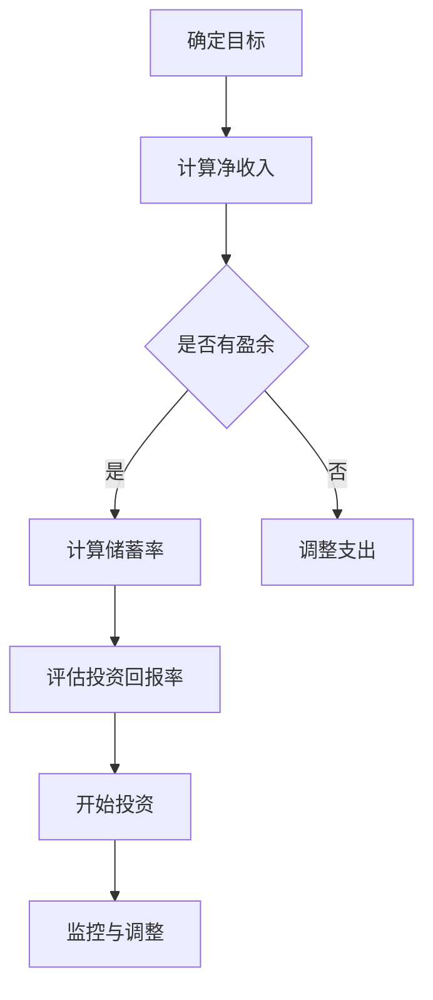

                 

 > **关键词：财务自由，计算器，程序开发，算法，实践，应用场景**

> **摘要：本文将探讨如何为程序员开发一个财务自由计算器，包括核心概念、算法原理、数学模型、项目实践、实际应用场景、未来展望和工具推荐。**

## 1. 背景介绍

财务自由是一个备受关注的主题，尤其是在当今全球金融危机和不确定性加剧的时代。对许多人来说，财务自由意味着能够完全控制自己的财务状况，不必担心经济压力，从而享受生活。然而，要实现财务自由，需要经过详细的规划和精确的计算。

作为程序员，我们具备开发和实现复杂系统的能力。因此，我们可以利用这些技能来创建一个财务自由计算器，帮助用户更好地规划和管理他们的财务。这个计算器不仅可以提供基本的财务分析，还可以根据用户的具体情况提供个性化的财务规划建议。

## 2. 核心概念与联系

### 2.1. 财务自由的概念

财务自由通常定义为“不需要工作收入，仅依靠投资收入即可维持生活”。这个定义需要满足两个条件：

1. **收入覆盖支出**：你的投资收入必须足够覆盖你的日常开销。
2. **无债务压力**：你不需要担心还债的压力。

### 2.2. 相关概念

- **净收入**：你的总收入减去所有支出。
- **储蓄率**：你的储蓄金额与净收入之比。
- **投资回报率**：你的投资所产生的收益。

### 2.3. Mermaid 流程图

下面是一个简化的财务自由规划流程图：



## 3. 核心算法原理 & 具体操作步骤

### 3.1. 算法原理概述

财务自由计算器的核心是算法，它包括以下几个主要步骤：

1. **收入和支出计算**：根据用户提供的收入和支出信息，计算净收入。
2. **储蓄率计算**：根据净收入和储蓄目标，计算需要储蓄的金额。
3. **投资回报率计算**：根据用户的风险承受能力和市场情况，评估投资回报率。
4. **投资组合构建**：根据储蓄率和投资回报率，构建合适的投资组合。
5. **监控与调整**：根据实际表现，监控投资组合并做出必要的调整。

### 3.2. 算法步骤详解

#### 3.2.1. 收入和支出计算

使用用户提供的收入和支出数据，计算净收入。具体步骤如下：

1. **收集数据**：获取用户的收入和支出数据。
2. **计算净收入**：净收入 = 总收入 - 总支出。

#### 3.2.2. 储蓄率计算

根据用户的目标储蓄金额和净收入，计算需要储蓄的金额。具体步骤如下：

1. **设定储蓄目标**：用户设定每月或每年的储蓄目标。
2. **计算储蓄率**：储蓄率 = 储蓄目标 / 净收入。

#### 3.2.3. 投资回报率计算

根据用户的风险承受能力和市场情况，评估投资回报率。具体步骤如下：

1. **风险承受评估**：用户评估自己的风险承受能力。
2. **市场分析**：分析当前市场情况，预测未来可能的回报率。
3. **计算投资回报率**：投资回报率 = 预期回报 / 投资金额。

#### 3.2.4. 投资组合构建

根据储蓄率和投资回报率，构建合适的投资组合。具体步骤如下：

1. **确定投资类型**：根据用户的风险偏好，选择股票、债券、房地产等投资类型。
2. **分配投资比例**：根据储蓄率和预期回报率，分配不同投资类型的比例。
3. **构建投资组合**：将资金分配到不同的投资类型中。

#### 3.2.5. 监控与调整

根据实际表现，监控投资组合并做出必要的调整。具体步骤如下：

1. **监控投资组合**：定期检查投资组合的表现。
2. **评估回报率**：与预期回报率进行比较。
3. **调整投资组合**：根据实际情况，调整投资比例或投资类型。

### 3.3. 算法优缺点

#### 优点

- **个性化**：根据用户的具体情况，提供个性化的财务规划建议。
- **自动化**：自动计算和监控财务状况，节省时间。
- **灵活性**：可以根据用户的需求和市场情况，灵活调整投资策略。

#### 缺点

- **市场风险**：投资回报率受到市场波动的影响，可能产生亏损。
- **技术门槛**：需要具备一定的编程和金融知识。

### 3.4. 算法应用领域

财务自由计算器可以应用于以下领域：

- **个人财务管理**：帮助个人规划和管理财务，实现财务自由。
- **企业财务管理**：为企业提供财务规划和投资建议。
- **金融科技**：为金融科技公司提供财务分析工具。

## 4. 数学模型和公式 & 详细讲解 & 举例说明

### 4.1. 数学模型构建

财务自由计算器的核心是数学模型，它包括以下几个主要部分：

- **收入模型**：描述用户的收入来源和金额。
- **支出模型**：描述用户的支出项目和金额。
- **储蓄模型**：描述用户的储蓄目标和储蓄率。
- **投资模型**：描述用户的风险承受能力和投资回报率。
- **投资组合模型**：描述用户的投资组合和比例。

### 4.2. 公式推导过程

以下是一个简化的公式推导过程：

$$
\text{净收入} = \text{总收入} - \text{总支出}
$$

$$
\text{储蓄率} = \frac{\text{储蓄目标}}{\text{净收入}}
$$

$$
\text{投资回报率} = \frac{\text{预期回报}}{\text{投资金额}}
$$

### 4.3. 案例分析与讲解

假设用户小张的年收入为 10 万元，每月支出为 5000 元，希望实现每月储蓄 3000 元的财务自由目标。我们可以使用以下步骤进行计算：

1. **计算净收入**：净收入 = 年收入 - 每月支出 = 10 万元 - 5000 元/月 = 8.5 万元/年。

2. **计算储蓄率**：储蓄率 = 储蓄目标 / 净收入 = 3000 元/月 / 8.5 万元/年 = 3.5%。

3. **评估投资回报率**：假设小张的风险承受能力较高，选择股票投资，市场平均回报率为 10%。

4. **构建投资组合**：根据储蓄率和投资回报率，构建投资组合。例如，将 70% 的资金投资于股票，30% 的资金投资于债券。

5. **监控与调整**：定期检查投资组合的表现，并根据实际情况进行调整。

## 5. 项目实践：代码实例和详细解释说明

### 5.1. 开发环境搭建

为了开发一个财务自由计算器，我们需要准备以下开发环境：

- **Python 3.x**：作为主要的编程语言。
- **Jupyter Notebook**：用于编写和运行代码。
- **matplotlib**：用于绘制图表。

### 5.2. 源代码详细实现

下面是一个简单的财务自由计算器实现示例：

```python
import matplotlib.pyplot as plt

# 收入和支出数据
income = 100000
monthly_expense = 5000

# 储蓄目标和储蓄率
savings_target = 3000
savings_rate = savings_target / (income - monthly_expense)

# 投资回报率
investment_return_rate = 0.1

# 投资组合
stock_ratio = 0.7
bond_ratio = 0.3

# 构建投资组合
investment_combination = {
    'stock': stock_ratio,
    'bond': bond_ratio
}

# 监控与调整
def monitor_and_adjust():
    # 这里可以添加代码来监控投资组合的表现，并根据实际情况进行调整
    pass

# 绘制储蓄率和投资回报率图表
def plot_savings_and_return_rate():
    savings_rates = [savings_rate] * 12
    return_rates = [investment_return_rate] * 12

    plt.plot(savings_rates, label='Savings Rate')
    plt.plot(return_rates, label='Return Rate')
    plt.xlabel('Month')
    plt.ylabel('Rate')
    plt.legend()
    plt.show()

# 主函数
def main():
    plot_savings_and_return_rate()
    monitor_and_adjust()

if __name__ == '__main__':
    main()
```

### 5.3. 代码解读与分析

这段代码首先导入了必要的库，包括 `matplotlib` 用于绘制图表。然后定义了收入、支出、储蓄目标和储蓄率等变量。接下来，根据储蓄率和投资回报率构建了一个简单的投资组合。`monitor_and_adjust` 函数用于监控和调整投资组合，这是一个预留的接口，可以根据实际情况进行扩展。

最后，`plot_savings_and_return_rate` 函数用于绘制储蓄率和投资回报率随时间变化的图表。`main` 函数是程序的入口点，调用了绘制图表和监控调整的函数。

### 5.4. 运行结果展示

运行上述代码后，将展示一个图表，显示每月的储蓄率和投资回报率。这个图表可以帮助用户直观地了解自己的财务状况和投资回报情况。

## 6. 实际应用场景

财务自由计算器可以应用于以下实际场景：

- **个人理财规划**：帮助个人用户了解自己的财务状况，制定储蓄和投资计划。
- **企业财务管理**：为企业提供财务分析和投资建议，优化资金配置。
- **金融教育**：用于金融教育和培训，帮助用户了解财务规划和投资的基本概念。

## 7. 未来应用展望

随着人工智能和金融科技的不断发展，财务自由计算器有望在以下几个方面得到改进：

- **智能化**：通过人工智能技术，提供更准确的财务分析和投资建议。
- **个性化**：根据用户的个性化需求，提供更加贴心的财务规划服务。
- **实时性**：通过实时数据分析和监控，提供更加及时的财务信息。

## 8. 工具和资源推荐

### 8.1. 学习资源推荐

- **《Python 编程：从入门到实践》**：一本适合初学者的 Python 入门书籍。
- **《金融学原理》**：一本介绍金融基础知识的教科书。

### 8.2. 开发工具推荐

- **Jupyter Notebook**：一个强大的交互式开发环境。
- **PyCharm**：一款功能丰富的 Python 集成开发环境。

### 8.3. 相关论文推荐

- **《基于机器学习的财务预测方法研究》**：探讨如何使用机器学习技术进行财务预测。
- **《金融科技与金融市场创新》**：分析金融科技对金融市场的影响。

## 9. 总结：未来发展趋势与挑战

### 9.1. 研究成果总结

本文介绍了如何为程序员开发一个财务自由计算器，包括核心概念、算法原理、数学模型、项目实践和实际应用场景。通过这个计算器，用户可以更好地规划和管理自己的财务，实现财务自由。

### 9.2. 未来发展趋势

随着人工智能和金融科技的不断发展，财务自由计算器有望在智能化、个性化和实时性方面得到改进。未来的研究可以集中在这些方面，以提供更准确和高效的财务规划服务。

### 9.3. 面临的挑战

财务自由计算器在开发和应用过程中面临的主要挑战包括市场风险、技术门槛和数据隐私。需要进一步研究和解决这些问题，以确保计算器的可靠性和用户体验。

### 9.4. 研究展望

未来的研究可以集中在以下几个方面：

- **智能化算法**：结合人工智能技术，提高财务自由计算器的预测准确性和适应性。
- **个性化服务**：根据用户的个性化需求，提供更加贴心的财务规划服务。
- **数据安全与隐私**：确保用户数据的安全性和隐私性，增强用户信任。

## 9. 附录：常见问题与解答

### 9.1. 如何计算投资回报率？

投资回报率可以通过以下公式计算：

$$
\text{投资回报率} = \frac{\text{预期回报}}{\text{投资金额}}
$$

其中，预期回报是根据市场分析和用户的风险承受能力预测的投资收益。

### 9.2. 财务自由计算器需要哪些数据？

财务自由计算器需要以下数据：

- 收入来源和金额。
- 支出项目和金额。
- 储蓄目标和储蓄率。
- 风险承受能力和投资回报率。
- 投资组合和比例。

通过这些数据，计算器可以计算出用户的财务状况和投资回报情况。

### 9.3. 如何调整投资组合？

调整投资组合的步骤如下：

1. **监控投资组合表现**：定期检查投资组合的表现，与预期回报进行比较。
2. **评估风险承受能力**：根据实际情况，重新评估自己的风险承受能力。
3. **调整投资比例**：根据评估结果，适当调整投资比例，以降低风险或提高回报。
4. **重新配置投资组合**：根据调整后的投资比例，重新配置投资组合。

### 9.4. 财务自由计算器的市场前景如何？

随着人们对财务自由需求的增加和金融科技的快速发展，财务自由计算器的市场前景非常广阔。未来，随着人工智能技术的应用，财务自由计算器的预测准确性和用户体验将得到显著提升，进一步推动市场的发展。

---

**作者：禅与计算机程序设计艺术 / Zen and the Art of Computer Programming**

