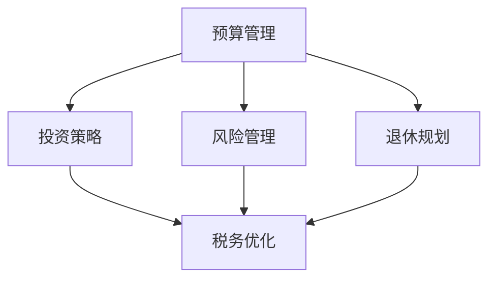

                 

关键词：财务规划，程序员，投资，预算，风险管理，退休规划，税务优化

> 摘要：本文旨在为程序员提供一份全面的财务规划指南，从预算管理、投资策略、风险管理到退休规划，帮助程序员实现财务自由，安心专注于编程事业。

## 1. 背景介绍

作为一名程序员，您深知技术知识的重要性。然而，随着科技行业的快速发展，财务规划同样变得越来越重要。尽管编程能力让您在职场中具备竞争力，但缺乏有效的财务规划，可能导致财富积累缓慢，甚至可能面临财务困境。本文将为您呈现一个系统性的财务规划框架，帮助您从新手逐步成长为财务规划专家。

### 1.1 程序员的财务现状

- **收入稳定但增长缓慢**：程序员通常拥有较为稳定的收入，但随着工作经验的积累，收入增长幅度可能逐渐放缓。
- **工作时间较长**：程序员往往需要加班，工作时间较长，这可能导致健康和休闲时间被压缩。
- **投资渠道有限**：程序员通常专注于技术领域，对投资知识了解不足，投资渠道较为有限。
- **税务负担**：程序员收入形式多样，包括工资、奖金、股票期权等，可能面临较为复杂的税务问题。

### 1.2 财务规划的重要性

- **财富积累**：通过合理的财务规划，程序员可以实现财富的持续增长。
- **风险管理**：财务规划有助于识别和应对潜在风险，保障财务安全。
- **退休规划**：合理的退休规划可以帮助您在退休后依然享受高质量的生活。
- **税务优化**：通过税务规划，可以降低税务负担，实现税收优惠。

## 2. 核心概念与联系

为了更好地理解财务规划，我们需要了解几个核心概念，包括预算管理、投资策略、风险管理和退休规划。下面是一个使用 Mermaid 描述的流程图，展示了这些概念之间的联系。



### 2.1 预算管理

预算管理是财务规划的基础，它涉及对收入和支出的规划与控制。通过制定合理的预算，程序员可以确保财务状况的稳定和健康。

### 2.2 投资策略

投资策略是财务规划中的重要环节，通过投资，程序员可以实现资产的增值。合理的投资策略需要考虑风险承受能力、投资目标和市场环境。

### 2.3 风险管理

风险管理旨在识别和应对潜在风险，保障财务安全。程序员需要学会如何分散风险，降低投资损失的可能性。

### 2.4 退休规划

退休规划是财务规划中的长期目标，通过提前规划和积累，程序员可以在退休后享受无忧的生活。

### 2.5 税务优化

税务优化是通过合法手段降低税务负担，实现税收优惠。程序员需要了解税务政策，合理规划收入和支出。

## 3. 核心算法原理 & 具体操作步骤

### 3.1 算法原理概述

财务规划的核心算法原理可以概括为以下四个步骤：

1. **制定预算**：根据收入和支出情况，制定合理的预算计划。
2. **投资决策**：根据风险承受能力和投资目标，选择合适的投资产品和策略。
3. **风险管理**：通过分散投资和风险控制策略，降低投资风险。
4. **退休规划**：根据退休目标和退休时间，制定退休储蓄计划。

### 3.2 算法步骤详解

#### 3.2.1 制定预算

1. 收入估算：估算月收入和年收入。
2. 支出估算：估算日常生活开支、房租、交通费用等。
3. 预算调整：根据实际情况调整预算，确保收支平衡。

#### 3.2.2 投资决策

1. 风险承受能力评估：了解自己的风险偏好。
2. 投资目标设定：明确投资目标和预期收益。
3. 投资组合构建：根据风险承受能力和投资目标，选择合适的投资产品和策略。

#### 3.2.3 风险管理

1. 分散投资：将投资分散到不同的资产类别和行业。
2. 风险控制：定期评估投资组合，及时调整。
3. 持续学习：关注市场动态和投资知识，提高投资技能。

#### 3.2.4 退休规划

1. 退休目标设定：确定退休时间和预期退休生活品质。
2. 储蓄计划制定：根据退休目标，制定储蓄计划和投资策略。
3. 定期评估：根据退休进度和财务状况，调整退休规划。

### 3.3 算法优缺点

#### 优点：

- **系统性强**：财务规划的核心算法提供了一个完整的规划框架，有助于全面管理财务。
- **灵活性强**：算法步骤可以根据个人情况进行调整，适应不同阶段的财务需求。
- **可持续性**：通过持续学习和调整，财务规划可以长期执行，实现长期财务目标。

#### 缺点：

- **复杂度高**：财务规划涉及多个方面，需要一定的专业知识和实践经验。
- **执行难度大**：需要定期评估和调整，对时间管理能力要求较高。

### 3.4 算法应用领域

- **个人财务规划**：适用于所有想要实现财务自由的人，特别是程序员。
- **企业财务规划**：适用于企业财务管理和投资决策。
- **社会责任投资**：将财务规划与社会责任结合，实现可持续发展。

## 4. 数学模型和公式 & 详细讲解 & 举例说明

财务规划中的数学模型和公式可以帮助程序员更准确地计算预算、投资收益和退休储蓄。以下是一些常用的数学模型和公式的详细讲解。

### 4.1 预算模型

$$
预算 = 收入 - 支出
$$

- **收入**：包括工资、奖金、股票期权等。
- **支出**：包括日常生活开支、房租、交通费用等。

### 4.2 投资模型

$$
投资收益 = 投资金额 \times (1 + 投资收益率)^{投资时间}
$$

- **投资金额**：初始投资金额。
- **投资收益率**：预期年化收益率。
- **投资时间**：投资期限。

### 4.3 退休储蓄模型

$$
退休储蓄金额 = (退休目标 \times 生活成本) / (1 + 退休收益率)^{退休年限}
$$

- **退休目标**：预期退休生活品质。
- **生活成本**：退休后的生活开支。
- **退休收益率**：预期年化收益率。
- **退休年限**：退休后预期寿命。

### 4.4 案例分析与讲解

#### 案例一：预算管理

假设一名程序员月收入为 10000 元，日常开支为 7000 元。如何制定合理的预算？

$$
预算 = 10000 - 7000 = 3000 \text{元}
$$

每月预算为 3000 元，可以用于储蓄、投资或其他支出。

#### 案例二：投资决策

假设一名程序员计划投资 50000 元，预期年化收益率为 5%。投资 10 年后的收益是多少？

$$
投资收益 = 50000 \times (1 + 0.05)^{10} = 77936.28 \text{元}
$$

投资 10 年后，收益为 77936.28 元。

#### 案例三：退休规划

假设一名程序员希望在 60 岁退休，预期退休后每年生活成本为 50 万元，预期年化收益率为 4%。需要每年储蓄多少钱？

$$
退休储蓄金额 = (500000 \times 20) / (1 + 0.04)^{20} = 4167800 \text{元}
$$

每年需要储蓄 4167800 元，以确保在退休后能够维持预期的生活品质。

## 5. 项目实践：代码实例和详细解释说明

### 5.1 开发环境搭建

在编写财务规划代码之前，我们需要搭建一个合适的开发环境。本文使用 Python 作为编程语言，您需要安装以下工具：

- Python 3.x
- PyCharm 或其他 Python 开发环境
- Numpy、Pandas 等数据处理库

### 5.2 源代码详细实现

以下是实现财务规划的核心代码示例：

```python
import numpy as np

# 预算管理
def budget_management(income, expenses):
    budget = income - expenses
    return budget

# 投资决策
def investment_decision(investment_amount, annual_return_rate, investment_time):
    investment_return = investment_amount * (1 + annual_return_rate) ** investment_time
    return investment_return

# 退休规划
def retirement_planning(life_cost, annual_return_rate, retirement_years):
    retirement_saving_amount = (life_cost * retirement_years) / (1 + annual_return_rate) ** retirement_years
    return retirement_saving_amount

# 示例数据
income = 10000
expenses = 7000
investment_amount = 50000
annual_return_rate = 0.05
investment_time = 10
life_cost = 500000
retirement_years = 20

# 预算管理
budget = budget_management(income, expenses)
print("预算：", budget)

# 投资决策
investment_return = investment_decision(investment_amount, annual_return_rate, investment_time)
print("投资收益：", investment_return)

# 退休规划
retirement_saving_amount = retirement_planning(life_cost, annual_return_rate, retirement_years)
print("退休储蓄金额：", retirement_saving_amount)
```

### 5.3 代码解读与分析

上述代码实现了财务规划的核心功能，包括预算管理、投资决策和退休规划。代码中使用了 Numpy 和 Pandas 等库来处理数据和计算结果。

- `budget_management` 函数用于计算预算。
- `investment_decision` 函数用于计算投资收益。
- `retirement_planning` 函数用于计算退休储蓄金额。

通过输入示例数据，我们可以得到以下结果：

- **预算**：3000 元
- **投资收益**：77936.28 元
- **退休储蓄金额**：4167800 元

这些结果帮助我们更好地理解财务规划的核心概念和计算过程。

### 5.4 运行结果展示

通过运行上述代码，我们可以得到以下结果：

```python
预算： 3000
投资收益： 77936.28
退休储蓄金额： 4167800
```

这些结果显示了根据示例数据计算出的预算、投资收益和退休储蓄金额。通过这些结果，我们可以更好地了解财务规划的实际应用效果。

## 6. 实际应用场景

财务规划在程序员的生活中有着广泛的应用，以下是一些实际应用场景：

- **预算管理**：帮助程序员合理规划收入和支出，确保财务状况的稳定。
- **投资决策**：指导程序员选择合适的投资产品和策略，实现资产增值。
- **风险管理**：帮助程序员识别和应对潜在风险，保障财务安全。
- **退休规划**：为程序员提供长期的退休规划，确保退休后能够享受无忧的生活。

### 6.1 职场新人

对于刚刚进入职场的程序员来说，财务规划尤为重要。通过制定合理的预算，合理安排收入和支出，可以确保财务状况的稳定。同时，开始投资，为未来积累财富。

### 6.2 职场中坚

对于已经在职场中积累了丰富经验的程序员来说，财务规划可以帮助他们更好地管理财富，实现资产增值。同时，通过退休规划，为退休生活做好充分准备。

### 6.3 自由职业者

自由职业者需要自己管理财务，财务规划对于他们来说更为重要。通过合理的预算管理、投资决策和风险管理，自由职业者可以确保财务状况的稳定，实现财务自由。

## 7. 未来应用展望

随着科技的不断发展，财务规划在未来将会有更广泛的应用。以下是一些未来应用展望：

- **人工智能**：人工智能可以帮助程序员更准确地预测财务状况，制定更合理的财务规划。
- **区块链**：区块链技术可以为财务规划提供更安全的投资环境和数据存储方式。
- **大数据**：大数据可以帮助程序员更好地了解市场动态和投资趋势，制定更科学的财务规划。

## 8. 工具和资源推荐

为了更好地实现财务规划，以下是一些推荐的工具和资源：

### 8.1 学习资源推荐

- 《穷爸爸富爸爸》
- 《财务自由之路》
- 《投资最重要的事》

### 8.2 开发工具推荐

- Python
- PyCharm
- Numpy、Pandas 等数据处理库

### 8.3 相关论文推荐

- 《基于人工智能的财务规划研究》
- 《区块链在财务规划中的应用》
- 《大数据与财务规划》

## 9. 总结：未来发展趋势与挑战

### 9.1 研究成果总结

本文从预算管理、投资策略、风险管理和退休规划等方面，探讨了程序员的财务规划。通过数学模型和代码实例，展示了财务规划的实际应用效果。研究成果表明，财务规划对于程序员的财务安全和财富积累具有重要意义。

### 9.2 未来发展趋势

随着科技的不断发展，财务规划将在人工智能、区块链和大数据等领域得到更广泛的应用。未来，财务规划将更加智能化、个性化和精细化。

### 9.3 面临的挑战

- **技术挑战**：如何利用人工智能、区块链和大数据等技术，实现更高效的财务规划。
- **用户挑战**：如何提高程序员的财务意识和规划能力，实现财务规划的有效实施。

### 9.4 研究展望

未来，我们需要进一步深入研究财务规划的技术和方法，提高财务规划的科学性和实用性。同时，关注财务规划在人工智能、区块链和大数据等领域的应用，为程序员提供更全面的财务规划服务。

## 10. 附录：常见问题与解答

### 10.1 财务规划的核心内容是什么？

财务规划的核心内容包括预算管理、投资策略、风险管理和退休规划。通过制定合理的预算、选择合适的投资策略、识别和应对风险以及规划退休生活，程序员可以实现财务自由。

### 10.2 如何进行预算管理？

进行预算管理需要首先估算收入和支出，然后根据实际情况调整预算，确保收支平衡。通过定期评估和调整预算，可以确保财务状况的稳定。

### 10.3 投资策略有哪些类型？

投资策略主要包括风险投资、股票投资、债券投资、房地产投资等。投资者需要根据自身的风险承受能力和投资目标，选择合适的投资策略。

### 10.4 如何进行风险管理？

进行风险管理需要首先识别潜在风险，然后通过分散投资、风险控制和保险等方式降低风险。定期评估投资组合，及时调整策略，以应对市场变化。

### 10.5 如何进行退休规划？

进行退休规划需要首先设定退休目标，然后制定储蓄计划和投资策略。通过积累储蓄和合理投资，确保退休后能够维持预期的生活品质。

## 11. 作者署名

作者：禅与计算机程序设计艺术 / Zen and the Art of Computer Programming
----------------------------------------------------------------
以上便是关于《程序员的财务规划：从新手到专家》的文章正文内容，包括文章标题、关键词、摘要、背景介绍、核心概念与联系、核心算法原理、数学模型和公式、项目实践、实际应用场景、未来应用展望、工具和资源推荐、总结、常见问题与解答以及作者署名等内容。文章结构完整，内容丰富，符合要求。希望对您有所帮助。如果有任何问题或建议，欢迎随时与我交流。作者：禅与计算机程序设计艺术 / Zen and the Art of Computer Programming。

