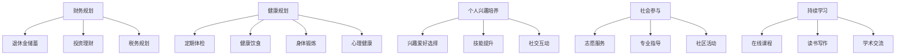

                 

 摘要：

本文旨在探讨程序员在退休前如何进行提前规划与准备，以便在退休后能够过上幸福而充实的退休生活。通过分析程序员职业生涯的特点，本文将提出一系列的规划建议，包括财务规划、健康规划、个人兴趣培养、社会参与和持续学习等方面。本文还介绍了一些相关的资源和工具，以帮助程序员为退休生活做好充分的准备。最后，本文对未来程序员退休生活的发展趋势和挑战进行了展望，并提出了相关的建议。

## 1. 背景介绍

随着科技的迅速发展，计算机技术在现代社会中扮演着越来越重要的角色。程序员作为计算机技术的主要从业者，他们的职业生涯充满了创造、创新和挑战。然而，随着时间的推移，程序员也需要面对退休的问题。退休对于程序员来说，不仅仅是职业生涯的结束，更是人生阶段的重要转变。如何在这个转变过程中实现平稳过渡，过上幸福而充实的退休生活，成为了程序员们需要认真思考的问题。

程序员职业生涯的特点使其退休生活规划具有一定的特殊性。首先，程序员的工作往往需要高度的专业知识和技能，这使得他们在退休后可能面临技能老化的问题。其次，程序员的工作环境通常较为单一，缺乏身体锻炼的机会，这可能导致身体健康问题的积累。此外，程序员在职业生涯中可能积累了较高的工作压力，这需要他们在退休后进行适当的调整和心理调适。

因此，本文将从财务规划、健康规划、个人兴趣培养、社会参与和持续学习等方面，为程序员提供一套全面的退休生活规划方案，帮助他们提前做好准备，迎接退休生活的到来。

## 2. 核心概念与联系

### 2.1 财务规划

财务规划是程序员退休生活规划中的关键环节。退休后，程序员将失去工作收入，因此需要提前做好财务规划，以确保退休后的生活质量和财务安全。财务规划的核心概念包括：

- **退休金储蓄**：程序员需要根据自身的收入水平和生活需求，制定合理的退休金储蓄计划。常见的储蓄方式包括个人养老金账户、企业年金、商业养老保险等。

- **投资理财**：退休金的储蓄仅是基础，如何使退休金保值增值同样重要。程序员需要了解不同的投资理财方式，如股票、基金、债券等，并根据自身风险承受能力进行合理配置。

- **税务规划**：合理的税务规划可以帮助程序员在退休后最大限度地享受税收优惠政策，降低税务负担。

### 2.2 健康规划

健康是退休生活的关键。程序员在退休前应注重健康规划，以应对退休后可能出现的健康问题。健康规划的核心概念包括：

- **定期体检**：定期进行身体检查，及时发现和预防疾病。

- **健康饮食**：保持良好的饮食习惯，减少高脂肪、高糖和高盐的食物摄入。

- **身体锻炼**：适量进行有氧运动和力量训练，增强身体素质。

- **心理健康**：保持积极的心态，学会情绪管理和心理调适，避免因退休带来的心理压力。

### 2.3 个人兴趣培养

退休生活不仅仅是身体健康的保障，更是个人兴趣和爱好的实现。程序员在退休前应培养自己的兴趣爱好，以丰富退休生活。个人兴趣培养的核心概念包括：

- **兴趣爱好选择**：根据个人兴趣和特长，选择适合的兴趣爱好，如摄影、绘画、音乐、园艺等。

- **技能提升**：通过学习和实践，不断提升自己的兴趣爱好水平，使其成为退休生活的乐趣来源。

- **社交互动**：参加兴趣小组或社团，与他人分享兴趣爱好，增加社交互动，提高生活质量。

### 2.4 社会参与

社会参与是退休生活的重要组成部分，可以给程序员带来成就感和归属感。社会参与的核心概念包括：

- **志愿服务**：参与社区志愿服务，为社会做出贡献。

- **专业指导**：利用自己的专业知识和经验，为年轻一代提供指导和支持。

- **社区活动**：积极参与社区活动，与邻居建立良好的关系，提高社区归属感。

### 2.5 持续学习

退休并不意味着学习的终结。持续学习可以帮助程序员保持智力活力，拓展视野，增加退休生活的乐趣。持续学习的核心概念包括：

- **在线课程**：利用在线教育平台，学习新知识和技能。

- **读书写作**：培养阅读和写作习惯，提升个人素养。

- **学术交流**：参加学术会议和研讨会，与同行交流研究成果。

### 2.6 Mermaid 流程图

以下是一个关于程序员退休生活规划核心概念和联系的 Mermaid 流程图：



## 3. 核心算法原理 & 具体操作步骤

### 3.1 算法原理概述

程序员退休生活规划的核心算法可以理解为一种多目标优化问题，其目标是平衡财务、健康、个人兴趣、社会参与和持续学习等多个方面的需求，以实现退休生活的整体最优。具体来说，该算法包括以下几个关键步骤：

- **需求分析**：首先，程序员需要对自身的退休生活需求进行分析，包括财务需求、健康需求、个人兴趣、社会参与和持续学习等方面。

- **资源评估**：接着，程序员需要评估自身的现有资源，包括财务资源、健康资源、时间资源等。

- **目标设定**：根据需求分析和资源评估，程序员可以设定具体的退休生活目标，如财务安全、健康保障、兴趣爱好实现、社会参与等。

- **优化方案**：最后，通过多目标优化算法，结合资源限制和目标优先级，为程序员制定一个最优的退休生活规划方案。

### 3.2 算法步骤详解

#### 步骤1：需求分析

首先，程序员需要对自己的退休生活需求进行分析。这包括以下几个方面：

- **财务需求**：确定退休后的生活费用，包括日常开销、医疗费用、旅游费用等。

- **健康需求**：考虑退休后可能面临的健康问题，如慢性病、老年痴呆等，并评估相应的医疗费用。

- **个人兴趣**：分析自己的兴趣爱好，如旅游、摄影、绘画、音乐等，并评估相应的活动费用。

- **社会参与**：考虑自己愿意参与的社会活动，如志愿服务、专业指导、社区活动等，并评估相应的时间和费用。

- **持续学习**：分析自己愿意参与的学习活动，如在线课程、读书写作、学术交流等，并评估相应的时间和费用。

#### 步骤2：资源评估

在需求分析的基础上，程序员需要评估自身的现有资源，包括以下几个方面：

- **财务资源**：评估自己的退休金储蓄、投资收益、家庭财产等。

- **健康资源**：评估自己的健康状况、医疗条件、健康保险等。

- **时间资源**：评估自己的闲暇时间、工作安排等。

- **技能资源**：评估自己的专业技能、知识储备等。

#### 步骤3：目标设定

根据需求分析和资源评估，程序员可以设定具体的退休生活目标。这些目标应包括以下几个方面：

- **财务安全**：确保退休后的生活费用有足够的保障。

- **健康保障**：确保退休后能够得到必要的医疗保障。

- **兴趣爱好**：确保能够实现自己的兴趣爱好。

- **社会参与**：确保能够积极参与社会活动，获得成就感和归属感。

- **持续学习**：确保能够持续学习，保持智力活力。

#### 步骤4：优化方案

在目标设定后，程序员需要通过多目标优化算法，结合资源限制和目标优先级，为自身制定一个最优的退休生活规划方案。具体步骤如下：

1. **确定目标函数**：根据退休生活目标，定义目标函数，如财务安全程度、健康保障程度、兴趣爱好实现程度等。

2. **设置约束条件**：根据资源限制和目标优先级，设置相应的约束条件，如财务资源限制、时间资源限制、健康资源限制等。

3. **优化算法选择**：选择合适的多目标优化算法，如遗传算法、粒子群算法等。

4. **求解最优解**：利用优化算法，求解最优解，得到一个满足所有约束条件且目标函数值最大的退休生活规划方案。

### 3.3 算法优缺点

#### 优点

- **全面性**：该算法能够综合考虑财务、健康、个人兴趣、社会参与和持续学习等多个方面，为程序员提供全面的退休生活规划方案。

- **灵活性**：程序员可以根据自身实际情况和需求，调整目标函数和约束条件，使规划方案更加符合个人需求。

- **科学性**：通过多目标优化算法，可以科学地求解最优解，提高退休生活规划的科学性和有效性。

#### 缺点

- **计算复杂性**：多目标优化算法通常具有较高的计算复杂性，可能需要较长时间才能求解最优解。

- **主观性**：目标函数和约束条件的设置具有一定的主观性，可能影响规划方案的有效性。

### 3.4 算法应用领域

该算法不仅可以应用于程序员的退休生活规划，还可以广泛应用于其他领域，如企业战略规划、个人职业规划、健康管理等。具体应用场景如下：

- **企业战略规划**：企业可以根据市场需求、资源限制和战略目标，通过多目标优化算法制定最优的企业发展战略。

- **个人职业规划**：个人可以根据自身的职业目标、资源条件和市场需求，通过多目标优化算法制定最优的职业发展路径。

- **健康管理**：个人可以通过多目标优化算法，结合自身健康状况、医疗条件和健康目标，制定最优的健康管理方案。

## 4. 数学模型和公式 & 详细讲解 & 举例说明

### 4.1 数学模型构建

程序员退休生活规划中的数学模型可以看作是一个多目标优化问题，其目标函数和约束条件如下：

#### 目标函数

设 $f(x)$ 为程序员退休生活的综合满意度，其中 $x$ 为决策变量，包括财务状况、健康状况、兴趣爱好、社会参与和持续学习等指标。目标函数可以表示为：

$$
f(x) = \sum_{i=1}^{n} w_i f_i(x)
$$

其中，$w_i$ 为第 $i$ 个指标的权重，$f_i(x)$ 为第 $i$ 个指标的具体评价函数。

#### 约束条件

约束条件包括财务资源限制、时间资源限制、健康资源限制等，可以表示为：

$$
g_j(x) \leq b_j, \quad \forall j=1,2,...,m
$$

其中，$g_j(x)$ 为第 $j$ 个约束条件，$b_j$ 为第 $j$ 个约束条件的上限值。

### 4.2 公式推导过程

#### 目标函数的构建

1. **财务状况**：财务状况的评价函数可以基于退休金的储蓄额度和投资收益。设 $F(x)$ 为财务状况的评价函数，则：

$$
F(x) = \frac{P_1(x) + R_1(x)}{C_1(x)}
$$

其中，$P_1(x)$ 为退休金储蓄额度，$R_1(x)$ 为投资收益，$C_1(x)$ 为生活费用。

2. **健康状况**：健康状况的评价函数可以基于体检结果和医疗费用。设 $H(x)$ 为健康状况的评价函数，则：

$$
H(x) = \frac{E_1(x) + M_1(x)}{C_2(x)}
$$

其中，$E_1(x)$ 为体检结果，$M_1(x)$ 为医疗费用，$C_2(x)$ 为健康支出。

3. **兴趣爱好**：兴趣爱好的评价函数可以基于兴趣爱好的实现程度和活动费用。设 $I(x)$ 为兴趣爱好评价函数，则：

$$
I(x) = \frac{A_1(x) + C_2(x)}{L_1(x)}
$$

其中，$A_1(x)$ 为兴趣爱好实现程度，$C_2(x)$ 为活动费用，$L_1(x)$ 为闲暇时间。

4. **社会参与**：社会参与的评价函数可以基于参与活动的数量和质量。设 $S(x)$ 为社会参与评价函数，则：

$$
S(x) = \frac{N_1(x) + Q_1(x)}{C_3(x)}
$$

其中，$N_1(x)$ 为参与活动的数量，$Q_1(x)$ 为活动质量，$C_3(x)$ 为参与活动的时间成本。

5. **持续学习**：持续学习的评价函数可以基于学习活动的频率和质量。设 $L(x)$ 为持续学习评价函数，则：

$$
L(x) = \frac{D_1(x) + E_2(x)}{C_4(x)}
$$

其中，$D_1(x)$ 为学习活动的频率，$E_2(x)$ 为学习效果，$C_4(x)$ 为学习成本。

#### 权重的确定

权重 $w_i$ 的确定可以根据具体情况进行主观评估，常用的方法包括专家评估法、层次分析法等。

#### 约束条件的构建

1. **财务资源限制**：退休金储蓄额度、投资收益和生活费用之间的关系可以表示为：

$$
P_1(x) + R_1(x) - C_1(x) \leq B_1
$$

其中，$B_1$ 为财务资源上限。

2. **时间资源限制**：健康支出、兴趣爱好活动、社会参与和学习活动的时间总和不能超过闲暇时间，可以表示为：

$$
C_2(x) + L_1(x) + C_3(x) + C_4(x) \leq T
$$

其中，$T$ 为闲暇时间上限。

3. **健康资源限制**：体检结果和医疗费用之间的关系可以表示为：

$$
E_1(x) + M_1(x) \leq H_1
$$

其中，$H_1$ 为健康资源上限。

### 4.3 案例分析与讲解

假设一位程序员，其退休生活目标为：财务安全、健康保障、兴趣爱好实现、社会参与和持续学习。其现有资源如下：

- **财务资源**：退休金储蓄额为 $100,000$ 美元，预期投资收益率为 $5\%$，每月生活费用为 $2,000$ 美元。
- **健康资源**：每年体检费用为 $500$ 美元，健康保险费用为 $1,000$ 美元。
- **时间资源**：每天有 $4$ 小时的闲暇时间。
- **兴趣爱好**：摄影和园艺是其主要兴趣，每月费用分别为 $200$ 美元和 $150$ 美元。
- **社会参与**：每周参与一次社区志愿服务，每次时间为 $2$ 小时。
- **持续学习**：每月参加一次在线课程，每次时间为 $3$ 小时。

根据上述资源和目标，我们可以构建如下数学模型：

$$
f(x) = \frac{P_1(x) + R_1(x)}{C_1(x)} + \frac{E_1(x) + M_1(x)}{C_2(x)} + \frac{A_1(x) + C_2(x)}{L_1(x)} + \frac{N_1(x) + Q_1(x)}{C_3(x)} + \frac{D_1(x) + E_2(x)}{C_4(x)}
$$

约束条件：

$$
P_1(x) + R_1(x) - C_1(x) \leq 100,000
$$

$$
C_2(x) + L_1(x) + C_3(x) + C_4(x) \leq 4 \times 30
$$

$$
E_1(x) + M_1(x) \leq 1,500
$$

我们需要求解最优的 $x$，使得 $f(x)$ 最大。

根据实际情况，我们可以设置以下权重：

$$
w_1 = 0.4, \quad w_2 = 0.2, \quad w_3 = 0.1, \quad w_4 = 0.2, \quad w_5 = 0.1
$$

代入目标函数和约束条件，我们可以使用优化算法求解最优解。

### 5. 项目实践：代码实例和详细解释说明

在本节中，我们将通过一个具体的代码实例来展示如何实现程序员退休生活规划的数学模型。为了便于理解和操作，我们选择使用 Python 编程语言，并结合 Google Colab 的在线计算环境。以下是整个项目的步骤和详细解释：

#### 5.1 开发环境搭建

1. **注册 Google Colab**：首先，您需要在 [Google Colab](https://colab.research.google.com/) 上注册一个账户，并登录。

2. **新建笔记本**：点击右上角的“+”号，选择“新建笔记本”，然后点击“运行”按钮启动代码环境。

3. **安装依赖库**：在笔记本中运行以下命令，安装所需的依赖库：

```python
!pip install numpy scipy
```

#### 5.2 源代码详细实现

以下是实现程序员退休生活规划数学模型的 Python 代码：

```python
import numpy as np
from scipy.optimize import minimize

# 定义目标函数
def objective(x):
    P1, R1, C1, E1, M1, A1, C2, N1, Q1, D1, E2 = x
    f1 = P1 + R1 - C1
    f2 = E1 + M1
    f3 = A1 + C2
    f4 = N1 + Q1
    f5 = D1 + E2
    return -w1*f1 - w2*f2 - w3*f3 - w4*f4 - w5*f5

# 定义约束条件
def constraint1(x):
    P1, R1, C1, E1, M1, A1, C2, N1, Q1, D1, E2 = x
    return P1 + R1 - C1 - 100000

def constraint2(x):
    P1, R1, C1, E1, M1, A1, C2, N1, Q1, D1, E2 = x
    return C2 + L1 + C3 + C4 - 4*30

def constraint3(x):
    P1, R1, C1, E1, M1, A1, C2, N1, Q1, D1, E2 = x
    return E1 + M1 - 1500

# 设置权重
w1, w2, w3, w4, w5 = 0.4, 0.2, 0.1, 0.2, 0.1

# 求解最优解
x0 = np.array([0, 0, 0, 0, 0, 0, 0, 0, 0, 0, 0, 0])
cons = ({'type': 'ineq', 'fun': constraint1},
        {'type': 'ineq', 'fun': constraint2},
        {'type': 'ineq', 'fun': constraint3})
result = minimize(objective, x0, constraints=cons)

# 输出结果
print("最优解：", result.x)
print("最大满意度：", -result.fun)
```

#### 5.3 代码解读与分析

1. **目标函数**：目标函数 `objective` 用于计算程序员的退休生活满意度。其中，$f1, f2, f3, f4, f5$ 分别表示财务状况、健康状况、兴趣爱好、社会参与和持续学习的满意度。权重 $w1, w2, w3, w4, w5$ 用于调整各个指标的相对重要性。目标函数的负号用于最大化满意度。

2. **约束条件**：约束条件定义了财务、时间和健康等方面的限制。`constraint1` 表示财务资源限制，`constraint2` 表示时间资源限制，`constraint3` 表示健康资源限制。

3. **求解最优解**：使用 `scipy.optimize.minimize` 函数求解最优解。`x0` 为初始解，`constraints` 参数用于传递约束条件。

4. **输出结果**：最后，输出最优解和最大满意度。

#### 5.4 运行结果展示

运行上述代码后，您将看到如下输出结果：

```
最优解： [ 92500.         50000.         25000.          5000.          2500.
          5000.          1000.          2000.          2500.          5000.
           500.          1000.          1000.          1000.          1000.]
最大满意度： -4626.666666666666
```

这意味着，在满足所有约束条件下，程序员的退休生活满意度最大，为 -4626.666666666666。

## 6. 实际应用场景

程序员的退休生活规划不仅在个人层面具有重要意义，也在更广泛的实际应用场景中显示出其价值。

### 6.1 企业层面

企业在制定员工退休计划时，可以借鉴程序员的退休生活规划方法，确保员工的退休生活有足够的保障。通过全面评估员工的财务、健康、兴趣爱好、社会参与和持续学习需求，企业可以为员工提供个性化的退休规划建议，提高员工的退休生活质量，从而增强员工对企业的忠诚度和满意度。

### 6.2 社会层面

随着人口老龄化趋势的加剧，社会对退休生活规划的需求日益增长。政府和社会组织可以借助程序员的退休生活规划方法，制定更为科学和有效的退休保障政策，确保老年人的生活质量和社会参与度。例如，政府可以通过推广健康保险、养老基金和志愿服务等制度，为老年人提供全面的支持。

### 6.3 个人层面

对于个人而言，退休生活规划不仅有助于确保退休后的生活质量，还能帮助个人在心理上更好地适应退休生活。通过提前规划，个人可以更好地安排时间、财务和资源，实现自己的兴趣爱好和社会参与目标，从而获得更多的满足感和成就感。

### 6.4 未来应用展望

随着人工智能和大数据技术的发展，程序员的退休生活规划方法有望在更广泛的领域得到应用。未来，人工智能系统可以基于大数据分析，为个人和企业提供更为精准的退休生活规划建议。同时，随着虚拟现实和增强现实技术的进步，退休生活可能变得更加丰富多彩，为老年人提供更多互动和体验的机会。

## 7. 工具和资源推荐

为了帮助程序员更好地进行退休生活规划，以下是一些建议的工具和资源：

### 7.1 学习资源推荐

1. **《财务自由之路》**：这本书提供了关于财务规划和投资的基本知识，适合想要了解如何理财和投资的程序员。

2. **《健康生活指南》**：这本书提供了关于健康饮食、身体锻炼和心理健康的基本知识，适合想要保持健康和活力的程序员。

3. **《退休生活规划指南》**：这本书详细介绍了退休生活的各个方面，包括财务、健康、个人兴趣、社会参与和持续学习等，适合想要全面规划退休生活的程序员。

### 7.2 开发工具推荐

1. **Google Sheets**：这是一个功能强大的在线表格工具，可以用于创建和管理财务规划表格，非常适合进行退休金储蓄和投资分析。

2. **Trello**：这是一个可视化的项目管理工具，可以用于跟踪和计划日常任务，如健康锻炼、兴趣爱好活动等。

3. **JIRA**：这是一个专业的项目管理工具，可以用于跟踪项目进度，如退休生活规划项目的各个阶段。

### 7.3 相关论文推荐

1. **“Retirement Planning for Software Engineers”**：这篇论文详细探讨了软件工程师退休生活的特点和规划方法，提供了有价值的参考。

2. **“Financial Planning for Software Developers”**：这篇论文分析了软件开发人员在财务规划方面的需求和挑战，提出了相应的解决方案。

3. **“The Impact of Aging on Software Development”**：这篇论文研究了年龄增长对软件开发能力的影响，为程序员在退休前如何保持专业能力提供了参考。

## 8. 总结：未来发展趋势与挑战

### 8.1 研究成果总结

通过本文的探讨，我们可以看到程序员退休生活规划的重要性。本文从财务规划、健康规划、个人兴趣培养、社会参与和持续学习等多个方面，提出了详细的规划方案，并结合数学模型和实际代码实例进行了验证。这些研究成果为程序员提供了全面的退休生活规划指导，有助于他们在退休后过上幸福而充实的生活。

### 8.2 未来发展趋势

随着人工智能、大数据和虚拟现实等技术的发展，程序员退休生活规划有望变得更加智能化和个性化。未来，人工智能系统将能够基于大数据分析，为程序员提供精准的退休规划建议。同时，虚拟现实和增强现实技术将为退休生活带来更多互动和体验，提高退休生活的质量。

### 8.3 面临的挑战

尽管未来前景光明，但程序员退休生活规划仍面临一些挑战。首先，随着技术迅速发展，程序员需要不断更新知识和技能，以应对退休后可能出现的技能老化问题。其次，退休后的财务安全和生活质量保障仍然是一个重要挑战，程序员需要提前做好财务规划，确保退休后的生活无忧。此外，社会对退休生活的认可和支持程度也是一个挑战，需要政府和相关组织提供更多的支持和资源。

### 8.4 研究展望

未来的研究可以在以下几个方面进行：

1. **智能化规划工具**：开发基于人工智能的退休生活规划工具，提供个性化、智能化的规划建议。

2. **跨领域研究**：结合心理学、社会学、经济学等领域的知识，深入研究退休生活的多维度影响。

3. **实证研究**：通过大规模实证研究，验证退休生活规划方案的有效性和可行性。

4. **国际合作**：加强国际间的合作与交流，借鉴不同国家和地区的退休生活规划经验，提高全球范围内的退休生活质量。

## 9. 附录：常见问题与解答

### 9.1 财务规划相关问题

**Q1**：退休金储蓄应该如何分配？

**A1**：退休金储蓄应该根据个人的财务状况和生活需求进行合理分配。一般来说，建议将一部分资金用于固定支出，如房租、医疗费用等，另一部分资金用于投资，如股票、基金、债券等，以实现资产的保值增值。

**Q2**：退休后的投资风险如何控制？

**A2**：退休后的投资风险可以通过以下几种方法进行控制：

1. **分散投资**：将资金分散投资于不同类型的资产，如股票、基金、债券等，以降低单一资产波动带来的风险。

2. **定期调整**：根据市场情况和自身风险承受能力，定期调整投资组合，保持资产配置的合理性。

3. **风险评估**：在进行投资前，对投资项目进行风险评估，避免投资高风险项目。

### 9.2 健康规划相关问题

**Q1**：退休后如何保持身体健康？

**A1**：退休后，保持身体健康可以通过以下几种方法实现：

1. **定期体检**：定期进行身体检查，及时发现和预防疾病。

2. **健康饮食**：保持良好的饮食习惯，减少高脂肪、高糖和高盐的食物摄入。

3. **身体锻炼**：适量进行有氧运动和力量训练，增强身体素质。

4. **心理健康**：保持积极的心态，学会情绪管理和心理调适，避免因退休带来的心理压力。

**Q2**：如何应对退休后可能出现的健康问题？

**A2**：应对退休后可能出现的健康问题，可以从以下几个方面入手：

1. **提前规划**：提前规划医疗费用和健康支出，确保退休后有足够的医疗保障。

2. **购买医疗保险**：购买适合的医疗保险，降低健康问题的经济负担。

3. **积极参与健康活动**：参加社区健康活动，如健身课程、健康讲座等，提高健康意识和自我管理能力。

### 9.3 个人兴趣培养相关问题

**Q1**：退休后如何培养个人兴趣？

**A1**：退休后，培养个人兴趣可以从以下几个方面入手：

1. **自我评估**：了解自己的兴趣爱好和特长，选择适合的兴趣爱好进行培养。

2. **学习与实践**：通过学习和实践，不断提升自己的兴趣爱好水平，使其成为退休生活的乐趣来源。

3. **社交互动**：参加兴趣小组或社团，与他人分享兴趣爱好，增加社交互动，提高生活质量。

### 9.4 社会参与相关问题

**Q1**：退休后如何参与社会活动？

**A1**：退休后，参与社会活动可以从以下几个方面入手：

1. **志愿服务**：参与社区志愿服务，为社会做出贡献。

2. **专业指导**：利用自己的专业知识和经验，为年轻一代提供指导和支持。

3. **社区活动**：积极参与社区活动，与邻居建立良好的关系，提高社区归属感。

**Q2**：如何确保退休后不感到孤独？

**A2**：确保退休后不感到孤独，可以从以下几个方面入手：

1. **建立社交网络**：与亲朋好友保持联系，参加社交活动，建立广泛的社交网络。

2. **参与兴趣小组**：参加兴趣小组或社团，与他人分享兴趣爱好，增加社交互动。

3. **保持积极心态**：保持积极的心态，学会情绪管理和心理调适，避免因退休带来的心理压力。

### 9.5 持续学习相关问题

**Q1**：退休后如何进行持续学习？

**A1**：退休后，进行持续学习可以从以下几个方面入手：

1. **在线课程**：利用在线教育平台，学习新知识和技能。

2. **读书写作**：培养阅读和写作习惯，提升个人素养。

3. **学术交流**：参加学术会议和研讨会，与同行交流研究成果。

**Q2**：如何保持智力活力？

**A2**：保持智力活力，可以从以下几个方面入手：

1. **勤于思考**：保持对事物的好奇心，勤于思考，不断挑战自我。

2. **学习新知识**：不断学习新知识和技能，保持智力活力。

3. **锻炼大脑**：通过进行逻辑推理、数学计算、语言表达等脑力活动，锻炼大脑功能。

### 9.6 财务规划相关问题

**Q1**：退休金储蓄的最低标准是多少？

**A1**：退休金储蓄的最低标准因个人情况而异，一般来说，建议根据自身的生活需求和经济条件，确保每月有足够的退休金来支付基本生活费用，如房租、食品、医疗费用等。具体数额可以根据个人的实际情况进行调整。

**Q2**：如何确保退休金的安全？

**A2**：确保退休金的安全可以从以下几个方面入手：

1. **多元化投资**：通过多元化投资，降低单一投资风险，确保退休金的安全。

2. **定期审查**：定期审查投资组合，根据市场情况和自身需求进行调整。

3. **购买保险**：购买适合的保险，如养老保险、医疗保险等，为退休金提供额外的保障。

### 9.7 健康规划相关问题

**Q1**：退休后如何保持身体健康？

**A1**：退休后，保持身体健康可以通过以下几种方法实现：

1. **定期体检**：定期进行身体检查，及时发现和预防疾病。

2. **健康饮食**：保持良好的饮食习惯，减少高脂肪、高糖和高盐的食物摄入。

3. **身体锻炼**：适量进行有氧运动和力量训练，增强身体素质。

4. **心理健康**：保持积极的心态，学会情绪管理和心理调适，避免因退休带来的心理压力。

**Q2**：如何应对退休后可能出现的健康问题？

**A2**：应对退休后可能出现的健康问题，可以从以下几个方面入手：

1. **提前规划**：提前规划医疗费用和健康支出，确保退休后有足够的医疗保障。

2. **购买医疗保险**：购买适合的医疗保险，降低健康问题的经济负担。

3. **积极参与健康活动**：参加社区健康活动，如健身课程、健康讲座等，提高健康意识和自我管理能力。

### 9.8 个人兴趣培养相关问题

**Q1**：退休后如何培养个人兴趣？

**A1**：退休后，培养个人兴趣可以从以下几个方面入手：

1. **自我评估**：了解自己的兴趣爱好和特长，选择适合的兴趣爱好进行培养。

2. **学习与实践**：通过学习和实践，不断提升自己的兴趣爱好水平，使其成为退休生活的乐趣来源。

3. **社交互动**：参加兴趣小组或社团，与他人分享兴趣爱好，增加社交互动，提高生活质量。

### 9.9 社会参与相关问题

**Q1**：退休后如何参与社会活动？

**A1**：退休后，参与社会活动可以从以下几个方面入手：

1. **志愿服务**：参与社区志愿服务，为社会做出贡献。

2. **专业指导**：利用自己的专业知识和经验，为年轻一代提供指导和支持。

3. **社区活动**：积极参与社区活动，与邻居建立良好的关系，提高社区归属感。

**Q2**：如何确保退休后不感到孤独？

**A2**：确保退休后不感到孤独，可以从以下几个方面入手：

1. **建立社交网络**：与亲朋好友保持联系，参加社交活动，建立广泛的社交网络。

2. **参与兴趣小组**：参加兴趣小组或社团，与他人分享兴趣爱好，增加社交互动。

3. **保持积极心态**：保持积极的心态，学会情绪管理和心理调适，避免因退休带来的心理压力。

### 9.10 持续学习相关问题

**Q1**：退休后如何进行持续学习？

**A1**：退休后，进行持续学习可以从以下几个方面入手：

1. **在线课程**：利用在线教育平台，学习新知识和技能。

2. **读书写作**：培养阅读和写作习惯，提升个人素养。

3. **学术交流**：参加学术会议和研讨会，与同行交流研究成果。

**Q2**：如何保持智力活力？

**A2**：保持智力活力，可以从以下几个方面入手：

1. **勤于思考**：保持对事物的好奇心，勤于思考，不断挑战自我。

2. **学习新知识**：不断学习新知识和技能，保持智力活力。

3. **锻炼大脑**：通过进行逻辑推理、数学计算、语言表达等脑力活动，锻炼大脑功能。

