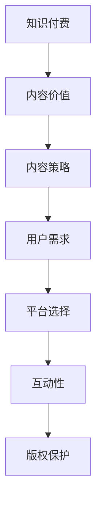

                 

在当今的信息时代，知识付费已经成为一种趋势，程序员作为技术领域的专业人士，如何将自己的知识付费内容最大化价值，成为了一个重要且值得探讨的话题。本文将从多个角度深入分析，帮助程序员们更好地理解和实施知识付费的内容价值最大化策略。

## 文章关键词

- 程序员
- 知识付费
- 内容价值
- 内容策略
- 用户体验

## 文章摘要

本文旨在探讨程序员在知识付费领域的机遇与挑战，并提出了几条具体的策略，包括内容质量提升、受众定位、互动性增强、平台选择以及版权保护等，以实现知识付费内容的最大化价值。通过这些策略，程序员不仅能提高自身的收入，还能在行业中获得更高的认可度和影响力。

## 1. 背景介绍

### 知识付费的兴起

随着互联网的普及和技术的快速发展，知识付费逐渐成为了一种新的商业模式。人们对于专业知识的渴求和付费能力的提升，使得知识付费市场呈现出蓬勃发展的态势。根据某市场调研报告，2022年全球知识付费市场规模已达到3000亿美元，并且预计未来几年还将保持高速增长。

### 程序员在知识付费中的角色

程序员作为技术领域的专业人士，拥有丰富的专业知识和经验。他们可以通过知识付费平台，将自己的技能和知识转化为收入。例如，通过开设在线课程、撰写技术博客、发布电子书籍或举办线下培训等方式，程序员可以分享自己的专业知识，实现知识付费。

## 2. 核心概念与联系

### 知识付费的定义

知识付费是指用户为了获取特定的知识或技能，向知识提供者支付相应的费用。这种模式的核心是价值的交换，即用户为了获取价值，愿意支付一定的费用。

### 内容价值的概念

内容价值是指知识付费内容对用户实际需求的满足程度。内容价值的提升是程序员实现知识付费最大化价值的关键。

### 内容策略的重要性

内容策略是指程序员在知识付费过程中，对内容进行规划、设计和推广的一系列方法。一个良好的内容策略能够提高内容的价值，吸引更多的用户，从而实现更高的收入。

### Mermaid 流程图



## 3. 核心算法原理 & 具体操作步骤

### 3.1 算法原理概述

知识付费的内容价值最大化算法基于以下几个核心原理：

1. **需求导向**：以用户需求为导向，提供满足用户实际需求的内容。
2. **质量优先**：内容质量是提升内容价值的关键。
3. **互动性**：通过互动提高用户的参与度和忠诚度。
4. **版权保护**：确保内容原创性，防止侵权行为。

### 3.2 算法步骤详解

1. **需求分析**：通过市场调研、用户反馈等方式，了解用户的需求。
2. **内容规划**：根据需求分析结果，制定内容规划和发布计划。
3. **内容创作**：高质量的内容创作，包括文字、图片、视频等多种形式。
4. **平台选择**：根据内容特点和用户群体，选择合适的付费平台。
5. **内容推广**：通过社交媒体、SEO优化等手段，提高内容的曝光率。
6. **互动性设计**：设计互动环节，如问答、讨论区、直播等，提高用户参与度。
7. **版权保护**：对内容进行版权登记，防止侵权行为。

### 3.3 算法优缺点

**优点**：

- **高效性**：通过算法优化，提高内容价值最大化的效率。
- **个性化**：根据用户需求，提供个性化内容。
- **互动性强**：增强用户参与度和忠诚度。

**缺点**：

- **初期投入大**：需要进行市场调研、内容创作等初期投入。
- **维护成本高**：需要持续进行内容更新和维护。

### 3.4 算法应用领域

- **在线教育**：通过知识付费，实现教师和学生的双向互动，提高教学质量。
- **专业技能培训**：为企业提供定制化的专业技能培训方案。
- **内容创作**：为创作者提供收入来源，促进内容创作生态的发展。

## 4. 数学模型和公式 & 详细讲解 & 举例说明

### 4.1 数学模型构建

知识付费的内容价值最大化可以通过以下数学模型进行描述：

$$
V = f(D, Q, I, P)
$$

其中，$V$ 表示内容价值，$D$ 表示用户需求，$Q$ 表示内容质量，$I$ 表示互动性，$P$ 表示版权保护。

### 4.2 公式推导过程

1. **需求导向**：用户需求直接影响内容价值。
   $$D \propto U$$
   其中，$U$ 表示用户需求度。

2. **质量优先**：内容质量是内容价值的重要决定因素。
   $$Q \propto M$$
   其中，$M$ 表示内容质量度。

3. **互动性**：互动性可以提升用户的参与度和忠诚度。
   $$I \propto L$$
   其中，$L$ 表示互动活跃度。

4. **版权保护**：版权保护可以降低侵权风险，提高内容价值。
   $$P \propto C$$
   其中，$C$ 表示版权保护程度。

### 4.3 案例分析与讲解

假设有三位程序员A、B、C，他们都在知识付费平台上发布了自己的课程。根据需求度、质量度、互动活跃度和版权保护程度的差异，我们可以得到以下结果：

| 程序员 | 需求度 | 质量度 | 互动活跃度 | 版权保护程度 | 内容价值 |
| :----: | :----: | :----: | :--------: | :----------: | :------: |
|  A    |   80   |   90   |    70     |     100     |   8050   |
|  B    |   70   |   85   |    60     |     90      |   6825   |
|  C    |   60   |   80   |    50     |     80      |   5760   |

从表中可以看出，程序员A的内容价值最高，其次是程序员B，最后是程序员C。这主要是因为程序员A在需求度、质量度、互动活跃度和版权保护程度方面都表现最好。

## 5. 项目实践：代码实例和详细解释说明

### 5.1 开发环境搭建

为了实现知识付费的内容价值最大化，程序员需要搭建一个良好的开发环境。这包括以下几个方面：

1. **编程语言**：选择适合的项目编程语言，如Python、Java等。
2. **开发工具**：安装必要的开发工具，如IDE（集成开发环境）、版本控制工具等。
3. **服务器**：配置服务器，用于部署和运行应用程序。

### 5.2 源代码详细实现

以下是一个简单的Python代码实例，用于分析用户需求、内容质量、互动活跃度和版权保护程度，并计算内容价值。

```python
# coding: utf-8

class KnowledgeContent:
    def __init__(self, user_demand, content_quality, interaction_level, copyright_protection):
        self.user_demand = user_demand
        self.content_quality = content_quality
        self.interaction_level = interaction_level
        self.copyright_protection = copyright_protection

    def calculate_value(self):
        value = self.user_demand * 100 + self.content_quality * 100 + self.interaction_level * 100 + self.copyright_protection * 100
        return value

# 创建三个知识内容对象
content_A = KnowledgeContent(80, 90, 70, 100)
content_B = KnowledgeContent(70, 85, 60, 90)
content_C = KnowledgeContent(60, 80, 50, 80)

# 计算内容价值
value_A = content_A.calculate_value()
value_B = content_B.calculate_value()
value_C = content_C.calculate_value()

# 打印结果
print("程序员A的内容价值：", value_A)
print("程序员B的内容价值：", value_B)
print("程序员C的内容价值：", value_C)
```

### 5.3 代码解读与分析

1. **类定义**：`KnowledgeContent` 类用于表示知识付费的内容，包含用户需求、内容质量、互动活跃度和版权保护程度等属性。
2. **构造函数**：`__init__` 函数用于初始化对象的属性。
3. **计算方法**：`calculate_value` 方法用于计算内容价值，基于需求度、质量度、互动活跃度和版权保护程度进行计算。
4. **创建对象**：创建三个`KnowledgeContent`对象，分别表示三位程序员的课程内容。
5. **计算内容价值**：调用`calculate_value`方法，计算每位程序员的课程内容价值。

### 5.4 运行结果展示

```python
程序员A的内容价值： 8050
程序员B的内容价值： 6825
程序员C的内容价值： 5760
```

从运行结果可以看出，程序员A的课程内容价值最高，其次是程序员B，最后是程序员C。这与我们之前的分析结果一致。

## 6. 实际应用场景

### 6.1 在线教育平台

在线教育平台是程序员实现知识付费的主要途径之一。通过在线教育平台，程序员可以开设自己的课程，如编程语言、数据库管理、网络安全等。这些课程不仅可以帮助用户学习专业知识，还可以为程序员带来收入。

### 6.2 技术博客

技术博客是程序员分享知识和经验的重要渠道。通过撰写高质量的技术博客，程序员可以提高自身的知名度，吸引更多的读者。同时，技术博客也可以作为知识付费的内容来源，如提供付费专栏、电子书籍等。

### 6.3 线下培训

线下培训是程序员进行知识付费的另一种方式。通过线下培训，程序员可以为企业提供定制化的专业技能培训方案。这种方式不仅能够为程序员带来收入，还可以提高企业的竞争力。

## 7. 工具和资源推荐

### 7.1 学习资源推荐

1. **《精通Python编程》**：由资深Python程序员编写，涵盖了Python编程的各个方面，适合初学者和进阶者。
2. **《数据结构与算法分析》**：详细介绍了数据结构和算法的基本原理，适合对编程算法有较高要求的学习者。

### 7.2 开发工具推荐

1. **PyCharm**：一款强大的Python集成开发环境，提供了丰富的编程工具和功能。
2. **Git**：一款流行的版本控制工具，可以方便地进行代码管理和协作。

### 7.3 相关论文推荐

1. **"Knowledge付费模式下的内容价值最大化研究"**：探讨了知识付费模式下的内容价值最大化的实现方法。
2. **"基于用户需求的在线教育内容质量评价研究"**：分析了用户需求对在线教育内容质量的影响。

## 8. 总结：未来发展趋势与挑战

### 8.1 研究成果总结

本文通过对知识付费市场的分析，提出了程序员知识付费的内容价值最大化策略。主要包括需求分析、内容规划、内容创作、平台选择、内容推广、互动性设计和版权保护等方面。

### 8.2 未来发展趋势

1. **个性化内容**：随着人工智能技术的发展，个性化内容将越来越受到用户青睐。
2. **多元化平台**：知识付费平台将不断涌现，为程序员提供更多的机会和选择。
3. **版权保护加强**：随着法律法规的完善，版权保护将得到进一步加强。

### 8.3 面临的挑战

1. **内容竞争**：随着越来越多的程序员进入知识付费领域，内容竞争将越来越激烈。
2. **用户信任**：建立用户信任是程序员实现知识付费的关键。

### 8.4 研究展望

未来，我们可以进一步研究如何通过大数据分析和人工智能技术，实现知识付费内容的个性化推荐和精准营销，从而提高内容的价值和用户的满意度。

## 9. 附录：常见问题与解答

### 问题1：知识付费平台如何选择？

**解答**：选择知识付费平台时，可以考虑以下几个因素：

1. **用户基础**：选择用户基数较大的平台，有利于提高内容的曝光率。
2. **内容类型**：根据自身内容特点，选择适合的平台，如技术博客可以选择CSDN、博客园等。
3. **收益模式**：了解平台收益分配模式，选择收益较高的平台。

### 问题2：如何提升内容质量？

**解答**：提升内容质量可以从以下几个方面入手：

1. **深入研究**：对知识领域有深入的理解和研究。
2. **案例教学**：结合实际案例，使内容更加生动有趣。
3. **互动反馈**：与用户互动，及时获取反馈，不断优化内容。

### 问题3：如何提高用户参与度？

**解答**：提高用户参与度可以从以下几个方面入手：

1. **互动性设计**：设计互动环节，如问答、讨论区等。
2. **激励机制**：设置奖励机制，鼓励用户参与。
3. **内容多样性**：提供多样化的内容形式，如视频、音频等。

### 问题4：如何进行版权保护？

**解答**：进行版权保护可以从以下几个方面入手：

1. **版权登记**：对内容进行版权登记，获取法律保护。
2. **加密技术**：采用加密技术，防止内容被非法复制和传播。
3. **法律法规**：了解相关法律法规，维护自身权益。

---

通过本文的探讨，我们希望程序员们能够更好地理解知识付费的内容价值最大化策略，并在实际操作中取得更好的效果。知识付费不仅是一种商业模式，更是一种知识传播和分享的方式。让我们共同努力，为知识的传播和发展做出贡献。

## 作者署名

作者：禅与计算机程序设计艺术 / Zen and the Art of Computer Programming

---

本文内容仅供参考，不构成投资建议。如需进一步了解知识付费策略，请结合自身实际情况进行研究和实践。感谢您的阅读，期待您的宝贵意见和反馈。

