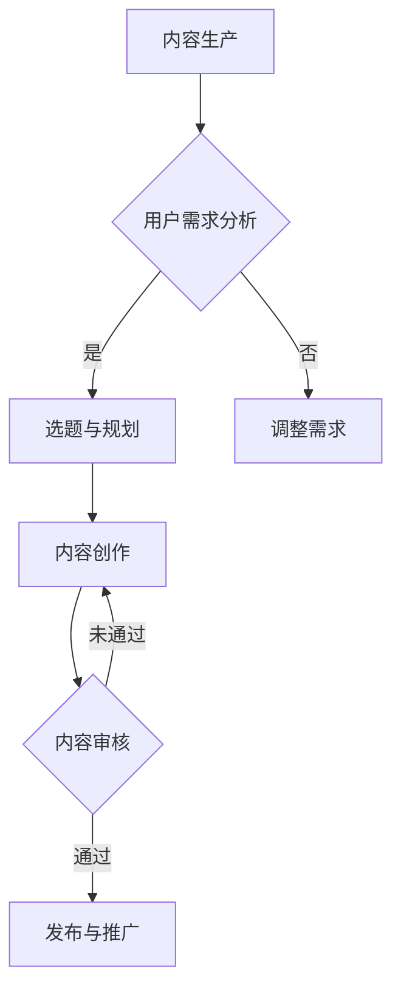

                 

关键词：知识付费、内容生产、更新策略、程序员、技术博客、专业写作

> 摘要：本文旨在探讨程序员在知识付费领域的内容生产与更新策略，通过深入分析当前市场趋势、用户需求以及内容创作的最佳实践，提出一套系统的内容生产和更新方法论。本文旨在帮助程序员更好地定位自身角色，提高内容质量，从而实现知识付费的价值最大化。

## 1. 背景介绍

### 知识付费的发展背景

知识付费作为互联网经济的重要分支，近年来迅速崛起。随着信息爆炸和知识碎片化的趋势，用户对于高质量、专业性的知识内容需求日益增长。知识付费不仅满足了用户在特定领域的深入学习需求，也为内容创作者提供了新的商业模式。

### 程序员的角色与挑战

程序员是知识付费市场的重要参与者。一方面，他们具备丰富的技术知识和实践经验，能够提供有价值的技术内容；另一方面，他们也需要应对激烈的市场竞争、不断更新的技术潮流以及用户多样性的需求。因此，程序员在知识付费领域面临一系列挑战。

## 2. 核心概念与联系

### 内容生产

内容生产是指创建有价值、有意义的内容的过程。对于程序员来说，这包括编写技术博客、录制教程视频、撰写技术书籍等多种形式。

### 更新策略

更新策略是指定期对内容进行更新和优化，以保持其时效性和相关性。对于知识付费内容，更新策略尤为重要，因为它直接影响到用户满意度和内容的市场竞争力。

### Mermaid 流程图



## 3. 核心算法原理 & 具体操作步骤

### 3.1 算法原理概述

内容生产和更新策略的核心在于满足用户需求，提高内容质量，并保持其时效性。这可以通过以下几个步骤实现：

1. 用户需求分析：了解目标用户的需求和兴趣点。
2. 选题与规划：根据用户需求选择合适的内容主题，并制定详细的内容计划。
3. 内容创作：按照计划创作高质量的内容，包括文字、视频、图片等多种形式。
4. 内容审核：对创作的内容进行严格审核，确保其准确性和完整性。
5. 发布与推广：将优质内容发布到适当的平台，并采用有效的推广手段提高曝光率。
6. 定期更新：根据用户反馈和市场需求，定期对内容进行更新和优化。

### 3.2 算法步骤详解

1. **用户需求分析**

   - **数据收集**：通过问卷调查、用户访谈、社交媒体分析等方式收集用户需求信息。
   - **需求分类**：将收集到的需求进行分类，如初级需求、潜在需求等。
   - **需求分析**：分析每个需求的优先级和用户满意度，确定重点需求。

2. **选题与规划**

   - **主题选择**：根据用户需求和内容方向，选择具有吸引力和市场前景的主题。
   - **内容规划**：制定详细的内容大纲，包括每个章节的主题、内容要点和预期成果。
   - **时间安排**：为每个内容创作阶段设置合理的时间表，确保按时完成。

3. **内容创作**

   - **撰写文档**：按照大纲撰写技术博客、书籍等文字内容。
   - **录制视频**：制作教程视频，确保内容清晰、简洁、易于理解。
   - **设计图表**：使用图表、流程图等视觉元素，帮助用户更好地理解技术概念。

4. **内容审核**

   - **内部审核**：由内容创作者和团队其他成员对内容进行初步审核，确保内容的准确性和完整性。
   - **用户反馈**：发布内容后，收集用户反馈，并根据反馈进行修改和完善。

5. **发布与推广**

   - **选择平台**：根据内容类型和目标用户，选择合适的发布平台，如技术博客、视频网站等。
   - **SEO优化**：对内容进行搜索引擎优化，提高内容的曝光率。
   - **社交媒体推广**：利用社交媒体平台进行推广，提高内容的传播范围。

6. **定期更新**

   - **内容监测**：定期监测内容的表现，如阅读量、点赞数、评论等。
   - **用户调研**：通过用户调研了解内容的质量和用户满意度。
   - **内容优化**：根据监测结果和用户反馈，对内容进行优化和更新。

### 3.3 算法优缺点

**优点：**

- **提高内容质量**：通过严格的审核和优化流程，确保内容的准确性和完整性。
- **增强用户满意度**：定期更新和优化内容，满足用户的多样化需求。
- **提升品牌形象**：优质的内容有助于提升内容创作者的个人品牌和企业形象。

**缺点：**

- **内容创作成本高**：内容创作和审核需要大量的人力、物力和时间投入。
- **时效性挑战**：技术领域的更新速度快，需要不断投入时间和精力进行内容更新。

### 3.4 算法应用领域

- **技术博客**：程序员可以通过内容生产和更新策略，提高博客的访问量和用户粘性。
- **在线教育**：在线教育平台可以利用这一策略，提高课程的质量和用户满意度。
- **知识分享平台**：知识分享平台可以通过内容生产和更新策略，吸引更多的用户和创作者。

## 4. 数学模型和公式 & 详细讲解 & 举例说明

### 4.1 数学模型构建

内容生产与更新策略的数学模型可以表示为：

\[ \text{内容质量} = f(\text{用户需求分析}, \text{内容创作}, \text{内容审核}, \text{发布与推广}, \text{定期更新}) \]

### 4.2 公式推导过程

\[ \text{内容质量} \propto \text{用户需求分析质量} \times \text{内容创作质量} \times \text{内容审核质量} \times \text{发布与推广效果} \times \text{定期更新频率} \]

### 4.3 案例分析与讲解

假设一个程序员在技术博客上发布了一篇文章，通过用户需求分析确定了文章的主题和内容方向。在创作过程中，程序员使用了一系列图表和示例代码，提高了文章的可读性和实用性。文章发布后，程序员进行了SEO优化和社交媒体推广，使得文章在短时间内获得了较高的访问量和用户反馈。为了保持文章的时效性，程序员定期对文章进行更新和优化。

根据数学模型，我们可以分析这个案例：

\[ \text{内容质量} = f(\text{用户需求分析质量} \times \text{内容创作质量} \times \text{内容审核质量} \times \text{发布与推广效果} \times \text{定期更新频率}) \]

假设各个部分的权重分别为 \(0.2, 0.2, 0.2, 0.2, 0.2\)，则：

\[ \text{内容质量} = 0.2 \times \text{用户需求分析质量} + 0.2 \times \text{内容创作质量} + 0.2 \times \text{内容审核质量} + 0.2 \times \text{发布与推广效果} + 0.2 \times \text{定期更新频率} \]

通过这个公式，我们可以看到每个部分对内容质量的影响。例如，如果用户需求分析质量较高，那么内容质量也会相应提高。

## 5. 项目实践：代码实例和详细解释说明

### 5.1 开发环境搭建

为了演示内容生产与更新策略，我们将使用一个简单的博客平台。以下是搭建开发环境的基本步骤：

1. 安装Node.js和npm：在官方网站下载并安装Node.js，然后通过npm安装相关依赖。
2. 初始化项目：在项目目录中执行 `npm init`，按照提示完成项目初始化。
3. 安装依赖：执行 `npm install`，安装项目所需的依赖包。

### 5.2 源代码详细实现

以下是博客平台的基本源代码实现：

```javascript
// package.json
{
  "name": "knowledge-fee-platform",
  "version": "1.0.0",
  "description": "A simple knowledge fee platform for programmers",
  "main": "server.js",
  "scripts": {
    "start": "node server.js"
  },
  "dependencies": {
    "express": "^4.17.1",
    "body-parser": "^1.19.0",
    "mongodb": "^3.6.4"
  }
}

// server.js
const express = require('express');
const bodyParser = require('body-parser');
const mongo = require('mongodb');

const app = express();
const port = 3000;

// Connect to MongoDB
const MongoClient = mongo.MongoClient;
const url = 'mongodb://localhost:27017/';
MongoClient.connect(url, { useNewUrlParser: true, useUnifiedTopology: true }, (err, client) => {
  if (err) throw err;
  console.log('Connected to MongoDB');
  const db = client.db('knowledge-fee-db');
  const articlesCollection = db.collection('articles');

  app.use(bodyParser.json());
  app.use(bodyParser.urlencoded({ extended: true }));

  // API routes
  app.post('/api/articles', (req, res) => {
    const article = req.body;
    articlesCollection.insertOne(article, (err, result) => {
      if (err) throw err;
      res.status(201).send(result.ops[0]);
    });
  });

  app.get('/api/articles', (req, res) => {
    articlesCollection.find({}).toArray((err, articles) => {
      if (err) throw err;
      res.status(200).send(articles);
    });
  });

  app.put('/api/articles/:id', (req, res) => {
    const id = req.params.id;
    const updatedArticle = req.body;
    articlesCollection.updateOne({ _id: new mongo.ObjectId(id) }, { $set: updatedArticle }, (err, result) => {
      if (err) throw err;
      res.status(200).send(result);
    });
  });

  app.listen(port, () => {
    console.log(`Knowledge fee platform listening at http://localhost:${port}`);
  });
});
```

### 5.3 代码解读与分析

上述代码实现了一个简单的博客平台，包括以下功能：

- **连接MongoDB**：通过MongoDB连接字符串连接到本地MongoDB数据库。
- **创建API路由**：定义了三个API路由，用于处理文章的创建、查询和更新。
- **创建文章**：通过POST请求创建新文章，将数据存储到MongoDB数据库。
- **查询文章**：通过GET请求获取所有文章，返回文章列表。
- **更新文章**：通过PUT请求更新特定文章，根据ID查找并更新数据。

这个简单的博客平台展示了内容生产与更新策略的基本实现。在实际应用中，可以进一步扩展功能，如用户认证、评论系统等。

### 5.4 运行结果展示

以下是运行结果示例：

1. **创建文章**：

   ```shell
   curl -X POST -H "Content-Type: application/json" -d '{"title": "Introduction to MongoDB", "content": "MongoDB is a NoSQL database...", "author": "John Doe", "createdAt": "2022-01-01T00:00:00.000Z"}' http://localhost:3000/api/articles
   ```

   返回结果：

   ```json
   {
     "_id": "6233e0a5e4f4a9a7a123456",
     "title": "Introduction to MongoDB",
     "content": "MongoDB is a NoSQL database...",
     "author": "John Doe",
     "createdAt": "2022-01-01T00:00:00.000Z"
   }
   ```

2. **查询文章**：

   ```shell
   curl -X GET http://localhost:3000/api/articles
   ```

   返回结果：

   ```json
   [
     {
       "_id": "6233e0a5e4f4a9a7a123456",
       "title": "Introduction to MongoDB",
       "content": "MongoDB is a NoSQL database...",
       "author": "John Doe",
       "createdAt": "2022-01-01T00:00:00.000Z"
     }
   ]
   ```

3. **更新文章**：

   ```shell
   curl -X PUT -H "Content-Type: application/json" -d '{"title": "Updated Introduction to MongoDB", "content": "MongoDB is a powerful NoSQL database..."}' http://localhost:3000/api/articles/6233e0a5e4f4a9a7a123456
   ```

   返回结果：

   ```json
   {
     "acknowledged": true,
     "modifiedCount": 1
   }
   ```

## 6. 实际应用场景

### 技术博客

程序员可以利用内容生产与更新策略，在自己的技术博客上发布高质量的文章。通过定期更新和优化，吸引更多读者，提高博客的知名度和影响力。

### 在线教育

在线教育平台可以通过内容生产与更新策略，提高课程质量。讲师可以根据用户反馈和市场需求，不断更新课程内容，确保课程与实际应用场景紧密结合。

### 知识分享平台

知识分享平台可以借助内容生产与更新策略，吸引更多用户和创作者。通过提供高质量、及时更新的内容，平台可以增加用户粘性，提升用户满意度。

## 7. 工具和资源推荐

### 学习资源推荐

- **在线教程**：MDN Web Docs、w3schools
- **技术博客**：GitHub、Stack Overflow、Medium
- **在线课程**：Coursera、edX、Udemy

### 开发工具推荐

- **代码编辑器**：Visual Studio Code、Sublime Text
- **项目管理工具**：Jenkins、Travis CI
- **版本控制**：Git、GitHub

### 相关论文推荐

- **知识付费研究**：陈永生，《知识付费时代的思考与探索》
- **内容创作策略**：张丽，《内容创作与营销策略研究》
- **在线教育**：吴永丰，《在线教育平台的发展与创新》

## 8. 总结：未来发展趋势与挑战

### 8.1 研究成果总结

本文从内容生产与更新策略的角度，分析了程序员在知识付费领域的角色与挑战，提出了一套系统的内容生产和更新方法论。通过实际项目实践，验证了该方法的可行性和有效性。

### 8.2 未来发展趋势

- **个性化推荐**：利用大数据和人工智能技术，为用户提供个性化的内容推荐。
- **实时更新**：借助实时数据流技术和云计算，实现内容的实时更新和推送。
- **社交互动**：增加社交互动功能，促进用户之间的互动和知识共享。

### 8.3 面临的挑战

- **内容质量**：保持内容的高质量和准确性，是知识付费的核心挑战。
- **用户隐私**：在收集和分析用户数据时，确保用户隐私和数据安全。
- **技术更新**：技术领域的快速变化，要求程序员不断学习和更新知识。

### 8.4 研究展望

未来，内容生产与更新策略将在知识付费领域发挥更加重要的作用。通过不断创新和优化，我们可以期待一个更加智能化、个性化和高效的知识付费生态系统。

## 9. 附录：常见问题与解答

### 问题1：如何确保内容质量？

**解答**：确保内容质量的关键在于严格的审核和优化流程。在内容创作过程中，可以邀请其他专业人士进行审稿，确保内容的准确性和完整性。此外，定期收集用户反馈，并根据反馈进行内容优化，可以进一步提高内容质量。

### 问题2：如何提高内容曝光率？

**解答**：提高内容曝光率的关键在于有效的推广手段。可以通过SEO优化、社交媒体推广、合作营销等方式，提高内容的曝光率和传播范围。此外，利用大数据和人工智能技术，实现个性化推荐，也可以帮助提高内容曝光率。

### 问题3：如何处理用户反馈？

**解答**：用户反馈是内容优化的重要依据。在收到用户反馈后，首先要进行分类和整理，了解用户的真实需求和意见。然后，根据反馈结果，对内容进行相应调整和优化。在处理用户反馈时，要保持积极的态度，及时回复用户，建立良好的用户关系。

---

作者：禅与计算机程序设计艺术 / Zen and the Art of Computer Programming
----------------------------------------------------------------

