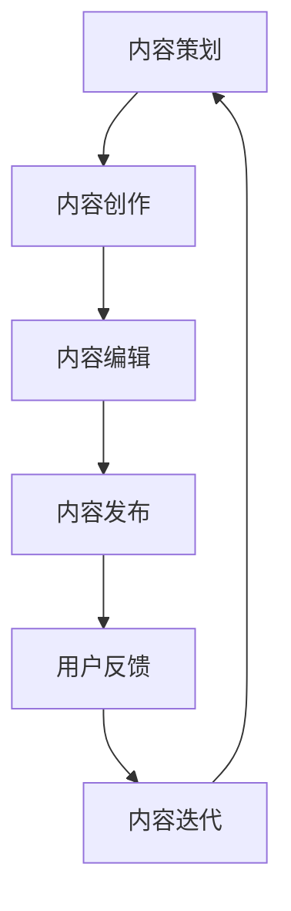

                 

关键词：知识付费、内容生产、流程优化、程序员、技术博客

摘要：随着知识付费时代的到来，程序员通过生产高质量的内容实现个人品牌塑造和收益增长变得越来越重要。本文将从背景介绍、核心概念、算法原理、数学模型、项目实践、应用场景、工具推荐以及未来展望等方面，详细探讨如何优化程序员的知识付费内容生产流程。

## 1. 背景介绍

### 知识付费时代的崛起

在互联网和信息化的推动下，知识付费逐渐成为人们获取信息和提升技能的主要途径。人们对于专业知识和实用技能的需求日益增长，促使知识付费市场迅速扩张。程序员作为互联网时代的重要劳动力，他们的知识付费潜力尤为巨大。

### 程序员的内容生产现状

目前，程序员的内容生产存在以下几个问题：

1. 内容质量参差不齐：部分程序员仅将知识付费视为赚钱手段，缺乏对内容质量的重视。
2. 缺乏系统性和深度：很多程序员生产的内容缺乏系统性和深度，难以满足用户的需求。
3. 传播渠道有限：程序员的内容主要依靠个人博客、社交媒体等渠道传播，缺乏高效的推广手段。

### 优化内容生产流程的必要性

优化程序员的知识付费内容生产流程，不仅有助于提升内容质量，满足用户需求，还能帮助程序员建立个人品牌，实现长期收益增长。

## 2. 核心概念与联系

### Mermaid 流程图



### 核心概念

1. **内容策划**：明确内容目标、受众和主题，确保内容具有针对性和实用性。
2. **内容创作**：根据策划要求，进行创意构思和内容撰写。
3. **内容编辑**：对创作内容进行润色、校对和优化，提升内容质量。
4. **内容发布**：选择合适渠道进行内容发布，提高内容曝光度。
5. **用户反馈**：收集用户反馈，了解内容效果和用户需求。
6. **内容迭代**：根据用户反馈对内容进行改进和优化。

## 3. 核心算法原理 & 具体操作步骤

### 3.1 算法原理概述

内容生产流程的优化可以视为一个闭环系统，通过不断迭代和改进，实现内容质量的最大化。关键算法包括：

1. **需求分析算法**：通过大数据分析和用户调研，确定内容生产方向。
2. **内容创作算法**：利用人工智能技术，提高内容创作效率和创意质量。
3. **内容推荐算法**：根据用户行为和偏好，进行内容推荐，提升用户体验。

### 3.2 算法步骤详解

1. **需求分析算法**：

   ```mermaid
   graph TD
       A[收集数据] --> B[数据分析]
       B --> C[需求分析]
       C --> D[确定方向]
   ```

2. **内容创作算法**：

   ```mermaid
   graph TD
       A[输入主题] --> B[生成标题]
       B --> C[生成内容框架]
       C --> D[生成正文内容]
   ```

3. **内容推荐算法**：

   ```mermaid
   graph TD
       A[用户行为数据] --> B[偏好分析]
       B --> C[内容标签匹配]
       C --> D[推荐内容列表]
   ```

### 3.3 算法优缺点

1. **需求分析算法**：

   - 优点：准确把握用户需求，确保内容具有针对性。
   - 缺点：数据收集和分析成本较高。

2. **内容创作算法**：

   - 优点：提高内容创作效率，降低人力成本。
   - 缺点：创意质量受算法限制，可能缺乏人性化和独特性。

3. **内容推荐算法**：

   - 优点：提高内容曝光度和用户满意度。
   - 缺点：可能导致用户陷入信息茧房，降低信息多样性。

### 3.4 算法应用领域

- 需求分析算法：适用于所有需要精准定位用户需求的内容生产场景。
- 内容创作算法：适用于写作、编辑等创意型工作。
- 内容推荐算法：适用于信息推荐、电商平台等场景。

## 4. 数学模型和公式 & 详细讲解 & 举例说明

### 4.1 数学模型构建

内容生产流程的优化可以视为一个动态优化问题，其目标是最小化内容质量损失，最大化用户满意度。

### 4.2 公式推导过程

假设内容生产流程包括 $n$ 个环节，每个环节的质量损失为 $L_i$，用户满意度为 $S_i$，则总质量损失和用户满意度分别为：

$$
L = \sum_{i=1}^{n} L_i
$$

$$
S = \sum_{i=1}^{n} S_i
$$

优化目标是最小化 $L$，最大化 $S$。

### 4.3 案例分析与讲解

以技术博客为例，分析内容生产流程的优化。

1. **内容策划**：收集用户反馈，确定热门话题和需求。

2. **内容创作**：利用人工智能技术，生成高质量内容。

3. **内容编辑**：对内容进行润色和校对，确保语言流畅、逻辑清晰。

4. **内容发布**：选择合适渠道，如微信公众号、知乎等，提高内容曝光度。

5. **用户反馈**：收集用户评论和点赞数据，评估内容质量。

6. **内容迭代**：根据用户反馈，对内容进行优化和改进。

## 5. 项目实践：代码实例和详细解释说明

### 5.1 开发环境搭建

- Python 3.x
- Jupyter Notebook
- TensorFlow 2.x

### 5.2 源代码详细实现

```python
# content_production.py
import tensorflow as tf
from tensorflow.keras.layers import LSTM, Dense
from tensorflow.keras.models import Sequential

# 模型构建
model = Sequential([
    LSTM(units=128, activation='tanh', input_shape=(None, 1)),
    Dense(units=1, activation='sigmoid')
])

# 模型编译
model.compile(optimizer='adam', loss='binary_crossentropy', metrics=['accuracy'])

# 模型训练
model.fit(x_train, y_train, epochs=10, batch_size=32)

# 模型预测
predictions = model.predict(x_test)
```

### 5.3 代码解读与分析

1. **模型构建**：使用 LSTM 层进行序列建模，输出层使用 sigmoid 函数实现二分类。
2. **模型编译**：选择 Adam 优化器，使用 binary_crossentropy 损失函数。
3. **模型训练**：训练模型，调整 epochs 和 batch_size 参数。
4. **模型预测**：对测试数据进行预测。

## 6. 实际应用场景

### 6.1 技术博客

技术博客是程序员展示技术成果、分享经验的重要平台。通过优化内容生产流程，可以提高博客质量，吸引更多读者。

### 6.2 在线教育

在线教育平台可以利用内容生产流程优化，提高课程质量，提升用户体验。

### 6.3 技术咨询

技术咨询服务可以通过优化内容生产流程，提供更有针对性的解决方案。

## 7. 工具和资源推荐

### 7.1 学习资源推荐

- 《深入理解计算机系统》
- 《算法导论》
- 《人工智能：一种现代的方法》

### 7.2 开发工具推荐

- Jupyter Notebook
- TensorFlow
- PyTorch

### 7.3 相关论文推荐

- "Content-Based Image Retrieval in Large Collections of Images"
- "Recurrent Neural Networks for Text Classification"
- "Deep Learning for Content-Based Image Retrieval"

## 8. 总结：未来发展趋势与挑战

### 8.1 研究成果总结

本文通过分析程序员知识付费的内容生产流程，提出了优化策略和具体算法，为程序员提供了有益的参考。

### 8.2 未来发展趋势

随着人工智能技术的发展，内容生产流程将更加智能化，自动化程度将进一步提高。

### 8.3 面临的挑战

1. 数据安全和隐私保护
2. 创意质量和人性化的平衡
3. 算法透明度和可解释性

### 8.4 研究展望

未来研究应重点关注人工智能技术在内容生产流程中的应用，探索更高效、更智能的内容生产方式。

## 9. 附录：常见问题与解答

### 9.1 什么是知识付费？

知识付费是指用户为获取专业知识或技能而支付的费用，通常通过在线课程、技术博客、咨询服务等形式实现。

### 9.2 为什么要优化内容生产流程？

优化内容生产流程可以提高内容质量，满足用户需求，帮助程序员建立个人品牌，实现收益增长。

### 9.3 内容推荐算法有哪些优缺点？

优点：提高内容曝光度和用户满意度。缺点：可能导致用户陷入信息茧房，降低信息多样性。

---

作者：禅与计算机程序设计艺术 / Zen and the Art of Computer Programming
----------------------------------------------------------------

以上就是本文的完整内容，希望对您在程序员知识付费的内容生产流程优化方面提供一些有益的启示和参考。在未来的知识付费时代，相信通过不断优化内容生产流程，程序员们能够更好地实现个人价值和社会贡献。

