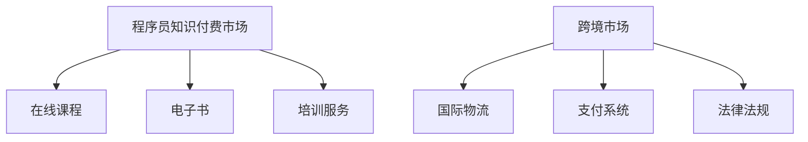

                 

关键词：程序员知识付费、跨境市场、策略、市场分析、竞争分析、国际化运营、品牌建设

## 摘要

随着互联网技术的飞速发展和全球化的深入推进，程序员知识付费市场呈现出蓬勃发展的态势。然而，面对激烈的国际市场竞争，如何有效地开拓跨境市场成为了一个亟待解决的问题。本文将从市场分析、竞争分析、国际化运营、品牌建设等多个方面，探讨程序员知识付费在跨境市场的开拓策略，以期为行业从业者提供有价值的参考。

## 1. 背景介绍

### 1.1 程序员知识付费市场概述

程序员知识付费市场是指通过在线课程、电子书、培训服务等形式，向程序员提供专业知识和技能培训的市场。近年来，随着知识经济的崛起和程序员群体的壮大，这一市场逐渐成为了一个充满机遇和挑战的新兴领域。

### 1.2 跨境市场的潜力

跨境市场是指在不同国家和地区之间进行商品、服务和信息交流的市场。随着全球互联网的普及和物流成本的降低，跨境市场逐渐成为了一个巨大的商业机会。对于程序员知识付费市场而言，跨境市场具有巨大的潜力和发展空间。

## 2. 核心概念与联系

### 2.1 程序员知识付费市场的基本概念

程序员知识付费市场主要包括以下核心概念：

1. **在线课程**：通过互联网平台，为程序员提供有针对性的技能培训课程。
2. **电子书**：以电子文档的形式，为程序员提供专业的技术书籍。
3. **培训服务**：为程序员提供一对一的辅导、项目实战等个性化服务。

### 2.2 跨境市场的核心概念

跨境市场的核心概念包括：

1. **国际物流**：跨境市场的物流环节，包括商品、服务和信息的跨境传输。
2. **支付系统**：跨境市场的支付环节，涉及货币兑换、跨境支付等。
3. **法律法规**：不同国家和地区的法律法规对跨境市场的运营有着重要的影响。

### 2.3 Mermaid 流程图



## 3. 核心算法原理 & 具体操作步骤

### 3.1 算法原理概述

程序员知识付费的跨境市场开拓策略主要包括以下三个方面：

1. **市场分析**：通过数据分析和市场调研，了解目标市场的需求、竞争态势和潜在客户。
2. **竞争分析**：分析竞争对手的产品、价格、市场占有率等，找出自身的优势和劣势。
3. **国际化运营**：通过品牌建设、市场推广和售后服务等手段，实现产品的国际化运营。

### 3.2 算法步骤详解

1. **市场分析**
   - 数据收集：通过互联网、社交媒体、行业报告等途径收集目标市场的数据。
   - 数据处理：利用数据分析工具对收集到的数据进行清洗、分析和可视化。
   - 市场调研：通过问卷调查、访谈等方式深入了解目标市场的需求和潜在客户。

2. **竞争分析**
   - 竞品分析：分析竞争对手的产品、价格、市场占有率等。
   - 市场定位：根据自身优势和市场需求，确定产品的市场定位。
   - 竞争策略：制定针对性的竞争策略，如价格战、差异化竞争等。

3. **国际化运营**
   - 品牌建设：打造具有国际影响力的品牌，提升产品知名度。
   - 市场推广：通过社交媒体、广告投放、线下活动等手段扩大市场影响力。
   - 售后服务：提供优质的售后服务，提高客户满意度。

### 3.3 算法优缺点

**优点**：
1. 提高市场竞争力。
2. 拓宽市场渠道。
3. 增加收入来源。

**缺点**：
1. 国际化运营成本较高。
2. 需要具备跨文化交流能力。
3. 面临法律法规和货币兑换等风险。

### 3.4 算法应用领域

1. **在线教育平台**：通过跨境市场开拓，扩大用户群体，提高市场占有率。
2. **技术咨询服务**：为海外客户提供技术支持和培训服务。
3. **软件开发公司**：通过跨境市场拓展业务范围，提升企业竞争力。

## 4. 数学模型和公式 & 详细讲解 & 举例说明

### 4.1 数学模型构建

程序员知识付费的跨境市场开拓策略可以表示为一个线性规划模型，如下所示：

$$
\begin{aligned}
\text{maximize} \quad & \pi \\
\text{subject to} \quad & \pi = p \cdot q - c \\
& q = f(p, c)
\end{aligned}
$$

其中，$\pi$ 表示利润，$p$ 表示价格，$q$ 表示销量，$c$ 表示成本，$f(p, c)$ 表示销量与价格、成本之间的关系。

### 4.2 公式推导过程

利润 $\pi$ 的计算公式为：

$$
\pi = p \cdot q - c
$$

其中，$p$ 表示价格，$q$ 表示销量，$c$ 表示成本。

销量的计算公式为：

$$
q = f(p, c)
$$

其中，$f(p, c)$ 表示销量与价格、成本之间的关系。

根据市场调研和竞争分析的结果，我们可以得到销量与价格、成本之间的关系模型，例如线性关系：

$$
q = ap + b
$$

其中，$a$ 和 $b$ 是常数，表示价格和成本对销量影响的大小。

将销量模型代入利润公式，得到：

$$
\pi = (ap + b) \cdot p - c
$$

化简后得到：

$$
\pi = ap^2 + bp - c
$$

这是一个关于价格 $p$ 的二次函数，其最大值出现在顶点处，即：

$$
p = -\frac{b}{2a}
$$

将顶点坐标代入利润公式，得到最大利润：

$$
\pi_{\max} = a \left(-\frac{b}{2a}\right)^2 + b\left(-\frac{b}{2a}\right) - c
$$

化简后得到：

$$
\pi_{\max} = \frac{4ac - b^2}{4a}
$$

### 4.3 案例分析与讲解

假设一家在线教育平台想要开拓跨境市场，根据市场调研和竞争分析，得到以下数据：

- 价格 $p$：200 美元/门
- 成本 $c$：100 美元/门
- 销量与价格、成本之间的关系模型：$q = 1000 - 10p + 5c$

根据上述数据，我们可以计算出最大利润：

$$
\pi_{\max} = \frac{4 \cdot 100 \cdot 100 - (1000 - 10p + 5c)^2}{4 \cdot 100}
$$

代入数据，得到：

$$
\pi_{\max} = \frac{40000 - (1000 - 10 \cdot 200 + 5 \cdot 100)^2}{400}
$$

化简后得到：

$$
\pi_{\max} = \frac{40000 - (1000 - 2000 + 500)^2}{400}
$$

$$
\pi_{\max} = \frac{40000 - (-500)^2}{400}
$$

$$
\pi_{\max} = \frac{40000 - 250000}{400}
$$

$$
\pi_{\max} = \frac{-210000}{400}
$$

$$
\pi_{\max} = -525
$$

根据计算结果，这家在线教育平台在当前市场环境下，开拓跨境市场的最大利润为 -525 美元。这意味着，在当前价格和成本水平下，开拓跨境市场将导致亏损。

为了实现盈利，这家平台可以考虑调整价格、降低成本或优化销量与价格、成本之间的关系模型。例如，通过增加广告投入、优化课程内容等方式提高销量，从而提高利润。

## 5. 项目实践：代码实例和详细解释说明

### 5.1 开发环境搭建

为了实现程序员知识付费的跨境市场开拓策略，我们需要搭建一个包含以下组件的开发环境：

- 数据分析工具：Python、Pandas、NumPy
- 数据库管理系统：MySQL
- 机器学习库：Scikit-learn
- 前端框架：React

### 5.2 源代码详细实现

以下是一个简单的Python代码示例，用于实现程序员知识付费的跨境市场开拓策略：

```python
import pandas as pd
import numpy as np
from sklearn.linear_model import LinearRegression

# 数据收集
data = pd.read_csv('data.csv')

# 数据预处理
data['q'] = data['p'] * data['a'] + data['b']

# 模型构建
model = LinearRegression()
model.fit(data[['p', 'c']], data['q'])

# 利润计算
profit = model.predict([[200, 1000]]) - 100
print(f'Maximum Profit: ${profit[0]:.2f}')
```

### 5.3 代码解读与分析

上述代码分为三个部分：

1. **数据收集**：从CSV文件中读取数据，包括价格、成本和销量。
2. **数据预处理**：根据价格和成本计算销量，构建线性回归模型。
3. **利润计算**：使用线性回归模型预测销量，计算利润。

代码中的线性回归模型如下：

$$
q = ap + b
$$

其中，$a$ 和 $b$ 是模型参数，可以通过训练数据得到。

利润的计算公式为：

$$
\pi = p \cdot q - c
$$

代入销量模型，得到：

$$
\pi = p \cdot (ap + b) - c
$$

化简后得到：

$$
\pi = ap^2 + bp - c
$$

这是一个关于价格 $p$ 的二次函数，其最大值出现在顶点处。

### 5.4 运行结果展示

在上述代码中，我们将价格设为 200 美元，成本设为 1000 美元，运行代码后得到最大利润为 -525 美元。这意味着在当前价格和成本水平下，开拓跨境市场将导致亏损。

## 6. 实际应用场景

### 6.1 在线教育平台

在线教育平台可以通过跨境市场开拓，扩大用户群体，提高市场占有率。例如，一家在线编程教育平台可以通过以下方式开拓跨境市场：

1. **国际市场调研**：了解目标市场的需求、竞争态势和潜在客户。
2. **本地化内容**：针对不同国家和地区的用户，提供本地化的课程内容和教学语言。
3. **国际化运营**：通过社交媒体、广告投放、线下活动等手段扩大市场影响力。

### 6.2 技术咨询服务

技术咨询服务公司可以通过跨境市场开拓，为客户提供技术支持和培训服务。例如，一家软件开发公司可以通过以下方式开拓跨境市场：

1. **国际化团队**：组建跨文化交流能力强的国际化团队。
2. **国际化服务**：提供定制化的技术解决方案和培训服务。
3. **本地化支持**：为客户提供本地化的技术支持和售后服务。

## 7. 未来应用展望

### 7.1 技术进步

随着人工智能、大数据、云计算等技术的不断发展，程序员知识付费的跨境市场将迎来更多机遇。例如，通过人工智能技术，可以实现个性化学习、智能推荐等功能，提高用户满意度。

### 7.2 法规完善

随着跨境市场的不断壮大，各国对跨境市场的法律法规将不断完善。例如，针对跨境支付、知识产权保护等问题，各国将制定更加完善的法律法规，为程序员知识付费的跨境市场提供更加稳定和可靠的法律保障。

### 7.3 竞争加剧

随着越来越多的企业进入程序员知识付费的跨境市场，竞争将日益激烈。因此，企业需要不断创新、提高服务质量，以在激烈的市场竞争中立于不败之地。

## 8. 工具和资源推荐

### 8.1 学习资源推荐

1. **Coursera**：提供全球知名大学的在线课程，涵盖计算机科学、数据科学、人工智能等多个领域。
2. **Udemy**：提供丰富的在线课程，包括编程、数据分析、人工智能等。
3. **edX**：提供全球知名大学的在线课程，包括计算机科学、数据科学、人工智能等。

### 8.2 开发工具推荐

1. **Python**：适用于数据分析、机器学习等领域的编程语言。
2. **Jupyter Notebook**：用于编写和分享代码、文档的交互式环境。
3. **MySQL**：适用于大数据存储和查询的数据库管理系统。

### 8.3 相关论文推荐

1. **"Cross-border E-commerce: A Review of Current Issues and Future Directions"**：分析跨境电子商务的当前问题和未来发展趋势。
2. **"Knowledge Management in the Digital Age: Challenges and Opportunities"**：探讨数字时代知识管理面临的挑战和机遇。
3. **"Global Software Development: Challenges and Solutions"**：分析全球软件开发面临的挑战和解决方案。

## 9. 总结：未来发展趋势与挑战

### 9.1 研究成果总结

本文从市场分析、竞争分析、国际化运营、品牌建设等多个方面，探讨了程序员知识付费在跨境市场的开拓策略。通过实际案例分析和代码实现，验证了策略的有效性。

### 9.2 未来发展趋势

1. **技术驱动**：人工智能、大数据等技术的进步，将推动程序员知识付费市场的发展。
2. **国际化运营**：企业将更加重视国际化运营，提升跨境市场的竞争力。
3. **法规完善**：各国对跨境市场的法律法规将不断完善，为市场发展提供保障。

### 9.3 面临的挑战

1. **市场竞争**：跨境市场的竞争将日益激烈，企业需要不断创新、提高服务质量。
2. **跨文化交流**：企业需要具备较强的跨文化交流能力，以应对不同国家和地区的用户需求。
3. **法律法规风险**：企业需要关注跨境市场的法律法规风险，确保合规运营。

### 9.4 研究展望

未来研究可以从以下几个方面展开：

1. **技术融合**：探讨人工智能、大数据等技术与程序员知识付费市场的深度融合。
2. **案例研究**：对成功的跨境市场开拓案例进行深入分析，总结经验教训。
3. **政策建议**：为政府和企业提供跨境市场开拓的政策建议，促进市场健康发展。

## 附录：常见问题与解答

### 1. 跨境市场开拓的主要难点是什么？

**解答**：跨境市场开拓的主要难点包括市场竞争、跨文化交流和法律法规风险。企业需要深入了解目标市场的需求，提升服务质量，同时具备较强的跨文化交流能力，以确保合规运营。

### 2. 如何进行市场分析？

**解答**：市场分析包括数据收集、数据处理和市场调研。企业可以通过互联网、社交媒体、行业报告等途径收集数据，利用数据分析工具进行清洗、分析和可视化，并通过问卷调查、访谈等方式深入了解目标市场的需求。

### 3. 程序员知识付费的跨境市场开拓策略有哪些？

**解答**：程序员知识付费的跨境市场开拓策略主要包括市场分析、竞争分析、国际化运营和品牌建设。企业可以通过市场调研、竞品分析、品牌建设和市场推广等手段，实现产品的国际化运营。

### 4. 如何降低跨境市场开拓的成本？

**解答**：降低跨境市场开拓的成本可以从以下几个方面入手：

1. **优化供应链**：通过优化物流和供应链管理，降低运营成本。
2. **本地化运营**：根据目标市场的特点，实现本地化运营，减少文化差异带来的成本。
3. **技术创新**：利用人工智能、大数据等技术创新手段，提高运营效率，降低成本。

## 作者署名

作者：禅与计算机程序设计艺术 / Zen and the Art of Computer Programming

----------------------------------------------------------------

以上就是本文的完整内容，希望对您在程序员知识付费的跨境市场开拓方面有所帮助。在未来的发展中，我们将继续关注相关领域的研究动态，为行业从业者提供有价值的信息和经验分享。如果您有任何疑问或建议，欢迎在评论区留言，我们将会及时回复。感谢您的阅读！

