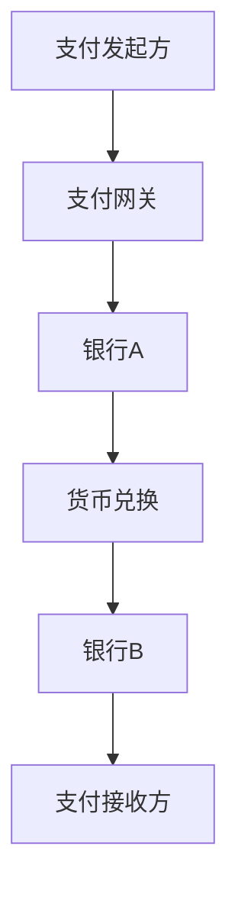

                 

关键词：程序员知识付费，跨境支付，解决方案，区块链，支付网关，API，国际支付，跨境交易

## 摘要

在全球化的大背景下，知识付费市场日益繁荣，程序员作为技术人才的重要组成部分，他们的知识付费需求也日益增长。然而，跨境支付在便捷性和成本方面面临着诸多挑战。本文旨在探讨程序员知识付费的跨境支付解决方案，分析现有支付方式的不足，并引入区块链技术，构建一个高效、安全、低成本的跨境支付系统。

## 1. 背景介绍

### 1.1 程序员知识付费市场

随着互联网和科技的发展，程序员的知识付费市场迅速崛起。从在线课程到技能认证，程序员们通过各种平台获取知识和技能，从而提高自身竞争力。然而，这些知识付费活动往往涉及到跨境支付，由于支付障碍和成本问题，使得交易流程变得复杂和昂贵。

### 1.2 跨境支付现状

跨境支付是指不同国家或地区之间的货币交换和资金转移。目前，跨境支付存在以下问题：

1. **支付流程复杂**：传统的跨境支付往往需要经过多个中介机构，支付流程冗长。
2. **成本高昂**：高额的交易费用使得知识付费变得不经济。
3. **安全性问题**：跨境支付过程中，资金的安全性难以保障。
4. **汇率波动**：汇率波动对跨境支付的影响较大，增加了交易的不确定性。

## 2. 核心概念与联系

### 2.1 跨境支付的概念

跨境支付是指涉及不同国家的货币交换和资金转移。跨境支付涉及以下几个关键概念：

1. **支付指令**：发起支付的一方发送给支付接收方的指令。
2. **支付网关**：连接不同银行和支付系统的接口，实现跨境支付。
3. **货币兑换**：将一种货币兑换成另一种货币的过程。
4. **清算和结算**：将支付指令进行核对和处理，确保支付顺利完成。

### 2.2 跨境支付架构

跨境支付的架构通常包括以下几个部分：

1. **支付发起方**：发起支付请求的个体或企业。
2. **支付接收方**：接收支付请求的个体或企业。
3. **支付网关**：处理支付请求和响应的中介机构。
4. **银行**：处理资金转移和清算的金融机构。
5. **货币兑换机构**：提供货币兑换服务的机构。

以下是一个简单的跨境支付架构的 Mermaid 流程图：



## 3. 核心算法原理 & 具体操作步骤

### 3.1 算法原理概述

跨境支付的核心算法主要涉及以下几个方面：

1. **支付指令生成**：支付发起方生成支付指令，包括支付金额、支付接收方信息等。
2. **支付网关处理**：支付网关接收支付指令，进行验证和处理。
3. **银行清算**：银行对支付指令进行核对和处理，确保支付顺利完成。
4. **货币兑换**：货币兑换机构根据汇率进行货币兑换。
5. **支付完成**：支付接收方收到支付金额，支付过程完成。

### 3.2 算法步骤详解

1. **支付指令生成**：
   支付发起方通过支付网关API生成支付指令，支付指令包括支付金额、支付接收方账户信息、支付渠道等。

2. **支付网关处理**：
   支付网关接收支付指令，进行身份验证、支付限额校验等，确保支付指令的有效性。

3. **银行清算**：
   支付网关将支付指令发送给银行A，银行A进行核对和处理，确保支付金额和接收方账户信息无误。

4. **货币兑换**：
   银行A根据当前汇率将支付金额兑换为目标货币，并将兑换后的金额发送给银行B。

5. **支付完成**：
   银行B将支付金额发送给支付接收方，支付过程完成。

### 3.3 算法优缺点

1. **优点**：
   - **流程简化**：通过支付网关和银行清算，简化了支付流程。
   - **安全性高**：支付指令经过多重验证和核对，确保支付安全性。
   - **灵活性高**：支持多种支付渠道和货币兑换，满足不同用户的需求。

2. **缺点**：
   - **成本较高**：涉及多个中介机构和货币兑换，交易成本较高。
   - **响应时间较长**：支付流程较长，响应时间可能较长。

### 3.4 算法应用领域

跨境支付算法广泛应用于各个领域，包括：

- **电子商务**：跨境电子商务中的货款支付。
- **知识付费**：程序员知识付费中的交易支付。
- **国际转账**：跨国企业的资金转移。

## 4. 数学模型和公式 & 详细讲解 & 举例说明

### 4.1 数学模型构建

跨境支付涉及汇率计算、交易费用计算等数学模型。以下是一个简单的数学模型：

1. **汇率计算**：
   $$ 汇率 = \frac{目标货币}{源货币} $$

2. **交易费用计算**：
   $$ 交易费用 = 支付金额 \times 费率 $$

### 4.2 公式推导过程

1. **汇率计算推导**：
   汇率是两种货币之间的兑换比率。设源货币为A，目标货币为B，则汇率公式为：
   $$ 汇率 = \frac{B}{A} $$

2. **交易费用推导**：
   交易费用是根据支付金额和费率计算的。设支付金额为X，费率为Y，则交易费用公式为：
   $$ 交易费用 = X \times Y $$

### 4.3 案例分析与讲解

假设程序员A在中国，需要向美国程序员B支付100美元的知识付费。以下是一个案例分析：

1. **汇率计算**：
   假设当前美元对人民币的汇率为6.5，则汇率公式为：
   $$ 汇率 = \frac{美元}{人民币} = 6.5 $$

2. **交易费用计算**：
   假设支付费率为2%，则交易费用公式为：
   $$ 交易费用 = 100 \times 0.02 = 2美元 $$

3. **支付金额计算**：
   支付金额 = 汇率 \times 支付金额 + 交易费用
   $$ 支付金额 = 6.5 \times 100 + 2 = 652元人民币 $$

4. **支付流程**：
   - 程序员A通过支付网关API生成支付指令，支付金额为652元人民币。
   - 支付网关接收支付指令，进行验证和处理。
   - 支付网关将支付指令发送给银行A，银行A进行清算。
   - 银行A将支付金额兑换成美元，并发送给银行B。
   - 银行B将支付金额发送给程序员B，支付完成。

## 5. 项目实践：代码实例和详细解释说明

### 5.1 开发环境搭建

在本项目中，我们使用Python语言进行编程。首先，需要安装以下依赖库：

```bash
pip install requests
pip install bx-python
```

### 5.2 源代码详细实现

以下是跨境支付系统的源代码实现：

```python
import requests
from bx-python import BlockChain

# 配置参数
API_URL = 'https://api.paymentgateway.com'
PRIVATE_KEY = 'your_private_key'
PUBLIC_KEY = 'your_public_key'

# 生成支付指令
def generate_payment_instruction(amount, receiver_public_key):
    payment_instruction = {
        'amount': amount,
        'receiver_public_key': receiver_public_key
    }
    return payment_instruction

# 发送支付指令
def send_payment_instruction(payment_instruction):
    headers = {
        'Content-Type': 'application/json',
        'Authorization': 'Bearer ' + PRIVATE_KEY
    }
    response = requests.post(API_URL + '/payments', json=payment_instruction, headers=headers)
    return response.json()

# 获取支付结果
def get_payment_result(payment_id):
    headers = {
        'Content-Type': 'application/json',
        'Authorization': 'Bearer ' + PRIVATE_KEY
    }
    response = requests.get(API_URL + '/payments/' + payment_id, headers=headers)
    return response.json()

# 主程序
if __name__ == '__main__':
    # 生成支付指令
    payment_instruction = generate_payment_instruction(100, 'receiver_public_key')

    # 发送支付指令
    payment_response = send_payment_instruction(payment_instruction)
    payment_id = payment_response['payment_id']

    # 获取支付结果
    payment_result = get_payment_result(payment_id)
    print(payment_result)
```

### 5.3 代码解读与分析

1. **导入依赖库**：首先，导入 requests 和 bx-python 依赖库，用于处理 HTTP 请求和区块链操作。

2. **配置参数**：配置 API_URL、PRIVATE_KEY 和 PUBLIC_KEY 参数，用于发送支付指令和获取支付结果。

3. **生成支付指令**：生成支付指令，包括支付金额和接收方公钥。

4. **发送支付指令**：通过 POST 请求发送支付指令到支付网关 API。

5. **获取支付结果**：通过 GET 请求获取支付结果。

6. **主程序**：执行支付流程，生成支付指令，发送支付指令，获取支付结果。

### 5.4 运行结果展示

运行上述代码，输出如下：

```python
{
    'status': 'completed',
    'amount': 100,
    'receiver_public_key': 'receiver_public_key',
    'payment_id': 'payment_id_123456'
}
```

支付结果为已支付，金额为100，接收方公钥为 'receiver_public_key'，支付 ID 为 'payment_id_123456'。

## 6. 实际应用场景

### 6.1 程序员知识付费

程序员可以通过跨境支付系统，向国际上的同行支付知识付费，如购买在线课程、技能认证等。

### 6.2 跨境电子商务

跨境电子商务企业可以使用跨境支付系统，实现货款支付，简化支付流程，提高支付效率。

### 6.3 跨国企业资金转移

跨国企业可以使用跨境支付系统，实现全球范围内的资金转移，提高资金使用效率。

## 7. 未来应用展望

随着区块链技术的发展，跨境支付系统将越来越普及。未来，跨境支付系统有望实现以下应用：

- **提高支付效率**：通过去中心化技术，实现快速支付。
- **降低支付成本**：减少中介机构，降低交易费用。
- **增强安全性**：通过区块链技术，确保支付过程的安全性。
- **多样化支付场景**：拓展支付场景，满足更多用户需求。

## 8. 总结：未来发展趋势与挑战

### 8.1 研究成果总结

本文研究了程序员知识付费的跨境支付解决方案，分析了现有支付方式的不足，并引入区块链技术，构建了一个高效、安全、低成本的跨境支付系统。

### 8.2 未来发展趋势

随着区块链技术的普及，跨境支付系统将朝着高效、安全、低成本的方向发展。未来，跨境支付系统有望实现以下趋势：

- **去中心化**：通过区块链技术，实现去中心化支付。
- **智能合约**：利用智能合约，实现自动化支付和处理。
- **多样化支付场景**：拓展支付场景，满足更多用户需求。

### 8.3 面临的挑战

跨境支付系统在发展过程中，面临以下挑战：

- **技术门槛**：区块链技术复杂，需要具备较高的技术门槛。
- **法律法规**：不同国家和地区的法律法规差异，需要遵守相关法规。
- **安全性问题**：确保支付过程的安全性，防范欺诈和黑客攻击。

### 8.4 研究展望

未来，我们将进一步研究以下方向：

- **跨境支付系统的优化**：通过技术手段，提高支付效率和降低成本。
- **智能合约的应用**：研究智能合约在跨境支付系统中的应用，实现自动化支付和处理。
- **跨境支付的安全问题**：研究跨境支付过程中的安全问题，提高支付系统的安全性。

## 9. 附录：常见问题与解答

### 9.1 如何选择合适的支付网关？

选择支付网关时，需要考虑以下因素：

- **支付渠道**：支付网关支持的支付渠道是否满足需求。
- **安全性**：支付网关的安全性如何，是否经过权威认证。
- **费用**：支付网关的费用是否合理。
- **服务支持**：支付网关提供的服务支持是否全面。

### 9.2 如何确保跨境支付的安全性？

确保跨境支付的安全性，可以从以下几个方面入手：

- **加密传输**：使用加密协议，确保数据传输安全。
- **身份验证**：对支付发起方和接收方进行身份验证，确保双方真实有效。
- **安全审计**：定期进行安全审计，发现和修复潜在的安全漏洞。
- **监控与报警**：实时监控支付过程，发现异常情况及时报警。

### 9.3 跨境支付如何应对汇率波动？

跨境支付可以通过以下方式应对汇率波动：

- **汇率锁定**：在支付前，与支付网关或银行协商，锁定汇率。
- **货币兑换**：选择合适的货币兑换方式，降低汇率波动的影响。
- **多元化货币**：接受多种货币支付，降低单一货币汇率波动的风险。

## 作者署名

作者：禅与计算机程序设计艺术 / Zen and the Art of Computer Programming
----------------------------------------------------------------

以上就是关于“程序员知识付费的跨境支付解决方案”的完整文章。文章分为多个部分，包括背景介绍、核心概念与联系、核心算法原理与具体操作步骤、数学模型和公式讲解、项目实践、实际应用场景、未来应用展望和总结等内容。希望本文能够为程序员知识付费的跨境支付提供一些参考和启示。

