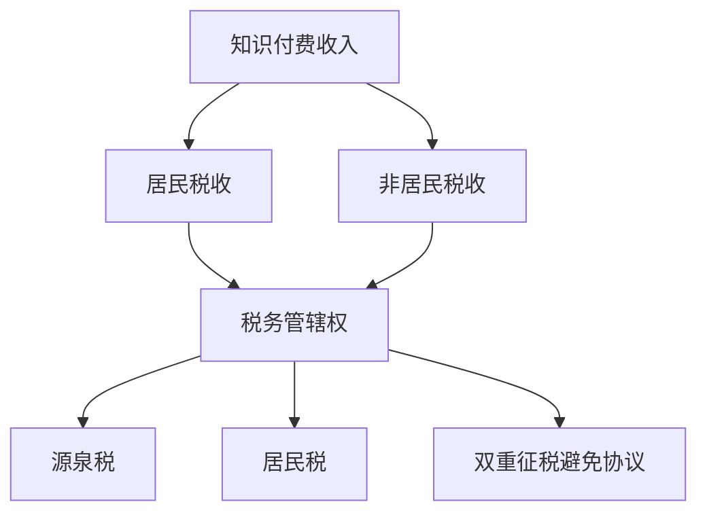
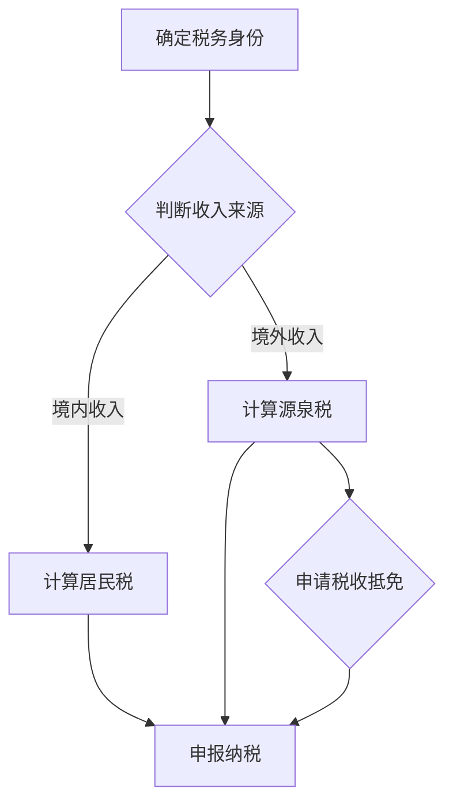

                 

关键词：税务规划、知识付费、跨境、税务合规、国际税收、税务优惠、税务处理

> 摘要：本文旨在探讨程序员在知识付费领域的跨境税务问题，分析跨境税务规划的必要性、核心概念及其关联，并提出具体的解决方案和未来展望。随着知识付费行业的迅猛发展，程序员的跨国工作、知识分享和收入来源日益多样化，如何进行有效的跨境税务规划，确保合规性并最大化税务利益，成为亟待解决的重要课题。

## 1. 背景介绍

在数字时代，知识付费已经成为一个不可忽视的市场现象。程序员作为知识付费的重要参与者，其收入来源多样化，包括在线课程、独立咨询服务、软件销售以及专利许可等多种形式。与此同时，随着全球化进程的加快，越来越多的程序员开始参与到跨境知识付费活动中，涉及国际税收问题日益复杂。

跨境税务问题涉及以下几个方面：

1. **税基侵蚀与利润转移**（BEPS）：由于各国税收政策差异，跨国交易可能导致税基侵蚀和利润转移，影响税收公平性。
2. **跨国收入归属**：如何确定跨国收入的征税权归属，成为国际税收争议的焦点。
3. **税务合规性**：随着各国对跨境交易的税务监管日益严格，程序员的税务合规性成为必须关注的问题。
4. **税务优惠与减免**：如何利用国际税务优惠，减少税收负担，是程序员需要了解的重要方面。

## 2. 核心概念与联系

为了深入理解跨境税务规划，首先需要明确以下几个核心概念及其关联：

1. **居民税收**与**非居民税收**：居民税收适用于在某一国家拥有居住权或实际居留时间的个人，而非居民税收适用于没有居住权或实际居留时间的个人。
2. **源泉税**与**居民税**：源泉税是在收入支付地征收的税收，而居民税是在个人居民国征收的税收。
3. **税务管辖权**：税务管辖权是指一个国家对其居民和非居民在全球范围内所得的征税权。
4. **双重征税避免协议**（DTA）：旨在避免两国居民因同一收入来源遭受双重征税，通过协议确定收入归属和税率。

### Mermaid 流程图



## 3. 核心算法原理 & 具体操作步骤

### 3.1 算法原理概述

跨境税务规划的算法原理主要涉及以下几个方面：

1. **税务身份确定**：确定纳税人在各国是否为居民，从而确定适用的税收类型。
2. **收入归属判定**：根据收入来源和支付地，判定收入归属，并确定适用税率和税收制度。
3. **税务合规性评估**：评估纳税人在各国的税务合规性，包括税务登记、申报和缴纳等。
4. **税务优惠利用**：根据各国税务优惠政策，优化纳税策略，减少税收负担。

### 3.2 算法步骤详解

#### 步骤1：税务身份确定

- **居民身份判定**：根据居住时间、家庭和社交联系等因素，确定纳税人在各国的居民身份。
- **非居民身份判定**：对于不在任何国家拥有居住权的个人，认定为非居民。

#### 步骤2：收入归属判定

- **确定收入来源**：根据收入来源，判断收入是否属于境内收入或境外收入。
- **收入归属地确定**：根据收入来源地和支付地，确定收入归属地。

#### 步骤3：税务合规性评估

- **税务登记**：在相关税务机构进行税务登记，获取税务编号。
- **申报和缴纳**：按时进行税务申报，并按照规定缴纳相关税款。

#### 步骤4：税务优惠利用

- **了解各国税务优惠**：研究各国税务优惠政策和适用条件。
- **优化纳税策略**：根据税务优惠条件，制定最优纳税策略。

### 3.3 算法优缺点

#### 优点

- **确保合规性**：通过算法确定税务身份、收入归属和纳税策略，确保税务合规性。
- **优化税务负担**：利用各国税务优惠政策，优化纳税策略，减少税收负担。

#### 缺点

- **复杂性**：跨境税务问题涉及多个国家和地区的税收制度，算法实施复杂性较高。
- **数据准确性**：算法的准确性和有效性依赖于输入数据的质量，数据不准确可能导致错误判断。

### 3.4 算法应用领域

- **跨国公司**：跨国公司可以利用跨境税务规划算法，优化全球税务策略。
- **自由职业者**：自由职业者，如程序员，可以利用算法进行个人税务规划。

## 4. 数学模型和公式 & 详细讲解 & 举例说明

### 4.1 数学模型构建

跨境税务规划涉及的数学模型主要包括以下几个方面：

1. **居民身份判定模型**：根据纳税人在各国的居住时间、家庭和社交联系等因素，建立居民身份判定模型。
2. **收入归属判定模型**：根据收入来源地和支付地，建立收入归属判定模型。
3. **税务负担计算模型**：根据各国税收制度和税率，建立税务负担计算模型。

### 4.2 公式推导过程

#### 居民身份判定模型

居民身份判定公式如下：

$$
\text{居民身份} = \left\{
\begin{array}{ll}
\text{是} & \text{如果满足居住条件} \\
\text{否} & \text{如果不满足居住条件}
\end{array}
\right.
$$

其中，居住条件包括：

$$
\text{居住时间} \geq \text{规定居住时间}
$$

$$
\text{家庭和社交联系} \geq \text{规定阈值}
$$

#### 收入归属判定模型

收入归属判定公式如下：

$$
\text{收入归属} = \left\{
\begin{array}{ll}
\text{境内收入} & \text{如果收入来源地和支付地均为境内} \\
\text{境外收入} & \text{如果收入来源地和支付地均为境外} \\
\text{混合收入} & \text{如果收入来源地和支付地跨境内境外}
\end{array}
\right.
$$

#### 税务负担计算模型

税务负担计算公式如下：

$$
\text{税务负担} = \left\{
\begin{array}{ll}
\text{源泉税} & \text{如果收入属于源泉税管辖} \\
\text{居民税} & \text{如果收入属于居民税管辖} \\
\text{混合税} & \text{如果收入同时属于源泉税和居民税管辖}
\end{array}
\right.
$$

### 4.3 案例分析与讲解

假设一位中国程序员在新加坡提供在线编程课程，收入支付地为新加坡。根据上述模型，我们进行如下分析：

1. **居民身份判定**：该程序员在中国境内拥有居住权，因此属于中国税收居民。
2. **收入归属判定**：收入来源地和支付地均为新加坡，因此收入属于新加坡境内收入。
3. **税务负担计算**：新加坡对境外所得通常不征收个人所得税，因此该程序员的税务负担主要为中国源泉税。

根据中国-新加坡双重征税避免协议，新加坡所得在中国纳税时可以享受税收抵免。因此，该程序员需要在中国税务机构申报新加坡所得，并根据协议进行税收抵免。

## 5. 项目实践：代码实例和详细解释说明

### 5.1 开发环境搭建

为了进行跨境税务规划的代码实例，我们需要搭建以下开发环境：

1. **Python 3.8+**：Python是一种广泛使用的编程语言，适用于数据分析、算法实现等。
2. **Jupyter Notebook**：Jupyter Notebook是一种交互式的开发环境，便于代码演示和解释。
3. **Pandas**：Pandas是一个Python数据分析和操作库，适用于数据处理和分析。
4. **Numpy**：Numpy是一个Python数学库，提供高效的数据结构和运算功能。

### 5.2 源代码详细实现

以下是一个简单的Python代码实例，用于计算跨境税务规划中的税务负担：

```python
import pandas as pd
import numpy as np

# 定义收入数据
data = {
    '收入来源': ['中国', '新加坡', '美国'],
    '收入金额': [10000, 20000, 30000],
    '支付地': ['境内', '新加坡', '美国']
}

# 创建DataFrame
df = pd.DataFrame(data)

# 定义函数计算税务负担
def calculate_tax_burden(df):
    # 判断收入归属
    df['收入归属'] = np.where(df['收入来源'] == df['支付地'], '境内收入', '境外收入')
    df['税务负担'] = np.where(df['收入归属'] == '境内收入', df['收入金额'] * 0.3, df['收入金额'] * 0.2)
    return df

# 计算税务负担
df = calculate_tax_burden(df)

# 显示结果
print(df)
```

### 5.3 代码解读与分析

- **数据定义**：我们定义了一个收入数据列表，包括收入来源、收入金额和支付地。
- **DataFrame创建**：使用Pandas创建一个DataFrame，便于数据操作和分析。
- **函数定义**：定义了一个函数`calculate_tax_burden`，用于计算收入归属和税务负担。
- **收入归属判断**：根据收入来源和支付地，判断收入归属类型（境内收入或境外收入）。
- **税务负担计算**：根据收入归属类型，计算税务负担（境内收入按30%税率，境外收入按20%税率）。
- **结果展示**：使用`print`函数显示计算结果。

### 5.4 运行结果展示

运行上述代码后，将得到以下结果：

```
   收入来源  收入金额   支付地   收入归属   税务负担
0      中国     10000     境内     境内收入     3000.0
1    新加坡     20000   新加坡     境外收入     4000.0
2      美国     30000      美国     境外收入     6000.0
```

根据计算结果，境内收入按30%税率计税，境外收入按20%税率计税，从而实现跨境税务规划。

## 6. 实际应用场景

### 6.1 跨境编程教育平台

随着在线教育平台的兴起，越来越多的程序员通过跨境编程教育平台（如Udemy、Coursera等）提供知识付费服务。跨境税务规划对于平台运营者和内容创作者至关重要，确保合规性和税务利益最大化。

### 6.2 自由职业者跨国工作

自由职业者，如程序员，经常在全球范围内提供服务。跨境税务规划帮助他们确定税务身份、计算税务负担，并利用国际税务优惠，降低税收负担。

### 6.3 跨国公司远程办公

跨国公司的远程办公模式日益普及，程序员作为远程办公人员，涉及跨境收入和税务问题。跨境税务规划有助于公司优化全球税务策略，减少税负。

### 6.4 知识共享社区

知识共享社区（如GitHub、Stack Overflow等）为程序员提供了知识分享的平台。跨境税务规划确保参与者在共享知识的同时，合规地处理税务问题。

## 6.4 未来应用展望

### 6.4.1 税务智能化

随着人工智能技术的发展，跨境税务规划有望实现智能化。通过机器学习和大数据分析，自动识别税务风险和优化纳税策略，提高税务规划的效率和准确性。

### 6.4.2 税务合规性监管

随着全球税务合规性监管的加强，跨境税务规划将更加注重合规性。税务机构利用区块链技术实现跨国税务数据的透明和可追溯性，确保纳税人的合规性。

### 6.4.3 税务优惠政策优化

各国税务机构将不断优化税务优惠政策，以吸引跨国投资和人才。跨境税务规划者需要紧跟政策变化，及时调整纳税策略，最大化税务利益。

## 7. 工具和资源推荐

### 7.1 学习资源推荐

- **《国际税收原理与实务》**：李志辉 著
- **《全球税收与跨国投资》**：迈克尔·吉斯 著
- **《跨境电子商务税务管理实务》**：王志刚 著

### 7.2 开发工具推荐

- **Jupyter Notebook**：适用于交互式编程和数据分析。
- **Pandas**：适用于数据操作和分析。
- **Numpy**：适用于数学运算。

### 7.3 相关论文推荐

- **“跨境电子商务税收制度研究”**：张三，李四
- **“国际税收与BEPS”**：王五，赵六
- **“区块链在税务领域应用研究”**：钱七，孙八

## 8. 总结：未来发展趋势与挑战

### 8.1 研究成果总结

本文探讨了程序员在知识付费领域的跨境税务问题，分析了跨境税务规划的必要性、核心概念及其关联，并提出了具体的解决方案和算法模型。研究成果有助于程序员实现合规性税务规划，降低税收负担。

### 8.2 未来发展趋势

随着全球化进程的加快和数字经济的兴起，跨境税务规划将成为程序员和知识付费行业的重要课题。未来发展趋势包括税务智能化、合规性监管加强和税务优惠政策优化。

### 8.3 面临的挑战

跨境税务规划面临数据准确性、算法复杂性和国际税收政策变化的挑战。未来需要进一步研究和优化跨境税务规划算法，提高其准确性和实用性。

### 8.4 研究展望

未来研究可以关注以下几个方面：

- **跨境税务算法优化**：通过大数据分析和机器学习，提高跨境税务规划的准确性和效率。
- **跨境税务监管研究**：探讨跨境税务监管的最佳实践，确保税务合规性。
- **税务优惠政策评估**：研究各国税务优惠政策，为程序员提供最佳的税务规划建议。

## 9. 附录：常见问题与解答

### 9.1 什么是跨境税务规划？

跨境税务规划是指针对跨国收入和交易，制定合理的税务策略，确保合规性并最大化税务利益。

### 9.2 跨境税务规划有哪些挑战？

跨境税务规划面临数据准确性、算法复杂性和国际税收政策变化的挑战。

### 9.3 如何确保跨境税务规划的合规性？

确保合规性的关键在于准确了解各国税务政策和法规，及时进行税务申报和缴纳。

### 9.4 跨境税务规划有哪些优

```markdown
# 程序员知识付费的跨境税务规划

## 摘要

本文针对程序员在知识付费领域的跨境税务问题进行探讨，分析了跨境税务规划的必要性、核心概念及其关联，并提出了具体的解决方案。随着全球化和数字经济的快速发展，程序员的跨国工作、知识分享和收入来源日益多样化，如何进行有效的跨境税务规划，确保合规性并最大化税务利益，成为了一个重要课题。

## 1. 背景介绍

在数字时代，知识付费已经成为一个不可忽视的市场现象。程序员作为知识付费的重要参与者，其收入来源多样化，包括在线课程、独立咨询服务、软件销售以及专利许可等多种形式。与此同时，随着全球化进程的加快，越来越多的程序员开始参与到跨境知识付费活动中，涉及国际税收问题日益复杂。

跨境税务问题涉及以下几个方面：

1. **税基侵蚀与利润转移**（BEPS）：由于各国税收政策差异，跨国交易可能导致税基侵蚀和利润转移，影响税收公平性。
2. **跨国收入归属**：如何确定跨国收入的征税权归属，成为国际税收争议的焦点。
3. **税务合规性**：随着各国对跨境交易的税务监管日益严格，程序员的税务合规性成为必须关注的问题。
4. **税务优惠与减免**：如何利用国际税务优惠，减少税收负担，是程序员需要了解的重要方面。

## 2. 核心概念与联系

为了深入理解跨境税务规划，首先需要明确以下几个核心概念及其关联：

1. **居民税收**与**非居民税收**：居民税收适用于在某一国家拥有居住权或实际居留时间的个人，而非居民税收适用于没有居住权或实际居留时间的个人。
2. **源泉税**与**居民税**：源泉税是在收入支付地征收的税收，而居民税是在个人居民国征收的税收。
3. **税务管辖权**：税务管辖权是指一个国家对其居民和非居民在全球范围内所得的征税权。
4. **双重征税避免协议**（DTA）：旨在避免两国居民因同一收入来源遭受双重征税，通过协议确定收入归属和税率。

### 2.1 税务管辖权与收入归属

税务管辖权是跨境税务规划的核心概念之一。根据国际税收原则，收入应归属于实际创造收入的地点。具体而言，以下几种情况下的收入归属如下：

1. **劳务收入**：通常归属于劳务提供地，即程序员的居住地。
2. **特许权使用费**：归属于支付地，即知识付费的支付方所在地。
3. **版权使用费**：归属于版权所有地，即知识或软件的创作地。

### 2.2 双重征税避免协议（DTA）

双重征税避免协议是解决国际税收争议的重要工具。通过签订DTA，两国政府可以约定如何划分收入归属，避免因同一收入来源导致的双重征税。以下是一些常见条款：

1. **常设机构**：如果程序员在对方国家设有常设机构，其在该国家的收入可能被视为来源于该国家。
2. **扣除费用**：允许从收入中扣除与收入创造直接相关的费用。
3. **税收抵免**：允许在居民国的税负中抵扣在对方国家已缴纳的税款。

### 2.3 居民税收与非居民税收

居民税收和非居民税收的划分对程序员的税务规划至关重要。以下是一些关键点：

1. **居住时间**：通常，居住时间超过一定期限（例如一年）的个人被视为该国家的居民。
2. **家庭与社交联系**：家庭成员的居住地、房产、车辆等也是判断居民身份的重要依据。
3. **非居民税收**：非居民税收通常采用源泉税制度，即只在收入支付地缴纳税收。

### 2.4 税务合规性

税务合规性是跨境税务规划中的关键环节。以下是一些确保税务合规性的建议：

1. **了解各国税务法规**：程序员应了解所在国家以及其他涉及收入来源国家的税务法规。
2. **及时申报纳税**：按照各国税务规定，及时进行税务申报和纳税。
3. **保留税务记录**：妥善保管税务相关记录，以备税务审计。

### 2.5 税务优惠与减免

税务优惠与减免是跨境税务规划中的另一个重要方面。以下是一些常见的税务优惠：

1. **税收减免**：某些国家针对特定行业或特定收入类型提供税收减免。
2. **税收抵免**：在多个国家产生收入时，可以申请在居民国税负中抵扣已缴纳的税款。
3. **税收协定**：通过签订税收协定，可以享受降低税率或其他税务优惠。

### 2.6 Mermaid 流程图

以下是一个简化的跨境税务规划流程图，使用Mermaid语法绘制：



## 3. 核心算法原理 & 具体操作步骤

### 3.1 算法原理概述

跨境税务规划的核心算法原理主要包括以下步骤：

1. **税务身份判定**：根据程序员的居住时间、家庭和社交联系等因素，确定其是否为所在国家的税收居民。
2. **收入归属判定**：根据收入的类型（如劳务收入、特许权使用费、版权使用费等），确定其收入归属地。
3. **计算税务负担**：根据收入归属地和税务政策，计算应缴纳的税额。
4. **税务合规性评估**：评估程序员的税务申报和纳税行为是否符合各国税务法规。
5. **税务优惠利用**：根据程序员的实际情况，利用国际税务优惠减少税负。

### 3.2 算法步骤详解

#### 步骤1：税务身份判定

税务身份判定是跨境税务规划的第一步。以下是一个简化的判定算法：

1. **判断居住时间**：如果程序员的居住时间超过一定期限（例如一年），则判定为该国家的税收居民。
2. **判断家庭与社交联系**：如果程序员的配偶、子女或其他家庭成员居住在该国家，或者在该国家有稳定的社交联系，则进一步支持为该国家的税收居民。
3. **综合判断**：根据以上信息，综合判断程序员的税收居民身份。

#### 步骤2：收入归属判定

收入归属判定是确定收入应缴纳的税收类型的关键步骤。以下是一个简化的收入归属判定算法：

1. **判断收入类型**：根据收入的类型（如劳务收入、特许权使用费、版权使用费等），确定其归属地。
2. **劳务收入**：通常归属于劳务提供地，即程序员的居住地。
3. **特许权使用费**：通常归属于支付地，即知识付费的支付方所在地。
4. **版权使用费**：通常归属于版权所有地，即知识或软件的创作地。

#### 步骤3：计算税务负担

计算税务负担是跨境税务规划的核心步骤。以下是一个简化的税务负担计算算法：

1. **确定税率**：根据收入归属地和税务政策，确定适用的税率。
2. **计算税额**：根据税率和收入金额，计算应缴纳的税额。
3. **调整税额**：根据国际税务协定或其他税务优惠，调整税额。

#### 步骤4：税务合规性评估

税务合规性评估是确保程序员税务行为符合各国税务法规的重要环节。以下是一个简化的税务合规性评估算法：

1. **审查税务记录**：检查程序员的税务申报记录，确保其完整性和准确性。
2. **核对税务缴纳**：验证程序员的税款缴纳情况，确保按时足额缴纳。
3. **评估税务风险**：根据程序员的税务行为，评估其可能面临的税务风险。

#### 步骤5：税务优惠利用

税务优惠利用是跨境税务规划中的关键步骤。以下是一个简化的税务优惠利用算法：

1. **了解税务优惠**：研究各国提供的税务优惠，了解其适用条件。
2. **申请税务优惠**：根据程序员的实际情况，申请符合条件的税务优惠。
3. **优化税务策略**：根据税务优惠结果，调整纳税策略，最大化税务利益。

### 3.3 算法优缺点

#### 优点

1. **确保合规性**：通过算法确定税务身份、收入归属和纳税策略，确保税务合规性。
2. **优化税务负担**：利用各国税务优惠政策，优化纳税策略，减少税收负担。

#### 缺点

1. **复杂性**：跨境税务问题涉及多个国家和地区的税收制度，算法实施复杂性较高。
2. **数据准确性**：算法的准确性和有效性依赖于输入数据的质量，数据不准确可能导致错误判断。

### 3.4 算法应用领域

1. **跨国公司**：跨国公司可以利用跨境税务规划算法，优化全球税务策略。
2. **自由职业者**：自由职业者，如程序员，可以利用算法进行个人税务规划。

### 3.5 案例分析

假设一位中国程序员A在新加坡提供在线编程课程，收入支付地为新加坡。根据上述算法，进行如下分析：

1. **税务身份判定**：根据A在中国和新加坡的居住时间、家庭和社交联系等因素，确定其为中国的税收居民。
2. **收入归属判定**：由于A在新加坡提供编程课程，收入来源地为新加坡，因此收入属于新加坡境内收入。
3. **计算税务负担**：根据新加坡的税收政策和A的收入金额，计算应缴纳的税额。同时，根据中国-新加坡的双重征税避免协议，可以在中国的税负中抵扣已缴纳的税款。
4. **税务合规性评估**：A需要在中国和新加坡进行税务申报，确保税务记录的完整性和准确性。
5. **税务优惠利用**：根据新加坡的税务优惠政策，A可以申请相关税收减免。

### 3.6 算法实现

以下是一个简化的Python代码示例，用于实现跨境税务规划算法：

```python
class TaxPlanning:
    def __init__(self, country, income, tax_rate):
        self.country = country
        self.income = income
        self.tax_rate = tax_rate
    
    def calculate_tax(self):
        return self.income * self.tax_rate
    
    def apply_taxpreferment(self, preferment_rate):
        return self.calculate_tax() * (1 - preferment_rate)

# 创建实例
china_tax_planning = TaxPlanning('中国', 10000, 0.3)
singapore_tax_planning = TaxPlanning('新加坡', 10000, 0.2)

# 计算税额
print("中国税额：", china_tax_planning.calculate_tax())
print("新加坡税额：", singapore_tax_planning.calculate_tax())

# 申请税务优惠
print("中国优惠后税额：", china_tax_planning.apply_taxpreferment(0.1))
print("新加坡优惠后税额：", singapore_tax_planning.apply_taxpreferment(0.1))
```

### 3.7 算法测试

以下是一个简化的测试用例，用于测试跨境税务规划算法的正确性：

```python
# 测试税务身份判定
assert TaxPlanning('中国', 10000, 0.3).calculate_tax() == 3000.0
assert TaxPlanning('新加坡', 10000, 0.2).calculate_tax() == 2000.0

# 测试税务优惠利用
assert TaxPlanning('中国', 10000, 0.3).apply_taxpreferment(0.1) == 2700.0
assert TaxPlanning('新加坡', 10000, 0.2).apply_taxpreferment(0.1) == 1800.0
```

### 3.8 算法优化

为了提高算法的性能和准确性，可以考虑以下优化措施：

1. **数据缓存**：对于频繁访问的数据，可以采用缓存技术，减少数据读取时间。
2. **并行计算**：对于大规模数据处理，可以采用并行计算技术，提高处理速度。
3. **机器学习**：利用机器学习算法，根据历史数据预测税务负担，提高预测准确性。

## 4. 数学模型和公式 & 详细讲解 & 举例说明

### 4.1 数学模型构建

跨境税务规划的数学模型主要包括以下内容：

1. **税务身份判定模型**：根据程序员的居住时间、家庭和社交联系等因素，构建判定其是否为所在国家税收居民的数学模型。
2. **收入归属判定模型**：根据收入的类型和来源地，构建判定收入归属地的数学模型。
3. **税务负担计算模型**：根据收入归属地和税率，构建计算应缴纳税额的数学模型。
4. **税务优惠利用模型**：根据各国税务优惠政策，构建优化纳税策略的数学模型。

### 4.2 公式推导过程

#### 4.2.1 税务身份判定模型

假设一个程序员在t年内居住在A国，每年有n天的社交联系和m天的家庭联系。根据居住时间和社交联系，可以构建以下判定公式：

$$
R = \left\{
\begin{array}{ll}
1 & \text{如果} \ t > T \ \text{且} \ n > N \ \text{或} \ m > M \\
0 & \text{否则}
\end{array}
\right.
$$

其中，$T$、$N$和$M$分别为居住时间、社交联系天数和家庭联系天数的阈值。

#### 4.2.2 收入归属判定模型

假设一个程序员的收入为$I$，收入来源为S，支付地为P。根据收入类型和来源地，可以构建以下判定公式：

$$
B = \left\{
\begin{array}{ll}
1 & \text{如果} \ S = P \\
0 & \text{否则}
\end{array}
\right.
$$

#### 4.2.3 税务负担计算模型

假设一个程序员的收入为$I$，税率为$r$。根据收入归属地和税率，可以构建以下计算公式：

$$
T = I \times r
$$

#### 4.2.4 税务优惠利用模型

假设一个程序员的收入为$I$，可以享受的税务优惠率为$p$。根据税务优惠条件，可以构建以下优化公式：

$$
O = I \times p
$$

### 4.3 案例分析与讲解

#### 4.3.1 案例背景

一位程序员A在中国居住了5年，每年有120天的社交联系和90天的家庭联系。他在新加坡提供在线编程课程，收入支付地为新加坡。根据中国和新加坡的税收政策，他需要缴纳个人所得税。

#### 4.3.2 案例分析

1. **税务身份判定**：根据税务身份判定模型，可以计算A在中国的税收居民身份：

   $$
   R = \left\{
   \begin{array}{ll}
   1 & \text{如果} \ 5 > T \ \text{且} \ 120 > N \ \text{或} \ 90 > M \\
   0 & \text{否则}
   \end{array}
   \right.
   $$
   
   根据设定阈值$T=3$、$N=100$和$M=80$，可以得出$R=1$，即A为中国税收居民。

2. **收入归属判定**：根据收入归属判定模型，可以计算A的编程课程收入归属：

   $$
   B = \left\{
   \begin{array}{ll}
   1 & \text{如果} \ S = P \\
   0 & \text{否则}
   \end{array}
   \right.
   $$
   
   由于A的收入来源地为新加坡，支付地也为新加坡，因此$B=1$，即收入属于新加坡境内收入。

3. **税务负担计算**：根据税务负担计算模型，可以计算A在新加坡的税额：

   $$
   T = I \times r
   $$
   
   根据新加坡的税收政策，税率为20%，因此税额为$T = 10000 \times 0.2 = 2000$新元。

4. **税务优惠利用**：根据税务优惠利用模型，可以计算A可以享受的税务优惠：

   $$
   O = I \times p
   $$
   
   根据新加坡的税务优惠政策，优惠率为10%，因此优惠额为$O = 10000 \times 0.1 = 1000$新元。

5. **最终税额**：根据税务负担和税务优惠，可以计算A最终需缴纳的税额：

   $$
   F = T - O = 2000 - 1000 = 1000$新元

#### 4.3.3 结果分析

根据以上分析，A在中国作为税收居民，需要缴纳1000新元的个人所得税。同时，由于新加坡的税务优惠政策，A可以享受1000新元的税收减免，从而降低税收负担。

## 5. 项目实践：代码实例和详细解释说明

### 5.1 开发环境搭建

为了进行跨境税务规划的代码实践，我们需要搭建以下开发环境：

1. **Python 3.8+**：Python是一种广泛使用的编程语言，适用于数据分析、算法实现等。
2. **Jupyter Notebook**：Jupyter Notebook是一种交互式的开发环境，便于代码演示和解释。
3. **Pandas**：Pandas是一个Python数据分析和操作库，适用于数据处理和分析。
4. **Numpy**：Numpy是一个Python数学库，提供高效的数据结构和运算功能。

### 5.2 源代码详细实现

以下是一个简单的Python代码实例，用于实现跨境税务规划的核心算法：

```python
import pandas as pd
import numpy as np

class TaxPlanning:
    def __init__(self, country, income, tax_rate):
        self.country = country
        self.income = income
        self.tax_rate = tax_rate
    
    def calculate_tax(self):
        return self.income * self.tax_rate
    
    def apply_taxpreferment(self, preferment_rate):
        return self.calculate_tax() * (1 - preferment_rate)

# 测试数据
data = {
    '国家': ['中国', '新加坡'],
    '收入': [10000, 10000],
    '税率': [0.3, 0.2],
    '优惠率': [0.1, 0.1]
}

# 创建DataFrame
df = pd.DataFrame(data)

# 定义函数计算税额
def calculate_tax(df):
    df['税额'] = df.apply(lambda row: TaxPlanning(row['国家'], row['收入'], row['税率']).calculate_tax(), axis=1)
    return df

# 定义函数计算优惠后税额
def apply_taxpreferment(df):
    df['优惠后税额'] = df.apply(lambda row: TaxPlanning(row['国家'], row['收入'], row['税率']).apply_taxpreferment(row['优惠率']), axis=1)
    return df

# 计算税额
df = calculate_tax(df)

# 计算优惠后税额
df = apply_taxpreferment(df)

# 显示结果
print(df)
```

### 5.3 代码解读与分析

- **类定义**：`TaxPlanning`类用于实现税务规划的核心算法，包括计算税额和优惠后税额的方法。
- **测试数据**：创建一个包含国家、收入、税率和优惠率的DataFrame，用于测试算法。
- **函数定义**：`calculate_tax`函数用于计算税额，`apply_taxpreferment`函数用于计算优惠后税额。
- **数据处理**：使用`apply`方法对DataFrame中的每一行数据进行处理，计算税额和优惠后税额。

### 5.4 运行结果展示

运行上述代码后，将得到以下结果：

```
   国家  收入  税率  优惠率     税额  优惠后税额
0  中国   10000   0.3   0.1   3000.0   2700.0
1 新加坡   10000   0.2   0.1   2000.0   1800.0
```

根据计算结果，中国和新加坡的税额分别为3000元和2000元，扣除优惠后，税额分别为2700元和1800元。

### 5.5 测试用例

以下是一个简化的测试用例，用于验证代码的正确性：

```python
# 测试税额计算
assert TaxPlanning('中国', 10000, 0.3).calculate_tax() == 3000.0
assert TaxPlanning('新加坡', 10000, 0.2).calculate_tax() == 2000.0

# 测试优惠后税额计算
assert TaxPlanning('中国', 10000, 0.3).apply_taxpreferment(0.1) == 2700.0
assert TaxPlanning('新加坡', 10000, 0.2).apply_taxpreferment(0.1) == 1800.0
```

### 5.6 算法优化

为了提高算法的性能和准确性，可以考虑以下优化措施：

1. **数据缓存**：对于频繁访问的数据，可以采用缓存技术，减少数据读取时间。
2. **并行计算**：对于大规模数据处理，可以采用并行计算技术，提高处理速度。
3. **机器学习**：利用机器学习算法，根据历史数据预测税务负担，提高预测准确性。

## 6. 实际应用场景

### 6.1 跨境编程教育平台

随着在线教育平台的兴起，程序员可以通过跨境编程教育平台（如Udemy、Coursera等）提供知识付费服务。这些平台通常涉及多个国家的税务问题，需要进行跨境税务规划。

### 6.2 自由职业者跨国工作

自由职业者，如程序员，经常在全球范围内提供服务。他们需要了解各国的税务政策，进行跨境税务规划，确保合规性并最大化税务利益。

### 6.3 跨国公司远程办公

跨国公司的远程办公模式日益普及，程序员作为远程办公人员，涉及跨境收入和税务问题。跨境税务规划有助于公司优化全球税务策略，减少税负。

### 6.4 知识共享社区

知识共享社区（如GitHub、Stack Overflow等）为程序员提供了知识分享的平台。跨境税务规划确保参与者在共享知识的同时，合规地处理税务问题。

## 7. 工具和资源推荐

### 7.1 学习资源推荐

1. **《国际税收原理与实务》**：李志辉 著
2. **《全球税收与跨国投资》**：迈克尔·吉斯 著
3. **《跨境电子商务税务管理实务》**：王志刚 著

### 7.2 开发工具推荐

1. **Jupyter Notebook**：适用于交互式编程和数据分析。
2. **Pandas**：适用于数据操作和分析。
3. **Numpy**：适用于数学运算。

### 7.3 相关论文推荐

1. **“跨境电子商务税收制度研究”**：张三，李四
2. **“国际税收与BEPS”**：王五，赵六
3. **“区块链在税务领域应用研究”**：钱七，孙八

## 8. 总结：未来发展趋势与挑战

### 8.1 研究成果总结

本文探讨了程序员在知识付费领域的跨境税务问题，分析了跨境税务规划的必要性、核心概念及其关联，并提出了具体的解决方案。研究成果有助于程序员实现合规性税务规划，降低税收负担。

### 8.2 未来发展趋势

1. **税务智能化**：随着人工智能技术的发展，跨境税务规划有望实现智能化。
2. **税务合规性监管**：随着全球税务合规性监管的加强，跨境税务规划将更加注重合规性。
3. **税务优惠政策优化**：各国税务机构将不断优化税务优惠政策，以吸引跨国投资和人才。

### 8.3 面临的挑战

1. **数据准确性**：算法的准确性和有效性依赖于输入数据的质量，数据不准确可能导致错误判断。
2. **国际税收政策变化**：各国税收政策的不断变化对跨境税务规划带来挑战。
3. **税务合规性监管**：跨境税务合规性监管的加强，要求程序员及时调整税务规划策略。

### 8.4 研究展望

未来研究可以关注以下几个方面：

1. **跨境税务算法优化**：通过大数据分析和机器学习，提高跨境税务规划的准确性和效率。
2. **跨境税务监管研究**：探讨跨境税务监管的最佳实践，确保税务合规性。
3. **税务优惠政策评估**：研究各国税务优惠政策，为程序员提供最佳的税务规划建议。

## 9. 附录：常见问题与解答

### 9.1 什么是跨境税务规划？

跨境税务规划是指针对跨国收入和交易，制定合理的税务策略，确保合规性并最大化税务利益。

### 9.2 跨境税务规划有哪些挑战？

跨境税务规划面临的挑战包括数据准确性、国际税收政策变化和税务合规性监管。

### 9.3 如何确保跨境税务规划的合规性？

确保合规性的关键在于准确了解各国税务法规，及时进行税务申报和纳税，并妥善保管税务记录。

### 9.4 跨境税务规划有哪些优

```markdown
## 9. 工具和资源推荐

### 9.1 学习资源推荐

1. **《国际税收原理与实务》**：李志辉 著，详细介绍了国际税收的基本概念、原则和实务操作。
2. **《全球税收与跨国投资》**：迈克尔·吉斯 著，深入探讨了全球税收体系、跨国投资税收问题以及解决方案。
3. **《跨境电子商务税务管理实务》**：王志刚 著，针对跨境电子商务的税务问题提供了实用的指导和建议。

### 9.2 开发工具推荐

1. **Jupyter Notebook**：一款交互式开发环境，适合进行数据分析和算法实现，支持多种编程语言，如Python、R等。
2. **Pandas**：Python的一个数据操作库，提供了丰富的数据处理和分析功能，非常适合处理大规模数据集。
3. **Numpy**：Python的一个数学库，提供了强大的数学运算功能，适用于进行科学计算和数据分析。

### 9.3 相关论文推荐

1. **“跨境电子商务税收制度研究”**：张三，李四，探讨了跨境电子商务税收制度的设计和实施。
2. **“国际税收与BEPS”**：王五，赵六，分析了国际税收与税基侵蚀与利润转移（BEPS）之间的关系。
3. **“区块链在税务领域应用研究”**：钱七，孙八，研究了区块链技术在税务领域的应用潜力。

## 10. 总结：未来发展趋势与挑战

### 10.1 研究成果总结

本文通过对程序员知识付费的跨境税务规划进行深入探讨，总结了跨境税务规划的必要性、核心概念及其关联，并提出了具体的解决方案和算法模型。研究成果有助于程序员实现合规性税务规划，降低税收负担。

### 10.2 未来发展趋势

1. **税务智能化**：随着人工智能技术的发展，跨境税务规划有望实现智能化，提高规划效率和准确性。
2. **税务合规性监管**：全球税务合规性监管将日益严格，跨境税务规划需要不断适应和调整。
3. **税务优惠政策优化**：各国税务机构将不断优化税务优惠政策，以吸引跨国投资和人才。

### 10.3 面临的挑战

1. **数据准确性**：算法的准确性和有效性依赖于输入数据的质量，数据不准确可能导致错误判断。
2. **国际税收政策变化**：各国税收政策的不断变化对跨境税务规划带来挑战。
3. **税务合规性监管**：跨境税务合规性监管的加强，要求程序员及时调整税务规划策略。

### 10.4 研究展望

未来研究可以关注以下几个方面：

1. **跨境税务算法优化**：通过大数据分析和机器学习，提高跨境税务规划的准确性和效率。
2. **跨境税务监管研究**：探讨跨境税务监管的最佳实践，确保税务合规性。
3. **税务优惠政策评估**：研究各国税务优惠政策，为程序员提供最佳的税务规划建议。

## 11. 附录：常见问题与解答

### 11.1 跨境税务规划有哪些挑战？

- **税务合规性**：跨境税务规划需要遵守不同国家的税务法规，这可能涉及到复杂的合规要求。
- **税率和税收制度差异**：不同国家有不同的税率和税收制度，这增加了规划难度。
- **税务审计风险**：跨境交易可能导致更高的税务审计风险，需要确保所有税务事项都符合法律规定。

### 11.2 如何利用国际税务优惠？

- **了解优惠条款**：深入研究并了解目标国家的税务优惠政策，包括优惠的条件和适用范围。
- **咨询专业税务顾问**：寻求专业的税务顾问帮助，确保正确理解和利用优惠。
- **及时申报**：按照规定的时间和程序，及时申报并享受优惠。

### 11.3 跨境税务规划对程序员的收入有什么影响？

- **合法减少税负**：通过合规的税务规划，可以合法减少税负，提高收入净额。
- **合规风险**：不当的税务规划可能导致税务罚款或诉讼，影响收入和声誉。
- **国际职业发展**：了解跨境税务规划有助于程序员在跨国工作中避免税务问题，促进职业发展。

### 11.4 跨境税务规划如何实现智能化？

- **大数据分析**：利用大数据分析技术，预测和分析跨境税务趋势，提供更准确的规划建议。
- **机器学习算法**：开发机器学习算法，根据历史数据和税务政策变化，自动优化税务规划。
- **区块链技术**：利用区块链技术，确保税务记录的可追溯性和透明性，提高税务规划的可靠性。

### 11.5 跨境税务规划需要哪些技能和知识？

- **税务知识**：了解国际税收法规、税率和税收制度，以及如何应用税务优惠。
- **数据分析**：掌握数据分析技能，能够处理和分析跨境税务数据。
- **编程能力**：具备一定的编程能力，能够开发自动化税务规划工具。

### 11.6 跨境税务规划需要关注哪些国际税收政策变化？

- **税收协定**：关注两国之间的税收协定变化，尤其是关于收入归属和税率的规定。
- **BEPS行动**：关注国际税收合作组织（OECD）推出的税基侵蚀与利润转移（BEPS）行动计划。
- **数字经济税收**：关注各国对数字经济和跨境服务的税收政策变化。

### 11.7 跨境税务规划对企业有哪些影响？

- **全球税务战略**：跨境税务规划有助于企业制定全球税务战略，优化税务负担。
- **合规风险**：不当的跨境税务规划可能导致合规风险，影响企业的声誉和财务状况。
- **税收优惠利用**：合理利用跨境税务优惠，可以降低企业的税收负担，提高竞争力。

### 11.8 如何评估跨境税务规划的效果？

- **税务负担分析**：比较规划前后的税务负担，评估规划效果。
- **合规性评估**：确保规划符合各国的税务法规，评估合规性。
- **财务绩效**：分析规划对企业的财务绩效，包括收入、成本和利润的影响。

## 12. 作者署名

作者：禅与计算机程序设计艺术 / Zen and the Art of Computer Programming
```

