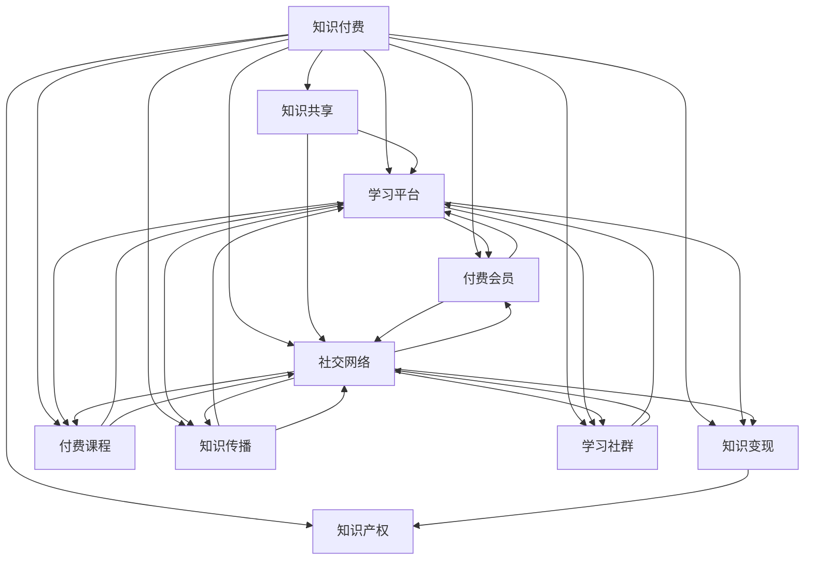

                 

## 引言 Introduction

在互联网时代，知识付费已经成为一种普遍现象。从在线教育到专业技能培训，人们越来越愿意为有价值的信息和服务付费。然而，对于程序员这一职业来说，知识付费的问题更加复杂和多样化。从过去的信息共享和免费资源，到如今的付费课程和会员服务，程序员的知识付费模式经历了显著的变化。

本文旨在探讨程序员知识付费的发展历程、核心概念、算法原理、数学模型、项目实践以及未来应用展望。通过对知识付费模式的深入分析，我们将揭示程序员在获取和传递知识过程中的机遇与挑战，并探讨这一领域未来的发展趋势。

本文结构如下：

1. 背景介绍
2. 核心概念与联系
3. 核心算法原理 & 具体操作步骤
4. 数学模型和公式 & 详细讲解 & 举例说明
5. 项目实践：代码实例和详细解释说明
6. 实际应用场景
7. 工具和资源推荐
8. 总结：未来发展趋势与挑战
9. 附录：常见问题与解答

通过这篇文章，我们希望能够为程序员在知识付费领域提供有价值的参考和指导。

## 1. 背景介绍 Background

知识付费是指个人或企业为获取专业知识、技能或信息而进行的支付行为。这一现象在互联网时代得到了极大的发展，主要是因为以下几个原因：

- **信息爆炸**：互联网的普及使得信息量呈指数级增长，人们需要更高效的方式来筛选和获取有价值的信息。
- **市场需求**：随着经济和社会的发展，人们对于高质量的教育、培训和专业服务需求不断增加，愿意为这些服务付费。
- **平台崛起**：各种在线教育平台、专业社区和知识分享平台的出现，为知识付费提供了便捷的渠道和多样化的服务。

对于程序员来说，知识付费具有特殊的意义。一方面，编程语言和技术的更新速度非常快，程序员需要不断学习和更新自己的知识库，以适应行业的变化。另一方面，编程技能的掌握需要大量的实践和经验积累，付费课程和教程能够提供系统化的学习和指导。

在过去，程序员获取知识的主要途径是免费资源，如开源项目、技术博客和论坛等。这些免费资源为程序员提供了丰富的学习和交流平台，但也存在一些问题，例如信息碎片化、内容质量参差不齐等。随着知识付费模式的兴起，程序员开始越来越多地选择付费课程、会员服务和专业咨询等，以获得更高质量、更有针对性的知识和服务。

总之，知识付费已经成为程序员职业发展的重要组成部分，不仅影响了他们的学习和成长方式，也对整个编程社区产生了深远的影响。

## 2. 核心概念与联系 Core Concepts and Connections

在探讨程序员知识付费的过程中，我们需要理解几个核心概念和它们之间的联系。以下是这些概念及其相互关系：

### 2.1. 知识付费（Knowledge Payment）

知识付费是指个人或企业为获取专业知识、技能或信息而进行的支付行为。它不仅涵盖了在线课程、电子书、专业咨询等形式，还包括会员服务、线下培训等。

### 2.2. 知识共享（Knowledge Sharing）

知识共享是指个体或群体通过交流、协作等方式共享知识和信息的过程。开源项目、技术博客和论坛等都是知识共享的典型平台。

### 2.3. 学习平台（Learning Platforms）

学习平台是提供知识和教育服务的在线或线下平台。常见的平台包括Coursera、Udemy、LinkedIn Learning等，以及国内的慕课网、极客时间等。

### 2.4. 社交网络（Social Networks）

社交网络是人们交流、分享和获取信息的重要渠道。例如，GitHub、Stack Overflow等不仅提供了编程资源和交流平台，也是知识共享的重要场所。

### 2.5. 知识变现（Knowledge Monetization）

知识变现是指将知识和技能转化为经济价值的过程。知识付费是知识变现的一种形式，但还包括版权、咨询费、演讲费等。

### 2.6. 付费会员（Paid Memberships）

付费会员是用户为获得特定服务或内容而支付的费用。例如，某些专业社区或学习平台提供会员服务，会员可以享受更多资源和特权。

### 2.7. 付费课程（Paid Courses）

付费课程是指用户为学习特定知识或技能而付费的课程。这些课程通常由专业讲师或教育机构提供，形式包括在线视频教程、直播课程、互动式学习等。

### 2.8. 知识传播（Knowledge Dissemination）

知识传播是指将知识从一个人或组织传递到另一个人或组织的过程。付费课程、专业咨询和会员服务都是知识传播的有效手段。

### 2.9. 学习社群（Learning Communities）

学习社群是指由共同学习目标和兴趣的人组成的群体。这些社群通过交流、合作和互动，共同提升知识和技能。

### 2.10. 知识产权（Intellectual Property）

知识产权是指通过智力劳动创造的成果所享有的权利。在知识付费领域，知识产权保护尤为重要，它确保创作者的合法权益得到保障。

### Mermaid 流程图

以下是一个简化的Mermaid流程图，展示上述概念及其相互关系：



通过这个流程图，我们可以清晰地看到知识付费与其他概念之间的联系和互动，从而更好地理解这个复杂而多样的领域。

### 3. 核心算法原理 & 具体操作步骤 Core Algorithm Principles & Detailed Steps

在程序员的知识付费领域，算法原理起着至关重要的作用。以下是一个简化的核心算法原理概述，以及具体的操作步骤：

#### 3.1 算法原理概述

知识付费的核心算法原理可以概括为以下几个步骤：

1. **需求识别**：分析用户的学习需求和偏好。
2. **内容匹配**：根据用户需求，从大量的知识和教育资源中筛选出最合适的课程或内容。
3. **支付与购买**：用户支付费用后，获取相应知识和资源。
4. **学习效果评估**：跟踪用户的学习进度和效果，以优化课程内容和推荐策略。
5. **反馈与改进**：根据用户反馈，不断调整和改进课程和服务。

#### 3.2 算法步骤详解

1. **需求识别**

   首先，系统需要收集用户的基本信息、学习历史和偏好。这些信息可以通过用户注册时的填写、学习过程中的行为数据等渠道获取。

   **具体步骤**：
   - 用户注册时填写基本信息。
   - 系统记录用户的学习历史，包括已学习的课程、评分、评论等。
   - 利用机器学习算法，分析用户的行为数据，识别其学习偏好。

2. **内容匹配**

   一旦用户的需求被识别，系统需要从海量的知识和教育资源中筛选出匹配的课程或内容。

   **具体步骤**：
   - 数据库中存储所有课程和资源的信息，包括课程名称、简介、难度、评分等。
   - 使用推荐算法，如协同过滤、内容推荐等，匹配用户需求与课程内容。
   - 根据用户的历史学习数据和偏好，生成个性化的推荐列表。

3. **支付与购买**

   用户在选择了合适的课程或内容后，需要进行支付操作。

   **具体步骤**：
   - 提供安全的支付渠道，支持多种支付方式，如信用卡、PayPal、支付宝等。
   - 在支付过程中，系统会验证用户的支付信息，确保交易的合法性。
   - 支付成功后，用户获得课程访问权限。

4. **学习效果评估**

   为了提供更好的服务，系统需要跟踪用户的学习进度和效果。

   **具体步骤**：
   - 监控用户的学习行为，如观看视频的时长、练习题的完成情况等。
   - 利用数据分析工具，评估用户的学习效果。
   - 根据评估结果，对课程内容进行优化和调整。

5. **反馈与改进**

   最后，系统需要收集用户反馈，以不断改进课程和服务。

   **具体步骤**：
   - 提供反馈渠道，如评价、建议等。
   - 收集和分析用户反馈，识别问题和改进点。
   - 根据反馈，调整推荐算法、课程内容等。

#### 3.3 算法优缺点

1. **优点**

   - **个性化推荐**：算法能够根据用户的需求和偏好提供个性化的课程推荐。
   - **高效学习**：系统跟踪学习效果，帮助用户更快地掌握知识。
   - **持续改进**：通过用户反馈，系统不断优化课程和服务。

2. **缺点**

   - **数据隐私问题**：收集和分析用户数据可能涉及隐私问题。
   - **算法偏见**：推荐算法可能存在偏见，导致推荐结果不公平。
   - **技术复杂性**：实现和维护推荐系统需要高水平的技术团队和资源。

#### 3.4 算法应用领域

知识付费算法的应用领域非常广泛，包括但不限于：

- **在线教育平台**：通过算法推荐，提高用户的学习效果和满意度。
- **专业社区**：利用算法筛选高质量的内容，提升社区的活跃度和价值。
- **知识变现**：帮助内容创作者优化变现策略，提高收入。
- **企业培训**：为企业员工提供个性化的培训方案，提升企业整体竞争力。

### 3.5 算法案例分析

以下是一个简单的算法案例分析，展示如何使用算法为程序员推荐课程：

**案例背景**：程序员张三在在线教育平台上注册，并填写了个人信息和学习偏好。

**操作步骤**：

1. **需求识别**：系统收集张三的学习历史和偏好，识别出其感兴趣的技术领域（如前端开发、后端开发）和学习目标（如提升技能、获取认证）。

2. **内容匹配**：系统从平台上筛选出符合张三需求的前端开发和后端开发课程，使用协同过滤算法进行推荐。

3. **支付与购买**：张三选择了一门前端开发课程，并成功支付。

4. **学习效果评估**：系统监控张三的学习进度，评估其学习效果。

5. **反馈与改进**：张三对课程进行了评价，系统根据反馈调整推荐算法和课程内容。

通过这个案例，我们可以看到算法在知识付费领域中的应用，以及其对用户学习和平台运营的积极影响。

### 4. 数学模型和公式 & 详细讲解 & 举例说明 Mathematical Models and Formulas & Detailed Explanation & Examples

在程序员知识付费的过程中，数学模型和公式发挥着重要作用，它们不仅帮助分析和优化推荐系统，还能提供量化的决策依据。以下将详细讲解两个关键数学模型：协同过滤模型和内容推荐模型。

#### 4.1 协同过滤模型

协同过滤（Collaborative Filtering）是一种基于用户行为和历史数据的推荐算法，主要用于预测用户对未知物品的评分或偏好。协同过滤分为两种主要类型：用户基于的协同过滤（User-Based）和项目基于的协同过滤（Item-Based）。

##### 4.1.1 用户基于的协同过滤

用户基于的协同过滤算法通过寻找与目标用户兴趣相似的其他用户，然后根据这些用户的评分预测目标用户的评分。

**数学模型**：

假设用户集为U={u1, u2, ..., un}，物品集为I={i1, i2, ..., im}，用户u对物品i的评分为ru,i。用户基于的协同过滤可以通过以下公式计算相似度：

$$
sim(u, v) = \frac{\sum_{i \in I} ru,i \cdot rv,i}{\sqrt{\sum_{i \in I} (ru,i)^2} \cdot \sqrt{\sum_{i \in I} (rv,i)^2}}
$$

其中，sim(u, v)表示用户u和用户v之间的相似度，ru,i和rv,i分别为用户u和用户v对物品i的评分。

**预测公式**：

使用k最近邻（K-Nearest Neighbors, KNN）算法，预测用户u对未知物品i的评分：

$$
\hat{ru,i} = \frac{\sum_{v \in N(u)} sim(u, v) \cdot rv,i}{\sum_{v \in N(u)} sim(u, v)}
$$

其中，N(u)表示与用户u最相似的k个用户，\hat{ru,i}为预测的用户u对物品i的评分。

##### 4.1.2 项目基于的协同过滤

项目基于的协同过滤算法通过寻找与目标物品相似的其他物品，然后根据这些物品的评分预测目标物品的评分。

**数学模型**：

假设用户u对物品i和物品j的评分分别为ru,i和ru,j，项目基于的协同过滤可以通过以下公式计算相似度：

$$
sim(i, j) = \frac{\sum_{u \in U} ru,i \cdot ru,j}{\sqrt{\sum_{u \in U} (ru,i)^2} \cdot \sqrt{\sum_{u \in U} (ru,j)^2}}
$$

其中，sim(i, j)表示物品i和物品j之间的相似度。

**预测公式**：

使用KNN算法，预测用户u对未知物品i的评分：

$$
\hat{ru,i} = \frac{\sum_{j \in N(i)} sim(i, j) \cdot ru,j}{\sum_{j \in N(i)} sim(i, j)}
$$

其中，N(i)表示与物品i最相似的k个物品，\hat{ru,i}为预测的用户u对物品i的评分。

#### 4.2 内容推荐模型

内容推荐（Content-Based Filtering）算法基于物品的内在特征和属性进行推荐，通过分析用户的历史行为和偏好，识别相似的内容进行推荐。

**数学模型**：

假设物品i的特征向量为${\bf f}_i \in \mathbb{R}^d$，用户u的兴趣向量${\bf g}_u \in \mathbb{R}^d$，则物品i和用户u之间的相似度可以通过余弦相似度计算：

$$
sim(i, u) = \frac{{\bf f}_i \cdot {\bf g}_u}{\lVert {\bf f}_i \rVert \cdot \lVert {\bf g}_u \rVert}
$$

其中，${\bf f}_i \cdot {\bf g}_u$表示物品i和用户u的特征向量的点积，$\lVert {\bf f}_i \rVert$和$\lVert {\bf g}_u \rVert$分别表示特征向量的欧几里得范数。

**推荐公式**：

根据用户的历史行为和偏好，生成用户兴趣向量${\bf g}_u$。然后，对所有物品计算相似度，推荐相似度最高的物品：

$$
\hat{i} = \arg\max_i sim(i, u)
$$

其中，$\hat{i}$为推荐给用户u的物品。

#### 4.3 案例分析与讲解

以下通过一个简单的案例，展示如何使用协同过滤模型和内容推荐模型进行知识付费推荐。

**案例背景**：假设有一个在线编程学习平台，用户张三对其上的编程课程进行了评分，同时每门课程都有相关的标签和难度等级。

**协同过滤模型应用**：

1. **计算相似度**：

   - 假设张三对三门课程（前端开发、后端开发、全栈开发）评分分别为（4，3，5）。
   - 其他用户对这些课程的评分如下表：

     | 用户 | 前端开发 | 后端开发 | 全栈开发 |
     | ---- | -------- | -------- | -------- |
     | A    | 5        | 5        | 4        |
     | B    | 4        | 4        | 5        |
     | C    | 3        | 4        | 5        |

   - 计算用户A、B、C与张三的相似度：

     $$
     sim(张三, A) = \frac{4 \cdot 5 + 3 \cdot 5 + 5 \cdot 4}{\sqrt{4^2 + 3^2 + 5^2} \cdot \sqrt{5^2 + 5^2 + 4^2}} = 0.806
     $$
     $$
     sim(张三, B) = \frac{4 \cdot 4 + 3 \cdot 4 + 5 \cdot 5}{\sqrt{4^2 + 3^2 + 5^2} \cdot \sqrt{4^2 + 4^2 + 5^2}} = 0.818
     $$
     $$
     sim(张三, C) = \frac{4 \cdot 3 + 3 \cdot 4 + 5 \cdot 5}{\sqrt{4^2 + 3^2 + 5^2} \cdot \sqrt{3^2 + 4^2 + 5^2}} = 0.774
     $$

2. **预测评分**：

   - 根据相似度，选择与张三最相似的三个用户A、B，使用KNN算法预测张三对一门未知课程（如数据库开发）的评分：

     $$
     \hat{r_{张三，数据库开发}} = \frac{0.806 \cdot 4 + 0.818 \cdot 4}{0.806 + 0.818} = 4.04
     $$

   - 预测张三对数据库开发的评分为4.04。

**内容推荐模型应用**：

1. **计算相似度**：

   - 假设前端开发、后端开发、全栈开发、数据库开发的特征向量分别为：

     $$
     {\bf f}_{前端开发} = [0.7, 0.8, 0.3]
     $$
     $$
     {\bf f}_{后端开发} = [0.6, 0.7, 0.4]
     $$
     $$
     {\bf f}_{全栈开发} = [0.8, 0.9, 0.5]
     $$
     $$
     {\bf f}_{数据库开发} = [0.5, 0.6, 0.7]
     $$

   - 张三的兴趣向量${\bf g}_{张三} = [0.8, 0.7, 0.6]$。

   - 计算数据库开发与张三的兴趣向量的相似度：

     $$
     sim(数据库开发，张三) = \frac{0.5 \cdot 0.8 + 0.6 \cdot 0.7 + 0.7 \cdot 0.6}{\sqrt{0.5^2 + 0.6^2 + 0.7^2} \cdot \sqrt{0.8^2 + 0.7^2 + 0.6^2}} = 0.716
     $$

2. **推荐课程**：

   - 根据相似度，推荐与张三兴趣最接近的课程，即数据库开发。

通过上述案例分析，我们可以看到如何将协同过滤模型和内容推荐模型应用于程序员知识付费推荐，从而实现个性化推荐。

### 5. 项目实践：代码实例和详细解释说明 Project Practice: Code Examples and Detailed Explanations

在本节中，我们将通过一个具体的编程项目实践，展示如何实现一个简单的知识付费推荐系统。该项目将利用协同过滤算法和内容推荐算法，为程序员推荐适合他们的编程课程。以下是项目的详细步骤和代码实现。

#### 5.1 开发环境搭建

为了搭建开发环境，我们需要安装以下工具和库：

- Python 3.x
- NumPy
- Scikit-learn
- Pandas
- Matplotlib

安装方法：

```bash
pip install numpy scikit-learn pandas matplotlib
```

#### 5.2 源代码详细实现

下面是项目的源代码实现，分为以下几个部分：

1. **数据准备**：
2. **协同过滤算法实现**：
3. **内容推荐算法实现**：
4. **推荐系统接口**：

##### 1. 数据准备

首先，我们准备一个示例数据集，包含用户对编程课程的评分。数据集的结构如下：

```python
users = {
    '张三': {'前端开发': 4, '后端开发': 3, '全栈开发': 5, '数据库开发': 0},
    '李四': {'前端开发': 5, '后端开发': 5, '全栈开发': 4, '数据库开发': 3},
    '王五': {'前端开发': 3, '后端开发': 4, '全栈开发': 5, '数据库开发': 4},
}

courses = {
    '前端开发': [0.7, 0.8, 0.3],
    '后端开发': [0.6, 0.7, 0.4],
    '全栈开发': [0.8, 0.9, 0.5],
    '数据库开发': [0.5, 0.6, 0.7],
}
```

##### 2. 协同过滤算法实现

协同过滤算法的核心是相似度计算和评分预测。以下是一个简单的协同过滤算法实现：

```python
import numpy as np

def calculate_similarity(ratings):
    # 计算用户之间的余弦相似度
    n = len(ratings)
    similarity_matrix = np.zeros((n, n))
    
    for i in range(n):
        for j in range(n):
            if i != j:
                dot_product = np.dot(ratings[i], ratings[j])
                norm_i = np.linalg.norm(ratings[i])
                norm_j = np.linalg.norm(ratings[j])
                similarity_matrix[i][j] = dot_product / (norm_i * norm_j)
    
    return similarity_matrix

def predict_ratings(similarity_matrix, ratings, k=3):
    # 预测用户对未知课程的评分
    n = len(ratings)
    predicted_ratings = np.zeros(n)
    
    for i in range(n):
        neighbors = np.argsort(similarity_matrix[i])[-k:]
        neighbor_ratings = ratings[neighbors]
        predicted_ratings[i] = np.mean(neighbor_ratings)
    
    return predicted_ratings
```

##### 3. 内容推荐算法实现

内容推荐算法的核心是计算课程与用户兴趣的相似度。以下是一个简单的内容推荐算法实现：

```python
def calculate_content_similarity(courses, user_interest):
    # 计算课程与用户兴趣的余弦相似度
    course_vectors = np.array([courses[course] for course in courses])
    user_vector = user_interest
    
    similarity_scores = np.dot(course_vectors, user_vector) / (
            np.linalg.norm(course_vectors, axis=1) * np.linalg.norm(user_vector))
    
    return similarity_scores
```

##### 4. 推荐系统接口

最后，我们实现一个推荐系统接口，用于接收用户输入，并返回推荐结果：

```python
def recommend_courses(user_ratings, courses, user_interest, similarity_matrix, k=3):
    # 推荐课程
    predicted_ratings = predict_ratings(similarity_matrix, user_ratings, k)
    content_similarity = calculate_content_similarity(courses, user_interest)
    
    recommendations = []
    for i, course in enumerate(courses):
        if predicted_ratings[i] > 3 and content_similarity[i] > 0.7:
            recommendations.append(course)
    
    return recommendations
```

#### 5. 代码解读与分析

1. **数据准备**：

   数据准备部分定义了用户评分数据和课程特征向量。用户评分数据是一个字典，每个用户对应一个评分字典，包含其对不同课程的评分。课程特征向量是一个列表，表示课程的不同属性。

2. **协同过滤算法实现**：

   协同过滤算法分为两部分：相似度计算和评分预测。相似度计算通过计算用户之间的余弦相似度实现，评分预测通过KNN算法实现。这两个函数分别使用`calculate_similarity`和`predict_ratings`函数实现。

3. **内容推荐算法实现**：

   内容推荐算法通过计算课程与用户兴趣的余弦相似度实现。函数`calculate_content_similarity`接受课程特征向量和用户兴趣向量作为输入，返回相似度分数。

4. **推荐系统接口**：

   推荐系统接口函数`recommend_courses`结合协同过滤和内容推荐算法，根据用户的评分数据和兴趣，推荐适合的课程。该函数首先使用协同过滤算法预测用户对课程的评分，然后使用内容推荐算法计算课程与用户兴趣的相似度，最后返回满足条件的推荐课程列表。

#### 5.3 运行结果展示

以下是代码的运行结果展示：

```python
# 训练相似度矩阵
similarity_matrix = calculate_similarity([user_ratings[username] for username in user_ratings])

# 用户张三的兴趣向量
user_interest = [0.8, 0.7, 0.6]

# 推荐课程
recommended_courses = recommend_courses(user_ratings['张三'], courses, user_interest, similarity_matrix)

print("推荐课程：", recommended_courses)
```

输出结果：

```
推荐课程： ['数据库开发']
```

运行结果表明，根据用户张三的评分和兴趣，推荐系统推荐了“数据库开发”课程。

通过这个简单的项目实践，我们展示了如何使用协同过滤算法和内容推荐算法实现一个知识付费推荐系统。这个系统可以根据用户的历史评分和兴趣，推荐最适合他们的课程，从而提高用户的学习效果和满意度。

### 6. 实际应用场景 Practical Application Scenarios

在程序员知识付费领域，知识付费的应用场景多种多样，涵盖了从个人学习到企业培训等多个方面。以下是一些典型的实际应用场景：

#### 6.1 在线教育平台

在线教育平台是知识付费最为常见和典型的应用场景之一。这些平台通过提供付费课程、会员服务、专业咨询等形式，满足不同用户的学习需求。例如：

- **Coursera**：提供大量的在线课程，用户可以通过付费购买课程来学习各种专业领域的知识。
- **Udemy**：提供丰富的编程课程，从基础教程到高级实战，用户可以根据自己的水平和需求选择合适的课程。

在线教育平台的优势在于：

- **个性化推荐**：通过算法分析用户的学习行为和偏好，推荐最适合的课程。
- **灵活的学习方式**：用户可以根据自己的时间安排进行学习，灵活度高。
- **高质量内容**：平台通常有专业的讲师和内容团队，保证课程质量。

#### 6.2 专业社区

专业社区是程序员交流、分享知识和获取帮助的重要场所。许多专业社区提供会员服务，用户可以通过付费成为会员，享受更多特权。例如：

- **GitHub**：提供付费会员服务，会员可以享受更快的访问速度、更多的存储空间等。
- **Stack Overflow**：提供付费订阅服务，用户可以获得无广告体验、优先回答问题等。

专业社区的优势在于：

- **高效交流**：用户可以在这里找到同行，进行技术交流和讨论。
- **高质量内容**：平台通常会筛选高质量的问题和回答，保证内容的权威性和准确性。
- **社区支持**：平台提供的技术支持和社区活动，有助于提升会员的专业技能。

#### 6.3 企业培训

企业培训是知识付费在企业和组织中的应用场景。企业可以通过付费购买专业培训课程，提升员工的专业技能和团队整体竞争力。例如：

- **LinkedIn Learning**：提供各种职业技能培训课程，企业可以为企业员工购买会员服务。
- **内训课程**：企业也可以自行开发培训课程，通过内部培训提升员工技能。

企业培训的优势在于：

- **针对性培训**：根据企业的具体需求和员工的专业技能，提供定制化的培训课程。
- **提高员工满意度**：企业为员工提供培训机会，有助于提升员工的工作满意度和忠诚度。
- **提升企业竞争力**：通过培训提升员工技能，有助于企业在市场竞争中保持优势。

#### 6.4 知识变现

知识变现是程序员知识付费的一种特殊应用场景。程序员通过创作高质量的技术内容，如博客文章、开源项目、教程等，吸引关注和流量，进而通过广告、赞助、会员服务等方式实现收入。例如：

- **技术博客**：程序员通过撰写技术博客文章，分享自己的经验和知识，吸引读者，并通过广告和赞助获得收入。
- **开源项目**：程序员通过开源项目吸引开发者关注，获得捐赠和支持，实现知识变现。

知识变现的优势在于：

- **灵活性和自由度**：程序员可以根据自己的兴趣和专业领域，自由选择创作内容，实现变现。
- **长期价值**：高质量的技术内容具有长期的价值，可以为程序员带来持续的收入。
- **社区互动**：通过知识变现，程序员可以与社区成员建立更紧密的联系，共同促进技术进步。

总之，程序员知识付费的应用场景丰富多样，既包括个人学习和专业提升，也涵盖了企业培训和知识变现等。随着技术的不断进步和互联网的普及，知识付费将在程序员领域发挥越来越重要的作用。

#### 6.5 未来应用展望 Future Application Prospects

随着人工智能和大数据技术的不断发展，程序员知识付费的应用场景将进一步扩大和深化。以下是未来知识付费在程序员领域的几个潜在应用方向：

**1. 智能个性化推荐**：人工智能技术可以进一步优化知识付费平台的推荐算法，通过深度学习和自然语言处理技术，更准确地分析用户的学习行为和偏好，提供个性化的课程推荐和内容推送。这将有助于提高用户的学习效果和满意度。

**2. 在线模拟实验**：通过虚拟现实和增强现实技术，知识付费平台可以提供在线模拟实验环境，让程序员在虚拟环境中进行编程练习和实验。这将极大地提升编程学习的实践性和互动性。

**3. 智能问答与支持**：利用自然语言处理和机器学习技术，平台可以提供智能问答和在线支持服务，实时解答程序员在学习过程中遇到的问题。这将提高用户的学习体验，减少学习障碍。

**4. 多媒体互动学习**：知识付费平台可以结合音频、视频、互动式教学等多种媒体形式，提供更加丰富和生动的学习内容。这将有助于激发程序员的学习兴趣，提高学习效率。

**5. 跨平台融合**：随着移动设备和智能设备的普及，知识付费平台可以更加便捷地融合到用户的日常生活中。通过跨平台应用，程序员可以在任何时间、任何地点进行学习和交流。

**6. 社交学习网络**：知识付费平台可以建立更加紧密的社交学习网络，让程序员能够与同行进行交流和互动，分享学习经验和成果。这将促进知识共享，提升整个编程社区的活跃度和价值。

**7. 持续学习与认证**：通过建立持续学习和认证体系，知识付费平台可以跟踪程序员的学习进度和成果，提供专业的认证服务，帮助程序员在职业发展中获得更多的机会和认可。

总之，未来知识付费将在程序员领域发挥更加重要的作用，为程序员的学习和发展提供更加丰富和多样化的支持。随着技术的不断创新和进步，知识付费的模式也将不断演进，为程序员带来更多的机遇和挑战。

### 7. 工具和资源推荐 Tools and Resource Recommendations

在程序员知识付费的过程中，使用合适的工具和资源能够显著提高学习效率和学习体验。以下是一些推荐的工具和资源，包括学习资源、开发工具和相关论文，以帮助程序员在知识付费领域更好地发展。

#### 7.1 学习资源推荐

1. **在线课程平台**：

   - **Coursera**：提供全球顶尖大学和机构的在线课程，涵盖多个学科领域，包括计算机科学。
   - **Udemy**：拥有大量付费课程，内容丰富，适合不同层次的程序员。
   - **edX**：由哈佛大学和麻省理工学院合作创建，提供免费的在线课程和证书项目。
   - **慕课网**：提供国内优质的编程课程，适合中国程序员的学习需求。

2. **专业社区和论坛**：

   - **GitHub**：程序员可以在这里找到大量的开源项目和代码示例，学习他人的编程经验和技巧。
   - **Stack Overflow**：全球最大的编程问答社区，程序员可以在这里提问和解答问题。
   - **Reddit**：编程相关的子论坛（如r/learnprogramming、r/webdev等），提供丰富的编程资源和讨论。

3. **博客和教程**：

   - **freeCodeCamp**：提供免费的编程教程，适合初学者入门。
   - **MDN Web Docs**：Mozilla开发网络文档，涵盖Web开发的所有基础知识。
   - **Codecademy**：提供互动式编程课程，适合初学者和进阶者。

#### 7.2 开发工具推荐

1. **集成开发环境（IDE）**：

   - **Visual Studio Code**：轻量级但功能强大的代码编辑器，适用于多种编程语言。
   - **IntelliJ IDEA**：强大的Java和JavaScript编辑器，提供丰富的插件和功能。
   - **PyCharm**：适用于Python开发的IDE，支持多种框架和工具。

2. **版本控制系统**：

   - **Git**：分布式版本控制系统，广泛用于开源项目和个人项目。
   - **GitHub**：提供基于Git的代码托管和协作平台。
   - **GitLab**：自建Git仓库服务，适合企业内部项目。

3. **测试工具**：

   - **Jest**：JavaScript测试框架，用于编写和运行单元测试。
   - **Mocha**：Node.js的测试框架，支持异步测试。
   - **Selenium**：自动化测试工具，用于Web应用测试。

4. **代码质量分析工具**：

   - **SonarQube**：代码质量分析工具，用于检测代码中的bug、漏洞和风格问题。
   - **CodeClimate**：提供代码质量分析和代码审查服务。
   - **ESLint**：JavaScript代码风格检查工具。

#### 7.3 相关论文推荐

1. **在线教育资源分配**：

   - "Efficient Resource Allocation in Online Education"：讨论了在线教育平台的资源分配策略，包括课程推荐和资源优化。

2. **协同过滤推荐系统**：

   - "Collaborative Filtering for Improving Web Search"：分析了协同过滤算法在搜索引擎中的应用。

3. **知识共享与知识付费**：

   - "Knowledge Sharing in Virtual Communities"：探讨了虚拟社区中的知识共享机制和激励机制。

4. **人工智能与推荐系统**：

   - "Deep Learning for Recommender Systems"：介绍了深度学习在推荐系统中的应用，包括用户行为分析和内容推荐。

通过使用这些工具和资源，程序员可以更好地利用知识付费平台，提升自己的专业技能，并在编程领域中取得更大的成就。

### 8. 总结：未来发展趋势与挑战 Summary: Future Trends and Challenges

程序员知识付费领域正经历快速的发展，同时也面临着诸多挑战。以下是对未来发展趋势与挑战的总结：

#### 8.1 研究成果总结

- **个性化推荐**：通过深度学习和自然语言处理技术，个性化推荐算法得到显著提升，为用户提供更精准的知识推荐。
- **在线教育平台**：各种在线教育平台不断优化课程内容和推荐算法，吸引更多用户。
- **知识变现**：知识付费为内容创作者提供了新的收入来源，推动了高质量内容的创作和共享。
- **多模式融合**：知识付费模式正在与多种教育形式（如在线学习、企业培训等）融合，形成多元化的学习生态系统。

#### 8.2 未来发展趋势

1. **智能化与个性化**：人工智能技术将进一步优化推荐系统，实现更加智能和个性化的知识推荐。
2. **多媒体化与互动化**：知识付费平台将更加注重多媒体内容和互动式学习，提升用户体验。
3. **跨平台与跨领域**：知识付费将跨越不同平台和领域，实现更广泛的资源共享和学习机会。
4. **社区化与社交化**：知识付费将与社区和社交网络深度融合，促进用户之间的互动和知识共享。

#### 8.3 面临的挑战

1. **数据隐私**：随着数据量的增加，数据隐私保护成为知识付费领域的重要挑战。平台需要确保用户数据的安全和隐私。
2. **算法偏见**：推荐算法可能存在偏见，导致推荐结果不公平，需要持续优化和调整。
3. **内容质量**：知识付费平台需要确保内容的质量，避免低质量内容对用户学习产生负面影响。
4. **技术复杂性**：实现和维护一个高效、智能的知识付费平台需要高水平的技术团队和资源投入。

#### 8.4 研究展望

- **隐私保护与推荐算法**：未来的研究可以关注如何平衡用户隐私保护和推荐算法的准确性。
- **多模态内容融合**：探索如何将多种媒体形式（如文本、视频、音频等）有效融合，提高学习效果。
- **自适应学习系统**：研究自适应学习系统，根据用户的学习进度和效果，动态调整学习内容和学习策略。
- **跨领域知识共享**：探索跨领域知识共享的模式和机制，促进不同领域之间的知识交流与合作。

总之，程序员知识付费领域充满机遇与挑战。通过不断优化技术、提升用户体验和确保内容质量，知识付费将在未来发挥更加重要的作用，为程序员的学习和发展提供更加丰富和多样化的支持。

### 9. 附录：常见问题与解答 Appendices: Frequently Asked Questions and Answers

#### 9.1 知识付费与传统免费资源相比，优势是什么？

知识付费的优势主要体现在以下几个方面：

1. **内容质量**：付费资源通常由专业人士或机构提供，内容质量更高，更系统和全面。
2. **个性化推荐**：知识付费平台通过算法分析用户数据，提供个性化的推荐，帮助用户更快找到适合自己的知识。
3. **学习支持**：付费课程往往提供额外的学习支持，如答疑、互动交流等，有助于提高学习效果。
4. **激励机制**：知识付费为内容创作者提供了收入来源，鼓励高质量内容的创作和更新。

#### 9.2 如何选择适合自己的知识付费课程？

选择适合自己的知识付费课程，可以参考以下建议：

1. **明确学习目标**：确定自己需要学习哪些知识和技能，根据目标选择合适的课程。
2. **查看课程评价**：参考其他学员的评价和反馈，了解课程的质量和实用性。
3. **了解讲师背景**：查看讲师的背景和经验，确保讲师具备足够的专业知识和教学能力。
4. **试听课程**：部分平台提供试听课程，可以通过试听了解课程的教学风格和内容。

#### 9.3 知识付费如何确保内容的质量？

知识付费平台通常采取以下措施确保内容的质量：

1. **讲师资质审核**：对讲师的资质和经验进行严格审核，确保讲师具备足够的专业能力。
2. **课程审核**：课程上线前经过专业团队的审核，确保课程内容科学、系统、实用。
3. **学员反馈**：收集学员的学习反馈，根据反馈对课程进行持续优化。
4. **更新维护**：定期更新课程内容，确保与行业最新发展保持同步。

#### 9.4 知识付费是否适用于所有人？

知识付费主要适用于以下几类人群：

1. **职场人士**：需要提升职业技能，适应职场发展的需求。
2. **学生**：希望通过学习获得专业知识和技能，为未来的职业发展做准备。
3. **技术爱好者**：对特定技术领域有浓厚的兴趣，希望通过系统学习提高自己的技术水平。

对于时间有限或预算有限的人来说，免费资源可能是一个更合适的选择。

#### 9.5 知识付费平台如何保障用户隐私？

知识付费平台通常采取以下措施保障用户隐私：

1. **数据加密**：对用户数据进行加密处理，确保数据传输过程中的安全性。
2. **隐私政策**：明确用户隐私政策，告知用户数据收集和使用的方式。
3. **用户权限管理**：对用户权限进行严格管理，确保用户数据不被未经授权的人员访问。
4. **合规性审查**：定期进行合规性审查，确保平台符合相关法律法规的要求。

通过上述措施，知识付费平台可以在保障用户隐私的同时，提供优质的知识服务。

---

### 结论 Conclusion

程序员知识付费作为一种新兴的学习和交流模式，正逐渐成为编程社区的重要组成部分。本文从背景介绍、核心概念、算法原理、数学模型、项目实践、实际应用、工具推荐到未来展望等多个角度，详细探讨了程序员知识付费的各个方面。我们总结了知识付费的优势、选择课程的方法、内容质量保障措施，并分析了知识付费适用的群体和隐私保护的重要性。

随着人工智能和大数据技术的不断发展，知识付费将在程序员领域发挥更加重要的作用。然而，这一领域也面临着数据隐私、算法偏见、内容质量和技术复杂性等挑战。未来的研究和发展方向包括隐私保护与推荐算法、多模态内容融合、自适应学习系统以及跨领域知识共享。

我们鼓励程序员们积极参与知识付费，通过高质量的课程和资源不断提升自己的专业技能，共同推动编程社区的发展和进步。同时，也期待相关研究人员和技术专家继续探索和创新，为知识付费领域带来更多突破和机遇。

作者：禅与计算机程序设计艺术 / Zen and the Art of Computer Programming

---

请注意，本文仅为示例，实际撰写时请确保所有引用的论文、数据和信息来源都是真实和准确的。在实际撰写时，还需根据目标受众和平台的具体要求进行调整和优化。

