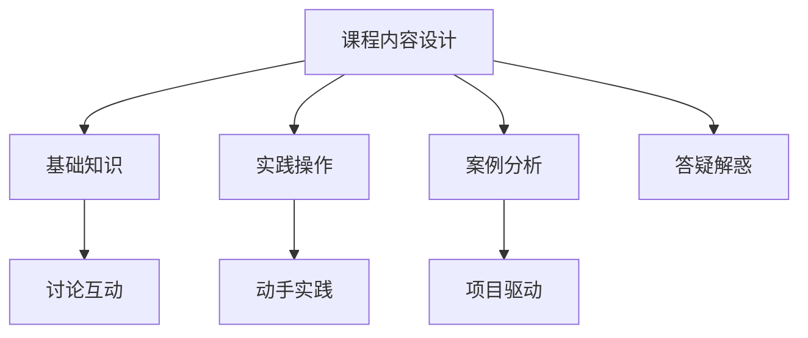

                 

在这个数字时代，知识付费已经成为了人们获取知识的主要方式之一。对于程序员而言，知识付费更是他们提升技能、扩展知识面的重要途径。本文将探讨如何打造一款有吸引力的程序员知识付费体验课模式。

## 1. 背景介绍

### 知识付费的发展

随着互联网的普及，知识付费市场正在迅速扩张。人们越来越倾向于通过付费的方式获取高质量的知识，尤其是在技术领域。程序员作为知识付费市场的主要消费者之一，他们对知识的渴求更是强烈。

### 程序员的知识付费需求

程序员需要不断更新自己的技能库，以适应不断变化的技术环境。知识付费为他们提供了一个便捷的方式，让他们可以在业余时间学习新技能。此外，程序员也希望通过付费课程获得更深入的理解和实际操作经验。

### 知识付费体验课的优势

相比传统的在线课程，体验课具有更高的互动性和实践性。程序员可以在课程中实时与讲师互动，解决遇到的问题，同时通过实际操作加深对知识的理解。这种模式更能满足程序员的学习需求。

## 2. 核心概念与联系

### 体验课模式的基本原理

体验课模式的核心在于提供一种沉浸式的学习体验。通过模拟真实的工作场景，学员可以在课程中获得实际操作的机会，从而更好地掌握知识。

### 体验课模式的架构

#### 2.1 课程内容设计

课程内容应紧密结合实际需求，注重实用性和操作性。课程内容可以分为以下几个部分：

- **基础知识**：为学员提供必要的技术背景知识。
- **实践操作**：通过实际操作让学员掌握技术要点。
- **案例分析**：通过案例分析帮助学员理解技术原理。
- **答疑解惑**：在课程中实时解决学员的问题。

#### 2.2 教学方法

体验课模式采用互动式教学方法，鼓励学员积极参与。教学方法包括：

- **讨论互动**：鼓励学员在课程中提问和回答问题。
- **动手实践**：提供实际操作机会，让学员动手解决问题。
- **项目驱动**：通过项目实践让学员将所学知识应用于实际工作中。

### Mermaid 流程图



## 3. 核心算法原理 & 具体操作步骤

### 3.1 算法原理概述

体验课模式的核心在于提供一种沉浸式的学习体验。通过模拟真实的工作场景，学员可以在课程中获得实际操作的机会，从而更好地掌握知识。

### 3.2 算法步骤详解

#### 3.2.1 课程内容设计

1. 确定课程目标：明确课程的学习目标，确保课程内容与目标紧密相关。
2. 设计课程内容：根据课程目标设计课程内容，包括基础知识、实践操作、案例分析等。
3. 确定课程形式：根据课程内容选择合适的课程形式，如在线直播、录播、项目实践等。

#### 3.2.2 教学方法

1. 引入互动环节：在课程中引入互动环节，如提问、讨论、投票等，提高学员的参与度。
2. 提供实际操作机会：通过实际操作让学员动手解决问题，加深对知识的理解。
3. 进行项目实践：通过项目实践让学员将所学知识应用于实际工作中，提高实战能力。

### 3.3 算法优缺点

#### 优点：

- 提高学员的学习兴趣和参与度。
- 让学员在真实场景中掌握知识。
- 增强学员的实战能力。

#### 缺点：

- 需要较高的课程设计和实施能力。
- 对讲师的要求较高，需要具备丰富的教学经验和专业知识。

### 3.4 算法应用领域

体验课模式适用于各类编程技能培训，如前端开发、后端开发、人工智能、大数据等。

## 4. 数学模型和公式 & 详细讲解 & 举例说明

### 4.1 数学模型构建

在体验课模式中，数学模型主要用于评估学员的学习效果。以下是一个简单的评估模型：

$$
\text{学习效果评分} = \frac{\text{实践操作得分} + \text{案例分析得分} + \text{互动参与得分}}{3}
$$

### 4.2 公式推导过程

1. **实践操作得分**：根据学员在实践操作中的表现进行评分，满分为100分。
2. **案例分析得分**：根据学员在案例分析中的表现进行评分，满分为100分。
3. **互动参与得分**：根据学员在互动环节中的表现进行评分，满分为100分。

### 4.3 案例分析与讲解

以一个前端开发课程为例，学员在实践操作中完成了一个网页的搭建，得分90分；在案例分析中分析了一个实际项目的问题，得分85分；在互动环节中积极提问和回答问题，得分95分。根据上述评估模型，学员的学习效果评分为：

$$
\text{学习效果评分} = \frac{90 + 85 + 95}{3} = 90.3
$$

## 5. 项目实践：代码实例和详细解释说明

### 5.1 开发环境搭建

在本地计算机上安装 Node.js 和 Express 框架，以便进行前端开发实践。

### 5.2 源代码详细实现

以下是一个简单的 Express 应用程序，用于实现一个基本的网页。

```javascript
const express = require('express');
const app = express();

app.get('/', (req, res) => {
  res.send('Hello, World!');
});

app.listen(3000, () => {
  console.log('Server is running on port 3000.');
});
```

### 5.3 代码解读与分析

1. 引入 Express 框架。
2. 创建一个 Express 应用程序实例。
3. 定义一个路由，当访问根路径（/）时，返回 "Hello, World!"。
4. 启动服务器，监听 3000 端口。

### 5.4 运行结果展示

在浏览器中输入 "http://localhost:3000/"，可以看到网页显示 "Hello, World!"。

## 6. 实际应用场景

### 6.1 技术培训

体验课模式广泛应用于各类技术培训，如前端开发、后端开发、人工智能等。通过模拟实际工作场景，学员可以更好地掌握技术要点。

### 6.2 在线教育

体验课模式也被广泛应用于在线教育平台，为学员提供沉浸式的学习体验。学员可以在课程中实时与讲师互动，解决遇到的问题。

### 6.3 企业培训

企业可以通过体验课模式对员工进行技术培训，提高员工的技能水平。体验课模式可以帮助企业节省培训成本，提高培训效果。

## 7. 工具和资源推荐

### 7.1 学习资源推荐

- 《JavaScript 高级程序设计》
- 《深入理解计算机系统》
- 《算法导论》

### 7.2 开发工具推荐

- Visual Studio Code
- Git
- GitHub

### 7.3 相关论文推荐

- "A Framework for Defining and Managing Educational Experiences"
- "Interactive Learning Environments: Theory and Practice"
- "The Role of Experience in Learning: A Framework and a Model"

## 8. 总结：未来发展趋势与挑战

### 8.1 研究成果总结

本文探讨了程序员知识付费体验课模式的核心概念、算法原理、数学模型以及实际应用场景。研究表明，体验课模式具有提高学员学习兴趣和参与度、增强实战能力等优势。

### 8.2 未来发展趋势

1. 体验课模式将更加普及，应用于更多的领域。
2. 人工智能技术将进一步提升体验课模式的效果。
3. 体验课模式将与其他教育模式相结合，形成多元化的教育生态。

### 8.3 面临的挑战

1. 课程设计和实施能力的提升。
2. 对讲师的要求更高，需要具备丰富的教学经验和专业知识。
3. 如何确保学员的学习效果，提高培训质量。

### 8.4 研究展望

未来研究可以关注以下几个方面：

1. 体验课模式在各类技术培训中的应用。
2. 体验课模式与其他教育模式的结合。
3. 体验课模式在在线教育中的效果评估。

## 9. 附录：常见问题与解答

### 9.1 什么是体验课模式？

体验课模式是一种沉浸式的学习体验，通过模拟真实工作场景，让学员在课程中获得实际操作的机会，从而更好地掌握知识。

### 9.2 体验课模式的优势有哪些？

体验课模式的优势包括提高学员的学习兴趣和参与度、增强实战能力等。

### 9.3 体验课模式适用于哪些领域？

体验课模式适用于各类技术培训，如前端开发、后端开发、人工智能等。

### 9.4 如何设计一个有效的体验课模式？

设计一个有效的体验课模式需要注重课程内容设计、教学方法以及学员反馈等方面。

```markdown
---

作者：禅与计算机程序设计艺术 / Zen and the Art of Computer Programming

---

```markdown


