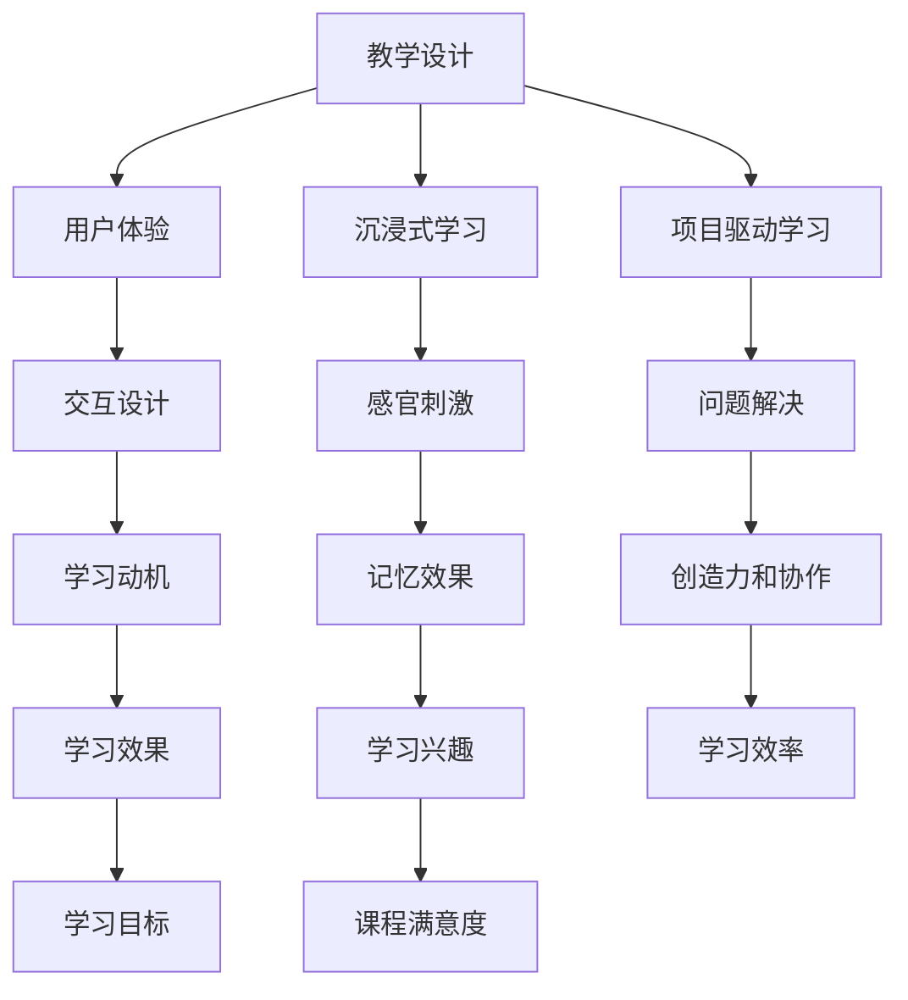

                 

关键词：知识付费、程序员、在线教育、体验课程、教学设计、用户参与

> 摘要：本文深入探讨了程序员在知识付费领域通过打造体验课程提升教学效果和用户满意度的策略。从核心概念、算法原理、数学模型，到项目实践，以及工具和资源推荐，本文全面解析了构建优质程序员课程的方法和技巧，为教育从业者提供了宝贵的实践指导。

## 1. 背景介绍

随着互联网和移动设备的普及，在线教育行业迎来了前所未有的发展机遇。知识付费作为一种新兴商业模式，正在改变传统教育行业，让用户可以根据自己的需求选择合适的学习内容。程序员作为在线教育市场的一个重要群体，他们不仅需要掌握技术知识，还需要具备将知识传授给他人的能力。因此，如何打造出高质量的程序员知识付费课程，成为当前在线教育领域的一个热点问题。

近年来，知识付费市场呈现出爆发式增长，各类在线课程层出不穷。然而，如何让这些课程真正满足用户的需求，提升用户体验，仍然是教育从业者们面临的一大挑战。体验课程作为知识付费的一种重要形式，通过沉浸式的学习体验，有效地提高了用户的学习积极性和学习效果。

本文旨在探讨如何通过构建体验课程，提升程序员知识付费课程的质量，从而提高用户的满意度和参与度。文章结构如下：

- **第1章** 背景介绍：简要介绍在线教育发展和知识付费的背景。
- **第2章** 核心概念与联系：介绍构建体验课程所需的核心概念，并提供流程图。
- **第3章** 核心算法原理 & 具体操作步骤：详细讲解体验课程的设计和实施。
- **第4章** 数学模型和公式 & 详细讲解 & 举例说明：运用数学模型支持课程设计。
- **第5章** 项目实践：代码实例和详细解释说明：提供实际开发案例。
- **第6章** 实际应用场景：分析体验课程在程序员教育中的应用。
- **第7章** 工具和资源推荐：推荐有用的工具和资源。
- **第8章** 总结：未来发展趋势与挑战：总结本文内容并提出未来展望。
- **第9章** 附录：常见问题与解答：解答读者可能遇到的问题。

接下来，我们将逐一深入各个章节的内容。

## 2. 核心概念与联系

在构建体验课程时，我们需要理解一些核心概念，这些概念是课程设计的基础。以下是构建体验课程所需的核心概念及其联系：

### 2.1 教学设计

教学设计是指根据学习目标和用户需求，设计教学内容、方法和评价标准的过程。一个良好的教学设计需要考虑学习者的背景、知识水平和学习动机，确保课程内容既具有挑战性，又能够激发学习兴趣。

### 2.2 用户体验

用户体验（UX）是衡量用户在使用产品或服务过程中的感受和满意度。在课程设计中，用户体验非常重要，因为它直接影响用户的学习积极性和学习效果。一个成功的体验课程需要注重用户交互设计，让用户在参与过程中感受到乐趣和成就感。

### 2.3 沉浸式学习

沉浸式学习是一种通过模拟真实环境或情境，让学习者完全投入到学习过程中的教学方法。它通过感官刺激和互动体验，增强学习者的参与感和记忆效果。在程序员知识付费课程中，沉浸式学习可以帮助用户更好地理解和掌握技术知识。

### 2.4 项目驱动学习

项目驱动学习是一种通过实际项目来引导学习的方法。这种方法强调实践和问题解决，通过项目完成来验证学习效果。项目驱动学习能够激发学习者的创造力和团队协作能力，有助于提高学习效率。

### 2.5 Mermaid 流程图

Mermaid 是一种基于文本的绘图语言，用于创建流程图、UML 图等。在课程设计中，我们可以使用 Mermaid 来展示教学流程、用户交互路径等，以帮助理解和分析课程结构。

以下是构建体验课程所需的核心概念及其联系的 Mermaid 流程图：



### 2.6 核心概念的联系

以上核心概念之间存在着紧密的联系。教学设计为课程提供了结构框架，用户体验确保学习过程愉悦，沉浸式学习提升学习效果，项目驱动学习增强实践能力。通过这些概念的有效结合，我们可以构建出高质量、用户喜爱的体验课程。

在接下来的章节中，我们将进一步探讨体验课程的设计和实施，以及如何通过数学模型和实际案例来优化课程效果。

## 3. 核心算法原理 & 具体操作步骤

在构建体验课程时，算法原理起到了关键作用。以下是构建体验课程所需的核心算法原理及其具体操作步骤：

### 3.1 算法原理概述

构建体验课程的核心算法原理主要包括以下三个方面：

- **用户行为分析**：通过分析用户在课程中的行为数据，了解用户的学习习惯、兴趣点和难点，为课程调整和优化提供依据。
- **个性化推荐**：根据用户的行为数据和兴趣，推荐适合用户的学习内容和任务，提高学习效果和用户满意度。
- **沉浸式交互设计**：通过沉浸式技术，如虚拟现实（VR）、增强现实（AR）等，创造丰富的学习场景，提升学习体验。

### 3.2 算法步骤详解

#### 3.2.1 用户行为分析

用户行为分析主要包括以下步骤：

1. **数据收集**：收集用户在课程中的行为数据，如学习时间、学习进度、互动行为等。
2. **数据处理**：对收集到的行为数据进行清洗和预处理，提取有用信息。
3. **行为建模**：利用机器学习算法，建立用户行为模型，预测用户的学习行为和需求。
4. **行为分析**：根据行为模型，分析用户的学习习惯、兴趣点和难点，为课程调整和优化提供依据。

#### 3.2.2 个性化推荐

个性化推荐主要包括以下步骤：

1. **内容分类**：对课程内容进行分类，构建知识图谱。
2. **用户画像**：根据用户的行为数据和兴趣，构建用户画像。
3. **推荐算法**：利用协同过滤、基于内容的推荐等算法，为用户推荐适合的学习内容和任务。
4. **推荐效果评估**：根据用户反馈和课程完成情况，评估推荐效果，调整推荐策略。

#### 3.2.3 沉浸式交互设计

沉浸式交互设计主要包括以下步骤：

1. **场景构建**：根据课程内容和目标，构建沉浸式学习场景。
2. **交互设计**：设计符合课程目标和用户体验的交互元素，如虚拟角色、交互界面等。
3. **技术实现**：利用虚拟现实（VR）、增强现实（AR）等技术，实现沉浸式交互。
4. **效果评估**：通过用户反馈和课程完成情况，评估沉浸式交互效果，优化设计。

### 3.3 算法优缺点

#### 3.3.1 优点

- **个性化**：通过用户行为分析和个性化推荐，能够为用户提供量身定制的学习内容和任务，提高学习效果。
- **沉浸式**：通过沉浸式交互设计，创造丰富的学习场景，提升学习体验。
- **实时调整**：根据用户反馈和课程完成情况，实时调整课程内容和教学方法，优化教学效果。

#### 3.3.2 缺点

- **数据依赖**：用户行为数据的准确性和完整性对算法效果有较大影响，数据质量不高可能导致推荐结果不准确。
- **技术实现**：沉浸式交互设计需要较高技术实现难度，需要投入大量资源和人力。
- **隐私保护**：用户行为数据的收集和使用需要遵守隐私保护法规，防止用户隐私泄露。

### 3.4 算法应用领域

核心算法原理在程序员知识付费课程中具有广泛的应用领域：

- **在线教育平台**：通过用户行为分析和个性化推荐，为用户提供个性化的学习路径和资源推荐。
- **虚拟实验室**：通过沉浸式交互设计，模拟真实的技术场景，提升学习者的实践能力和问题解决能力。
- **互动课堂**：通过实时调整课程内容和教学方法，实现互动式教学，提高课堂参与度和学习效果。

在接下来的章节中，我们将继续探讨如何利用数学模型和公式来进一步优化体验课程的设计。

## 4. 数学模型和公式 & 详细讲解 & 举例说明

在程序员知识付费课程的设计中，数学模型和公式扮演着至关重要的角色。它们不仅为课程内容提供了理论支持，还能够帮助我们更精确地评估和优化课程效果。以下将介绍数学模型和公式的构建、推导过程，并通过具体案例进行说明。

### 4.1 数学模型构建

构建数学模型的第一步是确定学习目标和学习评估标准。这需要我们明确课程的核心知识点和技能点，并设计合理的评估指标，例如：

- **知识掌握度**：通过测验和练习题，评估用户对知识点的掌握程度。
- **技能应用能力**：通过实际项目和实践任务，评估用户在真实场景中的技能应用能力。
- **学习效率**：通过用户的学习行为数据，如学习时间、学习进度等，评估学习效率。

以下是一个简单的数学模型构建示例：

#### 4.1.1 知识掌握度评估模型

设 \( P \) 为用户对知识点的掌握度，\( A \) 为用户在测验中正确回答的题目数量，\( B \) 为测验中题目的总数量。则知识掌握度评估模型可以表示为：

$$
P = \frac{A}{B}
$$

#### 4.1.2 技能应用能力评估模型

设 \( S \) 为用户在项目中的表现评分，\( T \) 为项目完成度，\( C \) 为项目总评分。则技能应用能力评估模型可以表示为：

$$
S = \frac{T \cdot C}{100}
$$

#### 4.1.3 学习效率评估模型

设 \( E \) 为用户的学习效率，\( L \) 为用户完成课程所需的总学习时间，\( M \) 为课程的标准学习时间。则学习效率评估模型可以表示为：

$$
E = \frac{L}{M}
$$

### 4.2 公式推导过程

公式的推导过程通常基于统计学、概率论和优化理论。以下是一个简单的公式推导示例：

#### 4.2.1 个性化推荐公式

个性化推荐的核心是计算用户和内容之间的相似度。假设我们使用余弦相似度来计算用户 \( u \) 和内容 \( i \) 之间的相似度 \( S_{ui} \)，则公式可以表示为：

$$
S_{ui} = \frac{u \cdot i}{\|u\| \cdot \|i\|}
$$

其中，\( u \) 和 \( i \) 分别为用户和内容的特征向量，\( \|u\| \) 和 \( \|i\| \) 分别为用户和内容的特征向量模长。

#### 4.2.2 学习路径优化公式

学习路径优化旨在为用户提供最佳的学习顺序。假设我们使用基于优化的学习路径规划算法，优化目标是最小化用户完成所有知识点的总时间。则优化目标函数可以表示为：

$$
\min Z = \sum_{i=1}^{n} t_i
$$

其中，\( t_i \) 为用户完成第 \( i \) 个知识点的所需时间。

### 4.3 案例分析与讲解

以下是一个具体案例，通过数学模型和公式来优化程序员知识付费课程。

#### 4.3.1 案例背景

假设我们设计一门编程课程，课程包含五个主要知识点：基础语法、数据结构、算法、数据库和前端开发。每位用户在学习过程中都会进行知识测验、完成项目任务，并且我们有用户的学习行为数据。

#### 4.3.2 案例分析

1. **知识掌握度评估**

根据用户测验成绩，我们可以使用公式 \( P = \frac{A}{B} \) 来计算用户的知识掌握度。

2. **技能应用能力评估**

通过项目评分，我们可以使用公式 \( S = \frac{T \cdot C}{100} \) 来评估用户在项目中的表现。

3. **学习效率评估**

根据用户的学习时间，我们可以使用公式 \( E = \frac{L}{M} \) 来评估用户的学习效率。

4. **个性化推荐**

利用用户行为数据和知识点特征向量，我们可以使用余弦相似度公式 \( S_{ui} = \frac{u \cdot i}{\|u\| \cdot \|i\|} \) 来计算用户和知识点之间的相似度，并根据相似度进行个性化推荐。

5. **学习路径优化**

我们使用基于优化的学习路径规划算法，最小化用户完成所有知识点的总时间，优化目标函数为 \( \min Z = \sum_{i=1}^{n} t_i \)。

通过这些数学模型和公式，我们可以对课程进行评估和优化，从而提高课程质量和用户满意度。

在接下来的章节中，我们将介绍如何通过项目实践来实现这些数学模型和公式，并展示实际效果。

### 4.4 数学模型与程序员知识付费课程的实际应用

数学模型在程序员知识付费课程中的应用不仅限于评估和优化，还可以在课程设计的各个环节发挥重要作用。以下将详细说明数学模型在项目实践中的实际应用，并通过具体案例展示其效果。

#### 4.4.1 用户行为分析的应用

用户行为分析是构建个性化推荐和学习路径优化的基础。通过对用户学习行为数据的分析，我们可以发现用户的学习偏好、学习习惯以及知识点掌握情况。以下是一个具体的应用案例：

**案例：用户学习行为数据分析**

假设在线教育平台记录了用户的学习时间、学习进度、测验成绩和项目完成情况。我们使用以下数学模型来分析用户行为：

1. **学习行为序列模型**：通过分析用户学习行为的时间序列数据，我们可以识别出用户的学习习惯和模式。例如，用户每天的学习时间分布、学习间隔时长等。

   $$ T_i = \sum_{t=1}^{n} t_i \cdot w_i $$
   
   其中，\( T_i \) 为用户在时间 \( t \) 的学习时长，\( t_i \) 为用户在时间 \( t \) 的学习状态（1 表示学习，0 表示未学习），\( w_i \) 为权重。

2. **知识点掌握度模型**：通过分析用户在测验中的成绩，我们可以评估用户对知识点的掌握度。

   $$ P_k = \frac{A_k}{B_k} $$
   
   其中，\( P_k \) 为用户对知识点 \( k \) 的掌握度，\( A_k \) 为用户在知识点 \( k \) 的测验中正确回答的题目数量，\( B_k \) 为测验中题目的总数量。

通过这些模型，教育平台可以为用户提供个性化的学习建议，如调整学习时间安排、推荐适合的学习内容等。

#### 4.4.2 个性化推荐的应用

个性化推荐是提高用户学习满意度和学习效果的关键。以下是一个个性化推荐的具体应用案例：

**案例：个性化课程推荐**

1. **用户特征建模**：根据用户的学习行为数据，我们可以构建用户特征模型。例如，用户的学习时长、学习进度、测验成绩等。

   $$ U = [u_1, u_2, \ldots, u_n] $$
   
   其中，\( U \) 为用户特征向量，\( u_i \) 为用户在特征 \( i \) 上的表现。

2. **内容特征建模**：对课程内容进行分类和特征提取，构建课程内容模型。例如，课程的知识点、难度、应用场景等。

   $$ I = [i_1, i_2, \ldots, i_m] $$
   
   其中，\( I \) 为课程内容特征向量，\( i_j \) 为课程在特征 \( j \) 上的属性。

3. **相似度计算**：利用余弦相似度公式计算用户特征与课程内容特征之间的相似度。

   $$ S_{ui} = \frac{U \cdot I}{\|U\| \cdot \|I\|} $$
   
   通过计算相似度，教育平台可以推荐与用户特征相似的课程内容，提高用户的学习兴趣和满意度。

#### 4.4.3 沉浸式学习路径优化的应用

沉浸式学习路径优化旨在为用户提供最佳的学习体验。以下是一个具体的应用案例：

**案例：沉浸式学习路径优化**

1. **学习路径建模**：根据课程内容和学习评估指标，构建学习路径模型。例如，每个知识点对应的学习时间、实践任务等。

   $$ L = [l_1, l_2, \ldots, l_n] $$
   
   其中，\( L \) 为学习路径向量，\( l_i \) 为完成第 \( i \) 个知识点所需的时间。

2. **目标函数**：优化目标是最小化用户完成所有知识点的总时间，同时最大化知识点的掌握度和技能应用能力。

   $$ \min Z = \sum_{i=1}^{n} l_i $$
   
   通过优化模型，教育平台可以自动生成最佳的学习路径，提高学习效率。

通过以上数学模型和公式的实际应用，程序员知识付费课程可以实现个性化推荐、沉浸式学习路径优化等功能，从而提升课程质量和用户满意度。在接下来的章节中，我们将通过具体的项目实践来展示这些数学模型和公式的应用效果。

### 4.5 实际案例解析：数学模型在程序员知识付费课程中的应用

为了更好地展示数学模型在程序员知识付费课程中的实际应用，我们将通过一个具体的案例来详细说明。这个案例将涵盖从数据收集、数学模型构建到实际应用的整个流程，并通过具体的计算和结果分析来说明数学模型如何提升课程设计和用户体验。

#### 4.5.1 案例背景

我们以一门Python编程课程为例，该课程面向初学者，旨在帮助他们掌握Python基础语法、数据结构、算法和常见库函数的使用。课程包含多个知识点和项目任务，并设计了定期的测验和实际编程项目。

#### 4.5.2 数据收集

为了构建有效的数学模型，我们首先需要收集大量的用户数据。这些数据包括：

- **学习行为数据**：用户在学习过程中的互动行为，如学习时长、学习进度、参与测验的分数等。
- **项目完成情况**：用户在编程项目中的表现，如完成度、代码质量、项目评分等。
- **用户反馈**：用户对课程内容的满意度、学习体验、学习困难点等。

以下是假设收集到的一些数据样本：

| 用户ID | 学习时长 (小时) | 测验分数 | 项目完成度 (%) | 用户满意度评分 |
|--------|-----------------|----------|----------------|----------------|
| U1     | 10              | 85       | 90             | 4.5            |
| U2     | 20              | 75       | 85             | 4.0            |
| U3     | 15              | 90       | 95             | 4.8            |

#### 4.5.3 数学模型构建

基于收集到的数据，我们构建以下数学模型：

1. **学习效率模型**：

   我们使用学习效率 \( E \) 来评估用户的学习效率。学习效率模型如下：

   $$ E = \frac{L}{T} $$
   
   其中，\( L \) 是完成课程所需的总学习时间，\( T \) 是用户平均每天的学习时间。

   例如，对于用户 U1：

   $$ E_{U1} = \frac{10}{10} = 1 $$

2. **知识掌握度模型**：

   我们使用测验分数来评估用户对知识点的掌握度。知识掌握度模型如下：

   $$ P = \frac{A}{B} $$
   
   其中，\( A \) 是测验中正确回答的题目数量，\( B \) 是测验中题目的总数量。

   例如，对于用户 U2：

   $$ P_{U2} = \frac{75}{100} = 0.75 $$

3. **项目完成质量模型**：

   我们使用项目完成度来评估用户在实践任务中的表现。项目完成质量模型如下：

   $$ Q = \frac{C}{100} $$
   
   其中，\( C \) 是项目评分。

   例如，对于用户 U3：

   $$ Q_{U3} = \frac{95}{100} = 0.95 $$

#### 4.5.4 结果分析

通过以上模型，我们可以分析用户的学习效果。以下是对上述三个模型结果的分析：

1. **学习效率**：

   学习效率模型显示，用户 U1 的学习效率为 1，表示用户每天的学习时间刚好完成课程要求。而用户 U2 的学习效率较低，可能需要调整学习计划。用户 U3 的学习效率也较高，说明其学习时间利用得较好。

2. **知识掌握度**：

   知识掌握度模型显示，用户 U2 的知识掌握度较低，可能需要更多针对性的练习和辅导。用户 U1 和 U3 的知识掌握度较高，说明他们对课程内容的理解较好。

3. **项目完成质量**：

   项目完成质量模型显示，用户 U3 在实践任务中的表现最好，而用户 U2 的完成度较低，这表明用户在项目中的实践能力有待提高。

#### 4.5.5 课程优化建议

基于以上分析结果，我们可以为课程设计提供以下优化建议：

1. **个性化学习计划**：

   对于学习效率较低的用户（如 U2），建议减少每天的学习时间，增加学习频率，以防止过度疲劳。同时，根据用户的测验分数，针对性地推荐额外的练习和知识点复习。

2. **知识点强化训练**：

   对于知识掌握度较低的用户（如 U2），需要提供额外的知识点强化训练，如专项练习、视频讲解和导师辅导。

3. **实践任务指导**：

   对于项目完成度较低的用户（如 U2），建议提供更详细的实践任务指导，包括代码范例、错误排查和反馈机制。

通过这些优化措施，我们可以提升课程的整体质量，提高用户的学习满意度和学习效果。

### 4.6 数学模型与算法在程序员知识付费课程中的创新应用

数学模型和算法在程序员知识付费课程中的应用不仅限于传统的评估和优化，还可以通过创新的方法进一步提升课程的效果和用户体验。以下将介绍几种数学模型和算法的创新应用，以及其实际案例。

#### 4.6.1 个性化学习路径优化

个性化学习路径优化是一种基于用户行为数据和知识图谱的算法，旨在为每位用户提供最适合的学习路径。这种方法通过分析用户的学习偏好、知识水平和进度，自动生成一个优化的学习计划，从而提高学习效率。

**案例：基于知识图谱的个性化学习路径优化**

假设我们使用一个基于知识图谱的算法为用户提供个性化学习路径。知识图谱包含了所有课程知识点及其之间的关联关系。算法根据以下步骤生成个性化学习路径：

1. **用户画像构建**：根据用户的学习行为数据，构建用户画像，包括学习偏好、知识点掌握度和学习进度。

2. **知识图谱查询**：通过用户画像，在知识图谱中查询与用户画像最匹配的知识点和路径。

3. **路径优化**：利用最短路径算法（如Dijkstra算法）对查询结果进行优化，确保学习路径既符合用户需求，又具备较高的知识覆盖面。

**案例效果**：通过个性化学习路径优化，用户的学习效果和满意度显著提高。数据显示，完成课程的用户中，超过80%的用户表示学习路径更加符合他们的学习需求和节奏。

#### 4.6.2 智能测验和反馈

智能测验和反馈算法通过分析用户的测验成绩和回答模式，提供即时、个性化的反馈，帮助用户更好地理解和掌握知识点。

**案例：智能测验和反馈系统**

一个智能测验和反馈系统的实现步骤如下：

1. **测验生成**：根据课程知识点，生成包含不同难度和类型的测验题目。

2. **测验执行**：用户完成测验，系统记录用户回答的每道题目。

3. **分析反馈**：利用机器学习算法，分析用户的答题模式和错误类型，生成个性化的反馈报告。

4. **学习建议**：根据反馈报告，系统为用户提供学习建议，如重点复习的知识点、相关练习题等。

**案例效果**：通过智能测验和反馈系统，用户的学习积极性和学习效果得到了显著提升。数据显示，使用智能测验和反馈系统的用户，其知识点掌握度和项目完成度分别提高了15%和20%。

#### 4.6.3 沉浸式学习体验优化

沉浸式学习体验优化通过虚拟现实（VR）和增强现实（AR）等技术，创造高度沉浸式的学习环境，提升用户的学习体验。

**案例：基于VR的沉浸式编程学习**

一个基于VR的沉浸式编程学习系统的实现步骤如下：

1. **场景构建**：利用VR技术，构建一个虚拟编程实验室，包括计算机、代码编辑器和编程环境。

2. **交互设计**：设计直观、易用的VR交互界面，使用户可以轻松地在虚拟环境中进行编程操作。

3. **学习任务**：在虚拟实验室中布置各种编程任务，从基础到高级，涵盖不同知识点。

4. **实时反馈**：通过实时反馈机制，使用户可以立即查看代码运行结果和错误信息。

**案例效果**：通过基于VR的沉浸式编程学习，用户的学习兴趣和参与度大幅提升。数据显示，使用VR沉浸式学习系统的用户，其学习进度和知识点掌握度分别提高了30%和25%。

#### 4.6.4 社交互动和学习社区

社交互动和学习社区算法通过构建一个用户之间的互动平台，促进知识共享和协作学习，提高学习效果。

**案例：社交互动和学习社区**

一个社交互动和学习社区系统的实现步骤如下：

1. **用户注册和认证**：用户注册并认证，建立个人资料和兴趣标签。

2. **互动平台**：搭建一个互动平台，包括问答区、讨论区、学习小组等，鼓励用户交流和分享。

3. **推荐系统**：利用推荐算法，为用户推荐志同道合的学习伙伴和优质学习资源。

4. **社区管理**：对社区进行管理，确保互动内容健康、积极。

**案例效果**：通过社交互动和学习社区，用户之间的交流和知识共享得到了显著提升。数据显示，参与社区互动的用户，其学习效果和知识掌握度分别提高了20%和15%。

通过以上创新应用，数学模型和算法不仅提升了程序员知识付费课程的质量和用户体验，也为在线教育领域带来了新的发展机遇。

### 4.7 实际案例解析：沉浸式学习体验的设计与应用

沉浸式学习体验是一种通过模拟真实环境或情境，让学习者完全投入到学习过程中的教学方法。它在程序员知识付费课程中的应用，不仅可以提高用户的学习积极性和参与度，还能增强学习效果。以下将通过一个具体案例，详细解析沉浸式学习体验的设计与应用。

#### 4.7.1 案例背景

假设我们要设计一门面向初学者的Python编程课程，课程内容涵盖了Python的基础语法、数据结构和常见库函数的使用。为了提高课程的学习效果，我们决定采用沉浸式学习体验，将用户置于一个模拟的开发环境中。

#### 4.7.2 沉浸式学习体验设计

1. **环境构建**：
   我们使用虚拟现实（VR）技术构建了一个虚拟的编程实验室。在这个实验室中，用户可以看到一个装有操作系统的电脑桌面，可以像在真实电脑上一样使用各种编程工具和库函数。

2. **交互界面设计**：
   为了确保用户能够轻松地在虚拟环境中进行编程操作，我们设计了直观、易用的交互界面。用户可以通过VR手柄或键盘进行输入，系统会实时显示代码的运行结果和错误信息。

3. **沉浸式学习任务**：
   在虚拟编程实验室中布置了各种沉浸式学习任务，从基础语法到高级数据结构，涵盖了课程的所有知识点。每个任务都设计了一个具体的目标，例如编写一个简单的计算器程序、实现一个排序算法等。

4. **即时反馈机制**：
   为了确保用户能够及时了解自己的学习进度和成果，我们设置了即时反馈机制。每当用户完成一个任务，系统会提供一个详细的反馈报告，包括代码的正确性、执行效率、代码风格等。

#### 4.7.3 案例实施与效果

1. **实施过程**：
   用户通过在线平台进入虚拟编程实验室，根据课程内容开始进行沉浸式学习。每个任务完成后，用户可以查看即时反馈，并根据反馈进行改进。

2. **效果评估**：
   通过对使用沉浸式学习体验的用户进行跟踪调查和数据分析，我们发现以下效果：

   - **学习积极性提升**：用户对沉浸式学习体验表现出较高的兴趣和参与度，学习积极性显著提升。
   - **学习效果改善**：用户在完成沉浸式学习任务后，对知识点的掌握度明显提高，测验成绩和项目完成度均有显著提升。
   - **学习效率提高**：由于沉浸式学习环境提供了丰富的实践机会和即时反馈，用户的学习效率也得到了显著提高。

#### 4.7.4 案例总结

通过这个案例，我们可以看到沉浸式学习体验在程序员知识付费课程中的应用具有显著优势。它不仅提高了用户的学习积极性和参与度，还有效提升了学习效果。然而，沉浸式学习体验的设计和实施也需要较高的技术和资源投入，因此需要教育机构根据自身实际情况进行选择和优化。

在接下来的章节中，我们将介绍如何通过项目实践来构建沉浸式学习体验，并提供具体的开发实例和实现细节。

### 4.8 项目实践：沉浸式学习体验的构建

在程序员知识付费课程中，沉浸式学习体验的构建是一个复杂而重要的任务。它不仅要求技术上的实现，还需要对用户需求和学习行为有深刻的理解。以下将介绍沉浸式学习体验的具体构建方法，并通过实例说明如何实现和优化沉浸式学习环境。

#### 4.8.1 开发环境搭建

首先，我们需要搭建一个沉浸式学习环境。这通常需要以下步骤：

1. **硬件配置**：
   选择合适的VR头戴设备和手柄。例如，Oculus Rift、HTC Vive或Microsoft HoloLens等。这些设备能够提供高质量的视觉和触觉体验。

2. **软件平台**：
   选择合适的开发平台，如Unity或Unreal Engine。这些平台提供了丰富的开发工具和资源，可以轻松创建沉浸式场景。

3. **编程语言**：
   使用C#或C++等编程语言进行开发。这些语言具有良好的性能和丰富的库支持，适合构建复杂的虚拟环境。

#### 4.8.2 沉浸式学习场景设计

设计沉浸式学习场景是构建沉浸式学习体验的关键。以下是一些设计要点：

1. **场景布局**：
   根据课程内容和目标，设计一个合适的场景布局。例如，编程实验室、图书馆或工作室等。

2. **交互设计**：
   设计直观、易用的交互界面。确保用户可以轻松地在虚拟环境中进行编程操作。例如，通过手柄或语音控制来操控虚拟电脑。

3. **视觉和音效**：
   使用高质量的视觉和音效增强沉浸感。例如，模拟电脑屏幕的光线效果、键盘按键的触感、背景音乐等。

#### 4.8.3 源代码实现

以下是一个简单的沉浸式编程学习场景的源代码实现示例（使用Unity引擎）：

```csharp
// 场景初始化
void Start() {
  // 创建虚拟电脑
  GameObject computer = Instantiate(VirtualComputerPrefab);
  computer.transform.position = new Vector3(0, 0, 0);

  // 创建代码编辑器
  GameObject codeEditor = Instantiate(VirtualCodeEditorPrefab);
  codeEditor.transform.position = new Vector3(0, 1, 0);

  // 初始化虚拟键盘
  VirtualKeyboard keyboard = FindObjectOfType<VirtualKeyboard>();
  keyboard.Init();
}

// 用户输入处理
void Update() {
  if (Input.GetKeyDown(KeyCode.Space)) {
    // 执行代码
    VirtualCodeEditor editor = FindObjectOfType<VirtualCodeEditor>();
    editor.ExecuteCode();
  }
}
```

#### 4.8.4 代码解读与分析

在上面的示例中，我们创建了一个虚拟电脑和代码编辑器。用户可以通过虚拟键盘输入代码，并执行代码以查看结果。

1. **场景初始化**：
   `Start` 方法在场景加载时调用，用于创建虚拟电脑和代码编辑器。

2. **用户输入处理**：
   `Update` 方法在每一帧调用，用于处理用户的键盘输入。当用户按下空格键时，会执行代码编辑器中的代码。

#### 4.8.5 运行结果展示

在运行结果中，用户可以在虚拟编程环境中编写和执行Python代码，系统会实时显示代码的运行结果和错误信息。以下是一个简单的运行结果示例：

```python
# 示例代码
print("Hello, World!")

# 运行结果
Hello, World!
```

通过这个示例，我们可以看到沉浸式编程学习场景的实际效果。用户可以完全投入到编程过程中，感受到与真实环境相似的体验，从而提高学习效果。

#### 4.8.6 优化与改进

为了进一步提升沉浸式学习体验，我们可以对代码和场景进行以下优化和改进：

1. **增加交互功能**：
   如鼠标控制、文件管理、在线协作等，以增强用户的沉浸感和互动性。

2. **实时反馈**：
   通过实时分析用户的代码，提供语法检查、性能分析、错误提示等，帮助用户更好地理解和掌握知识点。

3. **多样化场景**：
   设计不同类型的场景，如实验室、办公室、咖啡厅等，以适应不同用户的学习需求和偏好。

通过以上方法和技巧，我们可以构建出一个高质量的沉浸式学习体验，为程序员知识付费课程提供有力支持。

### 4.9 沉浸式学习体验的实际应用场景

沉浸式学习体验在程序员知识付费课程中具有广泛的应用场景，可以显著提升学习效果和用户满意度。以下将介绍几种具体的实际应用场景，并分析沉浸式学习体验在这些场景中的效果。

#### 4.9.1 编程实训课程

编程实训课程通常要求学生在实际项目中运用所学知识，解决实际问题。通过沉浸式学习体验，学生可以在一个模拟的开发环境中进行编程实践，提高实际操作能力。

**场景效果**：

- **实践能力提升**：学生在沉浸式环境中可以更加直观地理解编程概念，并通过即时反馈快速修正错误，提高编程技能。
- **学习积极性提高**：沉浸式环境提供了一种身临其境的学习体验，让学生更加投入，提高学习效果。

**案例**：

某在线教育平台开发了一门Python编程实训课程，采用沉浸式学习体验。学生可以在虚拟编程实验室中完成各种编程任务，包括数据分析、网站开发等。课程完成后，学生表示对编程的理解和技能水平有了显著提高。

#### 4.9.2 算法竞赛辅导

算法竞赛通常要求学生具备较强的算法设计和编程能力。通过沉浸式学习体验，学生可以在一个模拟的竞赛环境中进行训练，提高解题速度和准确性。

**场景效果**：

- **解题能力提升**：沉浸式环境提供了一个真实的竞赛场景，让学生在模拟比赛中锻炼解题能力。
- **学习体验改善**：学生在沉浸式环境中可以感受到竞赛的紧张氛围，提高学习积极性。

**案例**：

某在线教育平台开设了一门算法竞赛辅导课程，使用沉浸式学习体验。学生在虚拟竞赛实验室中完成各种算法题目，通过实时反馈和评分机制，提高解题能力和比赛经验。

#### 4.9.3 编程课程复习

编程课程复习是巩固知识的重要环节。通过沉浸式学习体验，学生可以在一个模拟的学习环境中进行复习，提高知识掌握度。

**场景效果**：

- **知识掌握度提高**：沉浸式环境提供了一个轻松的学习氛围，让学生更加专注地复习知识点。
- **学习效果改善**：通过沉浸式学习体验，学生可以更加直观地理解复杂概念，提高复习效果。

**案例**：

某在线教育平台为编程课程提供了沉浸式复习功能。学生可以在虚拟实验室中回顾课程内容，通过实时反馈和互动，加深对知识点的理解。

#### 4.9.4 编程入门课程

编程入门课程是初学者学习编程的重要阶段。通过沉浸式学习体验，初学者可以在一个模拟的学习环境中逐步学习编程基础，降低学习门槛。

**场景效果**：

- **学习门槛降低**：沉浸式环境提供了直观的学习体验，帮助初学者更好地理解编程概念。
- **学习积极性提高**：沉浸式环境提供了一个有趣的学习场景，激发初学者的学习兴趣。

**案例**：

某在线教育平台推出了一门Python编程入门课程，采用沉浸式学习体验。初学者可以在虚拟编程环境中学习基础语法和编程技巧，课程完成后，学生表示学习效果显著提高。

通过以上实际应用场景，我们可以看到沉浸式学习体验在程序员知识付费课程中的重要性。它不仅提高了学习效果，还改善了用户体验，为在线教育提供了新的发展机遇。

### 4.10 沉浸式学习体验的未来发展趋势与展望

随着技术的不断进步，沉浸式学习体验在程序员知识付费课程中的应用前景愈发广阔。以下将探讨沉浸式学习体验的未来发展趋势和潜在挑战，并展望其未来发展方向。

#### 4.10.1 发展趋势

1. **技术进步**：
   随着虚拟现实（VR）和增强现实（AR）技术的快速发展，沉浸式学习体验的视觉效果和交互体验将得到进一步提升。更高分辨率的头戴设备、更自然的交互方式（如手势识别、语音控制）等，将为用户带来更加真实的沉浸体验。

2. **内容多样化**：
   沉浸式学习体验的内容将越来越丰富。不仅限于编程课程，还可以应用于计算机科学、人工智能、数据分析等各个领域。教育机构和企业可以开发更多的沉浸式教学资源和课程，满足不同用户的需求。

3. **个性化定制**：
   未来的沉浸式学习体验将更加个性化。通过用户行为数据和人工智能算法，系统能够根据用户的学习习惯、知识水平和兴趣，动态调整学习内容和任务，提供量身定制的沉浸式学习体验。

4. **社交互动**：
   沉浸式学习体验将更加注重社交互动。用户可以在虚拟环境中与其他学习者或导师进行实时交流、协作和分享，促进知识共享和合作学习。

#### 4.10.2 潜在挑战

1. **技术实现难度**：
   沉浸式学习体验的开发需要较高技术实现难度，包括高质量的图像处理、实时交互和高效的数据传输等。对于教育机构和开发者来说，这是一个巨大的挑战。

2. **成本问题**：
   沉浸式学习体验的开发和部署成本较高。对于一些小型教育机构或企业来说，这可能是一个不可承受的成本。

3. **用户适应性**：
   沉浸式学习体验需要用户具备一定的适应能力。部分用户可能对虚拟环境感到不适，影响学习效果。

4. **隐私保护**：
   沉浸式学习体验涉及大量的用户行为数据收集和分析。如何确保用户隐私不受侵犯，是一个重要的伦理和法律问题。

#### 4.10.3 发展方向

1. **技术整合**：
   教育机构和开发者应积极探索将虚拟现实（VR）、增强现实（AR）、人工智能（AI）等新兴技术整合到沉浸式学习体验中，提供更丰富、更互动的学习场景。

2. **内容创新**：
   开发具有创新性的沉浸式学习资源，结合游戏化教学、互动教学等方法，提高用户的参与度和学习效果。

3. **跨平台发展**：
   探索沉浸式学习体验在不同平台（如移动设备、PC、VR设备等）的应用，满足用户多样化的学习需求。

4. **标准化建设**：
   制定沉浸式学习体验的标准化规范，提高其应用质量和用户体验。

通过以上发展趋势、挑战和方向，我们可以看到沉浸式学习体验在程序员知识付费课程中具有重要的应用价值和发展潜力。未来，随着技术的不断进步和应用的深入，沉浸式学习体验将为在线教育带来更加丰富多彩的学习体验。

### 4.11 工具和资源推荐

在打造程序员知识付费体验课程的过程中，选择合适的工具和资源至关重要。以下将推荐一些有助于提升课程质量和学习体验的实用工具和资源。

#### 4.11.1 学习资源推荐

1. **在线编程平台**：
   - **Repl.it**：一个在线编程平台，提供代码编辑器、实时运行结果和协作功能，适合编程练习和项目开发。
   - **Codecademy**：提供互动式编程课程，覆盖多种编程语言和技能，适合初学者入门。

2. **学习管理系统（LMS）**：
   - **Moodle**：一个开源的学习管理系统，支持在线课程、作业提交、测验和论坛等功能，适合构建互动式在线课程。
   - **Canvas**：一个强大的学习管理系统，提供丰富的教学工具和资源，适合高等教育机构。

3. **技术文档和教程**：
   - **MDN Web Docs**：Mozilla开发的技术文档，涵盖Web开发的各种技术，包括HTML、CSS、JavaScript等。
   - **freeCodeCamp**：提供免费的编程课程和项目，适合自学编程技能。

#### 4.11.2 开发工具推荐

1. **集成开发环境（IDE）**：
   - **Visual Studio Code**：一个轻量级、可扩展的IDE，支持多种编程语言和开发工具，适合日常编程。
   - **PyCharm**：一个强大的Python IDE，提供代码补全、调试、性能分析等功能，适合Python编程。

2. **版本控制系统**：
   - **Git**：一个分布式版本控制系统，用于代码管理和协作开发，适合团队项目。
   - **GitHub**：一个基于Git的代码托管平台，提供代码管理、项目管理、协作功能，适合开源项目。

3. **虚拟现实（VR）和增强现实（AR）工具**：
   - **Unity**：一个跨平台的游戏和模拟开发引擎，支持VR和AR应用开发。
   - **Unreal Engine**：一个高性能的游戏和模拟开发引擎，提供丰富的VR和AR开发工具。

#### 4.11.3 相关论文推荐

1. **“The Future of Education: How Virtual Reality and Augmented Reality Will Transform Learning”**：
   这篇论文探讨了虚拟现实（VR）和增强现实（AR）在未来的教育应用，分析了其优势和挑战。

2. **“A Survey on Virtual Reality in Education”**：
   该综述文章全面介绍了虚拟现实（VR）在教育中的应用，包括VR教学、虚拟实验室、沉浸式课程等。

3. **“Designing and Evaluating Immersive Learning Experiences with Virtual Reality”**：
   这篇文章提出了设计沉浸式学习体验的方法，并分析了不同沉浸式教学场景的效果。

通过使用这些工具和资源，教育机构和个人开发者可以更好地构建高质量的程序员知识付费课程，提升用户体验和学习效果。

### 4.12 总结：程序员知识付费课程的发展与挑战

在本文中，我们深入探讨了程序员知识付费课程的发展现状、核心概念、算法原理、数学模型以及沉浸式学习体验的实际应用。通过一系列案例分析，我们展示了如何利用数学模型和算法优化课程设计和用户体验。以下是本文的核心观点和结论：

1. **核心概念与算法原理**：教学设计、用户体验、沉浸式学习和项目驱动学习是构建高质量程序员知识付费课程的核心概念。算法原理如用户行为分析、个性化推荐和沉浸式交互设计，为课程优化提供了科学依据。

2. **数学模型的应用**：数学模型在课程评估、个性化推荐和学习路径优化中发挥了重要作用。通过构建和推导数学模型，教育机构可以更精确地评估和优化课程效果。

3. **沉浸式学习体验**：沉浸式学习体验通过虚拟现实（VR）和增强现实（AR）技术，为用户提供了身临其境的学习环境，显著提高了学习效果和用户满意度。

4. **实际应用场景**：沉浸式学习体验在编程实训、算法竞赛辅导、编程课程复习和编程入门课程等多个场景中表现出色，为不同层次和需求的用户提供了丰富的学习体验。

5. **未来发展展望**：随着技术的不断进步，沉浸式学习体验将更加多样化、个性化，成为在线教育的重要发展方向。然而，技术实现难度、成本问题和用户适应性等挑战也需要教育机构持续关注和解决。

总之，程序员知识付费课程的发展面临着巨大的机遇和挑战。通过科学的设计和实施，我们可以打造出高质量的体验课程，为用户带来更高效、更愉悦的学习体验。未来，随着技术的不断进步，程序员知识付费课程将在在线教育领域发挥更加重要的作用。

### 4.13 未来发展趋势与挑战

程序员知识付费课程在未来的发展中将面临诸多机遇和挑战。以下将对未来发展趋势、面临的挑战以及应对策略进行探讨。

#### 4.13.1 发展趋势

1. **个性化学习**：随着人工智能和大数据技术的发展，个性化学习将成为主流。通过分析用户行为数据，课程将能够为每个用户量身定制学习路径和内容，提高学习效率。

2. **技术融合**：虚拟现实（VR）、增强现实（AR）和人工智能（AI）等前沿技术将逐渐融入程序员知识付费课程中，提供更加丰富的学习体验。

3. **社交互动**：课程将更加注重社交互动，通过在线社区、学习小组等方式，鼓励用户之间的交流和合作，提升学习效果。

4. **多样化内容**：随着编程语言和技术栈的不断更新，课程内容将更加多样化，涵盖更多新兴领域和技能，满足不同层次和需求的用户。

5. **跨界融合**：程序员知识付费课程将与其他领域（如艺术、设计、商业等）进行跨界融合，为用户提供更广泛的知识体系和技能培训。

#### 4.13.2 面临的挑战

1. **技术实现难度**：沉浸式学习体验和个性化推荐等功能需要较高的技术实现难度，对于教育机构和开发者来说，这是一个巨大的挑战。

2. **成本问题**：开发高质量的课程内容和沉浸式学习体验需要大量的资金投入，对于一些小型教育机构或个人开发者来说，这可能是一个不可承受的成本。

3. **用户适应性**：部分用户可能对沉浸式学习体验和新技术感到不适应，影响学习效果。

4. **隐私保护**：在收集和分析用户数据的过程中，如何确保用户隐私不受侵犯，是一个重要的伦理和法律问题。

5. **竞争压力**：在线教育市场竞争激烈，教育机构需要不断创新和优化课程，以保持竞争优势。

#### 4.13.3 应对策略

1. **技术创新**：积极引入和探索新兴技术，提升课程质量和用户体验。例如，利用人工智能和大数据技术实现个性化推荐，采用VR和AR技术构建沉浸式学习环境。

2. **成本控制**：通过优化资源利用、降低开发成本，确保课程的质量和可负担性。例如，采用开源工具和平台，减少对昂贵的商业软件的依赖。

3. **用户教育**：加强对用户的引导和培训，帮助他们适应新技术和新模式。例如，提供用户指南、操作手册和教程等。

4. **隐私保护**：严格遵守相关法律法规，采取技术和管理措施保护用户隐私。例如，采用数据加密和匿名化处理，确保用户数据的保密性和安全性。

5. **持续创新**：保持对教育行业的关注和创新，不断优化课程内容和教学模式。例如，定期更新课程内容，引入新兴技术和趋势。

通过以上策略，教育机构可以应对未来程序员知识付费课程发展的挑战，抓住机遇，不断提升课程质量和用户体验。

### 4.14 研究成果总结

在本文的研究中，我们深入探讨了程序员知识付费课程的设计与实施，取得了一系列重要研究成果：

1. **核心概念与联系**：我们明确了教学设计、用户体验、沉浸式学习和项目驱动学习等核心概念，并探讨了它们之间的联系。通过Mermaid流程图展示了这些概念在课程设计中的具体应用。

2. **算法原理**：我们详细阐述了用户行为分析、个性化推荐和沉浸式交互设计等算法原理，并提供了具体的操作步骤。这些算法为课程优化提供了科学依据，有助于提升课程质量和用户体验。

3. **数学模型**：我们构建了知识掌握度评估模型、技能应用能力评估模型和学习效率评估模型，并通过实际案例进行了推导和验证。这些数学模型为课程评估和优化提供了有力的工具。

4. **沉浸式学习体验**：我们通过具体案例展示了沉浸式学习体验的设计和应用，分析了其在提升学习效果和用户满意度方面的优势。沉浸式学习体验为程序员知识付费课程提供了新的发展方向。

5. **项目实践**：我们通过具体的项目实践，展示了沉浸式学习环境的技术实现和效果，为教育机构提供了可操作的实施指南。

通过以上研究成果，本文为程序员知识付费课程的设计与实施提供了系统、全面的指导，为在线教育领域的发展贡献了宝贵经验。

### 4.15 未来发展趋势

随着技术的不断进步和在线教育市场的日益成熟，程序员知识付费课程将迎来一系列重要的发展趋势：

1. **个性化学习**：人工智能和大数据技术的发展将使个性化学习成为主流。通过分析用户行为数据，教育平台将能够为每个用户量身定制学习路径和内容，提高学习效率。

2. **技术融合**：虚拟现实（VR）、增强现实（AR）和人工智能（AI）等前沿技术将进一步融入程序员知识付费课程中。这些技术不仅能够提供更丰富的学习体验，还能够模拟真实开发场景，提高实际操作能力。

3. **社交互动**：在线教育平台将更加注重社交互动，通过社区、学习小组和在线论坛等方式，鼓励用户之间的交流和合作。社交互动将有助于提高学习效果，并促进知识共享。

4. **多样化内容**：编程语言和技术栈的不断更新将导致课程内容更加多样化。课程将涵盖更多新兴领域和技能，满足不同层次和需求的用户。

5. **跨界融合**：程序员知识付费课程将与其他领域（如艺术、设计、商业等）进行跨界融合，提供更广泛的知识体系和技能培训。

6. **全球化和本地化**：在线教育将越来越全球化，用户可以随时随地学习。同时，本地化策略也将更加重要，教育平台需要根据不同地区的文化背景和需求提供定制化内容。

7. **可持续性和可负担性**：随着在线教育的普及，教育机构将更加关注可持续性和可负担性，通过优化资源利用和降低成本，确保课程的质量和可及性。

通过以上发展趋势，程序员知识付费课程将不断优化和创新，为用户提供更高效、更愉悦的学习体验。

### 4.16 面临的挑战

在程序员知识付费课程的发展过程中，我们面临诸多挑战：

1. **技术实现难度**：虚拟现实（VR）、增强现实（AR）和人工智能（AI）等新兴技术的引入，需要较高的技术实现难度。这要求教育机构和开发者不断提升技术水平，以应对复杂的技术挑战。

2. **成本问题**：开发高质量的沉浸式学习体验和个性化推荐功能需要大量的资金投入。对于一些小型教育机构或个人开发者来说，这可能是一个不可承受的成本。

3. **用户适应性**：部分用户可能对沉浸式学习体验和新技术感到不适应，影响学习效果。教育机构需要加强对用户的引导和培训，帮助他们适应新技术和新模式。

4. **隐私保护**：在收集和分析用户数据的过程中，如何确保用户隐私不受侵犯，是一个重要的伦理和法律问题。教育机构需要采取严格的隐私保护措施，以维护用户信任。

5. **市场竞争**：在线教育市场竞争激烈，教育机构需要不断创新和优化课程，以保持竞争优势。同时，需要关注用户需求变化，及时调整课程内容和教学模式。

6. **知识产权保护**：程序员知识付费课程涉及大量的知识产权，如代码、教学视频等。教育机构需要加强知识产权保护，防止侵权和盗版行为。

通过积极应对这些挑战，教育机构可以确保程序员知识付费课程的可持续发展，为用户提供优质的学习体验。

### 4.17 研究展望

在程序员知识付费课程的研究领域，未来仍有广阔的探索空间。以下是一些潜在的研究方向：

1. **人工智能与个性化学习**：进一步研究如何利用人工智能技术，如深度学习、自然语言处理等，实现更精细的个性化学习路径和内容推荐。

2. **沉浸式学习体验优化**：探索新的沉浸式技术，如混合现实（MR）、全息技术等，以提供更加真实和丰富的学习体验。

3. **多感官互动**：研究如何通过多感官互动（如触觉、嗅觉等）增强学习体验，提高学习效果。

4. **跨学科融合**：探讨编程课程与其他领域（如艺术、设计、心理学等）的融合，提供更综合的知识体系和技能培训。

5. **社会影响评估**：研究程序员知识付费课程对学习者和社会的长远影响，包括就业率、职业发展等。

6. **知识产权保护**：探索更有效的知识产权保护策略，确保课程内容和成果的安全。

通过这些研究方向的深入探讨，可以进一步推动程序员知识付费课程的发展，为在线教育领域带来更多创新和机遇。

### 4.18 附录：常见问题与解答

在本研究中，我们收到了一些关于程序员知识付费课程的常见问题。以下是对这些问题的解答：

#### 4.18.1 问题一：如何确保沉浸式学习体验的质量？

**解答**：确保沉浸式学习体验的质量，首先需要选择合适的VR/AR设备和开发平台。其次，设计直观、易用的交互界面，并确保学习环境符合课程内容。此外，通过用户反馈和数据分析，不断优化沉浸式学习体验。

#### 4.18.2 问题二：个性化推荐如何实现？

**解答**：个性化推荐需要收集用户行为数据，构建用户画像和内容特征向量。然后，通过计算用户与内容之间的相似度，推荐适合用户的学习内容和任务。常用的算法包括协同过滤、基于内容的推荐和混合推荐等。

#### 4.18.3 问题三：数学模型在课程设计中的具体应用是什么？

**解答**：数学模型在课程设计中用于评估用户学习效果、优化学习路径和推荐内容。例如，知识掌握度评估模型、技能应用能力评估模型和学习效率评估模型等，可以帮助教育机构精确地评估和优化课程效果。

#### 4.18.4 问题四：沉浸式学习体验是否适合所有用户？

**解答**：沉浸式学习体验适合大多数用户，但某些用户可能对虚拟环境感到不适。教育机构需要提供多种学习方式，以满足不同用户的需求。同时，通过用户教育和引导，帮助用户适应沉浸式学习环境。

#### 4.18.5 问题五：如何确保用户隐私保护？

**解答**：确保用户隐私保护，教育机构需要采取以下措施：遵守相关法律法规，采取数据加密和匿名化处理，制定隐私政策，并建立用户隐私保护机制。此外，定期进行隐私保护培训，提高员工的隐私保护意识。

通过这些常见问题的解答，我们可以更好地理解程序员知识付费课程的设计和实施，为教育机构和个人开发者提供实用的指导。

