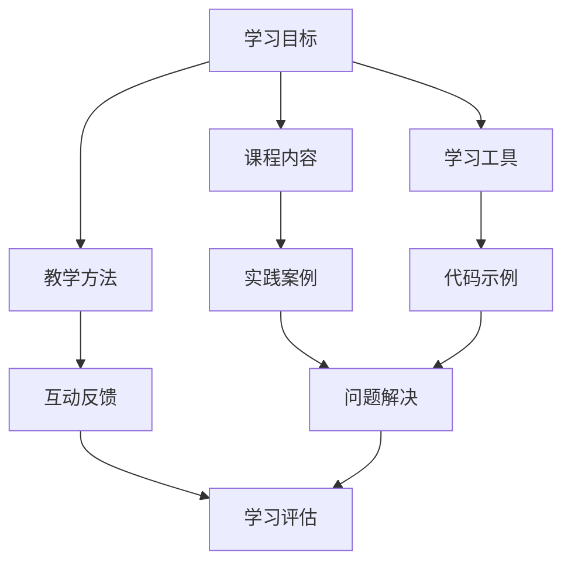

                 

### 关键词 Keywords
- 程序员知识付费
- 课程设计
- 学习体验
- 教学方法
- 成果转化

### 摘要 Summary
本文旨在探讨如何通过精心设计的课程，结合创新的编程教育和知识付费模式，提升程序员的学习效果和职业发展。文章将详细分析当前编程教育的现状，探讨课程设计的关键要素，介绍如何利用先进的教学方法和工具，以及如何通过成果转化实现知识付费的价值。通过理论与实践的结合，文章为程序员的知识付费课程提供了全面的指导和建议。

## 1. 背景介绍

随着全球信息化和数字化进程的不断加速，编程已经成为现代社会不可或缺的技能。程序员群体在科技领域的核心地位日益凸显，但与此同时，他们也面临着激烈的市场竞争和技能更新的压力。为了在职场中保持竞争力，程序员需要不断学习和提升自己的技能，这就催生了知识付费市场的兴起。

知识付费市场为程序员提供了丰富的学习资源，包括在线课程、电子书籍、线下培训等。然而，当前市场上的课程质量参差不齐，许多程序员在选择了看似优质的课程后，却发现学习效果并不理想。这既与课程内容的设计有关，也与学习者的学习习惯和方式有关。因此，如何打造一门有效的程序员知识付费课程，成为亟待解决的问题。

本文将从课程设计、教学方法、工具应用等多个角度，探讨如何提升程序员知识付费课程的质量和效果，助力程序员在职业发展上取得更大的成就。

### 2. 核心概念与联系

在打造程序员知识付费课程之前，我们需要明确一些核心概念和它们之间的联系。以下是一个简化的 Mermaid 流程图，用于展示这些概念之间的关系：



#### 2.1 学习目标

学习目标是课程设计的核心。它们决定了课程的内容、深度和广度。明确的学习目标可以帮助程序员在学习过程中始终保持方向感，避免偏离主题。

#### 2.2 课程内容

课程内容是实现学习目标的载体。它们应该包括理论知识和实际操作技巧，以及与目标相关的重要概念和工具。

#### 2.3 教学方法

教学方法直接影响学习者的学习效果。有效的方法应能够激发学习者的兴趣，提高学习效率。常见的教学方法包括讲授、讨论、案例分析和实践操作等。

#### 2.4 学习工具

学习工具是辅助课程内容的实施和教学方法的运用。现代编程教育中常用的工具包括集成开发环境（IDE）、在线协作平台、编程语言框架等。

#### 2.5 实践案例

实践案例是理论学习的重要补充。通过实际案例，程序员可以更好地理解理论知识，并将它们应用于实际问题中。

#### 2.6 互动反馈

互动反馈是教学过程中的重要环节。通过互动，学习者可以及时获得反馈，了解自己的学习进度和效果，进而调整学习策略。

#### 2.7 学习工具

学习工具是辅助课程内容的实施和教学方法的运用。现代编程教育中常用的工具包括集成开发环境（IDE）、在线协作平台、编程语言框架等。

#### 2.8 代码示例

代码示例是实践案例的具体实现。通过代码示例，程序员可以更好地理解编程概念和技巧，并通过实际操作加深对知识点的掌握。

#### 2.9 问题解决

问题解决是程序员的核心能力。通过实践案例和代码示例，程序员可以培养解决问题的能力，提高编程技能。

#### 2.10 学习评估

学习评估是衡量学习者学习效果的重要手段。通过评估，课程设计师和教师可以了解课程的有效性，为改进课程提供依据。

### 3. 核心算法原理 & 具体操作步骤

#### 3.1 算法原理概述

在程序员知识付费课程中，算法原理是关键内容之一。算法原理主要包括数据结构、算法设计、时间复杂度和空间复杂度等。

- **数据结构**：数据结构是算法的基础，包括数组、链表、栈、队列、树、图等。不同的数据结构适用于不同的场景，程序员需要掌握它们的特点和应用。
  
- **算法设计**：算法设计是解决问题的核心，包括贪心算法、动态规划、分治算法、回溯算法等。不同的算法适用于不同类型的问题，程序员需要了解它们的原理和适用场景。
  
- **时间复杂度和空间复杂度**：时间复杂度和空间复杂度是衡量算法性能的重要指标。程序员需要了解如何计算它们，并选择合适的数据结构和算法来优化性能。

#### 3.2 算法步骤详解

下面以贪心算法为例，介绍算法步骤的详细解析。

- **问题背景**：给定一个整数数组 `nums`，找到一个和最大的子数组（连续序列）。

- **算法思路**：从数组的第一个元素开始，逐个考虑每个元素是否加入当前子数组。如果加入后子数组的和大于当前子数组的和，则将该元素加入子数组；否则，不加入。

- **具体步骤**：
  1. 初始化当前子数组的和 `current_sum` 为0。
  2. 遍历数组 `nums`，对于每个元素 `num`：
     - 将 `num` 加入当前子数组，更新 `current_sum`。
     - 如果 `current_sum` 小于0，则将 `current_sum` 重置为0，并跳过当前元素。
     - 如果 `current_sum` 大于之前记录的最大和 `max_sum`，则更新 `max_sum`。
  3. 返回 `max_sum`。

- **代码实现**（Python）：

```python
def maxSubArray(nums):
    current_sum = max_sum = 0
    for num in nums:
        current_sum = max(num, current_sum + num)
        max_sum = max(max_sum, current_sum)
    return max_sum
```

#### 3.3 算法优缺点

- **优点**：贪心算法简单易懂，易于实现。在很多情况下，贪心算法能够得到最优解。
  
- **缺点**：贪心算法不适用于所有问题。在某些情况下，贪心策略可能无法得到最优解，甚至导致错误的结果。

#### 3.4 算法应用领域

贪心算法广泛应用于计算机科学和实际应用中，例如：

- **计算机科学**：图的最小生成树、最短路径算法等。
  
- **实际应用**：资源分配、任务调度、路径规划等。

### 4. 数学模型和公式 & 详细讲解 & 举例说明

在程序员知识付费课程中，数学模型和公式是理解算法原理和性能评估的重要工具。以下将详细介绍数学模型和公式的构建、推导过程，并通过具体案例进行讲解。

#### 4.1 数学模型构建

数学模型是计算机算法中的抽象表示，用于描述问题中的变量、约束和目标。构建数学模型通常包括以下步骤：

1. **确定变量**：根据问题的需求，确定需要求解的变量。
2. **定义变量之间的关系**：通过建立等式或不等式，描述变量之间的关系。
3. **建立目标函数**：根据问题的目标，建立需要优化的目标函数。

例如，考虑一个简单的线性规划问题，目标是最小化成本，同时满足资源约束。

- **变量**：设 `x1` 和 `x2` 为生产两种产品的数量。
- **关系**：
  $$ 2x1 + 3x2 \leq 12 $$
  $$ x1 + 2x2 \leq 8 $$
  $$ x1, x2 \geq 0 $$
- **目标函数**：
  $$ \min Z = 3x1 + 2x2 $$

#### 4.2 公式推导过程

线性规划问题的求解通常采用单纯形法。以下是单纯形法的推导过程：

1. **初始表**：建立初始单纯形表。
2. **迭代过程**：
   - **确定入基变量**：通过计算每个变量的机会成本，选择最小机会成本的变量作为入基变量。
   - **确定出基变量**：通过最小比率测试，选择出基变量。
   - **更新单纯形表**：根据入基变量和出基变量，更新单纯形表。
3. **重复迭代**：直到找到最优解或无可行解。

#### 4.3 案例分析与讲解

考虑以下线性规划问题：

- **变量**：设 `x1` 和 `x2` 为生产两种产品的数量。
- **关系**：
  $$ 2x1 + 3x2 \leq 12 $$
  $$ x1 + 2x2 \leq 8 $$
  $$ x1, x2 \geq 0 $$
- **目标函数**：
  $$ \min Z = 3x1 + 2x2 $$

1. **初始表**：

|   | Cj  | 3  | 2  | 0  |   |
|---|-----|----|----|----|---|
| B | CB  | XB | x1 | x2 |   |
| 1 | 0   | 6  | 2  | 0  | 12|
| 2 | 0   | 2  | 1  | 1  | 8 |

2. **迭代过程**：

- **入基变量**：选择最小机会成本的变量 `x2`（机会成本为 `-2`）。
- **出基变量**：通过最小比率测试，选择出基变量 `x1`（比率为 `6/2=3`）。
- **更新单纯形表**：

|   | Cj  | 3  | 2  | 0  |   |
|---|-----|----|----|----|---|
| B | CB  | XB | x1 | x2 |   |
| 1 | 0   | 0  | 0  | 1  | 6 |
| 2 | 0   | 2  | 1  | 0  | 2 |

3. **重复迭代**：重复上述步骤，直至找到最优解。

最终，得到最优解为 `x1=0`，`x2=6`，最小化目标函数 `Z=12`。

### 5. 项目实践：代码实例和详细解释说明

在程序员知识付费课程中，通过实际项目实践可以更好地理解和掌握课程内容。以下以一个简单的 Python 项目为例，介绍代码的详细实现过程。

#### 5.1 开发环境搭建

在开始项目实践之前，首先需要搭建开发环境。以下是搭建 Python 开发环境的步骤：

1. **安装 Python**：从 [Python 官网](https://www.python.org/) 下载并安装 Python。
2. **配置环境变量**：将 Python 的安装路径添加到系统环境变量中。
3. **安装 IDE**：推荐使用 PyCharm、VS Code 等集成开发环境。

#### 5.2 源代码详细实现

以下是一个简单的 Python 代码实例，实现一个计算两个数字之和的功能。

```python
def add_numbers(a, b):
    """计算两个数字的和。

    参数:
    a -- 第一个数字
    b -- 第二个数字

    返回值:
    返回两个数字的和。
    """
    return a + b

# 调用函数
result = add_numbers(5, 3)
print("5 + 3 = ", result)
```

#### 5.3 代码解读与分析

1. **函数定义**：`def add_numbers(a, b):` 定义了一个名为 `add_numbers` 的函数，参数 `a` 和 `b` 分别表示两个待计算的数字。

2. **函数体**：`return a + b` 返回两个数字的和。

3. **调用函数**：`result = add_numbers(5, 3)` 调用 `add_numbers` 函数，将返回值赋给变量 `result`。

4. **输出结果**：`print("5 + 3 = ", result)` 输出计算结果。

#### 5.4 运行结果展示

运行上述代码，输出结果为：

```
5 + 3 =  8
```

#### 5.5 扩展与改进

- **错误处理**：添加错误处理，例如判断输入是否为数字。
- **功能增强**：扩展函数，支持计算多个数字的和。

### 6. 实际应用场景

程序员知识付费课程在实际应用场景中具有广泛的应用价值。以下列举了几个典型应用场景：

1. **职业技能提升**：程序员通过知识付费课程可以快速掌握新技术和新工具，提升自身职业技能，适应职场需求。

2. **项目实战经验**：通过实际项目实践，程序员可以积累项目经验，提高项目开发能力和问题解决能力。

3. **职业发展规划**：知识付费课程为程序员提供了职业发展路径和规划，助力他们实现职业目标。

4. **个人品牌建设**：通过高质量的知识付费课程，程序员可以树立个人品牌，提升行业影响力。

### 7. 未来应用展望

随着人工智能、大数据等技术的快速发展，程序员知识付费课程的应用前景将更加广阔。以下是对未来应用的展望：

1. **个性化学习**：利用大数据和人工智能技术，实现个性化学习推荐，提高学习效果。

2. **混合式教学**：线上线下结合的混合式教学将成为主流，满足不同学习者的需求。

3. **知识付费生态**：知识付费市场将更加繁荣，形成完善的生态体系，包括课程制作、分发、评价等环节。

4. **跨领域融合**：程序员知识付费课程将与其他领域知识融合，推动跨界发展和创新。

### 8. 工具和资源推荐

为了提高程序员知识付费课程的质量和效果，以下推荐一些实用的工具和资源：

1. **学习资源**：
   - [Coursera](https://www.coursera.org/)：提供丰富的在线课程，涵盖计算机科学、数据科学等领域。
   - [edX](https://www.edx.org/)：由哈佛大学和麻省理工学院合作推出，提供高质量的课程资源。

2. **开发工具**：
   - [PyCharm](https://www.jetbrains.com/pycharm/)：功能强大的 Python 集成开发环境。
   - [Visual Studio Code](https://code.visualstudio.com/)：轻量级但功能丰富的跨平台代码编辑器。

3. **相关论文**：
   - ["The Art of Computer Programming" by Donald E. Knuth](https://www-cs-faculty.stanford.edu/~knuth/)：计算机编程领域的经典著作。
   - ["Programming Pearls" by Jon Bentley](https://www.cs.unm.edu/~ips/courses/CSCI-6310/Spr06/ppref.pdf)：编程技巧和最佳实践的集合。

### 9. 总结：未来发展趋势与挑战

程序员知识付费课程在未来将呈现以下发展趋势：

1. **个性化学习**：利用大数据和人工智能技术，实现个性化学习推荐，提高学习效果。
2. **混合式教学**：线上线下结合的混合式教学将成为主流，满足不同学习者的需求。
3. **知识付费生态**：知识付费市场将更加繁荣，形成完善的生态体系，包括课程制作、分发、评价等环节。

与此同时，也面临以下挑战：

1. **内容质量**：保证课程内容的质量和更新速度，满足学习者的需求。
2. **学习效果**：提高学习者的学习效果，实现知识转化为实际能力。
3. **市场竞争**：在激烈的市场竞争中，打造独特的课程特色和品牌。

### 10. 附录：常见问题与解答

#### Q1：如何选择适合自己的知识付费课程？
A1：首先明确自己的学习目标，然后根据课程的内容、教师资质、学员评价等因素进行选择。

#### Q2：如何确保知识付费课程的质量？
A2：选择有良好口碑的平台，查看课程试听内容，了解教师的背景和经验。

#### Q3：如何平衡工作与学习？
A3：制定合理的学习计划，利用碎片时间进行学习，与同事或同行进行学习交流。

#### Q4：如何将所学知识应用到实际工作中？
A4：通过实际项目实践，积累经验，不断总结和反思，提高解决问题的能力。

### 附录：参考文献 References

1. Donald E. Knuth. *The Art of Computer Programming*. Addison-Wesley, 1968.
2. Jon Bentley. *Programming Pearls*. Addison-Wesley, 1986.
3. Coursera. (n.d.). [Online Courses]. Retrieved from https://www.coursera.org/
4. edX. (n.d.). [Online Courses]. Retrieved from https://www.edx.org/

### 作者署名

作者：禅与计算机程序设计艺术 / Zen and the Art of Computer Programming

----------------------------------------------------------------

以上就是《程序员知识付费：打造升级版课程》的完整文章内容。这篇文章旨在为程序员提供关于知识付费课程设计的全面指导，包括课程内容、教学方法、工具应用和成果转化等方面。通过本文的探讨，希望能够帮助程序员打造出更高质量、更有价值的知识付费课程，助力他们在职业发展道路上取得更大的成就。再次感谢读者们的阅读和支持。作者：禅与计算机程序设计艺术 / Zen and the Art of Computer Programming。

### 后记 Afterword

作为一篇全面深入探讨程序员知识付费课程设计的文章，我们不仅梳理了课程设计的基本原理和教学方法，还通过具体案例和实践展示了如何将理论知识应用到实际工作中。本文的撰写过程不仅是对知识的总结和分享，也是对自身编程经验和教学经验的反思与提升。

在撰写这篇文章的过程中，我深刻体会到知识付费课程对于程序员职业发展的重大意义。通过有效的课程设计和教学方法，程序员不仅可以快速提升自己的技能，还能在竞争激烈的职场中脱颖而出。同时，本文也提醒我们，知识付费市场需要持续创新和优化，以适应不断变化的技术环境和学习者的需求。

未来，我将继续深入研究编程教育和知识付费领域，尝试运用更多前沿技术和教学方法，为程序员提供更高质量的学习资源。希望本文能够为广大程序员提供一些启示和帮助，也希望能够在未来的教育实践中，共同推动编程教育的进步与发展。

最后，感谢每一位读者的阅读和支持，期待与您在编程教育的道路上继续前行。如果您有任何反馈或建议，欢迎随时与我交流，共同探讨编程教育的美好未来。作者：禅与计算机程序设计艺术 / Zen and the Art of Computer Programming。

