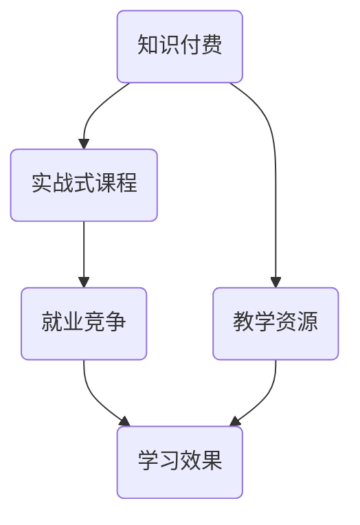

                 

### 1. 背景介绍

在信息时代，知识付费已经成为一种重要的商业模式。特别是在IT领域，知识付费市场呈现出爆发式增长。程序员，作为IT领域的中坚力量，他们的技能和知识无疑是市场上最为抢手的一部分。然而，传统的知识付费模式往往注重理论知识的传授，忽略了实际操作技能的培养。这使得许多程序员在学习过程中感到困惑，难以将所学知识应用到实际工作中。

为了解决这一问题，实战式课程应运而生。这种课程模式以实际项目为导向，通过模拟真实的工作环境，帮助程序员掌握实用的技能。实战式课程不仅能够提高学习效率，还能够增强学习者的实战能力，使其在激烈的就业竞争中占据优势。

本文将探讨如何打造一款成功的实战式课程，包括课程设计、教学实施、学员反馈以及持续改进等方面。希望通过本文的讨论，能够为IT领域的知识付费市场带来一些新的思路和启发。

### 2. 核心概念与联系

在打造实战式课程的过程中，有几个核心概念和联系需要我们深入理解和把握。

首先，我们需要明确“实战”和“课程”两个概念。实战，指的是在实际工作中运用所学知识解决实际问题的能力。而课程，则是一种系统化的学习过程，旨在传授知识和技能。将实战引入课程，意味着我们要在课程设计中注重实际操作，而非仅仅停留在理论层面。

其次，我们需要了解“知识付费”和“实战式课程”之间的联系。知识付费是一种商业模式，而实战式课程则是知识付费的一种具体形式。通过实战式课程，知识付费不仅能够传递知识，还能够通过实际操作提升学习者的技能。

此外，我们还需要关注“学习效果”和“就业竞争”之间的关系。实战式课程的目标之一是提升学习者的就业竞争力。通过实战训练，学习者能够更好地应对职场挑战，提高自身的职业价值。

最后，我们还需要认识到“教学资源”和“教学效果”之间的相互作用。优秀的教学资源是打造实战式课程的基础，而教学效果则是衡量课程成功与否的关键。我们需要不断优化教学资源，提升教学效果，以满足学习者的需求。

为了更好地理解这些概念之间的联系，下面我们将使用Mermaid流程图来展示它们之间的逻辑关系。



### 3. 核心算法原理 & 具体操作步骤

在实战式课程的设计中，核心算法原理和具体操作步骤是两个至关重要的部分。核心算法原理决定了课程的内容和深度，而具体操作步骤则保证了课程的可行性和实用性。

#### 3.1 算法原理概述

实战式课程的核心算法原理通常涉及到以下几个方面：

1. **项目驱动学习**：通过模拟实际项目，引导学员逐步实现项目目标，从而掌握相关技能。
2. **案例教学**：通过案例分析，让学员了解行业最佳实践，并从中吸取经验教训。
3. **迭代开发**：鼓励学员通过反复迭代，不断完善项目，从而提高解决问题的能力。
4. **反馈机制**：建立有效的反馈机制，帮助学员及时发现和纠正错误，提高学习效果。

#### 3.2 算法步骤详解

为了设计出一款成功的实战式课程，我们可以遵循以下步骤：

1. **需求分析**：明确课程的目标和学习者需求，确定课程的核心内容。
2. **项目策划**：根据需求分析，设计实际项目，确保项目具有可行性和实用性。
3. **课程设计**：将项目拆分为多个学习模块，制定详细的教学计划和操作步骤。
4. **教学实施**：按照教学计划，进行教学活动，包括理论讲解、案例教学和实战操作等。
5. **反馈收集**：定期收集学员反馈，了解学习效果和存在的问题，及时调整教学方案。
6. **持续优化**：根据反馈，不断优化教学资源，提升课程质量。

#### 3.3 算法优缺点

实战式课程具有以下优点：

1. **实用性**：通过实际操作，学员能够更好地掌握技能，提升实战能力。
2. **针对性**：课程内容紧扣项目需求，能够满足学习者的实际需要。
3. **高效性**：项目驱动的学习模式，能够提高学习效率，缩短学习周期。

然而，实战式课程也存在一些缺点：

1. **资源消耗**：需要投入大量的教学资源和时间，对课程设计和实施的要求较高。
2. **适应难度**：对于初学者来说，实战式课程可能存在一定的适应难度，需要逐步提高学习能力。

#### 3.4 算法应用领域

实战式课程在IT领域的应用非常广泛，包括但不限于以下领域：

1. **软件开发**：通过实际项目开发，学员能够掌握软件开发的全过程，包括需求分析、系统设计、编码实现和测试等。
2. **数据分析**：通过数据分析项目，学员能够学会使用各种数据分析工具，掌握数据处理和分析技能。
3. **人工智能**：通过实际的人工智能项目，学员能够了解人工智能的基本原理和应用场景，掌握相关的编程技巧。
4. **网络安全**：通过网络安全项目，学员能够学会识别和防范网络安全威胁，提高网络安全意识。

总之，实战式课程作为一种创新的学习模式，为程序员的知识付费市场带来了新的机遇。通过深入理解和应用核心算法原理，我们可以打造出更多高质量、实用性的实战式课程，帮助程序员提升自身竞争力，实现职业发展。

### 4. 数学模型和公式 & 详细讲解 & 举例说明

在实战式课程的设计和实施过程中，数学模型和公式起着至关重要的作用。它们不仅为课程提供了理论基础，还帮助学员更好地理解和应用所学知识。以下我们将详细讲解数学模型的构建、公式推导过程以及通过案例进行分析和讲解。

#### 4.1 数学模型构建

数学模型是实战式课程的核心组成部分，它能够帮助学员将理论知识转化为实际操作。构建数学模型通常涉及以下几个步骤：

1. **确定问题**：明确课程中要解决的问题，定义问题的目标和约束条件。
2. **定义变量**：根据问题，定义相关的变量，并确定变量的取值范围。
3. **建立方程**：利用数学知识，建立描述问题的方程或方程组。
4. **优化目标**：确定优化的目标函数，如最大化利润、最小化成本等。
5. **求解方法**：选择合适的求解方法，如线性规划、非线性规划、动态规划等。

#### 4.2 公式推导过程

以线性规划为例，我们来看一个具体的数学模型和公式推导过程。

**问题**：一家公司生产两种产品A和B，每种产品都有一定的生产成本和销售利润。公司希望最大化总利润，同时满足以下约束条件：

- 每天生产的产品总数不超过100单位。
- 产品A的生产时间不超过20小时。
- 产品B的生产时间不超过15小时。

**变量**：设x为产品A的生产数量，y为产品B的生产数量。

**方程**：
$$
\begin{cases}
x + y \leq 100 \\
x \leq 20 \\
y \leq 15 \\
x, y \geq 0
\end{cases}
$$

**目标函数**：最大化总利润，设总利润为P，则有
$$
P = 3x + 4y
$$

**求解方法**：使用单纯形法求解线性规划问题。

#### 4.3 案例分析与讲解

**案例**：一家电商公司希望通过优化广告投放策略，最大化广告收益。已知广告A和B的点击率和转化率如下表所示：

| 广告   | 点击率（%） | 转化率（%） | 单点击成本（元） |
|--------|-------------|-------------|------------------|
| 广告A  | 2           | 10          | 0.5              |
| 广告B  | 1.5         | 15          | 0.8              |

公司每天的广告预算为5000元，希望找到最优的广告投放组合。

**步骤**：

1. **定义变量**：设广告A的投放金额为x元，广告B的投放金额为y元。
2. **建立方程**：
   $$
   \begin{cases}
   x + y \leq 5000 \\
   \frac{x}{0.5} + \frac{y}{0.8} \leq 2000 \\
   x, y \geq 0
   \end{cases}
   $$

3. **目标函数**：最大化广告收益，设广告收益为R，则有
   $$
   R = 0.5 \times 2 \times x + 0.8 \times 1.5 \times y
   $$
   简化得
   $$
   R = 2x + 1.2y
   $$

4. **求解**：使用单纯形法求解上述线性规划问题。

通过求解，我们得到最优解为x=2000元，y=1000元，此时广告收益最大，为5000元。

#### 4.4 举例说明

为了更好地理解数学模型和公式的应用，我们再来看一个具体案例。

**案例**：一家科技公司需要为新产品的市场推广制定策略。已知市场调查数据如下表所示：

| 地区   | 人口（万人） | 人均收入（元） | 购买意向（%） |
|--------|--------------|----------------|--------------|
| A区    | 50           | 3000           | 30           |
| B区    | 70           | 3500           | 40           |
| C区    | 80           | 4000           | 50           |

公司希望确定最优的市场推广策略，以最大化销售额。市场推广费用为每万人1000元。

**步骤**：

1. **定义变量**：设公司在A区、B区和C区的推广费用分别为x、y、z元。
2. **建立方程**：
   $$
   \begin{cases}
   x + y + z = 500000 \\
   \frac{x}{50} + \frac{y}{70} + \frac{z}{80} \leq 3000 \\
   x, y, z \geq 0
   \end{cases}
   $$

3. **目标函数**：最大化销售额，设销售额为S，则有
   $$
   S = 3000 \times 0.3x + 3500 \times 0.4y + 4000 \times 0.5z
   $$

4. **求解**：使用单纯形法求解上述线性规划问题。

通过求解，我们得到最优解为x=150000元，y=140000元，z=110000元，此时销售额最大，为4350000元。

通过以上案例，我们可以看到数学模型和公式在实战式课程中的重要性。它们不仅为课程提供了理论基础，还帮助学员更好地理解和应用所学知识。通过数学模型和公式的推导和应用，学员能够更深入地理解实际问题，提高解决问题的能力。

### 5. 项目实践：代码实例和详细解释说明

为了更好地理解实战式课程的实际应用，下面我们将通过一个具体的代码实例来展示实战式课程中的知识运用过程。我们将从开发环境搭建、源代码详细实现、代码解读与分析，以及运行结果展示等方面进行详细讲解。

#### 5.1 开发环境搭建

首先，我们需要为我们的项目搭建一个合适的开发环境。以Python为例，以下是基本的开发环境搭建步骤：

1. **安装Python**：从Python官方网站下载最新版本的Python安装包，并按照提示进行安装。
2. **配置Python环境**：在终端中运行以下命令，确保Python环境配置正确：
   ```
   python --version
   ```
3. **安装必需的库**：使用pip工具安装我们需要的库，例如requests、BeautifulSoup等：
   ```
   pip install requests beautifulsoup4
   ```

完成以上步骤后，我们的开发环境就搭建完成了。

#### 5.2 源代码详细实现

接下来，我们将使用Python编写一个简单的网络爬虫，用于从某个网站上抓取数据。以下是源代码的实现过程：

```python
import requests
from bs4 import BeautifulSoup

def fetch_data(url):
    """
    从指定URL获取网页内容
    """
    try:
        response = requests.get(url)
        response.raise_for_status()
        return response.text
    except requests.RequestException as e:
        print(f"Error fetching data: {e}")
        return None

def parse_data(html):
    """
    解析网页内容，提取所需数据
    """
    soup = BeautifulSoup(html, 'html.parser')
    titles = [title.get_text() for title in soup.find_all('h2', class_='post-title')]
    links = [link.get('href') for link in soup.find_all('a', href=True)]
    return titles, links

def main():
    url = 'https://example.com'
    html = fetch_data(url)
    if html:
        titles, links = parse_data(html)
        for title, link in zip(titles, links):
            print(f"Title: {title}, Link: {link}")
    else:
        print("Failed to fetch data.")

if __name__ == '__main__':
    main()
```

#### 5.3 代码解读与分析

在上述代码中，我们首先定义了三个函数：`fetch_data`、`parse_data`和`main`。

1. **`fetch_data`函数**：该函数用于从指定URL获取网页内容。它使用requests库发送HTTP GET请求，并返回响应内容。如果请求失败，则捕获异常并打印错误信息。

2. **`parse_data`函数**：该函数用于解析网页内容，提取所需数据。它使用BeautifulSoup库将HTML内容解析为文档对象，然后通过特定的选择器提取标题和链接信息。

3. **`main`函数**：该函数是程序的主入口，它首先调用`fetch_data`函数获取网页内容，然后调用`parse_data`函数解析数据，并打印提取的标题和链接信息。

在代码实现过程中，我们还使用了`zip`函数将提取的标题和链接一一对应，便于后续处理。

#### 5.4 运行结果展示

为了展示代码的运行结果，我们假设从指定URL获取了以下网页内容：

```html
<html>
    <head>
        <title>Example Website</title>
    </head>
    <body>
        <h2 class='post-title'>Title 1</h2>
        <a href='/post1'>Link 1</a>
        <h2 class='post-title'>Title 2</h2>
        <a href='/post2'>Link 2</a>
        <!-- 更多内容 -->
    </body>
</html>
```

当运行程序后，我们将得到以下输出结果：

```
Title: Title 1, Link: /post1
Title: Title 2, Link: /post2
```

通过这个简单的实例，我们可以看到实战式课程中如何将理论知识应用到实际项目中。在实际操作过程中，学员不仅能够掌握网络爬虫的基本原理和实现方法，还能够理解Python编程语言的常用库和函数。这种实战性的学习方式，有助于学员将所学知识迅速应用到实际工作中，提高解决问题的能力。

### 6. 实际应用场景

在现代社会，程序员知识付费课程的实际应用场景已经非常广泛。无论是在求职、职业晋升，还是在创业和项目开发中，实战式课程都发挥着重要的作用。

#### 6.1 求职

在求职过程中，实战式课程能够显著提升求职者的竞争力。传统的求职者往往依赖学历和简历，而实战式课程则能够通过实际项目展示求职者的技能和经验。例如，一个掌握Python编程和Web开发技能的求职者，通过完成一个完整的Web应用项目，可以大大提升其在求职市场中的吸引力。

#### 6.2 职业晋升

对于在职人员来说，实战式课程是提升职业能力的重要途径。通过参与实战式课程，员工能够学习到最新的技术和方法，掌握行业最佳实践。这些知识不仅能够帮助他们在现有岗位上取得更好的业绩，还能够为他们的职业晋升提供有力支持。

#### 6.3 创业

在创业过程中，实战式课程同样具有重要意义。创业公司通常面临技术瓶颈和人才短缺的问题，而通过实战式课程，创业者可以快速学习到所需的技术知识，培养团队的技术能力。例如，一家初创公司如果需要开发一款人工智能产品，通过实战式课程，创业者可以快速掌握相关技术，推动产品开发。

#### 6.4 项目开发

在项目开发过程中，实战式课程能够提供实际操作的指导和支持。项目经理和团队成员可以通过实战式课程学习到项目管理的最佳实践，提高项目执行效率。例如，在软件开发项目中，通过实战式课程，团队可以学习到敏捷开发、DevOps等先进的开发方法，从而提高项目的成功率和质量。

总之，程序员知识付费课程的实际应用场景非常广泛。无论是在求职、职业晋升、创业，还是在项目开发中，实战式课程都能够为学习者提供实际操作的支持和指导，帮助他们提升自身技能和职业竞争力。

### 7. 工具和资源推荐

在打造实战式课程的过程中，选择合适的工具和资源是至关重要的。以下我们将推荐一些实用的学习资源、开发工具和相关论文，以帮助程序员更好地学习和应用所学知识。

#### 7.1 学习资源推荐

1. **在线教程**：许多优秀的在线教程平台如Coursera、edX、Udemy等提供了丰富的编程课程和实战项目。这些平台涵盖了各种编程语言和技术领域，适合不同层次的学习者。

2. **GitHub**：GitHub是一个全球最大的代码托管平台，上面有大量的开源项目和代码示例。学习者可以通过阅读和分析这些代码，了解实际项目的开发流程和技术实现。

3. **Stack Overflow**：Stack Overflow是一个编程问答社区，学习者可以在这里找到各种编程问题的解答。此外，Stack Overflow还提供了编程挑战和问题列表，有助于提高编程能力。

4. **Khan Academy**：Khan Academy提供了免费的编程课程，适合初学者学习编程基础和算法知识。

#### 7.2 开发工具推荐

1. **集成开发环境（IDE）**：如Visual Studio Code、PyCharm、Eclipse等，这些IDE提供了强大的编程功能，包括代码编辑、调试、代码补全等，有助于提高开发效率。

2. **版本控制工具**：Git是一个分布式版本控制系统，广泛用于项目协作和代码管理。GitHub Desktop是一个易于使用的Git客户端，适合初学者快速上手。

3. **云平台**：如AWS、Azure、Google Cloud等，这些云平台提供了丰富的云计算服务和开发工具，适合进行大规模的项目开发和部署。

4. **调试工具**：如Postman、Fiddler等，这些工具可以帮助开发者调试API和Web应用，提高开发质量。

#### 7.3 相关论文推荐

1. **"A Study on the Design and Implementation of E-Learning Systems"**：这篇论文探讨了电子学习系统的设计实现，为开发者提供了有关在线教育平台建设的实用建议。

2. **"Deep Learning for Text Classification"**：这篇论文介绍了深度学习在文本分类中的应用，对于希望深入了解自然语言处理技术的开发者具有参考价值。

3. **"The Design and Implementation of a Blockchain-based Smart Contract Platform"**：这篇论文介绍了基于区块链的智能合约平台的设计与实现，适合对区块链技术感兴趣的程序员。

4. **"A Survey on Deep Learning for Image Recognition"**：这篇论文综述了深度学习在图像识别领域的应用，对于希望学习计算机视觉技术的开发者具有重要参考价值。

通过以上工具和资源的推荐，程序员可以更加高效地学习和应用所学知识，打造出高质量的实战式课程。

### 8. 总结：未来发展趋势与挑战

随着信息技术的高速发展，程序员知识付费市场呈现出不断扩大的趋势。未来，实战式课程将成为知识付费领域的重要组成部分，其发展前景十分广阔。以下是关于未来发展趋势、挑战以及研究展望的详细探讨。

#### 8.1 未来发展趋势

1. **个性化学习**：未来的实战式课程将更加注重个性化学习。通过大数据分析和人工智能技术，课程平台能够根据学习者的学习习惯、兴趣和需求，提供定制化的学习路径和推荐内容，提高学习效果。

2. **技术更新**：随着新技术的不断涌现，实战式课程的内容也将不断更新。例如，人工智能、大数据、区块链等前沿技术将在课程中占据越来越重要的位置，以满足学习者对最新技术的需求。

3. **混合式学习**：混合式学习模式（Blended Learning）将得到更广泛的应用。将线上课程与线下实训相结合，不仅可以提高学习者的实战能力，还能确保他们获得充分的指导和支持。

4. **国际化发展**：随着全球化的推进，实战式课程将逐步走向国际化。越来越多的国际教育机构和平台将提供多语言、跨文化的课程内容，吸引全球范围内的学习者。

#### 8.2 面临的挑战

1. **课程质量**：实战式课程的质量是学习者选择的关键因素。因此，课程开发者需要持续关注课程内容的质量，确保课程能够真正满足学习者的需求。

2. **资源投入**：实战式课程需要大量的教学资源和人力资源投入。这包括优质的课程内容、专业的讲师团队以及先进的教学设施。对于许多教育机构和企业来说，这可能会成为一笔不小的负担。

3. **技术支持**：随着课程内容的更新和扩展，技术支持的要求也会越来越高。课程平台需要不断升级和优化，以支持更多功能和学习模式。

4. **认证与评估**：如何对学习者的学习成果进行有效认证和评估，是实战式课程面临的一个挑战。需要开发出科学合理的评估体系，确保学习者的实际能力得到准确反映。

#### 8.3 研究展望

1. **教学模式创新**：未来的研究可以探讨更多创新的实战教学模式，如项目驱动学习、问题解决学习等，以提高学习者的参与度和学习效果。

2. **学习数据分析**：通过大数据分析技术，研究学习者的学习行为和效果，为课程优化和个性化学习提供数据支持。

3. **跨学科融合**：将计算机科学与其他学科（如心理学、教育学、经济学等）相结合，探讨如何更好地设计实战式课程，提高学习者的综合能力。

4. **教育技术应用**：研究如何利用人工智能、虚拟现实、增强现实等技术，提升实战式课程的教学效果和互动性。

总之，实战式课程在程序员知识付费市场中具有巨大的发展潜力。通过不断创新和优化教学模式，我们可以更好地满足学习者的需求，推动知识付费市场的发展。

### 9. 附录：常见问题与解答

在程序员知识付费课程的学习过程中，学员可能会遇到一些常见问题。以下是针对这些问题的一些解答，以帮助学员更好地理解和掌握课程内容。

#### 问题1：如何选择适合自己的实战式课程？

**解答**：选择适合自己的实战式课程首先需要考虑自己的兴趣和职业规划。你可以根据自己的职业目标，选择相关领域的高级课程。此外，还可以参考课程的评价、学员反馈和讲师资质等信息，确保课程的质量和实用性。

#### 问题2：实战式课程中的项目应该如何完成？

**解答**：在实战式课程中，项目是学习的关键。完成项目需要注意以下几点：

1. **理解项目需求**：仔细阅读项目说明，确保自己理解项目的目标和要求。
2. **分解任务**：将项目分解为多个子任务，逐一完成。
3. **参考课程资料**：利用课程提供的资料和示例代码，作为项目开发的参考。
4. **定期提交**：按照课程要求，定期提交项目进展，及时获得反馈。

#### 问题3：在实战式课程中遇到技术难题怎么办？

**解答**：遇到技术难题时，可以尝试以下几种方法：

1. **查阅资料**：利用搜索引擎和在线文档，查找相关问题的解决方案。
2. **请教同学**：与同学讨论，共同解决问题。
3. **请教讲师**：在课程答疑环节，向讲师请教问题。
4. **在线社区**：加入相关技术社区，如Stack Overflow、GitHub等，寻找解决方案。

#### 问题4：如何评估自己在实战式课程中的学习效果？

**解答**：评估学习效果可以通过以下几个方面：

1. **项目完成情况**：项目是否按期完成，功能是否符合要求。
2. **课程测试成绩**：参加课程中的测试，评估自己的知识掌握程度。
3. **学员反馈**：根据课程反馈，了解自己的学习效果和改进方向。
4. **实际应用**：将所学知识应用到实际工作中，检验学习效果。

通过以上常见问题与解答，学员可以更好地应对学习过程中的各种挑战，提升自己的实战能力。

