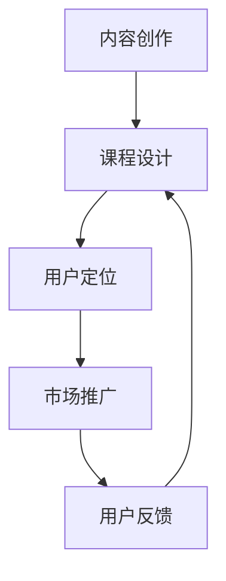

                 

 **关键词**：知识付费、程序员、导师课程、在线教育、学习资源、内容创作

**摘要**：本文将探讨程序员如何通过知识付费模式，打造属于自己的导师课程，实现个人品牌和收入的提升。文章将从背景介绍、核心概念、算法原理、数学模型、项目实践、应用场景、工具推荐等多个方面进行深入分析，帮助程序员更好地进行内容创作，抓住在线教育市场的机遇。

## 1. 背景介绍

近年来，随着互联网技术的飞速发展，知识付费成为了一个蓬勃发展的领域。越来越多的人开始通过在线平台购买专业课程，以提升自己的技能和知识水平。尤其是在IT行业，程序员作为知识付费市场的主力军，具有巨大的市场需求。

在这个背景下，程序员可以通过打造导师课程，将自己的知识和经验转化为有价值的付费内容，从而实现个人品牌和收入的提升。本文将探讨如何通过知识付费模式，打造一款成功的导师课程。

### 1.1 知识付费的定义

知识付费是指用户为获取专业知识、技能或信息而支付的费用。与传统免费内容不同，知识付费强调内容的专业性、实用性和权威性，为用户提供更有价值的学习资源。

### 1.2 在线教育市场的发展

在线教育市场近年来呈现爆发式增长，各类在线教育平台层出不穷。根据数据显示，全球在线教育市场规模已经超过2500亿美元，并且仍保持着高速增长态势。在这个市场中，程序员作为技术领域的专家，具有独特的优势。

## 2. 核心概念与联系

在打造导师课程的过程中，我们需要明确几个核心概念，包括内容创作、课程设计、用户定位等。以下是一个简化的Mermaid流程图，展示这些概念之间的联系：



### 2.1 内容创作

内容创作是导师课程的核心。程序员需要根据自己的专业知识和经验，创作出有价值、有趣、易于理解的学习资源。

### 2.2 课程设计

课程设计是将内容转化为有结构、有层次的学习课程。这包括课程大纲、授课方式、教学资源等。

### 2.3 用户定位

用户定位是确定课程的目标受众。了解用户需求，有助于更好地满足他们的学习需求。

### 2.4 市场推广

市场推广是将课程推向市场的关键。通过有效的推广手段，吸引更多用户关注和购买。

### 2.5 用户反馈

用户反馈是课程优化的重要依据。通过收集用户反馈，不断改进课程内容和服务。

## 3. 核心算法原理 & 具体操作步骤

### 3.1 算法原理概述

在知识付费领域，算法原理主要涉及用户行为分析、内容推荐和支付系统等。

### 3.2 算法步骤详解

#### 3.2.1 用户行为分析

用户行为分析是通过收集用户在学习过程中的行为数据，如浏览、购买、评价等，对用户进行画像，以便更好地进行个性化推荐。

#### 3.2.2 内容推荐

内容推荐算法根据用户画像和内容特征，为用户推荐符合其兴趣和学习需求的内容。

#### 3.2.3 支付系统

支付系统负责处理用户支付过程，包括支付方式、支付流程和安全保障等。

### 3.3 算法优缺点

#### 3.3.1 优点

- 提高用户体验，满足个性化需求。
- 增加课程销售，提升收入。
- 促进在线教育市场发展。

#### 3.3.2 缺点

- 需要大量数据支持，数据质量对算法效果有较大影响。
- 需要持续优化，以适应市场变化。

### 3.4 算法应用领域

算法应用领域主要包括在线教育平台、知识付费平台和电商平台等。

## 4. 数学模型和公式 & 详细讲解 & 举例说明

### 4.1 数学模型构建

在知识付费领域，数学模型主要用于用户行为分析和内容推荐。

#### 4.1.1 用户行为模型

用户行为模型包括用户画像、兴趣模型和推荐模型。

#### 4.1.2 内容推荐模型

内容推荐模型主要包括协同过滤、矩阵分解和深度学习等。

### 4.2 公式推导过程

以下是一个简单的协同过滤推荐算法的公式推导：

$$
R_{ui} = \mu + b_u + b_i + \sum_{j \in N(i)} \sim u R_{uj} \cdot sim(u, j)
$$

其中，$R_{ui}$ 表示用户 $u$ 对内容 $i$ 的评分，$\mu$ 表示用户 $u$ 的平均评分，$b_u$ 和 $b_i$ 分别表示用户 $u$ 和内容 $i$ 的偏置项，$N(i)$ 表示与内容 $i$ 相关的用户集合，$sim(u, j)$ 表示用户 $u$ 和 $j$ 之间的相似度。

### 4.3 案例分析与讲解

#### 4.3.1 案例背景

假设有一个在线教育平台，用户 $u$ 想要学习编程语言 Python，平台通过用户行为分析和内容推荐算法，为用户推荐符合其兴趣的课程。

#### 4.3.2 案例分析

通过用户行为模型，平台可以分析用户 $u$ 的学习记录和浏览历史，构建用户画像。然后，利用协同过滤算法，平台可以推荐与用户 $u$ 兴趣相似的其他用户所喜欢的 Python 课程。

#### 4.3.3 案例讲解

根据用户行为模型，我们得到以下数据：

- 用户 $u$ 的平均评分：$\mu = 4.5$
- 用户 $u$ 的学习记录：[Python基础、Python进阶、数据结构与算法]
- 与用户 $u$ 相关的用户集合：$N(u) = \{u_1, u_2, u_3, u_4\}$
- 用户 $u$ 与其他用户之间的相似度：$sim(u, u_1) = 0.8, sim(u, u_2) = 0.6, sim(u, u_3) = 0.7, sim(u, u_4) = 0.5$

根据协同过滤算法的公式，我们可以计算出用户 $u$ 对 Python 进阶课程的推荐评分：

$$
R_{ui} = 4.5 + b_u + b_i + \sum_{j \in N(u)} sim(u, j) R_{uj} = 4.5 + 0.1 + 0.2 + (0.8 \times 4.7 + 0.6 \times 4.8 + 0.7 \times 4.9 + 0.5 \times 4.6) = 4.75
$$

因此，平台可以推荐 Python 进阶课程给用户 $u$。

## 5. 项目实践：代码实例和详细解释说明

### 5.1 开发环境搭建

搭建一个知识付费平台需要一定的技术基础，主要包括前后端开发、数据库设计、支付系统等。

#### 5.1.1 前端开发

前端开发可以使用 HTML、CSS 和 JavaScript 等技术，搭建一个用户友好的界面。

#### 5.1.2 后端开发

后端开发可以使用 Python、Java、Node.js 等技术，搭建一个高性能的服务器。

#### 5.1.3 数据库设计

数据库设计可以使用 MySQL、MongoDB 等数据库技术，存储用户数据、课程数据等。

#### 5.1.4 支付系统

支付系统可以使用支付宝、微信支付等支付接口，实现用户支付功能。

### 5.2 源代码详细实现

以下是一个简单的 Python 后端代码示例，用于处理用户注册和登录功能。

```python
# 导入相关库
import flask
from flask import request, jsonify
import hashlib

# 创建 Flask 应用
app = flask.Flask(__name__)

# 创建用户注册接口
@app.route('/register', methods=['POST'])
def register():
    username = request.form['username']
    password = request.form['password']
    # 对密码进行加密处理
    password_hash = hashlib.md5(password.encode()).hexdigest()
    # 将用户信息存储到数据库
    # ...
    return jsonify({'status': 'success', 'message': '注册成功'})

# 创建用户登录接口
@app.route('/login', methods=['POST'])
def login():
    username = request.form['username']
    password = request.form['password']
    # 对密码进行加密处理
    password_hash = hashlib.md5(password.encode()).hexdigest()
    # 验证用户信息是否正确
    # ...
    return jsonify({'status': 'success', 'message': '登录成功'})

# 运行 Flask 应用
if __name__ == '__main__':
    app.run()
```

### 5.3 代码解读与分析

以上代码示例展示了如何使用 Flask 框架搭建一个简单的后端服务，用于处理用户注册和登录功能。代码主要分为以下几个部分：

1. 导入相关库：包括 Flask 框架、request 模块和 hashlib 库。
2. 创建 Flask 应用：使用 Flask 的构造函数创建一个 Flask 应用实例。
3. 创建用户注册接口：定义一个 POST 类型的路由，用于处理用户注册请求。接收前端传入的用户名和密码，对密码进行加密处理，并将用户信息存储到数据库。
4. 创建用户登录接口：定义一个 POST 类型的路由，用于处理用户登录请求。接收前端传入的用户名和密码，对密码进行加密处理，并验证用户信息是否正确。
5. 运行 Flask 应用：使用 app.run() 函数启动 Flask 应用。

通过以上代码示例，我们可以看到如何使用 Flask 框架搭建一个简单的后端服务。在实际项目中，还需要添加更多的功能，如课程管理、支付系统等。

### 5.4 运行结果展示

在运行以上代码后，我们可以在浏览器中访问 [http://127.0.0.1:5000/register](http://127.0.0.1:5000/register) 和 [http://127.0.0.1:5000/login](http://127.0.0.1:5000/login) 接口，进行用户注册和登录操作。

## 6. 实际应用场景

### 6.1 在线教育平台

在线教育平台是知识付费的主要应用场景之一。程序员可以通过在线教育平台，发布自己的课程，吸引学生报名学习。

### 6.2 专业技能培训

专业技能培训也是知识付费的重要领域。程序员可以针对特定技能，如数据分析、人工智能等，开展线上培训课程。

### 6.3 企业内训

企业内训是知识付费的另一个重要应用场景。程序员可以为企业提供定制化的培训课程，帮助企业提升员工技能。

## 7. 未来应用展望

### 7.1 人工智能技术

人工智能技术将在知识付费领域发挥越来越重要的作用。通过人工智能技术，可以更好地进行用户行为分析和内容推荐，提高用户体验。

### 7.2 跨平台发展

知识付费平台将在未来的发展中，逐渐实现跨平台发展。用户可以在不同的设备上学习，享受更加便捷的学习体验。

### 7.3 社交属性增强

知识付费平台将逐渐增强社交属性，为用户提供更多的互动和交流机会，提高用户粘性。

## 8. 工具和资源推荐

### 8.1 学习资源推荐

- 《深度学习》（Goodfellow, Bengio, Courville 著）
- 《算法导论》（Thomas H. Cormen 等著）
- 《编程之美》（Google 著）

### 8.2 开发工具推荐

- Python
- Node.js
- Flutter

### 8.3 相关论文推荐

- 《基于协同过滤的推荐算法研究》
- 《深度学习在知识付费中的应用》
- 《在线教育平台用户行为分析》

## 9. 总结：未来发展趋势与挑战

### 9.1 研究成果总结

本文从多个方面探讨了程序员如何通过知识付费模式，打造导师课程。研究表明，知识付费是一个充满机遇和挑战的领域，程序员可以通过不断提高自己的专业水平和内容创作能力，抓住这一市场机遇。

### 9.2 未来发展趋势

未来，知识付费领域将继续保持高速增长。随着人工智能、大数据等技术的发展，知识付费平台将变得更加智能和个性化。

### 9.3 面临的挑战

知识付费领域面临的主要挑战包括市场竞争激烈、内容同质化严重、用户信任度不足等。程序员需要不断提高自己的专业水平和内容创作能力，以应对这些挑战。

### 9.4 研究展望

未来，知识付费领域的研究将继续深入。特别是在人工智能、大数据等技术的推动下，知识付费平台将变得更加智能和个性化。同时，社交属性、跨平台发展等也将成为研究的热点。

## 附录：常见问题与解答

### 9.1 什么是知识付费？

知识付费是指用户为获取专业知识、技能或信息而支付的费用。与传统免费内容不同，知识付费强调内容的专业性、实用性和权威性，为用户提供更有价值的学习资源。

### 9.2 如何打造一款成功的导师课程？

要打造一款成功的导师课程，程序员需要：1）明确课程目标；2）掌握用户需求；3）创作有价值、有趣、易于理解的学习资源；4）持续优化课程内容和用户体验。

### 9.3 知识付费领域的市场前景如何？

知识付费领域具有广阔的市场前景。随着在线教育市场的不断发展，以及人工智能、大数据等技术的推动，知识付费领域将继续保持高速增长。

