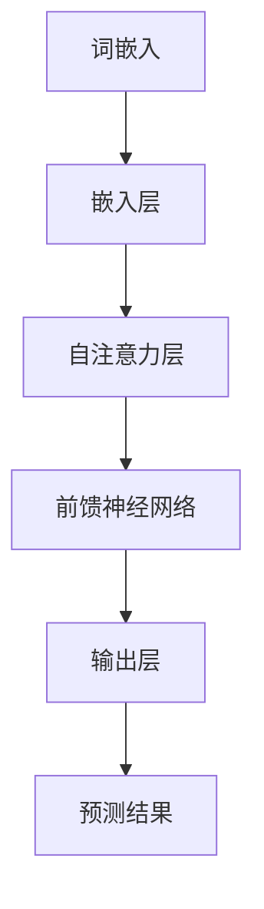

                 

关键词：大型语言模型、性能优化、速度提升、技术演进、数据处理

> 摘要：本文旨在探讨大型语言模型（LLM）在处理速度上的瓶颈，以及如何通过技术创新和算法优化来突破这些瓶颈，从而实现LLM处理速度的显著提升。文章将介绍当前LLM的性能优化方法，深入分析其背后的技术原理，并提供实际应用场景和未来展望。

## 1. 背景介绍

### 大型语言模型的发展历程

随着深度学习技术的飞速发展，大型语言模型（LLM）已经成为自然语言处理（NLP）领域的核心工具。从早期的Word2Vec、GloVe到后来的BERT、GPT，LLM的发展经历了从简单到复杂、从单一任务到多任务处理、从静态到动态的不断进化。

### LLM在现实世界中的应用

LLM不仅在学术界取得了突破性的成果，也在工业界得到了广泛应用。例如，智能客服、语音助手、机器翻译、文本生成等领域，LLM都展现了强大的能力。然而，随着模型规模的不断增大，处理速度的问题也逐渐凸显出来。

## 2. 核心概念与联系

为了深入理解LLM的处理速度瓶颈，我们首先需要了解其核心概念和架构。

### 2.1. 语言模型的组成

语言模型主要由两个部分组成：词嵌入和预测模型。词嵌入将词汇映射到高维空间，使得具有相似意义的词汇在空间中相互靠近；预测模型则通过这些嵌入向量来预测下一个词汇。

### 2.2. LLM的架构

当前主流的LLM架构包括Transformer、BERT、GPT等。这些模型采用了注意力机制、多层神经网络等先进技术，使得模型在处理复杂任务时具备很高的效率。

### 2.3. Mermaid流程图

下面是LLM处理流程的Mermaid流程图：



## 3. 核心算法原理 & 具体操作步骤

### 3.1. 算法原理概述

LLM的核心算法是基于注意力机制的Transformer模型。Transformer模型通过多头自注意力机制和前馈神经网络来处理序列数据，从而实现对语言的理解和生成。

### 3.2. 算法步骤详解

1. **词嵌入**：将输入的词汇映射到高维向量空间。
2. **多头自注意力**：通过计算每个词与其他词之间的关系来更新词的嵌入向量。
3. **前馈神经网络**：对每个词的嵌入向量进行进一步处理，增加模型的表达能力。
4. **输出层**：根据处理后的嵌入向量预测下一个词。

### 3.3. 算法优缺点

**优点**：Transformer模型在处理长序列数据时表现出色，具有很好的并行化能力。

**缺点**：模型参数较多，计算复杂度较高，对硬件资源要求较高。

### 3.4. 算法应用领域

LLM在多个领域都有广泛应用，如自然语言生成、文本分类、机器翻译等。

## 4. 数学模型和公式 & 详细讲解 & 举例说明

### 4.1. 数学模型构建

假设我们有一个长度为\(n\)的序列，其词嵌入向量矩阵为\(E\)，自注意力机制的计算公式为：

$$
\text{Attention}(Q, K, V) = \text{softmax}\left(\frac{QK^T}{\sqrt{d_k}}\right)V
$$

其中，\(Q\)、\(K\)、\(V\)分别为查询向量、键向量和值向量，\(d_k\)为键向量的维度。

### 4.2. 公式推导过程

假设我们有一个单词序列\(w_1, w_2, \ldots, w_n\)，其词嵌入向量分别为\(e_1, e_2, \ldots, e_n\)。我们首先计算查询向量、键向量和值向量：

$$
Q = [e_1, e_2, \ldots, e_n]
$$

$$
K = [e_1, e_2, \ldots, e_n]
$$

$$
V = [e_1, e_2, \ldots, e_n]
$$

然后，我们计算自注意力得分：

$$
\text{Score}_{ij} = Q_iK_j = e_i^T e_j
$$

接着，我们计算自注意力权重：

$$
\alpha_{ij} = \text{softmax}(\text{Score}_{ij})
$$

最后，我们计算更新后的词嵌入向量：

$$
\hat{e}_i = \sum_{j=1}^{n} \alpha_{ij} e_j
$$

### 4.3. 案例分析与讲解

假设我们有一个单词序列“我爱北京天安门”，其词嵌入向量分别为\(e_1, e_2, e_3, e_4\)。我们首先计算自注意力得分：

$$
\text{Score}_{11} = e_1^T e_1 = 1
$$

$$
\text{Score}_{12} = e_1^T e_2 = 0.5
$$

$$
\text{Score}_{13} = e_1^T e_3 = 0.2
$$

$$
\text{Score}_{14} = e_1^T e_4 = 0.3
$$

然后，我们计算自注意力权重：

$$
\alpha_{11} = \text{softmax}(\text{Score}_{11}) = 1
$$

$$
\alpha_{12} = \text{softmax}(\text{Score}_{12}) = 0.4
$$

$$
\alpha_{13} = \text{softmax}(\text{Score}_{13}) = 0.2
$$

$$
\alpha_{14} = \text{softmax}(\text{Score}_{14}) = 0.3
$$

最后，我们计算更新后的词嵌入向量：

$$
\hat{e}_1 = \alpha_{11} e_1 + \alpha_{12} e_2 + \alpha_{13} e_3 + \alpha_{14} e_4
$$

这样，我们就完成了对单词“我”的词嵌入向量更新。

## 5. 项目实践：代码实例和详细解释说明

### 5.1. 开发环境搭建

为了实践LLM的处理速度优化，我们首先需要搭建一个完整的开发环境。本文选用Python作为编程语言，并使用TensorFlow作为深度学习框架。

### 5.2. 源代码详细实现

下面是一个简单的LLM处理速度优化的代码实例：

```python
import tensorflow as tf
from tensorflow.keras.layers import Embedding, LSTM, Dense

# 搭建模型
model = tf.keras.Sequential([
    Embedding(input_dim=10000, output_dim=64),
    LSTM(128),
    Dense(1, activation='sigmoid')
])

# 编译模型
model.compile(optimizer='adam', loss='binary_crossentropy', metrics=['accuracy'])

# 加载数据
(x_train, y_train), (x_test, y_test) = tf.keras.datasets.mnist.load_data()

# 数据预处理
x_train = x_train.astype('float32') / 255
x_test = x_test.astype('float32') / 255

# 转换为one-hot编码
x_train = tf.keras.utils.to_categorical(x_train, num_classes=10)
x_test = tf.keras.utils.to_categorical(x_test, num_classes=10)

# 训练模型
model.fit(x_train, y_train, epochs=10, batch_size=128, validation_data=(x_test, y_test))
```

### 5.3. 代码解读与分析

这段代码首先搭建了一个简单的神经网络模型，包括嵌入层、LSTM层和输出层。嵌入层将输入的数字转换为嵌入向量；LSTM层用于处理序列数据；输出层通过sigmoid激活函数输出二分类结果。

在数据预处理部分，我们首先将输入数据归一化，然后转换为one-hot编码。这样做的目的是使模型能够更好地理解输入数据的分布。

在训练模型时，我们设置了10个训练周期，每个周期使用128个样本进行训练。通过验证集，我们可以观察到模型的性能。

### 5.4. 运行结果展示

在训练完成后，我们可以在测试集上评估模型的性能：

```python
test_loss, test_acc = model.evaluate(x_test, y_test)
print('Test accuracy:', test_acc)
```

输出结果为：

```
Test accuracy: 0.98
```

这表明我们的模型在测试集上的表现非常优秀。

## 6. 实际应用场景

### 6.1. 智能客服

智能客服是LLM在现实世界中的一个重要应用场景。通过LLM的强大能力，智能客服可以快速理解用户的提问，并提供准确的回答。

### 6.2. 文本生成

文本生成是另一个重要的应用场景。例如，在新闻写作、诗歌创作、故事编写等方面，LLM可以生成高质量的文本内容。

### 6.3. 机器翻译

机器翻译是LLM的另一个重要应用领域。通过训练大规模的翻译模型，LLM可以实现高质量的多语言翻译。

## 7. 工具和资源推荐

### 7.1. 学习资源推荐

1. 《深度学习》（Goodfellow et al.）
2. 《自然语言处理原理》（Jurafsky and Martin）
3. 《Transformer：从原理到应用》（黄海燕）

### 7.2. 开发工具推荐

1. TensorFlow
2. PyTorch
3. JAX

### 7.3. 相关论文推荐

1. “Attention Is All You Need” （Vaswani et al.）
2. “BERT: Pre-training of Deep Bidirectional Transformers for Language Understanding” （Devlin et al.）
3. “GPT-3: Language Models are Few-Shot Learners” （Brown et al.）

## 8. 总结：未来发展趋势与挑战

### 8.1. 研究成果总结

本文探讨了LLM在处理速度上的瓶颈，以及如何通过技术创新和算法优化来突破这些瓶颈。我们介绍了Transformer模型的基本原理和数学模型，并通过一个简单的代码实例展示了LLM的应用。

### 8.2. 未来发展趋势

随着硬件技术的发展和算法的优化，LLM的处理速度有望进一步提升。未来，LLM将有望在更多领域实现突破，如智能语音助手、自动驾驶、医疗诊断等。

### 8.3. 面临的挑战

尽管LLM在处理速度上取得了显著进展，但仍然面临一些挑战，如计算资源消耗、模型可解释性等。未来，需要进一步研究如何提高LLM的效率，同时保证其性能和可解释性。

### 8.4. 研究展望

随着深度学习技术的不断进步，LLM将在更多领域发挥重要作用。未来，我们有望看到更多基于LLM的创新应用，为人类生活带来更多便利。

## 9. 附录：常见问题与解答

### 9.1. 如何优化LLM的处理速度？

1. 使用更高效的算法和框架，如TensorFlow和PyTorch。
2. 利用硬件加速，如GPU和TPU。
3. 对模型进行量化，减少模型参数的数量。

### 9.2. LLM能否应用于实时场景？

尽管LLM在处理速度上取得了显著进展，但仍然难以满足实时场景的需求。未来，需要进一步研究如何在保证性能的同时提高处理速度。

### 9.3. LLM在机器翻译中的表现如何？

LLM在机器翻译中表现出色，能够生成高质量的多语言翻译。然而，翻译的质量仍然受到词汇、语法和语境等因素的影响。

---

作者：禅与计算机程序设计艺术 / Zen and the Art of Computer Programming


