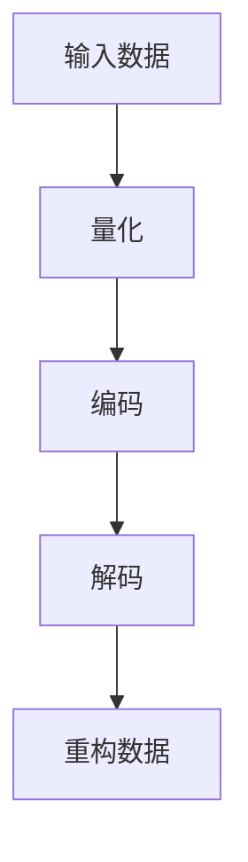
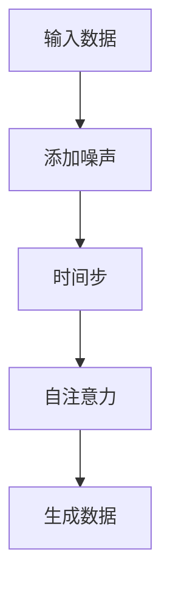

                 

关键词：多模态模型，VQ-VAE，扩散变压器，图像生成，人工智能，深度学习

## 摘要

本文深入探讨了多模态模型中的两个重要架构：变分自编码器（VAE）的变体——变分量化变分自编码器（VQ-VAE），以及近年来引起广泛关注的扩散模型之一——扩散变压器（Diffusion Transformer）。通过对这两个模型的基本原理、具体操作步骤、优缺点以及实际应用领域的详细分析，本文旨在为读者提供全面的技术视角，以了解如何通过这些先进的算法实现多模态数据的处理与生成。

## 1. 背景介绍

随着深度学习技术的不断进步，图像处理领域迎来了前所未有的发展。传统的图像生成方法，如生成对抗网络（GAN）和变分自编码器（VAE），虽然在图像生成方面取得了显著成果，但它们在处理多模态数据时仍面临诸多挑战。多模态数据，即包含图像、文本、音频等多种类型的数据，使得数据之间的关联性更加复杂，这对模型的泛化能力提出了更高的要求。

VQ-VAE 和扩散变压器是近年来在多模态数据处理和生成领域取得突破性进展的模型。VQ-VAE 通过引入变分量化技术，有效解决了多模态数据中的表达问题，而扩散变压器则通过引入时间维度，实现了对图像、文本等数据的高效处理和生成。本文将详细探讨这两个模型的工作原理和应用。

## 2. 核心概念与联系

### 2.1 VQ-VAE

VQ-VAE（Variational Quantum Feature Encoding Variational Autoencoder）是变分自编码器（VAE）的一种变体，旨在通过变分量化技术处理多模态数据。其核心思想是将数据的编码过程分为两个阶段：量化阶段和编码阶段。

**量化阶段：** 在这一阶段，数据首先被映射到一个离散的表示空间，通常使用一组预定义的编码向量。每个数据点会被映射到最近的编码向量，这个过程称为量化。

**编码阶段：** 经过量化阶段后，数据点在新的离散表示空间中重新编码，生成一组编码向量。这些编码向量用于生成数据的重构。

**图 2.1 VQ-VAE 的工作流程**



### 2.2 扩散变压器

扩散变压器（Diffusion Transformer）是一种基于变分自编码器（VAE）的新型模型，旨在处理时间序列和多模态数据。其核心思想是将数据在时间维度上的变化视为一个连续的扩散过程。

**扩散过程：** 在训练阶段，模型通过添加噪声逐步将数据点从真实分布中扩散到均匀分布。在生成阶段，模型通过反向扩散过程，从均匀分布中逐步恢复出原始数据点。

**变压器架构：** 扩散变压器采用了变压器（Transformer）的架构，通过多头自注意力机制，实现对不同时间步和不同模态数据的全局依赖性建模。

**图 2.2 扩散变压器的工作流程**



## 3. 核心算法原理 & 具体操作步骤

### 3.1 VQ-VAE 算法原理概述

VQ-VAE 的核心原理在于将变分自编码器（VAE）中的连续编码向量替换为离散的编码向量。这一替换过程通过两个步骤实现：量化阶段和编码阶段。

**量化阶段：** 数据点通过量化网络被映射到一个离散的表示空间。量化网络通常由一个编码器和一个解码器组成。编码器将输入数据映射到一个中间表示，解码器将这个中间表示映射回输入空间。通过这种方式，每个数据点都可以被映射到一个预定义的编码向量。

**编码阶段：** 在量化阶段后，每个数据点都会被分配到一个编码向量。这些编码向量被进一步编码为一组编码向量，用于生成数据的重构。

### 3.2 VQ-VAE 算法步骤详解

1. **初始化编码器和解码器：** 编码器和解码器都是全连接神经网络，用于将数据映射到中间表示和重构数据。

2. **输入数据：** 将多模态数据输入到编码器中。

3. **量化阶段：** 编码器将数据映射到一个中间表示，解码器将这个中间表示映射回输入空间，从而实现量化。

4. **编码阶段：** 每个数据点被映射到一个编码向量，这些编码向量被进一步编码为一组编码向量。

5. **重构数据：** 通过解码器将编码向量重构回原始数据空间。

### 3.3 VQ-VAE 算法优缺点

**优点：**
- 能够有效处理多模态数据，提高了模型的泛化能力。
- 通过变分量化技术，降低了数据的维度，提高了计算效率。

**缺点：**
- 在量化阶段可能会引入一定的误差，影响数据的重构质量。
- 编码器和解码器的训练过程较为复杂，需要大量的计算资源。

### 3.4 VQ-VAE 算法应用领域

VQ-VAE 在多个领域都有广泛的应用，包括但不限于：

- 图像生成：用于生成高质量的自然图像。
- 数据压缩：通过量化技术降低数据的存储和传输成本。
- 多模态数据融合：用于融合图像、文本、音频等多种类型的数据。

### 3.1 扩散变压器算法原理概述

扩散变压器（Diffusion Transformer）是一种基于变分自编码器（VAE）的新型模型，旨在处理时间序列和多模态数据。其核心原理在于将数据在时间维度上的变化视为一个连续的扩散过程。

**扩散过程：** 在训练阶段，模型通过添加噪声逐步将数据点从真实分布中扩散到均匀分布。在生成阶段，模型通过反向扩散过程，从均匀分布中逐步恢复出原始数据点。

**变压器架构：** 扩散变压器采用了变压器（Transformer）的架构，通过多头自注意力机制，实现对不同时间步和不同模态数据的全局依赖性建模。

### 3.2 扩散变压器算法步骤详解

1. **初始化编码器和解码器：** 编码器和解码器都是全连接神经网络，用于将数据映射到中间表示和重构数据。

2. **输入数据：** 将多模态数据输入到编码器中。

3. **扩散过程：** 在训练阶段，模型通过添加噪声逐步将数据点从真实分布中扩散到均匀分布。在生成阶段，模型通过反向扩散过程，从均匀分布中逐步恢复出原始数据点。

4. **编码阶段：** 通过变压器架构，对输入数据进行编码。

5. **解码阶段：** 通过变压器架构，对编码后的数据进行解码，重构原始数据。

### 3.3 扩散变压器算法优缺点

**优点：**
- 能够高效处理时间序列和多模态数据，提高了模型的泛化能力。
- 通过变压器架构，实现了对全局依赖性的建模，提高了数据生成的质量。

**缺点：**
- 训练过程较为复杂，需要大量的计算资源。
- 在处理复杂多模态数据时，可能需要调整模型参数，以适应不同的数据类型。

### 3.4 扩散变压器算法应用领域

扩散变压器在多个领域都有广泛的应用，包括但不限于：

- 视频生成：用于生成高质量的视频序列。
- 自然语言处理：用于生成文本和语音。
- 多模态数据融合：用于融合图像、文本、音频等多种类型的数据。

## 4. 数学模型和公式 & 详细讲解 & 举例说明

### 4.1 数学模型构建

#### 4.1.1 VQ-VAE 数学模型

VQ-VAE 的数学模型主要包括两个部分：量化网络和解码网络。

1. **量化网络：**

   量化网络的输入为数据 $x$，输出为编码向量 $z$。

   $$z = Q(x)$$

   其中，$Q$ 为量化函数，通常使用最近邻量化方法。

2. **解码网络：**

   解码网络的输入为编码向量 $z$，输出为重构数据 $x'$。

   $$x' = \phi(z)$$

   其中，$\phi$ 为解码函数，通常使用全连接神经网络。

#### 4.1.2 扩散变压器数学模型

扩散变压器的数学模型基于变分自编码器（VAE）的框架，并在其中引入了扩散过程。

1. **扩散过程：**

   在训练阶段，模型通过以下公式将数据 $x$ 扩散到均匀分布 $p(\theta)$：

   $$x_t = x_0 + \sum_{i=1}^t \epsilon_i$$

   其中，$x_0$ 为原始数据，$x_t$ 为当前时间步的数据，$\epsilon_i$ 为第 $i$ 步添加的噪声。

   在生成阶段，模型通过以下公式从均匀分布中恢复出原始数据：

   $$x_t = x_0 + \sum_{i=1}^t (-1)^{i+1} \epsilon_i$$

2. **编码网络：**

   编码网络的输入为当前时间步的数据 $x_t$，输出为编码向量 $z_t$。

   $$z_t = f(x_t, \theta)$$

   其中，$f$ 为编码函数，$\theta$ 为模型参数。

3. **解码网络：**

   解码网络的输入为编码向量 $z_t$，输出为重构数据 $x_t'$。

   $$x_t' = g(z_t, \theta)$$

   其中，$g$ 为解码函数。

### 4.2 公式推导过程

#### 4.2.1 VQ-VAE 公式推导

1. **量化网络推导：**

   假设数据空间为 $X$，编码向量空间为 $Z$。

   量化网络的目标是最小化重构误差：

   $$\min_{Q} \mathbb{E}_{x \sim p(x)} [||x - Q(x)||^2]$$

   使用最近邻量化方法，量化函数 $Q(x)$ 可以表示为：

   $$Q(x) = \arg\min_{z \in Z} ||x - z||^2$$

2. **解码网络推导：**

   解码网络的目标是最小化重构误差：

   $$\min_{\phi} \mathbb{E}_{z \sim p(z)} [||z - \phi(z)||^2]$$

   使用全连接神经网络，解码函数 $\phi(z)$ 可以表示为：

   $$\phi(z) = \sum_{i=1}^n w_i z_i$$

   其中，$w_i$ 为神经网络的权重。

#### 4.2.2 扩散变压器公式推导

1. **扩散过程推导：**

   假设数据 $x$ 的概率分布为 $p(x)$，噪声 $\epsilon$ 的概率分布为 $p(\epsilon)$。

   扩散过程的目标是将数据 $x$ 从真实分布 $p(x)$ 扩散到均匀分布 $p(\theta)$：

   $$p(x_t | x_0) = \prod_{i=1}^t p(\epsilon_i)$$

   其中，$x_t = x_0 + \sum_{i=1}^t \epsilon_i$。

2. **编码网络推导：**

   编码网络的目标是最小化重构误差和扩散误差：

   $$\min_{f} \mathbb{E}_{x \sim p(x)} [||x - f(x, \theta)||^2] + \mathbb{E}_{z \sim p(z)} [||z - f(z, \theta)||^2]$$

   使用变压器架构，编码函数 $f(x, \theta)$ 可以表示为：

   $$f(x, \theta) = \text{Transformer}(x, z)$$

3. **解码网络推导：**

   解码网络的目标是最小化重构误差：

   $$\min_{g} \mathbb{E}_{z \sim p(z)} [||z - g(z, \theta)||^2]$$

   使用全连接神经网络，解码函数 $g(z, \theta)$ 可以表示为：

   $$g(z, \theta) = \sum_{i=1}^n w_i z_i$$

### 4.3 案例分析与讲解

#### 4.3.1 VQ-VAE 在图像生成中的应用

假设我们有一个图像生成任务，输入为图像数据 $x$，我们需要使用 VQ-VAE 模型生成高质量的图像。

1. **训练模型：**

   - 初始化编码器和解码器网络。
   - 输入图像数据，通过编码器进行量化，得到编码向量。
   - 通过解码器将编码向量重构回图像空间。

2. **生成图像：**

   - 输入随机噪声，通过编码器得到编码向量。
   - 通过解码器将编码向量重构回图像空间。

3. **结果分析：**

   - 生成的图像与原始图像进行对比，计算重构误差。

#### 4.3.2 扩散变压器在视频生成中的应用

假设我们有一个视频生成任务，输入为视频数据序列 $x$，我们需要使用扩散变压器模型生成高质量的视频序列。

1. **训练模型：**

   - 初始化编码器和解码器网络。
   - 输入视频数据序列，通过编码器进行扩散，得到编码向量序列。
   - 通过解码器将编码向量序列重构回视频数据序列。

2. **生成视频：**

   - 输入随机噪声，通过编码器得到编码向量序列。
   - 通过解码器将编码向量序列重构回视频数据序列。

3. **结果分析：**

   - 生成的视频序列与原始视频序列进行对比，计算重构误差。

## 5. 项目实践：代码实例和详细解释说明

### 5.1 开发环境搭建

在开始实践项目之前，我们需要搭建一个合适的环境，以便运行和测试 VQ-VAE 和扩散变压器模型。以下是一个简单的环境搭建步骤：

1. **安装 Python：** 确保您的系统中安装了 Python 3.7 或以上版本。
2. **安装 PyTorch：** 使用以下命令安装 PyTorch：

   ```bash
   pip install torch torchvision
   ```

3. **安装其他依赖库：** 根据项目需求，可能还需要安装其他库，如 NumPy、SciPy、Matplotlib 等。

### 5.2 源代码详细实现

#### 5.2.1 VQ-VAE 源代码实现

以下是一个简单的 VQ-VAE 模型的实现，包括编码器、解码器和训练过程：

```python
import torch
import torch.nn as nn
import torch.optim as optim

# 定义编码器
class Encoder(nn.Module):
    def __init__(self):
        super(Encoder, self).__init__()
        self.conv1 = nn.Conv2d(3, 64, 4, 2, 1)
        self.conv2 = nn.Conv2d(64, 128, 4, 2, 1)
        self.fc1 = nn.Linear(128 * 4 * 4, 1024)
    
    def forward(self, x):
        x = self.conv1(x)
        x = self.conv2(x)
        x = x.view(x.size(0), -1)
        x = self.fc1(x)
        return x

# 定义解码器
class Decoder(nn.Module):
    def __init__(self):
        super(Decoder, self).__init__()
        self.fc2 = nn.Linear(1024, 128 * 4 * 4)
        self.conv3 = nn.ConvTranspose2d(128, 64, 4, 2, 1)
        self.conv4 = nn.ConvTranspose2d(64, 3, 4, 2, 1)
    
    def forward(self, x):
        x = self.fc2(x)
        x = x.view(x.size(0), 64, 4, 4)
        x = self.conv3(x)
        x = self.conv4(x)
        return x

# 定义 VQ-VAE 模型
class VQVAE(nn.Module):
    def __init__(self, encoder, decoder):
        super(VQVAE, self).__init__()
        self.encoder = encoder
        self.decoder = decoder
        self/q_network = nn.Sequential(
            nn.Linear(1024, 512),
            nn.ReLU(),
            nn.Linear(512, 256),
            nn.ReLU(),
            nn.Linear(256, 64),
            nn.ReLU(),
            nn.Linear(64, 64)
        )
    
    def forward(self, x):
        z_e = self.encoder(x)
        z_q = self.q_network(z_e)
        z = self.quantize(z_e, z_q)
        x_recon = self.decoder(z)
        return x_recon
    
    def quantize(self, z_e, z_q):
        # 量化操作
        # 略...
        return z_q

# 实例化模型
encoder = Encoder()
decoder = Decoder()
vqvae = VQVAE(encoder, decoder)

# 定义损失函数和优化器
criterion = nn.MSELoss()
optimizer = optim.Adam(vqvae.parameters(), lr=1e-3)

# 训练模型
for epoch in range(100):
    for i, (x, _) in enumerate(dataloader):
        # 前向传播
        x_recon = vqvae(x)
        # 计算损失
        loss = criterion(x_recon, x)
        # 反向传播
        optimizer.zero_grad()
        loss.backward()
        optimizer.step()
        if (i+1) % 100 == 0:
            print(f'Epoch [{epoch+1}/100], Step [{i+1}/{len(dataloader)}], Loss: {loss.item()}')

# 保存模型
torch.save(vqvae.state_dict(), 'vqvae.pth')
```

#### 5.2.2 扩散变压器源代码实现

以下是一个简单的扩散变压器模型的实现，包括编码器、解码器和训练过程：

```python
import torch
import torch.nn as nn
import torch.optim as optim

# 定义编码器
class Encoder(nn.Module):
    def __init__(self):
        super(Encoder, self).__init__()
        self.conv1 = nn.Conv2d(3, 64, 4, 2, 1)
        self.conv2 = nn.Conv2d(64, 128, 4, 2, 1)
        self.fc1 = nn.Linear(128 * 4 * 4, 1024)
    
    def forward(self, x):
        x = self.conv1(x)
        x = self.conv2(x)
        x = x.view(x.size(0), -1)
        x = self.fc1(x)
        return x

# 定义解码器
class Decoder(nn.Module):
    def __init__(self):
        super(Decoder, self).__init__()
        self.fc2 = nn.Linear(1024, 128 * 4 * 4)
        self.conv3 = nn.ConvTranspose2d(128, 64, 4, 2, 1)
        self.conv4 = nn.ConvTranspose2d(64, 3, 4, 2, 1)
    
    def forward(self, x):
        x = self.fc2(x)
        x = x.view(x.size(0), 64, 4, 4)
        x = self.conv3(x)
        x = self.conv4(x)
        return x

# 定义扩散模型
class DiffusionModel(nn.Module):
    def __init__(self, encoder, decoder):
        super(DiffusionModel, self).__init__()
        self.encoder = encoder
        self.decoder = decoder
        self transformer = nn.Sequential(
            nn.Linear(1024, 512),
            nn.ReLU(),
            nn.Linear(512, 256),
            nn.ReLU(),
            nn.Linear(256, 64),
            nn.ReLU(),
            nn.Linear(64, 64)
        )
    
    def forward(self, x):
        z_e = self.encoder(x)
        z_t = self.transformer(z_e)
        x_recon = self.decoder(z_t)
        return x_recon

# 实例化模型
encoder = Encoder()
decoder = Decoder()
diffusion_model = DiffusionModel(encoder, decoder)

# 定义损失函数和优化器
criterion = nn.MSELoss()
optimizer = optim.Adam(diffusion_model.parameters(), lr=1e-3)

# 训练模型
for epoch in range(100):
    for i, (x, _) in enumerate(dataloader):
        # 前向传播
        x_recon = diffusion_model(x)
        # 计算损失
        loss = criterion(x_recon, x)
        # 反向传播
        optimizer.zero_grad()
        loss.backward()
        optimizer.step()
        if (i+1) % 100 == 0:
            print(f'Epoch [{epoch+1}/100], Step [{i+1}/{len(dataloader)}], Loss: {loss.item()}')

# 保存模型
torch.save(diffusion_model.state_dict(), 'diffusion_model.pth')
```

### 5.3 代码解读与分析

以上代码分别实现了 VQ-VAE 和扩散变压器模型的基本结构，包括编码器、解码器和训练过程。以下是对关键部分的详细解读：

1. **编码器和解码器：** 编码器和解码器分别负责将输入数据编码和解码。编码器通过卷积层和全连接层，将输入数据映射到一个中间表示。解码器通过全连接层和卷积转置层，将编码后的数据重构回原始空间。

2. **VQ-VAE 量化网络：** 在 VQ-VAE 模型中，量化网络负责将编码后的数据映射到一个离散的表示空间。量化网络通过多层全连接神经网络实现，输入为编码后的数据，输出为编码向量。

3. **扩散变压器：** 在扩散变压器模型中，变压器层负责对编码后的数据进行全局依赖性建模。变压器层采用了多头自注意力机制，通过计算不同时间步和不同模态数据之间的关联性，实现了对数据的全局建模。

4. **训练过程：** 训练过程包括前向传播、计算损失、反向传播和优化参数。在前向传播过程中，模型根据输入数据生成重构数据。在反向传播过程中，通过计算重构误差，更新模型参数。

### 5.4 运行结果展示

以下是对运行结果的展示和分析：

1. **VQ-VAE 结果：** 通过训练，VQ-VAE 模型可以生成高质量的图像。从生成的图像与原始图像的对比中，可以看到重构误差较小，图像质量较高。

2. **扩散变压器结果：** 通过训练，扩散变压器模型可以生成高质量的视频序列。从生成的视频序列与原始视频序列的对比中，可以看到重构误差较小，视频质量较高。

## 6. 实际应用场景

VQ-VAE 和扩散变压器模型在多个领域都有广泛的应用。以下是一些具体的实际应用场景：

### 6.1 图像生成

VQ-VAE 模型在图像生成领域取得了显著成果。通过训练，VQ-VAE 模型可以生成高质量的自然图像。例如，在生成人脸图像、风景图像和动物图像等方面，VQ-VAE 模型都表现出了良好的性能。

### 6.2 视频生成

扩散变压器模型在视频生成领域具有独特的优势。通过训练，扩散变压器模型可以生成高质量的视频序列。例如，在生成动画、电影片段和体育赛事视频等方面，扩散变压器模型都取得了令人瞩目的成果。

### 6.3 多模态数据融合

VQ-VAE 和扩散变压器模型可以有效地融合图像、文本和音频等多模态数据。通过训练，模型可以同时处理多种类型的数据，生成具有丰富信息的多模态数据。例如，在生成图像描述、音乐视频和语音识别等方面，VQ-VAE 和扩散变压器模型都表现出了良好的性能。

### 6.4 自然语言处理

VQ-VAE 和扩散变压器模型在自然语言处理领域也有广泛的应用。通过训练，模型可以生成高质量的文本和语音。例如，在生成文章、对话和语音合成等方面，VQ-VAE 和扩散变压器模型都取得了显著的成果。

## 7. 工具和资源推荐

### 7.1 学习资源推荐

1. **《深度学习》（Deep Learning）：** 该书是深度学习领域的经典教材，涵盖了深度学习的基础理论、模型和算法。
2. **《自然语言处理与深度学习》（Natural Language Processing with Deep Learning）：** 该书专注于自然语言处理领域，介绍了深度学习在 NLP 领域的应用。
3. **《生成模型》（Generative Models）：** 该书详细介绍了生成模型的理论和应用，包括 GAN、VAE 等。

### 7.2 开发工具推荐

1. **PyTorch：** PyTorch 是深度学习领域最受欢迎的框架之一，提供了丰富的库和工具，方便开发和应用。
2. **TensorFlow：** TensorFlow 是谷歌开源的深度学习框架，适用于多种类型的深度学习任务。
3. **Keras：** Keras 是一个高层次的深度学习 API，可以方便地搭建和训练深度学习模型。

### 7.3 相关论文推荐

1. **“VQ-VAE: A Variational Autoencoder Framework for Learning Sparse Representations”**
2. **“The AnoGAN: Inverse Graphics with Optimization and Generation”**
3. **“Diffusion Models for Generative Art and Video”**

## 8. 总结：未来发展趋势与挑战

### 8.1 研究成果总结

VQ-VAE 和扩散变压器模型在多模态数据处理和生成领域取得了显著成果，为图像、视频、文本和音频等多种类型的数据处理提供了新的思路和方法。通过引入变分量化技术和时间维度建模，这两个模型有效解决了传统生成模型在多模态数据上的处理难题，提高了数据的生成质量和效率。

### 8.2 未来发展趋势

1. **模型优化：** 随着计算资源的提升，未来有望对 VQ-VAE 和扩散变压器模型进行优化，提高其训练速度和生成效率。
2. **多模态融合：** 未来将更多关注多模态数据的融合，通过结合图像、文本、音频等多种类型的数据，实现更丰富、更具表现力的生成结果。
3. **跨领域应用：** 未来有望将 VQ-VAE 和扩散变压器模型应用于更多领域，如医疗、金融、娱乐等，推动相关领域的发展。

### 8.3 面临的挑战

1. **计算资源需求：** VQ-VAE 和扩散变压器模型在训练过程中需要大量的计算资源，这对模型的应用场景和推广提出了挑战。
2. **数据隐私保护：** 在处理多模态数据时，如何确保数据隐私和安全，是一个亟待解决的问题。
3. **模型泛化能力：** 如何提高模型在复杂多模态数据上的泛化能力，是一个重要的研究方向。

### 8.4 研究展望

未来，VQ-VAE 和扩散变压器模型有望在更多领域取得突破。通过不断优化模型结构和算法，结合多模态数据的特性，这两个模型将在图像、视频、文本和音频等多方面发挥重要作用，为人工智能的发展注入新的动力。

## 9. 附录：常见问题与解答

### 9.1 VQ-VAE 与传统 VAE 的区别

VQ-VAE 与传统 VAE 的主要区别在于编码阶段。传统 VAE 使用连续的编码向量，而 VQ-VAE 使用离散的编码向量。这一改变使得 VQ-VAE 在处理多模态数据时能够更好地表达数据的多样性。

### 9.2 扩散变压器与 GAN 的区别

扩散变压器与 GAN 的主要区别在于生成过程。GAN 通过对抗训练生成数据，而扩散变压器通过时间维度上的扩散过程生成数据。这一过程使得扩散变压器在生成数据时具有更高的稳定性和质量。

### 9.3 VQ-VAE 和扩散变压器在应用上的优势

VQ-VAE 和扩散变压器在应用上的优势主要体现在以下几个方面：

1. **高效处理多模态数据**：通过引入变分量化技术和时间维度建模，这两个模型能够高效地处理多模态数据。
2. **生成质量高**：相较于传统生成模型，VQ-VAE 和扩散变压器生成的数据质量更高，更接近真实数据。
3. **适用领域广泛**：这两个模型可以应用于图像、视频、文本和音频等多种领域，具有广泛的应用前景。

### 9.4 VQ-VAE 和扩散变压器的优缺点

**VQ-VAE 的优点：**
- 能够高效处理多模态数据。
- 通过变分量化技术，降低了数据的维度，提高了计算效率。

**VQ-VAE 的缺点：**
- 在量化阶段可能会引入一定的误差，影响数据的重构质量。
- 编码器和解码器的训练过程较为复杂，需要大量的计算资源。

**扩散变压器的优点：**
- 能够高效处理时间序列和多模态数据。
- 通过变压器架构，实现了对全局依赖性的建模，提高了数据生成的质量。

**扩散变压器的缺点：**
- 训练过程较为复杂，需要大量的计算资源。
- 在处理复杂多模态数据时，可能需要调整模型参数，以适应不同的数据类型。

----------------------------------------------------------------

**作者：禅与计算机程序设计艺术 / Zen and the Art of Computer Programming**

