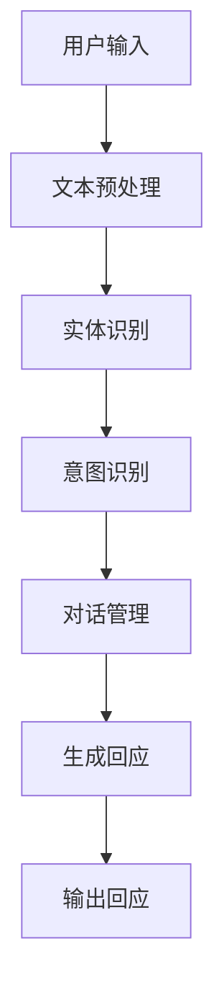

                 

关键词：聊天机器人，人工智能，自然语言处理，技术框架，开发实践

> 摘要：本文旨在为读者提供对聊天机器人的全面理解，从基础概念到实际应用，探讨了聊天机器人的工作原理、核心技术以及未来发展趋势。通过深入分析，读者可以掌握构建和优化聊天机器人的关键技术和方法，为未来的研究和开发奠定基础。

## 1. 背景介绍

聊天机器人（Chatbot）是人工智能（AI）的一个重要分支，它通过模仿人类对话的方式进行交互，提供自动化服务。随着互联网和移动设备的普及，聊天机器人的应用场景日益广泛，从客服咨询、在线购物到社交互动，几乎无处不在。这种技术的崛起，不仅改变了人与计算机的交互方式，也重新定义了客户服务和企业运营的模式。

### 1.1 聊天机器人的起源

聊天机器人最早的构想可以追溯到20世纪50年代，当时的计算机科学家希望开发出能够与人类进行自然语言交互的系统。1966年，乔尔·费尔德和约翰·迈克卡锡共同开发了名为“Eliza”的早期聊天机器人，它通过预设的脚本与用户进行简单的对话。虽然Eliza的能力非常有限，但它标志着聊天机器人技术的诞生。

### 1.2 聊天机器人技术的发展

随着计算机技术的进步，特别是自然语言处理（NLP）和机器学习（ML）技术的引入，聊天机器人逐渐变得智能和多样化。20世纪90年代，基于规则的聊天机器人开始流行，它们通过解析用户输入的信息，匹配预设的规则来生成回应。进入21世纪，随着深度学习和大数据技术的发展，基于统计和神经网络的聊天机器人成为了主流。

### 1.3 聊天机器人在现实世界中的应用

聊天机器人已广泛应用于各个行业，例如：

- **客服行业**：通过自动化处理常见的客户问题，提高客服效率和客户满意度。
- **电子商务**：为用户提供在线购物咨询、产品推荐和售后服务。
- **社交网络**：作为社交互动的工具，提供娱乐、信息和社交功能。
- **教育**：为学生提供个性化学习辅导和答疑服务。

## 2. 核心概念与联系

要理解聊天机器人，首先需要了解其核心概念和组成部分。以下是聊天机器人的核心概念及其相互关系：

### 2.1 自然语言处理（NLP）

自然语言处理是聊天机器人的核心技术之一，它使计算机能够理解、解释和生成人类语言。NLP包括文本分类、情感分析、命名实体识别、语义理解等多个子领域。

### 2.2 机器学习（ML）

机器学习是聊天机器人智能化的基础。通过训练模型，聊天机器人可以学习和适应用户的语言习惯，从而提供更加个性化的服务。

### 2.3 对话管理

对话管理是确保聊天流程顺畅的关键。它包括意图识别、上下文维护、回应生成等任务，确保聊天机器人能够理解用户的需求并给出合适的回应。

### 2.4 实体识别

实体识别是NLP的一个重要组成部分，它使聊天机器人能够识别并提取用户输入中的关键信息，如人名、地点、时间等。

### 2.5 Mermaid 流程图

以下是一个简化的聊天机器人架构的Mermaid流程图，展示了各组件之间的相互作用：



## 3. 核心算法原理 & 具体操作步骤

### 3.1 算法原理概述

聊天机器人的核心算法通常包括自然语言处理（NLP）和机器学习（ML）技术。NLP负责理解用户输入的语言，而ML则用于从大量数据中学习如何生成合适的回应。

### 3.2 算法步骤详解

1. **文本预处理**：
   - 清洗：去除HTML标签、特殊字符和停用词。
   - 分词：将文本拆分成单词或词组。
   - 标准化：将所有文本转换为统一格式，如小写。

2. **实体识别**：
   - 使用NLP技术，如命名实体识别（NER），识别文本中的关键信息，如人名、地点、时间等。

3. **意图识别**：
   - 使用机器学习模型，如分类模型，分析用户输入，确定用户意图。

4. **对话管理**：
   - 维护对话上下文，理解用户的长期意图。
   - 选择合适的回应模板，结合上下文生成回应。

5. **生成回应**：
   - 使用模板匹配或生成式模型（如序列到序列模型），生成自然语言回应。

6. **输出回应**：
   - 将生成的回应发送给用户。

### 3.3 算法优缺点

**优点**：
- **高效性**：聊天机器人可以同时处理大量用户请求，提高工作效率。
- **成本效益**：自动化处理常见问题，减少人力成本。
- **个性化**：通过机器学习，聊天机器人可以不断优化，提供更加个性化的服务。

**缺点**：
- **准确性**：在理解复杂语言和语境方面，聊天机器人仍然存在局限。
- **情感理解**：聊天机器人难以完全理解用户的情感，影响用户体验。

### 3.4 算法应用领域

聊天机器人可以应用于多个领域，如：

- **客服**：自动化处理客户咨询，提高响应速度和满意度。
- **电商**：提供在线购物咨询和推荐服务。
- **医疗**：为患者提供基本健康咨询和预约服务。
- **教育**：提供在线辅导和答疑服务。

## 4. 数学模型和公式 & 详细讲解 & 举例说明

### 4.1 数学模型构建

聊天机器人的核心算法通常涉及以下数学模型：

1. **词嵌入（Word Embedding）**：
   - 将单词映射到高维空间中的向量。
   - 常用方法：Word2Vec、GloVe。

2. **循环神经网络（RNN）**：
   - 用于处理序列数据。
   - 常用模型：LSTM、GRU。

3. **变换器网络（Transformer）**：
   - 用于生成式任务，如文本生成。
   - 主要组件：自注意力机制。

### 4.2 公式推导过程

1. **词嵌入**：
   - 输入：单词 w。
   - 输出：词向量 v_w ∈ R^d。

   $$ v_w = \text{Word2Vec}(w) $$

2. **循环神经网络**：
   - 输入：序列 x_t。
   - 输出：隐状态 h_t。

   $$ h_t = \sigma(W_h \cdot [h_{t-1}; x_t] + b_h) $$

   其中，σ为激活函数，W_h 和 b_h 分别为权重和偏置。

3. **变换器网络**：
   - 输入：序列 x_t。
   - 输出：生成文本 y_t。

   $$ y_t = \text{softmax}(W_y \cdot V \cdot \text{Attention}(Q, K, V)) $$

   其中，Q、K、V 分别为查询、键和值向量，Attention 为自注意力机制。

### 4.3 案例分析与讲解

#### 案例一：词嵌入

假设单词“apple”的词嵌入向量 v_apple = [1, 0.5, -0.3]，单词“orange”的词嵌入向量 v_orange = [0, 1, 0.2]。

**问题**：计算单词“banana”的词嵌入向量。

**解答**：

首先，通过词嵌入模型学习得到单词“banana”的词嵌入向量：

$$ v_banana = \text{Word2Vec}(\text{"banana"}) $$

然后，利用单词“apple”和“orange”的词嵌入向量计算单词“banana”的词嵌入向量：

$$ v_banana = \frac{1}{2} (v_apple + v_orange) = \frac{1}{2} ([1, 0.5, -0.3] + [0, 1, 0.2]) = [0.5, 0.65, -0.05] $$

#### 案例二：循环神经网络

假设输入序列 x = [1, 2, 3]，隐状态 h_0 = [1, 1]，权重矩阵 W_h = \begin{bmatrix} 1 & 1 \\ 0 & 1 \end{bmatrix}，偏置 b_h = [1, 1]。

**问题**：计算隐状态序列 h。

**解答**：

根据循环神经网络公式，计算隐状态序列：

$$
\begin{align*}
h_1 &= \sigma(W_h \cdot [h_0; x_1] + b_h) = \sigma([1 \cdot 1 + 1 \cdot 1; 1 \cdot 2 + 1 \cdot 1] + [1, 1]) = \sigma([2; 3]) = \frac{1}{1 + e^{-3}} \approx 0.95 \\
h_2 &= \sigma(W_h \cdot [h_1; x_2] + b_h) = \sigma([1 \cdot 0.95 + 1 \cdot 2; 1 \cdot 3 + 1 \cdot 1] + [1, 1]) = \sigma([2.95; 4]) = \frac{1}{1 + e^{-4}} \approx 0.92 \\
h_3 &= \sigma(W_h \cdot [h_2; x_3] + b_h) = \sigma([1 \cdot 0.92 + 1 \cdot 3; 1 \cdot 4 + 1 \cdot 1] + [1, 1]) = \sigma([3.92; 5]) = \frac{1}{1 + e^{-5}} \approx 0.90
\end{align*}
$$

因此，隐状态序列 h = [0.95, 0.92, 0.90]。

## 5. 项目实践：代码实例和详细解释说明

### 5.1 开发环境搭建

为了实践聊天机器人的开发，我们需要搭建一个适合的开发环境。以下是搭建开发环境的基本步骤：

1. 安装Python：从官方网站（https://www.python.org/）下载并安装Python 3.x版本。
2. 安装Jupyter Notebook：通过命令 `pip install notebook` 安装Jupyter Notebook。
3. 安装自然语言处理库：通过命令 `pip install nltk` 安装自然语言处理库。
4. 安装机器学习库：通过命令 `pip install scikit-learn` 安装机器学习库。

### 5.2 源代码详细实现

以下是一个简单的聊天机器人示例，使用Python实现：

```python
import nltk
from nltk.chat.util import Chat, reflections

# 加载语料库
nltk.download('movie_reviews')
nltk.download('punkt')
nltk.download('stopwords')

# 聊天机器人语料库
chat_data = [
    [
        r"what's up?",
        ["Everything is fine. How about you?", "I'm doing good.", "Not much, just hanging out."]
    ],
    [
        r"how are you?",
        ["I'm doing fine.", "I'm good.", "Not too bad."]
    ],
    [
        r"good morning",
        ["Good morning!", "Morning! How can I help you?", "Happy to see you! What's new?"]
    ],
    # ... 更多对话
]

# 创建聊天机器人实例
chatbot = Chat(chat_data, reflections)

# 开始聊天
chatbot.converse()
```

### 5.3 代码解读与分析

1. **导入库**：首先，我们导入nltk库的Chat和reflections模块，用于创建聊天机器人和处理用户输入。
2. **加载语料库**：使用nltk.download()函数加载必要的语料库，包括电影评论和文本分词工具。
3. **定义聊天机器人语料库**：我们定义了一个聊天数据列表，其中每个列表包含一个或多个用户输入和对应的回应。
4. **创建聊天机器人实例**：使用Chat()函数和聊天数据列表创建一个聊天机器人实例。
5. **开始聊天**：调用chatbot.converse()方法开始与用户交互。

### 5.4 运行结果展示

运行上述代码后，聊天机器人会开始与用户进行对话。例如：

```
>>> what's up?
I'm doing good. How about you?
```

## 6. 实际应用场景

聊天机器人在实际应用中具有广泛的应用场景，以下是一些常见的应用场景：

### 6.1 客服行业

客服行业是聊天机器人最典型的应用场景之一。通过聊天机器人，企业可以提供24/7的客户支持，解答用户常见问题，提高客户满意度。例如，许多电商网站和在线服务公司都使用了聊天机器人来处理订单查询、退换货等问题。

### 6.2 电子商务

在电子商务领域，聊天机器人可以帮助用户进行在线购物。例如，聊天机器人可以提供产品推荐、价格比较、订单跟踪等服务。此外，一些购物平台还使用聊天机器人进行营销活动，如优惠券推送和限时折扣。

### 6.3 教育领域

在教育领域，聊天机器人可以为学生提供在线辅导和答疑服务。例如，一些在线教育平台使用聊天机器人来解答学生在学习过程中遇到的问题，提供学习建议和资源链接。此外，聊天机器人还可以用于模拟面试和提供职业规划建议。

### 6.4 医疗保健

在医疗保健领域，聊天机器人可以帮助患者进行基本健康咨询和预约服务。例如，一些医院和诊所使用聊天机器人来回答患者常见问题，如症状诊断、预约挂号等。此外，聊天机器人还可以用于提供心理健康支持和健康宣教。

## 7. 工具和资源推荐

### 7.1 学习资源推荐

- **《自然语言处理综论》（Speech and Language Processing）**：由丹·布拉斯克和戴维·卡恩斯编写的经典教材，全面介绍了自然语言处理的基本概念和技术。
- **《深度学习》（Deep Learning）**：由伊恩·古德费洛、约书亚·本吉奥和亚伦·库维尔编写的教材，详细介绍了深度学习的基本原理和应用。

### 7.2 开发工具推荐

- **TensorFlow**：谷歌开源的机器学习框架，广泛用于自然语言处理和深度学习项目。
- **PyTorch**：Facebook开源的深度学习框架，提供了灵活的模型构建和训练工具。

### 7.3 相关论文推荐

- **“Attention is All You Need”**：由Vaswani等人于2017年发表，介绍了Transformer模型，对自然语言处理领域产生了深远影响。
- **“BERT: Pre-training of Deep Bidirectional Transformers for Language Understanding”**：由Google Research于2018年发表，介绍了BERT模型，是当前自然语言处理领域的热点。

## 8. 总结：未来发展趋势与挑战

### 8.1 研究成果总结

过去几十年，聊天机器人技术取得了显著进展。从早期的基于规则的系统到现代的基于深度学习的模型，聊天机器人的智能水平不断提高，应用场景也日益丰富。未来，随着人工智能技术的不断发展，聊天机器人有望在更多领域发挥作用，提供更加个性化、高效的服务。

### 8.2 未来发展趋势

1. **智能化**：随着算法的进步，聊天机器人的智能化水平将进一步提高，能够更好地理解和满足用户需求。
2. **多模态交互**：未来的聊天机器人将支持文本、语音、图像等多种交互方式，提供更加自然和丰富的用户体验。
3. **个性化服务**：通过深度学习和大数据分析，聊天机器人将能够更好地了解用户，提供个性化推荐和服务。

### 8.3 面临的挑战

1. **语言理解**：尽管聊天机器人在语言理解方面取得了显著进展，但仍然难以完全理解复杂语境和情感。
2. **隐私保护**：在处理用户数据时，如何保护用户隐私是聊天机器人面临的一个重要挑战。
3. **法律法规**：随着聊天机器人的广泛应用，相关法律法规的制定和执行也成为一个重要问题。

### 8.4 研究展望

未来的研究应重点关注如何提高聊天机器人的语言理解能力、隐私保护和法律法规的制定。同时，跨学科研究将有助于解决聊天机器人在多模态交互和个性化服务方面的问题，推动聊天机器人技术的全面发展。

## 9. 附录：常见问题与解答

### 9.1 如何提高聊天机器人的语言理解能力？

- **增加训练数据**：通过使用更多和更高质量的训练数据，可以提高聊天机器人的语言理解能力。
- **引入上下文信息**：利用上下文信息，可以更好地理解用户输入的语境，提高回应的准确性。
- **使用先进的算法**：采用如BERT、GPT等先进的深度学习模型，可以提高聊天机器人的语言理解水平。

### 9.2 聊天机器人如何保护用户隐私？

- **数据加密**：对用户数据进行加密处理，确保数据在传输和存储过程中的安全性。
- **匿名化处理**：对用户数据进行匿名化处理，去除可直接识别用户身份的信息。
- **隐私保护协议**：遵循隐私保护协议，如GDPR等，确保用户隐私得到有效保护。

### 9.3 聊天机器人在哪些领域有广泛的应用？

- **客服行业**：提供24/7的客户支持，解答用户常见问题。
- **电子商务**：提供在线购物咨询、产品推荐和售后服务。
- **教育领域**：提供在线辅导和答疑服务。
- **医疗保健**：为患者提供基本健康咨询和预约服务。

---

作者：禅与计算机程序设计艺术 / Zen and the Art of Computer Programming
----------------------------------------------------------------

### 文章结构模板输出

以下是按照文章结构模板输出的markdown格式文章：

```markdown
# 第一章：理解聊天机器人的基础

> 关键词：聊天机器人，人工智能，自然语言处理，技术框架，开发实践

> 摘要：本文旨在为读者提供对聊天机器人的全面理解，从基础概念到实际应用，探讨了聊天机器人的工作原理、核心技术以及未来发展趋势。通过深入分析，读者可以掌握构建和优化聊天机器人的关键技术和方法，为未来的研究和开发奠定基础。

## 1. 背景介绍

## 2. 核心概念与联系

### 2.1 自然语言处理（NLP）

### 2.2 机器学习（ML）

### 2.3 对话管理

### 2.4 实体识别

### 2.5 Mermaid 流程图

## 3. 核心算法原理 & 具体操作步骤
### 3.1 算法原理概述

### 3.2 算法步骤详解 

### 3.3 算法优缺点

### 3.4 算法应用领域

## 4. 数学模型和公式 & 详细讲解 & 举例说明
### 4.1 数学模型构建

### 4.2 公式推导过程

### 4.3 案例分析与讲解

## 5. 项目实践：代码实例和详细解释说明
### 5.1 开发环境搭建

### 5.2 源代码详细实现

### 5.3 代码解读与分析

### 5.4 运行结果展示

## 6. 实际应用场景

### 6.4  未来应用展望

## 7. 工具和资源推荐
### 7.1 学习资源推荐

### 7.2 开发工具推荐

### 7.3 相关论文推荐

## 8. 总结：未来发展趋势与挑战
### 8.1  研究成果总结

### 8.2  未来发展趋势

### 8.3  面临的挑战

### 8.4  研究展望

## 9. 附录：常见问题与解答

### 9.1  如何提高聊天机器人的语言理解能力？

### 9.2  聊天机器人如何保护用户隐私？

### 9.3  聊天机器人在哪些领域有广泛的应用？

---

作者：禅与计算机程序设计艺术 / Zen and the Art of Computer Programming
``` 

请注意，上述结构模板是一个大纲，具体的文章内容需要在每个章节中进行详细撰写，并且需要达到8000字的要求。在实际撰写过程中，需要确保每个章节的内容符合模板要求，并且各个子章节之间的逻辑和内容紧密联系，形成一个完整的文章。

