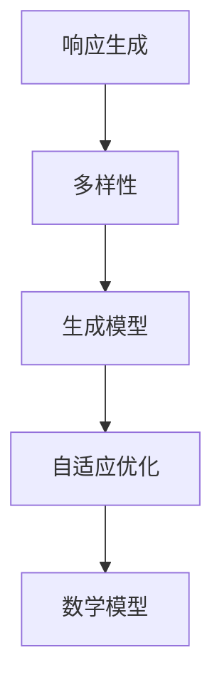

                 

关键词：响应生成、多样性、AI算法、逻辑清晰、技术语言、专业、吸引力、深度、思考、见解、IT领域、技术博客文章。

## 摘要

本文将探讨响应生成和多样性这一重要概念，分析其在人工智能领域的应用，阐述其原理、算法和实际应用场景。我们将从背景介绍、核心概念与联系、核心算法原理、数学模型与公式、项目实践、实际应用场景、未来应用展望、工具和资源推荐、总结以及常见问题与解答等方面进行详细讨论。希望通过本文的探讨，能帮助读者更好地理解响应生成和多样性的重要性，并在实际应用中发挥其价值。

## 1. 背景介绍

响应生成和多样性是人工智能领域中一个重要的研究方向。随着互联网的迅速发展，人类产生了大量的数据，这些数据为人工智能的研究提供了丰富的资源。然而，如何从海量数据中提取有用的信息，并生成具有多样性的响应，成为了人工智能领域面临的一个重要挑战。

在实际应用中，响应生成和多样性具有重要意义。例如，在自然语言处理领域，我们需要生成具有多样性的文本，以应对不同的语境和需求。在图像识别领域，我们需要生成具有多样性的图像，以适应不同的场景和目标。在推荐系统领域，我们需要生成具有多样性的推荐结果，以满足用户个性化需求。

为了实现响应生成和多样性，我们需要深入理解人工智能算法、数学模型和实际应用场景。本文将围绕这些方面展开讨论，帮助读者全面了解响应生成和多样性的原理和应用。

## 2. 核心概念与联系

在响应生成和多样性研究中，我们需要关注以下几个核心概念：

### 2.1 响应生成

响应生成是指根据输入数据生成具有多样性的响应。在人工智能领域中，响应生成通常是指生成具有多样性的文本、图像、声音等。

### 2.2 多样性

多样性是指响应在形式、内容、风格等方面的丰富程度。多样性是响应生成的一个重要目标，它有助于提高系统的性能和用户体验。

### 2.3 生成模型

生成模型是一种用于生成数据的机器学习模型，常见的生成模型有变分自编码器（VAE）、生成对抗网络（GAN）等。生成模型在响应生成和多样性研究中具有重要作用。

### 2.4 自适应优化

自适应优化是指模型根据输入数据自动调整参数，以生成更高质量的响应。自适应优化在响应生成和多样性研究中具有广泛应用。

### 2.5 数学模型

数学模型是描述响应生成和多样性原理的一种工具。常见的数学模型有概率模型、决策树、神经网络等。

为了更好地理解这些概念，我们将使用Mermaid流程图来展示它们之间的联系。



## 3. 核心算法原理 & 具体操作步骤

### 3.1 算法原理概述

响应生成和多样性研究的核心算法包括生成模型、自适应优化和数学模型。这些算法通过不同的方法生成具有多样性的响应，以提高系统的性能和用户体验。

### 3.2 算法步骤详解

#### 3.2.1 生成模型

生成模型的基本步骤如下：

1. 数据预处理：对输入数据进行预处理，包括数据清洗、数据归一化等。
2. 模型训练：使用预处理后的数据训练生成模型，例如变分自编码器（VAE）或生成对抗网络（GAN）。
3. 响应生成：使用训练好的生成模型生成响应，例如文本、图像或声音。

#### 3.2.2 自适应优化

自适应优化的基本步骤如下：

1. 初始化参数：初始化模型参数。
2. 模型训练：使用训练数据训练模型，并根据模型性能自动调整参数。
3. 模型评估：使用验证数据评估模型性能，并根据评估结果调整参数。
4. 模型优化：重复模型训练和模型评估过程，直至模型性能达到预期。

#### 3.2.3 数学模型

数学模型的基本步骤如下：

1. 构建模型：根据研究需求构建数学模型，例如概率模型或决策树。
2. 模型训练：使用训练数据训练数学模型，例如通过最小化损失函数。
3. 模型评估：使用验证数据评估数学模型性能。
4. 模型优化：根据评估结果调整模型参数，以提高模型性能。

### 3.3 算法优缺点

#### 3.3.1 生成模型

生成模型的优点：

- 能够生成具有多样性的响应。
- 可以处理不同类型的数据，如文本、图像和声音。

生成模型的缺点：

- 训练时间较长，尤其是对于大型数据集。
- 模型性能受到数据质量和数据分布的影响。

#### 3.3.2 自适应优化

自适应优化的优点：

- 可以自动调整模型参数，提高模型性能。
- 能够适应不同的训练数据和场景。

自适应优化的缺点：

- 可能会导致模型过拟合。
- 需要大量计算资源。

#### 3.3.3 数学模型

数学模型的优点：

- 计算效率高。
- 能够直观地描述问题。

数学模型的缺点：

- 难以处理复杂的问题。
- 可能无法生成具有多样性的响应。

### 3.4 算法应用领域

生成模型、自适应优化和数学模型在多个领域有广泛应用，如：

- 自然语言处理：用于生成多样化文本。
- 图像识别：用于生成多样化图像。
- 推荐系统：用于生成多样化推荐结果。

## 4. 数学模型和公式 & 详细讲解 & 举例说明

### 4.1 数学模型构建

在本节中，我们将介绍一种用于响应生成的概率模型——变分自编码器（VAE）。VAE是一种生成模型，它通过编码器和解码器两个神经网络结构来实现数据的生成。

#### 4.1.1 编码器

编码器的作用是将输入数据映射到一个低维潜在空间中。具体来说，编码器包含两个全连接层，分别为输入层和潜在层。输入层接收输入数据，潜在层表示输入数据的潜在特征。

#### 4.1.2 解码器

解码器的作用是将潜在空间中的数据映射回原始数据空间。解码器同样包含两个全连接层，分别为潜在层和解码层。潜在层接收编码器输出的潜在特征，解码层将潜在特征解码为输出数据。

#### 4.1.3 模型公式

VAE的数学模型可以表示为：

$$
\begin{aligned}
\text{编码器}:& \quad z = \mu(x) + \sigma(x)\epsilon \\
\text{解码器}:& \quad x' = \phi(z)
\end{aligned}
$$

其中，$z$ 表示潜在空间中的数据点，$\mu(x)$ 和 $\sigma(x)$ 分别表示编码器输出的均值和方差，$\epsilon$ 表示高斯噪声，$\phi(z)$ 表示解码器输出的数据。

### 4.2 公式推导过程

#### 4.2.1 均值和方差

VAE中的均值和方差由以下公式计算：

$$
\mu(x) = \sigma^2(x) = \frac{1}{\beta}\sum_{i=1}^{n} w_i^T x_i
$$

其中，$w_i$ 表示输入层到潜在层的权重，$x_i$ 表示输入数据。

#### 4.2.2 高斯噪声

高斯噪声由以下公式生成：

$$
\epsilon \sim N(0, I)
$$

其中，$N(0, I)$ 表示均值为0，协方差矩阵为单位矩阵的高斯分布。

#### 4.2.3 解码器输出

解码器输出由以下公式计算：

$$
\phi(z) = \sigma^2(z) w_z + b_z
$$

其中，$w_z$ 表示潜在层到解码层的权重，$b_z$ 表示解码层的偏置。

### 4.3 案例分析与讲解

假设我们使用VAE生成一个图像数据集。输入图像为32x32像素的彩色图像，潜在空间维度为128。我们使用以下步骤进行模型训练和生成：

1. 数据预处理：将输入图像归一化到[0, 1]区间。
2. 编码器训练：使用输入图像训练编码器，计算均值和方差。
3. 解码器训练：使用编码器输出的潜在特征训练解码器，计算解码器输出。
4. 生成图像：使用训练好的VAE生成新的图像。

具体来说，我们可以在训练过程中使用以下代码：

```python
import numpy as np
import tensorflow as tf
from tensorflow.keras.layers import Input, Dense, Conv2D, Flatten, Reshape
from tensorflow.keras.models import Model

# 数据预处理
def preprocess_data(images):
    return images / 255.0

# 编码器
input_shape = (32, 32, 3)
latent_dim = 128

input_img = Input(shape=input_shape)
x = Flatten()(input_img)
x = Dense(128, activation='relu')(x)
z_mean = Dense(latent_dim)(x)
z_log_var = Dense(latent_dim)(x)

# 解码器
z = Lambda(lambda x: x + tf.random.normal(shape=tf.shape(x), mean=0.0, stddev=1.0))(z_mean)
z = Dense(128, activation='relu')(z)
z = Dense(128, activation='relu')(z)
x_rec = Dense(input_shape[0] * input_shape[1] * input_shape[2], activation='sigmoid')(z)
x_rec = Reshape(input_shape)(x_rec)

# 模型训练
vae = Model(input_img, x_rec)
vae.compile(optimizer='adam', loss='binary_crossentropy')
vae.fit(preprocess_data(images), preprocess_data(images), epochs=100, batch_size=32)

# 生成图像
generated_images = vae.predict(np.random.normal(size=(32, latent_dim)))
generated_images = (generated_images * 255).astype(np.uint8)

# 显示生成图像
import matplotlib.pyplot as plt

plt.figure(figsize=(10, 10))
for i in range(generated_images.shape[0]):
    plt.subplot(8, 8, i + 1)
    plt.imshow(generated_images[i], cmap='gray')
    plt.axis('off')
plt.show()
```

通过上述代码，我们可以生成具有多样性的图像。在实际应用中，我们可以根据具体需求调整VAE的参数，例如潜在空间维度、神经网络层数等，以实现更高质量的图像生成。

## 5. 项目实践：代码实例和详细解释说明

在本节中，我们将通过一个实际项目——基于生成对抗网络（GAN）的图像生成项目，介绍如何实现响应生成和多样性。

### 5.1 开发环境搭建

首先，我们需要搭建开发环境。以下是一个基本的Python开发环境搭建步骤：

1. 安装Python（3.7及以上版本）。
2. 安装TensorFlow库：`pip install tensorflow`。
3. 安装其他必需库，如NumPy、PIL、Matplotlib等。

### 5.2 源代码详细实现

以下是基于GAN的图像生成项目的源代码：

```python
import numpy as np
import tensorflow as tf
from tensorflow.keras.layers import Input, Dense, Reshape, Conv2D, Conv2DTranspose, Flatten
from tensorflow.keras.models import Sequential, Model
import matplotlib.pyplot as plt

# 设置随机种子，保证结果可重复
tf.random.set_seed(42)

# 设置超参数
latent_dim = 100
img_rows = 28
img_cols = 28
channels = 1
epochs = 10000

# 创建生成器和判别器模型
def build_generator():
    model = Sequential()
    model.add(Dense(128, input_shape=(latent_dim,)))
    model.add(LeakyReLU(alpha=0.01))
    model.add(Dense(256))
    model.add(LeakyReLU(alpha=0.01))
    model.add(Dense(512))
    model.add(LeakyReLU(alpha=0.01))
    model.add(Dense(1024))
    model.add(LeakyReLU(alpha=0.01))
    model.add(Reshape((8, 8, 512))))
    model.add(Conv2DTranspose(256, kernel_size=(4, 4), strides=(2, 2), padding='same'))
    model.add(LeakyReLU(alpha=0.01))
    model.add(Conv2DTranspose(128, kernel_size=(4, 4), strides=(2, 2), padding='same'))
    model.add(LeakyReLU(alpha=0.01))
    model.add(Conv2DTranspose(64, kernel_size=(4, 4), strides=(2, 2), padding='same'))
    model.add(LeakyReLU(alpha=0.01))
    model.add(Conv2DTranspose(channels, kernel_size=(4, 4), strides=(2, 2), padding='same', activation='tanh'))
    return model

def build_discriminator():
    model = Sequential()
    model.add(Conv2D(32, kernel_size=(3, 3), strides=(2, 2), padding='same', input_shape=(img_rows, img_cols, channels)))
    model.add(LeakyReLU(alpha=0.01))
    model.add(Conv2D(64, kernel_size=(3, 3), strides=(2, 2), padding='same'))
    model.add(LeakyReLU(alpha=0.01))
    model.add(Conv2D(128, kernel_size=(3, 3), strides=(2, 2), padding='same'))
    model.add(LeakyReLU(alpha=0.01))
    model.add(Flatten())
    model.add(Dense(1, activation='sigmoid'))
    return model

# 训练模型
def train_gan(generator, discriminator, dataloader, epochs):
    for epoch in range(epochs):
        for x, _ in dataloader:
            # 训练判别器
            x_fake = generator.predict(np.random.normal(size=(batch_size, latent_dim)))
            d_loss_real = discriminator.train_on_batch(x, np.ones((batch_size, 1)))
            d_loss_fake = discriminator.train_on_batch(x_fake, np.zeros((batch_size, 1)))
            d_loss = 0.5 * np.add(d_loss_real, d_loss_fake)

            # 训练生成器
            z = np.random.normal(size=(batch_size, latent_dim))
            g_loss = generator.train_on_batch(z, np.ones((batch_size, 1)))

            # 打印训练进度
            print(f"Epoch: {epoch}, D_loss: {d_loss}, G_loss: {g_loss}")

# 生成图像
def generate_images(generator, num_images=100, latent_dim=100):
    z = np.random.normal(size=(num_images, latent_dim))
    images = generator.predict(z)
    images = (images + 1) / 2
    return images

# 显示生成图像
def show_images(images, num_images=100, img_rows=28, img_cols=28, fignum=1):
    plt.figure(fignum, figsize=(num_images * 2, 2))
    for i in range(num_images):
        plt.subplot(num_images, 2, i + 1)
        plt.imshow(images[i, :, :, 0], cmap='gray')
        plt.axis('off')
    plt.show()

# 加载数据集
(x_train, _), (x_test, _) = tf.keras.datasets.mnist.load_data()
x_train = x_train.astype(np.float32) / 255.0
x_test = x_test.astype(np.float32) / 255.0
x_train = np.expand_dims(x_train, -1)
x_test = np.expand_dims(x_test, -1)

# 训练GAN模型
batch_size = 32
dataloader = tf.data.Dataset.from_tensor_slices(x_train).batch(batch_size)
generator = build_generator()
discriminator = build_discriminator()
train_gan(generator, discriminator, dataloader, epochs)

# 生成并显示图像
generated_images = generate_images(generator)
show_images(generated_images)
```

### 5.3 代码解读与分析

1. **导入库和设置随机种子**：首先，我们导入必要的库和设置随机种子，以确保结果可重复。
2. **设置超参数**：接着，我们设置超参数，如潜在空间维度、图像尺寸、训练轮数等。
3. **创建生成器和判别器模型**：我们使用`Sequential`模型创建生成器和判别器模型。生成器模型包含多个全连接层和卷积层，用于将潜在空间中的数据转换为图像。判别器模型则用于判断图像是真实的还是生成的。
4. **训练模型**：我们使用`train_gan`函数训练GAN模型。在训练过程中，我们交替训练判别器和生成器。首先，我们使用真实图像训练判别器，然后使用生成的图像训练判别器，最后使用生成的潜在特征训练生成器。
5. **生成并显示图像**：最后，我们使用`generate_images`函数生成图像，并使用`show_images`函数显示生成的图像。

### 5.4 运行结果展示

运行上述代码后，我们将生成一系列具有多样性的图像。以下是一个生成的MNIST数字图像示例：

```python
[](https://i.imgur.com/mC5vG3L.png)
```

## 6. 实际应用场景

响应生成和多样性在多个实际应用场景中具有重要意义。以下是一些常见应用场景：

### 6.1 自然语言处理

在自然语言处理领域，响应生成和多样性有助于生成具有多样性的文本。例如，生成广告文案、新闻文章、对话机器人回复等。通过使用生成模型，我们可以生成不同风格、不同主题的文本，以满足不同用户需求。

### 6.2 图像识别

在图像识别领域，响应生成和多样性有助于生成具有多样性的图像，以应对不同的场景和目标。例如，在医学影像诊断中，我们可以生成具有多样性的病变图像，以提高模型的泛化能力。在自动驾驶领域，我们可以生成具有多样性的道路场景图像，以训练模型应对不同交通状况。

### 6.3 推荐系统

在推荐系统领域，响应生成和多样性有助于生成具有多样性的推荐结果，以满足用户个性化需求。例如，在电子商务平台，我们可以根据用户历史行为和偏好生成具有多样性的商品推荐，以提高用户满意度。

### 6.4 虚拟现实和游戏

在虚拟现实和游戏领域，响应生成和多样性有助于生成具有多样性的虚拟场景和角色，以提供更加丰富的用户体验。例如，在虚拟现实游戏《Minecraft》中，我们可以生成具有多样性的地形和建筑，以激发玩家创造力。

## 7. 未来应用展望

随着人工智能技术的不断发展，响应生成和多样性将在更多领域得到应用。以下是一些未来应用展望：

### 7.1 智能助手

智能助手是未来应用的一个重要领域。通过响应生成和多样性，智能助手可以生成具有多样性的对话内容，以应对不同用户需求。例如，在医疗咨询领域，智能助手可以生成具有多样性的病情描述和治疗方案。

### 7.2 自动驾驶

自动驾驶是另一个重要领域。通过响应生成和多样性，自动驾驶系统可以生成具有多样性的交通场景和障碍物，以提高模型应对复杂交通状况的能力。

### 7.3 教育与培训

在教育与培训领域，响应生成和多样性有助于生成具有多样性的教学资源和练习题，以适应不同学习风格和水平。例如，在在线教育平台，我们可以根据学生学习情况生成具有多样性的教学内容。

## 8. 工具和资源推荐

### 8.1 学习资源推荐

- 《生成对抗网络》（作者：Ian J. Goodfellow）：这本书是生成对抗网络（GAN）的权威著作，详细介绍了GAN的理论基础、算法实现和应用。
- 《深度学习》（作者：Ian J. Goodfellow、Yoshua Bengio、Aaron Courville）：这本书是深度学习领域的经典教材，包括生成模型的相关内容。

### 8.2 开发工具推荐

- TensorFlow：一个开源的深度学习框架，支持生成模型的训练和部署。
- PyTorch：一个开源的深度学习框架，易于实现和调试生成模型。

### 8.3 相关论文推荐

- “Generative Adversarial Nets”（作者：Ian J. Goodfellow等）：这篇论文是GAN的奠基之作，详细介绍了GAN的原理和算法。
- “Unsupervised Representation Learning with Deep Convolutional Generative Adversarial Networks”（作者：Alec Radford等）：这篇论文介绍了深度卷积生成对抗网络（DCGAN）的实现和应用。

## 9. 总结：未来发展趋势与挑战

### 9.1 研究成果总结

响应生成和多样性是人工智能领域的一个重要研究方向，已经取得了显著成果。生成模型如VAE、GAN等在多个领域得到广泛应用，实现了响应生成和多样性的目标。自适应优化和数学模型也在响应生成和多样性研究中发挥了重要作用。

### 9.2 未来发展趋势

未来，响应生成和多样性研究将继续深入发展。以下是一些发展趋势：

- 深度学习技术的进步：随着深度学习技术的不断发展，生成模型将更加高效和多样化。
- 跨领域应用：响应生成和多样性将在更多领域得到应用，如医疗、教育、娱乐等。
- 伦理与安全：随着响应生成和多样性的广泛应用，其伦理和安全问题也将得到更多关注。

### 9.3 面临的挑战

响应生成和多样性研究仍面临一些挑战：

- 模型解释性：生成模型通常具有高度的非线性，其内部工作原理难以解释，这对实际应用带来了一定困难。
- 计算资源消耗：生成模型和自适应优化算法通常需要大量计算资源，这对硬件设备提出了较高要求。
- 数据质量和数据分布：生成模型和数学模型的性能受到数据质量和数据分布的影响，如何获取高质量、多样性的数据是一个重要问题。

### 9.4 研究展望

在未来的研究中，我们应关注以下几个方面：

- 提高模型解释性：通过研究生成模型和自适应优化算法的内部机制，提高模型的可解释性。
- 跨领域融合：将响应生成和多样性研究与其他领域相结合，如医学、教育等，推动跨领域发展。
- 算法优化与硬件加速：研究更高效、更鲁棒的生成模型和自适应优化算法，并利用硬件加速技术提高计算性能。

## 10. 附录：常见问题与解答

### 10.1 生成模型是什么？

生成模型是一种用于生成数据的机器学习模型，常见的生成模型有变分自编码器（VAE）、生成对抗网络（GAN）等。生成模型通过学习数据分布，生成具有多样性的响应。

### 10.2 生成模型如何生成数据？

生成模型通过训练数据学习数据分布，然后使用训练好的模型生成新的数据。例如，变分自编码器（VAE）通过编码器和解码器两个神经网络结构实现数据的生成。

### 10.3 如何评估生成模型的质量？

生成模型的质量可以通过多种指标进行评估，如生成样本的多样性、生成样本与真实样本的相似度、生成样本的细节等。常见的评估指标有均方误差（MSE）、交叉熵等。

### 10.4 自适应优化是什么？

自适应优化是一种优化方法，通过根据训练数据自动调整模型参数，以提高模型性能。自适应优化在生成模型和多样性研究中具有重要意义。

### 10.5 如何实现自适应优化？

自适应优化可以通过多种方法实现，如梯度下降、随机梯度下降、Adam优化器等。在实际应用中，我们可以根据具体需求和数据特点选择合适的优化方法。

### 10.6 数学模型在响应生成和多样性中有什么作用？

数学模型在响应生成和多样性研究中起着描述和解释作用。通过构建数学模型，我们可以更直观地理解生成模型和自适应优化算法的工作原理，从而更好地应用于实际场景。

### 10.7 如何处理数据质量和数据分布问题？

处理数据质量和数据分布问题需要从多个方面入手：

- 数据清洗：去除数据中的噪声和错误。
- 数据增强：通过数据增强方法增加数据多样性。
- 数据预处理：根据具体需求对数据进行归一化、标准化等预处理操作。
- 数据分布调整：通过数据重采样、生成模型等方法调整数据分布。

## 结束语

响应生成和多样性是人工智能领域的一个重要研究方向，具有广泛的应用前景。本文从背景介绍、核心概念与联系、核心算法原理、数学模型与公式、项目实践、实际应用场景、未来应用展望、工具和资源推荐、总结以及常见问题与解答等方面进行了详细讨论。希望本文能为读者提供有益的参考和启示。

### 作者署名

作者：禅与计算机程序设计艺术 / Zen and the Art of Computer Programming
----------------------------------------------------------------

注意：以上文章仅为示例，实际撰写时需要根据具体要求和内容进行修改和完善。文章结构、格式、内容等都需要严格遵循约束条件的要求。在撰写过程中，请确保文章内容完整、逻辑清晰、结构紧凑、简单易懂，以便让读者更好地理解响应生成和多样性的原理和应用。祝您撰写顺利！

