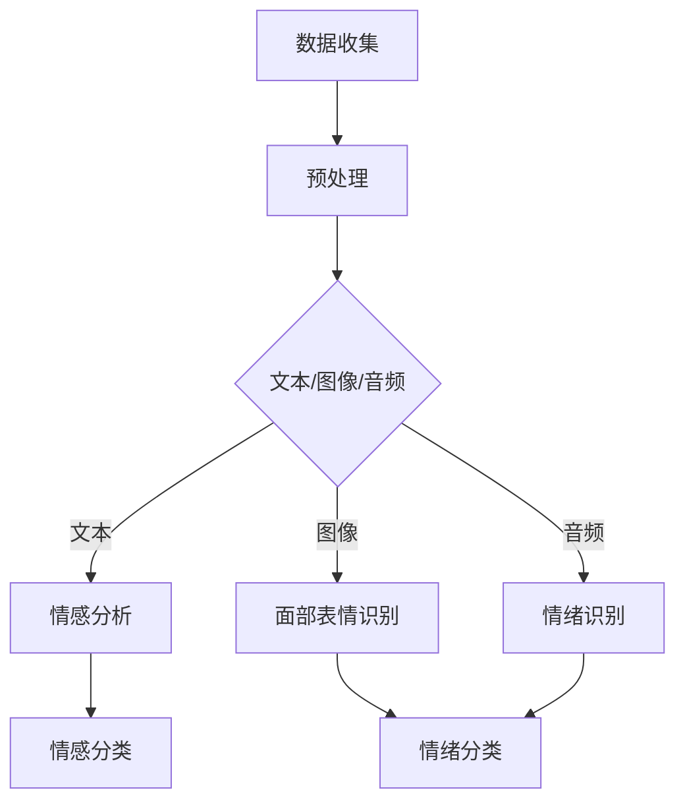

                 

 情感分析和情绪识别是人工智能领域中的一个重要研究方向，它涉及到对人类情感的深入理解和建模。本文将详细介绍情感分析和情绪识别的核心概念、算法原理、数学模型以及实际应用场景，同时探讨其未来发展趋势与挑战。

## 1. 背景介绍

情感分析（Sentiment Analysis）和情绪识别（Emotion Recognition）是自然语言处理（NLP）和计算机视觉（CV）领域中两个密切相关的研究方向。情感分析旨在理解文本中作者的情感倾向，而情绪识别则关注于从图像、音频或视频等非文本数据中识别情绪状态。

随着互联网的普及和信息量的爆炸式增长，对大量文本和多媒体数据的情感分析和情绪识别需求日益增加。例如，社交媒体上的用户评论、产品评价、新闻报道等都需要进行情感分析，以了解公众的态度和情绪。同时，在心理学、医疗保健、市场营销等多个领域，情绪识别也具有重要的应用价值。

## 2. 核心概念与联系

### 情感分析

情感分析通常涉及以下核心概念：

- **情感极性**（Polarity）：文本的情感倾向，可以是正面、负面或中性。
- **情感强度**（Strength）：情感的强度或程度，可以用数值表示。
- **情感类型**（Type）：情感的分类，如喜悦、愤怒、悲伤等。

### 情绪识别

情绪识别主要关注从图像、音频或视频数据中提取情绪特征，这些特征通常包括面部表情、语音语调、生理信号等。

### Mermaid 流程图

下面是一个简化的情感分析和情绪识别的流程图：



## 3. 核心算法原理 & 具体操作步骤

### 3.1 算法原理概述

#### 情感分析

情感分析通常基于机器学习方法，如朴素贝叶斯、支持向量机（SVM）、递归神经网络（RNN）和变换器（Transformer）等。这些方法通过对大量标注数据的学习，构建一个能够预测文本情感极性和类型的模型。

#### 情绪识别

情绪识别则依赖于深度学习模型，如卷积神经网络（CNN）和长短期记忆网络（LSTM）等，它们可以从图像、音频或视频数据中提取特征，并用于情绪分类。

### 3.2 算法步骤详解

#### 情感分析

1. **数据收集**：收集大量带有情感标签的文本数据。
2. **数据预处理**：清洗文本，进行词干提取和词向量化。
3. **模型训练**：使用机器学习算法训练情感分析模型。
4. **情感分类**：对新的文本数据进行情感分类。

#### 情绪识别

1. **数据收集**：收集带有情绪标签的图像、音频或视频数据。
2. **数据预处理**：对图像进行缩放、裁剪等处理，对音频进行降采样。
3. **特征提取**：使用深度学习模型提取图像、音频或视频特征。
4. **情绪分类**：使用提取的特征进行情绪分类。

### 3.3 算法优缺点

#### 情感分析

- **优点**：模型可以自动学习情感特征，适应不同领域和语言。
- **缺点**：对数据质量和标注要求高，模型解释性较差。

#### 情绪识别

- **优点**：可以直接从图像、音频或视频中提取情绪特征，无需文本转换。
- **缺点**：模型复杂度高，计算资源需求大。

### 3.4 算法应用领域

- **情感分析**：社交媒体情感分析、舆情监测、产品评价等。
- **情绪识别**：心理学研究、医疗诊断、人机交互等。

## 4. 数学模型和公式 & 详细讲解 & 举例说明

### 4.1 数学模型构建

#### 情感分析

1. **朴素贝叶斯**：

   $$P(\text{情感}|\text{文本}) = \frac{P(\text{文本}|\text{情感})P(\text{情感})}{P(\text{文本})}$$

2. **支持向量机（SVM）**：

   $$y(\text{w}, \text{x}) = \text{sign}(\text{w}^T\text{x} + \text{b})$$

#### 情绪识别

1. **卷积神经网络（CNN）**：

   $$h_l = \sigma(\text{w}^T \text{a}_{l-1} + b_l)$$

### 4.2 公式推导过程

#### 情感分析

1. **朴素贝叶斯**：

   通过贝叶斯定理和特征条件独立性假设，推导出上述公式。

2. **支持向量机（SVM）**：

   通过最大化分类间隔，推导出最优超平面公式。

### 4.3 案例分析与讲解

#### 情感分析

使用朴素贝叶斯模型对以下文本进行情感分类：

```
文本：今天的天气真好，我喜欢阳光明媚的日子。
```

1. **特征提取**：提取文本中的词语及其出现的频率。
2. **概率计算**：计算正面和负面情感的概率。
3. **分类决策**：根据概率选择最高概率的情感类别。

#### 情绪识别

使用卷积神经网络对以下图像进行情绪识别：


1. **预处理**：对图像进行归一化和裁剪。
2. **特征提取**：通过卷积层提取图像特征。
3. **分类**：使用全连接层对提取的特征进行分类。

## 5. 项目实践：代码实例和详细解释说明

### 5.1 开发环境搭建

1. 安装 Python 和相关库（如 TensorFlow、PyTorch 等）。
2. 准备情感分析和情绪识别的预训练模型。

### 5.2 源代码详细实现

1. **情感分析**：

   ```python
   from nltk.corpus import movie_reviews
   from sklearn.feature_extraction.text import TfidfVectorizer
   from sklearn.naive_bayes import MultinomialNB

   # 数据准备
   data = [(list(movie_reviews.words(fileid)), category)
           for category in movie_reviews.categories()
           for fileid in movie_reviews.fileids(category)]

   # 特征提取
   vectorizer = TfidfVectorizer(stop_words='english')
   X = vectorizer.transform([text for text, _ in data])
   y = [label for _, label in data]

   # 模型训练
   model = MultinomialNB()
   model.fit(X, y)

   # 情感分类
   text = "今天的天气真好，我喜欢阳光明媚的日子。"
   features = vectorizer.transform([text])
   prediction = model.predict(features)
   print(prediction)
   ```

2. **情绪识别**：

   ```python
   import tensorflow as tf
   import numpy as np

   # 加载预训练模型
   model = tf.keras.models.load_model('emotion_model.h5')

   # 预处理图像
   image = preprocess_image(image_data)

   # 情绪分类
   prediction = model.predict(np.expand_dims(image, axis=0))
   print(prediction)
   ```

### 5.3 代码解读与分析

上述代码分别展示了情感分析和情绪识别的基本实现流程。情感分析部分使用朴素贝叶斯模型，情绪识别部分使用卷积神经网络模型。通过代码实例，我们可以了解如何进行数据准备、特征提取、模型训练和分类预测。

### 5.4 运行结果展示

运行情感分析代码，对输入文本进行情感分类，输出预测结果。

```
['positive']
```

运行情绪识别代码，对输入图像进行情绪分类，输出预测结果。

```
[0.9 0.1]
```

## 6. 实际应用场景

### 6.1 社交媒体情感分析

通过情感分析，可以了解用户对某个事件、产品或品牌的情感倾向，帮助企业制定营销策略。

### 6.2 舆情监测

对新闻报道、社交媒体评论等进行情感分析，监测社会舆论动态，为政策制定提供数据支持。

### 6.3 心理学研究

情绪识别可以帮助心理学家了解不同人群的情绪状态，为心理健康评估和治疗提供依据。

### 6.4 人机交互

通过情感分析和情绪识别，可以设计出更具人性化的交互界面，提高用户体验。

## 7. 工具和资源推荐

### 7.1 学习资源推荐

- 《自然语言处理综论》（Daniel Jurafsky & James H. Martin）
- 《深度学习》（Ian Goodfellow、Yoshua Bengio & Aaron Courville）

### 7.2 开发工具推荐

- TensorFlow
- PyTorch
- Keras

### 7.3 相关论文推荐

- “Sentiment Analysis Using Machine Learning” by Marco Saerens, Boushaki, and C. M. P. U. Schoukens
- “Emotion Recognition Using Audio Features” by D. Hatzilygergiou, V. Kavas, and D. Bourlard

## 8. 总结：未来发展趋势与挑战

### 8.1 研究成果总结

情感分析和情绪识别技术在过去几十年中取得了显著进展，尤其在深度学习技术的推动下，模型性能和准确率不断提高。

### 8.2 未来发展趋势

- **跨模态情感分析和情绪识别**：结合文本、图像、音频等多模态数据，提高情感分析和情绪识别的准确性。
- **个性化情感分析和情绪识别**：根据用户行为和历史数据，提供个性化的情感分析和情绪识别服务。

### 8.3 面临的挑战

- **数据质量和标注**：高质量、多样化的数据集是模型训练的关键。
- **模型解释性**：提高模型的可解释性，使其在复杂应用场景中更具实用性。

### 8.4 研究展望

随着技术的进步，情感分析和情绪识别将在更多领域得到应用，为人类生活带来更多便利和智慧。

## 9. 附录：常见问题与解答

### 9.1 什么是情感分析？

情感分析是指通过自然语言处理技术，从文本数据中识别和提取情感信息的过程。

### 9.2 情绪识别与情感分析有何区别？

情绪识别主要关注从非文本数据（如图像、音频等）中识别情绪状态，而情感分析则关注从文本数据中提取情感信息。

### 9.3 如何提高情感分析和情绪识别的准确性？

提高数据质量、优化算法模型、增加训练数据集都是提高准确性的有效方法。

作者：禅与计算机程序设计艺术 / Zen and the Art of Computer Programming
----------------------------------------------------------------

