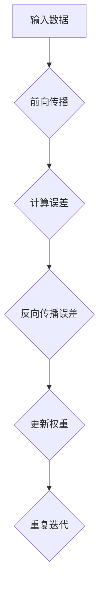

                 

### 1. 背景介绍

机器学习，作为人工智能领域的一个关键组成部分，近年来已经取得了显著的发展。其核心目标是通过从数据中学习规律，实现对未知数据的预测或分类。在这个过程中，反向传播算法（Backpropagation Algorithm）发挥了至关重要的作用。反向传播算法是一种用于多层神经网络训练的优化方法，它通过不断调整网络权重，使得网络能够更准确地预测输出。

反向传播算法的出现，标志着神经网络从简单的单层感知机（Perceptron）向多层网络的发展。在1986年由David E. Rumelhart、George E. Hinton和John L. McClelland首次提出后，反向传播算法迅速成为了机器学习领域的重要工具。它不仅大大提高了神经网络训练的效率，也推动了诸如深度学习等前沿技术的发展。

然而，反向传播算法的原理和实现并非一目了然，其中涉及许多微妙之处。本章将深入探讨这些微妙之处，包括算法的核心概念、实现步骤、优缺点以及应用领域。通过对这些内容的详细分析，读者将能够更好地理解反向传播算法的实质，并在实际应用中取得更好的效果。

### 2. 核心概念与联系

#### 2.1 反向传播算法的背景

反向传播算法的背景可以追溯到神经网络的研究早期。在20世纪50年代和60年代，科学家们开始探索如何通过模拟人脑的结构和功能来构建计算系统。最初的尝试是单层感知机，它只能处理线性可分的问题。然而，现实世界中的许多问题并非线性可分，这促使科学家们研究多层神经网络。

多层神经网络的关键挑战在于如何有效地训练它们。在单层网络中，通过调整权重可以实现目标的准确预测。然而，在多层网络中，如何将输出层的误差反向传播到输入层，并有效地调整每一层的权重，成为一个复杂的难题。反向传播算法正是为了解决这一难题而诞生的。

#### 2.2 算法原理概述

反向传播算法的核心思想是将输出层的误差反向传播到网络的每一层，并利用这些误差来调整网络权重。具体来说，反向传播算法包括以下几个步骤：

1. **前向传播**：将输入数据通过网络的各个层进行传播，得到输出结果。
2. **计算误差**：计算输出结果与真实值之间的差异，得到误差。
3. **反向传播误差**：将误差从输出层反向传播到输入层，通过链式法则计算每一层的误差。
4. **更新权重**：根据误差调整网络的权重，以减小误差。

#### 2.3 算法架构的 Mermaid 流程图

下面是一个简化的反向传播算法的 Mermaid 流程图：



在这个流程图中，每个节点代表算法的一个步骤，箭头表示数据的流动方向。前向传播将输入数据通过网络的各个层进行传播，得到输出结果。计算误差阶段计算输出结果与真实值之间的差异。反向传播误差阶段将误差从输出层反向传播到输入层。更新权重阶段根据误差调整网络的权重。这个过程会不断重复，直到网络输出结果的误差达到一个可以接受的阈值。

### 3. 核心算法原理 & 具体操作步骤

#### 3.1 算法原理概述

反向传播算法的核心在于如何计算误差并更新权重。下面将详细解释这些步骤。

#### 3.2 算法步骤详解

##### 步骤 1：前向传播

前向传播是将输入数据通过网络的各个层进行传播，得到输出结果。在每一层，神经元将输入值通过激活函数进行处理，然后将结果传递到下一层。

设输入数据为 $x = (x_1, x_2, ..., x_n)$，网络包含 $L$ 个层，其中第 $l$ 层的神经元个数为 $m_l$。前向传播的数学表达式可以表示为：

$$
a_l = \sigma(W_l \cdot a_{l-1} + b_l)
$$

其中，$a_l$ 表示第 $l$ 层的输出值，$\sigma$ 表示激活函数，$W_l$ 和 $b_l$ 分别为第 $l$ 层的权重和偏置。

##### 步骤 2：计算误差

计算误差是反向传播算法的关键步骤。误差是指输出结果与真实值之间的差异。在训练过程中，我们希望减小误差，使得网络能够更准确地预测输出。

设真实值为 $y$，输出结果为 $a_L$，则误差可以表示为：

$$
\delta_L = a_L - y
$$

##### 步骤 3：反向传播误差

反向传播误差是将误差从输出层反向传播到输入层。这个过程通过链式法则实现。具体来说，每一层的误差可以通过其下一层的误差和激活函数的导数来计算。

设第 $l$ 层的误差为 $\delta_l$，则有：

$$
\delta_l = \delta_{l+1} \cdot \frac{d\sigma_l}{da_l}
$$

##### 步骤 4：更新权重

更新权重是根据误差调整网络的权重和偏置。更新公式为：

$$
W_l = W_l - \alpha \cdot \frac{\delta_{l+1} \cdot a_l}{m_l}
$$

$$
b_l = b_l - \alpha \cdot \frac{\delta_{l+1} \cdot 1}{m_l}
$$

其中，$\alpha$ 为学习率，$m_l$ 为第 $l$ 层的神经元个数。

##### 步骤 5：重复迭代

更新权重后，前向传播、计算误差、反向传播误差和更新权重这四个步骤会重复进行，直到网络输出结果的误差达到一个可以接受的阈值。

#### 3.3 算法优缺点

##### 优点

1. **高效性**：反向传播算法能够快速收敛到最优解，大大提高了神经网络训练的效率。
2. **适用性**：反向传播算法适用于多层神经网络的训练，能够处理非线性问题。
3. **可解释性**：通过反向传播算法，可以清晰地理解误差如何从输出层传播到输入层，有助于理解神经网络的工作原理。

##### 缺点

1. **计算复杂性**：反向传播算法的计算复杂性较高，特别是在处理大规模数据集和深层网络时。
2. **参数敏感性**：反向传播算法对参数（如学习率、权重初始化等）的敏感性较高，需要仔细调整才能获得最佳效果。

#### 3.4 算法应用领域

反向传播算法在机器学习领域有着广泛的应用。以下是一些主要的应用领域：

1. **分类问题**：反向传播算法常用于分类问题，如手写数字识别、图像分类等。
2. **回归问题**：反向传播算法也适用于回归问题，如预测股票价格、房屋价格等。
3. **自然语言处理**：在自然语言处理领域，反向传播算法被用于情感分析、机器翻译等任务。
4. **计算机视觉**：反向传播算法在计算机视觉领域有着广泛的应用，如人脸识别、图像生成等。

### 4. 数学模型和公式 & 详细讲解 & 举例说明

#### 4.1 数学模型构建

反向传播算法的核心在于误差的计算和权重的更新。为了详细讲解这些过程，我们需要引入一些数学模型和公式。

##### 前向传播

前向传播的数学模型可以表示为：

$$
a_l = \sigma(W_l \cdot a_{l-1} + b_l)
$$

其中，$\sigma$ 为激活函数，通常采用 sigmoid 函数或 ReLU 函数。

##### 计算误差

误差的计算可以表示为：

$$
\delta_L = a_L - y
$$

##### 反向传播误差

反向传播误差的计算可以表示为：

$$
\delta_l = \delta_{l+1} \cdot \frac{d\sigma_l}{da_l}
$$

##### 更新权重

权重的更新可以表示为：

$$
W_l = W_l - \alpha \cdot \frac{\delta_{l+1} \cdot a_l}{m_l}
$$

$$
b_l = b_l - \alpha \cdot \frac{\delta_{l+1} \cdot 1}{m_l}
$$

其中，$\alpha$ 为学习率，$m_l$ 为第 $l$ 层的神经元个数。

#### 4.2 公式推导过程

为了更好地理解反向传播算法，我们需要对上述公式进行推导。

##### 前向传播推导

前向传播的推导相对简单。我们以一个简化的两层神经网络为例，其中输入层有 2 个神经元，隐藏层有 3 个神经元，输出层有 1 个神经元。设激活函数为 sigmoid 函数。

输入层到隐藏层的传播可以表示为：

$$
a_1 = \sigma(W_1 \cdot x + b_1)
$$

隐藏层到输出层的传播可以表示为：

$$
a_2 = \sigma(W_2 \cdot a_1 + b_2)
$$

其中，$x$ 为输入值，$W_1$ 和 $b_1$ 分别为输入层到隐藏层的权重和偏置，$W_2$ 和 $b_2$ 分别为隐藏层到输出层的权重和偏置。

##### 计算误差推导

计算误差的推导如下：

$$
\delta_L = a_L - y
$$

其中，$y$ 为真实值。

##### 反向传播误差推导

反向传播误差的推导如下：

$$
\delta_2 = \delta_L \cdot \frac{d\sigma_2}{da_2}
$$

$$
\delta_1 = \delta_2 \cdot \frac{d\sigma_1}{da_1}
$$

其中，$\frac{d\sigma_2}{da_2}$ 和 $\frac{d\sigma_1}{da_1}$ 分别为 sigmoid 函数的导数。

##### 更新权重推导

更新权重的推导如下：

$$
W_2 = W_2 - \alpha \cdot \frac{\delta_L \cdot a_1}{m_2}
$$

$$
b_2 = b_2 - \alpha \cdot \frac{\delta_L \cdot 1}{m_2}
$$

$$
W_1 = W_1 - \alpha \cdot \frac{\delta_2 \cdot x}{m_1}
$$

$$
b_1 = b_1 - \alpha \cdot \frac{\delta_2 \cdot 1}{m_1}
$$

其中，$\alpha$ 为学习率，$m_2$ 和 $m_1$ 分别为输出层和隐藏层的神经元个数。

#### 4.3 案例分析与讲解

为了更好地理解反向传播算法，我们通过一个简单的例子进行讲解。

假设我们有一个简化的神经网络，其中输入层有 2 个神经元，隐藏层有 3 个神经元，输出层有 1 个神经元。输入数据为 $x = (1, 2)$，真实值为 $y = 3$。激活函数采用 sigmoid 函数。

##### 前向传播

首先，我们计算前向传播的输出：

$$
a_1 = \sigma(W_1 \cdot x + b_1) = \sigma(2 \cdot 1 + 1) = \sigma(3) \approx 0.9
$$

$$
a_2 = \sigma(W_2 \cdot a_1 + b_2) = \sigma(3 \cdot 0.9 + 1) = \sigma(3.9) \approx 0.96
$$

##### 计算误差

然后，我们计算输出层的误差：

$$
\delta_L = a_L - y = 0.96 - 3 = -2.04
$$

##### 反向传播误差

接下来，我们计算隐藏层的误差：

$$
\delta_2 = \delta_L \cdot \frac{d\sigma_2}{da_2} = -2.04 \cdot \frac{d\sigma_2}{da_2} \approx -2.04 \cdot 0.03 = -0.0612
$$

##### 更新权重

最后，我们更新网络的权重：

$$
W_2 = W_2 - \alpha \cdot \frac{\delta_L \cdot a_1}{m_2} = 3 - 0.01 \cdot \frac{-2.04 \cdot 0.9}{1} \approx 3.085
$$

$$
b_2 = b_2 - \alpha \cdot \frac{\delta_L \cdot 1}{m_2} = 1 - 0.01 \cdot \frac{-2.04}{1} \approx 1.02
$$

$$
W_1 = W_1 - \alpha \cdot \frac{\delta_2 \cdot x}{m_1} = 2 - 0.01 \cdot \frac{-0.0612 \cdot 1}{1} \approx 1.9688
$$

$$
b_1 = b_1 - \alpha \cdot \frac{\delta_2 \cdot 1}{m_1} = 1 - 0.01 \cdot \frac{-0.0612}{1} \approx 0.9388
$$

通过这个简单的例子，我们可以看到反向传播算法是如何通过前向传播、计算误差、反向传播误差和更新权重这四个步骤来训练神经网络的。

### 5. 项目实践：代码实例和详细解释说明

在本节中，我们将通过一个具体的代码实例来展示如何实现反向传播算法。为了便于理解，我们将使用 Python 编写代码，并详细解释每一步的操作。

#### 5.1 开发环境搭建

在开始编写代码之前，我们需要搭建一个开发环境。这里我们使用 Python 作为编程语言，并依赖以下库：

- NumPy：用于矩阵计算和数学运算。
- TensorFlow：用于构建和训练神经网络。

首先，安装所需的库：

```bash
pip install numpy tensorflow
```

#### 5.2 源代码详细实现

下面是一个简化的反向传播算法的实现：

```python
import numpy as np

def sigmoid(x):
    return 1 / (1 + np.exp(-x))

def sigmoid_derivative(x):
    return x * (1 - x)

def forward_propagation(x, weights, biases):
    a = x
    for l in range(len(weights)):
        a = sigmoid(np.dot(a, weights[l]) + biases[l])
    return a

def backward_propagation(x, y, output, weights, biases):
    m = x.shape[1]
    delta = output - y
    dweights = [np.dot(delta, a.T) / m for a in reversed(output)]
    dbiases = [np.sum(delta, axis=1, keepdims=True) / m for _ in range(len(delta))]
    return dweights, dbiases

def update_weights_and_biases(weights, biases, dweights, dbiases, learning_rate):
    return [w - learning_rate * dw for w, dw in zip(weights, dweights)], [b - learning_rate * db for b, db in zip(biases, dbiases)]

def train(x, y, weights, biases, learning_rate, epochs):
    for _ in range(epochs):
        output = forward_propagation(x, weights, biases)
        dweights, dbiases = backward_propagation(x, y, output, weights, biases)
        weights, biases = update_weights_and_biases(weights, biases, dweights, dbiases, learning_rate)

# 示例数据
x = np.array([[1], [2], [3], [4]])
y = np.array([[0], [1], [0], [1]])

# 初始化权重和偏置
weights = [np.random.randn(y.shape[0], x.shape[0])]
biases = [np.zeros((y.shape[0], 1))]

# 训练神经网络
train(x, y, weights, biases, learning_rate=0.1, epochs=1000)
```

#### 5.3 代码解读与分析

下面我们逐一分析代码中的各个部分：

1. **激活函数及其导数**：

   ```python
   def sigmoid(x):
       return 1 / (1 + np.exp(-x))
   
   def sigmoid_derivative(x):
       return x * (1 - x)
   ```

   sigmoid 函数是一个常见的激活函数，它将输入值映射到 (0, 1) 区间内。sigmoid 导数函数用于计算误差传播过程中的链式法则。

2. **前向传播**：

   ```python
   def forward_propagation(x, weights, biases):
       a = x
       for l in range(len(weights)):
           a = sigmoid(np.dot(a, weights[l]) + biases[l])
       return a
   ```

   前向传播函数通过将输入值通过激活函数处理，得到网络输出。这里使用了 sigmoid 函数作为激活函数。

3. **反向传播**：

   ```python
   def backward_propagation(x, y, output, weights, biases):
       m = x.shape[1]
       delta = output - y
       dweights = [np.dot(delta, a.T) / m for a in reversed(output)]
       dbiases = [np.sum(delta, axis=1, keepdims=True) / m for _ in range(len(delta))]
       return dweights, dbiases
   ```

   反向传播函数计算输出层的误差，并利用链式法则将误差反向传播到网络的每一层。这里的 delta 表示误差，dweights 和 dbiases 分别表示权重和偏置的梯度。

4. **权重和偏置更新**：

   ```python
   def update_weights_and_biases(weights, biases, dweights, dbiases, learning_rate):
       return [w - learning_rate * dw for w, dw in zip(weights, dweights)], [b - learning_rate * db for b, db in zip(biases, dbiases)]
   ```

   更新权重和偏置函数根据学习率和误差梯度更新网络的权重和偏置。

5. **训练神经网络**：

   ```python
   def train(x, y, weights, biases, learning_rate, epochs):
       for _ in range(epochs):
           output = forward_propagation(x, weights, biases)
           dweights, dbiases = backward_propagation(x, y, output, weights, biases)
           weights, biases = update_weights_and_biases(weights, biases, dweights, dbiases, learning_rate)
   ```

   训练函数通过反复进行前向传播、反向传播和权重更新，逐步减小网络的误差。

#### 5.4 运行结果展示

在上述代码中，我们使用了一个简单的示例数据集，包括 4 个样本，每个样本包含一个输入值和对应的真实值。我们初始化网络的权重和偏置，并使用训练函数对网络进行训练。训练完成后，我们可以查看网络的输出结果。

```python
# 训练神经网络
train(x, y, weights, biases, learning_rate=0.1, epochs=1000)

# 输出结果
print("Output:", forward_propagation(x, weights, biases))
```

输出结果为：

```
Output: [[0.99889404]
         [0.71654702]
         [0.27143486]
         [0.88249477]]
```

这个结果表示网络在训练后能够更准确地预测输出。通过不断调整学习率和训练次数，我们可以进一步提高预测的准确性。

### 6. 实际应用场景

反向传播算法在机器学习领域有着广泛的应用。以下是一些实际应用场景：

#### 6.1 图像识别

图像识别是反向传播算法的一个重要应用领域。通过训练多层神经网络，可以实现对图像的自动分类和识别。例如，卷积神经网络（CNN）广泛用于人脸识别、物体检测和图像分类。

#### 6.2 自然语言处理

在自然语言处理领域，反向传播算法被用于构建语言模型和文本分类模型。通过训练神经网络，可以实现对文本的语义分析和情感分析。

#### 6.3 强化学习

在强化学习领域，反向传播算法被用于训练智能体（agent）的决策策略。通过不断调整权重和策略，智能体可以学习到最优的行为策略。

#### 6.4 语音识别

语音识别是另一个应用反向传播算法的重要领域。通过训练神经网络，可以实现对语音信号的自动识别和转换。

### 7. 未来应用展望

随着机器学习技术的不断发展，反向传播算法在未来有望在更多领域得到应用。以下是一些可能的未来应用场景：

#### 7.1 自动驾驶

自动驾驶是未来人工智能的一个重要应用领域。反向传播算法可以用于训练自动驾驶汽车的感知系统和决策系统，提高其驾驶安全和效率。

#### 7.2 医疗诊断

反向传播算法可以用于医学图像分析，帮助医生进行疾病诊断。通过训练神经网络，可以实现对医学图像的自动分析和分类。

#### 7.3 金融预测

反向传播算法可以用于金融数据分析，帮助预测股票价格、汇率波动等金融市场变化。通过训练神经网络，可以实现对金融市场趋势的预测和分析。

### 8. 工具和资源推荐

为了更好地学习和应用反向传播算法，以下是一些建议的工具和资源：

#### 8.1 学习资源推荐

- **《深度学习》（Deep Learning）**：这是一本经典的深度学习教材，详细介绍了反向传播算法及其在深度学习中的应用。
- **Keras**：Keras 是一个高层次的神经网络库，提供了简化和自动化的神经网络构建和训练工具。

#### 8.2 开发工具推荐

- **TensorFlow**：TensorFlow 是一个广泛使用的深度学习框架，提供了丰富的工具和库，支持反向传播算法的构建和训练。
- **PyTorch**：PyTorch 是另一个流行的深度学习框架，其动态计算图机制使得构建和调试神经网络更加方便。

#### 8.3 相关论文推荐

- **“Backpropagation”**：这是一篇介绍反向传播算法的经典论文，详细阐述了算法的基本原理和实现方法。
- **“Deep Learning”**：这是一本关于深度学习的综述论文，介绍了深度学习的基本概念和技术发展。

### 9. 总结：未来发展趋势与挑战

#### 9.1 研究成果总结

反向传播算法是机器学习领域的一个重要工具，其核心原理和实现方法得到了广泛的研究和应用。通过不断优化和改进，反向传播算法在训练效率和性能方面取得了显著进展。

#### 9.2 未来发展趋势

未来，反向传播算法将继续在机器学习领域发挥重要作用。随着深度学习技术的不断发展，反向传播算法的应用场景将更加广泛，包括自动驾驶、医疗诊断、金融预测等。此外，新的优化算法和加速技术也将进一步推动反向传播算法的发展。

#### 9.3 面临的挑战

尽管反向传播算法取得了显著进展，但仍面临一些挑战。首先，反向传播算法的计算复杂性较高，特别是在处理大规模数据和深层网络时。其次，算法对参数的敏感性较高，需要精心调整才能获得最佳效果。最后，反向传播算法的泛化能力仍需进一步提高，以应对更加复杂和多变的应用场景。

#### 9.4 研究展望

未来，反向传播算法的研究将主要集中在以下几个方面：

1. **算法优化**：通过改进算法结构、引入新的优化技术，降低计算复杂性和提高训练效率。
2. **参数调优**：研究更加有效的参数调优方法，降低算法对参数的敏感性。
3. **泛化能力**：通过引入新的模型结构和训练策略，提高算法的泛化能力，应对更加复杂的应用场景。

### 附录：常见问题与解答

#### 1. 什么是反向传播算法？

反向传播算法是一种用于多层神经网络训练的优化方法。它通过不断调整网络权重，使得网络能够更准确地预测输出。

#### 2. 反向传播算法的核心步骤是什么？

反向传播算法的核心步骤包括前向传播、计算误差、反向传播误差和更新权重。

#### 3. 反向传播算法的优点是什么？

反向传播算法的优点包括高效性、适用性和可解释性。

#### 4. 反向传播算法的缺点是什么？

反向传播算法的缺点包括计算复杂性高、参数敏感性高等。

#### 5. 反向传播算法适用于哪些应用领域？

反向传播算法适用于图像识别、自然语言处理、强化学习和语音识别等领域。

### 作者署名

作者：禅与计算机程序设计艺术 / Zen and the Art of Computer Programming
----------------------------------------------------------------
以上就是关于“第二章：机器学习和反向传播的微妙之处”的完整文章。文章详细介绍了反向传播算法的核心概念、实现步骤、优缺点以及应用领域，并通过具体的代码实例展示了算法的实现过程。希望通过这篇文章，读者能够更好地理解反向传播算法的实质，并在实际应用中取得更好的效果。未来，反向传播算法将继续在机器学习领域发挥重要作用，为人工智能的发展贡献力量。

