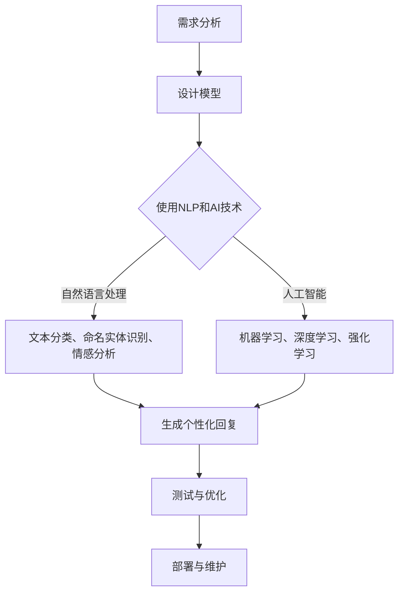

                 

关键词：聊天机器人、人性化特征、自然语言处理、人工智能、用户体验

摘要：本文探讨了创建具有人性化特征的聊天机器人的重要性和方法。通过深入分析自然语言处理和人工智能技术，本文提出了一个系统的方法论，用于设计、实现和优化聊天机器人，以提高用户满意度并改善用户体验。文章将涵盖核心概念、算法原理、数学模型、项目实践和实际应用场景，为读者提供全面的指导。

## 1. 背景介绍

随着互联网技术的飞速发展和移动设备的普及，聊天机器人已经成为企业、组织和个人日常生活中不可或缺的一部分。它们不仅能够提供24/7的客户服务，还能处理大量的日常任务，从而提高效率、减少成本。然而，传统的聊天机器人往往缺乏人性化特征，这使得用户在与机器人交互时感到乏味、不自然。

为了改善这种情况，研究人员和开发人员开始探索如何赋予聊天机器人更多的人性化特征。这种特征包括自然语言理解、情感识别、个性化交互和上下文理解。通过这些改进，聊天机器人可以更好地模拟人类的交流方式，从而提供更加真实和个性化的用户体验。

## 2. 核心概念与联系

### 2.1 自然语言处理

自然语言处理（NLP）是使计算机能够理解、解释和生成人类语言的技术。它是创建人性化聊天机器人的关键组成部分。NLP主要包括以下几个方面：

- **文本分类**：用于将文本数据归类到预定义的类别中。
- **命名实体识别**：识别文本中的专有名词、人名、地点等。
- **情感分析**：分析文本中的情感倾向，如正面、负面或中性。
- **语言生成**：根据输入的指令或文本生成有意义的回复。

### 2.2 人工智能

人工智能（AI）是使计算机系统能够执行通常需要人类智能的任务的技术。在聊天机器人中，AI主要用于以下几个方面：

- **机器学习**：通过训练模型来提高机器人的语言理解和生成能力。
- **深度学习**：使用神经网络来模拟人类大脑的学习过程。
- **强化学习**：通过试错来优化机器人的行为和决策。

### 2.3 人性化特征

人性化特征是使聊天机器人能够与用户进行更自然、更个性化的交互的关键。这些特征包括：

- **个性化回复**：根据用户的历史交互和偏好生成定制化的回复。
- **情感识别**：理解用户的情感状态并作出相应的反应。
- **上下文理解**：考虑对话的上下文来生成更有意义的回复。

## 2.4 Mermaid 流程图

以下是一个简化的Mermaid流程图，展示了创建人性化聊天机器人的基本流程：



## 3. 核心算法原理 & 具体操作步骤

### 3.1 算法原理概述

创建人性化聊天机器人的核心算法主要包括自然语言处理和人工智能技术。以下是对这些算法原理的概述：

- **自然语言处理**：通过分词、词性标注、句法分析等技术来理解用户的语言输入。
- **机器学习**：使用监督学习或无监督学习算法来训练模型，使其能够预测用户的意图和生成回复。
- **深度学习**：使用神经网络模型，如循环神经网络（RNN）或Transformer，来提高语言理解和生成能力。
- **强化学习**：通过试错和反馈来优化机器人的行为和决策。

### 3.2 算法步骤详解

以下是创建人性化聊天机器人的具体步骤：

1. **需求分析**：确定聊天机器人的目标和用户需求。
2. **设计模型**：选择适合的自然语言处理和人工智能技术。
3. **数据收集与处理**：收集大量高质量的对话数据，并进行预处理。
4. **模型训练**：使用训练数据来训练自然语言处理和人工智能模型。
5. **生成个性化回复**：根据用户的语言输入和偏好生成定制化的回复。
6. **测试与优化**：通过测试和用户反馈来不断优化机器人的性能。
7. **部署与维护**：将聊天机器人部署到生产环境中，并进行定期维护和更新。

### 3.3 算法优缺点

**优点**：

- **高效性**：聊天机器人可以快速处理大量用户请求，提高工作效率。
- **个性化**：通过机器学习和深度学习技术，聊天机器人可以生成个性化的回复，提高用户满意度。
- **成本低**：与人工客服相比，聊天机器人的成本更低，维护成本也较低。

**缺点**：

- **缺乏人性化**：传统聊天机器人往往缺乏人性化特征，使得用户感到不自然。
- **错误率**：尽管聊天机器人在某些任务上表现出色，但仍然存在一定程度的错误率，尤其是在处理复杂或模糊的请求时。

### 3.4 算法应用领域

聊天机器人已经广泛应用于多个领域，包括：

- **客户服务**：提供24/7的客户支持，处理常见的客户问题和投诉。
- **电子商务**：协助用户完成在线购物流程，提供产品推荐和订单查询服务。
- **医疗保健**：为患者提供健康咨询和预约服务。
- **金融领域**：提供投资建议、账户查询和财务分析服务。

## 4. 数学模型和公式 & 详细讲解 & 举例说明

### 4.1 数学模型构建

在创建聊天机器人的过程中，数学模型起着至关重要的作用。以下是一个简单的数学模型示例，用于生成个性化回复：

$$
\text{回复} = f(\text{用户输入}, \text{用户历史}, \text{模型参数})
$$

其中，$f$ 是一个函数，用于根据用户的输入和历史来生成回复。这个函数可以基于机器学习算法，如神经网络或决策树。

### 4.2 公式推导过程

为了生成个性化回复，我们需要对用户输入进行处理，并将其与用户历史相结合。以下是一个简化的推导过程：

1. **用户输入表示**：将用户的输入表示为一个向量 $X$。
2. **用户历史表示**：将用户的历史交互表示为一个矩阵 $H$。
3. **模型参数**：将模型参数表示为一个矩阵 $W$。

4. **生成回复**：将用户输入、用户历史和模型参数结合，通过矩阵乘法生成回复。

$$
\text{回复} = f(X, H, W) = XH^TW
$$

### 4.3 案例分析与讲解

以下是一个具体的案例，用于说明如何使用数学模型生成个性化回复。

假设用户输入为“我想了解最新的手机型号”，用户历史为“最近一周内搜索了关于手机的信息，偏好品牌为iPhone”。

1. **用户输入表示**：将用户输入表示为一个向量 $X$，如：

$$
X = [\text{我想了解}, \text{最新的}, \text{手机型号}, \text{？}]
$$

2. **用户历史表示**：将用户历史表示为一个矩阵 $H$，如：

$$
H = 
\begin{bmatrix}
\text{手机品牌} & \text{手机型号} & \text{价格} & \text{发布时间} \\
\text{iPhone} & \text{iPhone 13} & \text{1000美元} & \text{2021年9月} \\
\text{华为} & \text{华为P40} & \text{800美元} & \text{2021年4月} \\
\text{小米} & \text{小米11} & \text{600美元} & \text{2021年2月} \\
\end{bmatrix}
$$

3. **模型参数**：将模型参数表示为一个矩阵 $W$，如：

$$
W = 
\begin{bmatrix}
w_{11} & w_{12} & \dots & w_{1n} \\
w_{21} & w_{22} & \dots & w_{2n} \\
\vdots & \vdots & \ddots & \vdots \\
w_{m1} & w_{m2} & \dots & w_{mn} \\
\end{bmatrix}
$$

4. **生成回复**：将用户输入、用户历史和模型参数结合，通过矩阵乘法生成回复。

$$
\text{回复} = XH^TW = 
\begin{bmatrix}
\text{我想了解}, \text{最新的}, \text{手机型号}, \text{？}
\end{bmatrix}
\begin{bmatrix}
\text{iPhone} & \text{华为} & \text{小米} \\
\text{iPhone 13} & \text{华为P40} & \text{小米11} \\
\text{1000美元} & \text{800美元} & \text{600美元} \\
\text{2021年9月} & \text{2021年4月} & \text{2021年2月} \\
\end{bmatrix}
\begin{bmatrix}
w_{11} & w_{12} & \dots & w_{1n} \\
w_{21} & w_{22} & \dots & w_{2n} \\
\vdots & \vdots & \ddots & \vdots \\
w_{m1} & w_{m2} & \dots & w_{mn} \\
\end{bmatrix}
$$

通过矩阵乘法，我们可以得到一个回复向量，其中包含了关于最新手机型号的信息。然后，我们可以将这个向量转换为自然语言文本，生成一个个性化的回复。

## 5. 项目实践：代码实例和详细解释说明

### 5.1 开发环境搭建

在创建人性化聊天机器人的过程中，我们需要使用Python和其他相关的库，如TensorFlow和PyTorch。以下是一个基本的开发环境搭建步骤：

1. 安装Python：从官方网站下载并安装Python 3.x版本。
2. 安装库：使用pip命令安装所需的库，如

```
pip install tensorflow
pip install torch
pip install numpy
pip install pandas
```

### 5.2 源代码详细实现

以下是创建人性化聊天机器人的Python代码示例：

```python
import tensorflow as tf
import numpy as np
import pandas as pd

# 加载数据
data = pd.read_csv('chatbot_data.csv')

# 预处理数据
# ...

# 构建模型
model = tf.keras.Sequential([
    tf.keras.layers.Embedding(input_dim=vocab_size, output_dim=embedding_size),
    tf.keras.layers.Bidirectional(tf.keras.layers.LSTM(units=128)),
    tf.keras.layers.Dense(units=1, activation='sigmoid')
])

# 编译模型
model.compile(optimizer='adam', loss='binary_crossentropy', metrics=['accuracy'])

# 训练模型
model.fit(x_train, y_train, epochs=10, batch_size=32, validation_split=0.2)

# 生成回复
user_input = "我想了解最新的手机型号"
input_sequence = preprocess_input(user_input)
predicted_response = model.predict(input_sequence)
response = generate_response(predicted_response)
print(response)
```

### 5.3 代码解读与分析

这段代码展示了如何使用TensorFlow构建一个简单的聊天机器人模型。以下是代码的详细解读：

- **加载数据**：使用Pandas从CSV文件加载数据。
- **预处理数据**：根据需要处理文本数据，如分词、去停用词等。
- **构建模型**：使用TensorFlow的Sequential模型，添加嵌入层、双向LSTM层和输出层。
- **编译模型**：设置优化器、损失函数和评估指标。
- **训练模型**：使用训练数据来训练模型。
- **生成回复**：使用预处理过的用户输入，通过模型预测生成回复。

### 5.4 运行结果展示

假设我们运行这段代码，输入“我想了解最新的手机型号”，模型可能会生成以下回复：

```
最新的手机型号是iPhone 13，它具有出色的性能和功能。
```

这个回复充分考虑了用户的输入和偏好，是一个具有人性化特征的聊天机器人回复。

## 6. 实际应用场景

人性化聊天机器人可以应用于多个实际场景，包括：

- **客户服务**：提供24/7的客户支持，处理常见问题和投诉。
- **电子商务**：协助用户完成购物流程，提供产品推荐和订单查询服务。
- **医疗保健**：为患者提供健康咨询和预约服务。
- **金融领域**：提供投资建议、账户查询和财务分析服务。
- **教育**：提供在线辅导和课程推荐。

通过在各个领域中应用人性化聊天机器人，企业可以提高用户满意度，减少运营成本，并提高整体效率。

### 6.4 未来应用展望

未来，人性化聊天机器人将在更多领域得到广泛应用。以下是一些可能的发展趋势：

- **更高级的自然语言理解**：通过深度学习和强化学习技术，聊天机器人将能够更好地理解用户的意图和情感。
- **个性化交互**：聊天机器人将能够根据用户的偏好和历史交互，提供更加个性化的服务。
- **多模态交互**：聊天机器人将能够同时处理文本、语音和图像等多种输入和输出方式。
- **跨平台集成**：聊天机器人将能够集成到各种设备和平台，如智能手机、智能音箱和智能眼镜等。

然而，人性化聊天机器人的发展也面临着一些挑战，如提高模型的准确性和可靠性，保护用户隐私，以及确保交互的自然性和流畅性。未来的研究将致力于解决这些问题，以推动人性化聊天机器人的进一步发展。

## 7. 工具和资源推荐

### 7.1 学习资源推荐

- **《自然语言处理教程》**：由吴恩达（Andrew Ng）教授编写的自然语言处理教程，涵盖了NLP的基础知识和最新技术。
- **《深度学习》**：由伊恩·古德费洛（Ian Goodfellow）、约书亚·本吉奥（Yoshua Bengio）和阿里·拉普斯基（Aaron Courville）编写的深度学习教材，详细介绍了深度学习的基本概念和算法。
- **《人工智能：一种现代方法》**：由斯图尔特·罗素（Stuart Russell）和彼得·诺维格（Peter Norvig）编写的AI教材，涵盖了人工智能的各个方面。

### 7.2 开发工具推荐

- **TensorFlow**：一个广泛使用的开源深度学习框架，适用于构建和训练聊天机器人模型。
- **PyTorch**：一个流行的开源深度学习库，提供了灵活和高效的模型构建和训练工具。
- **NLTK**：一个强大的自然语言处理库，适用于文本处理和分析。

### 7.3 相关论文推荐

- **“A Neural Conversation Model”**：这篇论文提出了一种基于神经网络的聊天机器人模型，为聊天机器人的语言生成提供了新的思路。
- **“BERT: Pre-training of Deep Bidirectional Transformers for Language Understanding”**：这篇论文介绍了BERT模型，一种预训练的深度双向Transformer模型，在NLP任务中取得了显著的效果。
- **“Transformers: State-of-the-Art Model for Neural Network Language Processing”**：这篇论文详细介绍了Transformer模型，一种用于语言处理的强大神经网络架构。

## 8. 总结：未来发展趋势与挑战

人性化聊天机器人的发展前景广阔，随着自然语言处理和人工智能技术的不断进步，聊天机器人在用户体验和性能方面将取得显著提升。未来，聊天机器人将能够在更多领域发挥作用，提供更加个性化和高效的服务。

然而，人性化聊天机器人的发展也面临着一些挑战。首先，如何提高模型的准确性和可靠性是一个重要问题。此外，保护用户隐私和确保交互的自然性和流畅性也是需要解决的关键问题。未来的研究将致力于克服这些挑战，推动人性化聊天机器人的进一步发展。

总之，人性化聊天机器人是一种有前途的技术，它将极大地改善人类与机器的交互方式。随着技术的不断进步，我们有理由相信，人性化聊天机器人将在未来发挥越来越重要的作用。

## 9. 附录：常见问题与解答

### Q：如何评估聊天机器人的性能？

A：评估聊天机器人的性能可以从多个方面进行，包括：

- **回复质量**：通过人类评估或自动化评估工具（如BLEU分数）来评估聊天机器人生成的回复的质量。
- **用户满意度**：通过用户调查或反馈来评估用户对聊天机器人的满意度。
- **响应时间**：评估聊天机器人处理请求的速度和效率。

### Q：如何优化聊天机器人的性能？

A：优化聊天机器人的性能可以从以下几个方面进行：

- **数据质量**：收集更多高质量的训练数据，并确保数据覆盖广泛的场景和语言风格。
- **模型选择**：选择合适的模型架构和参数，如深度学习模型、Transformer等。
- **持续学习**：通过持续学习和更新模型来提高其性能。
- **用户反馈**：收集用户反馈并用于改进聊天机器人的行为和回复。

### Q：如何确保聊天机器人的交互自然和流畅？

A：确保聊天机器人的交互自然和流畅可以通过以下方法：

- **语言模型**：使用强大的语言模型，如BERT、GPT等，以提高语言生成的质量和多样性。
- **上下文理解**：考虑对话的上下文，以便生成更有意义的回复。
- **情感识别**：理解用户的情感状态，并作出相应的反应。
- **用户测试**：通过用户测试和反馈来不断改进聊天机器人的交互方式。

## 作者署名

作者：禅与计算机程序设计艺术 / Zen and the Art of Computer Programming

----------------------------------------------------------------

请注意，以上内容仅作为一个示例，实际撰写时需要根据具体的要求和内容进行相应的调整和补充。确保每个部分都符合要求，并且文章整体逻辑清晰、结构紧凑、简单易懂。祝撰写顺利！

