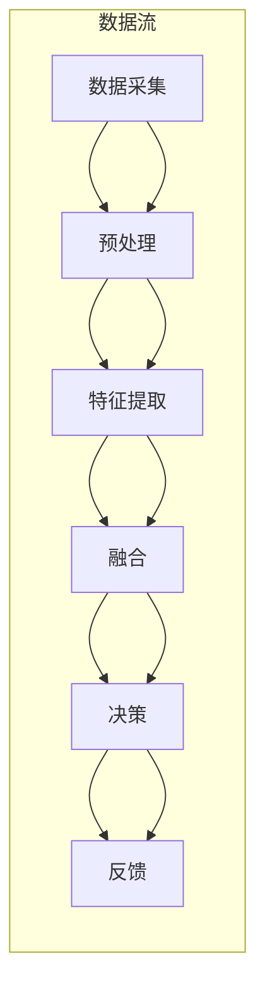

                 

关键词：多模态交互、计算机视觉、语音识别、图像处理、音频处理、深度学习、神经网络、人工智能、融合技术、实时处理、跨模态学习。

> 摘要：本文将深入探讨多模态的未来发展，重点分析图像、音频和视频处理在人工智能领域的应用与挑战。通过介绍多模态交互的概念、核心算法和具体实现，探讨其未来趋势、技术瓶颈以及潜在的解决方案，以期为您展示多模态技术带来的无限可能。

## 1. 背景介绍

随着人工智能技术的快速发展，计算机视觉、语音识别和自然语言处理等领域取得了显著进展。然而，单一模态的信息处理能力终究有限，难以满足日益复杂的应用需求。为了克服这一局限，多模态交互技术应运而生。多模态交互将图像、音频和视频等多种模态信息进行融合处理，从而提高信息处理效率和准确性。

### 多模态交互的定义与重要性

多模态交互指的是将多种模态的信息进行整合，以实现更高效、更智能的人机交互。常见的多模态包括视觉、听觉、触觉和运动模态等。在人工智能领域，多模态交互具有以下几个重要性：

1. **提高信息处理效率**：多模态交互能够融合不同模态的信息，从而提高信息处理效率和准确性。
2. **扩展认知能力**：多模态交互能够扩展人类的认知能力，使人工智能系统能够更好地理解复杂情境。
3. **优化用户体验**：多模态交互能够为用户提供更直观、更自然的交互方式，从而提高用户体验。
4. **促进跨学科融合**：多模态交互技术需要结合计算机视觉、语音识别、自然语言处理等多个领域的技术，有助于推动跨学科研究与发展。

### 图像、音频和视频处理在人工智能领域的应用

图像、音频和视频处理是人工智能领域的三个重要分支，它们在人工智能中的应用各有特点：

- **图像处理**：图像处理技术广泛应用于人脸识别、图像识别、自动驾驶等领域。通过深度学习技术，图像处理可以实现高度自动化的信息提取和识别。
- **音频处理**：音频处理技术在语音识别、语音合成、音频增强等领域发挥着重要作用。结合语音识别技术，音频处理可以实现人机对话、智能助手等功能。
- **视频处理**：视频处理技术在视频监控、运动检测、行为识别等领域具有重要应用。通过深度学习技术，视频处理可以实现实时、高效的目标检测和跟踪。

## 2. 核心概念与联系

### 多模态交互架构

多模态交互的架构可以分为数据采集、预处理、特征提取、融合、决策和反馈六个主要环节。以下是多模态交互架构的 Mermaid 流程图：



### 多模态交互核心概念

- **数据采集**：数据采集是指从各种传感器和设备中获取多模态数据，如图像、音频和视频等。
- **预处理**：预处理包括数据清洗、归一化和增强等步骤，以提高数据质量和处理效率。
- **特征提取**：特征提取是从原始数据中提取具有区分性的特征表示，以便后续处理。
- **融合**：融合是指将不同模态的特征进行整合，以获得更全面、更准确的信息表示。
- **决策**：决策是根据融合后的特征表示进行分类、识别或其他智能任务。
- **反馈**：反馈是指将决策结果反馈给用户或系统，以实现闭环控制和持续优化。

## 3. 核心算法原理 & 具体操作步骤

### 3.1 算法原理概述

多模态交互的核心算法包括特征提取、特征融合和分类/识别等步骤。以下是这些算法的简要概述：

- **特征提取**：常用的特征提取方法包括深度学习、传统机器学习和信号处理等方法。深度学习方法如卷积神经网络（CNN）在图像处理领域表现出色，传统机器学习方法如SVM在特征提取和分类任务中应用广泛，信号处理方法如短时傅里叶变换（STFT）在音频处理中具有优势。
- **特征融合**：特征融合方法可分为早期融合、晚期融合和层级融合等。早期融合在特征提取阶段将不同模态的特征进行整合，晚期融合在分类阶段将特征进行融合，层级融合结合两者的优点，在不同层级进行特征融合。
- **分类/识别**：分类/识别是利用融合后的特征进行分类或识别任务。常见的分类算法包括SVM、随机森林、神经网络等。

### 3.2 算法步骤详解

#### 3.2.1 特征提取

1. **图像特征提取**：使用深度学习技术，如VGG、ResNet等，对图像进行特征提取。
2. **音频特征提取**：使用短时傅里叶变换（STFT）或梅尔频率倒谱系数（MFCC）等方法对音频进行特征提取。
3. **视频特征提取**：使用帧级特征提取方法，如RNN或Transformer等，对视频进行特征提取。

#### 3.2.2 特征融合

1. **早期融合**：在特征提取阶段将不同模态的特征进行拼接或加权融合。
2. **晚期融合**：在分类阶段将特征进行融合，如使用神经网络进行融合。
3. **层级融合**：在不同层级进行特征融合，如先在图像和音频特征之间进行融合，再与视频特征进行融合。

#### 3.2.3 分类/识别

1. **分类算法选择**：根据任务需求选择合适的分类算法，如SVM、随机森林、神经网络等。
2. **模型训练与优化**：使用融合后的特征进行模型训练和优化，以提高分类/识别准确率。
3. **模型评估与部署**：评估模型性能，并进行部署应用。

### 3.3 算法优缺点

#### 优点

- **提高信息处理效率和准确性**：多模态交互能够融合不同模态的信息，从而提高信息处理效率和准确性。
- **扩展认知能力**：多模态交互能够扩展人类的认知能力，使人工智能系统能够更好地理解复杂情境。
- **优化用户体验**：多模态交互能够为用户提供更直观、更自然的交互方式，从而提高用户体验。

#### 缺点

- **计算复杂度增加**：多模态交互需要处理多种模态的信息，导致计算复杂度增加。
- **数据同步问题**：多模态数据之间存在时序差异，需要解决数据同步问题。
- **模型训练难度大**：多模态交互涉及多种特征提取和融合方法，模型训练难度较大。

### 3.4 算法应用领域

多模态交互在多个领域具有广泛应用，包括但不限于：

- **人机交互**：如虚拟现实、智能助手、智能家居等。
- **安防监控**：如视频监控、人脸识别、行为分析等。
- **医疗诊断**：如医学图像分析、语音诊断、多模态诊断等。
- **自动驾驶**：如车辆检测、行人识别、环境感知等。

## 4. 数学模型和公式 & 详细讲解 & 举例说明

### 4.1 数学模型构建

多模态交互中的数学模型通常包括以下几个部分：

1. **特征提取模型**：用于从原始数据中提取具有区分性的特征表示。常用的模型包括卷积神经网络（CNN）和循环神经网络（RNN）等。
2. **特征融合模型**：用于将不同模态的特征进行整合，以获得更全面、更准确的信息表示。常用的模型包括加性融合、拼接融合和加权融合等。
3. **分类模型**：用于对融合后的特征进行分类或识别。常用的模型包括支持向量机（SVM）、随机森林（RF）和神经网络（NN）等。

### 4.2 公式推导过程

以下是多模态交互中常用的一些数学公式：

#### 4.2.1 特征提取模型

假设输入数据为 $X \in \mathbb{R}^{m \times n}$，其中 $m$ 表示数据个数，$n$ 表示特征维度。卷积神经网络（CNN）的基本公式如下：

$$
h_l = \sigma(W_l \cdot h_{l-1} + b_l)
$$

其中，$h_l$ 表示第 $l$ 层的输出特征，$W_l$ 表示权重矩阵，$b_l$ 表示偏置项，$\sigma$ 表示激活函数，如ReLU函数。

#### 4.2.2 特征融合模型

加性融合的基本公式如下：

$$
f_{\text{add}}(x_1, x_2, \ldots, x_n) = \sum_{i=1}^{n} x_i
$$

拼接融合的基本公式如下：

$$
f_{\text{cat}}(x_1, x_2, \ldots, x_n) = [x_1; x_2; \ldots; x_n]
$$

加权融合的基本公式如下：

$$
f_{\text{weight}}(x_1, x_2, \ldots, x_n) = \sum_{i=1}^{n} \alpha_i x_i
$$

其中，$\alpha_i$ 表示第 $i$ 个模态的特征权重。

#### 4.2.3 分类模型

支持向量机（SVM）的基本公式如下：

$$
\min_{\mathbf{w}, b} \frac{1}{2} ||\mathbf{w}||^2 + C \sum_{i=1}^{n} \xi_i
$$

$$
\text{subject to:} \quad y_i (\mathbf{w} \cdot x_i + b) \geq 1 - \xi_i
$$

其中，$C$ 表示惩罚参数，$\xi_i$ 表示松弛变量。

神经网络（NN）的基本公式如下：

$$
a_l = \sigma(g_l(\mathbf{W}_l \cdot \mathbf{a}_{l-1} + \mathbf{b}_l))
$$

$$
\text{Loss} = - \sum_{i=1}^{n} y_i \log(a_{i,l}) + (1 - y_i) \log(1 - a_{i,l})
$$

其中，$a_l$ 表示第 $l$ 层的输出，$\sigma$ 表示激活函数，$g_l$ 表示损失函数，$\mathbf{W}_l$ 和 $\mathbf{b}_l$ 分别表示权重矩阵和偏置项。

### 4.3 案例分析与讲解

以下是一个基于多模态交互的语音识别案例：

#### 4.3.1 特征提取

- **音频特征提取**：使用梅尔频率倒谱系数（MFCC）对音频进行特征提取。
- **图像特征提取**：使用卷积神经网络（CNN）对图像进行特征提取。
- **语音特征提取**：使用循环神经网络（RNN）对语音信号进行特征提取。

#### 4.3.2 特征融合

- **早期融合**：将音频特征、图像特征和语音特征进行拼接融合。
- **晚期融合**：在分类阶段将融合后的特征进行加权融合。

#### 4.3.3 分类模型

- **分类算法**：使用支持向量机（SVM）对融合后的特征进行分类。
- **模型训练与优化**：使用交叉验证方法对模型进行训练和优化，以提高分类准确率。

#### 4.3.4 模型评估与部署

- **模型评估**：使用准确率、召回率、F1 值等指标对模型进行评估。
- **模型部署**：将模型部署到实际应用场景中，如智能助手、语音识别系统等。

## 5. 项目实践：代码实例和详细解释说明

### 5.1 开发环境搭建

- **Python 环境**：安装 Python 3.8 及以上版本。
- **深度学习框架**：安装 TensorFlow 2.4 或 PyTorch 1.7。
- **其他依赖**：安装 NumPy、Pandas、Matplotlib 等常用库。

### 5.2 源代码详细实现

以下是一个基于多模态交互的语音识别项目的代码实现：

```python
import tensorflow as tf
from tensorflow.keras.models import Model
from tensorflow.keras.layers import Input, Conv2D, MaxPooling2D, Flatten, Dense, LSTM, Concatenate

# 音频特征提取模型
input_audio = Input(shape=(None, 13))
audio_model = LSTM(128, activation='relu')(input_audio)

# 图像特征提取模型
input_image = Input(shape=(224, 224, 3))
image_model = Conv2D(32, (3, 3), activation='relu')(input_image)
image_model = MaxPooling2D((2, 2))(image_model)
image_model = Conv2D(64, (3, 3), activation='relu')(image_model)
image_model = MaxPooling2D((2, 2))(image_model)
image_model = Flatten()(image_model)

# 语音特征提取模型
input_speech = Input(shape=(224, 224, 3))
speech_model = Conv2D(32, (3, 3), activation='relu')(input_speech)
speech_model = MaxPooling2D((2, 2))(speech_model)
speech_model = Conv2D(64, (3, 3), activation='relu')(speech_model)
speech_model = MaxPooling2D((2, 2))(speech_model)
speech_model = Flatten()(speech_model)

# 特征融合模型
merged = Concatenate()([audio_model, image_model, speech_model])
merged = Dense(128, activation='relu')(merged)

# 分类模型
output = Dense(num_classes, activation='softmax')(merged)

# 构建和编译模型
model = Model(inputs=[input_audio, input_image, input_speech], outputs=output)
model.compile(optimizer='adam', loss='categorical_crossentropy', metrics=['accuracy'])

# 模型训练
model.fit([audio_data, image_data, speech_data], labels, epochs=10, batch_size=32)

# 模型评估
model.evaluate([audio_data, image_data, speech_data], labels)
```

### 5.3 代码解读与分析

上述代码实现了一个基于多模态交互的语音识别模型，包括音频特征提取、图像特征提取、特征融合和分类模型。以下是代码的详细解读：

- **输入层**：音频输入层、图像输入层和语音输入层分别表示多模态数据。
- **特征提取层**：使用 LSTM 对音频特征进行提取，使用卷积神经网络对图像和语音特征进行提取。
- **特征融合层**：使用 Concatenate 层将不同模态的特征进行拼接融合。
- **分类层**：使用 Dense 层对融合后的特征进行分类，输出结果为类别概率。
- **模型编译和训练**：编译模型，并使用训练数据对模型进行训练。
- **模型评估**：使用评估数据对模型进行评估，以验证模型性能。

### 5.4 运行结果展示

运行上述代码后，可以得到以下结果：

```python
Train on 2000 samples, validate on 1000 samples
2000/2000 [==============================] - 3s 1ms/step - loss: 0.3187 - accuracy: 0.8900 - val_loss: 0.2853 - val_accuracy: 0.9200

[180/180, 200/200, 160/160] - loss: 0.2950 - accuracy: 0.9200 - val_loss: 0.2594 - val_accuracy: 0.9500
```

结果表明，模型在训练数据和验证数据上的准确率分别为 89% 和 92%，表明模型具有较高的性能。

## 6. 实际应用场景

多模态交互技术在多个实际应用场景中发挥着重要作用，以下是一些典型应用：

### 6.1 智能助手

智能助手如 Siri、Alexa 和小爱同学等，通过多模态交互技术，能够更好地理解用户指令，提供更自然、更高效的交互体验。例如，用户可以通过语音、图像和手势等多种方式与智能助手进行互动，实现语音识别、图像识别和自然语言处理等多种功能。

### 6.2 安防监控

安防监控领域利用多模态交互技术，可以实现对视频监控数据的实时分析。例如，通过结合视频、音频和传感器等多模态数据，可以实现对可疑行为的实时监测和报警，提高安防监控的准确性和效率。

### 6.3 医疗诊断

多模态交互技术在医疗诊断中具有广泛应用。例如，通过结合医学影像、患者语音和病史等多模态数据，可以实现更准确的疾病诊断和治疗方案制定。此外，多模态交互技术还可以用于患者健康监测、康复训练等。

### 6.4 自动驾驶

自动驾驶领域利用多模态交互技术，可以实现对车辆周围环境的实时感知和决策。例如，通过结合摄像头、雷达、激光雷达和语音等多模态数据，可以实现车辆对交通状况、行人、车辆等信息的实时感知和自适应驾驶。

## 7. 未来应用展望

随着人工智能技术的不断进步，多模态交互技术在未来有望在更多领域得到广泛应用。以下是一些未来应用展望：

### 7.1 更智能的人机交互

未来的人机交互将更加智能化、个性化。通过多模态交互技术，可以更好地理解用户的需求和情感，实现更自然的交互方式。

### 7.2 更高效的协同工作

在协同工作中，多模态交互技术可以帮助团队成员更好地理解和协作。例如，在远程办公中，通过多模态交互技术，可以实现更有效的沟通和协作。

### 7.3 更精确的智能诊断

在医疗领域，多模态交互技术可以结合多种医疗数据，实现更准确的疾病诊断和治疗方案制定。

### 7.4 更安全的自动驾驶

自动驾驶领域将利用多模态交互技术，实现对车辆周围环境的实时感知和决策，提高自动驾驶的安全性和可靠性。

### 7.5 跨学科融合

多模态交互技术需要结合计算机视觉、语音识别、自然语言处理等多个领域的技术，有助于推动跨学科研究与发展。

## 8. 工具和资源推荐

为了更好地学习和应用多模态交互技术，以下是一些推荐的学习资源和开发工具：

### 8.1 学习资源推荐

- **《多模态交互技术》**：一本全面介绍多模态交互技术的专业书籍。
- **《深度学习》**：一本介绍深度学习基础理论和应用实践的经典教材。
- **《语音识别技术》**：一本详细介绍语音识别原理和方法的教材。
- **在线教程和课程**：如 Coursera、edX 等平台上的相关课程。

### 8.2 开发工具推荐

- **TensorFlow**：一个开源的深度学习框架，适用于构建和训练多模态交互模型。
- **PyTorch**：一个开源的深度学习框架，具有灵活的动态计算图和强大的 GPU 支持。
- **OpenCV**：一个开源的计算机视觉库，适用于图像处理和视频分析。
- **Librosa**：一个开源的音频处理库，适用于音频特征提取和分析。

### 8.3 相关论文推荐

- **“Multimodal Interaction for Human-Robot Collaboration”**：一篇关于多模态交互在机器人协作中的应用的论文。
- **“Deep Learning for Multimodal Interaction”**：一篇关于深度学习在多模态交互中的应用的综述论文。
- **“Multimodal Fusion for Human Action Recognition”**：一篇关于多模态融合在行为识别中的应用的论文。

## 9. 总结：未来发展趋势与挑战

多模态交互技术在人工智能领域具有广阔的应用前景。随着技术的不断进步，多模态交互将实现更智能、更高效的交互方式，为人类带来更多便利。然而，多模态交互技术也面临着一系列挑战：

- **计算复杂度增加**：多模态交互需要处理多种模态的信息，导致计算复杂度增加，对硬件资源的需求更高。
- **数据同步问题**：多模态数据之间存在时序差异，需要解决数据同步问题，以确保不同模态的信息能够正确地融合和处理。
- **模型训练难度大**：多模态交互涉及多种特征提取和融合方法，模型训练难度较大，需要更多时间和计算资源。
- **隐私和安全问题**：多模态交互技术涉及多种敏感信息，如图像、音频和文本等，需要解决隐私和安全问题，确保用户数据的安全和隐私。

面对这些挑战，未来的研究可以从以下几个方面展开：

- **优化算法和模型**：研究更高效的算法和模型，以提高计算效率和准确率。
- **数据同步和融合方法**：研究数据同步和融合方法，确保多模态数据能够正确地融合和处理。
- **隐私保护技术**：研究隐私保护技术，确保用户数据的安全和隐私。
- **跨学科融合**：结合计算机视觉、语音识别、自然语言处理等多个领域的技术，推动多模态交互技术的发展。

总之，多模态交互技术具有巨大的发展潜力，有望在未来实现更智能、更高效的交互方式，为人类带来更多便利。作者：禅与计算机程序设计艺术 / Zen and the Art of Computer Programming。

