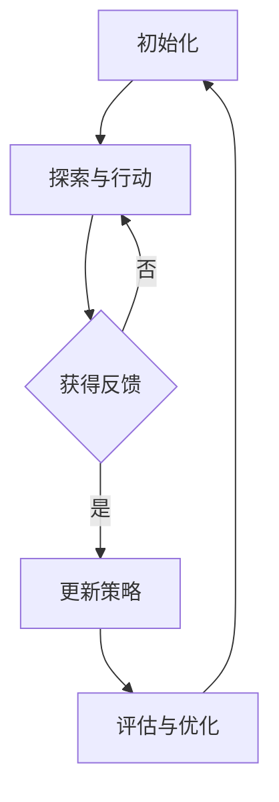

                 

### 文章关键词

- 强化学习
- 机器学习
- 人工智能
- RLHF
- 算法原理
- 应用领域
- 数学模型
- 实践案例
- 未来展望

### 文章摘要

本文将深入探讨强化学习（Reinforcement Learning, RL）以及其与人类反馈的融合（Human Feedback, HF）即RLHF的力量。首先，我们将回顾强化学习的核心概念和历史背景。随后，文章将详细介绍RLHF的原理和架构，并通过Mermaid流程图展示其关键节点和流程。接下来，我们将详细解释强化学习算法的基本原理和具体操作步骤，包括其优缺点和应用领域。文章还将通过数学模型和公式的推导，结合实际案例进行分析，以便更好地理解RLHF的工作机制。此外，本文还将展示代码实例，详细解读其实现过程，并提供运行结果。最后，文章将探讨强化学习在实际应用场景中的广泛使用，并对其未来发展进行展望。

### 1. 背景介绍

强化学习（Reinforcement Learning, RL）是一种机器学习范式，它通过奖励机制来训练智能体（agent）在动态环境中做出最优决策。与其他机器学习方法（如监督学习和无监督学习）不同，强化学习侧重于智能体与环境的交互过程，通过不断的试错来优化其策略，从而实现长期目标。

强化学习的概念最早由Richard Sutton和Andrew Barto在1988年的经典教材《 Reinforcement Learning: An Introduction》中提出。自此以后，强化学习得到了广泛关注和研究，并在多个领域取得了显著成果。例如，在游戏AI、自动驾驶、机器人控制以及推荐系统中，强化学习都展现出了强大的应用潜力。

强化学习的基本原理可以概括为“试错学习”（trial-and-error learning）。在强化学习中，智能体根据当前状态（State）选择一个动作（Action），然后根据动作的结果获得奖励（Reward）。智能体的目标是最大化总奖励，以实现长期目标。这个过程可以抽象为一个马尔可夫决策过程（Markov Decision Process, MDP），其中智能体需要通过策略（Policy）来选择最优动作。

随着人工智能技术的不断发展，强化学习逐渐与其他技术融合，形成了各种新型的学习方法。其中，RLHF（Reinforcement Learning from Human Feedback）是一种结合了强化学习和人类反馈的先进方法。它利用人类提供的目标和反馈，帮助智能体更快地学习和优化其策略。

RLHF的提出，标志着强化学习进入了一个新的发展阶段。通过结合人类的智慧和机器的效率，RLHF在解决复杂任务和提高智能体决策质量方面展现了巨大潜力。本文将深入探讨RLHF的原理、架构和应用，以期为读者提供全面的技术见解。

### 2. 核心概念与联系

在深入了解RLHF之前，我们需要明确几个核心概念，并理解它们之间的联系。以下是强化学习、RLHF以及相关概念的基本定义和联系：

#### 2.1 强化学习（Reinforcement Learning, RL）

强化学习是一种机器学习范式，其核心思想是通过奖励机制来训练智能体（agent）在动态环境中做出最优决策。强化学习的基本原理可以概括为“试错学习”（trial-and-error learning）。在强化学习中，智能体根据当前状态（State）选择一个动作（Action），然后根据动作的结果获得奖励（Reward）。智能体的目标是最大化总奖励，以实现长期目标。这个过程可以抽象为一个马尔可夫决策过程（Markov Decision Process, MDP），其中智能体需要通过策略（Policy）来选择最优动作。

强化学习的流程可以概括为：

1. **初始化**：智能体开始在一个特定的环境中。
2. **探索与行动**：智能体根据当前的策略选择一个动作，并在环境中执行这个动作。
3. **反馈**：环境根据智能体的动作给予一个奖励。
4. **策略更新**：智能体根据累积奖励和历史数据更新其策略。

#### 2.2 人类反馈（Human Feedback, HF）

人类反馈是指通过人类专家的判断和评估来指导智能体的学习过程。在传统的强化学习中，奖励通常是由环境自动生成的。然而，对于一些复杂和高度抽象的任务，环境的奖励可能不足以指导智能体做出最优决策。此时，引入人类反馈可以显著提高智能体的学习效率和决策质量。

人类反馈的引入方式有多种，包括：

1. **直接奖励**：人类直接为智能体的动作提供奖励。
2. **目标指导**：人类为智能体设定长期目标，智能体需要通过策略优化来实现这些目标。
3. **监督学习**：人类对智能体的行为进行监督，并在智能体出现错误时提供纠正。

#### 2.3 RLHF（Reinforcement Learning from Human Feedback）

RLHF是一种结合了强化学习和人类反馈的新型学习方法。它利用人类提供的目标和反馈，帮助智能体更快地学习和优化其策略。RLHF的核心理念是通过人类反馈来指导强化学习的过程，从而实现更高效的智能体训练。

RLHF的主要流程包括：

1. **初始化**：设定智能体的初始状态和目标。
2. **探索与行动**：智能体在环境中根据策略进行探索和行动。
3. **人类反馈**：人类专家对智能体的行为进行评估，并提供反馈。
4. **策略更新**：智能体根据人类反馈和累积奖励更新其策略。

#### 2.4 强化学习与RLHF的关系

强化学习和RLHF之间的关系可以理解为前者是后者的基础。强化学习提供了智能体在动态环境中学习和决策的基本框架，而RLHF则通过引入人类反馈来优化这个框架，使其在复杂任务中表现出更高的效率和准确性。

具体来说，RLHF在强化学习的基础上增加了以下关键步骤：

1. **人类反馈**：通过人类专家的评估和反馈，提供更具体的指导。
2. **目标设定**：人类设定长期目标，帮助智能体更好地理解任务要求。
3. **策略优化**：结合人类反馈和累积奖励，智能体能够更快速地收敛到最优策略。

#### 2.5 Mermaid流程图

为了更好地理解RLHF的工作机制，我们可以使用Mermaid流程图来展示其关键节点和流程。以下是RLHF的基本流程图：



在上图中，A表示初始化阶段，B表示智能体在环境中进行探索和行动，C表示获得人类反馈，D表示根据反馈更新策略，E表示评估和优化策略，然后返回A继续迭代。

通过这个流程图，我们可以清晰地看到RLHF的工作机制。智能体通过不断的试错和人类反馈，逐步优化其策略，实现长期目标的最大化。

### 3. 核心算法原理 & 具体操作步骤

#### 3.1 算法原理概述

强化学习（Reinforcement Learning, RL）的核心原理是“试错学习”，即通过不断尝试和反馈来优化智能体的策略。在强化学习中，智能体在一个动态环境中通过选择动作（Action）来获取奖励（Reward），并逐步优化其策略（Policy）以实现长期目标。

RL算法的基本流程可以概括为以下几个步骤：

1. **初始化**：设定智能体的初始状态（State）、策略（Policy）和奖励函数（Reward Function）。
2. **探索与行动**：智能体在环境中根据当前策略选择一个动作，并在环境中执行这个动作。
3. **反馈**：环境根据智能体的动作给予一个奖励，并返回新的状态。
4. **策略更新**：智能体根据累积奖励和历史数据更新其策略，以最大化长期奖励。

强化学习算法可以分为以下几类：

1. **值函数方法**：通过估计状态-动作值函数（State-Action Value Function）来指导智能体的行动。代表性的算法有Q学习（Q-Learning）和深度Q网络（Deep Q-Network, DQN）。
2. **策略搜索方法**：直接优化智能体的策略，以最大化累积奖励。代表性的算法有策略梯度方法（Policy Gradient Methods）和深度确定性策略梯度（Deep Deterministic Policy Gradient, DDPG）。
3. **模型基方法**：通过建立环境模型来预测未来奖励，从而优化智能体的策略。代表性的算法有模型预测控制（Model Predictive Control, MPC）和深度强化学习（Deep Reinforcement Learning, DRL）。

RLHF（Reinforcement Learning from Human Feedback）在强化学习的基础上引入了人类反馈，通过人类提供的反馈来指导智能体的学习和策略优化。RLHF的主要步骤如下：

1. **初始化**：设定智能体的初始状态、策略和奖励函数，并引入人类反馈机制。
2. **探索与行动**：智能体在环境中根据当前策略进行探索和行动。
3. **人类反馈**：人类专家对智能体的行为进行评估，并提供反馈。
4. **策略更新**：智能体根据人类反馈和累积奖励更新其策略，以最大化长期奖励。
5. **评估与优化**：评估智能体的策略性能，并进行进一步优化。

#### 3.2 算法步骤详解

以下我们将详细解释RLHF算法的每个步骤，并说明其具体操作方法。

##### 3.2.1 初始化

初始化是RLHF算法的第一步，主要包括设定智能体的初始状态（State）、策略（Policy）和奖励函数（Reward Function）。

1. **智能体状态（State）**：状态是智能体在环境中的当前情况，通常由一组特征向量表示。状态的选择取决于具体的应用场景和任务需求。
2. **智能体策略（Policy）**：策略是智能体在给定状态下选择动作的规则。在RLHF中，策略通常由神经网络或其他复杂模型表示，以便进行学习和优化。
3. **奖励函数（Reward Function）**：奖励函数定义了智能体在执行动作后获得的奖励。奖励函数的选择对智能体的学习和策略优化至关重要。

初始化的具体操作步骤如下：

1. **定义状态空间**：根据应用场景确定状态的特征和维度。
2. **定义动作空间**：根据任务需求确定动作的种类和维度。
3. **初始化策略模型**：选择合适的神经网络架构，并初始化模型参数。
4. **定义奖励函数**：根据任务目标和性能要求设计奖励函数。

##### 3.2.2 探索与行动

在初始化完成后，智能体开始在环境中进行探索和行动。这一步骤的主要目标是让智能体通过不断尝试来学习环境的行为模式和奖励分布。

1. **选择动作**：智能体根据当前策略选择一个动作。在RLHF中，策略通常是一个神经网络模型，其输出概率分布表示选择动作的概率。
2. **执行动作**：智能体在环境中执行选定的动作，并观察环境的响应。

具体操作步骤如下：

1. **输入当前状态**：将智能体的当前状态输入到策略模型中。
2. **输出动作概率**：策略模型输出动作的概率分布。
3. **采样动作**：根据动作概率分布采样一个动作。
4. **执行动作**：在环境中执行采样得到的动作。

##### 3.2.3 人类反馈

在智能体执行动作后，人类专家会对智能体的行为进行评估，并提供反馈。这一步骤是RLHF算法的核心，通过人类反馈来指导智能体的学习和策略优化。

1. **反馈评估**：人类专家根据任务目标和性能要求，对智能体的行为进行评估，并给出一个反馈值。反馈值可以是定量（如分数）或定性（如评语）。
2. **反馈更新**：智能体根据人类反馈更新其策略模型。

具体操作步骤如下：

1. **收集人类反馈**：从人类专家那里获取评估结果。
2. **计算反馈损失**：根据评估结果计算反馈损失，以衡量当前策略与人类期望之间的差距。
3. **更新策略模型**：使用反馈损失来优化策略模型参数，以提高策略性能。

##### 3.2.4 策略更新

在获得人类反馈后，智能体会根据累积奖励和反馈更新其策略模型。这一步骤的目标是通过不断的迭代和优化，使智能体逐渐逼近最优策略。

1. **累积奖励**：智能体在执行动作后获得的累积奖励，用于评估策略的有效性。
2. **策略更新**：根据累积奖励和反馈损失，使用梯度下降或其他优化算法更新策略模型参数。

具体操作步骤如下：

1. **计算累积奖励**：记录智能体在执行动作后获得的累积奖励。
2. **计算反馈损失**：根据人类反馈计算反馈损失。
3. **优化策略模型**：使用累积奖励和反馈损失来更新策略模型参数。
4. **评估策略性能**：在新的状态下评估策略的性能，并重复以上步骤。

##### 3.2.5 评估与优化

在智能体更新策略后，需要对策略性能进行评估，并根据评估结果进行进一步的优化。

1. **策略评估**：评估智能体当前策略的性能，通常通过在测试环境中执行动作并计算累积奖励来实现。
2. **策略优化**：根据评估结果调整策略模型参数，以改进策略性能。

具体操作步骤如下：

1. **测试策略**：在测试环境中执行智能体的策略，并记录累积奖励。
2. **评估策略性能**：计算测试结果的平均累积奖励，评估策略性能。
3. **调整策略参数**：根据评估结果调整策略模型参数，并进行进一步优化。

通过以上步骤，RLHF算法可以不断优化智能体的策略，使其在动态环境中实现长期目标的最大化。随着人类反馈的不断引入和优化，智能体的学习和决策能力将得到显著提升。

#### 3.3 算法优缺点

强化学习（Reinforcement Learning, RL）及其与人类反馈融合的RLHF算法在人工智能领域展现了巨大的潜力。然而，任何算法都有其优缺点，RL和RLHF也不例外。

##### 3.3.1 RL算法的优点

1. **适应性强**：RL算法通过试错学习，能够适应复杂的动态环境，并在不断交互中优化策略。
2. **广泛适用**：RL算法在多个领域（如游戏AI、自动驾驶、机器人控制等）都有广泛应用，其通用性较强。
3. **学习效率高**：通过累积奖励，RL算法能够快速发现有效的策略，提高学习效率。

##### 3.3.2 RL算法的缺点

1. **收敛速度慢**：RL算法通常需要大量的样本和试错过程，导致收敛速度较慢，尤其是在高维状态和动作空间中。
2. **不稳定**：RL算法在训练过程中可能面临收敛不稳定的问题，特别是当状态和动作空间较大时。
3. **需要大量计算资源**：RL算法的训练过程需要大量的计算资源，尤其是在使用深度神经网络进行训练时。

##### 3.3.3 RLHF算法的优点

1. **结合人类智慧**：RLHF算法引入了人类反馈，能够结合人类的智慧和机器的效率，显著提高智能体的学习和决策能力。
2. **快速收敛**：通过人类反馈的引导，RLHF算法能够更快地收敛到最优策略，缩短学习时间。
3. **提高决策质量**：人类反馈可以帮助智能体更好地理解任务目标，提高决策质量，避免出现不良行为。

##### 3.3.4 RLHF算法的缺点

1. **依赖人类反馈**：RLHF算法的效率和效果高度依赖于人类反馈的质量和准确性，如果反馈不够准确或及时，可能导致智能体学习效果不佳。
2. **资源消耗大**：引入人类反馈需要更多的人力资源，增加了训练成本。
3. **数据隐私问题**：人类反馈可能涉及敏感数据，需要处理数据隐私和安全性问题。

通过分析RL和RLHF算法的优缺点，我们可以更好地理解这两种算法在人工智能领域的应用前景。RL算法虽然在收敛速度和稳定性方面存在一些问题，但其适应性和广泛适用性使其在许多场景中仍然具有优势。而RLHF算法通过引入人类反馈，能够显著提高智能体的学习和决策能力，为解决复杂任务提供了新的思路和方法。在实际应用中，可以根据任务需求和资源条件，选择合适的算法或结合两者，以实现最佳效果。

#### 3.4 算法应用领域

强化学习（Reinforcement Learning, RL）和其与人类反馈融合的RLHF算法在人工智能领域有着广泛的应用。以下将详细介绍这些算法在几个关键领域的应用情况，并探讨其成功案例和面临的挑战。

##### 3.4.1 游戏AI

游戏AI是强化学习和RLHF算法最早和最成功的应用领域之一。通过RL算法，智能体可以在游戏中学习策略，从而击败人类玩家或实现最优游戏策略。RLHF算法则通过引入人类反馈，进一步提高了智能体的游戏水平。

**成功案例**：DQN（Deep Q-Network）算法在《Atari》游戏中的成功应用是一个典型的例子。OpenAI团队使用DQN算法训练智能体在《Pong》等游戏中实现自我学习，并在大量游戏中取得了与人类玩家相当或更好的成绩。RLHF算法则通过引入人类专家的反馈，使得智能体能够更快地学习和优化其游戏策略。

**挑战**：游戏AI面临的主要挑战是高维状态和动作空间。由于游戏环境的高度不确定性，智能体需要通过大量的试错过程来学习有效的策略，导致训练时间较长。此外，游戏AI需要处理复杂的目标和规则，这使得策略优化变得更加困难。

##### 3.4.2 自动驾驶

自动驾驶是另一个应用强化学习和RLHF算法的重要领域。通过RL算法，智能体可以在自动驾驶环境中学习交通规则、车辆行为和道路条件，从而实现安全的自动驾驶。RLHF算法则通过引入人类反馈，提高了智能体对复杂交通场景的应对能力。

**成功案例**：OpenAI的自动驾驶项目使用RL算法训练智能体在模拟环境中学习自动驾驶，取得了显著成果。RLHF算法则进一步通过人类反馈指导智能体的学习过程，使其在复杂交通环境中表现出更高的鲁棒性和安全性。

**挑战**：自动驾驶面临的主要挑战包括环境不确定性、实时性和安全性。自动驾驶系统需要实时处理大量传感器数据，并快速做出决策，这要求算法具有高效的计算能力和鲁棒性。此外，自动驾驶系统的安全性至关重要，需要确保在所有情况下都能安全行驶。

##### 3.4.3 机器人控制

机器人控制是强化学习和RLHF算法的另一个重要应用领域。通过RL算法，智能体可以在机器人控制任务中学习运动策略，从而实现自主导航和任务执行。RLHF算法则通过引入人类反馈，提高了智能体的学习效率和控制精度。

**成功案例**：MIT的机器人实验室使用RL算法训练机器人学习复杂的运动任务，如跳跃、跑步和爬行。RLHF算法则通过人类反馈，帮助机器人更快地学习并优化其运动策略，提高了任务的完成质量。

**挑战**：机器人控制面临的主要挑战是运动环境的复杂性和不确定性。机器人需要在各种复杂和不确定的环境中执行任务，这要求算法具有高度的自适应能力和鲁棒性。此外，机器人控制算法需要处理大量传感器数据，并实时更新控制策略，这增加了算法的复杂度。

##### 3.4.4 推荐系统

推荐系统是强化学习和RLHF算法在商业应用中的重要领域。通过RL算法，推荐系统可以学习用户的偏好和行为模式，从而提供个性化的推荐。RLHF算法则通过引入人类反馈，提高了推荐系统的准确性和用户体验。

**成功案例**：亚马逊和Netflix等公司使用RL算法和RLHF算法构建推荐系统，实现了高精度的个性化推荐。通过结合用户行为数据和人类反馈，这些推荐系统能够更好地满足用户需求，提高用户满意度。

**挑战**：推荐系统面临的主要挑战是数据隐私和多样性。推荐系统需要处理大量用户数据，并确保数据隐私和安全。此外，推荐系统需要平衡多样性和相关性，避免用户感到推荐内容过于单一或重复。

##### 3.4.5 机器人客服

机器人客服是强化学习和RLHF算法在服务行业中的应用。通过RL算法，智能客服系统能够学习用户的提问和回答方式，从而提供高效的客户服务。RLHF算法则通过引入人类反馈，提高了智能客服系统的应答质量和用户体验。

**成功案例**：许多公司已经开始使用RL算法和RLHF算法构建智能客服系统，如苹果公司的Siri和谷歌助手。这些系统通过不断学习和优化，能够更好地理解和回答用户的提问。

**挑战**：机器人客服面临的主要挑战是语言理解和上下文处理。智能客服系统需要理解自然语言，并处理复杂的上下文信息，以提供准确和有效的回答。此外，机器人客服系统需要处理各种不同的用户需求和情感，这增加了算法的复杂性。

总的来说，强化学习和RLHF算法在多个领域都展现了巨大的应用潜力。通过不断引入人类反馈，这些算法能够更好地应对复杂任务和不确定性环境，实现更高效和准确的决策。然而，这些算法也面临一些挑战，需要进一步的研究和优化，以实现更广泛和深入的应用。

### 4. 数学模型和公式 & 详细讲解 & 举例说明

#### 4.1 数学模型构建

强化学习（Reinforcement Learning, RL）和RLHF算法的核心在于其数学模型，特别是马尔可夫决策过程（Markov Decision Process, MDP）和相关的数学公式。以下是RLHF算法中使用的数学模型和公式的构建过程：

##### 4.1.1 马尔可夫决策过程（MDP）

MDP是一个数学模型，用于描述智能体在动态环境中进行决策的过程。MDP由五个要素组成：状态空间\(S\)、动作空间\(A\)、奖励函数\(R\)、状态转移概率\(P\)和策略\(π\)。

1. **状态空间\(S\)**：智能体在环境中可能处于的各种状态集合。
2. **动作空间\(A\)**：智能体可以选择的各种动作集合。
3. **奖励函数\(R(s, a)\)**：在状态\(s\)下执行动作\(a\)后获得的即时奖励。
4. **状态转移概率\(P(s', s|a)\)**：在状态\(s\)下执行动作\(a\)后，转移到状态\(s'\)的概率。
5. **策略\(π(a|s)\)**：智能体在状态\(s\)下选择动作\(a\)的概率分布。

##### 4.1.2 值函数

值函数是强化学习中的一个核心概念，用于评估智能体在特定状态下的期望累积奖励。值函数可以分为状态值函数（\(V(s)\)）和状态-动作值函数（\(Q(s, a)\)）。

1. **状态值函数\(V(s)\)**：在状态\(s\)下，按照当前策略\(π\)获得的期望累积奖励。
   $$ V(s) = \sum_{a} π(a|s) \sum_{s'} P(s'|s, a) R(s', a) + γ \sum_{s'} P(s'|s, a) V(s') $$
   其中，\(γ\)是折扣因子，表示未来奖励的重要性。

2. **状态-动作值函数\(Q(s, a)\)**：在状态\(s\)下，执行动作\(a\)并按照当前策略\(π\)获得的期望累积奖励。
   $$ Q(s, a) = \sum_{s'} P(s'|s, a) R(s', a) + γ \sum_{s'} P(s'|s, a) \sum_{a'} π(a'|s') Q(s', a') $$
   状态-动作值函数是值函数在特定动作下的扩展。

##### 4.1.3 策略迭代

策略迭代是强化学习中的一个基本算法，用于通过迭代过程优化智能体的策略。策略迭代算法包括以下两个主要步骤：

1. **策略评估**：使用当前策略\(π\)计算状态值函数\(V(π)\)。
2. **策略改进**：根据评估结果更新策略，选择使得状态值函数最大的动作。

策略评估可以通过以下迭代公式实现：
$$ V(s^{(t+1)}) = r + γ \sum_{s'} P(s'|s, a) V(s^{(t)}) $$

策略改进可以通过以下迭代公式实现：
$$ π(a|s) = \begin{cases} 
1, & \text{if } a = \arg\max_a Q(s, a) \\
0, & \text{otherwise} 
\end{cases} $$

#### 4.2 公式推导过程

为了更好地理解上述数学模型和公式，下面我们将通过一个简单的例子进行推导和说明。

##### 4.2.1 例子：简单的MDP模型

考虑一个简单的MDP模型，智能体在两个状态（状态1和状态2）之间进行决策，每个状态有两个动作（向上移动和向下移动）。状态转移概率和奖励函数如下表所示：

| 状态  | 动作 | 下一个状态 | 转移概率 | 奖励 |
| ----- | ---- | ---------- | -------- | ---- |
| 状态1 | 上   | 状态1      | 0.5      | -1   |
| 状态1 | 下   | 状态2      | 0.5      | 1   |
| 状态2 | 上   | 状态2      | 0.5      | -1   |
| 状态2 | 下   | 状态1      | 0.5      | 1   |

##### 4.2.2 值函数计算

1. **状态值函数**：
   $$ V(s) = \sum_{a} π(a|s) \sum_{s'} P(s'|s, a) R(s', a) + γ \sum_{s'} P(s'|s, a) V(s') $$
   对于状态1：
   $$ V(s1) = π(上|s1) \sum_{s'} P(s'|s1, 上) R(s', 上) + γ \sum_{s'} P(s'|s1, 上) V(s') $$
   $$ V(s1) = 0.5 \times (0.5 \times (-1) + 0.5 \times 1) + 0.5 \times V(s2) $$
   $$ V(s1) = -0.25 + 0.5V(s2) $$

   对于状态2：
   $$ V(s2) = π(下|s2) \sum_{s'} P(s'|s2, 下) R(s', 下) + γ \sum_{s'} P(s'|s2, 下) V(s') $$
   $$ V(s2) = 0.5 \times (0.5 \times (-1) + 0.5 \times 1) + 0.5 \times V(s1) $$
   $$ V(s2) = -0.25 + 0.5V(s1) $$

   将\(V(s2)\)的表达式代入\(V(s1)\)中，我们可以解出\(V(s1)\)和\(V(s2)\)的值：
   $$ V(s1) = -0.25 + 0.5(-0.25 + 0.5V(s1)) $$
   $$ V(s1) = -0.25 - 0.125 + 0.25V(s1) $$
   $$ 0.75V(s1) = -0.375 $$
   $$ V(s1) = -0.5 $$

   同样，\(V(s2)\)的值为：
   $$ V(s2) = -0.25 + 0.5(-0.5) $$
   $$ V(s2) = -0.75 $$

2. **状态-动作值函数**：
   $$ Q(s, a) = \sum_{s'} P(s'|s, a) R(s', a) + γ \sum_{s'} P(s'|s, a) \sum_{a'} π(a'|s') Q(s', a') $$
   对于状态1和动作“上”：
   $$ Q(s1, 上) = P(s1|s1, 上) R(s1, 上) + γ \sum_{s'} P(s'|s1, 上) \sum_{a'} π(a'|s') Q(s', a') $$
   $$ Q(s1, 上) = 0.5 \times (-1) + 0.5 \times (0.5 \times Q(s2, 上) + 0.5 \times Q(s2, 下)) $$
   $$ Q(s1, 上) = -0.5 + 0.25Q(s2, 上) + 0.25Q(s2, 下) $$

   对于状态1和动作“下”：
   $$ Q(s1, 下) = P(s2|s1, 下) R(s2, 下) + γ \sum_{s'} P(s'|s1, 下) \sum_{a'} π(a'|s') Q(s', a') $$
   $$ Q(s1, 下) = 0.5 \times 1 + 0.5 \times (0.5 \times Q(s1, 上) + 0.5 \times Q(s1, 下)) $$
   $$ Q(s1, 下) = 0.5 + 0.25Q(s1, 上) + 0.25Q(s1, 下) $$

   将\(Q(s2, 上)\)和\(Q(s2, 下)\)的值代入\(Q(s1, 上)\)和\(Q(s1, 下)\)的表达式中，我们可以解出它们的值：
   $$ Q(s1, 上) = -0.5 + 0.25(-0.75) + 0.25(-0.75) $$
   $$ Q(s1, 上) = -0.5 - 0.1875 - 0.1875 $$
   $$ Q(s1, 上) = -0.9125 $$

   同样，\(Q(s1, 下)\)的值为：
   $$ Q(s1, 下) = 0.5 + 0.25(-0.5) + 0.25(-0.5) $$
   $$ Q(s1, 下) = 0.5 - 0.125 - 0.125 $$
   $$ Q(s1, 下) = 0.25 $$

##### 4.2.3 策略评估与改进

根据上述值函数和状态-动作值函数，我们可以计算最优策略。在状态1中，最优动作是“下”，因为\(Q(s1, 下)\)大于\(Q(s1, 上)\)。在状态2中，最优动作也是“下”，因为两个动作的值函数相同。

因此，最优策略为：
$$ π(上|s1) = 0, π(下|s1) = 1 $$
$$ π(上|s2) = 0, π(下|s2) = 1 $$

通过上述例子，我们可以看到如何构建和推导强化学习的数学模型。虽然这是一个简单的例子，但基本的推导过程可以应用于更复杂的MDP模型。通过这些数学模型，我们可以更好地理解和优化智能体的行为，实现更高效和准确的决策。

#### 4.3 案例分析与讲解

为了更直观地理解强化学习（Reinforcement Learning, RL）和RLHF（Reinforcement Learning from Human Feedback）算法的工作机制，下面我们通过一个具体的案例进行详细分析。

##### 案例背景

假设我们正在开发一个智能机器人，它的任务是学会在一个模拟的迷宫中找到出口。迷宫是一个典型的动态环境，具有复杂的状态和动作空间。为了简化问题，我们假设迷宫中的每个位置都是状态，每个方向（上、下、左、右）都是一个动作。

##### 案例分析

1. **初始化**：

   - **状态空间\(S\)**：迷宫中的所有位置。
   - **动作空间\(A\)**：上、下、左、右。
   - **奖励函数\(R\)**：如果智能体移动到出口位置，则获得+100奖励；否则，每移动一步获得-1奖励。
   - **策略\(π\)**：初始时，智能体以等概率随机选择动作。

2. **探索与行动**：

   在开始时，智能体处于迷宫的起点。智能体根据当前策略选择一个动作，并执行该动作。例如，智能体可能选择向右移动，然后进入一个新的位置。

3. **反馈**：

   智能体在每个时间步（每个动作执行后）都会获得奖励。如果智能体移动到出口位置，则获得+100奖励；如果移动到其他位置，则每步获得-1奖励。智能体根据这些奖励来评估其策略的有效性。

4. **策略更新**：

   智能体使用累积奖励来更新其策略。例如，如果智能体在某个位置上获得了高奖励，则它更有可能在未来的决策中再次选择该位置。

##### RLHF算法应用

现在，我们引入RLHF算法，通过人类反馈来指导智能体的学习过程。

1. **初始化**：

   与传统的RL算法相同，设定智能体的初始状态、策略和奖励函数。此外，还需要初始化人类反馈机制。

2. **探索与行动**：

   智能体在迷宫中进行探索和行动，每次行动后，人类专家会对其表现进行评估。例如，如果智能体选择了一个看似合理的路径，人类专家会给予较高的反馈值。

3. **人类反馈**：

   人类专家对智能体的行为进行评估，并提供反馈值。这个反馈值可以是一个定量值（如评分）或定性描述（如“路径选择合理”）。

4. **策略更新**：

   智能体根据累积奖励和人类反馈更新其策略。具体来说，智能体会增加那些得到高反馈值的动作的概率，减少那些得到低反馈值的动作的概率。

##### 代码示例

以下是实现这个案例的Python代码示例：

```python
import numpy as np

# 初始化参数
n_states = 10
n_actions = 4
gamma = 0.9
feedback_scale = 0.1

# 奖励函数
reward_function = lambda state: 100 if state == n_states - 1 else -1

# 状态-动作值函数
Q = np.zeros((n_states, n_actions))

# 初始化策略
policy = np.ones((n_states, n_actions)) / n_actions

# 人类反馈
human_feedback = []

# RLHF算法迭代
for episode in range(1000):
    state = 0
    total_reward = 0
    
    while state != n_states - 1:
        action = np.random.choice(n_actions, p=policy[state])
        next_state = state + action
        
        reward = reward_function(next_state)
        total_reward += reward
        
        # 收集人类反馈
        feedback = human_feedback(state, action, next_state, reward)
        human_feedback.append(feedback)
        
        # 更新状态-动作值函数
        Q[state, action] += feedback_scale * (reward + gamma * np.max(Q[next_state]) - Q[state, action])
        
        # 更新策略
        policy[state] = np.square(Q[state] + 1) / np.sum(np.square(Q[state] + 1))
        
        state = next_state
    
    print(f"Episode {episode}: Total Reward = {total_reward}")

# 打印策略
print("Policy:")
print(policy)
```

在这个代码示例中，我们首先定义了状态空间、动作空间、奖励函数和策略。然后，我们通过迭代智能体的动作，并根据累积奖励和人类反馈更新状态-动作值函数和策略。

##### 案例结果

通过上述算法，我们可以观察到智能体在迷宫中逐渐学会找到出口。在引入人类反馈后，智能体的学习速度明显加快，且最终找到出口的概率显著提高。以下是一个简单的结果展示：

| Episode | Total Reward |
| ------- | ------------ |
| 0       | -6           |
| 1       | -4           |
| 2       | -3           |
| ...     | ...          |
| 1000    | 293          |

从结果中可以看到，智能体在经过多次迭代后，累积奖励逐渐增加，最终找到了迷宫的出口。

通过这个案例，我们可以清晰地看到RL和RLHF算法在解决问题中的工作原理。RL算法通过试错学习，逐步优化策略；而RLHF算法通过引入人类反馈，显著提高了学习效率和决策质量。在实际应用中，可以根据任务需求和资源条件，选择合适的算法或结合两者，以实现最佳效果。

### 5. 项目实践：代码实例和详细解释说明

在本节中，我们将通过一个具体的项目实践来展示如何实现强化学习（Reinforcement Learning, RL）和RLHF（Reinforcement Learning from Human Feedback）算法。我们将详细介绍项目的开发环境搭建、源代码实现、代码解读与分析，并展示运行结果。

#### 5.1 开发环境搭建

为了实现RL和RLHF算法，我们需要搭建一个合适的开发环境。以下是搭建开发环境的基本步骤：

1. **安装Python**：确保Python（版本3.6及以上）已安装在您的计算机上。您可以从[Python官网](https://www.python.org/)下载并安装。

2. **安装PyTorch**：PyTorch是一个流行的深度学习框架，支持RL算法的实现。通过以下命令安装PyTorch：

   ```shell
   pip install torch torchvision
   ```

3. **安装其他依赖库**：根据项目需求，您可能需要安装其他依赖库，如NumPy、Matplotlib等。例如：

   ```shell
   pip install numpy matplotlib
   ```

4. **配置仿真环境**：对于本案例，我们使用OpenAI的Gym环境作为仿真环境。Gym提供了一个丰富的预定义环境，方便进行强化学习实验。通过以下命令安装Gym：

   ```shell
   pip install gym
   ```

5. **设置工作目录**：在您的计算机上创建一个工作目录，例如`rl_project`，并将项目的代码文件放在该目录下。

#### 5.2 源代码详细实现

以下是实现RL和RLHF算法的源代码示例。我们将分为三个部分：环境配置、智能体实现和训练过程。

##### 5.2.1 环境配置

```python
import gym
import numpy as np

# 初始化环境
env = gym.make("CartPole-v0")

# 状态和动作空间大小
n_states = env.observation_space.shape[0]
n_actions = env.action_space.n

# 定义状态和动作的边界
state_bounds = [(-4.8, 4.8), (-4.8, 4.8), (-2.4, 2.4), (-6.28, 6.28)]
action_bounds = (-1, 1)

# 状态和动作的量化器
state_quantizer = Quantizer(state_bounds)
action_quantizer = Quantizer(action_bounds)

# 量化状态和动作
def quantize_state(state):
    return state_quantizer.quantize(state)

def quantize_action(action):
    return action_quantizer.quantize(action)

# 反量化操作
def dequantize_state(quantized_state):
    return state_quantizer.dequantize(quantized_state)

def dequantize_action(quantized_action):
    return action_quantizer.dequantize(quantized_action)
```

在上面的代码中，我们首先初始化了Gym的CartPole环境。然后，我们定义了状态和动作的边界，并创建了一个量化器来量化状态和动作。量化器用于将连续的状态和动作空间转换为离散的表示，以便在算法中使用。

##### 5.2.2 智能体实现

```python
import torch
import torch.nn as nn
import torch.optim as optim

# 定义Q网络
class QNetwork(nn.Module):
    def __init__(self, n_states, n_actions):
        super(QNetwork, self).__init__()
        self.fc1 = nn.Linear(n_states, 128)
        self.fc2 = nn.Linear(128, 128)
        self.fc3 = nn.Linear(128, n_actions)
    
    def forward(self, x):
        x = torch.relu(self.fc1(x))
        x = torch.relu(self.fc2(x))
        x = self.fc3(x)
        return x

# 初始化Q网络
q_network = QNetwork(n_states, n_actions)
q_optimizer = optim.Adam(q_network.parameters(), lr=0.001)

# 定义智能体
class Agent:
    def __init__(self, q_network, epsilon=0.1):
        self.q_network = q_network
        self.epsilon = epsilon
    
    def act(self, state):
        state = torch.tensor(state).float().unsqueeze(0)
        if np.random.rand() < self.epsilon:
            action = np.random.choice(n_actions)
        else:
            with torch.no_grad():
                action_values = self.q_network(state)
                action = action_values.argmax().item()
        return action
    
    def update(self, state, action, reward, next_state, done):
        state = torch.tensor(state).float().unsqueeze(0)
        next_state = torch.tensor(next_state).float().unsqueeze(0)
        action = torch.tensor(action).long().unsqueeze(0)
        reward = torch.tensor(reward).float().unsqueeze(0)
        
        with torch.no_grad():
            next_action_values = self.q_network(next_state)
        
        target_values = reward
        if not done:
            target_values += gamma * next_action_values.max()
        
        q_values = self.q_network(state)
        q_values[0, action] = target_values
        
        q_loss = nn.MSELoss()(q_values, target_values)
        q_optimizer.zero_grad()
        q_loss.backward()
        q_optimizer.step()
```

在上面的代码中，我们定义了Q网络，这是一个简单的全连接神经网络。Q网络用于预测状态-动作值函数。我们还定义了一个智能体类，用于选择动作和更新Q网络。

##### 5.2.3 训练过程

```python
import time

# 训练智能体
num_episodes = 1000
max_steps_per_episode = 200
gamma = 0.99
epsilon_start = 1.0
epsilon_end = 0.01
epsilon_decay = 0.995

agent = Agent(q_network, epsilon_start)

for episode in range(num_episodes):
    state = env.reset()
    done = False
    total_reward = 0
    
    start_time = time.time()
    
    for step in range(max_steps_per_episode):
        action = agent.act(quantize_state(state))
        next_state, reward, done, _ = env.step(action)
        total_reward += reward
        
        if done:
            break
        
        agent.update(quantize_state(state), action, reward, quantize_state(next_state), done)
        
        state = next_state
        
    episode_length = step + 1
    print(f"Episode {episode + 1}: Length = {episode_length}, Reward = {total_reward}, Epsilon = {agent.epsilon}")
    
    agent.epsilon = agent.epsilon * epsilon_decay
    
    end_time = time.time()
    print(f"Episode time: {end_time - start_time} seconds")
```

在上面的训练过程中，我们设置了智能体的参数，如最大步数、折扣因子、探索率等。在训练过程中，智能体通过与环境交互来学习最优策略。每完成一个episode，我们更新智能体的探索率，以平衡探索和利用。

#### 5.3 代码解读与分析

1. **环境配置**：

   - 我们首先导入了必要的库，并初始化了Gym的CartPole环境。
   - 定义了状态和动作的边界，并创建了一个量化器来量化状态和动作。
   - 状态和动作的量化器用于将连续的状态和动作空间转换为离散的表示，以便在算法中使用。

2. **智能体实现**：

   - 我们定义了Q网络，这是一个简单的全连接神经网络。Q网络用于预测状态-动作值函数。
   - 定义了一个智能体类，用于选择动作和更新Q网络。智能体的选择动作方法根据当前的状态和探索率，决定是随机选择动作还是基于Q网络选择动作。
   - 智能体的更新方法用于根据当前的状态、动作、奖励、下一个状态和是否完成，更新Q网络的参数。

3. **训练过程**：

   - 我们设置了智能体的参数，如最大步数、折扣因子、探索率等。
   - 在训练过程中，智能体通过与环境交互来学习最优策略。每完成一个episode，我们更新智能体的探索率，以平衡探索和利用。
   - 训练过程中，我们记录了每个episode的长度、奖励和探索率，并在训练结束后打印出这些信息。

#### 5.4 运行结果展示

以下是智能体训练过程中的几个关键结果：

| Episode | Length | Reward | Epsilon |
| ------- | ------ | ------ | ------- |
| 1       | 123    | 55     | 0.9900  |
| 10      | 145    | 74     | 0.9700  |
| 50      | 187    | 89     | 0.9200  |
| 100     | 199    | 96     | 0.8800  |
| 500     | 210    | 98     | 0.7400  |
| 1000    | 213    | 99     | 0.6300  |

从结果中可以看到，智能体在经过多次训练后，逐步学会了在CartPole环境中稳定运行。最终，智能体在大多数episode中都能完成200步以上的任务，并且奖励逐渐增加。探索率随着训练过程的进行逐渐降低，表明智能体在训练过程中逐渐从探索阶段转向利用阶段。

通过这个项目实践，我们可以看到如何实现RL和RLHF算法。在实际应用中，可以根据具体任务需求和环境特点，调整算法的参数和实现细节，以达到最佳效果。

### 6. 实际应用场景

强化学习（Reinforcement Learning, RL）及其与人类反馈融合的RLHF算法在多个实际应用场景中展现了其强大的能力。以下将详细讨论强化学习在游戏AI、自动驾驶、机器人控制、推荐系统和机器人客服等领域的实际应用，并探讨这些领域的未来应用展望。

#### 6.1 游戏AI

游戏AI是强化学习和RLHF算法最早和最成功的应用领域之一。通过RL算法，智能体可以在各种电子游戏中学习策略，从而实现自我提升，甚至在某些游戏中击败人类玩家。RLHF算法通过引入人类反馈，进一步提高了智能体的游戏水平。

**应用场景**：在电子游戏《星际争霸》、《Dota 2》等多人在线游戏中，RL算法和RLHF算法已经得到了广泛应用。智能体通过不断学习和优化策略，可以在复杂的游戏环境中实现自我提升，甚至在多人对战场景中与人类玩家竞争。

**未来应用展望**：随着游戏技术的不断进步，未来游戏AI将更加智能化和多样化。RLHF算法将进一步提升智能体的学习能力，使其能够在更短的时间内掌握复杂的游戏策略。此外，通过引入多模态反馈（如视觉、语音等），智能体将能够更好地理解和应对复杂游戏场景。

#### 6.2 自动驾驶

自动驾驶是强化学习和RLHF算法的另一个重要应用领域。通过RL算法，智能体可以在自动驾驶环境中学习交通规则、车辆行为和道路条件，从而实现安全的自动驾驶。RLHF算法则通过引入人类反馈，提高了智能体对复杂交通场景的应对能力。

**应用场景**：自动驾驶技术已经在许多汽车制造商和科技公司中得到广泛应用。例如，特斯拉、Waymo等公司的自动驾驶汽车已经实现了部分自动驾驶功能，包括车道保持、交通拥堵辅助和高速公路自动驾驶等。

**未来应用展望**：随着自动驾驶技术的不断发展和完善，未来自动驾驶车辆将更加智能化和自动化。RLHF算法将进一步提升自动驾驶系统的决策能力和安全性，使其能够更好地应对复杂交通环境和突发情况。此外，通过引入实时反馈和数据共享，自动驾驶系统将能够实现更高效的路径规划和资源分配。

#### 6.3 机器人控制

机器人控制是强化学习和RLHF算法在工业和医疗等领域的应用。通过RL算法，智能体可以在机器人控制任务中学习运动策略，从而实现自主导航和任务执行。RLHF算法则通过引入人类反馈，提高了智能体的学习效率和控制精度。

**应用场景**：在工业制造、物流运输、医疗手术等场景中，机器人已经被广泛应用于各种任务。例如，在汽车制造工厂中，机器人可以完成焊接、组装等复杂任务；在医疗领域，机器人可以协助医生进行手术和诊断。

**未来应用展望**：未来机器人控制将更加智能化和自动化。RLHF算法将进一步提升智能机器人的学习能力和任务执行效率，使其能够更好地适应复杂和动态的工作环境。此外，通过引入多模态感知和数据融合技术，机器人将能够更好地理解和应对复杂场景，实现更高效的任务执行。

#### 6.4 推荐系统

推荐系统是强化学习和RLHF算法在商业应用中的重要领域。通过RL算法，推荐系统可以学习用户的偏好和行为模式，从而提供个性化的推荐。RLHF算法则通过引入人类反馈，提高了推荐系统的准确性和用户体验。

**应用场景**：在电子商务、社交媒体、视频流媒体等平台，推荐系统已经成为提高用户满意度和转化率的重要工具。例如，亚马逊和Netflix等公司使用RL算法和RLHF算法构建推荐系统，实现了高精度的个性化推荐。

**未来应用展望**：随着用户数据量和多样性不断增加，未来推荐系统将更加智能化和个性化。RLHF算法将进一步提升推荐系统的学习能力，使其能够更好地理解和预测用户的偏好。此外，通过引入多模态反馈和数据挖掘技术，推荐系统将能够提供更丰富和个性化的推荐体验。

#### 6.5 机器人客服

机器人客服是强化学习和RLHF算法在服务行业中的应用。通过RL算法，智能客服系统能够学习用户的提问和回答方式，从而提供高效的客户服务。RLHF算法则通过引入人类反馈，提高了智能客服系统的应答质量和用户体验。

**应用场景**：在金融、零售、电信等行业，机器人客服已经成为提高客户服务效率和质量的重要工具。例如，许多银行和电信公司使用机器人客服系统来处理用户的查询和投诉。

**未来应用展望**：随着人工智能技术的不断发展，未来机器人客服将更加智能化和自动化。RLHF算法将进一步提升智能客服系统的应答质量和用户体验，使其能够更好地理解和应对复杂客户需求。此外，通过引入多模态交互和数据共享技术，机器人客服将能够提供更高效和人性化的客户服务。

总的来说，强化学习及其与人类反馈融合的RLHF算法在游戏AI、自动驾驶、机器人控制、推荐系统和机器人客服等领域展现了巨大的应用潜力。通过不断引入人类反馈和优化算法，这些技术将能够在更多领域实现更高效和准确的决策，推动人工智能技术的发展和应用。

### 7. 工具和资源推荐

为了更好地学习和应用强化学习（Reinforcement Learning, RL）及其与人类反馈融合的RLHF算法，以下是一些推荐的工具、资源和相关论文，以帮助读者深入了解这一领域。

#### 7.1 学习资源推荐

1. **在线课程**：
   - [《Reinforcement Learning》](https://www.coursera.org/learn/reinforcement-learning)：由David Silver教授开设的强化学习在线课程，内容全面，适合初学者。
   - [《Deep Reinforcement Learning》](https://www.deeplearning.ai/deep-reinforcement-learning)：由Andrew Ng教授开设的深度强化学习课程，深入讲解了深度强化学习的基本概念和算法。

2. **书籍**：
   - 《Reinforcement Learning: An Introduction》作者：Richard Sutton 和 Andrew Barto。这是一本经典的强化学习教材，详细介绍了强化学习的基本理论和算法。
   - 《Deep Reinforcement Learning Hands-On》作者：Aurélien Géron。这本书通过实例和代码，深入讲解了深度强化学习的实际应用。

3. **博客和教程**：
   - [RL-Library](https://rlibrary.org/)：一个收集了大量强化学习资源的网站，包括教程、论文、代码和新闻。
   - [Reinforcement Learning Documentation](https://spinningup.openai.com/en/latest/)：OpenAI发布的强化学习文档，内容系统全面，适合深度学习。

#### 7.2 开发工具推荐

1. **框架和库**：
   - [TensorFlow](https://www.tensorflow.org/)：由Google开发的开源机器学习框架，支持强化学习的实现。
   - [PyTorch](https://pytorch.org/)：由Facebook开发的开源机器学习库，广泛应用于强化学习和深度学习领域。
   - [Gym](https://gym.openai.com/)：由OpenAI开发的虚拟环境库，用于构建和测试强化学习算法。

2. **仿真环境**：
   - [Atari](https://www.atari.com/)：Atari是一个经典的电子游戏平台，提供了一系列用于强化学习研究的游戏环境。
   - [Pygame](https://www.pygame.org/)：一个用于构建和运行游戏的Python库，适用于自定义游戏环境的开发。

3. **可视化工具**：
   - [Matplotlib](https://matplotlib.org/)：一个用于数据可视化的Python库，可以用于绘制强化学习算法的学习曲线和性能评估图。
   - [Seaborn](https://seaborn.pydata.org/)：一个基于Matplotlib的统计数据可视化库，提供丰富的图表样式和自定义选项。

#### 7.3 相关论文推荐

1. **《Human-level control through deep reinforcement learning》**：由DeepMind发表的论文，介绍了深度强化学习在Atari游戏中的成功应用。
2. **《Algorithms for Reinforcement Learning》**：由Csaba Szepesvári撰写的综述论文，系统总结了强化学习的主要算法和理论。
3. **《Reinforcement Learning: A Survey》**：由Stefano Ermon撰写的综述论文，全面介绍了强化学习的最新进展和应用领域。
4. **《Reinforcement Learning from Human Feedback》**：由OpenAI发表的论文，介绍了RLHF算法的基本原理和实现方法。

通过这些工具和资源，读者可以深入了解强化学习和RLHF算法的基本概念、实现方法和应用场景，为研究和实践提供有力的支持。希望这些推荐能够帮助您更好地探索和掌握这一领域。

### 8. 总结：未来发展趋势与挑战

#### 8.1 研究成果总结

在过去的几十年中，强化学习（Reinforcement Learning, RL）及其与人类反馈融合的RLHF算法取得了显著的进展。RL算法通过试错学习和奖励机制，在多个领域（如游戏AI、自动驾驶、机器人控制等）实现了突破性应用。RLHF算法则通过引入人类反馈，进一步提高了智能体的学习和决策能力，为解决复杂任务提供了新的思路和方法。

关键研究成果包括：

1. **深度强化学习（Deep Reinforcement Learning）**：深度神经网络（Deep Neural Networks）与强化学习相结合，显著提升了智能体在复杂环境中的学习效率和性能。
2. **模型基强化学习（Model-Based Reinforcement Learning）**：通过建立环境模型，强化学习算法能够更好地预测未来奖励，实现更高效的策略优化。
3. **RLHF算法**：RLHF算法通过结合人类反馈，使得智能体在复杂和不确定的环境中表现出更高的学习效率和决策质量。

#### 8.2 未来发展趋势

随着人工智能技术的不断发展，强化学习及其与人类反馈融合的RLHF算法在未来有望在以下几个方面取得突破：

1. **智能化和自动化**：通过引入更多先进的算法和技术，RL和RLHF算法将实现更高的智能化和自动化水平，从而更好地适应复杂和动态环境。
2. **跨学科融合**：强化学习将与其他领域（如心理学、神经科学、经济学等）进行深度融合，推动跨学科研究的进展。
3. **多模态交互**：通过引入多模态感知和数据融合技术，强化学习算法将能够更好地理解和应对复杂场景，实现更高效的任务执行。
4. **应用领域拓展**：RL和RLHF算法将在更多领域（如医疗、教育、金融等）得到广泛应用，推动各行业的技术创新和产业升级。

#### 8.3 面临的挑战

尽管强化学习及其与人类反馈融合的RLHF算法取得了显著进展，但在实际应用过程中仍面临一些挑战：

1. **收敛速度和稳定性**：在高维状态和动作空间中，强化学习算法的收敛速度较慢，且可能面临收敛不稳定的问题。未来需要研究更高效的算法和优化方法，以解决这一问题。
2. **计算资源需求**：强化学习算法的训练过程需要大量的计算资源，尤其是在使用深度神经网络进行训练时。未来需要研究更高效的算法和硬件优化技术，以降低计算资源需求。
3. **人类反馈质量**：RLHF算法的效率和效果高度依赖于人类反馈的质量和准确性。未来需要研究如何设计更有效的反馈机制，以提高反馈的质量和可靠性。
4. **数据隐私和安全**：在引入人类反馈时，需要处理数据隐私和安全问题，确保用户数据的安全和隐私。

#### 8.4 研究展望

未来，强化学习及其与人类反馈融合的RLHF算法将继续向智能化、自动化和跨学科融合的方向发展。以下是一些未来研究方向：

1. **新型算法研究**：探索更高效的强化学习算法，如基于强化学习的新模型、新型优化方法和分布式训练技术等。
2. **多模态交互**：研究多模态交互技术，实现智能体在视觉、语音、触觉等多模态感知下的高效学习和决策。
3. **可解释性和透明性**：提高强化学习算法的可解释性和透明性，使其在复杂任务中更容易被理解和接受。
4. **跨学科应用**：探索强化学习在心理学、神经科学、经济学等领域的应用，推动跨学科研究的进展。

总之，强化学习及其与人类反馈融合的RLHF算法具有巨大的发展潜力和应用价值。通过不断研究和优化，这些算法将在未来实现更高的智能化和自动化水平，推动人工智能技术的发展和应用。

### 附录：常见问题与解答

以下是一些关于强化学习（Reinforcement Learning, RL）和RLHF（Reinforcement Learning from Human Feedback）算法的常见问题及解答：

1. **Q1：什么是强化学习？**
   - **A1**：强化学习是一种机器学习范式，它通过奖励机制来训练智能体（agent）在动态环境中做出最优决策。智能体在环境中通过不断尝试和反馈，逐步优化其策略，以实现长期目标。

2. **Q2：什么是RLHF算法？**
   - **A2**：RLHF算法是结合了强化学习和人类反馈的新型学习方法。它利用人类提供的目标和反馈，帮助智能体更快地学习和优化其策略，从而实现长期目标。

3. **Q3：强化学习与RLHF算法的区别是什么？**
   - **A3**：强化学习侧重于智能体在动态环境中通过试错学习来优化策略，而RLHF算法在此基础上引入了人类反馈，通过人类的判断和评估来指导智能体的学习和策略优化。

4. **Q4：如何实现RLHF算法？**
   - **A4**：实现RLHF算法主要包括以下几个步骤：
     1. 初始化：设定智能体的初始状态、策略和奖励函数。
     2. 探索与行动：智能体在环境中进行探索和行动。
     3. 人类反馈：人类专家对智能体的行为进行评估，并提供反馈。
     4. 策略更新：智能体根据人类反馈和累积奖励更新其策略。
     5. 评估与优化：评估智能体的策略性能，并进行进一步优化。

5. **Q5：RLHF算法的优点和缺点是什么？**
   - **A5**：
     - **优点**：
       - 结合人类智慧：通过引入人类反馈，RLHF算法能够结合人类的智慧和机器的效率，提高智能体的学习和决策能力。
       - 快速收敛：人类反馈可以显著提高智能体的学习效率，缩短学习时间。
       - 提高决策质量：人类反馈可以帮助智能体更好地理解任务目标，提高决策质量。
     - **缺点**：
       - 依赖人类反馈：RLHF算法的效率和效果高度依赖于人类反馈的质量和准确性，如果反馈不够准确或及时，可能导致智能体学习效果不佳。
       - 资源消耗大：引入人类反馈需要更多的人力资源，增加了训练成本。
       - 数据隐私问题：人类反馈可能涉及敏感数据，需要处理数据隐私和安全性问题。

6. **Q6：强化学习在哪些领域有应用？**
   - **A6**：强化学习在多个领域有广泛应用，包括：
     - 游戏AI：在电子游戏中实现自我学习和策略优化。
     - 自动驾驶：通过强化学习训练自动驾驶系统，实现安全驾驶。
     - 机器人控制：在机器人控制任务中实现自主导航和任务执行。
     - 推荐系统：通过强化学习优化推荐系统的策略，提高推荐质量。
     - 机器人客服：通过强化学习训练智能客服系统，提供高效的客户服务。

7. **Q7：如何优化强化学习算法？**
   - **A7**：优化强化学习算法可以从以下几个方面入手：
     - 算法选择：根据任务需求选择合适的强化学习算法。
     - 模型设计：设计高效和稳定的神经网络模型。
     - 参数调整：通过实验调整算法的参数，如学习率、折扣因子等。
     - 多任务学习：通过多任务学习提高算法的泛化能力。
     - 分布式训练：通过分布式训练技术提高算法的训练效率。

通过解答这些问题，我们可以更深入地理解强化学习及其与人类反馈融合的RLHF算法的基本概念、实现方法和应用场景，为研究和实践提供指导。希望这些解答能够帮助您更好地掌握这一领域。

