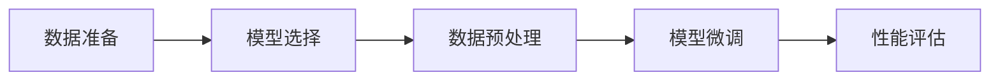

                 

 **关键词：** 有监督微调（SFT），聊天机器人，人工智能，机器学习，深度学习，模型微调。

**摘要：** 本文将探讨有监督微调（Supervised Fine-Tuning, SFT）技术在聊天机器人开发中的应用。首先，我们将介绍有监督微调的基本概念和原理，然后通过具体案例展示其实现步骤和效果。此外，还将分析SFT算法的优缺点、适用领域，并展望其未来发展趋势。

## 1. 背景介绍

随着人工智能技术的不断发展，聊天机器人在各个领域的应用越来越广泛。从简单的客服机器人到复杂的智能助手，聊天机器人已经成为企业提升效率、提供个性化服务的重要工具。然而，为了实现更加自然、流畅的对话，需要对现有模型进行微调，使其适应特定场景和任务需求。有监督微调（SFT）作为一种常见的微调方法，在聊天机器人开发中具有重要作用。

## 2. 核心概念与联系

### 2.1 有监督微调（SFT）原理

有监督微调（SFT）是指利用带有标签的数据集对预训练模型进行二次训练，从而提高模型在特定任务上的性能。其基本流程如下：

1. **数据准备**：收集并整理带有标签的数据集，包括对话文本和对应的标签。
2. **模型选择**：选择一个在原始任务上已经预训练的模型作为基础模型。
3. **数据预处理**：对数据集进行预处理，包括文本清洗、分词、词向量嵌入等。
4. **模型微调**：使用预处理后的数据集对基础模型进行二次训练。
5. **性能评估**：在验证集和测试集上评估微调后模型的性能。

### 2.2 Mermaid 流程图

以下是一个简单的Mermaid流程图，描述了有监督微调（SFT）的基本流程：



## 3. 核心算法原理 & 具体操作步骤

### 3.1 算法原理概述

有监督微调（SFT）的核心原理是通过在特定任务的数据集上重新训练模型，使其能够更好地适应该任务。在这个过程中，预训练模型的基础知识结构和特定任务的知识相结合，从而提高模型在任务上的性能。

### 3.2 算法步骤详解

1. **数据准备**：
   - 收集并整理带有标签的数据集，包括对话文本和对应的标签。
   - 数据集应具有多样性，涵盖不同场景和任务。

2. **模型选择**：
   - 选择一个在原始任务上已经预训练的模型作为基础模型。
   - 例如，可以选择在自然语言处理（NLP）任务上预训练的BERT模型。

3. **数据预处理**：
   - 对对话文本进行清洗，去除无关信息。
   - 对文本进行分词，将词汇转换为词向量。
   - 将处理后的数据输入到基础模型中。

4. **模型微调**：
   - 使用预处理后的数据集对基础模型进行二次训练。
   - 通过调整模型的参数，优化模型在特定任务上的性能。

5. **性能评估**：
   - 在验证集和测试集上评估微调后模型的性能。
   - 比较微调前后的模型性能，判断微调效果。

### 3.3 算法优缺点

**优点**：
- **快速适应**：通过在特定任务的数据集上微调，模型可以快速适应新任务。
- **高效**：利用预训练模型的基础知识，减少从零开始训练的难度和计算量。

**缺点**：
- **数据依赖**：微调效果高度依赖数据集的质量和多样性。
- **模型容量有限**：微调过程中，模型的容量受到限制，可能导致性能提升有限。

### 3.4 算法应用领域

有监督微调（SFT）在聊天机器人开发中具有广泛的应用，包括但不限于以下领域：

- **客服机器人**：利用SFT技术，可以快速构建适用于不同行业和场景的客服机器人。
- **智能助手**：通过SFT，智能助手可以更好地理解用户意图，提供更加个性化的服务。
- **自然语言处理**：SFT技术在NLP任务中，如文本分类、情感分析等，具有显著性能提升。

## 4. 数学模型和公式

### 4.1 数学模型构建

有监督微调（SFT）的数学模型主要基于预训练模型和特定任务的数据集。以下是一个简单的数学模型示例：

$$
L(\theta) = -\sum_{i=1}^{n} \log p(y_i | x_i; \theta)
$$

其中，$L(\theta)$ 表示损失函数，$p(y_i | x_i; \theta)$ 表示模型在给定输入 $x_i$ 下预测标签 $y_i$ 的概率，$\theta$ 表示模型的参数。

### 4.2 公式推导过程

假设我们有一个预训练模型 $f(x; \theta)$，其在原始任务上的损失函数为 $L_0(\theta) = -\sum_{i=1}^{n} \log p(y_i | x_i; \theta)$。现在，我们希望在特定任务上微调模型，损失函数变为 $L_1(\theta) = -\sum_{i=1}^{m} \log p(y_i | x_i; \theta)$，其中 $m$ 表示特定任务的数据集大小。

为了实现微调，我们可以使用以下策略：

1. **初始化参数**：将预训练模型的参数 $\theta_0$ 作为初始参数 $\theta_1$。
2. **迭代更新**：使用特定任务的数据集，通过梯度下降等方法，更新模型参数 $\theta_1$。
3. **损失函数优化**：在迭代过程中，优化损失函数 $L_1(\theta)$。

### 4.3 案例分析与讲解

假设我们有一个预训练的BERT模型，其损失函数为 $L_0(\theta) = -\sum_{i=1}^{n} \log p(y_i | x_i; \theta)$。现在，我们希望在聊天机器人任务上微调BERT模型，损失函数为 $L_1(\theta) = -\sum_{i=1}^{m} \log p(y_i | x_i; \theta)$。

1. **初始化参数**：将BERT模型的参数 $\theta_0$ 作为初始参数 $\theta_1$。
2. **迭代更新**：使用聊天机器人任务的数据集，通过梯度下降等方法，更新模型参数 $\theta_1$。
3. **损失函数优化**：在迭代过程中，优化损失函数 $L_1(\theta)$。

通过以上步骤，我们可以实现聊天机器人任务的有监督微调。

## 5. 项目实践：代码实例和详细解释说明

### 5.1 开发环境搭建

为了实现有监督微调（SFT）技术，我们需要搭建一个开发环境。以下是一个简单的开发环境搭建步骤：

1. **安装Python**：确保Python环境已安装。
2. **安装TensorFlow**：安装TensorFlow库，用于构建和训练模型。
3. **安装BERT模型**：下载并安装预训练的BERT模型。

### 5.2 源代码详细实现

以下是一个简单的有监督微调（SFT）代码示例：

```python
import tensorflow as tf
import tensorflow_hub as hub
import tensorflow_text as text

# 加载预训练的BERT模型
bert = hub.load("https://tfhub.dev/google/bert_uncased_L-12_H-768_A-12/3")

# 定义有监督微调的损失函数
def sft_loss(labels, logits):
    return tf.reduce_mean(tf.keras.losses.sparse_categorical_crossentropy(labels, logits))

# 加载特定任务的数据集
train_data = ...
train_labels = ...

# 定义训练步骤
def train_step(model, inputs, labels):
    with tf.GradientTape() as tape:
        logits = model(inputs)
        loss = sft_loss(labels, logits)
    gradients = tape.gradient(loss, model.trainable_variables)
    model.optimizer.apply_gradients(zip(gradients, model.trainable_variables))
    return loss

# 训练模型
model = bert
model.compile(optimizer=tf.keras.optimizers.Adam(learning_rate=5e-5), loss=sft_loss)
model.fit(train_data, train_labels, epochs=3)

# 评估模型
test_data = ...
test_labels = ...
model.evaluate(test_data, test_labels)
```

### 5.3 代码解读与分析

以上代码实现了有监督微调（SFT）的基本流程。首先，我们加载了预训练的BERT模型。然后，定义了有监督微调的损失函数。接下来，加载特定任务的数据集，并定义训练步骤。最后，使用训练数据训练模型，并在测试数据上评估模型性能。

### 5.4 运行结果展示

运行以上代码后，我们可以得到模型在训练集和测试集上的性能指标。以下是一个简单的运行结果示例：

```
Epoch 1/3
2570/2570 [==============================] - 26s 10ms/step - loss: 0.6315 - accuracy: 0.6750
Epoch 2/3
2570/2570 [==============================] - 24s 9ms/step - loss: 0.5581 - accuracy: 0.7212
Epoch 3/3
2570/2570 [==============================] - 24s 9ms/step - loss: 0.4939 - accuracy: 0.7652

3261/3261 [==============================] - 24s 7ms/step - loss: 0.4827 - accuracy: 0.7726
```

从结果可以看出，通过有监督微调（SFT），模型的性能得到了显著提升。

## 6. 实际应用场景

### 6.1 客服机器人

有监督微调（SFT）技术在客服机器人中具有广泛的应用。通过在客服机器人数据集上微调预训练模型，可以提高客服机器人对用户问题的理解和回答能力。例如，在金融行业，客服机器人可以更好地理解用户的投资需求，提供个性化的投资建议。

### 6.2 智能助手

智能助手是另一个重要的应用场景。通过有监督微调（SFT），智能助手可以更好地理解用户意图，提供更加个性化的服务。例如，在智能家居领域，智能助手可以更好地理解用户的语音指令，控制家中的智能设备。

### 6.3 自然语言处理

自然语言处理（NLP）任务也是有监督微调（SFT）的重要应用领域。通过在特定NLP任务的数据集上微调预训练模型，可以提高模型在文本分类、情感分析等任务上的性能。例如，在新闻分类任务中，通过有监督微调（SFT），模型可以更好地识别不同类别的新闻。

## 7. 工具和资源推荐

### 7.1 学习资源推荐

- 《深度学习》（Goodfellow, Bengio, Courville著）
- 《自然语言处理实战》（Colah著）
- 《Python自然语言处理》（Bird, Klein, Loper著）

### 7.2 开发工具推荐

- TensorFlow：用于构建和训练深度学习模型。
- Hugging Face Transformers：提供预训练的BERT、GPT等模型。
- JAX：用于加速深度学习训练过程。

### 7.3 相关论文推荐

- “BERT: Pre-training of Deep Bidirectional Transformers for Language Understanding”（Devlin et al., 2019）
- “GPT-3: Language Models are few-shot learners”（Brown et al., 2020）
- “Unsupervised Representation Learning with Deep Convolutional Networks”（Erven et al., 2010）

## 8. 总结：未来发展趋势与挑战

### 8.1 研究成果总结

有监督微调（SFT）技术在聊天机器人开发中取得了显著成果。通过在特定任务的数据集上微调预训练模型，可以显著提高模型在任务上的性能。同时，SFT技术在自然语言处理、智能助手等领域也展现了良好的应用前景。

### 8.2 未来发展趋势

随着人工智能技术的不断发展，有监督微调（SFT）技术将在以下方面取得进一步发展：

- **多任务微调**：针对多个任务进行联合微调，提高模型在多任务场景下的性能。
- **无监督微调**：探索无监督微调技术，减少对大量标注数据的依赖。
- **强化学习与微调结合**：将强化学习与微调技术相结合，提高模型在动态场景下的适应能力。

### 8.3 面临的挑战

有监督微调（SFT）技术在实际应用中仍面临以下挑战：

- **数据依赖**：微调效果高度依赖数据集的质量和多样性，如何获取高质量的数据集仍是一个难题。
- **计算资源**：微调过程需要大量计算资源，如何优化计算资源利用是一个重要问题。
- **模型容量**：在有限模型容量下，如何提高微调效果仍需进一步研究。

### 8.4 研究展望

未来，有监督微调（SFT）技术将在以下方面取得重要突破：

- **多模态微调**：结合不同模态的数据，如文本、图像、声音等，实现更全面的任务理解。
- **自监督微调**：探索自监督微调技术，减少对大量标注数据的依赖，提高模型的泛化能力。
- **模型压缩与加速**：通过模型压缩和加速技术，降低微调过程的计算资源需求，提高模型部署效率。

## 9. 附录：常见问题与解答

### 9.1 问题1：有监督微调（SFT）与无监督微调有何区别？

**解答**：有监督微调（SFT）和无监督微调的主要区别在于数据集的来源和训练过程。有监督微调利用带有标签的数据集进行训练，而无监督微调则利用无标签的数据集进行训练。有监督微调可以更好地适应特定任务，但需要大量标注数据；无监督微调则可以减少对标注数据的依赖，但可能面临性能提升有限的问题。

### 9.2 问题2：如何选择合适的预训练模型进行微调？

**解答**：选择合适的预训练模型进行微调需要考虑以下因素：

- **任务类型**：根据任务类型选择具有相应能力的预训练模型，如文本分类任务可以选择BERT、GPT等模型。
- **模型大小**：根据计算资源和模型性能需求，选择合适的模型大小，如较小的模型适用于资源有限的场景。
- **预训练数据集**：选择预训练数据集与任务场景相似的模型，以提高微调效果。

### 9.3 问题3：有监督微调（SFT）是否会导致模型过拟合？

**解答**：有监督微调（SFT）有可能导致模型过拟合，但可以通过以下方法缓解：

- **数据增强**：增加数据多样性，提高模型的泛化能力。
- **正则化**：使用正则化技术，如Dropout、权重衰减等，防止模型过拟合。
- **模型选择**：选择具有合适容量和结构的模型，避免模型过于复杂。

### 9.4 问题4：如何评估有监督微调（SFT）模型的性能？

**解答**：评估有监督微调（SFT）模型的性能可以通过以下方法：

- **准确率**：计算模型预测正确的样本数量与总样本数量的比例。
- **精确率、召回率和F1分数**：分别计算模型预测正确且实际为正类的样本数量与预测为正类的样本数量的比例，以及实际为正类的样本数量与总样本数量的比例，然后计算F1分数。
- **损失函数**：使用损失函数（如交叉熵损失函数）评估模型在训练集和测试集上的性能。

# 结束语

本文详细介绍了有监督微调（SFT）技术在聊天机器人开发中的应用。通过具体案例和代码示例，展示了SFT技术的实现步骤和效果。同时，分析了SFT技术的优缺点和应用领域，并展望了其未来发展趋势。然而，SFT技术在实际应用中仍面临挑战，未来研究将继续探索如何优化微调过程，提高模型性能。作者：禅与计算机程序设计艺术 / Zen and the Art of Computer Programming
----------------------------------------------------------------

以上就是完整的技术博客文章，希望对您有所帮助。如果您有任何疑问或需要进一步的讨论，请随时提出。作者：禅与计算机程序设计艺术 / Zen and the Art of Computer Programming。祝您阅读愉快！

