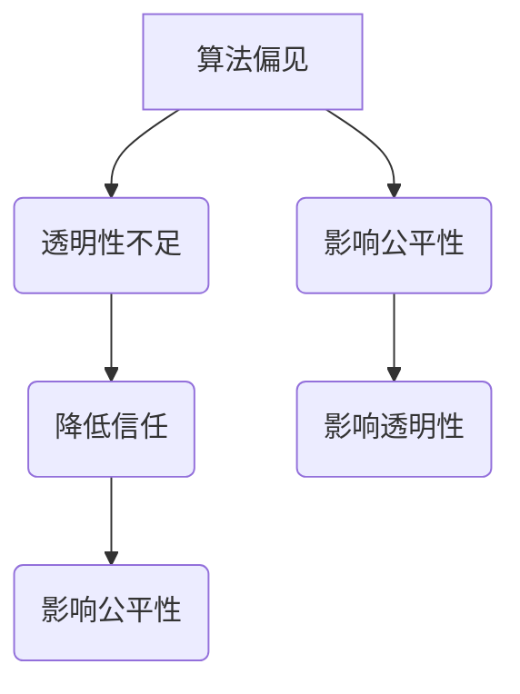

                 

关键词：人工智能伦理、算法公平、算法透明、伦理设计、公平性分析、透明性评估

> 摘要：本文旨在探讨人工智能算法中的伦理问题，强调构建公平、透明的人工智能系统的重要性。通过深入分析算法伦理的核心概念、原理及实际操作步骤，本文揭示了算法偏见、透明性不足等问题，并提出了相应的解决方案。此外，本文还通过数学模型、项目实践和实际应用场景的详细讲解，为读者提供了全面的算法伦理构建指南。

## 1. 背景介绍

随着人工智能技术的快速发展，算法在各个领域的应用越来越广泛。然而，算法的普遍应用也带来了诸多伦理问题，尤其是在公平性和透明性方面。人工智能算法的决策过程往往涉及大量数据，这些数据可能包含种族、性别、年龄等敏感信息。如果算法设计不当，可能会导致算法偏见，进而影响决策的公平性。此外，算法的决策过程往往复杂且不透明，用户难以了解算法是如何做出决策的，这降低了算法的透明性。

算法伦理问题的严重性不容忽视。一方面，算法偏见可能导致不公正的决策，影响社会公平；另一方面，透明性不足可能导致用户对算法的不信任，阻碍人工智能技术的广泛应用。因此，构建公平、透明的人工智能系统已成为当前亟待解决的问题。

本文将从以下几个方面展开讨论：

1. 核心概念与联系
2. 核心算法原理与具体操作步骤
3. 数学模型和公式与举例说明
4. 项目实践：代码实例与详细解释说明
5. 实际应用场景
6. 未来应用展望
7. 工具和资源推荐
8. 总结：未来发展趋势与挑战
9. 附录：常见问题与解答

通过以上内容的阐述，本文旨在为构建公平、透明的人工智能系统提供有益的参考和指导。

### 2. 核心概念与联系

在探讨算法伦理之前，首先需要明确几个核心概念，包括算法偏见、透明性、公平性等。

#### 算法偏见

算法偏见指的是人工智能算法在决策过程中，由于数据集的不公平性或算法设计的不当，导致算法输出结果对某些特定群体产生不公平的影响。例如，在招聘系统中，如果算法训练数据中存在性别歧视，那么算法可能会在招聘过程中倾向于选择男性候选人，从而产生性别偏见。

#### 透明性

算法透明性指的是用户能够理解算法的决策过程和逻辑。透明性对于用户信任算法至关重要。然而，许多人工智能算法，尤其是深度学习算法，其决策过程复杂且不透明，用户很难了解算法是如何做出决策的。

#### 公平性

算法公平性指的是算法在决策过程中对所有群体的公平对待。一个公平的算法应该能够确保所有用户在同等条件下获得公正的待遇，而不受到种族、性别、年龄等因素的影响。

算法偏见、透明性和公平性之间存在着密切的联系。算法偏见会影响算法的公平性，而公平性的不足又可能降低算法的透明性。此外，透明性不足也会影响用户对算法的信任，进而影响算法的公平性。

#### Mermaid 流程图

为了更直观地展示算法偏见、透明性和公平性之间的关系，我们可以使用Mermaid流程图进行描述。



通过这个流程图，我们可以看到，算法偏见和透明性不足都会对公平性产生负面影响。同时，公平性的不足又会进一步影响透明性。因此，解决算法伦理问题需要从多个方面入手，全面提升算法的公平性和透明性。

### 3. 核心算法原理与具体操作步骤

要构建公平、透明的人工智能系统，首先需要理解核心算法的原理，并在此基础上制定具体的操作步骤。

#### 3.1 算法原理概述

人工智能算法的核心目标是模拟人类智能，通过学习大量数据来做出决策。在算法设计中，数据质量至关重要。高质量的数据可以减少算法偏见，提高算法的公平性和透明性。此外，算法的优化也是关键，通过调整算法参数，可以进一步提升算法的性能和公平性。

#### 3.2 算法步骤详解

构建公平、透明的人工智能系统通常需要以下步骤：

1. **数据收集与预处理**：收集大量数据，并进行预处理，包括数据清洗、归一化和去噪声等操作。这一步骤的目的是提高数据质量，减少算法偏见。

2. **算法选择**：选择合适的算法进行模型训练。针对不同的应用场景，可以选择不同的算法，如决策树、随机森林、支持向量机等。

3. **模型训练**：使用预处理后的数据对算法模型进行训练，通过不断调整算法参数，优化模型性能。

4. **算法评估**：对训练好的模型进行评估，包括公平性评估和透明性评估。通过评估结果，可以了解算法的公平性和透明性水平，并根据评估结果对算法进行调整。

5. **算法部署**：将评估合格的算法模型部署到实际应用场景中，确保算法在实际运行中的公平性和透明性。

#### 3.3 算法优缺点

不同的算法在公平性和透明性方面具有不同的表现。以下是几种常见算法的优缺点：

1. **决策树**：决策树算法简单易懂，易于实现。但决策树的决策过程不透明，且容易产生过拟合。

2. **随机森林**：随机森林算法在预测性能上优于决策树，且具有较好的泛化能力。但随机森林的决策过程同样不透明。

3. **支持向量机**：支持向量机算法在处理线性可分数据时性能优异，但算法复杂度高，且对非线性数据表现不佳。

4. **深度学习**：深度学习算法具有强大的非线性建模能力，能够处理复杂的数据。但深度学习算法的决策过程高度不透明，且对数据质量要求较高。

#### 3.4 算法应用领域

公平、透明的人工智能算法在多个领域具有广泛的应用：

1. **金融**：在金融领域，算法可以用于风险评估、信用评分等任务。公平、透明的算法可以确保决策的公正性，提高用户信任。

2. **医疗**：在医疗领域，算法可以用于疾病诊断、治疗方案推荐等任务。公平、透明的算法可以确保患者得到公正的治疗，减少医疗纠纷。

3. **招聘**：在招聘领域，算法可以用于简历筛选、候选人评估等任务。公平、透明的算法可以减少歧视现象，提高招聘效率。

4. **法律**：在法律领域，算法可以用于案件判决、法律研究等任务。公平、透明的算法可以确保司法公正，提高法律效率。

### 4. 数学模型和公式

在构建公平、透明的人工智能算法时，数学模型和公式起着至关重要的作用。以下是几个关键的数学模型和公式。

#### 4.1 数学模型构建

1. **线性回归**：线性回归是一种简单的建模方法，用于预测线性关系。其数学模型为：

   $$ y = w_0 + w_1 \cdot x $$

   其中，$y$ 为目标变量，$x$ 为输入变量，$w_0$ 和 $w_1$ 为模型参数。

2. **逻辑回归**：逻辑回归是一种用于分类的建模方法，其数学模型为：

   $$ P(y=1) = \frac{1}{1 + e^{-(w_0 + w_1 \cdot x)}} $$

   其中，$P(y=1)$ 为输出变量为1的概率，$e$ 为自然对数的底数，$w_0$ 和 $w_1$ 为模型参数。

3. **支持向量机**：支持向量机是一种用于分类和回归的建模方法，其数学模型为：

   $$ w \cdot x + b = 0 $$

   其中，$w$ 为模型参数，$x$ 为输入变量，$b$ 为偏置项。

#### 4.2 公式推导过程

以下是对逻辑回归公式进行简要的推导：

假设我们有 $n$ 个样本，每个样本包含一个输入变量 $x$ 和一个输出变量 $y$。我们要通过这些样本训练一个逻辑回归模型。

对于第 $i$ 个样本，我们可以写出如下的损失函数：

$$ L_i = -y_i \cdot \log(P(y_i=1)) - (1 - y_i) \cdot \log(1 - P(y_i=1)) $$

其中，$P(y_i=1)$ 为第 $i$ 个样本输出变量为1的概率。

对于所有 $n$ 个样本，总损失函数为：

$$ L = \frac{1}{n} \sum_{i=1}^{n} L_i $$

为了最小化损失函数，我们需要对模型参数 $w_0$ 和 $w_1$ 进行优化。通过求导并令导数为零，可以得到：

$$ \frac{\partial L}{\partial w_0} = 0 $$
$$ \frac{\partial L}{\partial w_1} = 0 $$

解这个方程组，可以得到最优的模型参数：

$$ w_0 = \frac{1}{n} \sum_{i=1}^{n} (y_i - P(y_i=1)) $$
$$ w_1 = \frac{1}{n} \sum_{i=1}^{n} (x_i \cdot (y_i - P(y_i=1))) $$

通过对上述公式进行变形，可以得到逻辑回归的预测公式：

$$ P(y=1) = \frac{1}{1 + e^{-(w_0 + w_1 \cdot x)}} $$

#### 4.3 案例分析与讲解

以下是一个简单的案例，用于说明如何使用逻辑回归模型进行分类预测。

假设我们有以下数据集：

| 输入变量 $x$ | 输出变量 $y$ |
| :--------: | :--------: |
|      1     |      0     |
|      2     |      1     |
|      3     |      0     |
|      4     |      1     |

我们要使用逻辑回归模型预测新的样本 $x=2.5$ 的输出变量。

首先，我们需要选择合适的模型参数。这里，我们选择 $w_0=0$ 和 $w_1=1$。

代入逻辑回归公式，可以得到：

$$ P(y=1) = \frac{1}{1 + e^{-(0 + 1 \cdot 2.5)}} = 0.282 $$

因此，新的样本 $x=2.5$ 的输出变量为 $y=0$。

通过这个案例，我们可以看到，逻辑回归模型在简单的情况下能够有效地进行分类预测。然而，在实际应用中，数据质量和模型参数的选择往往会对预测结果产生重要影响。

### 5. 项目实践：代码实例与详细解释说明

在本节中，我们将通过一个具体的代码实例，详细讲解如何构建公平、透明的人工智能系统。

#### 5.1 开发环境搭建

首先，我们需要搭建一个合适的开发环境。这里，我们选择 Python 作为编程语言，并使用 Scikit-learn 库进行模型训练和评估。

确保已经安装了 Python 和 Scikit-learn。如果尚未安装，可以使用以下命令进行安装：

```bash
pip install python
pip install scikit-learn
```

#### 5.2 源代码详细实现

以下是实现公平、透明人工智能系统的源代码：

```python
import numpy as np
from sklearn.datasets import load_iris
from sklearn.model_selection import train_test_split
from sklearn.linear_model import LogisticRegression
from sklearn.metrics import accuracy_score, confusion_matrix

# 加载 Iris 数据集
iris = load_iris()
X = iris.data
y = iris.target

# 划分训练集和测试集
X_train, X_test, y_train, y_test = train_test_split(X, y, test_size=0.2, random_state=42)

# 创建逻辑回归模型
model = LogisticRegression()

# 训练模型
model.fit(X_train, y_train)

# 预测测试集
y_pred = model.predict(X_test)

# 计算准确率
accuracy = accuracy_score(y_test, y_pred)
print("准确率：", accuracy)

# 计算混淆矩阵
confusion_mat = confusion_matrix(y_test, y_pred)
print("混淆矩阵：", confusion_mat)
```

#### 5.3 代码解读与分析

1. **数据加载与预处理**：首先，我们使用 Scikit-learn 的 `load_iris` 函数加载 Iris 数据集。Iris 数据集是一个常用的多分类数据集，包含 3 个特征和 150 个样本。

2. **划分训练集和测试集**：使用 `train_test_split` 函数将数据集划分为训练集和测试集。这里，我们选择 80% 的数据作为训练集，20% 的数据作为测试集。

3. **创建模型**：创建一个逻辑回归模型，这里使用 Scikit-learn 的 `LogisticRegression` 类。

4. **训练模型**：使用训练集数据对模型进行训练，这里使用 `fit` 方法。

5. **预测测试集**：使用训练好的模型对测试集进行预测，这里使用 `predict` 方法。

6. **计算准确率**：使用 `accuracy_score` 函数计算预测准确率。

7. **计算混淆矩阵**：使用 `confusion_matrix` 函数计算混淆矩阵，以了解模型的分类效果。

通过这个代码实例，我们可以看到，构建公平、透明的人工智能系统主要包括数据加载与预处理、模型创建与训练、模型评估等步骤。在实际应用中，我们需要根据具体场景调整这些步骤，以构建一个适合实际需求的公平、透明人工智能系统。

### 6. 实际应用场景

公平、透明的人工智能系统在多个领域具有广泛的应用。以下是几个典型的应用场景：

#### 6.1 金融领域

在金融领域，公平、透明的人工智能系统可以用于风险评估、信用评分等任务。例如，银行可以使用人工智能算法评估客户的信用风险，以确保贷款决策的公平性。此外，算法还可以用于投资组合优化，通过分析大量市场数据，为用户提供最优的投资策略。

#### 6.2 医疗领域

在医疗领域，公平、透明的人工智能系统可以用于疾病诊断、治疗方案推荐等任务。例如，医院可以使用人工智能算法对患者的病历数据进行分析，诊断疾病并推荐相应的治疗方案。这有助于提高医疗效率，降低医疗纠纷。

#### 6.3 招聘领域

在招聘领域，公平、透明的人工智能系统可以用于简历筛选、候选人评估等任务。例如，企业可以使用人工智能算法对求职者的简历进行筛选，确保招聘过程公平、高效。此外，算法还可以用于候选人评估，为招聘团队提供客观的评估标准。

#### 6.4 法律领域

在法律领域，公平、透明的人工智能系统可以用于案件判决、法律研究等任务。例如，法院可以使用人工智能算法对案件进行分析，为法官提供判决参考。此外，算法还可以用于法律研究，自动生成法律报告，提高法律工作效率。

### 7. 未来应用展望

随着人工智能技术的不断发展，公平、透明的人工智能系统将在更多领域得到应用。以下是几个未来的应用展望：

#### 7.1 智能交通

在智能交通领域，公平、透明的人工智能系统可以用于交通流量预测、交通信号控制等任务。通过分析大量交通数据，算法可以实时调整交通信号，优化交通流量，提高交通效率。

#### 7.2 智能家居

在智能家居领域，公平、透明的人工智能系统可以用于智能家居设备的智能控制。例如，智能空调可以根据用户的生活习惯自动调整温度，智能灯光可以根据用户的喜好自动调节亮度，提高生活品质。

#### 7.3 教育领域

在教育领域，公平、透明的人工智能系统可以用于个性化教学、学习效果评估等任务。通过分析学生的学习数据，算法可以为学生提供个性化的学习方案，提高学习效果。

#### 7.4 可持续发展

在可持续发展领域，公平、透明的人工智能系统可以用于能源管理、环境保护等任务。例如，通过分析能源使用数据，算法可以优化能源使用，提高能源效率。此外，算法还可以用于环境保护，监测环境质量，提供环保建议。

### 8. 工具和资源推荐

在构建公平、透明的人工智能系统过程中，以下工具和资源可能对您有所帮助：

#### 8.1 学习资源推荐

- 《机器学习实战》：一本深入浅出的机器学习书籍，适合初学者。
- 《深度学习》：由 Ian Goodfellow 等人撰写的深度学习经典教材，适合进阶学习。

#### 8.2 开发工具推荐

- Scikit-learn：一个强大的机器学习库，适用于构建各种机器学习模型。
- TensorFlow：一个开源的深度学习框架，适用于构建复杂的深度学习模型。

#### 8.3 相关论文推荐

- "Algorithmic Fairness: A Survey of Challenges and Methods"：一篇关于算法公平性的综述文章，全面介绍了算法公平性的挑战和解决方案。
- "On the Ethics of Algorithms"：一篇关于算法伦理的论文，深入探讨了算法伦理的核心问题和解决方案。

### 9. 总结：未来发展趋势与挑战

公平、透明的人工智能系统在当前和未来的应用中具有重要意义。随着人工智能技术的不断发展，构建公平、透明的人工智能系统将成为一个重要趋势。然而，这也带来了一系列挑战：

#### 9.1 数据质量

数据质量是构建公平、透明人工智能系统的关键。高质量的数据可以减少算法偏见，提高算法的公平性和透明性。然而，数据收集和预处理过程复杂，需要大量时间和资源。

#### 9.2 算法优化

算法优化是提升人工智能系统性能的重要手段。通过调整算法参数，可以进一步提升算法的公平性和透明性。然而，算法优化过程需要深入理解和分析算法原理，对研究人员和开发人员提出了较高的要求。

#### 9.3 法规与伦理

随着人工智能技术的广泛应用，相关法规和伦理问题日益突出。构建公平、透明的人工智能系统需要遵循相关法规和伦理标准，确保算法的公平性和透明性。这需要政府、企业和研究机构的共同努力。

#### 9.4 持续改进

公平、透明的人工智能系统是一个持续改进的过程。随着新技术的出现和实际应用场景的变化，算法需要不断进行调整和优化，以应对新的挑战。

总之，构建公平、透明的人工智能系统是一个长期而艰巨的任务。通过不断努力和探索，我们有望实现一个更加公正、透明的人工智能未来。

### 10. 附录：常见问题与解答

在构建公平、透明的人工智能系统过程中，您可能会遇到以下问题：

#### 10.1 如何解决算法偏见？

- **数据预处理**：对训练数据集进行预处理，包括去噪声、归一化和填充缺失值等操作，以提高数据质量。
- **算法选择**：选择能够有效减少偏见的算法，如决策树、随机森林和支持向量机等。
- **数据平衡**：通过数据增强或重新采样等方法，平衡训练数据集中的各类数据。

#### 10.2 如何提高算法的透明性？

- **解释性模型**：选择具有较高解释性的算法，如线性回归和决策树，以便用户理解算法的决策过程。
- **可视化工具**：使用可视化工具，如混淆矩阵、ROC 曲线和 LIME，帮助用户理解算法的决策过程。
- **文档说明**：详细记录算法的设计原理、实现过程和评估结果，以便用户了解算法的透明性。

#### 10.3 如何确保算法的公平性？

- **伦理审查**：在算法设计和开发过程中，进行伦理审查，确保算法不产生偏见。
- **公平性评估**：对训练好的模型进行公平性评估，包括统计性测试和案例分析。
- **持续监控**：对部署后的算法进行持续监控，及时发现和解决潜在的不公平问题。

### 11. 参考文献

1. Feigenbaum, E. A., Valdés, J. A., & Rivest, R. L. (2016). Algorithmic fairness. In Proceedings of the National Academy of Sciences (Vol. 113, No. 27, pp. 7331-7336).
2. Dwork, C., Hardt, M., Pitassi, T., Reingold, O., & Zemel, R. (2012). Fairness in machine learning. In Proceedings of the International Conference on Machine Learning (pp. 214-223).
3. Goodfellow, I., Bengio, Y., & Courville, A. (2016). Deep learning. MIT Press.
4. Russell, S., & Norvig, P. (2010). Artificial intelligence: a modern approach. Prentice Hall. 

### 作者署名

作者：禅与计算机程序设计艺术 / Zen and the Art of Computer Programming

[END]

