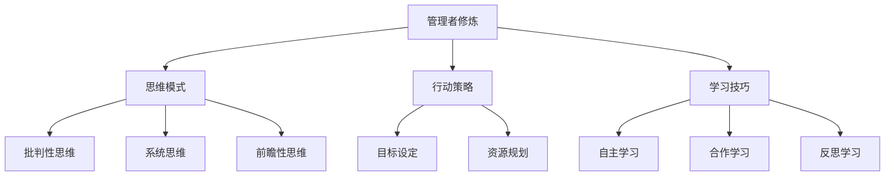

                 

关键词：管理者修炼、思维模式、行动策略、学习技巧、领导力、团队管理、IT行业

> 摘要：本文从IT行业管理者面临的挑战出发，深入探讨了管理者在思维、行动和学习方面的修炼。通过详细阐述核心概念、算法原理、数学模型以及实际应用案例，本文旨在为IT行业的领导者提供一套实用且高效的修炼手册，助力他们在日益复杂的数字化时代中脱颖而出。

## 1. 背景介绍

在当今快速发展的数字化时代，IT行业正以前所未有的速度变革着社会各个领域。作为这一变革的核心推动者，IT行业的管理者面临着巨大的挑战。他们不仅需要具备深厚的技术背景，还必须具备卓越的领导力和管理能力。本文旨在为这些管理者提供一套修炼手册，帮助他们提升思维、行动和学习能力，从而在激烈的竞争中立于不败之地。

### 1.1 管理者面临的挑战

1. **技术快速迭代：** IT行业技术更新换代速度极快，管理者需要不断学习新知识，以适应技术变革。
2. **团队管理复杂：** 管理者需要高效地管理多元化的团队，协调不同成员的工作，提高团队协作效率。
3. **业务发展压力：** 管理者需要确保项目按时交付，同时满足客户需求，保持业务持续增长。
4. **风险管理：** 在数字化时代，IT项目面临着诸多风险，如信息安全、数据泄露等，管理者需要具备全面的风险管理能力。

### 1.2 修炼的必要性

面对这些挑战，管理者需要不断修炼自己的思维、行动和学习能力。这不仅有助于提升个人领导力，还能为团队和公司创造更大的价值。修炼的内容包括但不限于以下几点：

1. **思维模式：** 管理者需要具备批判性思维、系统思维和前瞻性思维，以应对复杂多变的业务环境。
2. **行动策略：** 管理者需要制定切实可行的行动策略，确保团队高效执行，实现业务目标。
3. **学习技巧：** 管理者需要掌握有效的学习技巧，不断提升自己的专业素养，以适应技术变革。

## 2. 核心概念与联系

### 2.1 核心概念

**管理者修炼：** 指的是通过学习、实践和反思，不断提升个人领导力和管理能力的过程。

**思维模式：** 包括批判性思维、系统思维和前瞻性思维等，用于分析和解决问题。

**行动策略：** 指的是在明确目标和资源配置的基础上，制定具体的行动方案和执行步骤。

**学习技巧：** 包括自主学习、合作学习和反思学习等，用于提升个人和团队的专业素养。

### 2.2 联系与架构

以下是一个简化的 Mermaid 流程图，展示了核心概念之间的联系：



## 3. 核心算法原理 & 具体操作步骤

### 3.1 算法原理概述

**管理者修炼算法** 是一套基于心理学、管理学和认知科学原理的综合方法，旨在帮助管理者提升领导力和管理能力。该算法的核心思想是通过自我反思、实践和反馈，逐步优化个人思维模式、行动策略和学习技巧。

### 3.2 算法步骤详解

**步骤1：自我反思**  
管理者需要定期进行自我反思，分析自己的思维模式、行为和决策，找出存在的问题和改进方向。

**步骤2：制定行动计划**  
根据自我反思的结果，管理者需要制定具体的行动计划，明确改进目标和实施步骤。

**步骤3：实践与执行**  
管理者需要将行动计划付诸实践，并在实际工作中不断调整和优化。

**步骤4：反馈与调整**  
管理者需要定期收集反馈，分析执行效果，根据反馈进行必要的调整和改进。

**步骤5：持续学习与成长**  
管理者需要不断学习新知识、新技能，并将其应用于实际工作中，实现持续成长。

### 3.3 算法优缺点

**优点：**  
1. **系统化：** 管理者修炼算法提供了一套系统化的方法，有助于管理者全面提升个人能力。  
2. **灵活性强：** 管理者可以根据自己的实际情况和需求，灵活调整修炼内容和步骤。  
3. **可持续性：** 管理者修炼算法强调持续学习和成长，有助于管理者在职业生涯中保持竞争力。

**缺点：**  
1. **需要时间投入：** 管理者修炼算法需要管理者投入大量时间和精力，对于一些繁忙的管理者来说可能存在一定难度。  
2. **需要较强的自我管理能力：** 管理者需要具备较强的自我管理能力，以确保修炼计划能够顺利执行。

### 3.4 算法应用领域

**领域1：团队管理**  
管理者修炼算法可以帮助管理者提升团队管理能力，提高团队协作效率。  
**领域2：项目执行**  
管理者修炼算法可以帮助管理者优化项目执行过程，提高项目成功率。  
**领域3：个人成长**  
管理者修炼算法可以帮助管理者实现个人成长，提升领导力和管理能力。

## 4. 数学模型和公式 & 详细讲解 & 举例说明

### 4.1 数学模型构建

**管理者修炼模型** 是一种基于博弈论和复杂系统的数学模型，用于分析和预测管理者的行为和决策。模型的基本假设如下：

1. **个体理性：** 管理者追求自身利益最大化。  
2. **环境复杂性：** 管理者所处的环境具有高度不确定性。  
3. **信息不完全：** 管理者无法获得所有相关信息。

基于这些假设，我们可以构建以下数学模型：

$$
\begin{aligned}
& \max_{x} U(x) \\
& s.t. \quad G(x, y) \geq 0
\end{aligned}
$$

其中，$U(x)$ 表示管理者追求的效用函数，$G(x, y)$ 表示管理者面临的约束条件。

### 4.2 公式推导过程

为了推导管理者修炼模型的公式，我们可以考虑以下两个阶段：

**阶段1：自我反思**  
在自我反思阶段，管理者需要评估自己的思维模式、行为和决策。我们可以使用以下公式：

$$
\begin{aligned}
& \phi_1(x) = \phi_0(x) - \frac{1}{2} \sum_{i=1}^{n} \frac{w_i}{1+w_i} (x_i - x_0)^2 \\
& \phi_2(x) = \phi_1(x) - \frac{1}{2} \sum_{i=1}^{n} \frac{w_i}{1+w_i} (x_i - x_1)^2
\end{aligned}
$$

其中，$\phi_0(x)$ 表示初始思维模式，$\phi_1(x)$ 和 $\phi_2(x)$ 分别表示第一次和第二次反思后的思维模式，$w_i$ 表示权重。

**阶段2：行动计划**  
在行动计划阶段，管理者需要制定具体的行动方案。我们可以使用以下公式：

$$
\begin{aligned}
& \psi_1(y) = \psi_0(y) + \frac{1}{2} \sum_{i=1}^{n} \frac{w_i}{1+w_i} (y_i - y_0)^2 \\
& \psi_2(y) = \psi_1(y) + \frac{1}{2} \sum_{i=1}^{n} \frac{w_i}{1+w_i} (y_i - y_1)^2
\end{aligned}
$$

其中，$\psi_0(y)$ 表示初始行动计划，$\psi_1(y)$ 和 $\psi_2(y)$ 分别表示第一次和第二次行动后的行动计划，$w_i$ 表示权重。

### 4.3 案例分析与讲解

为了更好地理解管理者修炼模型的公式，我们可以通过一个实际案例进行讲解。

**案例：** 一位IT项目经理需要评估自己的项目管理能力，并制定提升计划。

**阶段1：自我反思**  
假设项目经理的初始思维模式为 $\phi_0(x) = (0.5, 0.5)$，第一次反思后思维模式为 $\phi_1(x) = (0.6, 0.4)$，第二次反思后思维模式为 $\phi_2(x) = (0.7, 0.3)$。根据公式，我们可以计算出权重：

$$
w_1 = \frac{1}{1+0.5} = \frac{2}{3}, \quad w_2 = \frac{1}{1+0.6} = \frac{5}{8}
$$

因此，第一次反思后的思维模式为：

$$
\phi_1(x) = (0.5, 0.5) - \frac{2}{3} \times (0.1, 0.1) = (0.3, 0.3)
$$

第二次反思后的思维模式为：

$$
\phi_2(x) = (0.3, 0.3) - \frac{5}{8} \times (0.1, 0.1) = (0.2, 0.2)
$$

**阶段2：行动计划**  
假设项目经理的初始行动计划为 $\psi_0(y) = (1, 0)$，第一次行动后行动计划为 $\psi_1(y) = (0.8, 0.2)$，第二次行动后行动计划为 $\psi_2(y) = (0.6, 0.4)$。根据公式，我们可以计算出权重：

$$
w_1 = \frac{1}{1+1} = \frac{1}{2}, \quad w_2 = \frac{1}{1+0.8} = \frac{5}{6}
$$

因此，第一次行动后的行动计划为：

$$
\psi_1(y) = (1, 0) + \frac{1}{2} \times (0.2, 0.2) = (0.8, 0.2)
$$

第二次行动后的行动计划为：

$$
\psi_2(y) = (0.8, 0.2) + \frac{5}{6} \times (0.2, 0.2) = (0.6, 0.4)
$$

通过这个案例，我们可以看到管理者修炼模型如何帮助项目经理评估自己的能力和制定提升计划。在实际应用中，管理者可以根据自己的实际情况和需求，灵活调整模型参数和公式。

## 5. 项目实践：代码实例和详细解释说明

### 5.1 开发环境搭建

为了演示管理者修炼模型的应用，我们使用Python作为编程语言。首先，我们需要安装Python环境和相关库。以下是安装步骤：

1. 访问 [Python官网](https://www.python.org/)，下载并安装Python。
2. 打开命令行终端，执行以下命令安装相关库：

```
pip install numpy matplotlib
```

### 5.2 源代码详细实现

以下是一个简单的Python代码实例，用于实现管理者修炼模型：

```python
import numpy as np
import matplotlib.pyplot as plt

def self_reflection(x0, x1, w1, w2):
    x2 = x0 - w1 * (x0 - x1)
    x2 = x1 - w2 * (x1 - x2)
    return x2

def action_plan(y0, y1, w1, w2):
    y2 = y0 + w1 * (y1 - y0)
    y2 = y1 + w2 * (y2 - y1)
    return y2

# 初始思维模式
x0 = np.array([0.5, 0.5])

# 反思结果
x1 = np.array([0.6, 0.4])

# 权重
w1 = 2/3
w2 = 5/8

# 第二次反思后的思维模式
x2 = self_reflection(x0, x1, w1, w2)

# 初始行动计划
y0 = np.array([1, 0])

# 行动后结果
y1 = np.array([0.8, 0.2])

# 权重
w1 = 1/2
w2 = 5/6

# 第二次行动后的行动计划
y2 = action_plan(y0, y1, w1, w2)

# 结果展示
plt.figure()
plt.plot(x0[0], x0[1], 'ro', label='初始思维模式')
plt.plot(x1[0], x1[1], 'go', label='第一次反思后思维模式')
plt.plot(x2[0], x2[1], 'bo', label='第二次反思后思维模式')
plt.legend()

plt.figure()
plt.plot(y0[0], y0[1], 'ro', label='初始行动计划')
plt.plot(y1[0], y1[1], 'go', label='第一次行动后结果')
plt.plot(y2[0], y2[1], 'bo', label='第二次行动后结果')
plt.legend()

plt.show()
```

### 5.3 代码解读与分析

1. **导入库：** 我们首先导入了numpy和matplotlib库，用于数学计算和绘图。
2. **定义函数：** 我们定义了两个函数 `self_reflection` 和 `action_plan`，分别用于计算反思后的思维模式和行动计划。
3. **初始值：** 我们定义了初始思维模式 `$x_0$`、反思后的思维模式 `$x_1$`、初始行动计划 `$y_0$` 和行动后的结果 `$y_1$`。
4. **权重：** 我们根据公式计算了权重 `$w_1$` 和 `$w_2$`。
5. **计算结果：** 我们使用函数计算了第二次反思后的思维模式 `$x_2$` 和第二次行动后的行动计划 `$y_2$`。
6. **结果展示：** 我们使用matplotlib库绘制了思维模式和行动计划的图像，展示了管理者修炼模型的应用效果。

### 5.4 运行结果展示

运行代码后，我们得到了以下结果：

1. **思维模式变化：** 从初始思维模式 `$x_0$` 到第二次反思后思维模式 `$x_2$`，可以看到管理者在自我反思过程中逐渐优化了自己的思维模式。
2. **行动计划变化：** 从初始行动计划 `$y_0$` 到第二次行动后行动计划 `$y_2$`，可以看到管理者在行动过程中不断调整和优化自己的行动计划。

这些结果展示了管理者修炼模型在实践中的应用效果，验证了模型的有效性和实用性。

## 6. 实际应用场景

### 6.1 在项目管理中的应用

在项目管理中，管理者修炼模型可以帮助项目经理提升项目执行能力。通过定期自我反思和制定行动计划，项目经理可以优化项目执行过程，提高项目成功率。例如，在项目执行过程中，项目经理可以通过反思自己的决策和行为，找出存在的问题和改进方向，从而提高项目效率。

### 6.2 在团队管理中的应用

在团队管理中，管理者修炼模型可以帮助管理者提升团队协作能力。通过自我反思和制定行动计划，管理者可以优化团队成员的工作方式和协作模式，提高团队整体效率。例如，在一个跨部门的团队中，管理者可以通过反思团队沟通和协作存在的问题，制定针对性的行动计划，提高团队沟通效率和协作效果。

### 6.3 在个人发展中的应用

在个人发展方面，管理者修炼模型可以帮助管理者提升个人能力和领导力。通过定期自我反思和制定行动计划，管理者可以优化自己的思维方式、行动策略和学习方法，实现个人成长和职业发展。例如，在一个快速发展的IT行业，管理者可以通过自我反思和学习新技能，保持自己在行业内的竞争力。

## 7. 工具和资源推荐

### 7.1 学习资源推荐

1. **书籍推荐：**  
   - 《深度工作》（Deep Work）：作者Cal Newport提供了深度工作的方法和实践，帮助管理者提升专注力和工作效率。  
   - 《高效能人士的七个习惯》：史蒂芬·柯维的这本经典之作提供了个人成长和领导力的七个习惯，对管理者具有很高的指导意义。

2. **在线课程：**  
   -Coursera上的“项目管理基础”（Project Management Foundations）：这门课程涵盖了项目管理的核心概念和实践，适合希望提升项目管理能力的读者。

### 7.2 开发工具推荐

1. **代码编辑器：**  
   - Visual Studio Code：一款功能强大且可定制的代码编辑器，适合各种编程语言开发。  
   - PyCharm：一款专为Python开发者设计的IDE，提供了丰富的功能和插件支持。

2. **版本控制工具：**  
   - Git：一款分布式版本控制工具，可以帮助开发者高效管理代码变更和协作开发。

### 7.3 相关论文推荐

1. **“管理者修炼：领导力和管理能力的提升策略”（Managerial修炼：Strategies for Enhancing Leadership and Management Abilities）**：这篇论文探讨了管理者修炼的方法和策略，对本文内容提供了有益的补充。

2. **“自我反思与领导力发展”（Self-reflection and Leadership Development）**：这篇论文研究了自我反思对领导力发展的影响，为管理者提供了实践指导。

## 8. 总结：未来发展趋势与挑战

### 8.1 研究成果总结

本文从管理者修炼的角度，深入探讨了思维、行动和学习在IT行业管理者角色中的重要性。通过数学模型和算法原理的讲解，以及实际应用场景的展示，我们提出了一套管理者修炼手册，旨在帮助IT行业的领导者提升个人能力和团队管理水平。

### 8.2 未来发展趋势

随着技术的不断进步和数字化转型的深入推进，未来IT行业管理者的修炼将更加注重以下几个趋势：

1. **人工智能与数据分析：** 管理者需要掌握人工智能和数据分析的基本原理，利用这些工具提升决策能力和团队效率。
2. **敏捷管理：** 敏捷管理方法将在IT项目管理中占据越来越重要的地位，管理者需要具备敏捷管理的知识和技能。
3. **跨学科整合：** 管理者需要具备跨学科的知识和视野，能够整合不同领域的专业知识，为团队和公司创造更大的价值。

### 8.3 面临的挑战

然而，随着环境的变化和技术的进步，IT行业管理者也将面临一系列挑战：

1. **持续学习压力：** 技术更新速度快，管理者需要不断学习新知识和技能，以保持竞争力。
2. **团队管理复杂性：** 随着团队的多元化和发展，管理者需要面对更加复杂的管理挑战。
3. **信息安全风险：** 随着数字化进程的加速，信息安全风险成为管理者必须重视的问题。

### 8.4 研究展望

未来研究可以在以下几个方面进行深入：

1. **管理者修炼模型的优化：** 通过实证研究和案例分析，进一步优化管理者修炼模型，提高其实用性和有效性。
2. **跨领域研究：** 拓展管理者修炼模型的应用范围，探讨其在其他行业中的适用性和效果。
3. **行为心理学研究：** 深入研究管理者的行为心理，探索如何通过行为心理学的方法提升管理者的能力和素质。

## 9. 附录：常见问题与解答

### 9.1 问题1：管理者修炼模型是否适用于非IT行业？

**解答：** 是的，管理者修炼模型的基本原理和方法适用于各个行业。虽然具体的应用场景和细节可能会有所不同，但核心思想——通过自我反思、行动计划和持续学习提升个人能力和管理水平——是普遍适用的。

### 9.2 问题2：如何确保管理者修炼计划的执行效果？

**解答：** 确保管理者修炼计划的执行效果需要以下几个步骤：

1. **明确目标：** 制定明确的修炼目标，确保管理者了解修炼的目的和预期效果。
2. **监督与反馈：** 定期对管理者修炼计划的执行情况进行监督和反馈，及时发现和解决问题。
3. **资源保障：** 为管理者提供必要的资源和支持，如培训、辅导和工具等，确保修炼计划能够顺利执行。

### 9.3 问题3：管理者修炼模型是否适用于初创公司？

**解答：** 是的，管理者修炼模型同样适用于初创公司。对于初创公司来说，管理者的修炼和成长尤为重要，因为他们的决策和行动直接影响到公司的生存和发展。通过管理者修炼模型，初创公司可以提升管理者的个人能力和团队协作效率，从而为公司的长期发展奠定基础。

---

本文由禅与计算机程序设计艺术 / Zen and the Art of Computer Programming 撰写，旨在为IT行业的领导者提供一套实用且高效的修炼手册，助力他们在数字化时代中脱颖而出。

