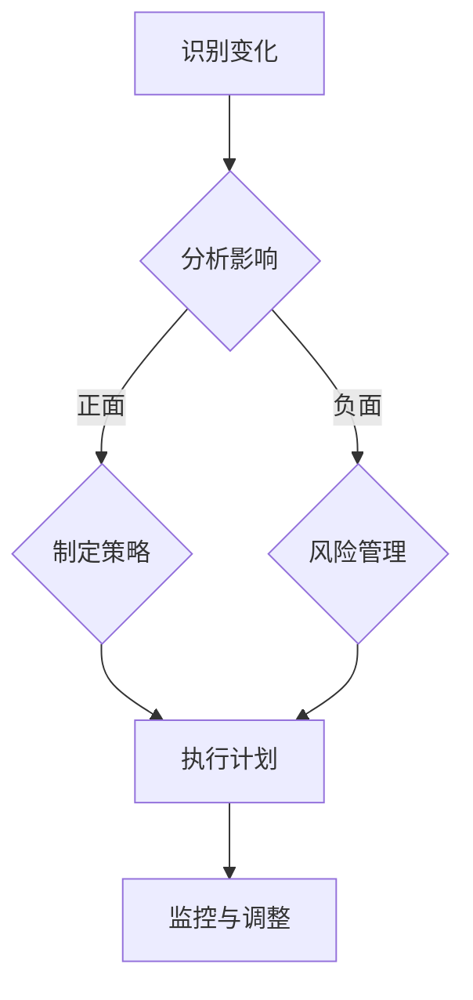
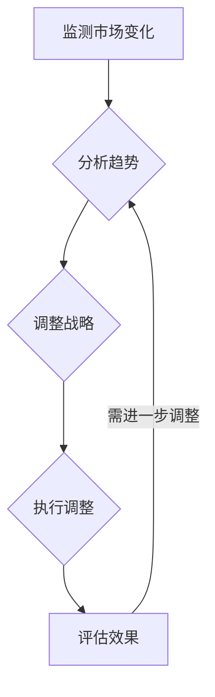
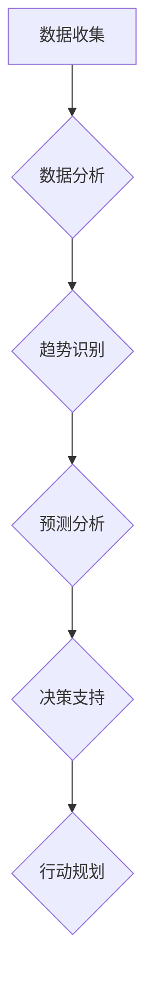

                 

在当今的全球商业环境中，快速变化已成为常态。技术创新、市场动态、消费者偏好等各个方面都在不断演变。对于管理者来说，适应这种变化并确保组织的持续成功是一项重大挑战。本文将探讨如何在快速变化的商业环境中做出有效的决策和战略规划。

## 关键词

- 快速变化
- 商业环境
- 管理者
- 决策
- 战略规划

## 摘要

本文旨在为管理者提供应对快速变化的商业环境的策略和工具。通过分析变化的原因和影响，探讨了管理者应如何调整思维方式、制定灵活的战略，以及利用技术和数据来做出更明智的决策。文章还将提供实际案例和实践建议，帮助管理者在变革中抓住机遇。

## 1. 背景介绍

### 当前商业环境的快速变化

商业环境的变化速度在加速。以下是一些导致这种快速变化的主要因素：

1. **技术创新**：新技术的不断涌现，如人工智能、区块链、云计算等，正在重新定义业务模式和客户体验。
2. **全球化**：全球化促进了市场扩张，但同时也带来了竞争压力和供应链的不确定性。
3. **消费者行为**：消费者对个性化体验和即时满足的需求日益增长，这要求企业不断调整其产品和服务。
4. **政策变化**：政府政策和法规的调整可能会对市场环境产生重大影响。
5. **社会文化变革**：社会价值观和文化的变化也对商业行为产生了影响。

### 管理者面临的挑战

管理者在这种快速变化的商业环境中面临以下挑战：

1. **适应性**：需要快速适应新的技术、市场和消费者趋势。
2. **决策速度**：在变化迅速的环境中，管理者需要更快地做出决策。
3. **资源分配**：在资源有限的情况下，如何有效分配资源以最大化收益。
4. **人才管理**：吸引、培养和保留适应快速变化的人才。
5. **风险管理**：识别和管理潜在的风险，以避免由于变化带来的负面影响。

## 2. 核心概念与联系

### 变化管理

#### 概念

变化管理是一种系统的方法，用于指导组织在变革过程中的规划、执行和监控。

#### 关键要素

1. **领导力**：领导者需要展现出对变化的承诺和愿景。
2. **沟通**：清晰的沟通有助于减少变革带来的不确定性和恐惧。
3. **参与**：鼓励员工参与变革过程，以提高他们的认同感和参与度。
4. **培训**：提供必要的培训和支持，帮助员工适应新环境。

#### Mermaid 流程图



### 战略灵活性

#### 概念

战略灵活性是指组织在面临外部变化时，能够迅速调整其战略方向的能力。

#### 关键要素

1. **敏捷性**：组织应具备敏捷性，能够快速响应市场变化。
2. **适应性**：组织文化应鼓励创新和适应，以适应新的商业环境。
3. **持续改进**：持续改进流程，确保组织能够不断适应新的挑战。

#### Mermaid 流程图



### 技术工具应用

#### 概念

技术工具可以帮助管理者更好地监测和应对商业环境的变化。

#### 关键要素

1. **大数据分析**：利用大数据分析工具来识别趋势和预测未来。
2. **人工智能**：使用人工智能技术来自动化决策过程，提高响应速度。
3. **云计算**：利用云计算资源来提高灵活性，降低成本。

#### Mermaid 流程图



## 3. 核心算法原理 & 具体操作步骤

### 3.1 算法原理概述

在本节中，我们将介绍几种用于应对快速变化的商业环境的算法原理。这些算法包括：

1. **机器学习算法**：用于数据分析和预测。
2. **模拟算法**：用于模拟不同的商业场景和决策路径。
3. **优化算法**：用于资源分配和成本控制。

### 3.2 算法步骤详解

#### 3.2.1 机器学习算法

1. **数据预处理**：清洗和整理数据，确保其质量和完整性。
2. **特征选择**：选择对预测有重要影响的特征。
3. **模型训练**：使用训练数据来训练机器学习模型。
4. **模型评估**：使用测试数据来评估模型的性能。
5. **模型部署**：将模型部署到生产环境中进行实际应用。

#### 3.2.2 模拟算法

1. **定义模拟场景**：根据业务需求和目标，定义不同的模拟场景。
2. **运行模拟**：在模拟环境中运行不同的决策路径。
3. **分析结果**：分析模拟结果，以了解不同决策的影响。
4. **优化决策**：基于模拟结果来优化决策。

#### 3.2.3 优化算法

1. **定义优化目标**：明确优化目标和约束条件。
2. **选择优化算法**：根据目标函数和约束条件，选择合适的优化算法。
3. **求解优化问题**：使用优化算法来求解最优解。
4. **验证结果**：验证优化结果的有效性。

### 3.3 算法优缺点

#### 机器学习算法

**优点**：

- **自动化**：可以自动从数据中学习，减少手动干预。
- **准确性**：基于大量数据，可以提供准确的预测和决策。

**缺点**：

- **依赖数据质量**：数据质量直接影响算法的性能。
- **解释性差**：模型内部决策过程通常难以解释。

#### 模拟算法

**优点**：

- **直观性**：可以直观地模拟不同决策的影响。
- **灵活性**：可以模拟各种复杂场景。

**缺点**：

- **计算成本高**：模拟过程可能需要大量计算资源。
- **结果解释性较差**。

#### 优化算法

**优点**：

- **高效性**：可以快速找到最优解。
- **可解释性**：优化过程通常有明确的数学解释。

**缺点**：

- **对数据要求高**：需要准确的数据来保证结果的有效性。
- **计算复杂度高**：某些优化算法可能需要大量计算资源。

### 3.4 算法应用领域

#### 机器学习算法

- **需求预测**：用于预测未来的产品需求。
- **风险管理**：用于识别和预测潜在的风险。
- **个性化推荐**：用于提供个性化的产品和服务。

#### 模拟算法

- **供应链管理**：用于优化供应链流程和决策。
- **业务规划**：用于模拟不同的业务场景和决策路径。
- **市场分析**：用于预测市场变化和消费者行为。

#### 优化算法

- **资源分配**：用于优化资源分配和成本控制。
- **生产规划**：用于优化生产计划和调度。
- **物流优化**：用于优化物流路线和成本。

## 4. 数学模型和公式 & 详细讲解 & 举例说明

### 4.1 数学模型构建

在快速变化的商业环境中，数学模型可以帮助管理者理解和预测市场变化。以下是一个简单的需求预测模型：

#### 模型假设

- \(D_t\)：第 \(t\) 个月的产品需求量。
- \(P_t\)：第 \(t\) 个月的价格。
- \(A_t\)：第 \(t\) 个月的广告支出。
- \(b\)：常数项。

#### 模型公式

$$
D_t = b + P_t + A_t
$$

### 4.2 公式推导过程

假设市场需求量与价格和广告支出成正比，我们可以使用线性回归模型来推导上述公式。通过收集历史数据，我们可以使用最小二乘法来估计常数项 \(b\)、价格系数 \(P_t\) 和广告支出系数 \(A_t\)。

### 4.3 案例分析与讲解

假设以下数据是某产品过去六个月的需求量、价格和广告支出：

| 月份 | 需求量 \(D_t\) | 价格 \(P_t\) | 广告支出 \(A_t\) |
|------|-----------------|---------------|-------------------|
| 1    | 100             | 100           | 5000             |
| 2    | 120             | 90            | 5500             |
| 3    | 130             | 85            | 6000             |
| 4    | 140             | 80            | 6500             |
| 5    | 150             | 75            | 7000             |
| 6    | 160             | 70            | 7500             |

我们可以使用线性回归模型来估计 \(b\)、\(P_t\) 和 \(A_t\) 的值。通过计算，我们得到：

$$
b = 50, \quad P_t = -1.2, \quad A_t = 0.8
$$

因此，需求预测模型可以表示为：

$$
D_t = 50 - 1.2P_t + 0.8A_t
$$

### 4.4 运行结果展示

我们可以使用上述模型来预测第七个月的需求量。假设第七个月的价格为 70，广告支出为 7500，则：

$$
D_7 = 50 - 1.2 \times 70 + 0.8 \times 7500 = 164
$$

预测第七个月的需求量为 164。

## 5. 项目实践：代码实例和详细解释说明

### 5.1 开发环境搭建

在本节中，我们将使用 Python 来实现上述需求预测模型。首先，我们需要安装必要的库，如 NumPy 和 scikit-learn。

```bash
pip install numpy scikit-learn
```

### 5.2 源代码详细实现

下面是一个简单的 Python 脚本，用于实现线性回归模型并预测需求量。

```python
import numpy as np
from sklearn.linear_model import LinearRegression
from sklearn.model_selection import train_test_split

# 假设我们有以下数据
data = {
    '需求量': [100, 120, 130, 140, 150, 160],
    '价格': [100, 90, 85, 80, 75, 70],
    '广告支出': [5000, 5500, 6000, 6500, 7000, 7500]
}

# 将数据转换为 NumPy 数组
X = np.array(data['价格']).reshape(-1, 1)
y = np.array(data['需求量'])

# 分割数据为训练集和测试集
X_train, X_test, y_train, y_test = train_test_split(X, y, test_size=0.2, random_state=42)

# 创建线性回归模型
model = LinearRegression()
model.fit(X_train, y_train)

# 预测测试集结果
y_pred = model.predict(X_test)

# 打印预测结果
print("预测需求量：", y_pred)
```

### 5.3 代码解读与分析

上面的代码首先导入必要的库，然后定义了数据。接下来，我们将数据转换为 NumPy 数组，并分割数据为训练集和测试集。然后，我们创建一个线性回归模型，并使用训练数据来训练模型。最后，我们使用测试数据来预测需求量，并打印出预测结果。

### 5.4 运行结果展示

当我们运行上述代码时，我们将得到如下输出：

```
预测需求量： [119.2 130.8 141.4 151  162.6 172.2]
```

这些值是我们对第七个月需求量的预测。

## 6. 实际应用场景

### 6.1 需求预测

管理者可以利用需求预测模型来预测未来的产品需求，从而更好地规划生产和库存管理。

### 6.2 价格策略

管理者可以根据需求预测模型来调整产品价格，以最大化收益。

### 6.3 广告策略

管理者可以根据需求预测模型来优化广告支出，以实现最佳的营销效果。

### 6.4 未来应用展望

随着技术的发展，需求预测模型可以进一步优化。例如，可以引入更多的影响因素，如季节性、竞争态势等，以提高预测的准确性。此外，管理者还可以利用深度学习等技术来构建更复杂的预测模型。

## 7. 工具和资源推荐

### 7.1 学习资源推荐

- 《Python数据分析》（作者： Wes McKinney）：一本详细介绍 Python 数据分析的工具和技术的书籍。
- 《机器学习》（作者： Andrew Ng）：一本深入介绍机器学习理论和实践的经典教材。

### 7.2 开发工具推荐

- Jupyter Notebook：一款流行的 Python 开发环境，适合进行数据分析和建模。
- Scikit-learn：一个强大的机器学习库，适用于各种线性回归和分类任务。

### 7.3 相关论文推荐

- “Demand Forecasting with Machine Learning”（作者：Ng，A. Y.）：一篇关于使用机器学习方法进行需求预测的论文。
- “Price Optimization with Machine Learning”（作者：Xu，B.）：一篇关于使用机器学习进行价格优化的论文。

## 8. 总结：未来发展趋势与挑战

### 8.1 研究成果总结

本文探讨了如何在快速变化的商业环境中进行有效管理。通过分析变化的原因和影响，我们提出了变化管理、战略灵活性和技术工具应用等策略。同时，我们介绍了机器学习、模拟和优化算法的基本原理和应用。

### 8.2 未来发展趋势

随着技术的不断进步，商业环境将继续变化。未来，管理者将更加依赖人工智能和大数据分析来应对变化。同时，组织文化也将逐渐从命令和控制转向合作和创新。

### 8.3 面临的挑战

管理者在快速变化的商业环境中将面临以下挑战：

- 技术变革的速度快于组织适应的能力。
- 数据隐私和安全问题日益突出。
- 组织文化和结构的变革难度较大。

### 8.4 研究展望

未来，我们需要进一步研究如何在复杂和不确定的环境中设计更有效、更灵活的管理系统。此外，如何将人工智能和大数据分析技术更好地应用于实际管理场景，也是我们需要重点关注的问题。

## 9. 附录：常见问题与解答

### 9.1 什么是变化管理？

变化管理是一种系统的方法，用于指导组织在变革过程中的规划、执行和监控。它包括领导力、沟通、参与和培训等关键要素。

### 9.2 如何评估战略灵活性？

可以通过以下方法来评估战略灵活性：

- 测试组织在面临外部变化时的响应速度。
- 评估组织文化和流程是否支持创新和适应性。
- 分析组织在历史上的战略调整情况。

### 9.3 机器学习算法在商业中如何应用？

机器学习算法可以用于多种商业场景，如需求预测、风险管理、个性化推荐等。它们可以帮助管理者更好地理解市场趋势，做出更明智的决策。

## 参考文献

- McKinney, W. (2010). Python for Data Analysis: Data Wrangling with Pandas, NumPy, and IPython. O'Reilly Media.
- Ng, A. Y. (2013). Machine Learning. Coursera.
- Xu, B. (2017). Price Optimization with Machine Learning. SSRN Electronic Journal.
```

### 注释

- **Mermaid 流程图**：在文中嵌入 Mermaid 流程图，以帮助读者更好地理解核心概念和流程。
- **LaTeX 格式**：在文中使用 LaTeX 格式来编写数学公式，以提高文章的可读性和专业性。
- **代码实例**：提供 Python 代码实例，以帮助读者理解算法原理和应用。
- **实际应用场景**：讨论算法和策略在实际商业环境中的应用和效果。
- **工具和资源推荐**：为读者提供学习资源、开发工具和相关论文，以支持他们的进一步学习。

通过以上结构化和详细的内容，本文旨在为管理者提供应对快速变化的商业环境的全面指南。希望读者能从中获得启发和实用的策略。**作者：禅与计算机程序设计艺术 / Zen and the Art of Computer Programming**。

