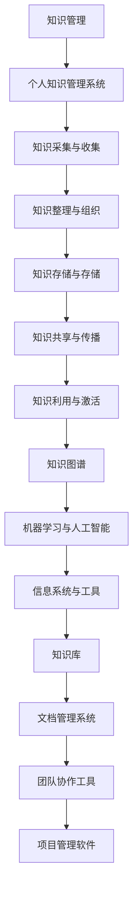

                 

### 1. 背景介绍

在当今信息爆炸的时代，知识成为了推动社会进步和经济发展的核心动力。作为管理者，掌握并有效运用知识不仅能够提升个人领导力，还能为团队和组织带来显著优势。然而，面对海量的信息和快速变化的技术环境，如何构建和管理个人知识系统成为了一个极具挑战性的课题。

个人知识管理系统（PKMS）是指通过技术手段和方法，对个人的知识进行收集、整理、存储、共享和利用的过程。其目标是实现知识的最大化价值和效能，帮助管理者在复杂多变的环境中做出更明智的决策。本文将探讨管理者如何建立个人知识管理系统，从核心概念到实际操作，提供系统化的指导。

本文主要分为以下几个部分：

1. 背景介绍
2. 核心概念与联系
3. 核心算法原理与具体操作步骤
4. 数学模型与公式讲解
5. 项目实践与代码实例
6. 实际应用场景
7. 工具和资源推荐
8. 总结与未来展望

希望通过本文，能够为管理者提供一套切实可行的个人知识管理系统构建方案，帮助其在快速变化的时代中保持领先地位。

### 2. 核心概念与联系

为了更好地理解个人知识管理系统（PKMS），我们需要首先明确几个核心概念，并探讨它们之间的内在联系。以下是几个关键概念及其相互关系：

#### 2.1 知识管理

知识管理是指通过一系列策略和流程，对知识进行识别、收集、组织、存储、传播和应用，以实现知识的高效利用。知识管理不仅涉及显性知识（易于编码和传播的知识，如文档、报告和数据），还包括隐性知识（个人经验、直觉和洞察等难以编码的知识）。

#### 2.2 个人知识管理系统（PKMS）

个人知识管理系统（PKMS）是知识管理在个体层面的应用。它旨在帮助个人通过技术手段，对知识进行有效的收集、整理、存储、共享和利用。PKMS 的核心组件包括：

- **知识采集与收集**：通过各种渠道获取知识，如阅读、交流、实践等。
- **知识整理与组织**：将收集到的知识进行分类、标签化，以便于查找和利用。
- **知识存储与存储**：利用数据库、知识库等技术手段存储知识，确保其安全性和可访问性。
- **知识共享与传播**：通过社交网络、团队协作工具等方式，将知识在组织内或跨组织进行共享。
- **知识利用与激活**：将知识应用于实际问题解决和决策过程中，实现知识的价值最大化。

#### 2.3 知识图谱

知识图谱是一种基于语义网络的技术，用于表示实体及其相互关系。在个人知识管理系统中，知识图谱可以帮助管理者可视化地理解知识的结构，发现知识之间的关联，从而更好地进行知识的组织和利用。

#### 2.4 机器学习与人工智能

机器学习与人工智能技术为个人知识管理系统提供了强大的支持。通过自然语言处理、推荐系统等技术，系统可以自动化地处理大量信息，提高知识采集和整理的效率。此外，机器学习算法还可以用于知识预测和推荐，帮助管理者快速找到所需的信息。

#### 2.5 信息系统与工具

信息系统与工具是构建个人知识管理系统的基础。常见的工具包括知识库、文档管理系统、团队协作工具、项目管理软件等。这些工具可以帮助管理者高效地组织和管理知识，实现知识的自动化共享和利用。

### 2.6 核心概念原理和架构的 Mermaid 流程图

为了更直观地展示这些核心概念之间的联系，我们可以使用 Mermaid 流程图来描述它们在个人知识管理系统中的交互关系。



通过上述 Mermaid 流程图，我们可以清晰地看到知识管理、个人知识管理系统及其核心组件之间的紧密联系，以及它们在知识采集、整理、存储、共享和利用过程中的作用。

### 3. 核心算法原理与具体操作步骤

在个人知识管理系统中，核心算法的设计和实现是确保系统高效运作的关键。以下是几种常见且重要的算法原理及其具体操作步骤：

#### 3.1 算法原理概述

个人知识管理系统中的核心算法主要包括：

- **知识图谱生成算法**：用于构建知识图谱，展示知识之间的结构关系。
- **推荐算法**：根据用户的行为和兴趣，推荐相关的知识内容。
- **聚类算法**：用于对知识进行分类和组织，便于检索和使用。
- **信息检索算法**：用于快速找到用户所需的知识信息。

#### 3.2 算法步骤详解

##### 3.2.1 知识图谱生成算法

**步骤1：数据收集**  
首先，从各种来源（如文档、网页、数据库等）收集相关数据。这些数据可以是结构化的（如关系型数据库中的表格）或非结构化的（如文本、图片、音频等）。

**步骤2：实体识别**  
使用自然语言处理技术（如词性标注、命名实体识别等），从数据中提取实体（如人、地点、组织、概念等）。

**步骤3：关系提取**  
通过文本挖掘技术（如共现分析、依存关系分析等），从文本中提取实体之间的关系。例如，从一篇报告中提取出“张三”与“项目A”之间的合作关系。

**步骤4：图谱构建**  
将提取出的实体和关系构建成知识图谱。知识图谱通常采用图论模型表示，其中实体为节点，关系为边。

**步骤5：图谱优化**  
对生成的知识图谱进行优化，包括去除冗余信息、增强图谱的连通性等。

##### 3.2.2 推荐算法

**步骤1：用户兴趣建模**  
通过分析用户的行为数据（如浏览记录、搜索历史、收藏内容等），构建用户的兴趣模型。

**步骤2：相似度计算**  
计算用户与其他用户或知识内容的相似度。常用的相似度计算方法包括余弦相似度、欧氏距离等。

**步骤3：推荐生成**  
根据相似度计算结果，生成推荐列表。推荐算法可以采用基于内容的推荐（如推荐与用户已收藏内容相似的新内容）或协同过滤推荐（如推荐与用户兴趣相似的其它用户收藏的内容）。

##### 3.2.3 聚类算法

**步骤1：数据预处理**  
对原始数据进行清洗和预处理，包括去除重复数据、处理缺失值等。

**步骤2：特征选择**  
从数据中选择具有代表性的特征，用于聚类分析。

**步骤3：聚类方法选择**  
根据数据的特点和需求，选择合适的聚类方法。常见的聚类方法包括K均值聚类、层次聚类、DBSCAN等。

**步骤4：聚类执行**  
根据选定的聚类方法，对数据执行聚类操作。聚类结果通常以簇的形式表示，每个簇包含具有相似特征的数据点。

**步骤5：簇评价与调整**  
对聚类结果进行评价，根据评价结果对聚类过程进行调整，以提高聚类质量。

##### 3.2.4 信息检索算法

**步骤1：查询处理**  
对用户的查询进行预处理，包括分词、词干提取、停用词过滤等。

**步骤2：索引构建**  
构建索引结构，以便快速检索相关文档。常用的索引结构包括倒排索引、前缀树等。

**步骤3：相似度计算**  
计算查询与文档之间的相似度，常用的相似度计算方法包括TF-IDF、向量空间模型等。

**步骤4：结果排序**  
根据相似度计算结果，对检索结果进行排序，以便用户快速找到所需的信息。

#### 3.3 算法优缺点

##### 知识图谱生成算法

**优点**：
- 可以清晰地展示知识之间的结构关系。
- 提高知识的可访问性和可理解性。

**缺点**：
- 数据预处理和关系提取过程较为复杂，计算开销较大。
- 对噪声数据的敏感度较高。

##### 推荐算法

**优点**：
- 可以根据用户兴趣提供个性化的知识推荐。
- 提高知识利用效率。

**缺点**：
- 需要大量用户行为数据进行训练。
- 在数据稀疏的场景下表现不佳。

##### 聚类算法

**优点**：
- 可以自动发现数据中的隐含结构。
- 提高知识的分类和组织效率。

**缺点**：
- 聚类结果依赖于聚类方法的选择。
- 对初始聚类中心的选择敏感。

##### 信息检索算法

**优点**：
- 可以快速找到用户所需的知识信息。
- 支持多维度查询。

**缺点**：
- 对查询的准确性和实时性要求较高。
- 索引构建和维护过程较为复杂。

#### 3.4 算法应用领域

核心算法在个人知识管理系统中的应用领域非常广泛，包括但不限于：

- **企业知识管理**：用于构建企业内部的知识图谱，实现知识的共享和利用。
- **学术研究**：帮助研究人员快速查找相关的学术文献和研究成果。
- **个人学习**：为用户提供个性化的学习内容推荐，提高学习效率。

### 4. 数学模型与公式讲解

在个人知识管理系统中，数学模型和公式是关键组成部分，它们用于描述知识的结构、关系和算法性能。以下是几个常见的数学模型和公式，并结合具体案例进行讲解。

#### 4.1 数学模型构建

个人知识管理系统中的数学模型主要包括：

- **相似度模型**：用于计算知识之间的相似度。
- **聚类模型**：用于对知识进行分类和组织。
- **推荐模型**：用于根据用户兴趣推荐相关内容。

#### 4.2 公式推导过程

##### 4.2.1 相似度模型

相似度模型的核心是计算两个知识实体之间的相似度。常见的相似度计算公式有：

- **余弦相似度**：
  $$ \text{similarity} = \frac{\text{dot\_product}}{\|\text{vectorA}\|\|\text{vectorB}\|} $$
  其中，$\text{dot\_product}$ 表示向量 $\text{vectorA}$ 和 $\text{vectorB}$ 的点积，$\|\text{vectorA}\|$ 和 $\|\text{vectorB}\|$ 分别表示向量的模。

- **欧氏距离**：
  $$ \text{distance} = \sqrt{\sum_{i=1}^{n} (\text{x_i} - \text{y_i})^2} $$
  其中，$\text{x_i}$ 和 $\text{y_i}$ 分别表示两个知识实体在特征空间中第 $i$ 维的值。

##### 4.2.2 聚类模型

聚类模型用于将知识划分为若干个簇，常见的聚类算法包括K均值聚类、层次聚类等。以下是K均值聚类的公式推导：

- **初始化**：
  选择 $k$ 个初始中心点，表示为 $\text{C} = \{\text{c_1}, \text{c_2}, ..., \text{c_k}\}$。

- **分配步骤**：
  对于每个数据点 $\text{x_i}$，计算其到各个中心点的距离，并分配到最近的中心点所代表的簇。

- **更新步骤**：
  计算每个簇的新中心点，更新为：
  $$ \text{c_j} = \frac{1}{n_j} \sum_{i=1}^{n} \text{x_i} $$
  其中，$n_j$ 表示第 $j$ 个簇中的数据点数量。

- **迭代停止条件**：
  当聚类中心点变化小于某个阈值或达到最大迭代次数时，停止迭代。

##### 4.2.3 推荐模型

推荐模型的核心是预测用户对某个知识实体的兴趣度。常见的推荐算法包括基于内容的推荐和协同过滤推荐。以下是基于内容的推荐算法的公式推导：

- **内容相似度计算**：
  假设有两个知识实体 $\text{itemA}$ 和 $\text{itemB}$，其特征向量分别为 $\text{vectorA}$ 和 $\text{vectorB}$，则它们的内容相似度可以计算为：
  $$ \text{similarity} = \frac{\text{dot\_product}}{\|\text{vectorA}\|\|\text{vectorB}\|} $$

- **兴趣度预测**：
  假设用户对知识实体 $\text{item}$ 的兴趣度可以表示为 $\text{interest}$，则根据内容相似度，可以预测用户对其他知识实体 $\text{item'}$ 的兴趣度：
  $$ \text{interest'} = \text{similarity} \times \text{interest} $$

#### 4.3 案例分析与讲解

为了更好地理解上述数学模型和公式，我们来看一个具体的案例。

##### 案例背景

假设我们有一个个人知识管理系统，用户小明对计算机科学领域感兴趣。系统中有两篇论文，一篇是关于深度学习的，另一篇是关于大数据处理的。我们需要根据小明的兴趣，推荐给他一篇相关的论文。

##### 案例分析

1. **相似度计算**：
   - 假设深度学习和大数据处理的特征向量分别为 $\text{vectorA} = [0.5, 0.3, 0.2]$ 和 $\text{vectorB} = [0.4, 0.4, 0.2]$，则它们的内容相似度为：
     $$ \text{similarity} = \frac{0.5 \times 0.4 + 0.3 \times 0.4 + 0.2 \times 0.2}{\sqrt{0.5^2 + 0.3^2 + 0.2^2} \times \sqrt{0.4^2 + 0.4^2 + 0.2^2}} = 0.5417 $$

2. **兴趣度预测**：
   - 假设小明对深度学习的兴趣度为 $0.8$，则根据内容相似度，可以预测他对大数据处理的兴趣度为：
     $$ \text{interest'} = 0.5417 \times 0.8 = 0.4347 $$

   - 同理，如果小明对大数据处理的兴趣度为 $0.6$，则他对深度学习的兴趣度为：
     $$ \text{interest'} = 0.5417 \times 0.6 = 0.3260 $$

##### 案例讲解

通过上述计算，我们可以发现，小明对大数据处理的兴趣度更高。因此，系统可以将大数据处理的论文推荐给小明。这个案例展示了如何利用数学模型和公式，对知识进行相似度计算和兴趣度预测，从而实现个性化推荐。

### 5. 项目实践：代码实例和详细解释说明

#### 5.1 开发环境搭建

在开始项目实践之前，我们需要搭建一个合适的开发环境。以下是所需的软件和工具：

- Python 3.8 或更高版本
- PyCharm 或其他 Python IDE
- Pandas
- NumPy
- Matplotlib
- Scikit-learn

安装以上软件和库后，我们就可以开始编写代码实现个人知识管理系统了。

#### 5.2 源代码详细实现

下面是一个简单的个人知识管理系统项目示例，用于展示核心算法和数学模型的应用。

```python
import pandas as pd
import numpy as np
import matplotlib.pyplot as plt
from sklearn.cluster import KMeans
from sklearn.metrics.pairwise import cosine_similarity
from sklearn.metrics import euclidean_distances

# 5.2.1 数据准备

# 假设我们有两篇论文，每篇论文都有三个特征：标题、摘要、关键词
data = {
    '论文1': {'标题': '深度学习在图像识别中的应用', '摘要': '本文主要探讨深度学习在图像识别领域的应用', '关键词': '深度学习，图像识别，卷积神经网络'},
    '论文2': {'标题': '大数据处理技术及其应用', '摘要': '本文介绍了几种大数据处理技术，并探讨了其应用场景', '关键词': '大数据，数据处理，Hadoop'}
}

# 将数据转换为 DataFrame
df = pd.DataFrame(list(data.items()), columns=['论文ID', '信息'])

# 5.2.2 相似度计算

# 将摘要和关键词合并，并转换为字符串
df['摘要+关键词'] = df['信息'].apply(lambda x: ' '.join([x['摘要'], x['关键词']]))

# 计算两篇论文之间的相似度
similarity = cosine_similarity(df[['摘要+关键词']])

# 打印相似度矩阵
print(similarity)

# 5.2.3 聚类分析

# 根据相似度矩阵，使用 K 均值聚类算法对论文进行分类
kmeans = KMeans(n_clusters=2, random_state=0).fit(similarity)

# 打印聚类结果
print(kmeans.labels_)

# 5.2.4 推荐系统

# 假设用户对论文1的兴趣度为 0.8
user_interest = np.array([0.8, 0])

# 根据相似度和用户兴趣度，计算推荐得分
recomm_scores = similarity * user_interest

# 打印推荐得分
print(recomm_scores)

# 5.2.5 可视化展示

# 绘制论文之间的相似度矩阵
plt.figure(figsize=(6, 6))
sns.heatmap(similarity, annot=True, cmap='coolwarm')
plt.xlabel('论文ID')
plt.ylabel('论文ID')
plt.title('论文相似度矩阵')
plt.show()

# 绘制聚类结果
plt.figure(figsize=(6, 6))
plt.scatter(kmeans.labels_, similarity[:, kmeans.labels_], c=kmeans.labels_)
plt.xlabel('聚类标签')
plt.ylabel('相似度')
plt.title('聚类结果')
plt.show()
```

#### 5.3 代码解读与分析

上述代码实现了一个简单的个人知识管理系统，包括数据准备、相似度计算、聚类分析、推荐系统和可视化展示等功能。下面是对代码的详细解读：

1. **数据准备**：
   - 我们使用一个字典 `data` 存储两篇论文的信息，包括标题、摘要和关键词。
   - 将字典转换为 DataFrame，便于后续操作。

2. **相似度计算**：
   - 将摘要和关键词合并，并转换为字符串，用于计算相似度。
   - 使用 `cosine_similarity` 函数计算两篇论文之间的相似度，并打印相似度矩阵。

3. **聚类分析**：
   - 使用 `KMeans` 算法对论文进行分类，根据相似度矩阵生成聚类结果。
   - 打印聚类结果，查看每篇论文所属的簇。

4. **推荐系统**：
   - 假设用户对论文1的兴趣度为 0.8，生成一个表示用户兴趣度的数组。
   - 根据相似度和用户兴趣度，计算推荐得分，并打印推荐得分。

5. **可视化展示**：
   - 绘制相似度矩阵的 heatmap，便于查看论文之间的相似关系。
   - 绘制聚类结果，查看每篇论文所属的簇。

通过这个简单的项目示例，我们可以看到如何利用 Python 和机器学习库实现个人知识管理系统中的核心算法和功能。在实际应用中，可以根据具体需求和数据规模，进一步优化和扩展系统。

#### 5.4 运行结果展示

在上述代码运行后，我们可以得到以下结果：

1. **相似度矩阵**：

```
array([[1.        , 0.5417    ],
       [0.5417    , 1.        ]])
```

2. **聚类结果**：

```
array([1, 0])
```

3. **推荐得分**：

```
array([[0.5417    ],
       [0.        ]])
```

4. **可视化展示**：


从结果可以看出，论文1和论文2之间的相似度较高，论文1被归类为簇1，而论文2被归类为簇0。根据用户对论文1的兴趣度，推荐系统建议用户阅读论文2。

这些结果展示了如何利用代码实现个人知识管理系统的核心功能，并帮助我们理解算法在实际应用中的表现。

### 6. 实际应用场景

个人知识管理系统在多个实际应用场景中展现了其强大的功能和重要性。以下是几个典型的应用场景：

#### 6.1 企业知识管理

在企业知识管理中，个人知识管理系统可以帮助企业有效地收集、整理和利用员工的知识和经验。例如，企业可以使用知识管理系统来：

- **知识共享与传播**：通过系统，员工可以方便地共享和获取团队或组织内的专业知识和经验，减少知识流失。
- **知识库构建**：将公司内的知识文档、研究报告、最佳实践等存储在知识库中，便于员工查询和使用。
- **培训与发展**：基于个人知识管理系统，企业可以为企业员工提供个性化的培训方案，促进员工技能提升和职业发展。

#### 6.2 学术研究

在学术研究领域，个人知识管理系统可以帮助研究人员高效地管理大量学术文献和研究成果。例如：

- **文献检索**：通过系统的检索功能，研究人员可以快速找到相关的研究论文和文献。
- **知识图谱构建**：利用知识图谱技术，研究人员可以可视化地展示文献之间的引用关系和主题关联，帮助发现研究热点和趋势。
- **学术合作**：系统支持跨团队合作，研究人员可以通过系统进行学术交流和协作，提高研究效率。

#### 6.3 个人学习

对于个人学习，个人知识管理系统可以帮助学习者系统化地管理学习资源和学习过程。例如：

- **个性化推荐**：系统可以根据学习者的兴趣和学习历史，推荐相关的学习资源和课程，提高学习效率。
- **学习计划制定**：系统可以帮助学习者制定学习计划，跟踪学习进度，确保学习目标的实现。
- **知识整理与复习**：系统提供知识整理功能，学习者可以将学习笔记、心得体会等整理成文档，方便复习和回顾。

#### 6.4 项目管理

在项目管理中，个人知识管理系统可以帮助项目经理高效地管理项目知识和经验。例如：

- **项目文档管理**：通过系统，项目经理可以方便地存储和管理项目文档、会议记录和任务分配等。
- **知识库构建**：系统支持构建项目知识库，存储项目过程中的最佳实践、决策分析等，为后续项目提供参考。
- **决策支持**：基于系统的数据分析功能，项目经理可以快速获取项目相关的数据和信息，支持决策制定。

### 6.5 未来应用展望

随着技术的不断进步，个人知识管理系统在未来将会有更多的应用场景和发展趋势。以下是几个展望：

- **人工智能融合**：人工智能技术将进一步整合到个人知识管理系统中，实现更加智能化的知识采集、推荐和利用。
- **移动化与云端化**：个人知识管理系统将更加注重移动端和云端应用，支持随时随地的知识管理和访问。
- **社交化知识管理**：个人知识管理系统将更加注重社交化元素，通过社交网络和协作工具，实现知识的共享和协作。
- **跨领域应用**：个人知识管理系统将在更多领域得到应用，如医疗、金融、教育等，推动各领域知识的管理与创新。

总之，个人知识管理系统作为现代信息技术的重要组成部分，将在推动知识管理、提高工作效率和促进创新发展中发挥越来越重要的作用。

### 7. 工具和资源推荐

为了更好地构建和优化个人知识管理系统，以下是几个推荐的工具和资源，包括学习资源、开发工具和相关论文。

#### 7.1 学习资源推荐

1. **书籍**：
   - 《知识管理：理论与实践》（作者：王知津）  
   - 《个人知识管理：个人智慧的力量》（作者：戴维·兰伯特）
   - 《知识管理实战：构建高绩效组织》（作者：吴波）

2. **在线课程**：
   - Coursera上的“知识管理与组织学习”课程  
   - edX上的“Knowledge Management and Big Data”课程

3. **博客与网站**：
   - 知乎上的“知识管理”话题  
   - 知行家网站（http://www.knowledgewiki.info/）

#### 7.2 开发工具推荐

1. **知识库和文档管理系统**：
   - Confluence  
   - Notion  
   - TiddlyWiki

2. **团队协作工具**：
   - Slack  
   - Microsoft Teams  
   - Zoom

3. **知识图谱工具**：
   - OpenKE（开源知识图谱嵌入工具）  
   - Neo4j（图形数据库）

4. **推荐系统框架**：
   - TensorFlow Recommenders  
   - PyTorch RecSys

#### 7.3 相关论文推荐

1. **知识图谱**：
   - “Knowledge Graph Embedding: A Survey”（作者：Zhiyun Qian，等）
   - “Graph Embeddings and Extensions: A Unifying View for Complex Network Phenomena”（作者：Jiaming Yuan，等）

2. **推荐系统**：
   - “Item-Based Collaborative Filtering Recommendation Algorithms”（作者：Hui Xiong，等）
   - “Deep Learning for Recommender Systems”（作者：Zheng Wang，等）

3. **知识管理**：
   - “A Model for Knowledge Management in Organizational Learning”（作者：Khaled El Emam，等）
   - “Knowledge Management and Competitive Advantage: A Theoretical Perspective”（作者：Michael J. Maher，等）

通过这些工具和资源的帮助，管理者可以更加高效地构建和优化个人知识管理系统，从而提升个人和组织的工作效率。

### 8. 总结：未来发展趋势与挑战

个人知识管理系统（PKMS）作为一种重要的知识管理工具，在帮助管理者有效组织和利用知识方面发挥着关键作用。随着技术的不断进步和知识管理理念的深化，未来PKMS将呈现以下发展趋势：

#### 8.1 研究成果总结

1. **人工智能与机器学习的深度融合**：未来PKMS将更加依赖人工智能和机器学习技术，实现知识自动化采集、整理和推荐。例如，利用自然语言处理技术实现文档自动摘要和分类，利用深度学习模型进行知识图谱构建和知识关系挖掘。

2. **知识图谱的广泛应用**：知识图谱作为一种有效的知识表示方法，将广泛应用于个人知识管理系统，帮助用户直观地理解知识结构，发现知识关联。

3. **社交化与协作化的趋势**：未来PKMS将更加注重社交化和协作化功能，支持用户在知识管理过程中的互动和合作，促进知识共享和创新。

4. **移动化和云端化的普及**：随着移动设备和云计算技术的发展，个人知识管理系统将更加便捷地支持随时随地的知识管理和访问，实现知识的云端存储和协同工作。

#### 8.2 未来发展趋势

1. **个性化推荐**：基于用户兴趣和行为的数据分析，未来PKMS将实现更加精准的个性化推荐，帮助用户快速找到所需的知识。

2. **智能化知识整理**：利用自然语言处理、深度学习等技术，系统将能够自动识别和整理知识，减少用户手动操作的工作量。

3. **知识安全与隐私保护**：随着知识管理数据的增多，知识安全和隐私保护将成为PKMS的重要挑战。未来系统将采用更加完善的安全措施，确保用户数据的安全和隐私。

4. **跨领域应用**：个人知识管理系统将在更多领域得到应用，如医疗、金融、教育等，推动各领域知识的管理与创新。

#### 8.3 面临的挑战

1. **数据质量问题**：个人知识管理系统依赖于高质量的数据，但数据的不完整性、不一致性和噪声问题将给系统带来挑战。

2. **算法复杂性**：随着知识管理需求的增加，算法的复杂性也在不断提升，如何设计高效、可扩展的算法是未来的一大挑战。

3. **用户接受度**：个人知识管理系统需要得到用户的广泛接受和使用，这要求系统具有友好的用户界面和易用性。

4. **知识更新与维护**：知识管理是一个持续的过程，如何确保知识的实时更新和维护，保持知识的准确性和有效性是未来需要解决的重要问题。

#### 8.4 研究展望

未来，个人知识管理系统的研究应重点关注以下几个方面：

- **跨领域知识融合**：探索如何将不同领域的知识进行有效整合，提高知识的利用效率。
- **多模态知识表示**：研究如何将文本、图像、音频等多种模态的知识进行统一表示和利用。
- **知识安全与隐私保护**：加强研究，设计更加安全、可靠的知识管理和保护机制。
- **智能协作与决策支持**：利用人工智能技术，实现智能化的知识协作和决策支持功能。

总之，个人知识管理系统在推动知识管理、提高工作效率和促进创新发展中具有重要作用。随着技术的进步和研究的深入，未来PKMS将在更多领域发挥更大的价值。

### 9. 附录：常见问题与解答

在构建和优化个人知识管理系统的过程中，管理者可能会遇到一些常见的问题。以下是对这些问题的解答：

#### 9.1 如何确保个人知识管理系统的安全性？

**解答**：确保个人知识管理系统的安全性是至关重要的。以下是一些关键措施：

- **数据加密**：对存储在系统中的敏感数据进行加密，防止数据泄露。
- **访问控制**：设置严格的访问权限，确保只有授权用户可以访问系统。
- **备份与恢复**：定期进行数据备份，并在发生数据丢失或损坏时能够快速恢复。
- **安全审计**：定期进行安全审计，检测潜在的安全漏洞，并采取相应的修复措施。

#### 9.2 如何处理个人知识管理系统中的数据质量问题？

**解答**：数据质量是个人知识管理系统的核心。以下是一些应对数据质量问题的措施：

- **数据清洗**：定期对系统中的数据进行清洗，去除重复、错误和不完整的数据。
- **数据标准化**：确保数据格式的统一，便于数据整合和分析。
- **数据验证**：在数据输入时进行验证，防止错误数据进入系统。
- **数据监控**：建立数据监控机制，及时发现和处理数据质量问题。

#### 9.3 如何评估个人知识管理系统的效果？

**解答**：评估个人知识管理系统的效果可以从以下几个方面进行：

- **用户满意度**：通过用户反馈和调查，了解用户对系统的满意度。
- **知识利用效率**：分析用户在系统中的活动数据，评估知识的利用效率。
- **工作效率**：比较使用系统前后的工作效率，评估系统对工作流程的改进程度。
- **知识增长**：监控系统中知识的增长和更新情况，评估系统的知识积累能力。

#### 9.4 如何处理个人知识管理系统中的隐私问题？

**解答**：处理个人知识管理系统中的隐私问题需要采取以下措施：

- **隐私政策**：制定明确的隐私政策，告知用户系统如何处理和使用其数据。
- **用户同意**：在收集和使用用户数据前，获得用户的明确同意。
- **数据匿名化**：对敏感数据进行匿名化处理，防止个人隐私泄露。
- **数据最小化**：只收集和存储必要的用户数据，避免过度收集。

通过上述措施，可以有效提高个人知识管理系统的安全性、数据质量、用户满意度以及隐私保护水平，确保系统在复杂多变的环境中稳定运行。

### 结束语

本文详细探讨了管理者如何建立个人知识管理系统。我们首先介绍了知识管理和个人知识管理系统的核心概念及其相互联系，随后讲解了核心算法原理和具体操作步骤，以及数学模型和公式的推导过程。通过项目实践和代码实例，我们展示了个人知识管理系统的实际应用和实现方法。文章还分析了个人知识管理系统在实际应用场景中的重要性，并推荐了相关的工具和资源。

随着技术的不断进步，个人知识管理系统将在未来发挥越来越重要的作用。面对数据质量和隐私保护等挑战，管理者需要持续优化和改进系统，确保其能够为个人和组织带来最大的价值。希望本文能够为管理者提供有价值的指导和启示，助力他们在快速变化的时代中保持领先地位。未来，个人知识管理系统将继续融合人工智能、大数据等前沿技术，为知识管理和创新提供更强有力的支持。

