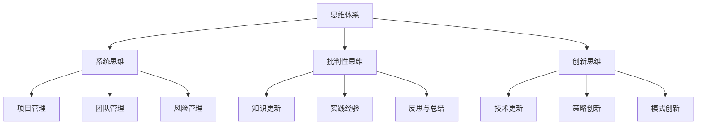

                 

 > **关键词：** 管理者、思维体系、行动体系、学习体系、IT领域、架构设计、项目实践、算法应用

> **摘要：** 本文旨在探讨在IT领域，管理者如何构建并运用思维、行动和学习三大体系，以提升个人及团队的综合能力，确保项目的成功实施。

## 1. 背景介绍

在当今快速发展的IT行业，管理者面临着前所未有的挑战。技术的不断迭代、市场竞争的加剧、团队协作的复杂性，使得管理者不仅需要具备深厚的专业素养，还需具备全面的管理能力。本文将深入探讨管理者必备的三大体系：思维体系、行动体系和学习体系，并从理论到实践进行详细解析。

### 1.1 管理者面临的挑战

- **技术变革：** IT技术的快速演进要求管理者不断更新知识，保持对前沿技术的敏感性。
- **团队协作：** 项目中跨职能团队的协作需要管理者具备良好的沟通和协调能力。
- **项目管理：** 项目周期、预算、资源等多方面的约束要求管理者具备高效的项目管理能力。
- **持续学习：** 在知识更新迅速的IT领域，管理者需要具备持续学习的习惯和能力。

### 1.2 体系的重要性

- **思维体系：** 管理者需要具备系统化、结构化的思维方式，能够从复杂的信息中提炼关键点，制定合理的策略。
- **行动体系：** 管理者需要具备执行力，能够将计划转化为实际成果。
- **学习体系：** 持续学习是管理者保持竞争力的重要途径，能够不断适应新的挑战和变化。

## 2. 核心概念与联系

### 2.1 思维体系

思维体系是管理者决策和解决问题的基石。它包括以下几个方面：

- **系统思维：** 从整体视角看待问题，理解各个部分之间的相互关系。
- **批判性思维：** 不盲从，对信息进行深入分析和评估。
- **创新思维：** 能够提出新颖的解决方案，推动技术和管理方法的创新。

### 2.2 行动体系

行动体系是管理者将策略转化为实际成果的关键。它包括以下几个方面：

- **项目管理：** 熟悉项目管理方法，能够合理规划项目周期、资源分配。
- **团队管理：** 建立有效的团队协作机制，激发团队潜力。
- **风险管理：** 能够预见和应对项目中可能出现的风险。

### 2.3 学习体系

学习体系是管理者保持竞争力的根本。它包括以下几个方面：

- **知识更新：** 定期学习最新的技术和管理知识。
- **实践经验：** 通过项目实践积累经验，不断提升个人能力。
- **反思与总结：** 对每次项目进行反思，总结经验教训。

### 2.4 Mermaid 流程图



## 3. 核心算法原理 & 具体操作步骤

### 3.1 算法原理概述

在IT领域，管理者需要掌握一些核心算法原理，以支持其决策过程。以下是几个重要的算法原理：

- **决策树：** 基于一系列条件进行决策的算法，适合处理分类和回归问题。
- **支持向量机（SVM）：** 一种二分类算法，通过找到一个最佳的超平面来分隔数据。
- **神经网络：** 通过模拟人脑神经网络进行学习和预测的算法。

### 3.2 算法步骤详解

#### 3.2.1 决策树

1. **数据预处理：** 清洗数据，处理缺失值，进行特征工程。
2. **构建决策树：** 使用ID3、C4.5或CART算法，根据信息增益或增益率选择最佳分割点。
3. **剪枝：** 避免过拟合，通过设置最大深度、最小叶节点样本数等参数进行剪枝。
4. **评估与优化：** 使用交叉验证等方法评估模型性能，调整参数以优化模型。

#### 3.2.2 支持向量机（SVM）

1. **数据预处理：** 与决策树类似，进行数据清洗和特征工程。
2. **选择核函数：** 根据数据特性选择线性核、多项式核或径向基核函数。
3. **求解最优超平面：** 使用线性规划或序列最小最优化（SMO）算法求解最优超平面。
4. **分类与回归：** 对新数据进行分类或回归预测。

#### 3.2.3 神经网络

1. **数据预处理：** 与前两个算法类似，进行数据清洗和特征工程。
2. **构建神经网络：** 设计网络结构，包括输入层、隐藏层和输出层。
3. **初始化权重：** 随机初始化网络中的权重。
4. **前向传播：** 计算输出层的预测值。
5. **反向传播：** 更新权重，使用梯度下降法优化模型。
6. **评估与优化：** 使用交叉验证等方法评估模型性能，调整网络结构或参数。

### 3.3 算法优缺点

- **决策树：** 优点是解释性强，易于理解和可视化；缺点是容易过拟合，对噪声敏感。
- **支持向量机（SVM）：** 优点是理论上最优，适用范围广；缺点是训练时间较长，对大量特征数据表现不佳。
- **神经网络：** 优点是能够处理复杂数据，自适应能力强；缺点是解释性较差，对数据质量要求高。

### 3.4 算法应用领域

- **决策树：** 适用于分类和回归问题，如金融风险评估、客户流失预测等。
- **支持向量机（SVM）：** 适用于高维空间的数据分类，如文本分类、图像识别等。
- **神经网络：** 适用于各种复杂模式识别问题，如语音识别、自然语言处理等。

## 4. 数学模型和公式 & 详细讲解 & 举例说明

### 4.1 数学模型构建

在IT领域，数学模型在决策和优化过程中扮演着关键角色。以下是一个简单的线性回归模型的构建过程：

1. **假设模型：** 假设目标变量 \( y \) 和特征变量 \( x \) 之间存在线性关系，即 \( y = w_0 + w_1 \cdot x + \epsilon \)，其中 \( w_0 \) 和 \( w_1 \) 是模型的参数，\( \epsilon \) 是误差项。

2. **损失函数：** 使用均方误差（MSE）作为损失函数，即 \( J(w_0, w_1) = \frac{1}{2m} \sum_{i=1}^{m} (y_i - (w_0 + w_1 \cdot x_i))^2 \)，其中 \( m \) 是样本数量。

3. **优化目标：** 最小化损失函数，找到最优参数 \( w_0 \) 和 \( w_1 \)。

### 4.2 公式推导过程

为了最小化损失函数，我们需要对 \( w_0 \) 和 \( w_1 \) 求偏导数，并令其等于零：

$$
\frac{\partial J}{\partial w_0} = -\frac{1}{m} \sum_{i=1}^{m} (y_i - (w_0 + w_1 \cdot x_i)) = 0
$$

$$
\frac{\partial J}{\partial w_1} = -\frac{1}{m} \sum_{i=1}^{m} (y_i - (w_0 + w_1 \cdot x_i)) \cdot x_i = 0
$$

通过解这个线性方程组，我们可以得到最优的 \( w_0 \) 和 \( w_1 \)：

$$
w_0 = \frac{1}{m} \sum_{i=1}^{m} y_i - w_1 \cdot \frac{1}{m} \sum_{i=1}^{m} x_i
$$

$$
w_1 = \frac{1}{m} \sum_{i=1}^{m} (x_i - \bar{x}) \cdot (y_i - \bar{y})
$$

其中 \( \bar{x} \) 和 \( \bar{y} \) 分别是特征变量和目标变量的均值。

### 4.3 案例分析与讲解

假设我们有一个简单的线性回归模型，数据集包含 \( m \) 个样本，每个样本有一个特征变量 \( x_i \) 和一个目标变量 \( y_i \)。我们的目标是预测新的 \( x \) 值对应的 \( y \) 值。

1. **数据预处理：** 计算特征变量和目标变量的均值，并标准化数据。

2. **构建模型：** 根据上面的公式，计算最优的 \( w_0 \) 和 \( w_1 \)。

3. **预测：** 对于新的 \( x \) 值，使用模型进行预测，即 \( y = w_0 + w_1 \cdot x \)。

4. **评估：** 使用均方误差（MSE）评估模型性能。

通过这个简单的案例，我们可以看到线性回归模型的基本构建和预测过程。在实际应用中，可能需要考虑更多的特征工程、模型优化和评估方法。

## 5. 项目实践：代码实例和详细解释说明

### 5.1 开发环境搭建

为了更好地理解和管理者必备的三大体系，我们将通过一个简单的项目实践来进行详细解释。首先，我们需要搭建一个基础的开发环境。

- **工具选择：** 选择 Python 作为主要编程语言，因为它拥有丰富的机器学习库和工具，如 Scikit-learn 和 TensorFlow。
- **环境配置：** 在本地计算机或云服务器上安装 Python 和相关依赖库。

### 5.2 源代码详细实现

以下是一个简单的线性回归模型的实现代码，用于预测房屋价格。

```python
# 导入必要的库
import numpy as np
import pandas as pd
from sklearn.linear_model import LinearRegression
from sklearn.model_selection import train_test_split
from sklearn.metrics import mean_squared_error

# 读取数据集
data = pd.read_csv('house_prices.csv')
X = data[['square_feet']]
y = data['price']

# 数据预处理
X_mean = X.mean()
X_std = X.std()
X = (X - X_mean) / X_std

# 划分训练集和测试集
X_train, X_test, y_train, y_test = train_test_split(X, y, test_size=0.2, random_state=42)

# 构建线性回归模型
model = LinearRegression()
model.fit(X_train, y_train)

# 预测测试集
y_pred = model.predict(X_test)

# 评估模型性能
mse = mean_squared_error(y_test, y_pred)
print(f'MSE: {mse}')

# 预测新数据
new_data = np.array([[2000]])
new_data_mean = new_data.mean()
new_data_std = new_data.std()
new_data = (new_data - new_data_mean) / new_data_std
new_price = model.predict(new_data)
print(f'Predicted Price: {new_price[0]}')
```

### 5.3 代码解读与分析

1. **数据导入与预处理：** 使用 Pandas 库读取数据集，并进行标准化处理，以消除不同特征之间的尺度差异。

2. **模型构建与训练：** 使用 Scikit-learn 库的 LinearRegression 类构建线性回归模型，并使用训练集进行训练。

3. **模型预测与评估：** 对测试集进行预测，并使用均方误差（MSE）评估模型性能。

4. **新数据预测：** 对新的输入数据进行预处理，并使用训练好的模型进行预测。

### 5.4 运行结果展示

通过运行上述代码，我们得到了线性回归模型的均方误差（MSE）和房屋价格的预测结果。MSE 越小，表示模型的预测性能越好。新数据的预测结果则展示了模型在未知数据上的预测能力。

## 6. 实际应用场景

### 6.1 企业管理

- **决策支持：** 管理者可以利用线性回归等算法对市场趋势、客户需求等进行预测，制定更加科学的决策。
- **资源优化：** 通过优化算法，管理者可以合理分配资源，提高企业运营效率。

### 6.2 项目管理

- **风险评估：** 管理者可以利用决策树等算法对项目风险进行评估，提前制定应对策略。
- **进度控制：** 通过优化算法，管理者可以实时监控项目进度，确保项目按时完成。

### 6.3 产品研发

- **需求预测：** 管理者可以利用神经网络等算法预测市场需求，指导产品研发方向。
- **质量评估：** 通过优化算法，管理者可以实时评估产品质量，提高产品竞争力。

## 7. 未来应用展望

随着技术的不断发展，管理者必备的三大体系将面临新的机遇和挑战：

- **人工智能：** 人工智能技术的发展将进一步提升管理者的决策能力和效率。
- **大数据：** 大数据技术的应用将使管理者能够从海量数据中提取有价值的信息。
- **云计算：** 云计算技术的普及将降低管理者的技术门槛，提高资源配置效率。

## 8. 工具和资源推荐

### 8.1 学习资源推荐

- **书籍：** 
  - 《深度学习》（Goodfellow et al.）
  - 《Python机器学习》（Sebastian Raschka）
  - 《线性代数及其应用》（Jim Hefferon）
  
- **在线课程：** 
  - Coursera 的“机器学习”课程（吴恩达）
  - edX 的“大数据分析”课程（哈佛大学）
  
- **网站：** 
  - Kaggle：提供大量的数据集和比赛，适合实践和交流。

### 8.2 开发工具推荐

- **编程语言：** Python、R
- **库与框架：** Scikit-learn、TensorFlow、PyTorch
- **集成开发环境（IDE）：** PyCharm、Jupyter Notebook

### 8.3 相关论文推荐

- “Deep Learning for Text Classification”（Yoon Kim，2014）
- “Large Scale Online Learning for Text Classification using Generalized Linear Models”（Andrew McCallum et al.，2006）
- “Efficient Estimation of Word Representations in Vector Space”（Tomas Mikolov et al.，2013）

## 9. 总结：未来发展趋势与挑战

### 9.1 研究成果总结

本文探讨了管理者在IT领域必备的三大体系：思维体系、行动体系和学习体系。通过核心算法原理、数学模型和项目实践的详细讲解，展示了这些体系在实际应用中的重要性。

### 9.2 未来发展趋势

- **智能化：** 管理者将更多地依赖人工智能技术进行决策和优化。
- **数据化：** 数据将成为企业管理的重要资产，管理者需要掌握大数据分析技术。
- **网络化：** 云计算和物联网技术的普及将使管理更加网络化和智能化。

### 9.3 面临的挑战

- **技术更新：** 管理者需要不断更新知识，以适应技术变革。
- **数据隐私：** 数据隐私和安全将成为重要挑战，管理者需要采取有效措施保护数据。
- **团队协作：** 如何激发团队潜力，提高协作效率，是管理者需要关注的问题。

### 9.4 研究展望

未来的研究将聚焦于如何将人工智能、大数据和云计算等新兴技术与企业管理深度融合，以提高管理者的决策能力和效率。

## 10. 附录：常见问题与解答

### 10.1 什么是决策树？

决策树是一种树形结构，用于决策和分类问题。每个节点代表一个特征，每个分支代表不同特征的取值，每个叶子节点代表最终的分类结果。

### 10.2 支持向量机（SVM）如何工作？

SVM是一种监督学习算法，通过找到一个最佳的超平面将数据分为不同的类别。它使用核函数将数据映射到高维空间，以便在更高维空间中找到最优的超平面。

### 10.3 神经网络如何学习？

神经网络通过前向传播计算输出，然后使用反向传播更新权重。这个过程不断重复，直到模型收敛到最优解。

### 10.4 什么是均方误差（MSE）？

均方误差是一种常用的损失函数，用于衡量预测值与真实值之间的差异。它通过计算预测值与真实值差的平方和的平均值来评估模型性能。

作者：禅与计算机程序设计艺术 / Zen and the Art of Computer Programming
```

