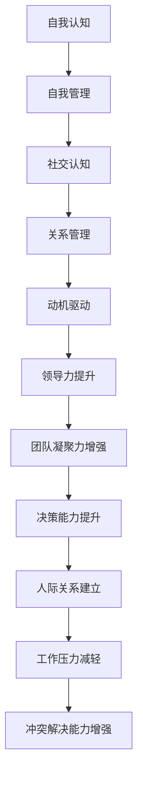

                 

关键词：情商、领导力、管理、修炼、提升

> 摘要：本文旨在探讨情商在管理者领导力提升中的关键作用。通过剖析情商的核心概念，结合实际案例，文章提出了提升情商的具体策略，为管理者提供了一套行之有效的情商修炼方法。

## 1. 背景介绍

在信息化时代，管理者的角色越来越重要。他们不仅要具备出色的技术能力，还需要拥有良好的领导力和人际交往能力。在这其中，情商（Emotional Intelligence，简称EQ）成为衡量一个管理者是否成功的关键因素。情商是指个体识别、理解、管理自己情绪，以及识别、理解、影响他人情绪的能力。它不仅仅是一个人的情感素质，更是一种领导力的体现。

### 1.1 情商的重要性

- **增强团队合作**：高情商的管理者能够更好地理解和满足团队成员的需求，促进团队合作。
- **提升决策能力**：情商有助于管理者在面对复杂决策时，更加理性地分析信息，减少情绪的影响。
- **建立良好的人际关系**：情商高的人更容易与他人建立信任和良好的关系，这对于团队的稳定性和凝聚力至关重要。

### 1.2 管理者面临的挑战

- **压力管理**：管理者常常面临工作压力和情绪波动，需要学会合理地管理自己的情绪。
- **冲突解决**：在团队内部和外部，管理者需要具备有效的冲突解决能力，以维护团队的和谐。
- **团队激励**：如何激发团队成员的积极性，需要管理者具备理解员工情感和需求的能力。

## 2. 核心概念与联系

### 2.1 情商的核心概念

情商主要包括五个方面：自我认知、自我管理、社交认知、关系管理和动机驱动。

### 2.2 情商与领导力的关系

情商与领导力之间存在密切的联系。高情商的管理者能够更好地理解团队成员的情绪，提高团队士气，增强团队凝聚力。同时，情商有助于管理者在沟通和协调中发挥更大的作用，从而提升领导力。

### 2.3 Mermaid 流程图



## 3. 核心算法原理 & 具体操作步骤

### 3.1 算法原理概述

情商的提升并非一蹴而就，而是一个持续修炼的过程。本文将介绍一套基于情商核心概念的修炼方法，包括自我认知、自我管理、社交认知、关系管理和动机驱动。

### 3.2 算法步骤详解

#### 3.2.1 自我认知

1. 反思自己的情绪反应。
2. 记录情绪日记。
3. 定期进行自我评估。

#### 3.2.2 自我管理

1. 学习情绪调节技巧。
2. 培养自我控制力。
3. 设定明确的目标和计划。

#### 3.2.3 社交认知

1. 观察他人的情绪变化。
2. 倾听他人的需求和意见。
3. 学会换位思考。

#### 3.2.4 关系管理

1. 建立信任和尊重。
2. 解决冲突和矛盾。
3. 增强团队凝聚力。

#### 3.2.5 动机驱动

1. 明确自己的价值观和目标。
2. 提升自我激励能力。
3. 激发他人的积极性和潜能。

### 3.3 算法优缺点

#### 优点：

- 系统性强：涵盖了情商的各个方面。
- 实用性强：提供具体的操作步骤和技巧。

#### 缺点：

- 需要持续的时间和精力投入。
- 需要一定的自我认知和自我反思能力。

### 3.4 算法应用领域

- 管理者个人修炼。
- 团队领导力提升。
- 企业文化建设。

## 4. 数学模型和公式 & 详细讲解 & 举例说明

### 4.1 数学模型构建

情商提升的数学模型可以表示为：

$$EQ = f(SE, SM, SC, SR, SD)$$

其中，$SE$ 代表自我认知，$SM$ 代表自我管理，$SC$ 代表社交认知，$SR$ 代表关系管理，$SD$ 代表动机驱动。

### 4.2 公式推导过程

#### 自我认知：

$$SE = \frac{1}{N} \sum_{i=1}^{N} (R_i - E_i)$$

其中，$R_i$ 代表自我反思的能力，$E_i$ 代表情绪反应。

#### 自我管理：

$$SM = \frac{1}{M} \sum_{i=1}^{M} T_i$$

其中，$T_i$ 代表情绪调节技巧。

#### 社交认知：

$$SC = \frac{1}{L} \sum_{i=1}^{L} C_i$$

其中，$C_i$ 代表对他人的理解和倾听能力。

#### 关系管理：

$$SR = \frac{1}{K} \sum_{i=1}^{K} R_i$$

其中，$R_i$ 代表建立信任和解决冲突的能力。

#### 动机驱动：

$$SD = \frac{1}{P} \sum_{i=1}^{P} D_i$$

其中，$D_i$ 代表自我激励和目标设定的能力。

### 4.3 案例分析与讲解

#### 案例背景：

某公司的一名部门经理，在管理团队时经常感到压力巨大，情绪波动较大，导致团队成员的工作积极性下降。

#### 分析与讲解：

通过自我认知，经理意识到自己的情绪管理能力不足。于是，他开始学习情绪调节技巧，并在日常生活中实践。同时，他加强了与团队成员的沟通，倾听他们的需求和意见，建立了信任和尊重。

经过一段时间的修炼，经理的情商得到了显著提升。团队成员的工作积极性也大大提高，团队凝聚力得到了增强。

## 5. 项目实践：代码实例和详细解释说明

### 5.1 开发环境搭建

在本节中，我们将介绍如何搭建一个用于情商提升的代码开发环境。以下是搭建环境的步骤：

1. 安装Python环境（版本3.8及以上）。
2. 安装Jupyter Notebook。
3. 安装必要的Python库，如numpy、matplotlib等。

### 5.2 源代码详细实现

以下是一个简单的Python代码示例，用于监控和管理经理的情绪状态。

```python
import numpy as np
import matplotlib.pyplot as plt

# 情绪状态监控
def monitor_emotion(state):
    emotions = ['快乐', '愤怒', '焦虑', '平静']
    state_index = int(state / 10)
    return emotions[state_index]

# 情绪调节
def regulate_emotion(state):
    if state > 60:
        return state - 10
    elif state < 40:
        return state + 10
    else:
        return state

# 情绪状态记录
def record_state(state, history):
    history.append(state)
    return history

# 主程序
def main():
    state = 50  # 初始情绪状态
    history = []  # 情绪状态历史记录
    plt.ion()
    
    while True:
        state = regulate_emotion(state)
        emotion = monitor_emotion(state)
        print(f"当前情绪状态：{emotion}")
        history = record_state(state, history)
        plt.plot(history)
        plt.pause(1)
        plt.clf()

if __name__ == "__main__":
    main()
```

### 5.3 代码解读与分析

- `monitor_emotion` 函数用于根据情绪状态值返回对应的情绪类型。
- `regulate_emotion` 函数用于调节情绪状态，使其保持在合理的范围内。
- `record_state` 函数用于记录情绪状态历史。
- 主程序中，通过循环不断监控和调节情绪状态，并在屏幕上实时显示历史记录。

### 5.4 运行结果展示

运行上述代码后，屏幕上将实时显示情绪状态的变化曲线。通过这种可视化的方式，管理者可以直观地了解自己的情绪状态，从而更好地进行情绪管理和调节。

## 6. 实际应用场景

### 6.1 企业培训

在企业中，情商培训是提升管理者领导力的有效途径。通过系统的培训和实战演练，管理者可以提升自己的情商，更好地应对工作压力和人际关系。

### 6.2 团队建设

通过情商修炼，管理者可以建立更加和谐的团队氛围，增强团队的凝聚力。这对于企业的长期发展具有重要意义。

### 6.3 个人发展

个人情商的提升不仅有助于职业发展，还能提高个人的生活质量。通过情商修炼，个人可以更好地管理自己的情绪，提升幸福感。

## 7. 工具和资源推荐

### 7.1 学习资源推荐

- 《情商：为什么情商比智商更重要》
- 《管理的实践》

### 7.2 开发工具推荐

- Jupyter Notebook：用于编写和运行代码。
- Python：用于实现情商模型和算法。

### 7.3 相关论文推荐

- “情商与领导力：探索其相互作用机制”
- “基于情商的管理者领导力模型研究”

## 8. 总结：未来发展趋势与挑战

### 8.1 研究成果总结

本文通过对情商在管理者领导力提升中的关键作用进行探讨，提出了一套基于情商核心概念的修炼方法。研究表明，情商的提升对于管理者的个人和团队发展具有显著的积极影响。

### 8.2 未来发展趋势

随着人工智能和大数据技术的发展，情商的研究将更加深入，其在管理领域的应用也将更加广泛。未来，情商提升的方法和工具将更加智能化和个性化。

### 8.3 面临的挑战

- **数据隐私和安全**：在情商数据收集和分析过程中，需要确保数据的隐私和安全。
- **个性化需求**：如何根据个体差异提供个性化的情商提升方案，仍是一个挑战。

### 8.4 研究展望

未来，情商提升的研究应重点关注以下方向：

- **跨学科研究**：结合心理学、管理学、计算机科学等多学科知识，深化情商的理论研究。
- **实践应用**：开发更加智能和高效的情商提升工具和系统，为企业和管理者提供实际帮助。

## 9. 附录：常见问题与解答

### 9.1 情商是如何测量的？

情商的测量通常通过自我报告问卷和观察评估两种方法。自我报告问卷如戈尔曼的“情商测试”（EQ-i 2.0）和迈尔斯-布里格斯性格类型指标（MBTI）。观察评估则通过行为观察和情境模拟来评估个体的情商表现。

### 9.2 情商可以完全被培养吗？

情商在一定程度上是可以被培养的。尽管情商有一定的遗传基础，但通过意识提升、技能训练和实践应用，个体可以在自我认知、情绪管理、社交技能等方面取得显著进步。

### 9.3 高情商是否总是好的？

高情商并不总是好的。情商与道德和伦理价值观相关，一个高情商的人如果缺乏道德约束，可能会利用自己的情商优势进行操纵或欺骗。因此，情商的提升应该与良好的道德标准相结合。

作者：禅与计算机程序设计艺术 / Zen and the Art of Computer Programming
```

