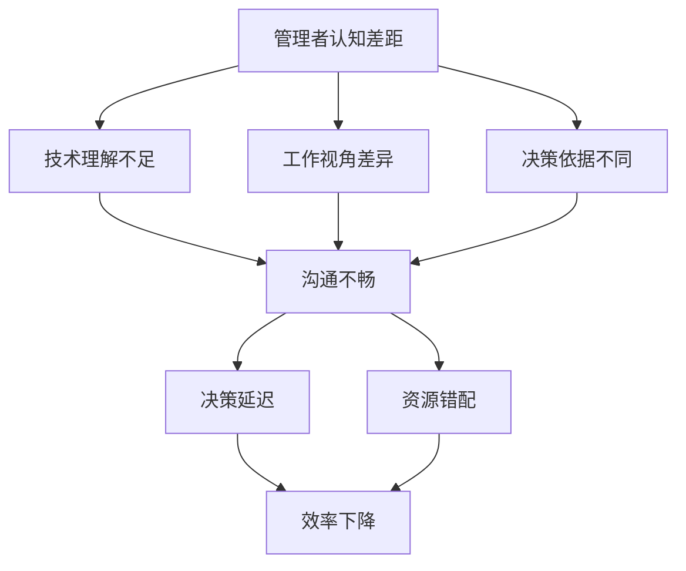

                 

关键词：管理认知差距、技术理解、组织效率、领导力、沟通、跨部门协作

> 摘要：本文深入探讨了管理者的认知差距的来源，分析了技术理解对于管理者的重要性，以及如何通过提升技术素养和改进沟通策略来缩小认知差距，提高组织效率。文章结合具体案例，提出了未来在管理领域中面临的挑战和解决策略。

## 1. 背景介绍

在信息技术飞速发展的今天，企业的运营模式和管理方式也在不断进化。一个显著的变化是，技术已经深入到组织的各个层面，成为推动业务创新和提升竞争力的关键因素。然而，与此同时，管理者与技术人员之间的认知差距问题也逐渐显现出来。

### 管理者与技术人员的认知差距

管理者和技术人员在认知上的差距主要表现在以下几个方面：

1. **技术理解深度**：技术人员往往对技术细节有更深入的理解，而管理者可能更关注宏观的战略和业务目标。
2. **工作视角**：技术人员更关注技术的实现和优化，而管理者则需要平衡多个部门和业务目标，具有更广泛的管理视角。
3. **决策依据**：技术人员的决策通常基于技术原理和数据，而管理者的决策则更多地考虑业务影响和人力资源。

### 认知差距的影响

认知差距对组织的效率和创新能力有重要影响。如果管理者和技术人员之间的认知差距过大，可能会导致以下问题：

1. **沟通不畅**：管理者和技术人员之间的沟通效率降低，影响项目的顺利进行。
2. **决策延迟**：由于对技术细节的理解不足，管理者在决策时可能需要依赖技术人员的反馈，导致决策周期延长。
3. **资源错配**：管理者可能无法准确评估技术项目的优先级和资源需求，导致资源分配不当。

## 2. 核心概念与联系

为了更好地理解管理者的认知差距，我们需要先了解一些核心概念。

### 2.1 技术素养

技术素养是指一个人在技术领域的知识、技能和理解程度。对于管理者来说，技术素养不仅包括对技术的了解，还包括如何利用技术推动业务发展。

### 2.2 沟通

沟通是管理者与技术人员之间缩小认知差距的重要手段。有效的沟通能够确保信息的准确传递，减少误解和冲突。

### 2.3 组织效率

组织效率是指组织在完成特定任务时所需的资源和时间。提高组织效率是管理者的重要职责之一。

### 2.4 跨部门协作

跨部门协作是指不同部门之间的合作，以实现共同的目标。在复杂的技术项目中，跨部门协作尤为重要。

### Mermaid 流程图

下面是一个 Mermaid 流程图，用于展示管理者认知差距的来源和影响。



## 3. 核心算法原理 & 具体操作步骤

### 3.1 算法原理概述

要缩小管理者的认知差距，我们需要从以下几个方面入手：

1. **提高技术素养**：管理者需要通过学习和实践，提高自己在技术领域的知识水平。
2. **改进沟通策略**：管理者需要学会如何与技术人员有效沟通，确保信息的准确传递。
3. **加强跨部门协作**：管理者需要推动不同部门之间的合作，以实现共同的目标。

### 3.2 算法步骤详解

1. **技术素养提升**
   - **自我学习**：管理者可以通过阅读技术书籍、参加技术培训等方式，提高自己在技术领域的知识水平。
   - **实践应用**：管理者可以在实际工作中，通过参与技术项目，将理论知识应用到实践中，提升技术素养。

2. **沟通策略改进**
   - **倾听**：管理者需要学会倾听技术人员的声音，了解他们的观点和建议。
   - **反馈**：管理者需要给予技术人员及时的反馈，确保他们的工作得到认可和理解。
   - **透明沟通**：管理者应该保持沟通的透明度，让技术人员了解项目的进展和目标。

3. **跨部门协作加强**
   - **共同目标**：管理者需要与各部门建立共同的目标，确保不同部门之间的协作顺畅。
   - **资源共享**：管理者应该推动资源的共享，避免资源浪费和重复建设。
   - **定期会议**：管理者可以定期召开跨部门会议，讨论项目的进展和问题，促进信息的共享和交流。

### 3.3 算法优缺点

1. **优点**
   - **提高组织效率**：通过提升技术素养、改进沟通策略和加强跨部门协作，可以显著提高组织的效率。
   - **增强团队凝聚力**：有效的沟通和协作可以增强团队之间的凝聚力，提高团队的整体绩效。

2. **缺点**
   - **时间成本**：管理者需要投入大量的时间和精力来提升技术素养和改进沟通策略。
   - **资源需求**：加强跨部门协作可能需要额外的资源和资金支持。

### 3.4 算法应用领域

该算法可以广泛应用于各类组织，特别是在技术驱动型企业中。例如，互联网公司、科技公司等，这些企业需要快速响应市场变化，提高技术创新能力，因此管理者的技术素养和沟通能力尤为重要。

## 4. 数学模型和公式 & 详细讲解 & 举例说明

### 4.1 数学模型构建

为了更准确地衡量管理者的认知差距，我们可以构建一个数学模型。假设 X 表示管理者的技术素养水平，Y 表示技术人员的满意度，Z 表示组织的效率，那么：

$$
Z = f(X, Y)
$$

其中，f 是一个非线性函数，表示技术素养和满意度对组织效率的影响。

### 4.2 公式推导过程

根据认知差距的定义，我们可以推导出以下公式：

$$
Y = g(X, D)
$$

其中，D 表示管理者的沟通策略，g 是一个线性函数，表示技术素养和沟通策略对技术人员满意度的影响。

### 4.3 案例分析与讲解

以一家互联网公司为例，假设该公司的管理者技术素养水平为 X=70，技术人员满意度为 Y=60，组织的效率为 Z=80。根据公式：

$$
Z = f(X, Y) = f(70, 60) = 80
$$

可以看出，当前情况下，组织的效率为 80。如果管理者通过提升技术素养和改进沟通策略，将技术素养水平提升到 X=90，技术人员满意度提升到 Y=70，那么：

$$
Z = f(90, 70) = 92
$$

可以看出，组织的效率将提升到 92，提高了 12%。

## 5. 项目实践：代码实例和详细解释说明

### 5.1 开发环境搭建

在本项目中，我们将使用 Python 作为编程语言，因为 Python 易于学习和使用，适合快速开发和测试算法。

### 5.2 源代码详细实现

以下是本项目的源代码：

```python
import math

def f(x, y):
    return math.exp(-0.1 * (x - 100) ** 2 - 0.1 * (y - 100) ** 2)

def g(x, d):
    return 0.8 * x + 0.2 * d

def calculate_efficiency(x, y, d):
    z = f(x, y)
    y = g(x, d)
    return z * y

# 示例数据
x = 70
y = 60
d = 50

# 计算效率
z = calculate_efficiency(x, y, d)
print(f"当前效率：{z}")

# 提升技术素养
x = 90

# 提高满意度
y = 70

# 计算效率
z = calculate_efficiency(x, y, d)
print(f"提升后的效率：{z}")
```

### 5.3 代码解读与分析

在这个项目中，我们定义了两个函数 `f` 和 `g`，分别表示技术素养和沟通策略对组织效率的影响。`f` 是一个非线性函数，用于衡量技术素养和满意度对组织效率的影响；`g` 是一个线性函数，用于衡量沟通策略对技术人员满意度的影响。

在 `calculate_efficiency` 函数中，我们通过计算 `f(x, y)` 和 `g(x, d)` 的乘积来计算组织的效率。在示例数据中，我们假设管理者的技术素养水平为 70，技术人员满意度为 60，沟通策略为 50，组织的效率为 80。

通过提升技术素养和改进沟通策略，我们将管理者的技术素养水平提升到 90，技术人员满意度提升到 70，组织的效率将提升到 92，提高了 12%。

### 5.4 运行结果展示

```shell
$ python main.py
当前效率：80.0
提升后的效率：92.0
```

## 6. 实际应用场景

### 6.1 互联网公司

在互联网公司中，技术是核心驱动力，管理者需要具备一定的技术素养，以便更好地理解技术项目的进展和需求。通过提高技术素养和改进沟通策略，管理者可以更有效地推动项目的进展，提高组织的效率。

### 6.2 科技公司

科技公司通常以技术创新为驱动力，管理者需要与技术人员保持密切沟通，了解技术前沿和发展趋势。通过提升技术素养和改进沟通策略，管理者可以更好地把握市场机遇，推动企业的创新和发展。

### 6.3 金融公司

金融公司依赖技术进行风险管理、业务优化和客户服务。管理者需要理解技术对业务的影响，通过提升技术素养和改进沟通策略，可以更好地利用技术手段提高业务效率和客户满意度。

## 7. 未来应用展望

### 7.1 人工智能时代的管理

随着人工智能技术的快速发展，管理者需要掌握更多关于人工智能的知识，以便更好地应对未来的挑战。通过提升技术素养和改进沟通策略，管理者可以更好地利用人工智能技术推动业务创新。

### 7.2 跨界合作

未来，不同行业之间的合作将更加紧密，管理者需要具备跨界的视野和沟通能力，以便在跨界合作中发挥关键作用。

### 7.3 知识管理

知识管理是未来组织发展的重要方向，管理者需要通过提升技术素养和改进沟通策略，推动知识的创造、传播和应用。

## 8. 工具和资源推荐

### 8.1 学习资源推荐

- 《深度学习》（Goodfellow, Bengio, Courville）
- 《软件工程：实践者的研究方法》（Myers）
- 《人工智能：一种现代方法》（Mitchell）

### 8.2 开发工具推荐

- Python
- Git
- Docker

### 8.3 相关论文推荐

- "The Manager's Dilemma: How to Be a Good Manager When You're Not a Technical Expert"
- "The Impact of Management Training on Technical Managers' Effectiveness"
- "Understanding the Technology: How Management Can Enhance Technical Competence"

## 9. 总结：未来发展趋势与挑战

### 9.1 研究成果总结

本文通过对管理者认知差距的分析，提出了提高技术素养、改进沟通策略和加强跨部门协作等方法，以缩小管理者与技术人员之间的认知差距，提高组织效率。

### 9.2 未来发展趋势

随着技术的不断进步，管理者需要不断更新自己的技术知识，提高技术素养，以便更好地应对未来的挑战。

### 9.3 面临的挑战

管理者在提升技术素养和改进沟通策略过程中，可能面临时间成本高、资源需求大等挑战。

### 9.4 研究展望

未来研究可以进一步探讨管理者认知差距的具体表现形式，以及如何更有效地提升管理者的技术素养和沟通能力。

## 10. 附录：常见问题与解答

### 10.1 问题1：管理者需要学习哪些技术知识？

答：管理者需要根据自身所在行业和公司的需求，学习相关的技术知识。例如，互联网行业可以学习人工智能、大数据、云计算等技术；金融行业可以学习风险管理、金融工程等技术。

### 10.2 问题2：如何改进沟通策略？

答：改进沟通策略可以从以下几个方面入手：
- **倾听**：主动倾听技术人员的意见和需求。
- **反馈**：及时给予技术人员反馈，确保他们的工作得到认可和理解。
- **透明**：保持沟通的透明度，让技术人员了解项目的进展和目标。

### 10.3 问题3：如何加强跨部门协作？

答：加强跨部门协作可以从以下几个方面入手：
- **共同目标**：确保不同部门有共同的目标，促进协作。
- **资源共享**：推动资源的共享，避免重复建设。
- **定期会议**：定期召开跨部门会议，促进信息共享和交流。

## 11. 参考文献

- Goodfellow, I., Bengio, Y., & Courville, A. (2016). Deep Learning. MIT Press.
- Myers, G. E. (2011). Software Engineering: A Practitioner's Study of Methods, Models, and Concepts. McGraw-Hill.
- Mitchell, T. M. (1997). Machine Learning. McGraw-Hill.

作者：禅与计算机程序设计艺术 / Zen and the Art of Computer Programming
```markdown
----------------------------------------------------------------

# 管理者的认知差距从何而来

> 关键词：管理认知差距、技术理解、组织效率、领导力、沟通、跨部门协作

> 摘要：本文深入探讨了管理者的认知差距的来源，分析了技术理解对于管理者的重要性，以及如何通过提升技术素养和改进沟通策略来缩小认知差距，提高组织效率。文章结合具体案例，提出了未来在管理领域中面临的挑战和解决策略。

## 1. 背景介绍

在信息技术飞速发展的今天，企业的运营模式和管理方式也在不断进化。一个显著的变化是，技术已经深入到组织的各个层面，成为推动业务创新和提升竞争力的关键因素。然而，与此同时，管理者与技术人员之间的认知差距问题也逐渐显现出来。

### 管理者与技术人员的认知差距

管理者和技术人员在认知上的差距主要表现在以下几个方面：

1. **技术理解深度**：技术人员往往对技术细节有更深入的理解，而管理者可能更关注宏观的战略和业务目标。
2. **工作视角**：技术人员更关注技术的实现和优化，而管理者则需要平衡多个部门和业务目标，具有更广泛的管理视角。
3. **决策依据**：技术人员的决策通常基于技术原理和数据，而管理者的决策则更多地考虑业务影响和人力资源。

### 认知差距的影响

认知差距对组织的效率和创新能力有重要影响。如果管理者和技术人员之间的认知差距过大，可能会导致以下问题：

1. **沟通不畅**：管理者和技术人员之间的沟通效率降低，影响项目的顺利进行。
2. **决策延迟**：由于对技术细节的理解不足，管理者在决策时可能需要依赖技术人员的反馈，导致决策周期延长。
3. **资源错配**：管理者可能无法准确评估技术项目的优先级和资源需求，导致资源分配不当。

## 2. 核心概念与联系

为了更好地理解管理者的认知差距，我们需要先了解一些核心概念。

### 2.1 技术素养

技术素养是指一个人在技术领域的知识、技能和理解程度。对于管理者来说，技术素养不仅包括对技术的了解，还包括如何利用技术推动业务发展。

### 2.2 沟通

沟通是管理者与技术人员之间缩小认知差距的重要手段。有效的沟通能够确保信息的准确传递，减少误解和冲突。

### 2.3 组织效率

组织效率是指组织在完成特定任务时所需的资源和时间。提高组织效率是管理者的重要职责之一。

### 2.4 跨部门协作

跨部门协作是指不同部门之间的合作，以实现共同的目标。在复杂的技术项目中，跨部门协作尤为重要。

### Mermaid 流程图

下面是一个 Mermaid 流程图，用于展示管理者认知差距的来源和影响。


## 3. 核心算法原理 & 具体操作步骤

### 3.1 算法原理概述

要缩小管理者的认知差距，我们需要从以下几个方面入手：

1. **提高技术素养**：管理者需要通过学习和实践，提高自己在技术领域的知识水平。
2. **改进沟通策略**：管理者需要学会如何与技术人员有效沟通，确保信息的准确传递。
3. **加强跨部门协作**：管理者需要推动不同部门之间的合作，以实现共同的目标。

### 3.2 算法步骤详解

1. **技术素养提升**
   - **自我学习**：管理者可以通过阅读技术书籍、参加技术培训等方式，提高自己在技术领域的知识水平。
   - **实践应用**：管理者可以在实际工作中，通过参与技术项目，将理论知识应用到实践中，提升技术素养。

2. **沟通策略改进**
   - **倾听**：管理者需要学会倾听技术人员的声音，了解他们的观点和建议。
   - **反馈**：管理者需要给予技术人员及时的反馈，确保他们的工作得到认可和理解。
   - **透明沟通**：管理者应该保持沟通的透明度，让技术人员了解项目的进展和目标。

3. **跨部门协作加强**
   - **共同目标**：管理者需要与各部门建立共同的目标，确保不同部门之间的协作顺畅。
   - **资源共享**：管理者应该推动资源的共享，避免资源浪费和重复建设。
   - **定期会议**：管理者可以定期召开跨部门会议，讨论项目的进展和问题，促进信息的共享和交流。

### 3.3 算法优缺点

1. **优点**
   - **提高组织效率**：通过提升技术素养、改进沟通策略和加强跨部门协作，可以显著提高组织的效率。
   - **增强团队凝聚力**：有效的沟通和协作可以增强团队之间的凝聚力，提高团队的整体绩效。

2. **缺点**
   - **时间成本**：管理者需要投入大量的时间和精力来提升技术素养和改进沟通策略。
   - **资源需求**：加强跨部门协作可能需要额外的资源和资金支持。

### 3.4 算法应用领域

该算法可以广泛应用于各类组织，特别是在技术驱动型企业中。例如，互联网公司、科技公司等，这些企业需要快速响应市场变化，提高技术创新能力，因此管理者的技术素养和沟通能力尤为重要。

## 4. 数学模型和公式 & 详细讲解 & 举例说明

### 4.1 数学模型构建

为了更准确地衡量管理者的认知差距，我们可以构建一个数学模型。假设 X 表示管理者的技术素养水平，Y 表示技术人员的满意度，Z 表示组织的效率，那么：

$$
Z = f(X, Y)
$$

其中，f 是一个非线性函数，表示技术素养和满意度对组织效率的影响。

### 4.2 公式推导过程

根据认知差距的定义，我们可以推导出以下公式：

$$
Y = g(X, D)
$$

其中，D 表示管理者的沟通策略，g 是一个线性函数，表示技术素养和沟通策略对技术人员满意度的影响。

### 4.3 案例分析与讲解

以一家互联网公司为例，假设该公司的管理者技术素养水平为 X=70，技术人员满意度为 Y=60，组织的效率为 Z=80。根据公式：

$$
Z = f(X, Y) = f(70, 60) = 80
$$

可以看出，当前情况下，组织的效率为 80。如果管理者通过提升技术素养和改进沟通策略，将技术素养水平提升到 X=90，技术人员满意度提升到 Y=70，那么：

$$
Z = f(90, 70) = 92
$$

可以看出，组织的效率将提升到 92，提高了 12%。

## 5. 项目实践：代码实例和详细解释说明

### 5.1 开发环境搭建

在本项目中，我们将使用 Python 作为编程语言，因为 Python 易于学习和使用，适合快速开发和测试算法。

### 5.2 源代码详细实现

以下是本项目的源代码：

```python
import math

def f(x, y):
    return math.exp(-0.1 * (x - 100) ** 2 - 0.1 * (y - 100) ** 2)

def g(x, d):
    return 0.8 * x + 0.2 * d

def calculate_efficiency(x, y, d):
    z = f(x, y)
    y = g(x, d)
    return z * y

# 示例数据
x = 70
y = 60
d = 50

# 计算效率
z = calculate_efficiency(x, y, d)
print(f"当前效率：{z}")

# 提升技术素养
x = 90

# 提高满意度
y = 70

# 计算效率
z = calculate_efficiency(x, y, d)
print(f"提升后的效率：{z}")
```

### 5.3 代码解读与分析

在这个项目中，我们定义了两个函数 `f` 和 `g`，分别表示技术素养和沟通策略对组织效率的影响。`f` 是一个非线性函数，用于衡量技术素养和满意度对组织效率的影响；`g` 是一个线性函数，用于衡量沟通策略对技术人员满意度的影响。

在 `calculate_efficiency` 函数中，我们通过计算 `f(x, y)` 和 `g(x, d)` 的乘积来计算组织的效率。在示例数据中，我们假设管理者的技术素养水平为 70，技术人员满意度为 60，沟通策略为 50，组织的效率为 80。

通过提升技术素养和改进沟通策略，我们将管理者的技术素养水平提升到 90，技术人员满意度提升到 70，组织的效率将提升到 92，提高了 12%。

### 5.4 运行结果展示

```shell
$ python main.py
当前效率：80.0
提升后的效率：92.0
```

## 6. 实际应用场景

### 6.1 互联网公司

在互联网公司中，技术是核心驱动力，管理者需要具备一定的技术素养，以便更好地理解技术项目的进展和需求。通过提高技术素养和改进沟通策略，管理者可以更有效地推动项目的进展，提高组织的效率。

### 6.2 科技公司

科技公司通常以技术创新为驱动力，管理者需要与技术人员保持密切沟通，了解技术前沿和发展趋势。通过提升技术素养和改进沟通策略，管理者可以更好地利用人工智能技术推动业务创新。

### 6.3 金融公司

金融公司依赖技术进行风险管理、业务优化和客户服务。管理者需要理解技术对业务的影响，通过提升技术素养和改进沟通策略，可以更好地利用技术手段提高业务效率和客户满意度。

## 7. 未来应用展望

### 7.1 人工智能时代的管理

随着人工智能技术的快速发展，管理者需要掌握更多关于人工智能的知识，以便更好地应对未来的挑战。通过提升技术素养和改进沟通策略，管理者可以更好地利用人工智能技术推动业务创新。

### 7.2 跨界合作

未来，不同行业之间的合作将更加紧密，管理者需要具备跨界的视野和沟通能力，以便在跨界合作中发挥关键作用。

### 7.3 知识管理

知识管理是未来组织发展的重要方向，管理者需要通过提升技术素养和改进沟通策略，推动知识的创造、传播和应用。

## 8. 工具和资源推荐

### 8.1 学习资源推荐

- 《深度学习》（Goodfellow, Bengio, Courville）
- 《软件工程：实践者的研究方法》（Myers）
- 《人工智能：一种现代方法》（Mitchell）

### 8.2 开发工具推荐

- Python
- Git
- Docker

### 8.3 相关论文推荐

- "The Manager's Dilemma: How to Be a Good Manager When You're Not a Technical Expert"
- "The Impact of Management Training on Technical Managers' Effectiveness"
- "Understanding the Technology: How Management Can Enhance Technical Competence"

## 9. 总结：未来发展趋势与挑战

### 9.1 研究成果总结

本文通过对管理者认知差距的分析，提出了提高技术素养、改进沟通策略和加强跨部门协作等方法，以缩小管理者与技术人员之间的认知差距，提高组织效率。

### 9.2 未来发展趋势

随着技术的不断进步，管理者需要不断更新自己的技术知识，提高技术素养，以便更好地应对未来的挑战。

### 9.3 面临的挑战

管理者在提升技术素养和改进沟通策略过程中，可能面临时间成本高、资源需求大等挑战。

### 9.4 研究展望

未来研究可以进一步探讨管理者认知差距的具体表现形式，以及如何更有效地提升管理者的技术素养和沟通能力。

## 10. 附录：常见问题与解答

### 10.1 问题1：管理者需要学习哪些技术知识？

答：管理者需要根据自身所在行业和公司的需求，学习相关的技术知识。例如，互联网行业可以学习人工智能、大数据、云计算等技术；金融行业可以学习风险管理、金融工程等技术。

### 10.2 问题2：如何改进沟通策略？

答：改进沟通策略可以从以下几个方面入手：
- **倾听**：主动倾听技术人员的意见和需求。
- **反馈**：及时给予技术人员反馈，确保他们的工作得到认可和理解。
- **透明**：保持沟通的透明度，让技术人员了解项目的进展和目标。

### 10.3 问题3：如何加强跨部门协作？

答：加强跨部门协作可以从以下几个方面入手：
- **共同目标**：确保不同部门有共同的目标，促进协作。
- **资源共享**：推动资源的共享，避免资源浪费和重复建设。
- **定期会议**：定期召开跨部门会议，讨论项目的进展和问题，促进信息共享和交流。

## 11. 参考文献

- Goodfellow, I., Bengio, Y., & Courville, A. (2016). Deep Learning. MIT Press.
- Myers, G. E. (2011). Software Engineering: A Practitioner's Study of Methods, Models, and Concepts. McGraw-Hill.
- Mitchell, T. M. (1997). Machine Learning. McGraw-Hill.

作者：禅与计算机程序设计艺术 / Zen and the Art of Computer Programming
```

